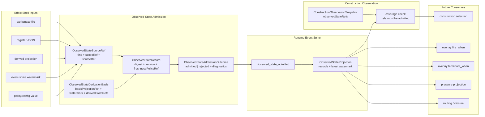

# M03 Observed State Admission Structural Carrier Diagram

**Status**: Active
**Date**: 2026-05-16
**Ticket**: T-136

## Authority Notes

- Effect-shell reads are ingress data. They are not runtime truth until admitted
  as `ObservedStateRecord`.
- `observed_state_admitted` is the replay-visible event boundary.
- `ObservedStateProjection` is the stable read model consumed by construction
  snapshots and later overlay frames.
- `ConstructionObservationSnapshot.observedStateRefs` prevents selection context
  from hiding private controller reads.
- Stale or mismatched observations reject before they can affect selection,
  routing, pressure projection, or closure.
- Process cwd and in-memory controller variables are excluded unless a governed
  predicate declares them and admits them through the observed-state carrier.
