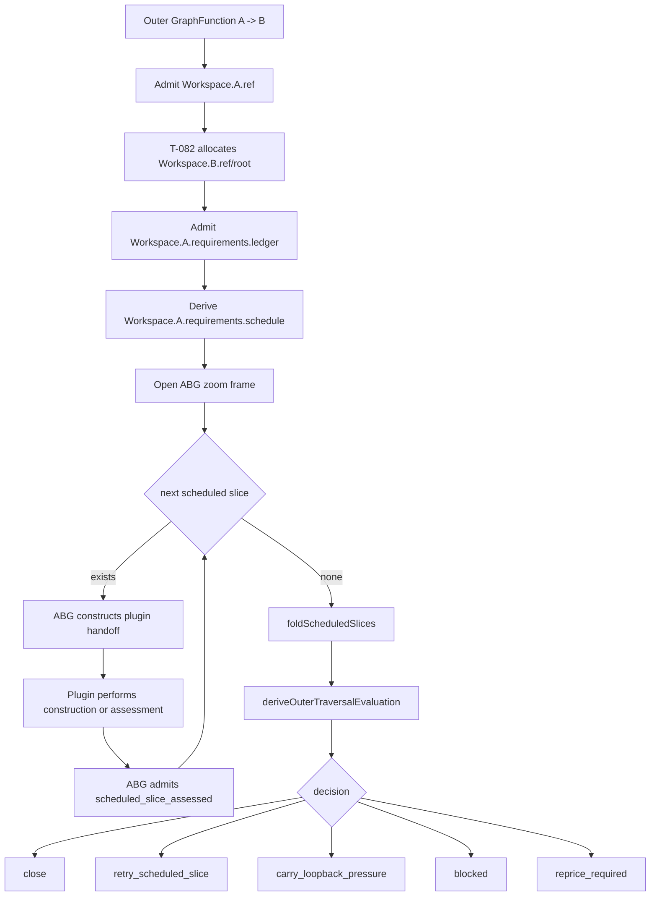

# M03 Output Allocation And Workspace Zoom Foldback Derivation

**Status**: Active
**Date**: 2026-05-02
**Tickets**: T-082, T-100, T-102
**Purpose**: define the ABG-owned TypeScript building block for input-only
output allocation and workspace-visible obligation schedule foldback.

## Source Authority

- `specification/INTENT.md`
- `specification/PRODUCT.md`
- `specification/requirements/gtl/REQ-L-GTL3-GRAPHFUNCTION.md`
- `specification/requirements/gtl/REQ-L-GTL3-HOF.md`
- `specification/requirements/gtl/REQ-L-GTL3-RECURSE.md`
- `specification/requirements/abg/REQ-R-ABG3-BINDING.md`
- `specification/requirements/abg/REQ-R-ABG3-EVENTS.md`
- `specification/requirements/abg/REQ-R-ABG3-FRAME.md`
- `specification/requirements/abg/REQ-R-ABG3-LINEAGE.md`
- `specification/requirements/abg/REQ-R-ABG3-PROVENANCE.md`
- `specification/requirements/abg/REQ-R-ABG3-RUN.md`
- `.ai-workspace/tickets/active/T-082-define-and-realize-abg-output-instance-allocation-for-input-only-graph-function-start.md`
- `.ai-workspace/tickets/active/T-100-define-abg-zoomed-workspace-asset-obligation-schedule-and-foldback-evaluation.md`
- `.ai-workspace/tickets/active/T-102-formalize-abg-eval-suite-projection-artifacts-and-repeatable-sandbox-runs.md`

Existing requirement authority is sufficient for the first implementation
slice. T-082 and T-100 remain active until the public manual sandbox and any
constitutional requirement wording updates are completed.

## STDO Triage

The lawful re-entry is `requirement_reprice`, then design. The missing truth is
runtime-owned allocation and foldback law, not product-local controller code.

T-082 owns the lower primitive:

```text
input binding + graph-function output declaration
  -> ABG output instance allocation
  -> output binding event
  -> materialization observation event
  -> output allocation projection
```

T-100 owns the higher primitive:

```text
Workspace.A.ref + Workspace.B.ref/root
  -> Workspace.A.requirements.ledger
  -> Workspace.A.requirements.schedule
  -> zoom frame
  -> scheduled slice dispatch/assessment
  -> foldback projection
  -> outer A -> B evaluation
```

T-102 owns the eval projection over those runtime facts:

```text
eval suite/task
  -> isolated trials over T-082/T-100 runs
  -> outcome and grade vectors
  -> aggregate pass@k / pass^k projection
```

## Ownership

| Surface | Owner |
| --- | --- |
| Graph-function contract | GTL |
| Runtime run/work/vector identity | ABG |
| Output asset identity and write root | ABG |
| Workspace system plane over `.ai-workspace` | ABG projection |
| Obligation ledger carrier | ABG runtime/product-neutral carrier |
| Schedule carrier and next-slice selection | ABG |
| Plugin handoff manifest | ABG |
| Construction work | F_D/F_P/F_H plugin as declared by the graph function |
| Requirement-by-requirement semantic quality assessment | Downstream domain/F_P evaluator |
| Runtime events and projections | ABG |
| Domain meaning of obligations | Downstream product evaluator |
| Eval suite/task/trial/outcome projection | ABG proof/test projection |
| Semantic grade rows | F_P/F_H domain evaluator |

Plugins may produce work, payloads, evidence, and assessments. Plugins may not
emit runtime truth, own the schedule, choose the next slice, close the outer
edge, or write outside the allocated output root.

## Carrier Families

T-082 introduces:

- `WorkspaceAssetBinding`
- `OutputInstanceAllocation`
- `OutputPluginHandoffManifest`
- `OutputAllocationProjection`
- `output_instance_allocated`
- `output_binding_admitted`
- `output_materialization_observed`

T-100 introduces:

- `WorkspaceSystemProjection`
- `ObligationLedgerAsset`
- `ObligationLedgerRow`
- `ObligationScheduleAsset`
- `ObligationScheduleItem`
- `ZoomFrame`
- `ScheduledSliceDispatch`
- `ScheduledSliceAssessment`
- `ZoomFoldbackEvaluation`
- `OuterTraversalEvaluation`
- `WorkspaceZoomProjection`
- `workspace_obligation_ledger_admitted`
- `workspace_obligation_schedule_derived`
- `zoom_frame_opened`
- `scheduled_slice_dispatched`
- `scheduled_slice_assessed`
- `zoom_foldback_evaluated`

T-102 introduces:

- `EvalSuiteSpec`
- `EvalTask`
- `EvalTrial`
- `EvalOutcome`
- `EvalGradeVector`
- `EvalAggregateProjection`

## Functional Boundary

The implementation exposes pure functions:

```text
admitWorkspaceAssetBinding(raw) -> Result<WorkspaceAssetBinding>
deriveOutputInstanceAllocation(request) -> Result<OutputInstanceAllocation>
deriveOutputAllocationProjection(events) -> OutputAllocationProjection
deriveWorkspaceSystemProjection(workspaceRoot, assetRefs) -> WorkspaceSystemProjection
deriveObligationLedgerAsset(A, rows) -> Result<ObligationLedgerAsset>
deriveObligationSchedule(ledger) -> Result<ObligationScheduleAsset>
openZoomFrame(basis, A, B, ledger, schedule) -> ZoomFrame
deriveNextScheduledSlice(schedule, assessments) -> SliceDecision
admitScheduledSliceAssessment(raw, schedule) -> ScheduledSliceAssessment
foldScheduledSlices(schedule, assessments) -> ZoomFoldbackEvaluation
deriveScheduledSliceAssessmentsFromEvents(events) -> ScheduledSliceAssessment[]
deriveZoomFoldbackEvaluationFromEvents(events) -> ZoomFoldbackEvaluation
deriveOuterTraversalEvaluation(foldback) -> OuterTraversalEvaluation
deriveWorkspaceZoomProjection(events) -> WorkspaceZoomProjection
constructEvalSuiteSpec(raw) -> EvalSuiteSpec
constructEvalTask(raw) -> EvalTask
constructEvalTrial(raw) -> EvalTrial
constructEvalOutcome(raw) -> EvalOutcome
constructEvalGradeVector(raw) -> EvalGradeVector
deriveEvalAggregateProjection(suite, tasks, trials, outcomes, grades) -> EvalAggregateProjection
```

Effects remain outside the algebra:

- filesystem writes,
- id/time generation,
- event append,
- process or plugin dispatch,
- CLI rendering,
- workspace asset publication.

## Closure Predicate

The foldback predicate is a deterministic projection over the schedule and
admitted assessments. It exposes the five named conjuncts so closure is not
hidden behind a count-only decision:

```text
close iff carryConverged
         and fulfillmentConverged
         and admitted
         and targetCertificationPassed
         and fdRecheckPassed
```

The current slice implements those conjuncts as:

- `carryConverged`: every schedule item has a current assessment and no current
  conflict.
- `fulfillmentConverged`: every current scheduled slice assessment is fulfilled
  and no open, blocked, runtime-failure, missing, or conflicting item remains.
- `admitted`: foldback was computed from admitted carriers and event replay.
- `targetCertificationPassed`: fulfilled assessments carry evidence refs and
  cover required output refs.
- `fdRecheckPassed`: deterministic mechanical recheck over admitted output refs
  and evidence shape passed.

Requirement satisfaction itself is not an F_D decision. The semantic quality
assessment is domain/F_P: it evaluates `A.req_i -> B.result_i` for each
scheduled slice and emits a finding class. F_D may validate mechanics such as
path containment, digest, schema, target materialization, or output refs.

Runtime failure is not semantic failure. A `runtime_failed` assessment whose
failure class is in the retry allowlist
`{transport_failure, no_output, contract_failure}` creates
`retry_scheduled_slice` when there is no current semantic fulfillment. A later
runtime failure does not erase an earlier fulfilled semantic assessment. A
fulfilled assessment may carry a retryable runtime failure annotation when a
valid artifact was salvaged after transport failure.

Projection uses latest-assessed-per-slice semantic truth. Earlier slice
assessments remain in event history but do not union into the current foldback
decision. Multiple conflicting semantic assessments at the same latest attempt
produce `reprice_required`.

Missing assessment is not closure. It creates typed same-edge retry pressure.
`semantic_fulfillment_gap` creates same-edge retry pressure.
`traceability_reference_gap` produces loopback pressure. Non-retryable runtime
or policy blockers block. The foldback decision is the only source for outer
A-to-B closure in this building block.

`zoom_foldback_evaluated` is not trusted as an assertion. When callers provide a
zoom frame and schedule to `deriveWorkspaceZoomProjection`, the projection
replays `scheduled_slice_assessed` events into typed assessments, recomputes the
foldback, and rejects any asserted foldback event whose decision or counts differ
from the replay-derived value.

## Structural Flow



## IACS

| Interface | Assumption | Contract | Structure |
| --- | --- | --- | --- |
| output allocation | basis has workspace root and output declaration | allocation root is under `.ai-workspace/runtime/runs/<run>/assets/...` | `OutputInstanceAllocation` |
| output binding | allocation exists | binding source is `abg_allocation` | `output_binding_admitted` |
| materialization observation | observed path is under allocated write root | projection rejects outside-root materialization | `output_materialization_observed` |
| ledger admission | A is an input workspace asset | ledger rows have stable obligation ids | `ObligationLedgerAsset` |
| schedule derivation | ledger rows are finite | one schedule item per obligation row | `ObligationScheduleAsset` |
| slice assessment | item exists in schedule | status is fulfilled, partial, blocked, or runtime_failed | `ScheduledSliceAssessment` |
| fulfilled assessment | item requires output refs | evidence refs are non-empty and all required outputs are present | `ScheduledSliceAssessment` |
| foldback | schedule and assessments are replay-derived | decision is close, retry, loopback, blocked, or reprice | `ZoomFoldbackEvaluation` |
| asserted foldback | a foldback event appears in replay | asserted decision and counts match recomputed foldback | `WorkspaceZoomProjection` |
| outer evaluation | foldback exists | closureAllowed only when foldback decision is close | `OuterTraversalEvaluation` |

## Proof Surface

First-slice proof lives in:

- `test_env/tests/test_t082_output_allocation_unit.test.mjs`
- `test_env/tests/test_t100_workspace_zoom_foldback_unit.test.mjs`
- `test_env/sandbox/test_t100_mini_data_mapper_lifecycle_sandbox.test.mjs`

The tests prove:

- input-only output allocation creates an ABG-owned output root,
- events project allocated binding and materialization truth,
- unsafe output paths and collisions fail,
- dot-dot materialization escapes and plugin writes outside the allocated root
  fail,
- public start can carry typed input bindings and requested outputs into basis
  truth,
- ledger and schedule assets are inspectable through stable refs,
- replayed slice assessments fold to outer close and asserted foldback events
  must match replay-derived truth,
- fulfilled slice assessment requires evidence and required output coverage,
- zoom frame and scheduled handoff lineage is checked against the basis, input,
  output allocation, ledger, schedule, and T-082 manifest,
- missing assessment creates same-edge retry pressure,
- runtime failure before fulfillment remains retryable,
- later runtime failure does not erase prior fulfilled semantic truth,
- latest-assessed-per-slice projection lets a later fulfilled assessment
  supersede an earlier semantic gap while preserving the earlier event,
- conflicting latest semantic evidence produces reprice pressure,
- artifact salvage admits fulfilled semantic evidence with a typed retryable
  transport-failure annotation,
- finding-class counts distinguish `semantic_fulfillment_gap` from
  `traceability_reference_gap`,
- the mini data-mapper sandbox creates a timestamped `test_runs` workspace with
  10 bootstrapped requirements, ABG-owned output allocations, ledger/schedule
  assets, bounded random fixed-feature transform attempts, domain/F_P
  requirement-quality assessments over the materialized artifact, event stream,
  projections, foldback/outer evaluation,
  postmortem, and materialized design, implementation, test-suite, and archive
  outputs.
- the five-rule parity lane proves the test35 algorithmic predicates through
  `npm run test:t100:five-rule` and the aggregate
  `npm run test:t100:test35-parity`.

## Active Limits

This first slice is not the final odd_sdlc T-109 parity closure. It supplies
the ABG/GTL building block and runnable parity proof. Remaining downstream work
is to consume it in odd_sdlc traversal and to choose an operator-facing
rerun/tuning command if this sandbox is promoted from test lane to public review
loop.
