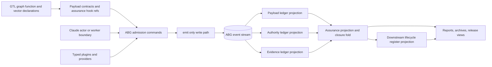
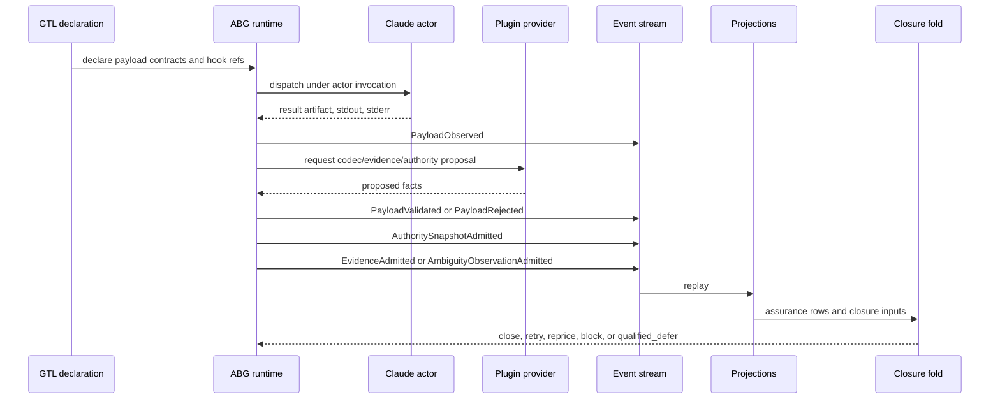
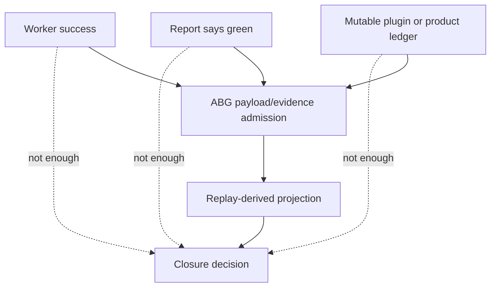
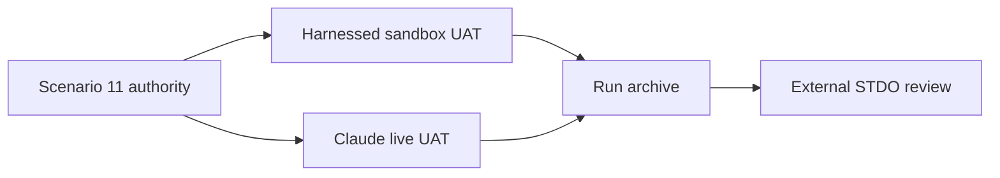

# M03 Payload Ledger Event Topology Structural Carrier Diagram

**Status**: Active
**Date**: 2026-04-29
**Derived from**: [M03_PAYLOAD_LEDGER_EVENT_TOPOLOGY_DERIVATION.md](./M03_PAYLOAD_LEDGER_EVENT_TOPOLOGY_DERIVATION.md), [M03_PAYLOAD_LEDGER_EVENT_TOPOLOGY_FIRST_SLICE_IACS.md](./M03_PAYLOAD_LEDGER_EVENT_TOPOLOGY_FIRST_SLICE_IACS.md), [T-095](../../../../.ai-workspace/tickets/active/T-095-define-event-sourced-abg-payload-ledger-and-legal-proof-topology.md)

## Target Architecture

## Source Fact Flow

## Closure Prohibition

## Carrier Ownership

| Carrier | Owner | Writes truth? |
| --- | --- | --- |
| GTL payload contract declaration | GTL publication | no runtime writes |
| provider proposal | plugin | no |
| payload body | worker/product/archive | no runtime truth by itself |
| payload envelope | ABG | yes, through event admission |
| payload event | ABG | yes, through `emit()` |
| payload ledger | ABG projection | no |
| lifecycle register | downstream projection | no |
| report/archive | downstream projection | no |

## Target Test Flow

