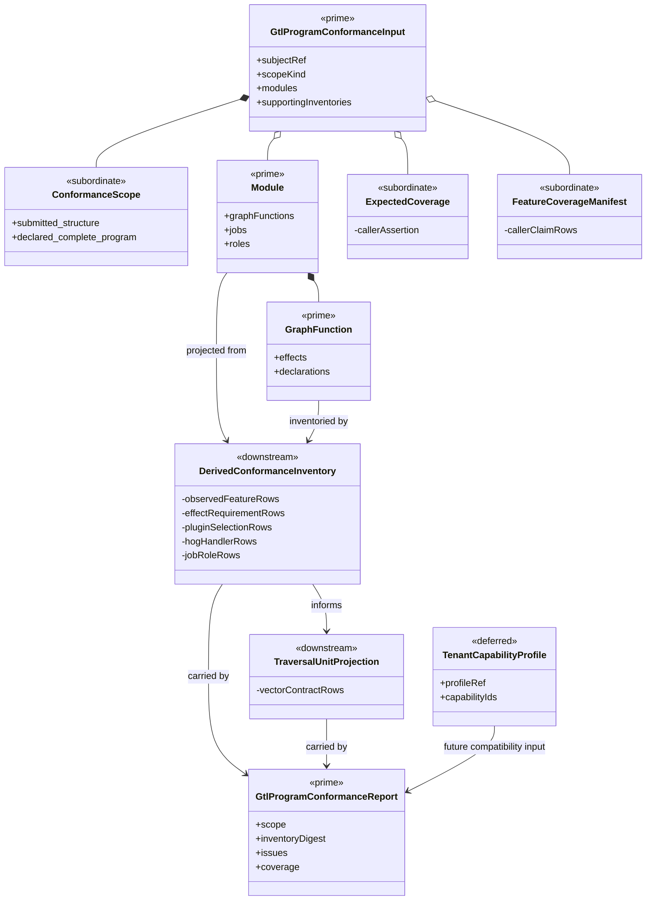
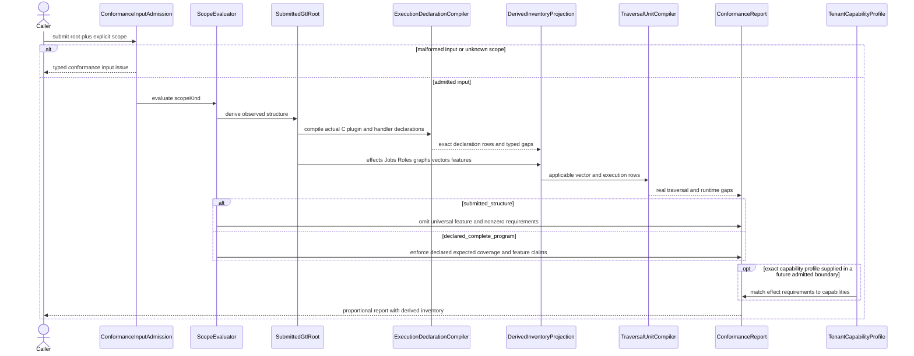
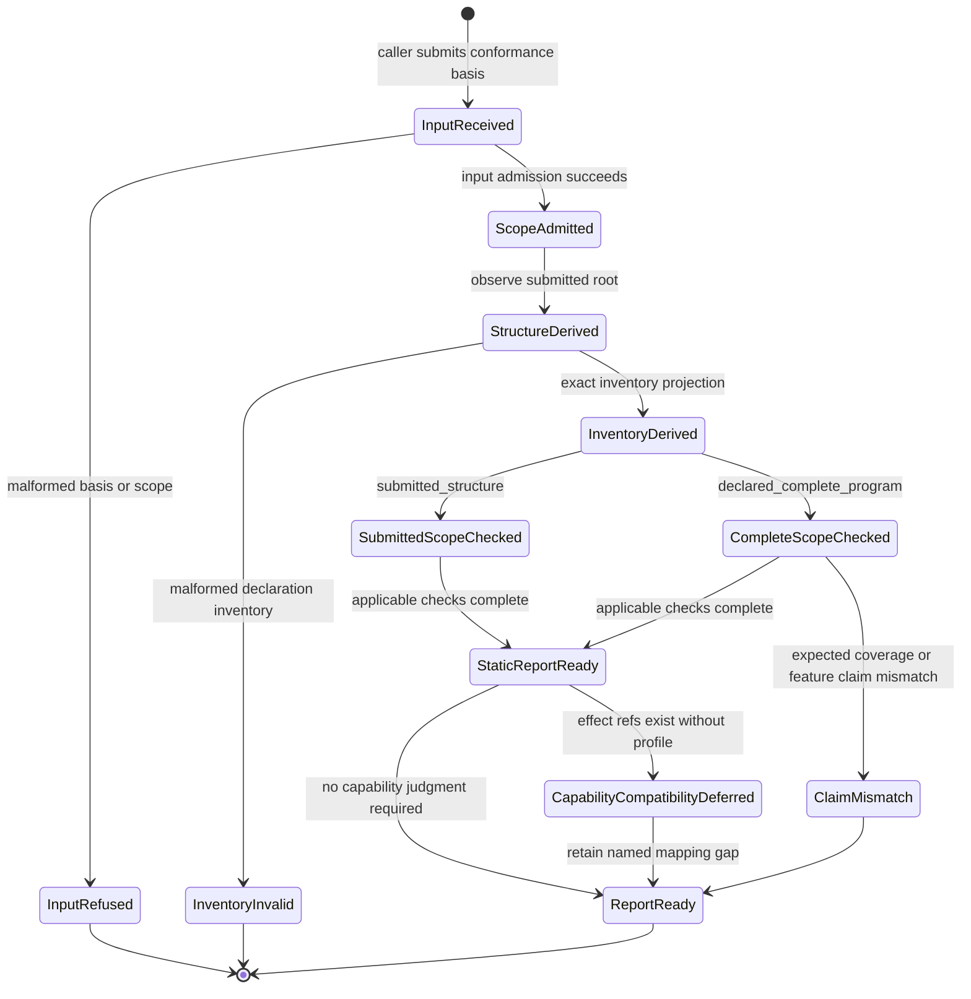

# M03 Proportional Conformance Inventory Behavior Design

**Design verdict**: `sound_pending_explicit_fh_acceptance`
**Implementation admission**: `provisional_implementation_landed_for_review`
**Ticket**: [T-264](../../../../.ai-workspace/tickets/active/T-264-close-proportional-conformance-inventory.md)
**Owning module**: M03 engine conformance
**Change class**: `design_reframe`
**Delivery phase**: DS-1 conformance foundation

## Boundary

This design closes one conformance read-model relation:

```text
admitted conformance input
  -> explicit conformance scope
  -> feature presence derived from submitted structure
  -> applicable declaration inventory extracted from admitted GTL
  -> exact structural checks
  -> proportional conformance report
```

The current `typecheckGtlProgram` requires caller-authored `expectedCoverage`
and a 26-row T-153 feature manifest even when the caller submits only an
admitted Module for a bounded compiler probe. It then requires almost every
coverage count to be nonzero. T-252 therefore receives universal coverage and
feature-classification issues unrelated to the features in its submitted root.

The opposite shortcut is also invalid. T-252 contains real GraphFunction
effects, `abg.plugin_selection` declarations, HOG handler bindings, C programs,
GraphVectors, and runtime gaps. Marking those feature families `not_used`,
hard-coding `pluginContractCount = 0`, or deleting full-root conformance would
hide real structure.

The correction makes scope explicit and derives applicability from admitted
structure. It does not make the complete-program gate optional, and it does not
turn T-252's 734 current issues into a target count. Real traversal, C, HOF,
recursion, result-admission, and runtime gaps remain.

## Authority

- `GOALS.md` DS-1 requires conformance to report only structurally applicable
  inventory while preserving real typed gaps.
- `PRODUCT.md` assigns whole-program relations and realization gaps to the M03
  semantic compiler.
- `REQ-L-GTL3-CONTRACT-LAW-API-009/-010/-016/-017` require ABG-owned,
  fail-closed program admission and typed traversal/conservation projections.
- `REQ-L-GTL3-GRAPHFUNCTION-005` makes GraphFunction effects statically
  analyzable and matchable.
- `REQ-L-GTL3-C-ALGEBRA-011/-014/-016` assign execution-declaration
  precedence, compiler completeness, and compile-before-effects law.
- `REQ-R-ABG3-PLUGIN-SEAMS-001..004` define exact scalar seams, the sole
  GraphFunction selection attachment point, and fail-closed selection.
- `REQ-R-ABG3-HANDLERS-001/-011/-012` require census-bound handler fidelity and
  one fail-closed interpretation seam.
- `REQ-M-GTL3-CAPABILITY-001..009` requires a separate exact tenant capability
  profile before effect-to-capability compatibility can be proved.

No product or requirement reprice is needed for structural scope and inventory
extraction. One ticket sentence does require F_H clarification: T-264 cannot
prove actual effect-to-capability compatibility without the separate admitted
capability-profile authority required by `REQ-M-GTL3-CAPABILITY`.

## Current Evidence

The T-252 checkpoint reports 734 full-conformance issues across 27 rule ids.
The largest groups are real per-vector gaps, not noise:

| Current rule family | Count | Current disposition |
|---|---:|---|
| C-algebra semantic not realized | 42 | retain under DS-2/DS-3 owners |
| GraphVector target-carrier required | 35 | retain under T-255 |
| GraphVector edge-closure required | 35 | retain under T-255 |
| traversal-unit execution and conservation rows | 35 per applicable rule | retain under T-255 |
| T-153 feature row required | 26 | remove in submitted-structure scope |
| expected-coverage required/nonzero/count | current caller-omission noise | replace with explicit scope law |
| HOF/application semantic not realized | 3 | retain under T-260/T-262/T-255 |

The goal is not `734 -> 0`. The goal is:

```text
real issue set
  = issues derivable from submitted structure
  + issues required by an explicit complete-program claim

noise
  = issues requiring unused families merely because the checker knows they exist
```

## Irreducible Architectural Carrier Set

| Carrier | Stereotype | Visibility | Authority | Meaning |
|---|---|---|---|---|
| `GtlProgramConformanceInput` | prime, authoritative | public M03 | admitted caller submission | one selected root plus explicit scope and any supplied supporting inventories |
| `ConformanceScope` | subordinate, authoritative | nested input | caller claim admitted by M03 | either bounded submitted structure or declared complete program |
| admitted `Module` and `GraphFunction` | prime, authoritative | GTL input | M01/M02 admitted declaration truth | source structure from which feature applicability is derived |
| `DerivedConformanceInventory` | downstream | module-local/read model | M03 projection | exact observed feature, effect, plugin, handler, Job, Role, graph, program, and vector rows |
| `TraversalUnitProjection` | downstream | public report payload | existing M03 projection | per-vector target, closure, composition, result-interface, and conservation truth |
| `GtlProgramConformanceReport` | prime, downstream | public M03 | deterministic conformance result | issues, counts, digests, scope, and derived inventory over one submitted basis |
| tenant capability profile | deferred, authoritative | mapping/product input | `REQ-M-GTL3-CAPABILITY` | exact capability identities needed for effect compatibility |

No new GTL declaration carrier is introduced. `DerivedConformanceInventory`
is one read model inside the existing conformance report, not another admission
authority or runtime catalog.

### Subordinate inventory rows

The derived inventory contains rows for:

```text
published GraphFunctions and materialized GraphVectors
GraphFunction effect refs
GraphFunction-local scalar plugin selections
HOG program, program-catalog, handler-binding, and handler-config declarations
Module Jobs and Roles
external supporting inventories actually supplied to the conformance input
structural feature applicability and requirement refs
```

Each row cites its admitted host and declaration path. Rows do not execute,
resolve runtime plugins, select workers, or manufacture capability truth.

## Explicit Scope Contract

`GtlProgramConformanceInput` gains one closed scope discriminant:

```text
scopeKind = submitted_structure | declared_complete_program
```

### Submitted-structure scope

Use for T-252 and other bounded compiler probes.

- Presence derives from submitted Modules, GraphFunctions, GraphVectors,
  declarations, and supplied supporting rows.
- `expectedCoverage` is optional assertion data. When supplied, exact values are
  checked; omission is not itself an issue.
- `featureCoverageManifest` is optional assertion data. Supplied rows are
  checked for contradiction; no universal 26-row manifest is required.
- Zero Jobs, Roles, overlays, public starts, prompt assets, plugin contracts, or
  source-identity rows is lawful when no submitted relation makes that family
  applicable.
- Every observed declaration still receives its applicable checks.

### Declared-complete-program scope

Use for release, installed-product, and complete-program claims.

- `expectedCoverage` remains required and every supplied expected count must
  equal observed inventory.
- Zero is lawful for an optional family unless submitted or claimed structure
  requires a nonzero row.
- The feature manifest remains required for the product's declared feature
  claims and may classify unused families with explicit reason refs.
- A feature marked `present` requires derived or supplied inventory evidence.
- A feature marked `not_used` contradicting observed structure fails.

The discriminant prevents an omitted complete-program contract from being
silently treated as a bounded probe and prevents a bounded probe from being
judged as though it claimed every product feature.

## Structural Applicability

Feature applicability is derived by deterministic projections, not labels:

| Feature family | Applicability evidence |
|---|---|
| module publication | at least one admitted Module |
| graph function | admitted GraphFunction reachable from the submitted root |
| graph/vector traversal | materialized inline graph and contained vector |
| target/closure/conservation | executable GraphVector under the applicable traversal contract |
| C program | admitted program or catalog declaration on the exact host/vector |
| HOF/application/recursion | admitted canonical application declaration |
| scalar plugin selection | actual `abg.plugin_selection` on a GraphFunction |
| HOG handler/config | actual handler binding/config declaration on a GraphFunction |
| Job/Role | Module declaration or supplied Job/Role binding referencing it |
| overlay/public start | supplied admitted row or declaration referencing it |
| prompt asset | Node/AssetSurface or supplied prompt-asset row |
| source identity | supplied source identity/policy/review rows |

Human-readable names, tags, URI prefixes, and nonzero test counters do not make
a feature applicable.

## Declaration Inventory Rules

### Effects

The inventory records every exact `GraphFunction.effects` ref and its host.
It enforces:

1. no duplicate effect ref on one GraphFunction;
2. applied GraphFunctions preserve the source effects required by their closed
   application equations;
3. a GraphFunction containing a named child workflow or applied child includes
   every child effect ref when that child relation is compiler-visible; and
4. effect refs remain distinct from capability, plugin, and handler refs.

The compiler must not derive a local effect identity from `Operator.name`, URI
spelling, regime, tag, or plugin selection. T-252's local authoring helper may
produce its exact declared refs, but the generic compiler cannot treat that
private construction convention as language law.

### Plugin selection

The inventory reuses `pluginSelectionFromDeclarationAttrs` and existing closed
seam law. It records one host-local row per selected seam/ref and enforces:

- no duplicate selection declaration or duplicate seam;
- no unknown seam;
- no direct `plugin://` value in domain `Operator.binding`;
- no inherited outer-GraphFunction selection; and
- where existing C/execution compilation exposes a used scalar seam set, the
  local selection equals that set with no missing or unused seam.

If current compilation cannot expose applicability for a lawful term, the
report emits a typed inventory gap. It does not infer from names.

### HOG handlers and configs

The inventory reuses `hogHandlerBindingsFromDeclarationAttrs`, handler-config
admission, C-program catalogs, and execution-declaration compilation. It records
program ref, stage role, arm id, regime, handler ref/class, and config ref. It
enforces exact applicable program/stage/arm coverage and rejects duplicate,
conflicting, unresolved, or host-incompatible rows.

Handler binding is not plugin selection. A plugin selection cannot satisfy a
missing handler row, and a handler row cannot satisfy a missing scalar seam.

### Jobs and Roles

Module Jobs and Roles are counted from the admitted Module. External Job/Role
binding rows remain separate. Direct catalog invocation may lawfully have zero
local Jobs and Roles. A nonzero universal minimum is forbidden.

### Declaration inventory is not execution evidence

All rows above are static declaration truth. Counts prove neither invocation
nor non-invocation. T-252 separately proves only that the canonical body source
dependency closure reaches none of its fenced execution or product
implementation directories; it performs no runtime-call observation.

## Effect-Capability Authority Gap

`REQ-M-GTL3-CAPABILITY` requires a versioned tenant capability profile with
exact public capability identities. No such admitted profile carrier is present
in `GtlProgramConformanceInput`, the T-252 Module, or the current public-contract
catalog input to this compiler.

Therefore this design can produce exact `EffectRequirementProjection` rows but
cannot lawfully conclude:

```text
declared effect ref is supported by selected engine capability profile
```

from package version, plugin ref, handler ref, effect URI spelling, or test
presence. Any such conclusion would fabricate the missing authority.

### Required F_H ruling

Narrow T-264 closure to structural scope, exact declaration inventory,
transitive effect visibility, and matchable effect-requirement projection.
Keep the ownership relation explicit: T-264 projects effect requirements, DS-4
supplies the published exact tenant capability profile, and T-255 admits that
profile and performs effect-to-capability compatibility admission.

This is proportionate because:

- T-252 body bytes remain frozen;
- no new GTL atom or private name convention is needed;
- the current requirement already places capability truth in a separate
  versioned profile; and
- reopening T-252 to add a local effect/capability carrier would create a new
  language authority to solve a missing mapping input.

The provisional implementation realizes the structural inventory and matchable
effect-requirement projection only. Explicit F_H acceptance of this boundary is
still required.

## Domain Model



## Sequence Model



No plugin, handler, worker, event, traversal, or product effect executes in this
sequence. Execution declaration compilation is deterministic inspection.

## State Model



`ReportReady` may still be non-passing because it honestly retains real generic
compiler or runtime gaps.

## Architectural Axioms

1. **PC-01 - Explicit scope.** A conformance run declares bounded submitted
   structure or complete program. Omission cannot silently choose the weaker
   claim.
2. **PC-02 - Structure derives presence.** Actual admitted carriers and
   declarations determine observed feature presence. Names, tags, test counters,
   and caller prose do not.
3. **PC-03 - Claims do not create inventory.** Expected coverage and feature
   manifests are assertions checked against structure; they cannot make a
   missing row exist.
4. **PC-04 - Zero can be lawful.** An unused optional family may have zero rows.
   Direct catalog invocation does not invent Jobs or Roles.
5. **PC-05 - Present structure is never suppressed.** An actual effect, plugin
   selection, handler, program, Job, Role, graph, or vector remains inventoried
   even when the caller omits or contradicts its claim row.
6. **PC-06 - Declaration authorities remain separate.** Effects, capabilities,
   domain operator bindings, scalar plugin selections, HOG handlers/configs, and
   Jobs/Roles are distinct rows. No count or ref substitutes for another.
7. **PC-07 - Existing compilers are reused.** T-264 consumes canonical
   declaration parsers and execution compilers. It does not reparse opaque Attrs
   by local convention.
8. **PC-08 - Effect inference is bounded.** Child/transitive requirements may be
   derived from compiler-visible structure. Local effect identity is not inferred
   from operator names, tags, regimes, or URI spelling.
9. **PC-09 - Capability truth is external.** Actual effect compatibility requires
   an admitted exact tenant capability profile. Package presence or plugin refs
   cannot fabricate it.
10. **PC-10 - Real gaps remain.** Proportionality removes inapplicable checks,
    not traversal, C, HOF, recursion, admission, or runtime gaps derivable from
    the root.
11. **PC-11 - Inventory is not execution.** Declaration counts do not prove
    calls or no calls.
12. **PC-12 - Effect freedom.** Conformance admission, compilation, inventory,
    and report projection execute no runtime or product effect.

## IACS And Interface Contract

### Interface contract

| Transform | Input | Output | Failure/gap |
|---|---|---|---|
| admit scope | conformance input plus `scopeKind` | admitted scope | unknown/missing scope issue |
| derive observed structure | admitted Module/GraphFunction/supporting rows | observed feature set | malformed root remains ordinary admission issue |
| extract declaration inventory | admitted hosts and existing declaration compilers | effect/plugin/handler/program/Job/Role rows | typed malformed/unresolved declaration issue |
| check submitted scope | derived inventory plus optional assertions | applicable issues only | assertion contradiction when supplied |
| check complete scope | derived inventory plus required complete claims | complete-program issues | missing/mismatched claims |
| project effect requirements | GraphFunction effects plus visible child relations | exact matchable effect rows | missing transitive visibility issue |
| match capabilities | effect rows plus exact tenant capability profile | compatibility rows | deferred until profile authority exists |
| build report | scope, inventory, traversal projection, issues | conformance report | never executes the program |

### Coverage output

The report distinguishes at minimum:

```text
external supplied inventory counts
embedded GTL declaration counts
derived applicability counts
real issue counts by rule and owner
scope-claim mismatch counts
```

`pluginContractCount` retains its existing meaning: supplied plugin contract
definitions. It no longer stands in for embedded scalar selection or HOG
handler inventory. Separate counts expose those declaration families.

## Proof Matrix

| Proof family | Positive | Negative |
|---|---|---|
| explicit scope | both closed scope variants admit | absent/unknown scope refuses |
| bounded probe | T-252 derives only present families and retains real runtime gaps | missing universal 26-row manifest and zero optional inventories create no issue |
| complete program | existing complete fixture retains expected-count and feature-claim checks | missing/mismatched complete claims fail |
| lawful zero | direct catalog Module with zero Jobs/Roles passes applicability | Job/Role binding that references absent declarations fails |
| effect inventory | all exact host/effect refs appear once; child effects are visible transitively | duplicate effect or missing compiler-visible child effect fails; capability compatibility remains deferred |
| plugin inventory | exact GraphFunction-local seam rows extracted | duplicate/unknown/missing/unused seam or direct plugin Operator binding fails when applicability is decidable |
| handler inventory | exact program/stage/arm/regime/config rows extracted | duplicate, conflict, unresolved program, wrong host, or missing applicable row fails |
| authority separation | plugin contracts, selections, handlers, and effects have separate counts | one count or declaration satisfying another family fails |
| static reachability | declaration inventory coexists with source-import closure evidence | declaration count used as call/no-call evidence fails |
| capability honesty | effect requirement rows remain matchable and profile gap explicit | name/package/plugin based compatibility pass is impossible |
| T-252 oracle | body digest remains fixed; T-264 families leave active census after implementation | traversal/C/HOF/runtime families remain owned and visible |
| non-Consensus proof | broad fixture uses optional and present families together | hard-coded Consensus feature exception is absent |

## Cross-View Axiom Matrix

| Axiom | Authority | Domain evidence | Sequence evidence | State evidence | Native enforcement | Admission/compiler enforcement | Verdict | Gap owner |
|---|---|---|---|---|---|---|---|---|
| Scope is explicit and proportional | GOALS DS-1; CONTRACT-LAW-API-009/-010 | ConformanceScope is one subordinate discriminant | scope admitted before derivation | InputReceived cannot reach weaker scope by omission | closed union | input admission plus scope checks | `pass` | T-264 realization |
| Feature presence derives from structure | CONTRACT-LAW-API-016 | DerivedConformanceInventory consumes admitted root | root projects before claims are checked | StructureDerived precedes scope checks | readonly admitted carriers | deterministic inventory projection | `pass` | T-264 realization |
| Complete-program assurance is not weakened | C-ALGEBRA conformance-root law | complete scope retains claims | complete branch enforces claims | ClaimMismatch reaches report | explicit variant | expected count and manifest checks | `pass` | T-264 realization |
| Unused families may be zero | proportionality; Module law | Job/Role and optional families remain actual rows | applicability precedes nonzero checks | submitted scope reaches report with lawful zeros | exact arrays | structural references decide requirement | `pass` | T-264 realization |
| Effects remain visible and transitive | GF-005 | effect requirement rows cite hosts/children | extraction precedes report | missing transitive row is InventoryInvalid | readonly effect refs | structural child/application checks | `pass` | T-264 realization |
| Effect compatibility uses exact capability profile | CAPABILITY-001..009 | DS-4 TenantCapabilityProfile is deferred authority | DS-4 publishes; T-255 admits and decides compatibility | compatibility stays deferred without profile | no current carrier | no current input/admission path | `not_applicable` | DS-4 profile plus T-255 admission |
| Plugin and handler authorities are separate | PLUGIN-SEAMS-003; HANDLERS-001/-011 | distinct inventory rows | existing compilers emit each family | malformed rows reach InventoryInvalid | closed declaration types | canonical declaration parsers/compilers | `pass` | T-264 realization |
| Direct plugin Operator binding is invalid | C-ALGEBRA-011; T-252 design | Operator binding and selection rows distinct | inventory checks binding before report | violation is InventoryInvalid | Operator type remains data | conformance rule | `pass` | T-264 realization |
| Declaration counts do not prove execution | GF-005; compile-before-effects | inventory/report separate from runtime | no effect participant | no runtime lifecycle state | pure transforms | dependency fence | `pass` | T-264 realization |
| Real T-252 gaps remain | T-252 checkpoint | traversal projection remains downstream | compiler checks still run | ReportReady may be non-passing | unchanged body | exact rule census by owner | `pass` | T-255..T-262 |
| Runtime execution | outside T-264 | runtime absent | no runtime messages | no runtime states | not applicable | not applicable | `not_applicable` | T-255 onward |

## Proposed F_H Ruling

Accept the three-view design with one boundary correction:

```text
T-264 owns:
  explicit proportional scope
  structure-derived feature applicability
  exact embedded declaration inventory
  transitive/matchable effect requirement projection
  plugin/handler/Job/Role applicability enforcement

T-264 does not own:
  actual effect-to-capability compatibility without an admitted tenant profile
```

Accept this boundary only with the three-owner split: T-264 projects exact
requirements, DS-4 publishes the exact profile, and T-255 admits the profile and
decides compatibility. Do not add a local effect/capability mapping to Consensus
or infer one from strings.

## Closure Conditions

1. F_H explicitly resolves the effect-capability authority gap and accepts all three views.
2. T-263 closes strict raw Module admission before T-264 code.
3. Scope is explicit; bounded and complete claims cannot be confused.
4. Feature applicability and embedded inventory derive from admitted structure.
5. Complete-program expected coverage remains exact while optional unused
   families may lawfully be zero.
6. Effects, selections, handlers/configs, plugin contracts, Jobs, and Roles are
   inventoried separately with exact host/path evidence.
7. T-252 loses only T-264-owned scope/inventory gaps; its real generic gaps and
   canonical body digest remain.
8. A broad non-Consensus fixture proves both lawful omission and mandatory
   inventory failure.
9. Conformance execution remains effect-free.

## Non-Closure

- deleting full-root conformance or targeting zero issues;
- hard-coding T-252/Consensus exceptions;
- keeping implicit scope based only on whichever optional fields happen to be
  present;
- requiring every known feature family to have nonzero inventory;
- allowing a `not_used` claim to suppress observed structure;
- reporting embedded plugin/handler declarations as `pluginContractCount = 0`;
- requiring invented Jobs/Roles for direct catalog invocation;
- treating `Operator.binding` plugin URIs as selection or handler authority;
- treating declarations as execution/non-execution evidence;
- inferring effect identity or capability compatibility from names, URI
  spelling, package presence, plugin refs, or tests;
- adding a Consensus-specific compiler branch or changing T-252 body bytes.

## Non-Scope

- T-263 raw admission implementation;
- T-255 exact capability-profile admission and compatibility decision;
- T-256 request construction, T-257 F_P result admission, or T-258 F_H resume;
- T-259..T-262 runtime atoms;
- DS-4 catalog/public-contract publication and installed capability profiles;
- hostile-desktop or cryptographic conformance claims.

## Review Verdict

`sound_pending_explicit_fh_acceptance`. The structural scope and inventory
design uses existing admitted carriers and compilers. The provisional
implementation is ready for review after T-263 acceptance. Compatibility
remains split across T-264 requirement projection, the DS-4 published profile,
and T-255 admission.
