# M03 Requirement Proof Carry-Through Structural Carrier Diagram

**Ticket**: T-188
**Status**: Active design
**Date**: 2026-07-03
**Derived from**: [M03_REQUIREMENT_PROOF_CARRY_THROUGH_DERIVATION.md](./M03_REQUIREMENT_PROOF_CARRY_THROUGH_DERIVATION.md), [M03_REQUIREMENT_PROOF_CARRY_THROUGH_FIRST_SLICE_IACS.md](./M03_REQUIREMENT_PROOF_CARRY_THROUGH_FIRST_SLICE_IACS.md), [T-188](../../../../.ai-workspace/tickets/active/T-188-realize-requirement-proof-carry-through.md)

## Structural Relationships

```mermaid
classDiagram
  class EdgeRequirementEnvironment {
    <<existing>>
    <<authoritative>>
    +activeTerms
    +activeRelations
    +activeSpans
    +priorFolds
    +carriedResiduals
  }

  class RequirementProjection {
    <<existing>>
    <<authoritative>>
    +projectionRef
    +requirementId
    +evidenceRole
  }

  class RequirementEvidenceBinding {
    <<existing>>
    <<authoritative>>
    +evidenceRef
    +requirementId
    +evidenceRole
    +bindingStatus
  }

  class GtlContractFulfillmentBinding {
    <<existing>>
    <<GTL>>
    +obligationRef
    +requirementRef
    +realizationEvidenceRefs
    +testOrExecutionEvidenceRefs
    +evaluatorFindingRef
  }

  class GtlProgramTraversalUnitProjectionRow {
    <<existing>>
    <<authoritative>>
    +unitRef
    +graphFunctionRef
    +graphVectorRef
    +computeCompositionRefs
    +pluginResultInterfaceRefs
    +conservationBasisRefs
  }

  class EnginePluginInput {
    <<existing>>
    <<effect-edge>>
    +selectedCompositionRef
    +selectedCompositionDigest
    +graphFunctionId
    +vectorIndex
    +edge
    +instructionPromptManifest
  }

  class AdmittedPluginResultEnvelope {
    <<existing>>
    <<authoritative>>
    +envelopeRef
    +resultInterfaceRef
    +compositionRef
    +compositionDigest
    +evidenceRefs
  }

  class RequirementProofCarryThroughOutputEnvelope {
    <<subordinate>>
    -outputCandidateKind
    -admissionTargetKind
    -sourceRequirementObligationRefs
    -evidenceRoleRefs
    -proofObligationRefs
    -proofPolicyRefs
    -expectedEvidenceShapeRefs
    -proofStrengthRefs
    -depthClassRefs
    -proofStrengthAdmissionRefs
    -adversarialAttemptRefs
    -counterexampleRefs
    -replayDigest
  }

  class RequirementProofCandidateClassificationTable {
    <<subordinate>>
    -tableRef
    -sourceRef
    -tableDigest
    -rules
  }

  class RequirementProofCandidateClassificationRule {
    <<subordinate>>
    -ruleRef
    -stageRole
    -outputCandidateKind
    -admissionTargetKind
    -evidenceRoleRefs
  }

  class RequirementProofCoverageProjection {
    <<prime>>
    <<authoritative>>
    +projectionRef
    +edgeRef
    +coverageRows
    +witnessRows
    +foldbackRows
    +diagnostics
    +closureEligibility
  }

  class RequirementObligationCoverageRow {
    <<subordinate>>
    -sourceRequirementObligationRef
    -requirementRef
    -spanRefs
    -realizationObligationRefs
    -proofObligationRefs
    -status
  }

  class ProofShapeRow {
    <<subordinate>>
    -proofObligationRef
    -proofPolicyRef
    -expectedEvidenceShapeRefs
    -positiveEvidenceShapeRefs
    -negativeEvidenceShapeRefs
    -proofStrengthRefs
  }

  class DepthObligationPolicyRow {
    <<subordinate>>
    -proofPolicyRef
    -targetRefs
    -requiredDepthClassRefs
    -declaredDepthObligationRefs
    -notApplicableRows
    -residualRows
    -reentryRows
    -requiredAdversarialCheckRefs
  }

  class ProofStrengthAdmissionRow {
    <<subordinate>>
    -strengthRef
    -sourceRequirementObligationRefs
    -proofObligationRefs
    -proofPolicyRefs
    -expectedEvidenceShapeRefs
    -depthClassRefs
    -verifierRefs
    -adversarialAttemptRefs
    -counterexampleRefs
    -disposition
    -replayIdentity
  }

  class RequirementWitnessBindingRow {
    <<subordinate>>
    -witnessRef
    -sourceRequirementObligationRef
    -evidenceRoleRef
    -proofObligationRef
    -admissionRef
    -digest
  }

  class TraversalObligationCarryRow {
    <<subordinate>>
    -callerGraphFunctionRef
    -calleeGraphFunctionRef
    -graphCallId
    -frameId
    -carriedObligationRefs
    -replayIdentity
  }

  class ChildTraversalFoldbackRow {
    <<subordinate>>
    -childGraphCallId
    -sourceRequirementObligationRefs
    -coverageRefs
    -residualRefs
    -assuranceRefs
  }

  class RequirementFoldProjection {
    <<existing>>
    <<authoritative>>
    +foldRef
    +requirementId
    +state
    +evidenceRefs
    +residualPressureRefs
  }

  class RequirementResidualProjection {
    <<existing>>
    <<authoritative>>
    +residualRef
    +requirementId
    +pressureClass
  }

  class RequirementAssuranceClaim {
    <<existing>>
    <<authoritative>>
    +claimRef
    +requirementId
    +status
  }

  class RequirementQueryReadModel {
    <<existing>>
    <<downstream>>
    +requirementIds
    +evidenceRefs
    +foldRefs
    +residualRefs
  }

  EdgeRequirementEnvironment --> RequirementProofCoverageProjection : source active obligations
  RequirementProjection --> RequirementProofCoverageProjection : source projection roles
  RequirementEvidenceBinding --> RequirementWitnessBindingRow : admitted evidence source
  GtlContractFulfillmentBinding --> RequirementWitnessBindingRow : realization/proof pairing
  GtlProgramTraversalUnitProjectionRow --> EnginePluginInput : selected bind source
  EnginePluginInput --> AdmittedPluginResultEnvelope : effect output candidate
  AdmittedPluginResultEnvelope --> RequirementProofCarryThroughOutputEnvelope : minimal proof binding extension
  GtlContractFulfillmentBinding --> RequirementProofCarryThroughOutputEnvelope : derives req/proof pair
  RequirementProofCandidateClassificationTable --> RequirementProofCandidateClassificationRule : contains
  RequirementProofCandidateClassificationTable --> RequirementProofCarryThroughOutputEnvelope : derives candidate classification
  RequirementProofCarryThroughOutputEnvelope --> RequirementWitnessBindingRow : admitted candidate binds witness

  RequirementProofCoverageProjection *-- RequirementObligationCoverageRow : contains
  RequirementProofCoverageProjection *-- ProofShapeRow : contains
  RequirementProofCoverageProjection *-- DepthObligationPolicyRow : contains
  RequirementProofCoverageProjection *-- ProofStrengthAdmissionRow : contains
  RequirementProofCoverageProjection *-- RequirementWitnessBindingRow : contains
  RequirementProofCoverageProjection *-- TraversalObligationCarryRow : contains
  RequirementProofCoverageProjection *-- ChildTraversalFoldbackRow : contains

  RequirementProofCoverageProjection --> RequirementFoldProjection : gates satisfied state
  RequirementProofCoverageProjection --> RequirementResidualProjection : preserves non-closing pressure
  RequirementProofCoverageProjection --> RequirementAssuranceClaim : feeds assurance status
  RequirementProofCoverageProjection --> RequirementQueryReadModel : read-only downstream join
```

## Visibility And Ownership

| Surface | Visibility | Owner | Notes |
| --- | --- | --- | --- |
| `RequirementProofCoverageProjection` | public read-only query/projection | ABG | Prime projection family. Consumers cannot write it. |
| subordinate rows | module-local or nested public payload | ABG | Pattern-matched only through the projection. |
| `RequirementProofCarryThroughOutputEnvelope` | module-local/subordinate | ABG admission/projection | Extension of plugin output admission, not a new plugin result envelope family. |
| `RequirementProofCandidateClassificationTable` | module-local/subordinate | ABG admission/projection | Deterministic table; plugin labels alone do not admit output category truth. |
| `DepthObligationPolicyRow` | module-local or nested public payload | ABG projection over proof policy | Subordinate proof-depth row, not a peer proof policy. |
| `ProofStrengthAdmissionRow` | module-local or nested public payload | ABG projection/admission | Subordinate strength row; F_D-checkable or adversarially verified. |
| existing requirement carriers | existing visibility | ABG | Reused without fork. |
| existing plugin carriers | existing visibility | GTL declaration / ABG admission | Extended by declared fields where needed. |
| query/read models | downstream read-only | ABG | May summarize but must preserve replay refs. |

## Deferred Families

| Family | Status | Reason |
| --- | --- | --- |
| Rich proof-policy editor/import formats | Deferred | T-188 needs refs and shape identity, not an authoring UI. |
| Product-specific test semantics | Deferred to product overlays | ABG owns proof carry-through; products own domain proof policy content. |
| Separate disambiguation/ambiguity graph | Rejected | Narrative only; coverage/residual/assurance remain truth. |
| Independent plugin runtime | Rejected | Existing plugin contracts and result envelopes are extended minimally. |
