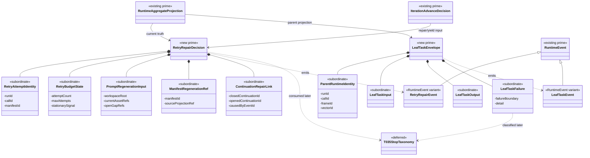

# M03 Retry/Repair And Leaf-Task Structural Carrier Diagram

**Status**: Active
**Date**: 2026-04-25
**Derived from**: [M03_RETRY_REPAIR_LEAFTASK_DERIVATION.md](./M03_RETRY_REPAIR_LEAFTASK_DERIVATION.md), [M03_RETRY_REPAIR_LEAFTASK_FIRST_SLICE_IACS.md](./M03_RETRY_REPAIR_LEAFTASK_FIRST_SLICE_IACS.md), [M03_GRAPH_FUNCTION_ITERATION_STRUCTURAL_CARRIER_DIAGRAM.md](./M03_GRAPH_FUNCTION_ITERATION_STRUCTURAL_CARRIER_DIAGRAM.md), [T-042](../../.ai-workspace/tickets/completed/T-042-design-typescript-m03-generic-retry-repair-and-leaf-task-governance.md)

## Purpose

Render retry/repair and bounded leaf-task governance as one `M03` carrier
topology so fresh attempt identity, current-state prompt/manifest truth,
continuation repair, and parent-bound subordinate work are visible before code
opens.

## Diagram

## Reading Rules

- `RuntimeAggregateProjection` and `IterationAdvanceDecision` are upstream
  carrier truth from the graph-function iteration design.
- `RetryRepairDecision` is the substrate-owned retry/repair planning carrier.
- `LeafTaskEnvelope` is the parent-bound subordinate work carrier.
- Retry and leaf-task facts are runtime event variants, not a second event
  stream.
- Final public stop-class projection remains deferred to `T-035` and
  `B-030-TS`.

## Sign-Off Claim

This diagram is lawful only if future TypeScript code:

- mints fresh retry attempt identity,
- regenerates prompt and manifest truth from current projection,
- treats prior manifests as evidence rather than current dispatch truth,
- closes and reopens continuation truth through events,
- keeps leaf tasks parent-bound,
- schema-validates leaf task input and output, and
- preserves failure-boundary distinctions without parsing worker internals.
