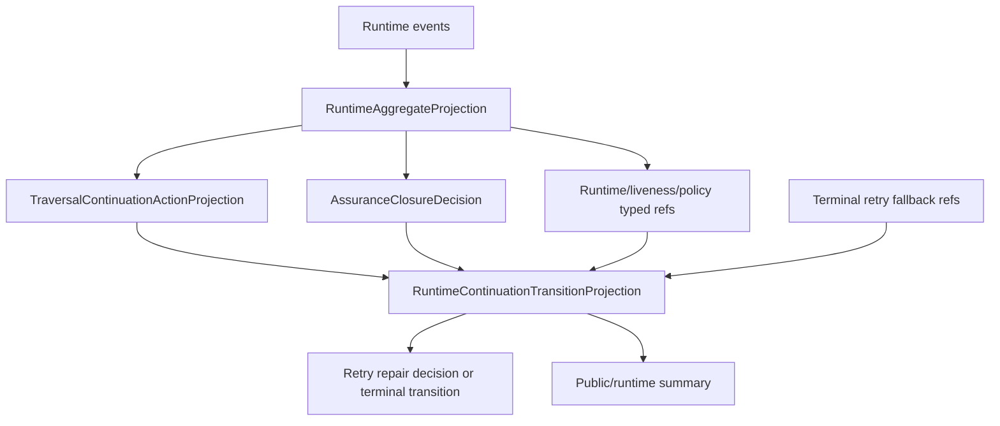
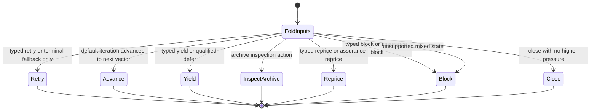
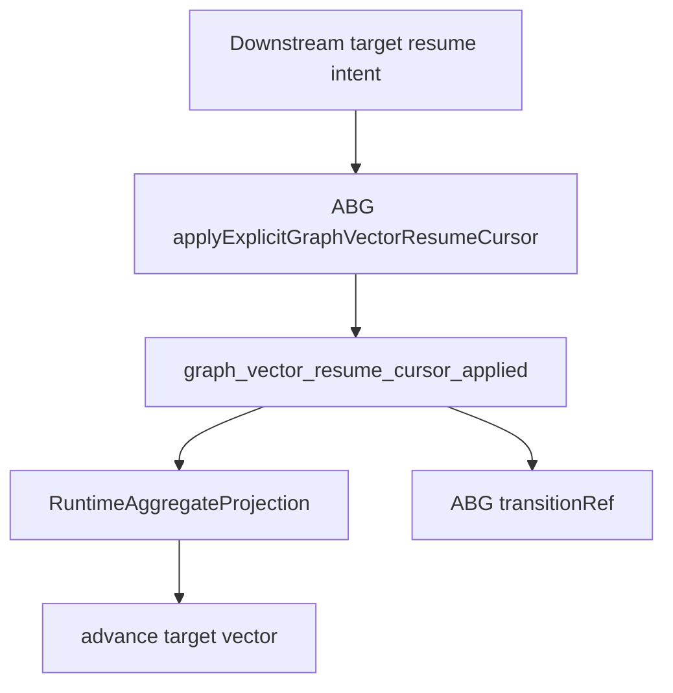

# M03 Runtime Continuation Transition Derivation

**Status**: Active
**Date**: 2026-06-04
**Purpose**: Ratify the ABG-owned projection that folds admitted continuation,
retry, assurance, liveness, and terminal fallback facts into one runtime
transition truth.

## Source Authority

- `specification/PRODUCT.md`
- `specification/requirements/abg/REQ-R-ABG3-INTERPRET.md`
- `specification/requirements/abg/REQ-R-ABG3-CONVERGENCE.md`
- `specification/requirements/abg/REQ-R-ABG3-CONTINUATION.md`
- `specification/requirements/abg/REQ-R-ABG3-PROJECTION.md`
- `specification/requirements/abg/REQ-R-ABG3-RETRY.md`
- `specification/requirements/abg/REQ-R-ABG3-ASSURANCE.md`
- `M03_TRAVERSAL_NON_PROGRESS_CONTINUATION_DERIVATION.md`
- `M03_TOTAL_ASSURANCE_PROJECTION_DERIVATION.md`
- `M03_EDGE_ASSURANCE_CONTRACT_DERIVATION.md`
- `T-147`

## Problem

ABG already owns replay projection, retry frontier, non-progress continuation,
and assurance closure. Downstream SDLC still exposed a bug where a typed
evaluator/process triage fact was later flattened into terminal retry pressure
and caused a same-edge product retry.

The defect is a missing generic ABG projection boundary: there must be one
runtime transition carrier that declares which admitted fact wins when
continuation, assurance, liveness, retry, and terminal fallback all present
pressure.

## Decision

ABG owns `RuntimeContinuationTransitionProjection`.

The projection is pure and replay-derived. It consumes existing admitted ABG
facts and projections:

- `RuntimeAggregateProjection`
- `TraversalContinuationActionProjection`
- `AssuranceClosureDecision`
- typed block/reprice refs from runtime/liveness/policy projections
- admitted progress/yield refs
- terminal retry fallback refs

It returns exactly one disposition:

- `close`
- `retry_same_edge`
- `yield_continuation`
- `inspect_runtime_archive`
- `reprice`
- `block`

Terminal fallback refs are not transition authority. They may select
`retry_same_edge` only when no typed continuation, assurance, block, reprice, or
yield fact is present.

## Transition Priority

| Priority | Input fact | Disposition |
|---|---|---|
| 1 | typed block refs or assurance `block` | `block` |
| 2 | typed reprice refs or assurance `reprice` | `reprice` |
| 3 | traversal action `inspect_runtime_archive` | `inspect_runtime_archive` |
| 4 | traversal action `retry_exhausted` or `blocked` | `block` |
| 5 | traversal action `reprice_runtime_policy` | `reprice` |
| 6 | traversal action `yield_same_edge_continuation` or typed yield refs | `yield_continuation` |
| 7 | traversal action `retry_same_edge` | `retry_same_edge` |
| 8 | assurance `qualified_defer` | `yield_continuation` |
| 9 | assurance `retry` | `retry_same_edge` |
| 10 | terminal retry fallback refs only | `retry_same_edge` |
| 11 | assurance `close` or `edgeCanClose` | `close` |
| 12 | unsupported state | `block` |

Priority order is part of the carrier law. A lower-priority fallback cannot
override a higher-priority typed fact.

## Program Flow



## State Diagram



## Pseudocode

```ts
function deriveRuntimeContinuationTransitionProjection(input) {
  assertProjectionBasis(input.basis, input.runtimeProjection);
  assertVectorIndexInRange(input.basis, input.vectorIndex);

  if (typedBlockRefs || assurance.block) return block;
  if (typedRepriceRefs || assurance.reprice) return reprice;

  if (traversal.action === "inspect_runtime_archive") return inspect;
  if (traversal.action === "retry_exhausted") return block;
  if (traversal.action === "blocked") return block;
  if (traversal.action === "reprice_runtime_policy") return reprice;
  if (traversal.action === "yield_same_edge_continuation") return yield;
  if (traversal.action === "retry_same_edge") return retry;

  if (typedYieldRefs) return yield;
  if (assurance.qualified_defer) return yield;
  if (defaultIteration.advanceVector) return advance;
  if (assurance.retry) return retry;
  if (terminalRetryRefs.length > 0) return retry;
  if (assurance.close || edgeCanClose) return close;

  return block;
}
```

## Boundaries

- Plugins do not produce this projection.
- Downstream products may map domain-specific labels onto the projection but
  must not replace its action truth.
- The runner may emit retry or terminal events after this projection, but it
  must not recompute the disposition from fallback strings.
- This slice does not add domain-specific SDLC, data_mapper, worker, or stack
  vocabulary.

## Proof

- Table proof over every transition source.
- Regression proving terminal retry fallback loses to typed block/reprice/yield.
- Runtime runner proof for supervised F_P no-artifact continuation using the
  projection before retry or terminal selection.

## T-154 Consumer Route Addendum

Downstream products may need to resume a published graph function at an explicit
graph-vector target without pretending earlier vectors were evaluated or closed.
That is runtime cursor truth, so ABG owns it.

ABG exposes `applyExplicitGraphVectorResumeCursor(...)` as the consumer-safe
route. The downstream product supplies a target vector and reason; ABG emits
`graph_vector_resume_cursor_applied` through the runtime event sink and replay
projection derives the next vector from that event. The event does not add
`vector_evaluated` or `vector_closed` facts for earlier vectors.

The route returns the replay projection and a stable `transitionRef` derived
from the ABG resume-cursor event. Downstream consequence projections may cite
that ref; they must not substitute a product next-action/read-model ref as ABG
transition truth.

Graph-span reentry routes return a full
`RuntimeContinuationTransitionProjection`. When the graph-span frontier selects
ordinary default iteration, the projection disposition is `advance_vector` and
the reason is `default_iteration_advance`; when the frontier selects graph
reentry, repricing, or blocking, the projection uses the corresponding
continuation disposition with `graph_reentry` reason. Downstream products cite
`transitionProjection.projectionRef`, not plan refs, frontier refs, or
locally-authored default-iteration strings.

T-152 adds the runner-consumed bridge from consequence selection to this
runtime surface. A consequence plugin may return an admitted
`ConsequenceTraversalAction`; ABG then projects that selection into construction
observation, action catalog, binding, priority, intent candidate, and admitted
construction intent before invoking `runConstructionIntentStep(...)`. The
construction runner applies `graph_reentry_planned` and
`graph_reentry_applied` before ordinary retry or default traversal fallback, and
the nested graph runner derives continuation from replay. The consequence
outcome therefore carries intent to select a route, while ABG remains the only
owner of cursor movement, graph-span re-entry events, transition refs, and
projection truth.


