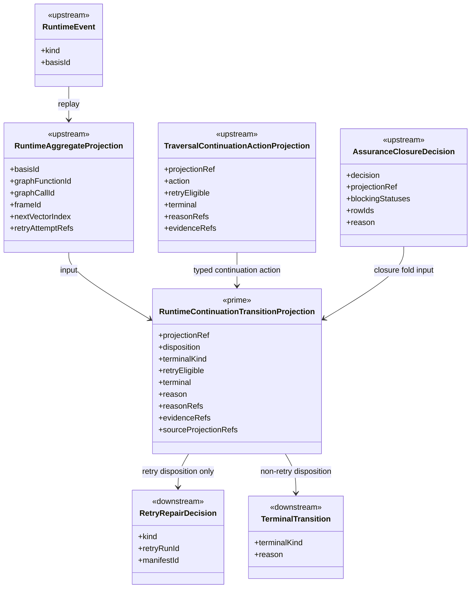

# M03 Runtime Continuation Transition Structural Carrier Diagram

**Status**: Active
**Date**: 2026-06-04
**Derived from**:
[M03_RUNTIME_CONTINUATION_TRANSITION_DERIVATION.md](./M03_RUNTIME_CONTINUATION_TRANSITION_DERIVATION.md),
[M03_RUNTIME_CONTINUATION_TRANSITION_FIRST_SLICE_IACS.md](./M03_RUNTIME_CONTINUATION_TRANSITION_FIRST_SLICE_IACS.md)

## Diagram

## Carrier Notes

- `RuntimeContinuationTransitionProjection` is the only prime carrier in this
  slice.
- `RetryRepairDecision` and `TerminalTransition` are downstream effects of the
  projection, not rival transition classifiers.
- Terminal retry refs are evidence refs inside the projection. They are not a
  separate carrier.
