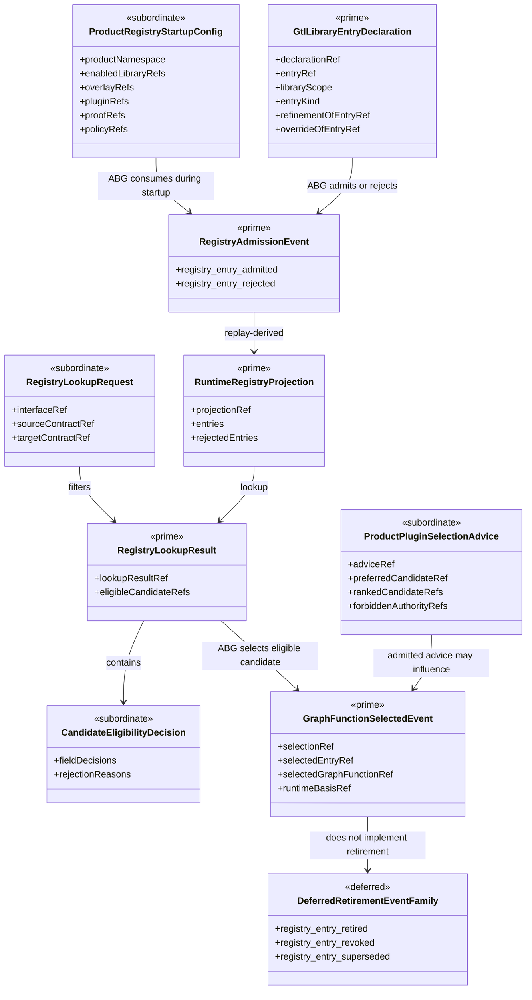

# M03 Runtime Graph Function Registry Structural Carrier Diagram

**Ticket**: T-177
**Status**: Active design
**Date**: 2026-06-30

## Carrier Flow

```text
GTL system library declarations
GTL product library declarations
Product registry startup config
        |
        v
ABG runEngineStart registry startup admission
        |
        v
registry_entry_admitted / registry_entry_rejected events
        |
        v
RuntimeRegistryProjection
        |
        +--> public read-only RegistryLookupResult
        |
        v
ABG selector for traversal-affecting situations
        |
        +--> optional plugin.consequence.C advice invocation
        |        |
        |        v
        |   ABG admits PluginSelectionAdvice
        |
        v
graph_function_selected
        |
        v
ABG invokes selected GraphFunction
```

## Structural Relationships



```text
GtlLibraryEntryDeclaration
  -> declares GraphFunction | Overlay | CandidateFamily | PublicStart | Plugin
  -> declares libraryScope: system | product
  -> declares namespace, owner, version, provenance, proof readiness
  -> may declare refinementOf or overrideOf

ProductRegistryStartupConfig
  -> created by downstream product or install
  -> names enabled libraries, overlays, plugins, proof/readiness refs,
     namespace/version pins, and policy refs
  -> consumed by ABG startup
  -> is not registry truth, selection truth, or invocation authority

RegistryEntryAdmission
  -> validates declaration
  -> emits accepted or rejected entry truth
  -> binds entry identity to source declaration digest

RuntimeRegistryProjection
  -> replays RegistryEntryAdmission facts
  -> indexes entries by graph-function ref, outer contract, namespace,
     owner, version, library scope, candidate family, public start,
     overlay, proof readiness, and policy refs

RegistryLookupResult
  -> reads RuntimeRegistryProjection
  -> carries CandidateEligibilityDecision rows
  -> does not select traversal

PluginSelectionAdvice
  -> proposed payload from plugin.consequence.C or another declared advice
     plugin
  -> admitted by ABG before use
  -> constrained to candidates present in RegistryLookupResult

GraphFunctionSelectedEvent
  -> emitted by ABG only
  -> records selected candidate, lookup basis, eligibility decision,
     admitted advice refs when present, and rejection diagnostics for
     material alternatives when proof requires them
```

## Visibility Split

| Surface | Downstream public? | ABG runtime internal? | Notes |
| --- | --- | --- | --- |
| GTL library declaration | yes | interpreted by ABG | Product libraries publish here. |
| Registry admission command | no | yes | Emits registry-entry truth. |
| Runtime registry projection | query facade only | yes | Projection is replay-derived. |
| Registry lookup query | yes | yes | Read-only; no selection truth. |
| Plugin advice invocation | no direct downstream call | yes | ABG invokes declared plugin. |
| Plugin advice payload | read after admission | yes | Proposed output until ABG admits it. |
| Selection emission | no | yes | Only ABG emits traversal-affecting selection. |
| Selected graph-function invocation | no direct plugin call | yes | Runner invokes after selection event. |

## Plugin Boundary

The consequence plugin case is structurally:

```text
RegistryLookupResult
  + TraversalSituationProjection
  + PolicyRefs
  + ProductNamespace
  -> plugin.consequence.C
  -> raw PluginSelectionAdvice
  -> ABG payload admission
  -> admitted PluginSelectionAdvice
  -> ABG selector
  -> GraphFunctionSelectedEvent
```

The plugin shall not call the next graph function. The plugin shall not receive
a mutable registry handle. If the plugin needs registry information, ABG gives
it an immutable candidate view or ABG performs a lookup on its behalf.

## System/Product Shadow Boundary

```text
system entry:  abg.requirements.fold_requirement_state
product entry: odd_glc.lifecycle.fold_requirement_state
```

The product entry is rejected unless it declares lawful refinement,
specialization, or override over a distinct outer contract and ABG accepts the
eligibility proof. Same-name, same-contract, or replacement-style publication
without override law is an unlawful shadow.

## Event And Projection Ownership

Registry entry truth and selection truth enter the same runtime event discipline
as other ABG facts. Query-local calculation, product-local files, plugin prose,
or static publication inventory cannot replace those events.
