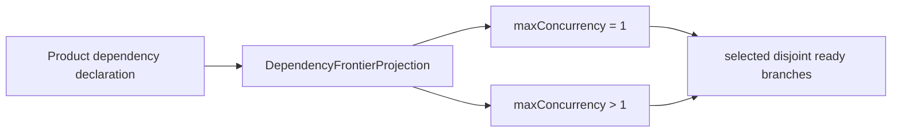
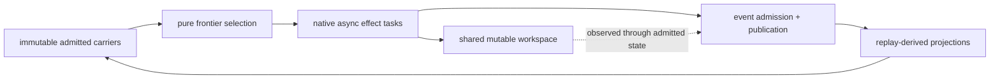

# M03 Saga Frontier Derivation

**Status**: Active
**Date**: 2026-05-20
**Ticket**: T-141
**Purpose**: Declare the TypeScript M03 realization surface for event-sourced
saga frontier projection, branch identity, idempotent admission, and
runtime-realization transparency.

## Source Authority

- `specification/PRODUCT.md`
- `specification/GOALS.md`
- `specification/requirements/abg/REQ-R-ABG3-FP-CONSCIOUSNESS.md`
- `specification/requirements/abg/REQ-R-ABG3-SAGA-FRONTIER.md`
- `specification/requirements/abg/REQ-R-ABG3-EVENTS.md`
- `specification/requirements/abg/REQ-R-ABG3-PROJECTION.md`
- `specification/requirements/abg/REQ-R-ABG3-WORKER.md`
- `specification/requirements/abg/REQ-R-ABG3-POLICY.md`
- `specification/requirements/abg/REQ-R-ABG3-TRANSPORT.md`
- `/Users/jim/src/apps/specification_methodology/specification/standards/DESIGN_MODULE_METHOD.md`
- `build_tenants/abiogenesis/typescript/design/ABG_EVENT_CALCULUS_RUNTIME_LAW_DERIVATION.md`
- `build_tenants/abiogenesis/typescript/design/M03_OBSERVED_STATE_ADMISSION_DERIVATION.md`
- `build_tenants/abiogenesis/typescript/design/M03_CONSTRUCTION_PRESSURE_PACKAGE_DERIVATION.md`
- `build_tenants/abiogenesis/typescript/design/M03_SYSTEM_PROBE_OBSERVER_LIVENESS_DERIVATION.md`
- [T-141](../../../../.ai-workspace/tickets/active/T-141-declare-event-sourced-saga-frontier-and-runtime-realization-transparency.md)

## Problem

Downstream construction products can know content dependency shape: steel-thread
order, independent module/test branches, declared inputs, output targets, write
territories, and fan-in expectations. That knowledge is product authority.

ABG must admit that dependency shape without making it a concurrency command.
The same admitted work may run serially, bounded parallel, paused, retried,
blocked, compensated, or escalated. Runtime realization is an ABG projection and
policy consequence over admitted truth.

## Decision

M03 introduces a pure `saga_frontier.ts` contract module as the first slice. It
does not add a runner loop and does not introduce a new scheduler or saga
calculus. The module declares:

- `BranchRef` as stable logical branch identity;
- `BranchAttemptRef` as effect-attempt identity;
- `BranchIdempotencyKey` and branch payload admission decisions;
- `DependencyFrontierDeclaration` and `DependencyFrontierProjection`;
- `BranchExecutionPolicy` as a resolved view over existing runtime policy and
  system-level configuration authority for max concurrency, queueing, retry,
  timeout, cancellation, lease ttl/renewal, worker/transport/resource caps,
  preemption, watchdog, and visible policy/default refs;
- `BranchSelectionProjection` for deterministic, write-disjoint ready branch
  selection under a declared cap;
- `BranchLeaseRecord` and `BranchLeaseProjection` for active/expired/released
  lease visibility and crash-recovery selection inputs;
- `WriteTerritoryConflictProjection`;
- `BranchPayloadAdmittedEvent` and `BranchFanInProjectedEvent` for replayed
  payload/fan-in truth;
- `BranchFanInProjection` for completion-order-independent fan-in;
- `BranchOutputStageRecord` and `BranchOutputPublicationDecision` for staging
  visibility law;
- `PublicConstructionProgressProjection`.

The first slice proves the axiom at the carrier/projection boundary:

Serial fallback is not a separate product contract. It is the degenerate
selection over the same dependency frontier.

## Runtime Boundary

Runner effects are deferred until the pure contracts are stable. When dispatch
is introduced, the TypeScript realization shall use native Node async primitives
such as promises, abort signals, timers, and process supervision. Those
mechanics shall consume admitted branch leases and existing resolved runtime
policy. They shall not become runtime truth.

The first native runner slice is `runNativeSagaFrontier(...)`. It is deliberately
small: derive the frontier, select write/output-disjoint ready branches under
`BranchExecutionPolicy.maxConcurrency`, execute selected branch tasks through
native promises, mark completed branches for the next projection iteration, and
stop when no branch is safely selectable.

`runEventedNativeSagaFrontier(...)` adds the first replay-visible effect shell
around that same native dispatch shape. It emits admitted branch lease acquired,
branch payload admitted, branch lease released, and branch fan-in projected
events through ABG `emit(...)`. It is still a bounded native runner slice, not
the final construction-runner integration.

Existing authority remains in force:

- Event truth is admitted through ABG events.
- Projection truth is replay-derived.
- Observed-state records gate reads that affect dispatch.
- `ConstructionPressurePackage` remains branch dispatch context.
- `RuntimeWatchdogPolicy` and liveness projection remain timeout, retry-budget,
  interruption, and watchdog authority.
- System-level configuration and visible defaults remain the source for
  concurrency caps and queueing policy.

## Functional Prime Boundary

System parallelism is governed by `DESIGN_MODULE_METHOD.md` Prime Law and
functional-realization review. The semantic center is immutable:

- dependency declarations are admitted carrier inputs;
- frontier, selection, fan-in, lease, output-publication, and progress surfaces
  are returned as frozen values;
- the native runner advances semantic state by constructing the next value, not
  by sharing mutable scheduler state between branches;
- native promises are effect coordination only.

ABG still runs over a shared mutable workspace. This design does not pretend
the filesystem is immutable. Instead, the shared workspace is an effect edge:
workers may read and write only through observed-state freshness, declared
write territory or output allocation, branch staging, idempotent admission, and
replay-visible publication truth. Workspace mutation is allowed reality; it is
not scheduler authority.

## Carrier Rules

`BranchRef` primary identity consists of:

- `graphCallId`;
- `frameId`;
- `vectorIndex` or `actionRef`;
- `branchKey`;
- `fanInScopeRef`.

`workKey`, `basisId`, `graphFunctionId`, frame lineage, attempt lineage, and
frontier refs are replay convenience fields. They do not replace the primary
branch identity.

`BranchAttemptRef` is separate from `BranchRef`. Retries, lease expiry,
cancellation, and supersession open new attempts for the same logical branch.

Idempotent branch admission distinguishes duplicate transport delivery from
attempt supersession:

- same idempotency key plus same payload digest is duplicate delivery;
- same idempotency key plus different payload digest is conflict;
- same branch plus different attempt may admit different output under retry or
  supersession law.

## Selection Rules

Default selection is deterministic:

1. derive row readiness from closed parents, observed-state presence and
   freshness, idempotency presence and admission, declared write/output
   allocation proof, and active leases;
2. sort ready rows by declared priority, critical-path cost, then branch
   identity;
3. greedily select rows whose write territories do not overlap already selected
   or active leased write territories;
4. stop at `BranchExecutionPolicy.maxConcurrency`;
5. leave unselected ready rows in the frontier for the next replay iteration.

Read overlap alone is not a conflict. Write overlap serializes. Output
allocation overlap also serializes when output allocation is the declared
territory proof for the branch.

## Non-Goals

This slice does not implement cloud queues, distributed event stores, process
pooling, physical filesystem rename, compensation execution, or an `odd_sdlc`
consumer. It creates the constitutional and TypeScript carrier/projection and
native-promise runner surface those later effects must consume.
