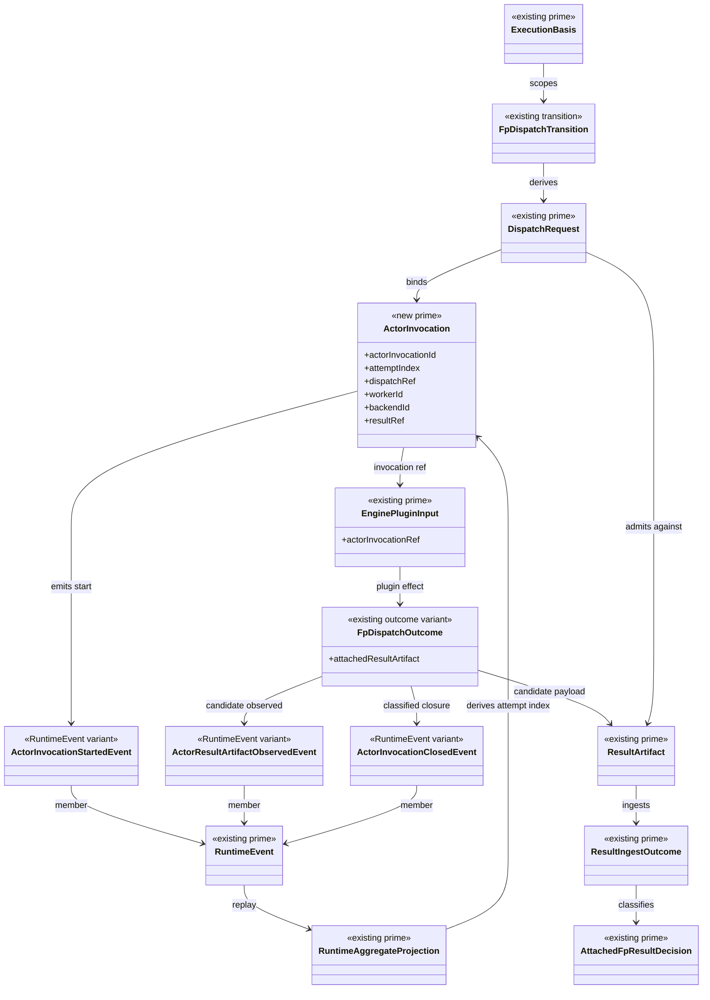

# M03 Supervised Actor Invocation Structural Carrier Diagram

**Status**: Active
**Date**: 2026-04-29
**Derived from**: [M03_SUPERVISED_ACTOR_INVOCATION_DERIVATION.md](./M03_SUPERVISED_ACTOR_INVOCATION_DERIVATION.md), [M03_SUPERVISED_ACTOR_INVOCATION_FIRST_SLICE_IACS.md](./M03_SUPERVISED_ACTOR_INVOCATION_FIRST_SLICE_IACS.md), [T-087](../../../../.ai-workspace/tickets/completed/T-087-restore-typescript-abg-supervised-actor-invocation-over-one-fp-dispatch.md)

## Purpose

Render the supervised actor invocation as one explicit `M03` runtime carrier
topology.

## Diagram

## Reading Rules

- `ActorInvocation` is the only new prime carrier in this slice.
- Actor events are runtime facts derived from that carrier.
- `ActorInvocation` binds the effect boundary. It does not own domain meaning.
- `ActorResultArtifactObservedEvent` records observation, not acceptance.
- Acceptance still requires `ResultArtifact` admission and ingest.
- Retry remains replay-derived through existing retry and projection carriers.

