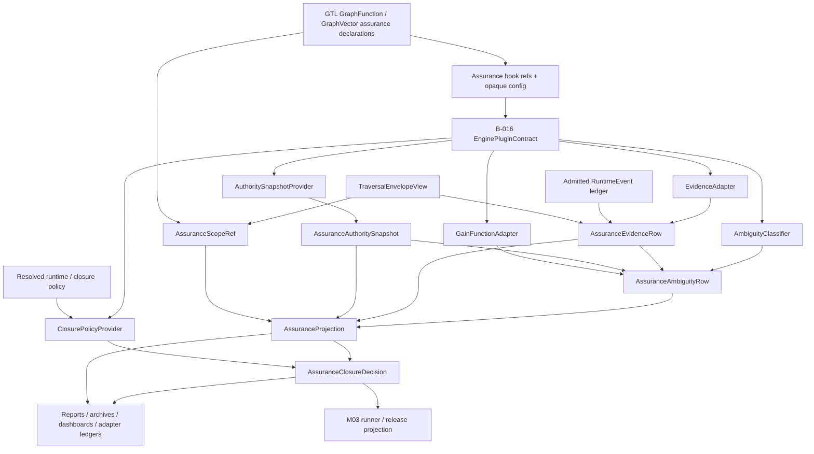
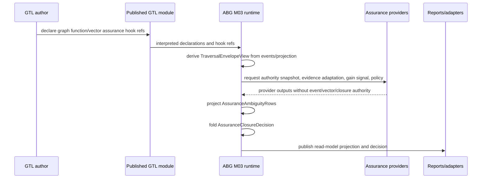

# M03 Total Assurance Projection Structural Carrier Diagram

**Status**: Active
**Date**: 2026-04-29
**Derived from**: [M03_TOTAL_ASSURANCE_PROJECTION_DERIVATION.md](./M03_TOTAL_ASSURANCE_PROJECTION_DERIVATION.md), [M03_TOTAL_ASSURANCE_PROJECTION_FIRST_SLICE_IACS.md](./M03_TOTAL_ASSURANCE_PROJECTION_FIRST_SLICE_IACS.md), [M03_TRAVERSAL_ENVELOPE_TOPOLOGY_STRUCTURAL_CARRIER_DIAGRAM.md](./M03_TRAVERSAL_ENVELOPE_TOPOLOGY_STRUCTURAL_CARRIER_DIAGRAM.md), [M03_M04_PLUGIN_CONTRACT_MODEL_STRUCTURAL_CARRIER_DIAGRAM.md](./M03_M04_PLUGIN_CONTRACT_MODEL_STRUCTURAL_CARRIER_DIAGRAM.md), [T-090](../../../../.ai-workspace/tickets/active/T-090-design-abg-total-assurance-carriers-and-plugin-seams.md)

## Purpose

Render total assurance as a single ABG projection/fold over T-086 envelope
truth, GTL declarations, and typed provider contracts.

## Diagram

## Reading Rules

- GTL declares hook refs and config; GTL does not own assurance semantics.
- Providers are B-016 plugin contracts; provider outputs are admitted inputs to
  ABG projection, not runtime truth.
- `AssuranceScopeRef` is derived from existing GraphCall/Frame/Continuation
  and vector truth.
- `AssuranceProjection` is the total row set over current authority and
  admitted evidence.
- `AssuranceClosureDecision` is the only assurance closure decision.
- Reports and ledgers consume projection/decision. They cannot close work.

## Target Architecture

## Sign-Off Claim

This design is lawful only if future code:

- derives scope from replay-visible runtime truth,
- computes or admits current authority/input digests,
- emits every applicable ambiguity status as an explicit row,
- invalidates stale prior closure projections on digest change,
- rejects provider outputs that attempt event emission, vector selection, or
  closure,
- treats reports as read models, and
- closes only through `AssuranceClosureDecision`.
