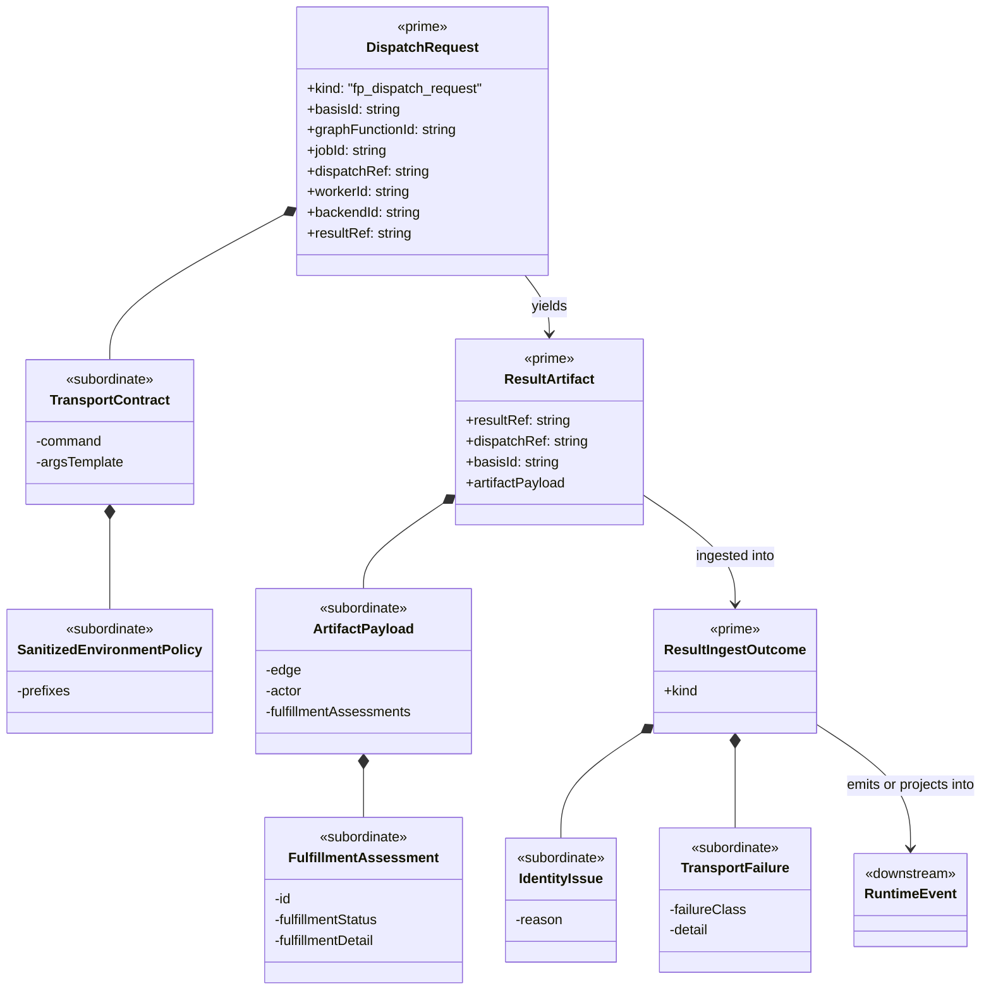

# M03 Transport Protocol Structural Carrier Diagram

**Status**: Active
**Date**: 2026-04-24
**Purpose**: Render the late `M03` transport and result-artifact protocol
boundary as one module-bounded structural carrier diagram before code opens.

## Mermaid UML

## Reading Notes

- `DispatchRequest`, `ResultArtifact`, and `ResultIngestOutcome` are the only
  prime carriers in this slice.
- transport contract and sanitization policy stay subordinate to the transport
  boundary
- artifact payload and fulfillment entries stay nested inside admitted artifact
  truth
- runtime event truth stays downstream of ingest; transport is not itself a
  rival runtime fact family
