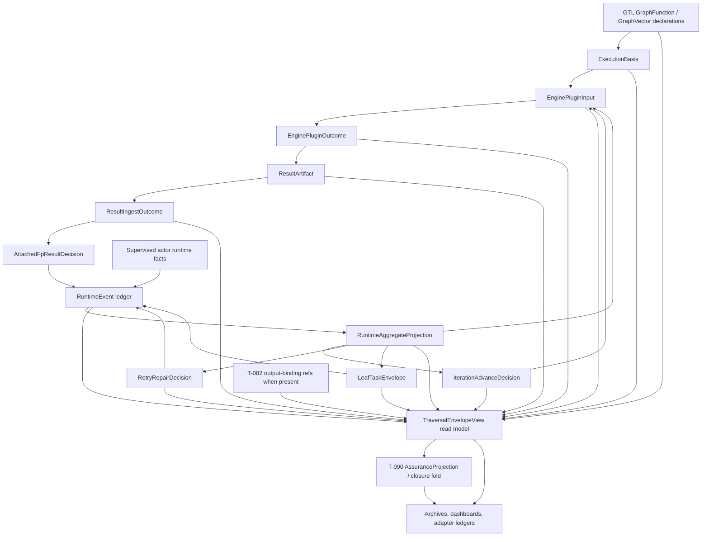

# M03 Traversal Envelope Topology Structural Carrier Diagram

**Status**: Active
**Date**: 2026-04-29
**Derived from**: [M03_TRAVERSAL_ENVELOPE_TOPOLOGY_DERIVATION.md](./M03_TRAVERSAL_ENVELOPE_TOPOLOGY_DERIVATION.md), [M03_TRAVERSAL_ENVELOPE_TOPOLOGY_FIRST_SLICE_IACS.md](./M03_TRAVERSAL_ENVELOPE_TOPOLOGY_FIRST_SLICE_IACS.md), [M03_GRAPH_FUNCTION_ITERATION_STRUCTURAL_CARRIER_DIAGRAM.md](./M03_GRAPH_FUNCTION_ITERATION_STRUCTURAL_CARRIER_DIAGRAM.md), [M03_RETRY_REPAIR_LEAFTASK_STRUCTURAL_CARRIER_DIAGRAM.md](./M03_RETRY_REPAIR_LEAFTASK_STRUCTURAL_CARRIER_DIAGRAM.md), [T-086](../../../../.ai-workspace/tickets/active/T-086-prove-abg-generic-traversal-envelope-topology-for-cumulative-pressure-and-coverage.md)

## Purpose

Render the generic traversal envelope as an ABG-owned read-model over current
M03 carriers. The diagram makes the collapse decision visible: current
runtime truth stays in existing carriers; `TraversalEnvelopeView` is a
projection lens consumed by assurance, reports, archives, and downstream
adapters.

## Diagram

## Reading Rules

- `RuntimeEvent` remains the only runtime truth write family.
- `RuntimeAggregateProjection` remains the current replay-derived truth.
- `IterationAdvanceDecision` remains next-vector authority.
- Plugin input/outcome carries effect handoff and result facts; it does not
  carry closure authority.
- `TraversalEnvelopeView` is a read model. It cannot emit events, choose a
  vector, retry, or close.
- `T-090` consumes the envelope topology to define assurance rows and the
  closure fold.
- `T-082` may later add output-binding facts consumed by the envelope view.

## Sign-Off Claim

This topology is lawful only if future TypeScript code and downstream adapters:

- derive the envelope from admitted events and current projection,
- preserve plugin authority limits,
- treat worker and report claims as evidence candidates only,
- surface missing output binding as a row or named defer state,
- keep retry and re-entry in ABG runtime truth, and
- route closure through the T-090/T-091 assurance projection once implemented.
