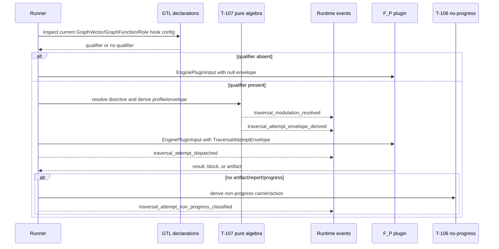
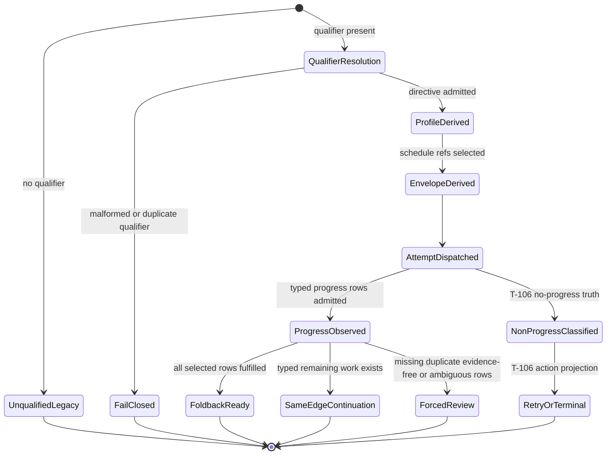

# M03 Traversal Modulation Derivation

**Status**: Active
**Date**: 2026-05-03
**Purpose**: Ratify T-107 as an ABG-owned runtime-law surface for bounded
agentic `F_P` attempts whose strategy is declared by GTL hook/config truth.

## Source Authority

- `specification/INTENT.md`
- `specification/PRODUCT.md`
- `specification/requirements/gtl/REQ-L-GTL3-HOOKS.md`
- `specification/requirements/gtl/REQ-L-GTL3-GRAPHVECTOR.md`
- `specification/requirements/abg/REQ-R-ABG3-TRANSPORT.md`
- `specification/requirements/abg/REQ-R-ABG3-CONTINUATION.md`
- `specification/requirements/abg/REQ-R-ABG3-EVENTS.md`
- `specification/requirements/abg/REQ-R-ABG3-PROJECTION.md`
- `specification/requirements/abg/REQ-R-ABG3-ASSURANCE.md`
- `M03_OUTPUT_ALLOCATION_AND_WORKSPACE_ZOOM_FOLDBACK_DERIVATION.md`
- `M03_GRAPH_SPAN_FOLDBACK_REENTRY_DERIVATION.md`
- `M03_TRAVERSAL_NON_PROGRESS_CONTINUATION_DERIVATION.md`
- [T-107](../../../../.ai-workspace/tickets/active/T-107-define-abg-traversal-modulation-profiles-for-agentic-fp-attempts.md)

## Problem

Large agentic `F_P` work needs a typed scheduler command surface. Prompt text
such as "steel thread", "waterfall", or "do the first ten" is not replay truth.
If the worker produces partial output, stalls, or optimizes toward a smaller
slice, ABG must know whether that is lawful progress, forced review, same-edge
continuation, retry exhaustion, or graph reentry pressure.

The defect T-107 closes is not semantic evaluation. Semantic judgment of
`A.req_i -> B.result_i` remains `F_P` or domain evaluator truth. T-107 controls
which declared schedule refs are attempted, which progress evidence must be
carried, and how incomplete attempt truth is projected.

## Decision

Traversal modulation is configured by GTL hook/config truth and realized by ABG
as replay-visible runtime law.

The primary qualifier is:

```text
GraphVector.declarations["abg.traversal_strategy"]
```

Fallback precedence is:

```text
GraphVector.declarations["abg.traversal_strategy"]
  > GraphFunction.declarations["abg.default_traversal_strategy"]
  > Role.policyHooks["abg.traversal_strategy"]
```

Absence of all three surfaces means no strategy-qualified modulation applies
and the `F_P` attempt remains unqualified. A malformed present qualifier fails
closed. A duplicate qualifier fails closed. Older traversal-modulation key
spellings are not alternate aliases.

The hook config yields a `TraversalStrategyDirective`. Strategy labels are
descriptive metadata owned by downstream strategy layers. ABG switches only on
generic primitives:

- `atomic_attempt`
- `bounded_batch`
- `ordered_schedule_prefix`
- `single_vertical_slice`
- `phase_gate`
- `gap_repair_slice`
- `agent_proposed_slice_requires_admission`

## GTL Configuration Surface

The hook config may carry:

| Config key | Meaning |
|---|---|
| `directive_ref` | stable directive identity; defaults to hook ref |
| `strategy_owner_ref` | downstream owner of strategy meaning |
| `strategy_label` | descriptive label only |
| `enforcement_primitives` | ABG-enforced primitive set |
| `obligation_schedule_refs` | explicit schedule refs available to this attempt family |
| `ordering_constraint_refs` | refs that constrain allowed schedule order |
| `phase_gate_refs` | refs that must be preserved in the envelope |
| `target_item_count` | preferred bounded batch size |
| `max_item_count` | maximum bounded batch size |
| `max_token_pressure` | advisory pressure carried as typed config |

GTL remains a hook/config carrier. It does not become a downstream product
strategy language.

## Core Carriers

```text
TraversalStrategyDirective
  -> TraversalStrategySelection
  -> TraversalModulationProfile
  -> TraversalAttemptEnvelope
  -> TraversalAttemptProgressRow*
  -> TraversalModulationAssuranceProjection
  -> TraversalModulationSummary
```

`TraversalModulationProfile` binds the directive to one execution basis,
vector, backend progress profile, schedule refs, phase gates, policy refs,
gap-pressure refs, affect refs, progress contract, continuation contract, and
batch control.

`TraversalAttemptEnvelope` is the scheduler command surface for one actor
invocation. It carries selected schedule item refs, ordering constraints, phase
gates, required progress artifact refs, gap pressure, affect pressure, retry
budget, and the rule that a bounded attempt exits back to ABG.

`TraversalAttemptProgressRow` is admitted per selected schedule item. A partial,
blocked, or not-attempted row must carry typed remaining-work refs. Worker prose
and file presence do not substitute for these refs.

`TraversalForcedReviewGate` is projected whenever typed truth is incomplete,
ambiguous, duplicate, evidence-free, or contradicted by a public summary.

## Event Law

Minimum runtime event family:

```text
traversal_modulation_resolved
traversal_attempt_envelope_derived
traversal_attempt_dispatched
traversal_attempt_progress_observed
traversal_attempt_non_progress_classified
traversal_forced_review_projected
traversal_same_edge_continuation_planned
traversal_modulation_exhausted
```

Each event carries basis, graph function, run, work key, graph call, frame,
frame lineage, vector, edge, causation refs, and correlation id. Projection
does not need runner-local state to reconstruct modulation truth.

## Projection Law

```text
GTL qualifier + ExecutionBasis + backend profile + schedule refs
  -> TraversalModulationProfile
  -> TraversalAttemptEnvelope
  -> admitted progress/non-progress/foldback facts
  -> one action:
       foldback_ready
       continue_same_edge
       forced_review
```

T-107 does not own no-progress retry taxonomy. Runtime no-progress remains
T-106-owned. T-107 may record that a T-106 carrier/action projection was
classified for the modulated envelope.

T-107 does not own graph-span reentry. Graph-span reentry remains T-103-owned.
T-107 may produce continuation pressure that a downstream or later span
assessment consumes.

## Runner Integration

The runner performs this integration only for qualified vectors. The synchronous
and asynchronous runner entry points are effect adapters over the same F_P
dispatch-attempt derivation law: both derive the actor invocation, modulation
profile, attempt envelope, plugin input, and modulation event spine from the
same replay-visible inputs. Async differs only by awaiting the plugin effect.



The runner consumes the qualifier and emits runtime facts. It does not decide
semantic fulfillment and does not hard-code downstream strategy labels.

## State Flow



## Composition

| Related surface | Relationship |
|---|---|
| T-100 zoom foldback | owns per-edge ledger/schedule/foldback truth |
| T-102 eval suite | owns trial and aggregate eval projection |
| T-103 graph reentry | owns graph-span and constitutional reentry frontier |
| T-104 output allocation | owns cross-workspace input/output materialization lineage |
| T-106 non-progress | owns per-attempt no-progress carrier/action taxonomy |
| T-107 modulation | owns GTL-qualified envelope, progress row completeness, and forced-review pressure |

## Closure Law

T-107 closes for ABG source scope when:

1. requirements name GTL-qualified traversal modulation as ABG runtime law
2. design names the carriers, event family, projection law, and boundaries
3. pure functions derive directive, profile, envelope, progress projection, and summary
4. runtime events admit the event family with lineage fields
5. `EnginePluginInput` and dispatch handoff can carry the envelope
6. sync and async runner modes derive envelopes only from explicit GTL
   qualifier truth through the same dispatch-attempt law
7. malformed present qualifiers fail closed and absent qualifiers keep unqualified behavior
8. tests prove no-inference, strategy-boundary, event admission, handoff, and runner paths
