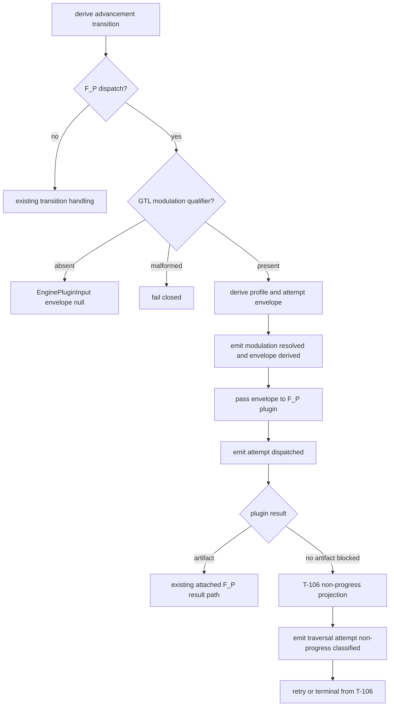

# M03 Traversal Modulation First Slice IACS

**Status**: Active
**Date**: 2026-05-03
**Derived from**: [M03_TRAVERSAL_MODULATION_DERIVATION.md](./M03_TRAVERSAL_MODULATION_DERIVATION.md), [M03_OUTPUT_ALLOCATION_AND_WORKSPACE_ZOOM_FOLDBACK_DERIVATION.md](./M03_OUTPUT_ALLOCATION_AND_WORKSPACE_ZOOM_FOLDBACK_DERIVATION.md), [M03_GRAPH_SPAN_FOLDBACK_REENTRY_DERIVATION.md](./M03_GRAPH_SPAN_FOLDBACK_REENTRY_DERIVATION.md), [M03_TRAVERSAL_NON_PROGRESS_CONTINUATION_DERIVATION.md](./M03_TRAVERSAL_NON_PROGRESS_CONTINUATION_DERIVATION.md), [T-107](../../../../.ai-workspace/tickets/active/T-107-define-abg-traversal-modulation-profiles-for-agentic-fp-attempts.md)

## Purpose

Declare the irreducible carrier set and proof boundary for the first T-107
implementation slice.

This slice proves ABG can resolve a GTL traversal qualifier, derive a bounded
attempt envelope, admit replay-visible modulation events, carry the envelope to
`F_P` dispatch, and preserve no-inference assurance behavior.

It does not claim downstream odd_sdlc parity and does not claim live Claude or
Codex backend parity. Those are release proof lanes above this first slice.

## Irreducible Architectural Carrier Set

| Carrier | Owner | Role | Effect boundary |
|---|---|---|---|
| `StartIntent.runtimeTraversalSelections[]` | ABG M03 admission / M04 public start | admitted run-scoped traversal strategy selection over selected schedule refs | none |
| `GraphVector.declarations` | GTL | primary qualifier for one vector | none |
| `GraphFunction.declarations` | GTL | default qualifier for a graph function | none |
| `Role.policyHooks` | GTL/M02 work publication | last-precedence default qualifier | none |
| `TraversalStrategyDirective` | ABG M03 contracts | admitted strategy-layer directive; labels descriptive only | none |
| `TraversalStrategySelection` | ABG M03 contracts | replay-visible selected per-edge strategy with source and config digest | none |
| `AgenticBackendProgressProfile` | ABG M03 contracts | backend progress interpretation config | none |
| `TraversalModulationProfile` | ABG M03 contracts | basis-bound modulation profile | none |
| `TraversalAttemptEnvelope` | ABG M03 contracts | scheduler command surface for one actor attempt | plugin/transport handoff |
| `TraversalAttemptProgressRow` | ABG M03 contracts | typed progress per selected schedule item | event admission |
| `TraversalForcedReviewGate` | ABG M03 contracts | fail-closed review gate for incomplete truth | event admission |
| `TraversalModulationAssuranceProjection` | ABG M03 contracts | deterministic progress/foldback/forced-review action | read models |
| `TraversalModulationSummary` | ABG M03 contracts | public summary read model | adapters only |

## Code Ownership

| Code surface | Responsibility |
|---|---|
| `code/src/abg/m03/contracts/traversal_modulation.ts` | pure directive resolution, runtime-start selection resolution, profile/envelope derivation, backend progress classification, progress-row admission, forced-review projection, event constructors |
| `code/src/abg/m03/contracts/carriers.ts` | runtime event union and T-107 event interfaces |
| `code/src/abg/m03/admission/carriers.ts` | start-intent admission, including runtime traversal selections |
| `code/src/abg/m03/contracts/event_admission.ts` | fail-closed admission rules for T-107 events |
| `code/src/abg/m03/contracts/plugins.ts` | `EnginePluginInput.traversalStrategySelection` and `traversalAttemptEnvelope` handoff fields |
| `code/src/abg/m03/transport/carriers.ts` | dispatch request fields for envelope refs and scheduling primitives |
| `code/src/abg/m03/transport/constructors.ts` | transport constructor preservation of envelope refs and schedule/gate/progress refs |
| `code/src/abg/m03/transport/admission.ts` | dispatch request admission for modulation handoff fields |
| `code/src/abg/m03/runner/engine_runner.ts` | shared qualified-vector F_P attempt derivation for sync and async runner adapters; absent qualifier stays unqualified |
| `test_env/tests/test_t107_traversal_modulation_unit.test.mjs` | first-slice proof |

## Precedence Contract

```text
StartIntent.runtimeTraversalSelections[current vector]
  > GraphVector.declarations["abg.traversal_strategy"]
  > GraphFunction.declarations["abg.default_traversal_strategy"]
  > Role.policyHooks["abg.traversal_strategy"]
```

Tests must prove:

- vector qualifier wins over graph-function and role defaults
- graph-function default wins over role default
- role default applies only when no vector or graph-function qualifier exists
- matching runtime-start selection wins over static GTL qualifier truth for
  that run
- ambiguous runtime-start selections fail closed
- malformed present qualifier fails closed
- duplicate qualifier fails closed
- no qualifier means no envelope is derived
- old traversal-modulation key spellings are not accepted as aliases

## Event Admission Contract

The first slice admits:

| Event | Required lineage |
|---|---|
| `traversal_modulation_resolved` | basis, graph call, frame, frame lineage, graph function, run, work key, vector, edge, causation, correlation |
| `traversal_attempt_envelope_derived` | same lineage plus envelope/profile/directive/backend refs |
| `traversal_attempt_dispatched` | same lineage plus actor invocation and dispatch refs |
| `traversal_attempt_progress_observed` | same lineage plus progress row refs |
| `traversal_attempt_non_progress_classified` | same lineage plus T-106 source/action refs |
| `traversal_forced_review_projected` | same lineage plus gate trigger and schedule refs |
| `traversal_same_edge_continuation_planned` | same lineage plus remaining schedule refs |
| `traversal_modulation_exhausted` | same lineage plus reason/evidence refs |

Admission is a runtime-law boundary. Missing correlation or malformed lineage
is invalid event truth.

## Runner Contract

`runEngineIterate` and `runEngineIterateAsync` share one modulation-aware F_P
dispatch-attempt derivation path. The async path may await plugin effects, but
it must not construct an unmodulated `EnginePluginInput` for a qualified vector.



The runner imports only the consumer/constructor surface. It does not infer
semantic fulfillment, does not switch on `strategy_label`, and does not create
domain chunking policy.

## No-Inference Proof

The first slice must prove the following fail-closed cases:

- missing progress row -> `TraversalForcedReviewGate`
- duplicate progress row -> `TraversalForcedReviewGate`
- partial row without remaining work -> `TraversalForcedReviewGate`
- evidence-free progress claim -> `TraversalForcedReviewGate`
- backend progress ambiguity -> `TraversalForcedReviewGate`
- public summary/projection disagreement -> thrown drift error
- worker prose or file refs alone -> ignored inference refs, not closure truth

## Proof Lanes

| Script | Required proof |
|---|---|
| `npm run test:t107` | pure algebra, GTL precedence, event admission, transport handoff, sync and async runner qualified/unqualified paths |
| `npm run test:t100:unit` | prior schedule/foldback surface remains green |
| `npm run test:t106` | prior non-progress continuation surface remains green |
| `npm run test:semantic` | whole semantic suite remains green |
| `npm run lint:semantic` | realization hygiene |

## Non-Closure Conditions

Do not close T-107 if:

- modulation is prompt text without an admitted envelope
- runner derives an envelope without GTL qualifier truth
- a present malformed qualifier silently falls back to unqualified behavior
- public summary and modulation projection disagree
- worker prose, file presence, or elapsed time is used as progress truth
- ABG hard-codes downstream strategy labels
- downstream odd_sdlc is required to run a private chunk/retry loop to consume the feature
