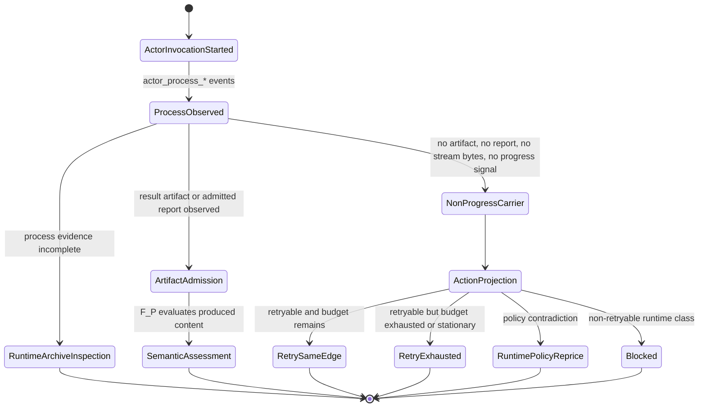

# M03 Traversal Non-Progress Continuation Derivation

**Status**: Active
**Date**: 2026-05-03
**Purpose**: Ratify T-106 as an ABG-owned derivation for a supervised `F_P`
actor attempt that produces no assessable output, and for the single
authoritative continuation action projected from that fact.

## Source Authority

- `specification/INTENT.md`
- `specification/PRODUCT.md`
- `specification/requirements/abg/REQ-R-ABG3-TRANSPORT.md`
- `specification/requirements/abg/REQ-R-ABG3-RETRY.md`
- `specification/requirements/abg/REQ-R-ABG3-CONTINUATION.md`
- `specification/requirements/abg/REQ-R-ABG3-PROJECTION.md`
- `specification/requirements/abg/REQ-R-ABG3-EVENTS.md`
- `M03_SUPERVISED_ACTOR_INVOCATION_DERIVATION.md`
- `M03_RETRY_REPAIR_LEAFTASK_DERIVATION.md`
- `M03_OUTPUT_ALLOCATION_AND_WORKSPACE_ZOOM_FOLDBACK_DERIVATION.md`
- `M03_GRAPH_SPAN_FOLDBACK_REENTRY_DERIVATION.md`
- [T-106](../../../../.ai-workspace/tickets/active/T-106-define-abg-typed-traversal-non-progress-continuation-and-summary-agreement.md)

## Problem

The observed test66 failure produced three different action stories from one
runtime fact:

- the carrier said the lawful re-entry point was `triage_gap` and retry was not
  eligible
- the run summary said the next lawful action was
  `retry_same_edge_with_gap_dossier`
- the public gap surface pointed to a generic review path

That is a runtime authority defect. Process facts, no-progress classification,
retry eligibility, and public summary wording must be derived from one ABG
projection instead of being recomputed independently by downstream code.

## Decision

ABG owns two pure derived carriers:

1. `TraversalNonProgressCarrier`
2. `TraversalContinuationActionProjection`

`TraversalNonProgressCarrier` is a replay-derived fact carrier. It records what
happened at the supervised actor boundary: process identity, heartbeat,
timeout, signal sequence, stream bytes, artifact/report/progress observation,
and evidence refs.

`TraversalContinuationActionProjection` is the replay-derived decision carrier.
It maps the fact carrier through retry policy, the T-100 retryable runtime
failure allowlist, and the current retry frontier into one public action:

- `retry_same_edge`
- `yield_same_edge_continuation`
- `retry_exhausted`
- `inspect_runtime_archive`
- `reprice_runtime_policy`
- `blocked`

The carrier and the projection are pure. Effects remain at adapters: event
append, archive materialization, CLI rendering, and downstream product summary
writing.

## Timeout And Retry Mapping

The T-106 timeout class is narrower than the runtime failure taxonomy. It maps
before retry eligibility is computed:

| T-106 timeout class | Runtime failure class | Retry allowlist result |
|---|---|---|
| `inactivity_timeout` | `no_output` | retryable by default |
| `hard_timeout` | `transport_failure` | retryable by default |
| `transport_exit` | `transport_failure` | retryable by default |
| deterministic payload/report rejection | `contract_failure` | retryable by default |

`runtime_unavailable`, `capability_missing`, `runtime_failure`, and
`payload_contract_failure` are not introduced by traversal no-progress. If they
appear from another runtime path, T-106 shall not silently coerce them into the
retry allowlist.

## Artifact Salvage Rule

Artifact and report admission happens before no-progress classification.

If a result artifact, admitted report, or declared progress signal exists for
the actor invocation, ABG must not assert traversal non-progress. The caller may
still later fail semantic closure, but that is an `F_P` result-evaluation or
domain proof question, not a no-output retry fact.

## Composition With T-103

T-106 is per actor attempt and per vector. T-103 is graph-span re-entry.

The relationship is:

```text
T-106 no-progress action:
  retry_same_edge | yield_same_edge_continuation | retry_exhausted

T-103 graph-span action:
  reenter | reprice | block | constitutional_reentry | advance
```

T-106 may cause the runner to retry the same vector before a semantic span
assessment exists. T-103 consumes admitted `F_P` graph-span assessment truth and
may push traversal back to an earlier vector after downstream evidence exists.
They are not rival controllers.

`inspect_runtime_archive` is a terminal pause for human/operator inspection of
runtime evidence. It is not a private retry loop. A later human or policy
decision must append new ABG truth before traversal can continue.

## Deterministic Flow



```mermaid
sequenceDiagram
  participant Runner
  participant Actor as F_P Actor
  participant Events as RuntimeEvent Stream
  participant Projection as RuntimeAggregateProjection
  participant T106 as T-106 Pure Projection
  participant Summary as CLI/Archive/Downstream Summary

  Runner->>Actor: supervised invocation
  Actor-->>Events: actor_process_started/timeout/signal/exited
  Events-->>Projection: replay process and stream truth
  Projection-->>T106: process facts + retry frontier
  T106-->>T106: derive TraversalNonProgressCarrier
  T106-->>T106: derive TraversalContinuationActionProjection
  T106-->>Summary: one authoritative action enum and reasons
```

## Functional Boundary

The implementation surface shall be algebraic and pure:

- no filesystem reads or writes
- no process inspection outside admitted events
- no clock access
- no mutable singleton retry state
- closed string unions for timeout class and action
- fail-closed validation for unsupported failure class, missing projection
  scope, malformed vector, or contradictory output facts

Adapters may serialize the carrier/projection, append runtime events, or render
public summaries. Adapters do not recompute the next action.

## Closure Law

T-106 closes only when:

1. requirements name traversal non-progress, retry mapping, and summary
   agreement
2. this design and the first-slice IACS name the carriers and boundaries
3. TypeScript code derives carrier and action from replay projection
4. tests prove retry, exhaustion, artifact salvage, stream progress, incomplete
   evidence inspection, and summary agreement
5. no runner, CLI, or downstream consumer is allowed to publish a different
   action for the same derived projection
