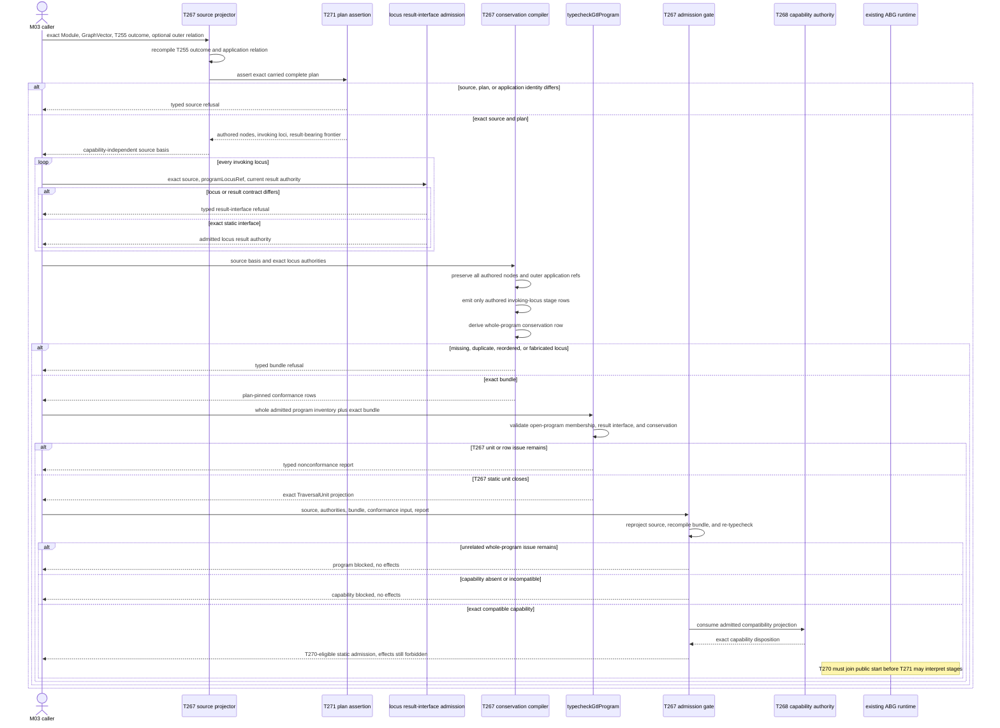
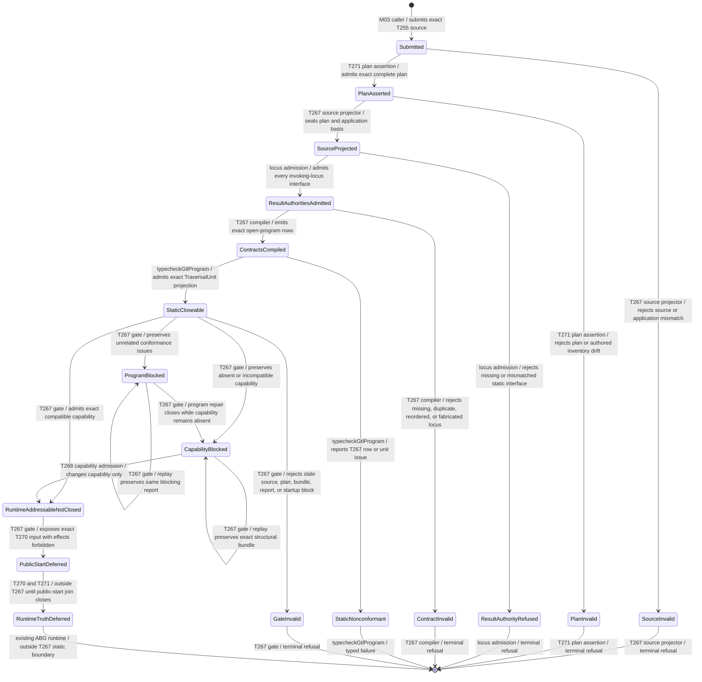

# M03 Traversal Result Interface And Bind Conservation Behavior Design

> **T-283 authority disposition (2026-07-20):**
> `invalidated_for_5_0_implementation_by_upstream_intent_reprice`. This file is
> retained as historical and current-state evidence only. Prior acceptance
> records its former basis; it does not authorize design, code, proof, Product
> scope, or closure under the T-283 candidate. Reusable local contracts must be
> re-derived under the accepted direct-GTL replacement design after T-283
> closes.

**Prior status**: Accepted under delegated F_H authority after bounded self-review
**Date**: 2026-07-14
**Ticket**: `T-267`
**Method authority**: `specification_methodology/specification/standards/DESIGN_MODULE_METHOD.md` section 5E
**Tenant authority**: [TYPESCRIPT_REALIZATION_GUARDRAILS.md](./TYPESCRIPT_REALIZATION_GUARDRAILS.md)

## Boundary

This design closes the static boundary between one exact T-255 execution
handoff, the T-271 complete C-program plan carried by that handoff, and the
existing GTL traversal-unit conformance projection:

```text
T-255 selected GraphVector handoff
  + exact T-271 CompiledCProgramPlan
  + exact outer application relation, when present
  + admitted static result interface for every invoking program locus
  -> whole-program conservation rows
  -> existing typecheckGtlProgram(...) report and TraversalUnit projection
  -> program-blocked, capability-blocked, or runtime-addressable-not-closed
```

The compiler preserves two different structures without flattening either:

1. the exact authored C tree, including structural `C.id`, `C.compose`,
   `C.edge`, `C.batch`, and `C.retry` nodes and every invoking `C.of` or
   `workflow.C` locus; and
2. the exact outer GraphFunction application relation, including fan-out,
   fan-in, or recurse identity when the GraphVector participates in one.

ABG call preparation, result admission, evidence binding, materialization,
assurance fold, and traversal transition remain interpreter bind mechanics.
They may surround the authored program at runtime. They are not authored C
stages, do not satisfy authored-stage cardinality, and do not enter the
conformance stage inventory under fabricated domain roles.

`TraversalUnit<A, B>` remains notation over existing carriers. T-267 creates
no topology type, public callable, event family, controller, plugin, result
ledger, or capability authority. Static admission proves that the exact
declared program and conservation basis are sufficient to enter the existing
runtime later. It never proves that an attempt ran or closed.

### Requirements

- `REQ-L-GTL3-CONTRACT-LAW-API-016/-017`
- `REQ-L-GTL3-GRAPHVECTOR-020`
- `REQ-L-GTL3-COMPUTE-NOTATION-024..028`
- `REQ-L-GTL3-C-ALGEBRA-016`
- `REQ-R-ABG3-CCALL-002/-004/-014`
- `REQ-R-ABG3-FN-COMP-001..008/-015/-021..024`
- `REQ-R-ABG3-INTERPRET-010/-019/-027/-028`
- `REQ-R-ABG3-PAYLOAD-024/-025`
- T-269 authored-stage and interpreter-bind separation
- T-271 complete C-program compiler/interpreter contract
- `T-267` gap families `traversal_execution_contracts` and
  `declared_program_conservation`

### Explicit Exclusions

- changing the T-252 Consensus body or its selected C declarations;
- lowering a complete C program back to a flat HoG compatibility projection;
- synthesizing missing `transform.C`, `evaluate.C`, or `consequence.C` stages;
- treating a domain role as an engine compute-stage category or renaming it;
- treating call preparation, result admission, evidence, materialization, or
  foldback rows as authored program membership;
- translating GraphFunction `recurse` into an eighth C constructor;
- accepting display names, prompt text, paths, or test labels as plan,
  application, result-interface, obligation, or capability authority;
- treating static result-interface authority as admitted runtime output;
- allowing a capability-blocked source to become effect-addressable;
- self-admitting or locally minting the T-268 tenant-conformance manifest;
- adding runtime retry, recurse, batch, workflow, F_H, event, or continuation
  behavior already owned by T-259 through T-262 and T-271;
- public catalog/start routing owned by T-270; and
- release qualification or runtime-closure claims.

## Design Decisions

### D1. The exact T-271 plan is the program-conservation authority

`projectTraversalContractSourceBasis(...)` recompiles the T-255 handoff inside
the supplied Module and requires the carried `CompiledCProgramPlan` to be the
exact T-271 plan selected for the GraphVector. The source basis carries:

```text
program plan ref and digest
program binding ref and digest
ordered authored node refs and digests
ordered invoking-locus refs and digests
exact result-bearing frontier locus refs
selected composition ref and digest
boundary GraphFunction and GraphVector identity
```

The compiler walks the sealed plan. It does not read `normalizedProgram`, call
`compileCAlgebraToHog`, or reconstruct program membership from stage names,
effects, runtime observations, or output files.

Every structural plan node remains in `authoredProgramNodeRefs`. Only invoking
`CompiledCStageLeaf` and `CompiledCWorkflowLift` nodes become
`TraversalContractProgramLocus` rows. Structural nodes remain conserved by
the exact plan digest and node inventory; they are never fabricated C calls.

### D2. Program locus and composition role are orthogonal

Each invoking locus carries:

```text
programLocusRef and digest
sourcePath
domainStageRole: string | null
compositionStageRole
regime and arm
sequenceOrdinal and taskOrdinal
input and output carriers
resultBearing
```

`domainStageRole` comes only from an authored `C.of`; it is null for a
transparent `workflow.C` lift. `compositionStageRole` comes only from the
exact selected `abg.fn_composition` binding compiled by T-271. The two may be
different and neither is inferred from the other.

The conformance stage row represents one authored invoking locus. It carries
`stageKind: authored_program_stage`, exact plan/locus identity, and the closed
engine compute-stage category needed to select the runtime atom. No row in
this boundary has `stageKind: interpreter_bind`.

### D3. Static result-interface authority is admitted per invoking locus

Every invoking locus receives one exact
`AdmittedTraversalStageResultAuthority`. Its source is one of:

| Source | Existing authority | Use |
|---|---|---|
| program-locus contract | exact T-271 plan node, composition binding, and output carrier | baseline static interface for every invoking locus |
| declared F_P/F_H contract | exact T-256 execution-context contract plus T-257 or T-258 law, when that contract is already resolved | stronger static envelope evidence for one declared stage |
| runtime atom contract | exact T-259 workflow binding or another already compiled locus-local atom contract | stronger static interface evidence without turning a batch, retry, fan-in, fan-out, or recurse wrapper into an authored stage |

Authority identity includes the plan digest and `programLocusRef`; stage
ordinal alone is insufficient. Intermediate result contracts preserve the
locus output carrier. The compiler derives the result-bearing frontier from
the plan tree: a scalar program normally has one locus, while a lawful batch
may have several task-local result loci whose T-271 batch projection produces
one outer result. Only that exact frontier may contribute terminal result
truth, and the plan root output must still match the GraphVector target
binding.

Static admission never admits an F_P payload, an F_H response, or a runtime
atom outcome. T-257, T-258, T-270, and the existing runtime atoms retain that
truth. A missing instruction/result execution join may therefore remain a
typed T-270 start block without invalidating the plan-locus carrier itself.

### D4. No canonical three-stage completion is permitted

The compiled compute-composition row names the exact complete plan and lists
only authored invoking-locus stage refs in plan order. Its notation inventory
includes the selected program notation and the categories actually present;
it does not require all of `transform.C`, `evaluate.C`, and `consequence.C`.

The GTL conformance judge is correspondingly repriced to enforce:

- one exact plan ref and digest per composition row;
- a non-empty, unique authored node inventory;
- one stage row per invoking locus and no unlisted stage row;
- unique plan-locus identity and exact composition membership;
- the exact non-empty result-bearing frontier permitted by the plan's
  structural cardinality;
- one result-interface row per invoking locus; and
- conservation coverage over the full authored node and invoking-locus sets.

Runtime-selector uniqueness includes `programLocusRef` and task position.
Repeated domain or composition roles and repeated carrier types at different
batch or sequence loci therefore remain lawful and cannot collapse into one
stage/result row. Serial predecessor refs and parallel task siblings are
derived from the sealed plan tree, not from array completion order.

It no longer requires a fixed category triple or a consequence plugin result
when the authored program contains no consequence stage. Traversal bind
closeability instead requires the exact result-bearing frontier plus the
plan-root target binding, materialization, assurance, and conservation truth.

### D5. Interpreter binds remain visible as conservation, not fake stages

Target-carrier admission, materialization policy, edge closure, assurance
fold, and downstream traversal pressure are represented by the existing
`GtlProgramTraversalBindConservationRow`. The row gains exact complete-plan,
authored-node, invoking-locus, result-frontier, and application-relation
identity. Those fields prove that interpreter binds surround the same program
without pretending to be members of it.

The conservation row includes every existing obligation family:

```text
realized
refined
downstream_deferred
blocked
reentered
repriced
no_close_preserved
terminal_projected
```

These are allowed future dispositions. Static compilation clears no pressure
or obligation.

### D6. Outer application identity is a separate conserved axis

The source basis admits one closed application disposition:

```text
direct | fan_out | fan_in | recurse
```

When an application relation exists, its relation ref/digest, application ref,
lineage ref/digest, execution subject, operand or reducer identity, and typed
input/output relation are preserved in `applicationConservationRefs`.

For recurse, termination evaluator, foldback binding, parent-rebind
requirement, and foldback digest remain relation authority. They do not become
C stages and are not required to share the selected C-program ref. T-262's
runtime plan must join the same application relation before runtime entry.

For selector-free fan-out, the outer fan-out relation and binding remain the
TraversalUnit boundary while the exact child handoff supplies the complete C
plan. Both identities are carried. Neither is substituted for the other.
The source basis names the boundary GraphFunction separately from the plan's
execution GraphFunction so conformance cannot silently equate them.

### D7. Existing conformance remains the final static judge

`compileTraversalExecutionContracts(...)` produces one immutable bundle:

```text
one compute-composition row pinned to the T-271 plan
one compute-stage row per invoking program locus
one plugin-result-interface row per invoking program locus
one whole-program traversal-bind-conservation row
```

`admitTraversalExecution(...)` reprojects the T-255 source, reasserts the
T-271 plan, recompiles the bundle, re-runs `typecheckGtlProgram(...)`, and
requires one exact TraversalUnit projection. T-267 does not copy conformance
predicates into another validator.

Static unit admission may preserve unrelated report issues as
`static_contracts_admitted_program_blocked`. Runtime addressability requires a
globally passing report, exact capability compatibility, and exact source,
plan, bundle, and report identity.

### D8. Capability and structural identity remain independent

T-268 publishes the canonical manifest; M04 admits it; T-255 projects exact
effect compatibility. Reprojecting T-267 after that admission must preserve:

```text
source structural digest
complete plan ref and digest
application conservation identity
compiled contract bundle digest
```

Only the current capability disposition and final admission outcome may
change. T-267 cannot self-admit capability, and T-268 cannot bypass program or
conservation truth.

### D9. Static admission and runtime truth are different states

The outcome family remains:

```text
invalid
static_contracts_admitted_program_blocked
static_contracts_admitted_capability_blocked
runtime_addressable_not_closed
```

Every non-invalid outcome carries exact plan and application identity.
`runtime_addressable_not_closed` means only that the exact admitted plan is
eligible to enter T-270's public-start join. It records
`effectsPermitted: false`, `runtimeClosed: false`, `resultAdmitted: false`, and
`obligationsDischarged: false`. T-267 never emits the effect-permitting start
carrier.

T-270 must consume the exact T-267 admission together with the T-255 handoff,
T-271 plan, and exact declared execution contexts. A stale per-stage request
or the old startup block alone cannot open whole-program execution.

### D10. Canonical and non-Consensus proofs use the same compiler

The unchanged T-252 body must produce one exact T-267 bundle for every selected
GraphVector and the selector-free fan-out boundary. The proof compares the
complete plan's authored node and invoking-locus inventories with the emitted
rows; it does not count only result-bearing stages.

A non-Consensus fixture must include a mixed program with repeated
composition roles, a structural constructor, an intermediate non-result
stage, and one result-bearing stage. A recurse fixture must prove that C-plan
identity and outer recurse relation identity remain distinct and both are
conserved.

## Irreducible Architectural Carrier Set

| Carrier | Visibility | Authority | Role |
|---|---|---|---|
| T-255 execution outcome | public M03 | authoritative upstream | selected vector, plan, composition, target, closure, application, capability, and startup block |
| `CompiledCProgramPlan` | public M03 | authoritative upstream | exact authored program tree and invoking loci |
| `TraversalContractSourceBasis` | public M03 | prime projection | capability-independent boundary, plan, and application identity |
| `TraversalContractProgramLocus` | public M03 | subordinate | one exact authored invoking locus |
| `AdmittedTraversalStageResultAuthority` | public M03 | authoritative admission | one static output interface for one exact program locus |
| compute composition/stage/result rows | public conformance input | subordinate | plan-pinned authored-stage inventory |
| traversal bind conservation row | public conformance input | authoritative compiled row | whole-program, application, lineage, obligation, and pressure conservation |
| `CompiledTraversalExecutionContracts` | public M03 | prime projection | immutable row bundle over one exact source |
| conformance report and TraversalUnit projection | public M03 | authoritative judge | static whole-program judgment |
| `TraversalExecutionAdmissionOutcome` | public M03 | downstream gate | blocked or runtime-addressable-not-closed truth |
| T-268 manifest admission | deferred | authoritative capability input | exact effect compatibility only |
| runtime events, ledgers, outcomes, and replay | deferred | authoritative runtime truth | actual effects, results, disposition, continuation, and closure |

## Domain Model

```mermaid
classDiagram
  direction LR

  class T255ExecutionOutcome {
    <<prime>>
    <<authoritative>>
    +selected vector and program
    +complete plan
    +application relation
    +target and capability
  }
  class CompiledCProgramPlan {
    <<prime>>
    <<authoritative>>
    +planRef and digest
    +authored node tree
    +invoking loci
    +result-bearing frontier
  }
  class TraversalContractSourceBasis {
    <<prime>>
    <<authoritative>>
    +boundary identity
    +plan identity
    +application identity
    +capability-independent digest
  }
  class TraversalContractProgramLocus {
    <<subordinate>>
    +programLocusRef
    +sourcePath
    +domain and composition roles
    +carriers and result-bearing flag
  }
  class AdmittedStageResultAuthority {
    <<subordinate>>
    <<authoritative>>
    +programLocusRef
    +static result contract
    +source authority digest
  }
  class CompiledTraversalExecutionContracts {
    <<prime>>
    <<authoritative>>
    +plan-pinned row bundle
  }
  class AuthoredStageRows {
    <<subordinate>>
    +composition row
    +stage rows
    +result-interface rows
  }
  class BindConservationRow {
    <<subordinate>>
    <<authoritative>>
    +authored node refs
    +application refs
    +lineage and obligation refs
  }
  class GtlProgramConformanceReport {
    <<prime>>
    <<authoritative>>
    +typed issues
    +TraversalUnit projection
  }
  class TraversalExecutionAdmissionOutcome {
    <<downstream>>
    +invalid
    +program blocked
    +capability blocked
    +addressable not closed
  }
  class TenantConformanceManifestAdmission {
    <<deferred>>
    <<authoritative>>
    +effect capability coverage
  }
  class RuntimeTruth {
    <<deferred>>
    <<authoritative>>
    +events and ledgers
    +result and continuation
    +closure and replay
  }

  T255ExecutionOutcome *-- CompiledCProgramPlan
  T255ExecutionOutcome --> TraversalContractSourceBasis : reprojected
  CompiledCProgramPlan --> TraversalContractSourceBasis : exact plan
  TraversalContractSourceBasis *-- "1..*" TraversalContractProgramLocus
  TraversalContractProgramLocus --> AdmittedStageResultAuthority : admits interface
  TraversalContractSourceBasis --> CompiledTraversalExecutionContracts : compiles
  AdmittedStageResultAuthority --> CompiledTraversalExecutionContracts : exact inputs
  CompiledTraversalExecutionContracts *-- AuthoredStageRows
  CompiledTraversalExecutionContracts *-- BindConservationRow
  CompiledTraversalExecutionContracts --> GtlProgramConformanceReport : typecheck input
  GtlProgramConformanceReport --> TraversalExecutionAdmissionOutcome : static judgment
  TenantConformanceManifestAdmission --> TraversalExecutionAdmissionOutcome : orthogonal gate
  TraversalExecutionAdmissionOutcome --> RuntimeTruth : deferred through T270
```



## Sequence Model



## Lifecycle State Model



## Cross-View Checks

| Check | Domain | Sequence | State | Verdict |
|---|---|---|---|---|
| exact open program is prime | complete plan and source basis are authoritative | plan assertion precedes row compilation | plan drift enters `PlanInvalid` | pass |
| every authored node is conserved | plan tree and conservation row retain all node refs | compiler compares plan inventory before typecheck | missing node enters `ContractInvalid` | pass |
| only invoking loci become stage rows | program loci are subordinate to the plan | compiler emits one row per invoking locus | fabricated or missing locus refuses | pass |
| domain and composition roles remain separate | locus carries both identities | no message derives one from the other | mismatch enters result or bundle refusal | pass |
| interpreter binds are not authored stages | binds exist only in conservation/deferred runtime truth | no synthetic stage message exists | no bind state can satisfy program membership | pass |
| application identity is orthogonal | source basis carries separate relation refs | projector recompiles relation independently | relation drift enters `SourceInvalid` | pass |
| raw output cannot close | result authority is static only | runtime output remains deferred | no static state admits result truth | pass |
| capability is orthogonal | manifest admission remains deferred | capability appears only at final gate | capability transition preserves bundle | pass |
| compile before effects | admission outcome is only an input to T270 | no effect message exists in this boundary | every failure terminates and accepted state still forbids effects | pass |
| runtime truth remains event-owned | runtime carriers are deferred | sequence stops static claims before outcomes | runtime truth remains outside T267 | pass |

## Cross-View Axiom Evaluation

| Axiom | Authority | Domain evidence | Sequence evidence | State evidence | Native enforcement | Admission/compiler enforcement | Verdict | Gap owner |
|---|---|---|---|---|---|---|---|---|
| exact admitted C program is conserved | C-ALGEBRA-016; FN-COMP-015/-021 | complete plan and node inventory are prime | plan is asserted before row compilation | plan drift refuses | closed plan-node union | source and bundle rederivation | pass | none |
| missing categories are not synthesized | FN-COMP-015/-021; T269 | stage rows contain authored loci only | compiler has no category-completion step | no synthetic-stage state | `stageKind` literal | open-program conformance checks | pass | none |
| bind rows do not count as authored stages | CCALL-014; T269 | bind identity is held by conservation row | bind mechanics appear only after runtime entry | no bind membership transition | distinct fields and carriers | plan-locus coverage checks | pass | none |
| graph recurse is not a C constructor | C-ALGEBRA; T271 | recurse relation is separate source axis | projector joins relation, not plan node | relation drift refuses | no recurse plan-node variant | exact relation recompilation | pass | none |
| TraversalUnit remains notation | COMPUTE-NOTATION-025 | no new TraversalUnit carrier | report projection remains judge | lifecycle uses existing carriers | no exported topology class | existing conformance projection | pass | none |
| bind conserves intent and obligations | FN-COMP-023/-024 | explicit conservation row | compiler derives all families before typecheck | no static discharge transition | non-empty readonly refs | existing conservation checks plus plan coverage | pass | none |
| static result authority is not payload | PAYLOAD-024/-025 | authority is subordinate static input | actual payload remains runtime-deferred | no result-admitted static state | closed source-kind union | T257/T258/runtime admission retained | pass | none |
| compile before effects | C-ALGEBRA-016 | exact admission is downstream | T267 emits no effect-permitting message | failures stop and accepted state still blocks effects | no effects on compiler carriers | plan, bundle, report, capability checks | pass | T270 owns final start |
| capability authority remains singular | capability requirements; T268 | manifest is deferred external authority | gate consumes projection only | capability blocked is explicit | no manifest constructor | T255/T268/M04 remain owners | pass | T268 |
| canonical body remains immutable | T252 | body is external source input | proof compiles without body mutation | no mutation state | digest-pinned fixture | manifest and census check | pass | none |

## Proof Matrix

| Proof | Required evidence |
|---|---|
| plan authority | supplied T-271 plan rederives from T-255; plan, Module, vector, or binding mutation fails |
| authored-node coverage | conservation row contains every exact plan node once and rejects omission, duplication, or substitution |
| invoking-locus coverage | one stage and result-interface row exists for every invoking locus and no structural node becomes a stage |
| role separation | repeated composition roles with distinct domain roles and loci remain distinct; role substitution fails |
| result-bearing truth | the plan-derived frontier is non-empty; scalar multiplicity, missing task frontier, or target mismatch fails |
| intermediate interfaces | non-result stages preserve their own output carrier and cannot claim the target-carrier contract |
| application conservation | fan-out, fan-in, and recurse relation refs/digests remain distinct from plan identity and are all retained |
| recurse identity | exact T-262 relation joins; substituting operand, relation, termination, foldback, or lineage fails |
| no synthetic triple | a legal program without one or more canonical categories passes; adding an unauthored category row fails |
| existing judge | exact bundles pass `typecheckGtlProgram`; changed rows produce existing typed issue refs |
| blocked truth | unrelated issues, capability absence, and the T270 boundary remain no-effect outcomes |
| replay-safe identity | repeated compilation is byte-equivalent; stale source, plan, authority, bundle, report, or startup block fails |
| canonical T252 | body digest unchanged; all selected plans and outer application relations are conserved; only T268 remains |
| non-Consensus reuse | one mixed/nested program and one recurse application use the same compiler and gate |
| package surface | packed consumer sees public source, compile, and admission carriers but no private constructor or controller |

## Non-Closure

- changing or relowering the canonical T-252 C declarations;
- compiling only the result-bearing stage or one aggregate stage;
- synthesizing transform, evaluate, consequence, human, or domain stage roles;
- omitting structural plan nodes because they do not invoke effects;
- treating interpreter bind mechanics as authored-stage membership;
- merging equal-looking loci at different source paths;
- using stage ordinal without exact plan-locus identity;
- treating an outer application relation as the selected C program or vice versa;
- accepting caller-authored result-interface identity without exact current authority;
- clearing obligations or pressure through static shape;
- allowing capability admission to change structural identity;
- duplicating T-271 interpretation, T-262 recurse, or conformance predicates;
- entering a public runtime path before T-270; or
- claiming runtime closure or release qualification.

## Operational Lifecycle

| Phase | Disposition |
|---|---|
| upstream authority | active requirements plus completed T-255, T-257 through T-262, T-269, and T-271 carriers |
| realization | one source projector, per-locus static authority admission, whole-program compiler, and gate |
| proof | canonical and non-Consensus fixtures, recurse identity negative, existing conformance suite, packed API, full semantic suite |
| release/package | public M03 contract exports and regenerated publication inventory |
| install | existing ABG package; no CLI or service added |
| live use | blocked until T-268 capability and T-270 public routing close; static admission never means runtime closure |
| telemetry | no new telemetry; existing events and ledgers own actual use |
| retirement | old result-stage-only T-267 projection is removed; T-255 startup block is superseded only by exact whole-program admission |

## Design Verdict

`accepted`. The prior accepted design is invalidated because
it selected one result-bearing stage and synthesized a canonical three-stage
chain. This reframe conserves the exact T-271 plan and outer application
identity without adding a constructor, controller, event family, capability
authority, or public route. Bounded implementation is authorized. Final
closure still requires independent authority-path review.
