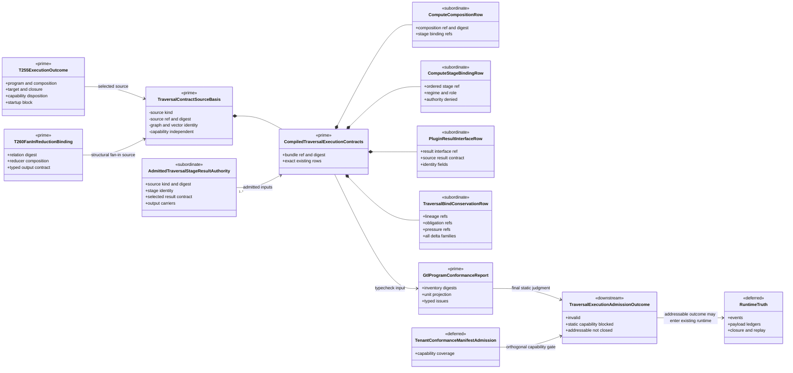
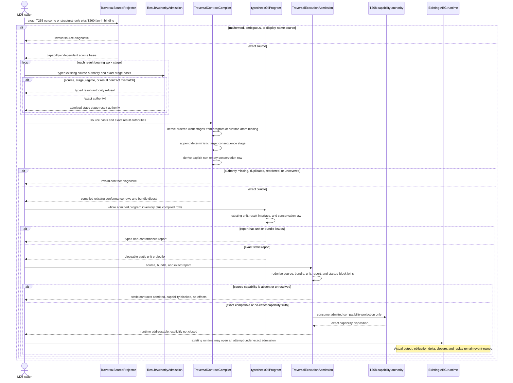
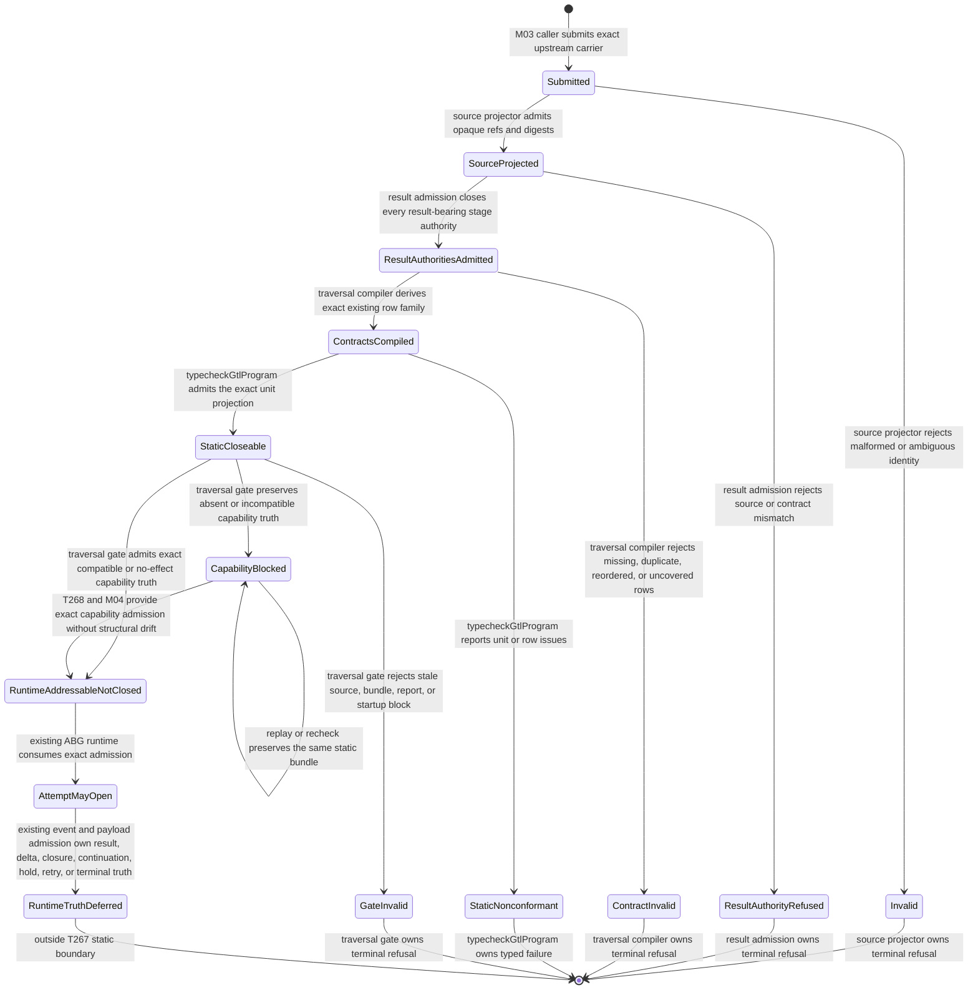

# M03 Traversal Result Interface And Bind Conservation Behavior Design

**Status**: Accepted under delegated F_H authority after bounded self-review
**Date**: 2026-07-13
**Ticket**: `T-267`
**Method authority**: `specification_methodology/specification/standards/DESIGN_MODULE_METHOD.md` section 5E
**Tenant authority**: [TYPESCRIPT_REALIZATION_GUARDRAILS.md](./TYPESCRIPT_REALIZATION_GUARDRAILS.md)

## Boundary

This design closes the final static contract boundary between one exact T-255
GraphVector execution source and the existing GTL program conformance
projection:

```text
T-255 selected-program handoff basis
  | T-260 selector-free fan-in reduction basis
+ admitted stage-result interface authority
-> exact composition and compute-stage rows
-> exact plugin-result interface rows
-> exact bind-conservation row
-> existing typecheckGtlProgram(...) TraversalUnit projection
-> static contract admission
-> capability-blocked static truth
  | runtime-addressable, explicitly not-closed truth
```

`TraversalUnit<A, B>` remains formal notation over existing GTL and ABG
carriers. T-267 does not create a new topology atom, public callable carrier,
runtime aggregate, controller, event family, or plugin. It produces a
content-derived static contract bundle and a gate judgment over the existing
T-255 startup block.

The existing `typecheckGtlProgram(...)` implementation remains the sole final
validator of `GtlProgramComputeCompositionRow`,
`GtlProgramComputeStageBindingRow`,
`GtlProgramPluginResultInterfaceRow`, and
`GtlProgramTraversalBindConservationRow`. T-267 compiles those existing rows
from exact upstream authority; it does not introduce a second conformance law.

Static closeability means that the admitted declarations are sufficient for a
runtime traversal attempt to open and later close lawfully. It does not mean
that an attempt occurred, a plugin result was accepted, a vector closed, an
obligation was discharged, or a terminal projection exists.

### Requirements

- `REQ-L-GTL3-CONTRACT-LAW-API-016/-017`
- `REQ-L-GTL3-GRAPHVECTOR-020`
- `REQ-L-GTL3-COMPUTE-NOTATION-025`
- `REQ-R-ABG3-INTERPRET-010/-019/-027/-028`
- `REQ-R-ABG3-FN-COMP-001..008/-015/-021..024`
- `REQ-R-ABG3-PAYLOAD-024/-025`
- `REQ-L-GTL3-C-ALGEBRA-016`
- `T-267` gap family `traversal_execution_contracts`

### Explicit Exclusions

- a new `TraversalUnit` carrier, topology type, graph selector, or public start;
- a Consensus-specific runtime, controller, result parser, conservation rule,
  or imperative traversal loop;
- changing T-252 body bytes or synthesizing a local C selector for the
  selector-free fan-in wrapper;
- accepting a display name, local file, prompt text, test name, or package path
  as result-interface, stage, lineage, obligation, pressure, or capability
  authority;
- treating a selected result-contract ref as an admitted result payload;
- treating a target-carrier contract or edge-closure contract as runtime
  satisfaction or closure evidence;
- erasing carried obligations because one scalar target is admitted;
- allowing a capability-blocked source to become runtime-addressable;
- self-admitting or locally minting the T-268 tenant-conformance manifest;
- adding traversal events, result ledgers, retry, recursion, HOF runtime, human
  interaction, or worker dispatch behavior already owned by existing modules;
- universal migration of legacy program inventories; and
- release qualification or proof-success claims.

## Design Decisions

### D1. T-267 consumes one exact T-255/T-260 source basis

`projectTraversalContractSourceBasis(...)` accepts one of two variants:

1. `selected_program_handoff`: a T-255 `published_startup_blocked` or
   `blocked_capability` outcome with exact selected program, composition,
   target carrier, edge closure, optional application lineage, and specialized
   workflow, batch, retry, or recurse relation; or
2. `structural_fan_in`: a T-255 `structural_only` outcome joined to one exact
   T-260 `CompiledFanInReductionBinding` and its selected Module-local reducer
   composition.

The projection rederives source identity from opaque refs and full digests. A
capability-blocked and later manifest-compatible selected-program outcome must
produce the same structural source digest. Capability admission is carried as
an orthogonal disposition and is not included in the structural identity.

The selected Module, execution-subject GraphFunction, owning GraphFunction,
and exact GraphVector are mandatory source-projector inputs. The projector
recompiles the T-255 handoff or T-260 fan-in binding inside that Module before
accepting the supplied carrier. A structurally valid object copied from another
Module, catalog entry, owner, or vector cannot become source authority merely
because its local digest is internally coherent.

The structural fan-in source remains capability-unresolved until the canonical
manifest path supplies exact effect coverage. T-267 cannot use the absence of
a local selector to bypass T-268.

### D2. Result-interface authority is admitted before row compilation

`AdmittedTraversalStageResultAuthority` is a closed static authority carrier,
not an output payload. Its source variants are:

| Source kind | Existing authority | Permitted use |
|---|---|---|
| `declared_fp_contract` | exact T-256 compiled execution-context stage plus one compatible selected result-contract ref and T-257 wire-profile law | result-bearing direct F_P stage |
| `declared_fh_contract` | exact T-256 compiled execution-context stage plus T-258 response-contract authority | result-bearing direct F_H callout stage |
| `deterministic_target_contract` | exact T-255 target carrier, selected composition regime, and deterministic stage | result-bearing direct F_D stage |
| `runtime_atom_contract` | exact T-259, T-260, T-261, or T-262 binding/plan output contract | workflow, HOF, retry, or recurse subordinate result |

Admission binds source ref and digest, stage ordinal and digest, domain stage
role, composition stage role, regime, selected result contract, result carrier
kind, output carriers, identity fields, selector authorities, and evidence.
The authority ref and digest are content-derived projections over those
existing sources. No caller-authored `result-interface://...` label can satisfy
the join by itself.

For F_P, static result-interface admission proves only that the exact selected
contract and wire profile are known. Raw output still reaches runtime truth
only through T-257. For F_H, the public response and resume admissions remain
T-258 truth. For deterministic and subordinate runtime atoms, their existing
typed output admissions remain authoritative.

### D3. Work-stage identity derives from program or specialized binding truth

The compiler projects ordered work stages as follows:

| T-255 disposition | Stage authority |
|---|---|
| `flat_executable` | exact normalized HoG stages |
| `workflow_sub_traversal` | exact T-259 workflow lift binding |
| `batch_task_family` | exact T-260 batch task bindings |
| `retry_attempt_family` | exact T-261 retry binding |
| direct recurse application | exact T-262 recurse binding/plan result contract |
| selector-free fan-in | exact T-260 fan-in reduction binding |

Each work stage maps to exactly one selected composition regime binding by
regime and exact source carrier relation. The generic compute-stage role comes
from that composition binding. It is never inferred from the domain stage-role
label. Missing, ambiguous, reordered, or carrier-incompatible mappings fail
before static admission.

### D4. One deterministic consequence stage completes each bind boundary

Every traversal contract bundle contains exactly one final deterministic
`consequence` stage after the ordered work stages. It is an ABG projection
boundary over the exact target-carrier and edge-closure contracts, not a
product plugin and not closure truth.

Its result interface derives from the selected target-carrier contract,
envelope contract, target kind, required identity fields, materialization
policy, and edge-closure basis. It cannot be supplied by a worker and cannot be
selected from a local result file. This gives the existing conformance
projection one explicit consequence result interface without pretending that
the consequence has executed.

The row identifies the constitutional ABG consequence-bind authority and uses
`F_D` only for deterministic projection admission. It does not claim that the
selected product composition declared an additional product regime. Its empty
plugin and hook sets, authority-denial fields, target/closure selector refs,
and system-bind evidence make that distinction compiler-visible.

### D5. Existing conformance row types remain the public static law

`compileTraversalExecutionContracts(...)` emits one immutable
`CompiledTraversalExecutionContracts` bundle containing:

```text
one GtlProgramComputeCompositionRow
one or more GtlProgramComputeStageBindingRow
one GtlProgramPluginResultInterfaceRow for each result-bearing work stage
one deterministic consequence GtlProgramPluginResultInterfaceRow
one GtlProgramTraversalBindConservationRow
```

The composition row preserves the selected T-255 composition ref/digest,
regime binding refs, closure contract, declaration source, and exact derived
stage refs. Stage rows are authority-denied: they may not write ledgers, emit
events, select traversal, close traversal, or own iteration.

The bundle ref and digest cover the exact source basis, every admitted result
authority, and every emitted row. Assertions rederive the whole bundle before
it can reach the gate.

### D6. Conservation is derived from load-bearing contract identity

The compiler produces one non-empty conservation row from exact opaque
authority, not from display names:

| Conservation field | Required source |
|---|---|
| intent lineage | source basis, selected program/relation, composition selection, and application lineage when present |
| target-carrier binding | exact target-carrier contract ref |
| materialization binding | exact materialization-policy ref |
| carried obligations | target contract, closure precondition, selected result contracts, and declared effect requirements |
| residual pressure | unresolved edge-assurance, closure-precondition, and effect-requirement refs |
| staged authority | every exact compiled compute-stage binding ref |
| admission strength | `GTL_PROGRAM_BIND_ADMISSION_STRENGTH_COMPATIBILITY_REF` |
| downstream terminal pressure | composition closure, edge closure, and edge-assurance refs |

Every row declares all eight constitutional obligation-delta families:
`realized`, `refined`, `downstream_deferred`, `blocked`, `reentered`,
`repriced`, `no_close_preserved`, and `terminal_projected`.

These are allowed future dispositions, not evidence that a disposition has
occurred. Runtime payload and bind admission must still account for each
obligation through admitted evidence. The static compiler cannot clear or
rewrite an obligation.

### D7. The existing conformance report is the final static judge

The caller combines compiled bundles with the exact module, target-carrier,
and edge-closure inventory, then calls `typecheckGtlProgram(...)`. T-267 does
not copy its rules into a local validator.

`admitTraversalExecution(...)` accepts only:

- one exact source basis and compiled bundle;
- one conformance report over the same subject and inventory digests;
- exactly one projected unit matching the source graph function, graph,
  vector, target, composition, stage, result-interface, and conservation refs;
- `report.passed === true`, `issueCount === 0`, and no issue row anywhere in
  the admitted whole-program inventory;
- the original T-255 startup block digest when the source was published.

A report assembled from another module, stale row set, wider result authority,
or mutated source is rejected.

### D8. Static admission and runtime closure are separate states

The closed `TraversalExecutionAdmissionOutcome` family is:

```text
invalid
static_contracts_admitted_capability_blocked
runtime_addressable_not_closed
```

`static_contracts_admitted_capability_blocked` proves that result-interface and
conservation law close statically while preserving `runtimeAddressable: false`
and `effectsPermitted: false`. This is the expected T-252 state before T-268.

`runtime_addressable_not_closed` requires the same static proof plus exact
`compatible_exact_manifest` or `not_applicable_no_effect_requirements`
capability truth. It sets `runtimeAddressable: true` but records
`runtimeClosed: false`, `resultAdmitted: false`, and `obligationsDischarged:
false`. No event or output is fabricated. Canonical runtime entry must consume
this exact admission ref and digest together with the original request or
handoff; retaining only the old startup-blocked carrier cannot invoke an
effect.

### D9. T-268 changes capability disposition, not structural identity

T-268 publishes and M04 admits the canonical tenant-conformance manifest.
T-255 then projects exact effect compatibility. Recompiling T-267 over that
source must preserve the structural source digest and compiled static bundle
digest. Only the capability disposition and final gate outcome may change.

This independence prevents either gate from becoming a second authority for
the other. T-267 cannot self-admit capability. T-268 cannot bypass result
interface or conservation.

### D10. T-252 remains unchanged and one non-Consensus fixture proves reuse

The canonical T-252 body digest remains fixed. Its probe supplies the exact
T-255/T-260 source outcomes and compiler-derived T-256/T-257/T-258 or runtime-
atom result authorities to the generic T-267 compiler. The full conformance
report must lose only `traversal_execution_contracts`; the independent T-268
capability gap remains.

A non-Consensus fixture must prove the same compiler and gate with:

- one direct F_P stage admitted under T-257 result-contract law;
- one deterministic consequence stage;
- exact target/materialization/stage/conservation coverage;
- all eight allowed obligation-delta families;
- capability-blocked and runtime-addressable-not-closed outcomes; and
- mutation failures for source, result contract, stage, target, conservation,
  report, and capability identity.

## Irreducible Architectural Carrier Set

| Carrier | Visibility | Authority | Role |
|---|---|---|---|
| T-255 execution outcome | public M03 | authoritative upstream | selected-program, target, closure, composition, lineage, and capability truth |
| T-260 fan-in reduction binding | public M03 | authoritative upstream | selector-free structural source and inherited reducer composition |
| `TraversalContractSourceBasis` | module-local projection | prime | capability-independent exact static source identity |
| `AdmittedTraversalStageResultAuthority` | public M03 | authoritative admission | exact static result contract for one result-bearing work stage |
| existing compute-composition row | public conformance input | authoritative compiled row | selected composition and stage set |
| existing compute-stage row | public conformance input | subordinate compiled row | ordered authority-denied work or consequence stage |
| existing plugin-result-interface row | public conformance input | subordinate compiled row | static output admission contract, not output truth |
| existing bind-conservation row | public conformance input | authoritative compiled row | lineage, obligation, pressure, and disposition conservation basis |
| `CompiledTraversalExecutionContracts` | public M03 projection | prime | immutable join of source, result authorities, and existing conformance rows |
| existing conformance report and unit projection | public M03 | authoritative judge | final whole-program static typecheck |
| `TraversalExecutionAdmissionOutcome` | public M03 projection | downstream gate result | invalid, capability-blocked static admission, or addressable-not-closed admission |
| T-268 canonical manifest admission | deferred external authority | authoritative capability input | exact effect compatibility only |
| runtime events and payload ledgers | existing ABG runtime | deferred from this slice | actual attempts, outputs, closure, dispositions, and replay truth |

## Domain Model



## Sequence Model



## Lifecycle State Model



## Cross-View Checks

| Check | Domain | Sequence | State | Verdict |
|---|---|---|---|---|
| every participant has a carrier | source, result, bundle, report, gate, capability, and runtime carriers are explicit | each participant maps to one domain carrier or external caller | every transition names the same owner | pass |
| selector-free fan-in stays structural | T260 binding is a distinct source variant | source projector consumes binding, never a local selector | malformed join enters `Invalid` | pass |
| result interface is not raw output | admitted authority is static and subordinate | result admission precedes compilation; runtime output remains deferred | no static state transitions to result accepted | pass |
| consequence contract is not closure | consequence row is subordinate | compiler only projects target consequence | addressable state remains `NotClosed` | pass |
| obligation vector is conserved | conservation row owns non-empty exact refs and all delta families | compiler derives rows before typecheck | no static state discharges obligations | pass |
| capability is orthogonal | manifest admission is deferred and separate | capability is consumed only at the final gate | capability transition preserves bundle identity | pass |
| compile before effects | gate outcome is the only runtime association | runtime message occurs only after exact static and capability admission | all earlier failure states terminate | pass |
| existing conformance law remains singular | existing rows and report are reused | `typecheckGtlProgram` is the sole static judge | `StaticNonconformant` is report-owned | pass |
| runtime truth remains event-owned | events and ledgers are deferred | sequence explicitly stops static claims before runtime result | runtime truth is outside T267 | pass |

## Cross-View Axiom Evaluation

| Axiom | Authority | Domain evidence | Sequence evidence | State evidence | Native enforcement | Admission/compiler enforcement | Verdict | Gap owner |
|---|---|---|---|---|---|---|---|---|
| GTL declares; ABG interprets | product ontology and `INTERPRET` | T255/T260 sources remain GTL-derived; T267 rows are ABG static projections | compiler consumes admitted carriers only | authored and projected states stay distinct | closed TypeScript variants | source and row rederivation | pass | none |
| TraversalUnit is notation, not a new carrier | `COMPUTE-NOTATION-025` | no TraversalUnit class exists | no participant named as a runtime aggregate | lifecycle uses source, bundle, report, and gate | no exported topology type | conformance unit remains projection | pass | none |
| raw probabilistic output cannot close | `PAYLOAD-024/-025` | static result authority is not payload | F_P authority cites T257; actual output deferred | no static result-accepted state | source-kind union | T257/runtime admission remains required | pass | none |
| bind conserves lineage and obligation vectors | `FN-COMP-023` | explicit conservation row | compiler derives every required family before typecheck | no static discharge transition | non-empty readonly arrays | existing conformance coverage checks | pass | none |
| materialization and staged pressure share admission strength | `CONTRACT-LAW-API-017` | one compatibility ref in the row | same compiler derives both bindings | divergence enters contract or conformance failure | exact constant type | existing admission-strength check | pass | none |
| compile before effects | `C-ALGEBRA-016` | final admission is downstream of report | runtime reached only after gate | failure states stop before attempt | no effect method on compiler carriers | gate checks static and capability truth | pass | none |
| capability manifest is singular | `REQ-M-GTL3-CAPABILITY`, T268 | manifest is deferred external authority | gate consumes projection only | capability blocked remains explicit | no manifest constructor here | T255/T268/M04 retain admission | pass | T268 remains until publication |
| edge contract is not edge closure | `FN-COMP-007/-008` | target and closure refs are contract inputs | consequence projection does not emit closure | addressable state says not closed | literal false fields | runtime events own closure | pass | none |
| no product-local controller | product and design method | bundle contains data only | no loop except compiler stage iteration | no controller memory state | pure compiler API | replay/runtime remains existing ABG | pass | none |
| canonical body remains immutable | T252 | body is external source input | probe compiles without body mutation | no mutation state | digest literal in proof | T252 manifest check | pass | none |

## Proof Matrix

| Proof | Required evidence |
|---|---|
| source variants | exact selected-program and selector-free fan-in sources compile; copied, ambiguous, or digest-drifted sources fail |
| capability independence | blocked and compatible selected-program sources retain one structural source digest and one bundle digest |
| direct F_P interface | T256 selected stage and contract compile one interface; T257 accepts a canonical sample and rejects contract drift |
| F_H interface | T256/T258 result and operation authority compile one external-callout interface without response fabrication |
| deterministic interface | exact target carrier compiles F_D work and final consequence interfaces; target mutation fails |
| runtime atoms | workflow, batch, fan-in, retry, and recurse bindings compile result authority without local selectors or imperative wrappers |
| stage derivation | domain roles never select generic roles; regime/composition mismatch and order drift fail |
| conservation | target, materialization, result, stage, obligation, pressure, admission-strength, and all eight delta families are exact and non-empty |
| existing judge | complete bundles pass existing `typecheckGtlProgram`; missing or changed rows produce existing rule refs |
| gate truth | capability-blocked remains no-effect; compatible source becomes addressable with `runtimeClosed: false` |
| request join | canonical effect entry requires the exact admission ref/digest in addition to the original startup-blocked request or handoff |
| replay-safe identity | repeated compilation is byte-equivalent; source, result, row, report, or startup-block mutation fails |
| canonical T252 | body digest unchanged; `traversal_execution_contracts` disappears; only T268 remains |
| non-Consensus reuse | generic F_P fixture proves the same compile/typecheck/gate path |
| package surface | packed consumer sees only public compile/admission carriers, not private constructors |

## Non-Closure

- changing the canonical T-252 body;
- creating a new GTL declaration or `TraversalUnit` runtime object;
- deriving stage role, result contract, or conservation truth from display
  names, file paths, prompt prose, test fixtures, or package presence;
- accepting caller-authored result-interface refs without exact source
  authority and digest;
- generating empty lineage, obligation, pressure, or evidence arrays merely to
  satisfy row shape;
- omitting any obligation-delta family;
- treating static contract presence as result admission, runtime closure,
  obligation discharge, assurance success, or terminal truth;
- making a capability-blocked selected or structural HOF source
  runtime-addressable;
- changing the structural bundle when T268 changes only capability truth;
- adding T267-specific retry, recursion, batching, fan-in, human, dispatch,
  event, ledger, or continuation logic;
- duplicating `typecheckGtlProgram` predicates in a local validator; or
- claiming release qualification before T268 and release-wide proof close.

## Operational Lifecycle

| Phase | Disposition |
|---|---|
| upstream authority | active requirements plus completed T255-T262 carriers |
| realization | one generic source projector, result-authority admission, static row compiler, and gate |
| proof | focused generic and canonical fixtures, existing conformance suite, source-blind package gates, full semantic suite |
| release/package | public M03 contract exports and regenerated product publication |
| install | existing ABG package install; no new CLI or service |
| live use | capability-blocked until T268; later addressable but never statically closed |
| telemetry | no new telemetry; existing runtime events and ledgers own actual use |
| retirement | T255 startup block is superseded only by exact T267 admission over its digest; source history remains immutable |

## Design Verdict

`accepted_under_delegated_fh`. The boundary is intentionally static and
proportional. It closes the existing result-interface and conservation rows,
reuses the existing conformance judge, and opens no effect path while T268 is
unresolved. Implementation is authorized only within the compiler, admission,
gate, proof, and publication boundaries stated above.
