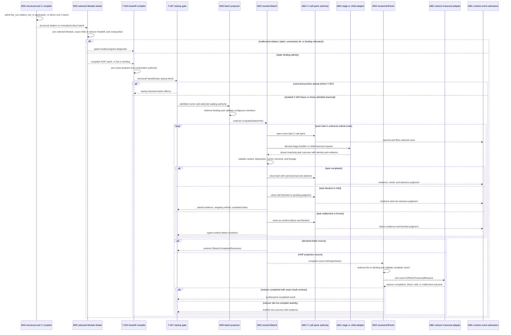
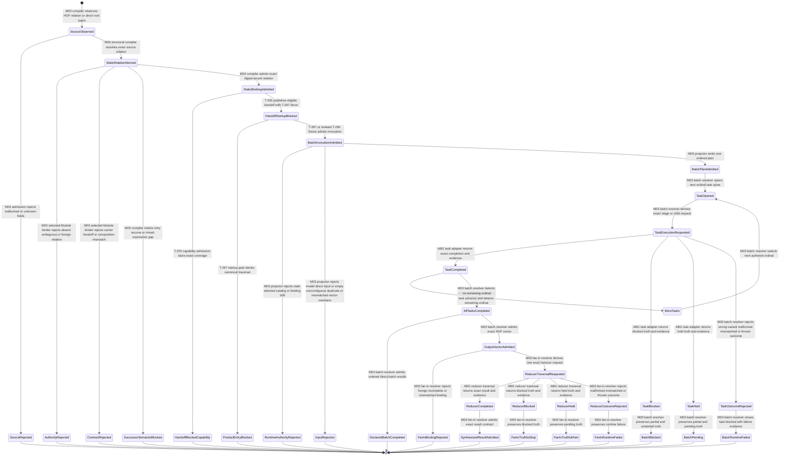

# M03 Typed HOF And `C.batch` Runtime Behavior Design

**Status**: Accepted under delegated F_H authority after bounded self-review
**Date**: 2026-07-13
**Ticket**: `T-260`
**Method authority**: `specification_methodology/specification/standards/DESIGN_MODULE_METHOD.md` section 5E
**Tenant authority**: [TYPESCRIPT_REALIZATION_GUARDRAILS.md](./TYPESCRIPT_REALIZATION_GUARDRAILS.md)

## Boundary

This design realizes one generic typed vector execution relation:

```text
admitted fan_out(child, Vector<A>, Vector<B>)
  -> ordinal-preserving C.batch plan
  -> one child task traversal per admitted A member
  -> complete admitted Vector<B>
  -> admitted fan_in(reducer, Vector<B>)
  -> one reducer traversal and synthesized result
```

The same batch executor also realizes one direct root `C.batch(tasks,
batchRef)` declaration. Authored direct batches and HOF-projected batches have
different static sources, but both compile into one closed
`CompiledCBatchPlan` and use one ABG runtime authority. There is no HOF
scheduler beside the C runtime.

The runtime is serial and ordinal-stable. Serial execution is a lawful
realization of declared fan-out and avoids adding scheduler, lease, or
concurrency policy to this ticket. A future bounded-parallel realization may
replace only the task-dispatch effect edge when it proves observational
equivalence under the existing saga-frontier law.

This ticket makes the unchanged T-252 HOF declarations statically compilable.
It does not authorize canonical product effects. The T-267 startup fence
remains authoritative, the canonical child retry remains blocked by T-261,
and recursive applications remain blocked by T-262.

### Requirements

- `REQ-L-GTL3-HOF-001`, `-002`, `-005`, `-006`, and `-009..-012`
- `REQ-L-GTL3-C-ALGEBRA-007`, `-014`, and `-016`
- `REQ-R-ABG3-CCALL-001`, `-002`, `-004..-006`, `-008`, `-013`, and `-014`
- `REQ-R-ABG3-LINEAGE-002`
- `REQ-R-ABG3-SAGA-FRONTIER-002`, `-004`, and `-010`
- `T-260` gap families `typed_fan_out_runtime`,
  `typed_fan_out_batch_projection`, and
  `typed_fan_in_structure_and_runtime`

### Explicit exclusions

- a Consensus dispatcher, reviewer loop, panel cardinality, or product term;
- parallel scheduling, leases, concurrency policy, cancellation, or
  compensation;
- fixed tuple cardinality or task generation from display names or tags;
- output ordering by promise completion time;
- treating `batchRef` as a call, scheduler, result, or closure authority;
- partial-vector fan-in or graph-success projection;
- retry semantics owned by T-261;
- recursion semantics owned by T-262;
- top-level TraversalUnit and result conservation owned by T-267;
- tenant-capability publication owned by T-268; and
- arbitrary `C.batch` nested inside `C.compose`, `C.edge`, `C.retry`, or
  `workflow.C`. T-260 realizes the direct root batch and the typed HOF
  projection demanded by the current body.

## Design Decisions

### D1. The normalized HoG program remains a closed union

`HogProgramDeclaration` gains one direct-batch variant:

```text
flat program
  = non-empty stages + exactly one result-bearing stage

direct workflow program
  = empty stages + exactly one HogWorkflowLift

direct batch program
  = empty stages + exactly one non-empty HogBatchDeclaration
```

`HogBatchDeclaration` preserves the authored `batchRef`, common input/output
carrier refs, and an ordered non-empty list of `HogBatchStageTask` values.
Each task retains one authored `C.of` leaf and its ordinal. Flat and
direct-workflow serialization remains unchanged.

Only a direct root `c_batch` whose members are direct executable `C.of` leaves
lowers to this variant in T-260. A nested batch or a task containing compose,
edge, workflow, retry, or another batch remains `semantic_not_realized` before
effects. This restriction matches `C-ALGEBRA-007`'s one-spine-per-invoking-task
law without inventing an outer task spine around a second internal program.

The existing flat HoG runner explicitly rejects both workflow and batch
variants. A zero-stage non-flat program can never be mistaken for an
executable no-op.

### D2. Structural compilation and selected-Module binding stay separate

`compileHofRelation` returns an admitted `CompiledHofFanOutRelation` after the
existing structural checks pass. It has no Module input and therefore cannot
mint catalog or Module authority. A separate `compileHofFanOutBinding` joins
that relation to the selected Module, exact child execution handoff, and
catalog-visible parent authority. The final binding digest covers:

- the structural relation digest;
- the exact selected Module digest;
- the HOF host and child GraphFunction refs and digests;
- the wrapper GraphVector ref;
- input/output vector Node refs and schemas;
- input/output member Node refs and schemas;
- the declared application ref and relation ref; and
- the child input/output interface relation.

Neither carrier holds runtime members, task results, scheduler state, or an
inferred cardinality. Runtime rederives the structural relation and final
binding from the exact selected catalog entry and Module before projecting any
task. A structural compiler result cannot be used as runtime authority by
itself.

### D3. Fan-out lowers to one runtime-cardinality C.batch plan

An admitted `HofVectorInvocation` supplies one non-empty ordered input-vector
carrier. Each member row carries:

```text
ordinal
memberNodeRef
memberSchemaRef
payloadRef
lineageRef
```

The projector validates contiguous zero-based ordinals, exact member
contracts, unique lineage and payload identities, and input-vector basis. It
then produces one `HofCBatchTraversalTask` per member. Every task retains:

- the HOF binding ref;
- child GraphFunction ref and digest;
- input and output member contracts;
- original member ordinal and lineage;
- enclosing selected catalog entry and Module digest; and
- exact declared C-call program, stage, fibre, arm, and composition locus from
  the admitted child execution handoff.

The runtime cardinality comes only from the admitted vector. It is not copied
from a fixture, product label, or TypeScript tuple length. `batchRef` is a
stable digest over the HOF invocation and binding. It groups the task spines
and has no independent execution meaning.

### D4. One batch executor owns ordinal task traversal

`resolveCBatch` consumes one closed `CompiledCBatchPlan`. The plan source is
either `declared_batch` or `hof_projection`; both sources retain their own
static binding ref. Its task family is a closed union:

```text
DeclaredCBatchStageTask
  = one exact authored C.of stage and handler locus

HofCBatchTraversalTask
  = one exact module-contained child GraphFunction traversal
```

The executor:

1. validates the plan and selected Module authority;
2. rederives the source binding before effects;
3. invokes tasks serially in ascending authored ordinal;
4. opens one existing ABG C-call spine for each invoking task;
5. derives either one stage-handler request or one child-traversal request;
6. validates the returned variant, carrier pair, terminal, and evidence;
7. closes that task spine exactly once; and
8. either continues with the next ordinal or returns truthful partial failure.

The internal task adapter may execute the selected stage interior or traverse
the selected child GraphFunction according to the task variant. It cannot mint
the task plan, C-call spine, aggregate result, task judgment, or batch
disposition.

### D5. Partial failure is all-or-block for vector truth

For `hof_projection`, an output vector admits only after every task completes
exactly once with the declared output-member contract. Its rows are sorted and
attributed by input ordinal, independent of completion timing. A
`declared_batch` instead returns an ordered `CBatchCompletedResolution`; it
does not misstate its same-carrier per-task results as a typed HOF vector.

The first blocked, held, malformed, or runtime-failed task stops serial
execution. `CBatchBlockedResolution` preserves:

- completed task outcomes and their C-call refs;
- the stopping task ordinal and truthful disposition;
- the ordered refs of tasks not yet started;
- all emitted runtime events; and
- the input vector and batch basis.

It carries neither a completed batch result nor an output-vector carrier. No
fan-in invocation or graph-success projection can be derived from it. Held
maps to `pending`; blocked maps to `blocked`; malformed or thrown adapter
output maps to a fail-closed runtime failure and blocked C judgment.

### D6. Fan-in is a separately bound application

For an application whose sole ordered step is `fan_in`,
`compileGraphFunctionApplication` returns an admitted
`CompiledFanInApplicationRelation`. Like the fan-out structural compiler, it
has no Module input and does not mint selected-catalog authority. A separate
`compileFanInReductionBinding` joins the relation to the exact selected Module,
T-255 composition selection, and reducer execution handoff. The final binding
preserves:

- the exact application lineage and application ref;
- execution-subject and reducer GraphFunction refs and digests;
- input vector Node/member contract;
- synthesized output contract; and
- exact composition owner and selected execution locus.

Applications containing recurse remain `semantic_not_realized`. An accepted
fan-in compilation is therefore not a generic acceptance of every
GraphFunction application.

The T-255 handoff consumes accepted fan-in lineage directly. It no longer
requires the old catch-all runtime-gap diagnostic for fan-in, while retaining
that diagnostic for recursion and any unrealized application family.

### D7. Fan-in consumes only a complete admitted vector

`resolveHofFanIn` accepts one `AdmittedHofVector`, not an arbitrary array. The
vector may be the `HofOutputVector` produced by T-260 fan-out or another
admitted producer of the same declared vector contract; its producer and
lineage remain explicit. The resolver revalidates vector basis, exact
contract, cardinality, contiguous ordinals, unique member attribution, and
application lineage against the fan-in binding. It then invokes the exact
reducer once through an ABG-owned traversal request.

Only a completed reducer outcome with the declared output contract becomes a
`HofFanInCompletedResolution`. Blocked, held, malformed, or thrown outcomes
remain non-success and preserve reducer traversal evidence. No prompt asset,
product policy, or caller-authored default can select the reducer or synthesize
its result.

### D8. Selected catalog and composition authority is conserved

Both fan-out and fan-in invocations carry the already selected
`CatalogExecutionBinding`. Resolution follows one authority path:

```text
selected public catalog entry
  -> exact digest-bound Module
  -> exact HOF host or application subject
  -> exact contained child or reducer
  -> exact compiled program and composition locus
```

The runtime never searches all catalog entries for a helpful sibling. Names
may support the existing unambiguous legacy admission path inside the selected
Module; ids and digests govern compiled runtime identity. A stale Module,
foreign binding, changed child, changed reducer, or changed composition stops
before task traversal.

### D9. T-261, T-262, T-267, and T-268 stay visible

The canonical reviewer child contains `C.retry`. T-260 may compile its HOF
relation and batch projection, but canonical child execution remains blocked
until T-261 admits the retry program. The recurse application retains its
typed T-262 gap. Every canonical handoff retains
`startup_blocked_awaiting_t267`, so T-260 fixtures prove isolated generic
atoms rather than product startup. Tenant capability coverage remains an
external T-268 publication concern.

## Irreducible Architectural Carrier Set

| Carrier | Visibility | Authority | Role |
|---|---|---|---|
| admitted `HofApplicationDeclaration` | GTL authored input | prime | exact fan-out structural relation |
| `CompiledHofFanOutRelation` | M03 structural compiler | prime | host, child, vector, and member relation without Module authority |
| `CompiledHofFanOutBinding` | M03 binding compiler | prime | selected-Module join over the structural relation and child handoff |
| admitted direct `CBatchNode` | GTL authored input | prime | ordered static batch declaration |
| `HogBatchProgramDeclaration` | normalized M03 program | subordinate projection | closed direct-root batch representation |
| `HofInputVector` | M03 invocation input | prime | admitted ordered input members and vector basis |
| `CompiledCBatchPlan` | M03 runtime plan | prime | one ordered task family from one declared source |
| `DeclaredCBatchStageTask` | batch-owned subordinate | subordinate | one exact authored C stage, ordinal, carriers, and C locus |
| `HofCBatchTraversalTask` | batch-owned subordinate | subordinate | one exact child traversal, ordinal, carriers, and lineage |
| `CatalogExecutionBinding` | admitted runtime catalog | authoritative | selected public entry and exact Module |
| `CBatchTaskExecutionRequest` | internal M03 effect edge | effect-edge | closed stage-handler or child-traversal request inside one task spine |
| `CBatchTaskExecutionOutcome` | ABG runtime output | subordinate evidence | closed stage or child completion, block, or hold |
| C-call runtime events | ABG event authority | authoritative | one spine and judgment per invoking task |
| `HofOutputVector` | M03 batch result | prime | complete ordinal-preserving vector only |
| `CBatchCompletedResolution` | M03 batch result | downstream | ordered direct-batch task results without HOF-vector meaning |
| `CBatchBlockedResolution` | M03 batch result | authoritative stop | partial evidence, stopping ordinal, and unstarted tasks |
| `CompiledFanInApplicationRelation` | M03 structural compiler | prime | exact vector-to-reducer application lineage without Module authority |
| `CompiledFanInReductionBinding` | M03 binding compiler | prime | selected-Module, composition, and reducer execution join |
| `HofFanInTraversalRequest` | internal M03 effect edge | effect-edge | exact reducer traversal request |
| `HofFanInResolution` | M03 runtime output | downstream | completed synthesis or truthful non-success |
| `TraversalStartupBlock` | T-255/T-267 boundary | authoritative block | prevents product effects before conservation closes |

## Domain Model

```mermaid
classDiagram
  direction LR

  class HofApplicationDeclaration {
    <<prime>>
    +applicationRef
    +relationRef
    +childGraphFunctionRef
    +vectorNodeRefs
    +memberNodeRefs
  }
  class CompiledHofFanOutRelation {
    <<prime>>
    +relationDigest
    +hostRef
    +childRef
    +vectorMemberContracts
  }
  class CompiledHofFanOutBinding {
    <<prime>>
    +bindingRef
    +moduleDigest
    +relationDigest
    +hostDigest
    +childDigest
    +memberContracts
  }
  class DirectCBatchNode {
    <<prime>>
    +batchRef
    +inputCarrierRef
    +outputCarrierRef
    +tasks nonempty
  }
  class HogBatchProgramDeclaration {
    <<subordinate>>
    +programRef
    +batchRef
    +tasks ordered
  }
  class HofInputVector {
    <<prime>>
    +vectorRef
    +basisRef
    +members ordered
  }
  class HofInputMember {
    <<subordinate>>
    +ordinal
    +contractRef
    +payloadRef
    +lineageRef
  }
  class CompiledCBatchPlan {
    <<prime>>
    +planRef
    +sourceKind
    +sourceBindingRef
    +batchRef
    +tasks ordered
  }
  class DeclaredCBatchStageTask {
    <<subordinate>>
    +ordinal
    +stageRole
    +regime
    +armId
    +carrierRefs
    +cCallLocus
  }
  class HofCBatchTraversalTask {
    <<subordinate>>
    +ordinal
    +childGraphFunctionRef
    +carrierRefs
    +lineageRef
    +cCallLocus
  }
  class CatalogExecutionBinding {
    <<authoritative>>
    +entryRef
    +moduleDigest
    +module
  }
  class CBatchTaskExecutionRequest {
    <<effect-edge>>
    +taskRef
    +cCallRef
    +taskKind
    +inputPayloadRef
  }
  class CBatchTaskExecutionOutcome {
    <<subordinate>>
    +taskKind
    +disposition
    +terminalRef
    +evidenceRefs
  }
  class CCallRuntimeEvents {
    <<authoritative>>
    +opened
    +selected
    +evidenced
    +resultAdmitted
    +judged
  }
  class HofOutputVector {
    <<prime>>
    +vectorRef
    +basisRef
    +members ordered
  }
  class CBatchCompletedResolution {
    <<downstream>>
    +batchRef
    +taskResults ordered
  }
  class CBatchBlockedResolution {
    <<authoritative>>
    +completedTasks
    +stoppingOrdinal
    +unstartedTaskRefs
  }
  class CompiledFanInApplicationRelation {
    <<prime>>
    +relationDigest
    +applicationLineageRef
    +reducerRef
    +inputVectorContract
    +outputContract
  }
  class CompiledFanInReductionBinding {
    <<prime>>
    +bindingRef
    +moduleDigest
    +relationDigest
    +applicationLineageRef
    +reducerRef
    +inputVectorContract
    +outputContract
  }
  class HofFanInTraversalRequest {
    <<effect-edge>>
    +bindingRef
    +reducerRef
    +inputVectorRef
  }
  class HofFanInResolution {
    <<downstream>>
    +status
    +outputPayloadRef optional
    +reasonRef optional
  }
  class TraversalStartupBlock {
    <<authoritative>>
    +effectsPermitted false
  }
  class RetryRuntime {
    <<deferred>>
    +owner T261
  }
  class RecursionRuntime {
    <<deferred>>
    +owner T262
  }

  HofApplicationDeclaration --> CompiledHofFanOutRelation : M03 compiles structure
  CompiledHofFanOutRelation --> CompiledHofFanOutBinding : selected Module binds
  DirectCBatchNode --> HogBatchProgramDeclaration : M03 normalizes
  HofInputVector *-- HofInputMember : owns ordered
  CompiledHofFanOutBinding --> CompiledCBatchPlan : projects with input vector
  HogBatchProgramDeclaration --> CompiledCBatchPlan : compiles direct batch
  CompiledCBatchPlan *-- DeclaredCBatchStageTask : owns declared variant
  CompiledCBatchPlan *-- HofCBatchTraversalTask : owns HOF variant
  CatalogExecutionBinding --> CompiledHofFanOutBinding : selects exact module
  CatalogExecutionBinding --> CompiledFanInReductionBinding : selects exact module
  DeclaredCBatchStageTask --> CBatchTaskExecutionRequest : derives handler request
  HofCBatchTraversalTask --> CBatchTaskExecutionRequest : derives child request
  CBatchTaskExecutionRequest --> CBatchTaskExecutionOutcome : ABG executes
  CBatchTaskExecutionOutcome --> CCallRuntimeEvents : M03 admits and closes
  CCallRuntimeEvents --> HofOutputVector : all tasks complete
  CCallRuntimeEvents --> CBatchCompletedResolution : declared tasks complete
  CCallRuntimeEvents --> CBatchBlockedResolution : any task stops
  HofOutputVector --> CompiledFanInApplicationRelation : exact input
  CompiledFanInApplicationRelation --> CompiledFanInReductionBinding : selected Module binds
  CompiledFanInReductionBinding --> HofFanInTraversalRequest : derives once
  HofFanInTraversalRequest --> HofFanInResolution : ABG traverses reducer
  TraversalStartupBlock ..> CompiledCBatchPlan : blocks canonical product entry
  RetryRuntime ..> HofCBatchTraversalTask : canonical child remains blocked
  RecursionRuntime ..> CompiledFanInReductionBinding : recurse stays separate
```



## Execution Sequence



Every decision and effect boundary has one owner. The compiler and projector
are pure. Child and reducer adapters may traverse only the request they
receive. ABG event admission owns C-call truth. The startup gate remains before
every canonical effect.

## Lifecycle State Model



Every transition names its compiler, handoff, gate, projector, resolver,
traversal, or event owner. There is no partial-task-to-vector-success edge and
no vector-to-synthesized-result edge that skips exact fan-in traversal.

## Cross-View Checks

| Check | Evidence | Verdict |
|---|---|---|
| Every sequence participant exists in the domain model or is an owned boundary | structural compiler, selected-Module binder, handoff, gate, projector, batch resolver, spine, task/reducer adapters, fan-in resolver, and events map to modeled carriers or authorities | `pass` |
| Every lifecycle carrier exists in the domain model | authored relation, compiled binding, vector, plan, task, outcomes, events, blocked result, fan-in binding, and result are represented | `pass` |
| Every transition names its owner | state edges name M03 compiler/projector/resolver, T-255, T-267, ABG traversal, or event admission | `pass` |
| HOF does not create a second scheduler | fan-out projects into the one C.batch plan and executor | `pass` |
| Runtime cardinality is admitted data | plan tasks derive from ordered input members, never fixture constants | `pass` |
| Structural compilers do not mint runtime authority | separate relation carriers precede selected-Module fan-out and fan-in bindings | `pass` |
| Selected catalog authority remains exact | runtime rederives structural relations and final bindings within one selected digest-bound Module | `pass` |
| Each invoking task has one spine | task ordinal enters the existing C-call identity tuple; batchRef only groups | `pass` |
| Completion timing cannot reorder truth | output rows bind to original ordinal and fan-in validates that order | `pass` |
| Partial failure cannot synthesize a vector | blocked resolution has no output-vector carrier or fan-in edge | `pass` |
| Retry and recursion do not enter by implication | both remain explicit deferred families and semantic gaps | `pass` |
| Product effects remain fenced | T-267 block appears in all three views | `pass` |
| Parallel execution is claimed | explicitly excluded; serial execution satisfies current semantics | `not_applicable` |

## Axiom Evaluation

| Axiom | Authority | Domain evidence | Sequence evidence | State evidence | Native enforcement | Admission/compiler enforcement | Verdict | Gap owner |
|---|---|---|---|---|---|---|---|---|
| Fan-out preserves exact vector/member types | `HOF-001/-005` | declaration and binding retain both vector and member contracts | compiler validates before projection | mismatch enters `ContractRejected` | native HOF witnesses | raw compiler joins explicit schemas and Nodes | `pass` | none |
| Fan-out lowers through C.batch, not hidden orchestration | `HOF-006/-009`; `C-ALGEBRA-007` | one `CompiledCBatchPlan` owns tasks | projector hands one plan to one resolver | no HOF scheduler state exists | closed plan source union | compiler rejects unbound source | `pass` | none |
| Batch tasks are non-empty and ordered | `C-ALGEBRA-007`; `HOF-009` | vector and plan own ordered non-empty members/tasks | serial loop uses authored ordinal | empty or noncontiguous input rejects | native direct batch constructor | runtime vector admission for dynamic projection | `pass` | none |
| One invoking task equals one C-call spine | `CCALL-001/-002/-005` | each admitted task is one direct C stage or one HOF sub-traversal with exact locus and ordinal | resolver opens and closes once per task | task cannot complete without judgment | closed task variant | existing spine constructor validates identity | `pass` | none |
| `batchRef` is grouping only | `CCALL-005`; `HOF-009` | batchRef is plan data, not call/result carrier | task spines remain independent | no batch-call state exists | separate carrier fields | digest and task-spine checks | `pass` | none |
| Serial and future parallel execution preserve meaning | `SAGA-FRONTIER-002/-010` | output vector binds ordinal, not timing | current resolver is serial | only ordinal controls progression | immutable task order | result admission reorders by declared ordinal | `pass` | future parallel effect-edge owner if demanded |
| Partial failure is all-or-block | `HOF-010` | complete vector and blocked result are disjoint | first non-complete task stops and returns evidence | no blocked-to-vector transition | discriminated resolution union | cross-field and cardinality admission | `pass` | none |
| Fan-in requires one complete exact vector | `HOF-002/-011` | binding and vector retain basis/cardinality/contracts | resolver validates before reducer | mismatched vector terminates | typed vector witness | exact runtime admission and lineage join | `pass` | none |
| Reducer is invoked exactly once | `HOF-011` | one binding names one reducer | one request outside any task loop | one reducer lifecycle per invocation | singular reducer field | exact contained ref and outcome validation | `pass` | none |
| Application lineage remains exact | `LINEAGE-002`; graph-function application law | fan-in binding carries full lineage projection | handoff and reducer request preserve lineage ref | lineage mismatch rejects | immutable lineage carrier | compiler rederives application chain | `pass` | none |
| Structural truth is not selected-Module authority | `HOF-012` and catalog law | structural relation and final binding are distinct carriers | binder joins before handoff and runtime rederives | missing final binding cannot reach invocation | no Module field on structural relation | exact binding compiler owns Module join | `pass` | none |
| Selected Module is runtime authority | `HOF-012` and catalog law | catalog binding points to one Module | projector/reducer rederive before effects | stale or foreign input rejects | no all-catalog carrier | exact digest and containment checks | `pass` | none |
| Unresolved semantics stop before effects | `C-ALGEBRA-016` | deferred retry/recurse and startup block are explicit | gate and compiler precede adapters | successor gaps terminate | closed variants distinguish unrealized families | semantic compiler and T-267 gate | `pass` | T-261, T-262, T-267 |
| ABG owns runtime truth | ODD and `CCALL` law | adapters are effect edges; events are authoritative | adapters return evidence; resolvers admit truth | no adapter outcome closes itself | adapter cannot construct authoritative event carrier | spine and result admission | `pass` | none |
| Closure is proportional to current demand | T-260 boundary | direct batch plus typed HOF/fan-in only | no scheduler or product loop | unsupported mixed shapes stop | no base-algebra redesign | focused generic and T-252 probes | `pass` | future mixed-expression owner if demanded |

## Proof Contract

T-260 closure requires:

1. the four new HOF runtime clauses pass specification lint and trace review;
2. valid fan-out compilation returns one structural relation, selected-Module
   binding returns one digest-bound runtime carrier, and neither retains the
   `gtl-hof-unrealized-fan-out` diagnostic;
3. malformed, ambiguous, foreign, stale, contract-mismatched, or name/tag-only
   HOF relations fail before effects;
4. one direct root `C.batch` lowers to a closed normalized batch variant while
   flat and workflow serialization remains unchanged;
5. empty direct batches, non-`C.of` direct task programs, mixed unsupported
   batches, task carrier mismatch, result-cardinality mismatch, and child
   semantic gaps fail closed;
6. a non-Consensus Scenario 09 fixture projects at least three runtime members
   to exact ordered tasks without fixed-cardinality implementation logic;
7. each task emits exactly one C-call spine carrying its ordinal and shared
   grouping batchRef, while batchRef emits no rival spine;
8. completed task outcomes admit one exact output vector with stable ordinal,
   cardinality, attribution, basis, and member contracts;
9. blocked, held, malformed, and throwing task outcomes preserve completed and
   unstarted evidence, admit no output vector, and never invoke fan-in;
10. valid fan-in application compilation returns one structural relation and
    the selected-Module join returns one exact reduction binding, while
    recurse and mixed application families retain their gaps;
11. fan-in rejects incomplete, duplicated, reordered, foreign-basis, or
    contract-mismatched vectors before reducer invocation;
12. one exact reducer invocation proves completed, blocked, held, malformed,
    and throwing outcomes without product vocabulary;
13. the unchanged T-252 body digest remains exact, its HOF gap families leave
    the census through real compiler and join observations, and retry/recurse
    gaps remain assigned to T-261/T-262;
14. every canonical T-252 handoff remains startup-blocked by T-267 and no
    canonical effect executes; and
15. focused T-260, T-252, GTL, T-223, semantic, TypeScript, publication,
    Mermaid, lint, and diff gates pass.

## Design Verdict

`accepted`. The boundary is intentionally narrower than a general scheduler
or arbitrary mixed C interpreter. It realizes the current typed HOF demand
through one retained C.batch authority, preserves vector and member truth,
fails closed on partial execution, and binds fan-in to one complete admitted
vector and one exact reducer. Bounded self-review repaired the original
task-shape and structural-authority defects before acceptance. Delegated F_H
authority permits implementation against this exact boundary.
