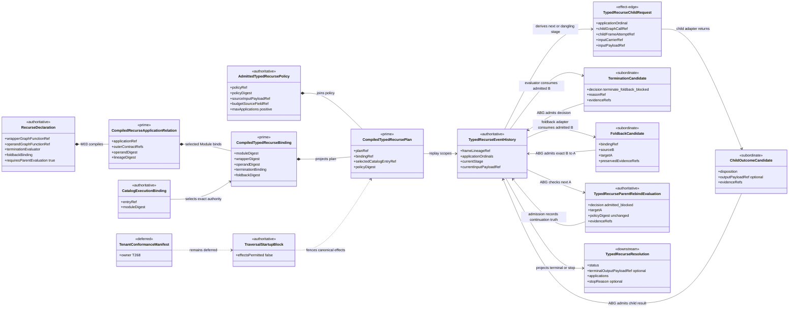
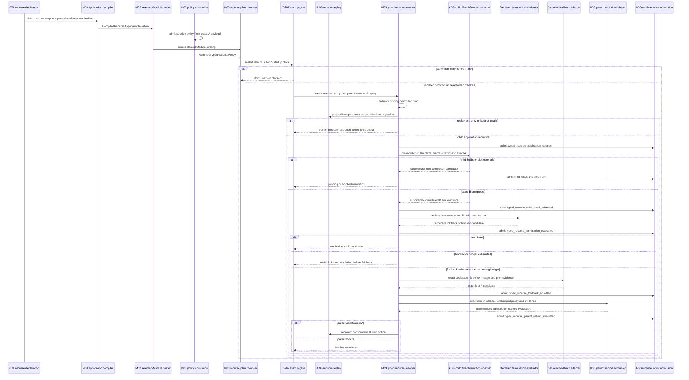
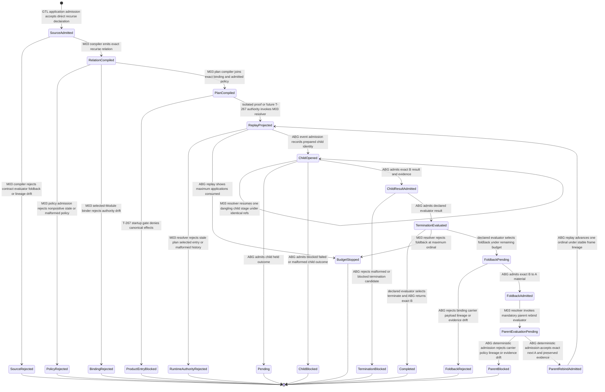

# M03 Typed Recurse Policy And Runtime Behavior Design

**Status**: Accepted under delegated F_H authority after bounded self-review
**Date**: 2026-07-13
**Ticket**: `T-262`
**Method authority**: `specification_methodology/specification/standards/DESIGN_MODULE_METHOD.md` section 5E
**Tenant authority**: [TYPESCRIPT_REALIZATION_GUARDRAILS.md](./TYPESCRIPT_REALIZATION_GUARDRAILS.md)

## Boundary

This design realizes one generic recursive GraphFunction relation:

```text
recurse(GraphFunction<A,B>, termination, foldback)
  + one admitted positive invocation policy over A
  -> one selected-Module recurse binding
  -> one immutable runtime plan
  -> repeated child GraphFunction application under one stable frame lineage
  -> termination evaluation over admitted B
  -> terminal B, truthful hold/block, or exact B -> A foldback
  -> mandatory ABG parent rebind evaluation before another child application
```

The numeric application budget is domain policy carried by the admitted input,
not a hidden interpreter default and not a new field invented in the GTL
`recurse(...)` declaration. The admitted runtime policy binds its positive
`maxApplications`, policy identity, source input payload, source field ref,
and evidence to the exact recursive input carrier. The compiler and runtime
seal that projection into the plan and revalidate it before any child call.

The GTL declaration remains the authority for:

- the recursively applied GraphFunction;
- the termination evaluator;
- `foldback.mode = rebind`;
- the exact foldback binding;
- mandatory parent evaluation; and
- the preserved outer `A -> B` interface.

ABG remains the authority for policy admission, selected catalog/Module
identity, application and frame identity, replay, child invocation, evaluator
admission, foldback admission, parent rebind evaluation, continuation, and
truthful stop.

The unchanged T-252 body is the canonical consumer. Its structural path must
prove that only the post-submitter recurse disposition reaches foldback. The
runtime must preserve prior-round evidence in admitted foldback material,
stop on terminal, held F_H, blocked, malformed, or exhausted-budget truth, and
must not treat `C.retry` as a semantic round.

### Requirements

- `REQ-L-GTL3-RECURSE-001..008`
- `REQ-L-GTL3-LAWS-009`
- `REQ-L-GTL3-CONTRACT-LAW-API-002/-006`
- `REQ-R-ABG3-FRAME-001..006`
- `REQ-R-ABG3-LINEAGE-001..005`
- `REQ-R-ABG3-PROVENANCE-001..006`
- `REQ-R-ABG3-CORRECTION-002`
- `REQ-R-ABG3-REQUIREMENT-PROOF-CARRY-THROUGH-029/-031`
- `T-262` gap family `typed_recurse_policy_and_runtime`

### Explicit Exclusions

- a Consensus controller, round service, prompt loop, or product-specific
  interpreter;
- any use of `C.retry` to represent a semantic round;
- an interpreter-owned default budget, termination predicate, foldback map, or
  parent convergence judgment;
- caller-authored application ordinal, remaining budget, child call identity,
  frame identity, lineage, continuation status, or closure truth;
- recursion over an unselected catalog search result or a helper publication;
- foldback inferred from names, tags, prose, nulls, or output shape;
- child success certifying parent convergence without termination evaluation;
- foldback success certifying another application without parent rebind
  evaluation;
- arbitrary nested recurse chains, mutual recursion, non-tail recursion,
  parallel recursion, scheduling, leases, timers, or graph rewrite;
- publication of module-local child frames as peer public GraphFunctions;
- top-level `TraversalUnit`, result-interface conservation, or effect release
  owned by T-267; and
- tenant conformance publication owned by T-268.

## Design Decisions

### D1. Recurse compilation produces one closed structural relation

`compileGraphFunctionApplication` gains a
`CompiledRecurseApplicationRelation` for one direct recurse declaration. It
contains the exact outer and operand GraphFunction refs/digests, preserved
input/output contract refs, declaration/application identity, termination
evaluator identity and consumed fields, foldback binding and digest, and
application lineage.

The relation is accepted only when:

- the recurse wrapper and operand each resolve exactly once in the supplied
  Module-local GraphFunction set;
- wrapper and operand preserve the identical input/output contracts;
- the declaration is the one canonically admitted application declaration;
- the termination evaluator has an exact non-empty binding and at least one
  consumed field ref;
- foldback is `rebind`, has one non-empty binding, and requires parent
  evaluation; and
- the application lineage is direct for this slice.

Fan-in compilation remains unchanged. Gate and nested/mixed application
runtime remain explicit gaps.

### D2. Invocation policy is admitted data, not syntax or engine law

`admitTypedRecursePolicy` consumes a raw projection with:

```text
policyRef
policyVersion
sourceInputCarrierRef
sourceInputPayloadRef
budgetSourceFieldRef
maxApplications positive integer
evidenceRefs non-empty
```

Admission closes the vocabulary, detaches the row, validates positivity, and
derives `policyDigest`. The runtime plan binds the policy digest and exact
input carrier. A changed payload, field ref, value, policy version, order, or
evidence set creates a different policy projection and cannot resume an older
recursive lineage.

This is a generic carrier admission boundary. Product schemas remain
responsible for proving that the field is actually present in their typed
input. For T-252, the compiler probe joins the policy-budget field used by the
round routes to the admitted positive policy projection. No numeric value is
hard-coded in the recurse compiler.

### D3. One selected-Module binding preserves private helper authority

`compileTypedRecurseBinding` consumes the structural recurse relation and one
exact selected Module. It binds:

- the public selected catalog entry ref supplied later to the plan;
- Module name and digest;
- wrapper and operand GraphFunction refs/digests;
- outer `A -> B` contract refs;
- application and lineage refs/digests;
- termination evaluator and consumed field refs; and
- foldback mode, binding, parent-evaluation requirement, and additional data
  digest.

Runtime resolves only the selected catalog entry and rederives the binding
inside that digest-bound Module. A module-local operand is lawful without its
own catalog entry. Searching all catalog entries or publishing the helper is
not lawful.

### D4. The runtime plan joins structure and one admitted policy

`compileTypedRecursePlan` joins one binding, selected catalog entry, and one
admitted policy. The plan digest covers all structural and policy truth. The
plan is a projection, not a second policy authority; admission rederives both
binding and policy identity before effects. Runtime also requires the exact
selected registry entry to name the admitted policy ref; another entry cannot
authorize policy for this invocation.

One plan represents one recursive invocation lineage. It does not contain the
current ordinal, remaining budget, next input, child output, or terminal
decision. Those derive from replay.

### D5. Replay owns the recursive cursor and frame lineage

The runtime emits and admits a small generic event family:

```text
typed_recurse_application_opened
typed_recurse_child_result_admitted
typed_recurse_termination_evaluated
typed_recurse_foldback_admitted
typed_recurse_foldback_rejected
typed_recurse_parent_rebind_evaluated
```

Every row carries the plan/binding identity, stable frame-lineage identity,
application ordinal, fresh child GraphCall and frame-attempt identities, exact
input/output refs where applicable, causal refs, and evidence. The closed
event schemas are ABG runtime truth. Callback results are subordinate until
admitted into these rows.

Replay at one exact plan and parent locus derives:

- the stable frame-lineage ref;
- completed application ordinals;
- a dangling child invocation, termination, foldback, or parent-evaluation
  stage;
- the current admitted A payload;
- the last admitted B payload and termination decision;
- the next lawful ordinal; and
- whether terminal, held, blocked, or budget truth has already closed the
  lineage.

The resolver is a tail-loop over this replay projection. It does not retain a
second controller stack. A dangling stage resumes under its existing refs and
cannot mint a new ordinal.

### D6. ABG prepares child identity before the effect edge

Before invoking the operand GraphFunction, ABG derives a
`TypedRecurseChildRequest` with:

- plan and binding refs;
- selected Module and operand GraphFunction identity;
- stable parent locus and frame-lineage ref;
- replay-derived application ordinal;
- fresh child GraphCall and frame-attempt refs;
- exact A input carrier and payload refs; and
- the positive maximum application count.

The child adapter owns only the GraphFunction interior and must be idempotent
for the prepared child GraphCall ref. It returns one closed candidate:

```text
completed(B payload, response contract, evidence)
held(reason, evidence)
blocked(reason, evidence)
runtime_failed(reason, evidence)
```

It cannot select foldback, change policy, advance the ordinal, emit runtime
events, or certify the parent. Malformed or thrown output becomes a truthful
blocked runtime resolution; recursion does not retry it.

### D7. Termination is evaluated over admitted B

Only an admitted exact-contract `completed` child result reaches the declared
termination evaluator. The evaluator request contains the declaration's
exact binding and consumed field refs, current ordinal, policy projection,
admitted B payload, and prior foldback evidence. Its closed candidate is:

```text
terminate(reason, evidence)
foldback(reason, evidence)
blocked(reason, evidence)
```

ABG validates the echo and admits one termination event. `terminate` returns
the exact B payload. `blocked` stops. `foldback` may continue only when the
current ordinal is below the admitted maximum. At the maximum, ABG records a
budget stop before any foldback or next child effect.

For T-252, held F_H and blocked paths never produce a completed round
disposition and therefore never reach this evaluator. `closed_done` terminates;
only the structurally admitted post-submitter `recurse_next_round` disposition
may select foldback.

### D8. Foldback is an exact B to A admission boundary

The foldback adapter receives the admitted B payload, exact declaration,
current policy, frame lineage, and prior-round evidence. It returns:

```text
bindingRef exact declaration binding
sourceOutputCarrierRef exact B
sourceOutputPayloadRef exact admitted child result
targetInputCarrierRef exact A
targetInputPayloadRef next A
policyRef and policyDigest unchanged
budgetSourceFieldRef unchanged
preservedEvidenceRefs non-empty superset of prior round evidence
foldbackEvidenceRefs non-empty
```

ABG rejects a changed binding, carrier pair, source payload, policy identity,
budget-source ref, missing prior evidence, malformed target, or stale lineage.
Rejection is itself admitted as terminal recurse truth, so replay cannot invoke
the rejected foldback adapter again.
An admitted foldback event is necessary but not sufficient to open the next
child application.

### D9. Parent rebind evaluation is mandatory

The declared `requiresParentEvaluation: true` is realized by a separate
`TypedRecurseParentRebindEvaluation`. This is a deterministic ABG admission
projection, not another product callback. It checks the exact foldback event,
next A carrier and payload, unchanged policy ref/digest and budget-source ref,
stable lineage, preserved evidence, and the declaration's mandatory
parent-evaluation flag. Its closed result is `admitted` or `blocked`.

Only an admitted parent-rebind event can advance replay to the next ordinal.
The next child request consumes exactly the event's A payload and preserved
evidence. The next operand invocation performs the actual semantic
re-evaluation of the parent contract. Child closure and foldback alone never
certify parent convergence. A held F_H state remains child runtime truth and
does not arise from structural rebind admission.

### D10. T-267 and T-268 remain authoritative fences

T-262 removes only `typed_recurse_policy_and_runtime` from the T-252 census.
The canonical execution handoff remains `published_startup_blocked` until
T-267 admits result-interface and traversal conservation. T-268 still owns the
canonical tenant-conformance manifest. T-262 proof may execute isolated
generic and canonical-structure fixtures, but it cannot claim public Consensus
effects, result publication, or release readiness.

## Irreducible Architectural Carrier Set

| Carrier | Visibility | Authority | Role |
|---|---|---|---|
| admitted recurse GraphFunction declaration | GTL public syntax | authoritative | operand, termination, foldback, outer contract |
| `CompiledRecurseApplicationRelation` | M03 compiler | prime | exact direct structural relation and lineage |
| `AdmittedTypedRecursePolicy` | M03 admission | authoritative | positive domain policy bound to exact A payload |
| `CompiledTypedRecurseBinding` | M03 selected-Module binder | prime | exact Module, wrapper, operand, contracts, evaluator, and foldback join |
| `CompiledTypedRecursePlan` | M03 runtime projection | prime | immutable structure-policy join for one invocation lineage |
| selected catalog execution binding | runtime catalog | authoritative | one public entry and exact private Module |
| typed recurse event family | ABG event authority | authoritative | replay cursor, child result, termination, foldback, and parent rebind truth |
| `TypedRecurseChildRequest` | internal effect edge | effect-edge | one prepared child GraphFunction invocation |
| child outcome candidate | adapter output | subordinate | completion, hold, block, or runtime failure candidate |
| termination candidate | evaluator output | subordinate | terminate, foldback, or block candidate |
| foldback candidate | foldback adapter output | subordinate | exact B to A rebind material and preserved evidence |
| `TypedRecurseParentRebindEvaluation` | ABG admission | authoritative | deterministically admits or blocks the next A |
| `TypedRecurseResolution` | M03 runtime result | downstream | terminal B or truthful non-success with lineage projection |
| `TraversalStartupBlock` | T-255/T-267 boundary | authoritative block | prevents canonical effects before conservation closes |
| tenant conformance manifest | T-268 boundary | deferred | public capability coverage |

## Domain Model



## Execution Sequence



## Lifecycle State



Every transition names its admission, compiler, binder, gate, resolver,
evaluator, adapter, event, or replay owner. No child, evaluator, or foldback
callback moves the lifecycle directly.

## Cross-View Checks

| Check | Evidence | Verdict |
|---|---|---|
| Every sequence participant exists in the domain model or is an owned boundary | declaration, compiler relation, selected binding, policy, plan, replay events, adapters, resolution, and fences are modeled | `pass` |
| Every lifecycle carrier exists in the domain model | source through terminal/blocked result has one carrier or event projection | `pass` |
| Every transition names its owner | all edges name GTL admission, M03 compiler/binder/resolver, ABG admission/replay, declared evaluator, adapter, T-267, or T-268 | `pass` |
| Budget is explicit and positive | admitted policy binds source A payload, field ref, positive value, digest, and evidence | `pass` |
| Child success cannot close the parent | termination evaluation is mandatory after admitted B | `pass` |
| Foldback cannot recurse by itself | deterministic ABG parent rebind evaluation is mandatory before next ordinal | `pass` |
| Replay owns recursive position | event projection supplies ordinal, current stage, A payload, and terminal state | `pass` |
| Selected Module retains private helper authority | runtime rederives only inside selected catalog entry's Module | `pass` |
| Prior evidence survives foldback | foldback admission requires the preserved evidence superset | `pass` |
| Retry and recurse remain different sorts | no runtime failure has a recurse transition and no C retry policy appears | `pass` |
| Product effects remain fenced | T-267 block precedes every canonical child effect | `pass` |

## Axiom Evaluation

| Axiom | Authority | Domain evidence | Sequence evidence | State evidence | Native enforcement | Admission/compiler enforcement | Verdict | Gap owner |
|---|---|---|---|---|---|---|---|---|
| Recursive application preserves outer interface | `RECURSE-002`; contract-law API | relation, binding, plan, requests, foldback, and terminal output retain A/B refs | compiler and binder precede runtime | carrier drift reaches rejection | GTL recurse constructor preserves interface | relation compiler and selected-Module rederivation | `pass` | none |
| Termination and foldback are declared | `RECURSE-003/-004` | declaration is authoritative and digest-bound | declared evaluator/foldback participants act | no hidden termination transition | closed application declaration | canonical admission and exact binding checks | `pass` | none |
| Foldback rebinds B to A exactly | `RECURSE-004` | foldback candidate carries exact source/target refs and payloads | ABG admission precedes parent evaluation | malformed foldback stops | closed carrier union | cross-field and lineage validation | `pass` | none |
| Parent re-evaluation is mandatory | `RECURSE-005` | ABG rebind evaluation is separate from foldback | deterministic parent admission always follows foldback; next operand call performs semantic re-evaluation | no foldback-to-child edge | declaration requires true | exact rebind admission and replay transition validation | `pass` | none |
| Lineage is explainable and replayable | `RECURSE-006`; FRAME; LINEAGE; PROVENANCE | stable lineage plus fresh child call/frame refs | resolver prepares refs and events admit them | replay alone advances ordinal | closed identity carriers | exact event-history validation | `pass` | none |
| Recursion is bounded by explicit truth | `RECURSE-007` | admitted positive policy bound to source A | budget check precedes child and foldback | budget stop has no effect edge | positive integer type guard | policy admission plus replay count | `pass` | none |
| Inner steps remain frame-local | `RECURSE-008`; FRAME-001 | operand remains Module-local | selected Module invokes private child | no public-helper state | no catalog carrier in child request | selected-entry narrowing | `pass` | none |
| Runtime control is not hidden memory | `FRAME-004/-005/-006` | typed event family is authoritative; resolver state is projection | replay queried at each stage | every continuation returns through replay | immutable event rows | closed event admission and transition validation | `pass` | none |
| Correction cannot reuse stale recursive truth | `CORRECTION-002` | plan/policy/input digests scope lineage | stale authority rejects before resume | runtime authority rejection is terminal | immutable refs | exact plan/event identity checks | `pass` | none |
| C.retry does not stand for recursion | T-262 non-closure; C-algebra | no retry carrier or allowlist in model | no retry participant or edge | runtime failure blocks | distinct GTL constructors | distinct compiler/runtime families | `pass` | none |
| Unresolved semantics stop before effects | T-262; T-267 | startup block and malformed states explicit | gate and admissions precede adapters | every unresolved path terminates | closed unions | compiler, plan, replay, and gate checks | `pass` | T-267 remains for product effects |
| Tenant publication is not fabricated | T-268 | manifest is deferred and separate | no manifest publication participant | no capability-success state | separate manifest type | T-268 remains census owner | `pass` | T-268 |
| Closure is proportional to current demand | T-262 boundary | direct tail recurse only | no scheduler, mutual recursion, or product loop | unsupported shapes stop | no GTL algebra redesign | focused generic and T-252 proof | `pass` | future advanced-recursion owner if demanded |

## Proof Contract

T-262 closure requires:

1. one direct recurse declaration compiles to an exact recurse relation while
   fan-in remains green and nested/mixed/gate runtime remains honest;
2. wrapper/operand contract drift, duplicate or missing Module identity,
   malformed evaluator, foldback drift, and lineage drift fail before effects;
3. zero, negative, fractional, missing-source, stale-payload, stale-evidence,
   or policy-digest drift fails admission or plan rederivation;
4. runtime resolves only the selected catalog entry's digest-bound Module and
   accepts a module-local operand without a helper catalog row;
5. replay derives one stable frame lineage, fresh child GraphCall/frame attempt
   identity per ordinal, and the exact dangling stage;
6. a completed child cannot return terminal B before declared termination
   evaluation;
7. a foldback decision at maximum ordinal stops before foldback and another
   child effect;
8. exact foldback preserves prior evidence and B-to-A carrier/payload identity;
9. no next child invocation occurs before admitted parent rebind evaluation;
10. held child truth returns pending; blocked parent rebind, malformed, thrown,
    or runtime-failed truth returns blocked and never retries;
11. replay of terminal history performs no child, evaluator, foldback, or
    parent effect; dangling histories resume the exact stage and refs;
12. one non-Consensus recursive fixture folds B to A once, re-evaluates the
    parent, and terminates on the second child application;
13. the unchanged T-252 body digest remains exact; its recurse path is proven
    to originate only from the post-submitter typed disposition; a positive
    round-policy projection joins; prior evidence survives; and the canonical
    recursion plan can be exercised without public effects;
14. only `typed_recurse_policy_and_runtime` leaves the T-252 census, while
    T-267 traversal conservation and T-268 manifest coverage remain exact;
15. canonical handoffs remain startup-blocked; and
16. focused T-262, T-252, T-265, GTL, T-223, semantic, TypeScript,
    publication, Mermaid, lint, and diff gates pass.

## Design Verdict

`accepted`. The three views define one bounded tail-recursive interpreter over
declared GTL syntax and replay-owned ABG truth. Bounded self-review repaired
parent-evaluation authority and policy-preservation ambiguity before delegated
F_H acceptance. Implementation is authorized only for this direct recurse
boundary; T-267 and T-268 remain separate gates.
