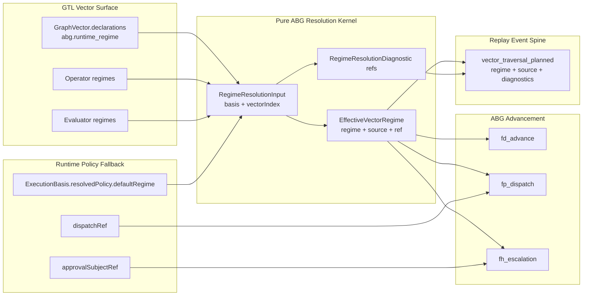

# M03 Vector Runtime Regime Resolution Structural Carrier Diagram

**Status**: Active
**Date**: 2026-05-16
**Ticket**: T-135

## Authority Notes

- `GraphVector.declarations["abg.runtime_regime"]` is the direct
  vector-local declaration surface.
- Operator/evaluator regimes are vector-local participant truth.
- Basis default is fallback only; it may not override a homogeneous vector
  regime.
- Dispatch and approval refs are authority checks after regime selection, not
  regime selectors.
- `vector_traversal_planned` records the selected regime so replay sees the
  same decision that transition construction used.
