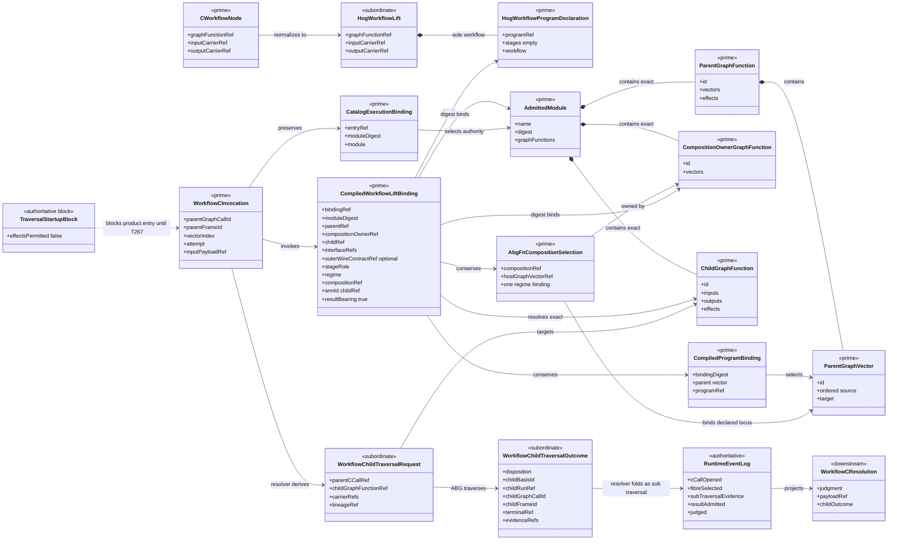
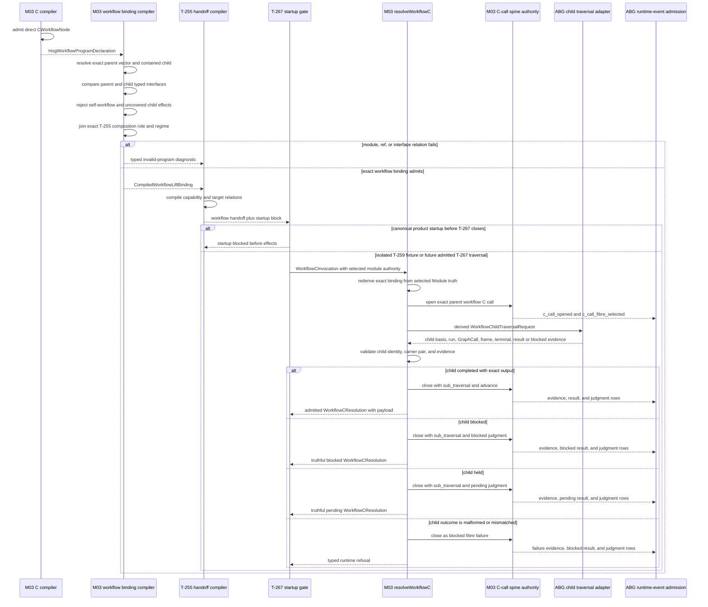
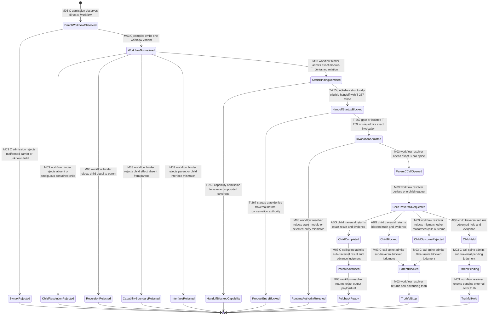

# M03 `workflow.C` Runtime Behavior Design

**Status**: Accepted under delegated F_H authority; amended by implementation self-review
**Date**: 2026-07-13
**Ticket**: `T-259`
**Method authority**: `specification_methodology/specification/standards/DESIGN_MODULE_METHOD.md` section 5E
**Tenant authority**: [TYPESCRIPT_REALIZATION_GUARDRAILS.md](./TYPESCRIPT_REALIZATION_GUARDRAILS.md)

## Boundary

This design realizes one direct `workflow.C(child)` program as one transparent
parent C call containing one named child GraphFunction traversal. It preserves:

- the authored child GraphFunction ref;
- the parent and child typed input/output interface refs;
- the exact selected module authority containing both parent and child;
- parent GraphCall, frame, vector, C-call, and attempt identity;
- child GraphCall, frame, result, blocked truth, and evidence identity; and
- foldback of the admitted child outcome into the parent C-call spine.

The child is module-contained. It does not become a second public catalog entry.
The already selected catalog entry remains the runtime authority for the exact
module; the child ref resolves once inside that digest-bound module.

This ticket realizes constructor-level workflow semantics and makes the five
unchanged T-252 workflow handoffs statically compilable. It does not remove the
T-267 startup fence, authorize effects, or claim that Consensus has traversed.

### Requirements

- `REQ-L-GTL3-C-ALGEBRA-001`, `-006`, `-013`, `-014`, and `-016`
- `REQ-R-ABG3-CCALL-001`, `-003`, `-004`, `-006`, `-013`, and `-014`
- `REQ-M-GTL3-PROGRAM-TRAVERSAL-001..-011`
- `T-259` gap family `workflow_c_runtime`

### Explicit exclusions

- a Consensus dispatcher, round loop, reviewer vocabulary, or product branch;
- promotion of a module-contained helper to an independent catalog entry;
- name, tag, or effect inference in place of an exact GraphFunction ref;
- flattening child vectors or child HoG stages into the parent program;
- plugin-, handler-, service-, or callback-authored C-call truth;
- arbitrary mixed `C.compose` expressions containing a workflow term; this
  ticket closes one direct named lift, while later sequencing work may admit a
  richer normalized expression without changing this boundary;
- batch, retry, and recurse semantics owned by T-260, T-261, and T-262; and
- top-level TraversalUnit/result conservation owned by T-267.

## Design Decisions

### D1. The normalized program carrier is a closed union

`HogProgramDeclaration` becomes a closed normalized union with two variants:

```text
flat program
  = non-empty stages + exactly one result-bearing stage

direct workflow program
  = empty stages + exactly one HogWorkflowLift
```

The workflow variant does not invent a synthetic HoG stage. A synthetic
`stageRole`, fibre, or arm would make the child look like a handler interior and
would erase the named GraphFunction boundary. The workflow field is absent from
the flat variant, so existing flat serialized values and digests do not change.

`HogWorkflowLift` carries only normalized authored truth:

```text
kind
inputCarrierRef
outputCarrierRef
graphFunctionRef
```

It does not carry a GraphFunction object, module, catalog entry, result, or
runtime state. Those relations are admitted at their owning boundary.

### D2. Only a direct workflow term closes in T-259

The current T-252 demand consists of five selected GraphVectors backed by three
direct workflow programs. T-259 admits that exact generic form. A workflow term
nested under `C.compose`, `C.edge`, `C.batch`, or `C.retry` remains a typed
`semantic_not_realized` result until an owner supplies an ordering carrier that
preserves every named boundary.

This is a proportional closure of one named lift, not a claim that every future
mixed C expression is executable. The normalized union leaves room for later
variants without changing the direct-workflow contract.

### D3. Static binding resolves inside one exact module

`CompiledWorkflowLiftBinding` is produced only after all of these relations
hold:

1. the selected execution-subject parent GraphFunction occurs exactly once in
   the supplied Module;
2. the selected parent GraphVector occurs exactly once in that GraphFunction;
3. the T-255 composition-declaration owner occurs exactly once in the same
   Module and retains a byte-equivalent parent GraphVector;
4. the workflow ref resolves exactly once among that Module's GraphFunctions;
5. the child differs from the parent, so the direct lift cannot bypass the
   separately owned recursion runtime;
6. every child effect is declared by the public parent and remains inside the
   T-255 capability boundary;
7. the parent vector's ordered source interface equals the lift input interface;
8. the parent vector's target interface equals the lift output interface;
9. constructor-authored input retains the M01 Node-interface witness, while raw
   input proves only exact child resolution and internal Node-interface
   continuity; and
10. the Module, execution subject, composition owner, child, vector, program
   selection, and carrier identities
   are digest-bound into one binding ref.

Resolution may match the exact authored child id, or an unambiguous exact name
for admitted legacy raw syntax. Constructor-authored values use the child id.
Tags, display fragments, and nearby siblings never participate. Effect refs
participate only in the exact subset check that prevents a child from widening
the public parent's already declared capability demand.

Internal Node-interface continuity is not a claim that those refs equal a
published outer wire contract. If no admitted outer-contract identity exists,
the compiled binding records that wire certification as absent. T-259 neither
infers nor fabricates it. Any later boundary requiring public wire equality must
consume the separately admitted outer-contract carrier required by
`C-ALGEBRA-006`.

The direct workflow term does not author a free-standing stage role or fibre.
The handoff compiler therefore joins the already admitted T-255 composition
selection and requires exactly one regime binding for the parent GraphVector.
For an applied GraphFunction, the execution subject and the inherited
composition-declaration owner remain distinct, exact authorities; direct
GraphFunctions bind both roles to the same object.
`CompiledWorkflowLiftBinding` retains that declared `stageRole`, `regime`, and
`compositionRef`. The authored child GraphFunction ref is the parent call's
`armId`, and the selected C program supplies `programRef`. Because the workflow
term is the sole direct term, the binding records it as result-bearing. No role,
fibre, arm, or result-bearing status is inferred from a display name or tag.

### D4. Runtime preserves the selected catalog authority

The runtime invocation receives the selected `CatalogExecutionBinding` for the
outer callable entry. It verifies that the binding's Module digest equals the
static workflow binding and that the exact child remains contained in that
Module. It does not search all catalog entries and does not require a child
catalog entry.

Before opening the parent C call, the resolver recompiles the selected program,
composition selection, and workflow binding from the selected Module and
requires byte equality with the supplied binding. A caller cannot preserve a
binding digest while substituting a role, regime, composition owner, or child.

This preserves the authority relation:

```text
selected public catalog entry
  -> exact admitted Module
  -> exact contained child GraphFunction
```

It forbids both failure modes seen at earlier joins: authorization by an
unrelated sibling entry and ambiguity caused by multiple entries carrying the
same helper.

### D5. One resolver owns the transparent C spine

`resolveWorkflowC` is the one M03 constructor-runtime atom. It:

1. validates the compiled workflow binding and selected module authority;
2. opens one parent C-call spine at the exact parent locus;
3. derives one child traversal request bound to that C-call;
4. invokes the ABG-owned child traversal adapter exactly once;
5. detaches and closed-admits the returned child identity, carrier pair,
   terminal, and evidence;
6. closes the parent C-call with `sub_traversal` evidence; and
7. returns the admitted foldback result and emitted C-call rows.

The injected child adapter is an internal ABG traversal boundary, not a plugin
or policy seam. It may execute the child GraphFunction, but it cannot mint the
parent spine. The resolver owns parent spine construction through the existing
`buildCCallSpineOpen` and `buildCCallSpineClose` authorities.

### D6. Foldback preserves completion and blocked truth

The child outcome is closed:

| Child disposition | Required result | Parent C judgment | Parent meaning |
|---|---|---|---|
| `completed` | output payload ref and exact output carrier | `advance` | child result is available to bind |
| `blocked` | reason ref; no output payload | `blocked` | child stopped truthfully |
| `held` | reason ref; no output payload | `pending` | child awaits governed external action |

Every disposition requires child basis, run, GraphCall, frame, terminal, and
non-empty admitted evidence refs. The parent `sub_traversal` row includes the
child basis and run refs required by `CCALL-013`. A callback return without
those identities, with inherited truth, or with an unknown sibling field is not
sub-traversal evidence and fails before the parent C-call closes as success.

### D7. T-267 remains the top-level effect gate

T-259 makes workflow handoffs structurally compilable and supplies the generic
runtime atom. The canonical T-255 handoff still carries
`startup_blocked_awaiting_t267`, and no T-252 handoff may enter traversal or
cause effects. The non-Consensus fixture invokes the constructor atom directly
to prove its relation; it is not evidence of product startup admission.

## Irreducible Architectural Carrier Set

| Carrier | Visibility | Authority | Role |
|---|---|---|---|
| admitted direct `CWorkflowNode` | GTL authored input | prime | named child and typed carrier pair |
| `HogWorkflowLift` | normalized M03 program data | subordinate projection | closed direct-workflow representation |
| `HogWorkflowProgramDeclaration` | normalized M03 program | prime compiler result | one direct named workflow program |
| `CompiledGraphVectorCProgramBinding` | M03 compiler | prime selection | exact parent vector/program identity |
| `CompiledWorkflowLiftBinding` | M03 compiler | prime static join | exact module, parent, vector, child, interfaces, and declared composition locus |
| `CatalogExecutionBinding` | admitted runtime catalog | prime runtime authority | selected public entry and exact Module |
| `WorkflowCInvocation` | M03 runtime input | prime invocation | parent locus, selected authority, input payload, attempt |
| `WorkflowChildTraversalRequest` | internal M03 | subordinate | exact child request derived by resolver |
| `WorkflowChildTraversalOutcome` | ABG child traversal output | subordinate evidence | child terminal/result/blocked truth |
| C-call runtime events | ABG event authority | authoritative | parent open, selection, evidence, result, judgment |
| `WorkflowCResolution` | M03 runtime output | downstream | foldback result and emitted rows |
| `TraversalStartupBlock` | T-255/T-267 boundary | authoritative block | prevents product traversal before conservation closes |

## Domain Model



## Execution Sequence



The compiler and binder are pure. The child adapter is the only participant
that may traverse a child GraphFunction. The resolver owns the parent C-call
spine and cannot authorize product entry while the startup gate remains closed.

## Lifecycle State Model



Every transition names its admission, compiler, resolver, spine, traversal, or
gate owner. There is no child-callback-to-parent-success transition that skips
identity validation or C-call event admission.

## Cross-View Checks

| Check | Evidence | Verdict |
|---|---|---|
| Every sequence participant exists in the domain model or is an owned boundary | compiler, binder, handoff, gate, resolver, spine, child adapter, and events all map to modeled carriers or authorities | `pass` |
| Every lifecycle carrier exists in the domain model | authored, normalized, statically bound, runtime selected, child request/outcome, event, resolution, and startup-block carriers are represented | `pass` |
| Every transition names its owner | state labels name M03 admission/compiler/resolver/spine, ABG traversal, T-255, or T-267 | `pass` |
| Selected catalog authority remains exact | runtime follows selected entry to one digest-bound Module and then exact contained child | `pass` |
| Supplied binding cannot replace declaration truth | resolver rederives the program, composition, and workflow binding from the selected Module before events | `pass` |
| Child capability demand remains public | binder rejects every child effect absent from the parent declaration | `pass` |
| Child meaning is not flattened | normalized carrier and runtime request retain child GraphFunction identity and separate GraphCall/frame | `pass` |
| Parent C truth is engine-owned | only the existing M03 spine authority emits parent C-call rows | `pass` |
| Parent role, fibre, arm, and program are declared | T-255 composition supplies role/fibre/composition; workflow ref supplies arm; selected program supplies programRef | `pass` |
| Blocked or held child cannot advance | closed disposition table maps blocked to `blocked` and held to `pending` | `pass` |
| Product effects remain fenced | T-267 block remains in domain, sequence, and state views | `pass` |
| Arbitrary mixed workflow composition is claimed | explicitly excluded; such expressions retain typed unrealized diagnostics | `not_applicable` |

## Axiom Evaluation

| Axiom | Authority | Domain evidence | Sequence evidence | State evidence | Native enforcement | Admission/compiler enforcement | Verdict | Gap owner |
|---|---|---|---|---|---|---|---|---|
| A workflow lift names one admitted child GraphFunction | `C-ALGEBRA-006/-014` | one `HogWorkflowLift` and one exact child binding | binder resolves once before runtime | absent or ambiguous child rejects | M01 constructor requires Node-backed GraphFunction ref | M03 module-contained exact resolution | `pass` | none |
| Workflow preserves exact A/B carriers | `C-ALGEBRA-006` | input/output refs occur on normalized and compiled carriers | binder compares parent and child before handoff | mismatch enters `InterfaceRejected` | Node-backed M01 witness | serialized refs rechecked against admitted GraphFunctions | `pass` | none |
| Child traversal is one transparent parent C call | `C-ALGEBRA-006`; `CCALL-013` | parent C-call and child request/outcome remain distinct | one open, one child invocation, one close | one parent spine encloses child lifecycle | closed direct-workflow variant | resolver invokes adapter exactly once and folds once | `pass` | none |
| Parent C-call locus and fibre are declaration-owned | `C-ALGEBRA-009`; `CCALL-002/-003/-014` | compiled binding retains composition role/regime/ref, child arm, and selected program | resolver copies exact binding fields into spine open/selection | missing or multiple composition regimes reject before invocation | no runtime string inference | exact T-255 composition join | `pass` | none |
| Selected public authority is not replaced by helper publication | catalog and product boundary law | one selected entry owns one Module containing child | resolver validates selected Module then child | stale/foreign authority rejects | no child catalog-entry carrier | exact module digest and containment checks | `pass` | none |
| Child capability demand cannot widen its public parent | T-255 manifest boundary; `C-ALGEBRA-016` | child effects are a subset of parent effects | binder checks before handoff | uncovered effect terminates in `CapabilityBoundaryRejected` | exact effect refs only | static subset check before capability admission | `pass` | none |
| ABG owns traversal and runtime truth | program-traversal mapping | child adapter is internal ABG; events are authoritative | adapter traverses; resolver/spine admit parent rows | only event-admitted result reaches foldback | no plugin close capability | C spine and outcome admission | `pass` | none |
| Child blocked and held truth remain non-advancing | `CCALL-001/-006/-008` | closed child disposition relation | blocked maps to blocked; held maps to pending | neither state has an advance edge | discriminated outcome union | cross-field validation and fixed judgment mapping | `pass` | none |
| Sub-traversal evidence names the child basis and run | `CCALL-013` | child outcome carries basis/run/GraphCall/frame/terminal refs | resolver includes those refs in the parent evidence row | missing child identity enters rejection | required typed fields | non-empty identity and evidence checks | `pass` | none |
| Internal carrier continuity does not fabricate public wire equality | `C-ALGEBRA-006` | optional outer-contract identity is distinct from Node-interface refs | binder records absence rather than inferring certification | absent wire authority remains absent | constructor witness is retained only on native path | raw compiler proves resolution and internal continuity only | `pass` | future admitted outer-contract join if required |
| Unresolved semantics stop before effects | `C-ALGEBRA-016` | startup block and typed diagnostics are explicit | gate precedes resolver on product path | product entry terminates blocked | flat HoG executability explicitly rejects workflow variants | T-255/T-267 fence retained | `pass` | T-267 for top-level traversal |
| Direct workflow cannot smuggle recursion | T-259 boundary; `C-ALGEBRA-016` | child identity must differ from parent | binder rejects before runtime | self-reference terminates in `RecursionRejected` | exact opaque ids | local inequality check | `pass` | T-262 for admitted recursion |
| Workflow is not flattened into handler stages | `C-ALGEBRA-006/-010` | workflow normalized variant has no synthetic stage | resolver calls child traversal, not fibre handler | no handler state exists | distinct union variant | flat-stage admission and workflow admission are mutually exclusive | `pass` | none |
| Closure is proportional to current demand | T-259 boundary and risk ruling | direct workflow is modeled; mixed expressions excluded | only one direct lift executes | unsupported mixed shape stops | no base-algebra redesign | current five handoffs plus generic fixture prove claimed surface | `pass` | future mixed-expression owner if demanded |

## Proof Contract

T-259 closure requires:

1. direct workflow syntax lowers to one closed normalized workflow variant;
2. flat program serialized shapes and digests remain unchanged;
3. malformed workflow normalized shapes, non-empty stages plus workflow, absent
   child, ambiguous child, self-workflow, uncovered child effect, foreign
   module, stale module digest, declaration-binding drift, and interface
   mismatch fail closed;
4. the exact selected module authority is preserved at runtime without a child
   catalog entry or all-catalog search;
5. one non-Consensus fixture proves completed, blocked, held, malformed, and
   throwing child outcomes through the same generic resolver;
6. completed foldback emits one ordered C-call spine with `sub_traversal`
   evidence and exact payload carrier identity;
7. blocked, held, malformed, and throwing outcomes never emit an advance
   judgment, and held emits `pending` rather than `blocked`;
8. the unchanged T-252 body retains its digest and its five workflow handoffs
   move from successor-constructor block to their next lawful gate;
9. the one retry handoff and all T-260/T-262 gaps remain unchanged;
10. T-267 startup blocking remains exact and no canonical T-252 effect executes;
11. focused T-259, T-252, GTL, T-223, semantic, TypeScript, publication,
    Mermaid, lint, and diff gates pass.

## Design Verdict

`accepted`. The design closes one direct, generic named workflow lift without
rewriting the base algebra or turning helper GraphFunctions into public catalog
entries. It keeps child traversal meaning, interfaces, module authority,
GraphCall/frame lineage, result, blocked truth, and parent C-call evidence
separate and joinable. T-267 remains the explicit product-startup authority.

The cross-view matrix, axiom evaluation, and proportional scope passed bounded
self-review. Delegated F_H authority authorizes implementation against this
exact boundary; closure still requires the complete proof contract.
