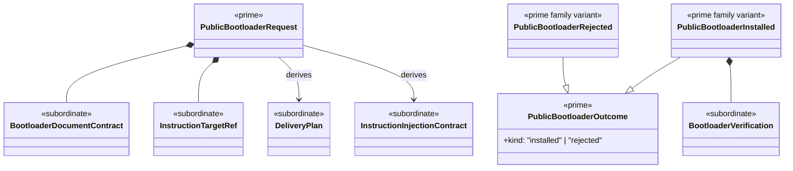

# M04 Bootloader Structural Carrier Diagram

**Status**: Completed
**Date**: 2026-04-24
**Derived from**: [M04_BOOTLOADER_DERIVATION.md](./M04_BOOTLOADER_DERIVATION.md), [M04_BOOTLOADER_FIRST_SLICE_IACS.md](./M04_BOOTLOADER_FIRST_SLICE_IACS.md), [T-020](../../.ai-workspace/tickets/completed/T-020-realize-typescript-m04-bootloader-and-project-facing-delivery-operations-under-explicit-bootloader-law.md)

## Diagram

## Sign-Off Claim

This bootloader boundary is lawful only if the future TypeScript code:

- admits one closed public bootloader request family,
- delivers one explicit bootloader document,
- injects instruction files only through explicit marker contracts, and
- verifies the delivered output without restating runtime or constitutional
  truth.
