# M04 Control Loop Structural Carrier Diagram

**Status**: Active
**Date**: 2026-04-24
**Derived from**: [M04_CONTROL_LOOP_DERIVATION.md](./M04_CONTROL_LOOP_DERIVATION.md), [M04_CONTROL_LOOP_FIRST_SLICE_IACS.md](./M04_CONTROL_LOOP_FIRST_SLICE_IACS.md), [ABG_3_MODULE_DESIGN.md](./ABG_3_MODULE_DESIGN.md), [T-013](../../.ai-workspace/tickets/completed/T-013-realize-typescript-m04-control-modes-over-closed-public-start-outcome-law.md)

## Purpose

Render the `M04-app-bootstrap` control projection boundary as one module-bounded
Mermaid UML carrier topology so Prime Rule, visibility, and deferred-family
discipline are inspectable.

## Diagram

```mermaid
classDiagram

class PublicStartRequest {
  <<prime>>
  <<authoritative>>
}

class PublicStartOutcome {
  <<prime>>
  <<authoritative>>
}

class PublicControlLoopRequest {
  <<prime>>
  <<authoritative>>
  +startRequest: PublicStartRequest
}

class PublicControlLoopOutcome {
  <<prime>>
  <<authoritative>>
  +kind: "converged" | "yielded" | "dispatch_required" | "human_gate_required" | "rejected"
}

class ControlLoopRouteBinding {
  <<subordinate>>
  -rootMode: "direct" | "supervised"
  -fhMode: "direct" | "human-proxy"
  -entry: "start"
}

class PublicControlLoopTraceRef {
  <<subordinate>>
  +steps: readonly string[]
}

class PublicControlLoopStopDetail {
  <<subordinate>>
  +kind: string
  +approvalSubjectRef: string | null
}

class HumanProxyApprovalHint {
  <<subordinate>>
  +actor: "human-proxy"
  +approvalSubjectRef: string
}

class PublicControlLoopConverged {
  <<prime family variant>>
}

class PublicControlLoopYielded {
  <<prime family variant>>
}

class PublicControlLoopDispatchRequired {
  <<prime family variant>>
}

class PublicControlLoopHumanGateRequired {
  <<prime family variant>>
}

class PublicControlLoopRejected {
  <<prime family variant>>
}

class EventIngressCommand {
  <<deferred>>
}

class ResultAssessmentIngress {
  <<deferred>>
}

class InstallBootstrap {
  <<deferred>>
}

class Bootloader {
  <<deferred>>
}

class LiveStatusProjection {
  <<deferred>>
}

class SandboxQualification {
  <<deferred>>
}

PublicControlLoopRequest --> PublicStartRequest : consumes
PublicControlLoopRequest *-- ControlLoopRouteBinding
ControlLoopRouteBinding --> PublicStartOutcome : projects over

PublicControlLoopOutcome *-- PublicControlLoopTraceRef

PublicControlLoopConverged --|> PublicControlLoopOutcome
PublicControlLoopYielded --|> PublicControlLoopOutcome
PublicControlLoopDispatchRequired --|> PublicControlLoopOutcome
PublicControlLoopHumanGateRequired --|> PublicControlLoopOutcome
PublicControlLoopRejected --|> PublicControlLoopOutcome

PublicControlLoopYielded *-- PublicControlLoopStopDetail
PublicControlLoopDispatchRequired *-- PublicControlLoopStopDetail
PublicControlLoopHumanGateRequired *-- PublicControlLoopStopDetail
PublicControlLoopHumanGateRequired *-- HumanProxyApprovalHint
PublicControlLoopRejected *-- PublicControlLoopStopDetail

PublicControlLoopOutcome ..> EventIngressCommand : deferred later
PublicControlLoopOutcome ..> ResultAssessmentIngress : deferred later
PublicControlLoopOutcome ..> LiveStatusProjection : deferred later
PublicControlLoopOutcome ..> SandboxQualification : deferred later
PublicControlLoopRequest ..> InstallBootstrap : deferred later
PublicControlLoopRequest ..> Bootloader : deferred later
```

## Reading Rules

- `PublicControlLoopRequest` and `PublicControlLoopOutcome` are the only prime
  outer carriers in this slice.
- `PublicStartRequest` and `PublicStartOutcome` remain upstream authoritative
  truth and are consumed rather than redefined.
- `ControlLoopRouteBinding`, `PublicControlLoopTraceRef`,
  `PublicControlLoopStopDetail`, and `HumanProxyApprovalHint` stay subordinate.
  The route binding points at `start(...)`; it does not own an iteration loop.
- `dispatch_required`, `yielded`, and `human_gate_required` are explicit prime
  family variants so the control loop cannot flatten those seams into generic
  blocked/success shapes.
- unsupported upstream `gap_stop` truth remains subordinate stop detail inside
  rejected control truth; it does not become yielded detail and it does not
  gain a new prime outcome family in this slice.
- Deferred classes remain outside this slice even though the control-loop
  outcome family is designed to feed them later.

## Sign-Off Claim

This control-loop diagram is lawful only if the future TypeScript code:

- consumes completed `PublicStartRequest` / `PublicStartOutcome` truth,
- routes through canonical `start(...)`,
- preserves explicit control seams as closed outcome variants, and
- keeps event-ingress, result-assessment, install/bootstrap, bootloader, and
  sandbox families deferred until successor tickets open them.
