# M04 Event Ingress Structural Carrier Diagram

**Status**: Active
**Date**: 2026-04-24
**Derived from**: [M04_EVENT_INGRESS_DERIVATION.md](./M04_EVENT_INGRESS_DERIVATION.md), [M04_EVENT_INGRESS_FIRST_SLICE_IACS.md](./M04_EVENT_INGRESS_FIRST_SLICE_IACS.md), [ABG_3_MODULE_DESIGN.md](./ABG_3_MODULE_DESIGN.md), [T-016](../../.ai-workspace/tickets/completed/T-016-realize-typescript-m04-event-ingress-over-the-canonical-kernel-emission-surface.md)

## Purpose

Render the next `M04-app-bootstrap` event-ingress boundary as one
module-bounded Mermaid UML carrier topology so Prime Rule, visibility, and
deferred-family discipline are inspectable before implementation starts.

## Diagram

```mermaid
classDiagram

class RuntimeEvent {
  <<prime>>
  <<authoritative>>
}

class PublicEventIngressRequest {
  <<prime>>
  <<authoritative>>
  +kind: "approved" | "revoked" | "reset"
}

class PublicEventIngressOutcome {
  <<prime>>
  <<authoritative>>
  +kind: "accepted" | "rejected"
}

class EventIngressRouteBinding {
  <<subordinate>>
  -workflowVersion: string | null
  -runId: string | null
  -workKey: string | null
}

class ApprovedCommandPayload {
  <<subordinate>>
  +edge: string
  +actor: "human" | "human-proxy"
}

class RevokedCommandPayload {
  <<subordinate>>
  +edge: string
  +actor: string
  +reason: string
}

class ResetCommandPayload {
  <<subordinate>>
  +scope: "workspace" | "work_key" | "edge"
  +actor: string
  +reason: string
}

class EventIngressTraceRef {
  <<subordinate>>
  +emittedKinds: readonly string[]
}

class ResetFollowupRef {
  <<subordinate>>
  +kind: string
}

class PublicEventIngressAccepted {
  <<prime family variant>>
}

class PublicEventIngressRejected {
  <<prime family variant>>
}

class AssessedIngress {
  <<deferred>>
}

class ResultArtifactIngress {
  <<deferred>>
}

class LiveStatusProjection {
  <<deferred>>
}

class InstallBootstrap {
  <<deferred>>
}

class Bootloader {
  <<deferred>>
}

class SandboxQualification {
  <<deferred>>
}

PublicEventIngressRequest *-- EventIngressRouteBinding
PublicEventIngressRequest *-- ApprovedCommandPayload
PublicEventIngressRequest *-- RevokedCommandPayload
PublicEventIngressRequest *-- ResetCommandPayload

EventIngressRouteBinding --> RuntimeEvent : binds into canonical emit

PublicEventIngressAccepted --|> PublicEventIngressOutcome
PublicEventIngressRejected --|> PublicEventIngressOutcome

PublicEventIngressAccepted *-- EventIngressTraceRef
PublicEventIngressAccepted *-- ResetFollowupRef
PublicEventIngressRejected *-- EventIngressTraceRef

PublicEventIngressOutcome ..> AssessedIngress : deferred later
PublicEventIngressOutcome ..> ResultArtifactIngress : deferred later
PublicEventIngressOutcome ..> LiveStatusProjection : deferred later
PublicEventIngressRequest ..> InstallBootstrap : deferred later
PublicEventIngressRequest ..> Bootloader : deferred later
PublicEventIngressOutcome ..> SandboxQualification : deferred later
```

## Reading Rules

- `PublicEventIngressRequest` and `PublicEventIngressOutcome` are the only
  prime outer carriers in this slice.
- `RuntimeEvent` remains upstream authoritative truth and is consumed through
  canonical `emit(...)`.
- `EventIngressRouteBinding`, `ApprovedCommandPayload`,
  `RevokedCommandPayload`, `ResetCommandPayload`, `EventIngressTraceRef`, and
  `ResetFollowupRef` stay subordinate.
- `assessed` and result-artifact ingress remain deferred so the first slice
  does not silently absorb `T-017`.
- install/bootstrap, bootloader, and sandbox families remain outside this
  slice.

## Sign-Off Claim

This event-ingress diagram is lawful only if the future TypeScript code:

- admits one closed public event-ingress request family,
- routes through canonical `emit(...)`,
- keeps first-slice public outcome truth closed and replay-readable, and
- keeps assessed/result-artifact, install/bootstrap, bootloader, and sandbox
  families deferred until successor tickets open them.
