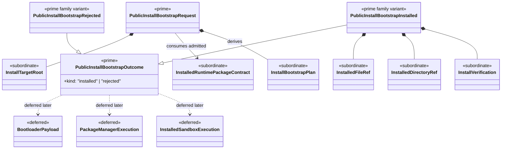

# M04 Install Bootstrap Structural Carrier Diagram

**Status**: Completed
**Date**: 2026-04-24
**Derived from**: [M04_INSTALL_BOOTSTRAP_DERIVATION.md](./M04_INSTALL_BOOTSTRAP_DERIVATION.md), [M04_INSTALL_BOOTSTRAP_FIRST_SLICE_IACS.md](./M04_INSTALL_BOOTSTRAP_FIRST_SLICE_IACS.md), [ABG_3_MODULE_DESIGN.md](./ABG_3_MODULE_DESIGN.md), [T-019](../../.ai-workspace/tickets/completed/T-019-realize-typescript-m04-install-bootstrap-under-package-first-installed-runtime-law.md)

## Purpose

Render the next `M04-app-bootstrap` install/bootstrap boundary as one
module-bounded Mermaid UML carrier topology so Prime Rule, visibility, and
deferred-family discipline are inspectable before implementation starts.

## Diagram

## Reading Rules

- `PublicInstallBootstrapRequest` and `PublicInstallBootstrapOutcome` are the
  only prime outer carriers in this slice.
- install target, package contract, pure plan, and verification detail stay
  subordinate and nested.
- bootloader, package-manager execution, and installed sandbox families remain
  deferred.

## Sign-Off Claim

This install/bootstrap diagram is lawful only if the future TypeScript code:

- admits one closed public install/bootstrap request family,
- derives one pure delivery plan from admitted request and package contract,
- materializes only the planned installed artifacts at the named effect
  boundary, and
- rejects mismatched installed roots rather than normalizing them.
