# M04 Live Status Structural Carrier Diagram

**Status**: Active
**Date**: 2026-04-24
**Derived from**: [M04_LIVE_STATUS_DERIVATION.md](./M04_LIVE_STATUS_DERIVATION.md), [M04_LIVE_STATUS_FIRST_SLICE_IACS.md](./M04_LIVE_STATUS_FIRST_SLICE_IACS.md), [ABG_3_MODULE_DESIGN.md](./ABG_3_MODULE_DESIGN.md), [T-018](../../.ai-workspace/tickets/completed/T-018-realize-typescript-m04-live-status-projection-over-explicit-runtime-projection-law.md)

## Purpose

Render the next `M04-app-bootstrap` live-status boundary as one
module-bounded Mermaid UML carrier topology so Prime Rule, visibility, and
deferred-family discipline are inspectable before implementation starts.

## Diagram

```mermaid
classDiagram

class PublicStartRequest {
  <<prime>>
  <<authoritative>>
}

class PublicStartOutcome {
  <<prime>>
  <<authoritative>>
}

class PublicControlLoopRequest {
  <<prime>>
  <<authoritative>>
}

class PublicControlLoopOutcome {
  <<prime>>
  <<authoritative>>
}

class PublicResultAssessmentRequest {
  <<prime>>
  <<authoritative>>
}

class PublicResultAssessmentOutcome {
  <<prime>>
  <<authoritative>>
}

class PublicLiveStatusRequest {
  <<prime>>
  <<authoritative>>
}

class PublicLiveStatusProjection {
  <<prime>>
  <<authoritative>>
  +kind: "idle" | "ready" | "attention"
}

class ProjectionRuntimeIdentity {
  <<subordinate>>
}

class ProjectionTraceRef {
  <<subordinate>>
}

class ProjectionResultAssessmentRef {
  <<subordinate>>
}

class ProjectionRequestBinding {
  <<subordinate>>
}

class PublicLiveStatusIdle {
  <<prime family variant>>
}

class PublicLiveStatusReady {
  <<prime family variant>>
}

class PublicLiveStatusAttention {
  <<prime family variant>>
}

class ProofHoldProjection {
  <<deferred>>
}

class InstallFormatting {
  <<deferred>>
}

class SandboxQualification {
  <<deferred>>
}

PublicLiveStatusRequest --> PublicStartRequest : consumes optional
PublicLiveStatusRequest --> PublicStartOutcome : consumes optional
PublicLiveStatusRequest --> PublicControlLoopRequest : consumes optional
PublicLiveStatusRequest --> PublicControlLoopOutcome : consumes optional
PublicLiveStatusRequest --> PublicResultAssessmentRequest : consumes optional
PublicLiveStatusRequest --> PublicResultAssessmentOutcome : consumes optional
PublicLiveStatusRequest *-- ProjectionRequestBinding

PublicLiveStatusReady --|> PublicLiveStatusProjection
PublicLiveStatusAttention --|> PublicLiveStatusProjection
PublicLiveStatusIdle --|> PublicLiveStatusProjection

PublicLiveStatusProjection *-- ProjectionRuntimeIdentity
PublicLiveStatusProjection *-- ProjectionTraceRef
PublicLiveStatusProjection *-- ProjectionResultAssessmentRef

PublicLiveStatusProjection ..> ProofHoldProjection : deferred later
PublicLiveStatusProjection ..> InstallFormatting : deferred later
PublicLiveStatusProjection ..> SandboxQualification : deferred later
```

## Reading Rules

- `PublicLiveStatusRequest` and `PublicLiveStatusProjection` are the only prime
  outer carriers in this slice.
- `PublicStart*`, `PublicControlLoop*`, and `PublicResultAssessment*` carriers
  remain upstream authoritative truth and are consumed unchanged.
- projection detail stays subordinate and nested.
- proof-hold, install formatting, and sandbox families remain deferred.

## Sign-Off Claim

This live-status diagram is lawful only if the future TypeScript code:

- admits one closed public live-status request family,
- derives one closed public projection family from admitted upstream carriers
  only,
- keeps runtime identity and assessment observation explicit, and
- does not emit, append, mutate, or close runtime truth.
