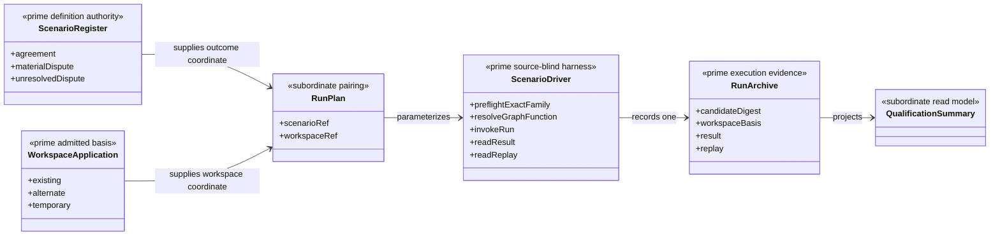
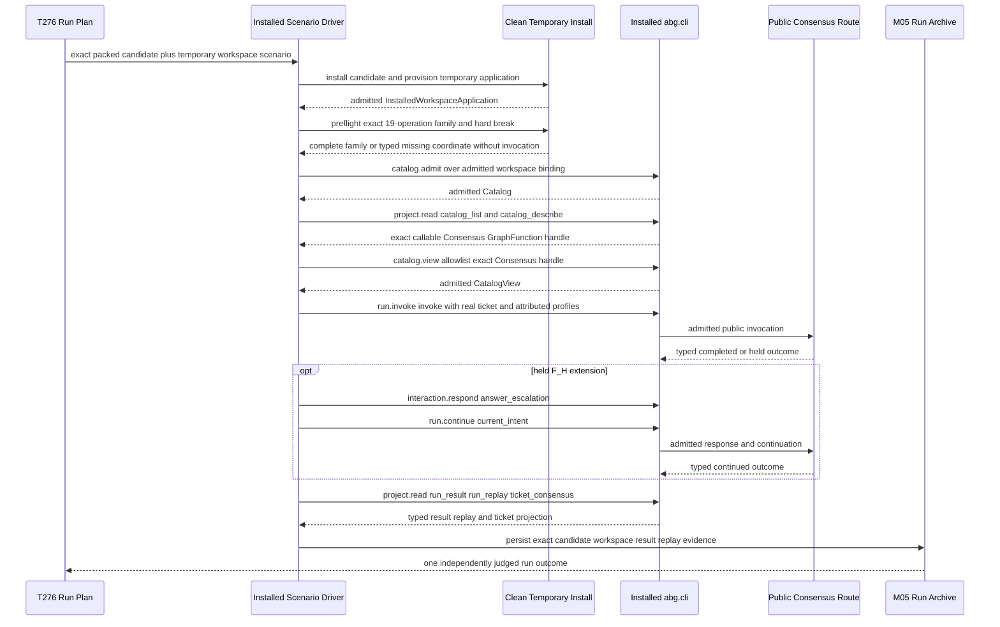
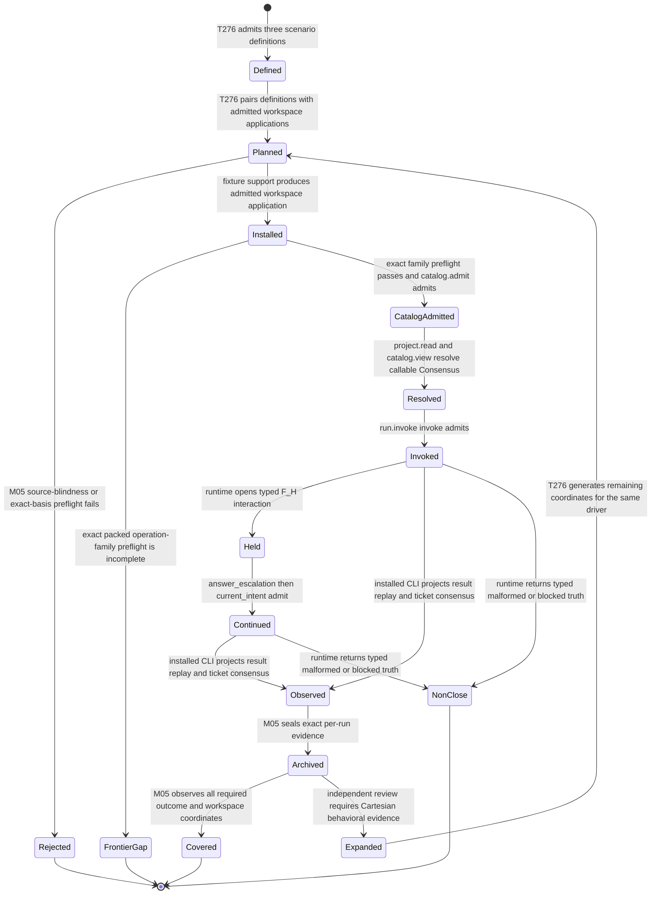

# M04-M05 Installed Consensus Scenario Prime Contraction Behavior Design

**Status**: F_H-authorized prospective owner design; independent closure review pending

**Date**: 2026-07-15

**Ticket**: `T-276`

**Change class**: `design_reframe`

**Governing design**: [ADR-044](./adrs/ADR-044-prime-contraction-is-a-cross-boundary-design-gate.md)

**Census row**: `PC-008`

## Boundary

T-276 qualifies one packed ABIogenesis 5.0 candidate through one public
Consensus contract. Agreement, material dispute with foldback, and unresolved
or exhausted dispute are three scenario definitions. Existing, alternate, and
temporary workspace roots are three applications of the same workspace
contract. Neither dimension creates a separate harness.

One source-blind installed scenario driver consumes a scenario definition and
an admitted workspace application. It invokes only the installed `abg.cli`
public operations, observes typed result and replay, and writes one immutable
run archive. It does not import source, invoke workers directly, emit runtime
events, construct continuations, or mutate tickets.

The temporary-workspace application is also the early DS-2/DS-4 delivery
governor. Before the driver invokes any target operation, a source-blind
packed-family preflight requires the exact 19-operation family and absence of
every retired identity. An incomplete family returns the typed first missing
target coordinate and invokes nothing; it is never consumed partially. The
first green target is the non-escalation/converged path. The unresolved F_H
extension reuses the same driver and adds only
`interaction.respond(answer_escalation) -> run.continue(current_intent)`.

Application-specific installed-fixture provisioning is subordinate setup. It
produces one admitted `InstalledWorkspaceApplication` for existing, alternate,
or temporary roots. The invariant Consensus driver begins from that carrier;
workspace kind cannot select its catalog, invocation, continuation, or
observation path.

The baseline proof uses three paired primary runs: each outcome family is
paired with a different workspace application. This satisfies the separately
stated outcome and workspace coverage requirements without assuming a
Cartesian execution obligation. A deterministic structural proof must show
that the driver has no workspace-kind or outcome-kind orchestration branch.
If that proof fails, or review requires cross-product behavioral evidence, the
same driver runs all nine combinations; no second implementation is added.

## Irreducible Architectural Carrier Set

- `ConsensusScenarioDefinitionRegister`: three controlled input and expected
  outcome families
- `InstalledWorkspaceApplication`: exact admitted workspace, binding, catalog,
  install, and candidate basis
- `InstalledConsensusScenarioDriver`: one source-blind public-operation
  invocation and observation harness
- `ConsensusRunArchive`: one independently replayable evidence record per
  execution

Cartesian run plans, pairings, temporary directories, command arguments,
polling observations, and aggregate qualification summaries are subordinate.

## Prime Contraction Review

```json prime-contraction
{
  "schemaVersion": 1,
  "iacs": [
    "ConsensusScenarioDefinitionRegister",
    "InstalledWorkspaceApplication",
    "InstalledConsensusScenarioDriver",
    "ConsensusRunArchive"
  ],
  "authoritativeCarriers": [
    "ConsensusScenarioDefinitionRegister",
    "InstalledWorkspaceApplication",
    "InstalledConsensusScenarioDriver",
    "ConsensusRunArchive"
  ],
  "subordinatePayloads": [
    "ConsensusScenarioRunPlan",
    "ConsensusScenarioPairing",
    "ConsensusTemporaryRoot",
    "ConsensusCliArguments",
    "ConsensusQualificationSummary"
  ],
  "promotionTests": [
    {
      "candidate": "ConsensusScenarioDefinitionRegister",
      "verdict": "promote",
      "reason": "It owns the controlled fixture inputs and expected terminal relation for each required outcome family."
    },
    {
      "candidate": "InstalledWorkspaceApplication",
      "verdict": "promote",
      "reason": "Each workspace application binds independently admitted install, workspace, catalog, and candidate identity."
    },
    {
      "candidate": "InstalledConsensusScenarioDriver",
      "verdict": "promote",
      "reason": "It is the single installed public-operation harness whose behavior must remain source-blind and parameter invariant."
    },
    {
      "candidate": "ConsensusRunArchive",
      "verdict": "promote",
      "reason": "Each execution archive independently binds observed result, replay, process, and exact candidate evidence."
    },
    {
      "candidate": "ConsensusScenarioPairing",
      "verdict": "remain_subordinate",
      "reason": "It selects coverage coordinates and owns no runtime, workspace, or outcome meaning."
    }
  ],
  "recurrenceReview": {
    "status": "commonize_tenant",
    "ref": "build_tenants/abiogenesis/typescript/design/A5_PRIME_CONTRACTION_CENSUS.md#pc-008---installed-scenario-factorization"
  },
  "authoritySourceCount": {
    "before": 9,
    "after": 4
  },
  "authoringSourceCount": {
    "before": 9,
    "after": 1
  },
  "disposition": "commonize_tenant",
  "ownerTicket": "T-276"
}
```

The authority count does not collapse three scenario definitions, three
workspace applications, or per-run archives. It measures the avoided design
in which each of nine combinations owns a harness and authority bundle. The
target has one definition register, one workspace-application contract, one
driver, and the archive family.

## Domain View



## Execution View



## State View



Transition owners are explicit: T-276 owns definition, planning, observation,
archive, and coverage judgment; M04 workspace admission owns exact workspace
basis; the installed CLI and public Consensus route own invocation and runtime
truth; independent review may require expanded execution coverage but cannot
create another driver.

## Realization Rule

1. Extend the existing installed-fixture support only where setup is genuinely
   shared; do not copy its package/install/workspace machinery.
2. Activate the temporary-workspace converged case as an early source-blind
   red thread. Preflight the exact packed 19-operation family before invoking
   any target operation. Record only its typed first missing target coordinate
   until P1/P2 admits atomically; never publish or consume a partial family.
3. Author three exact scenario definitions and one driver.
4. Make the converged temporary-workspace path green, then extend that same
   driver through `interaction.respond(answer_escalation) ->
   run.continue(current_intent)` for the F_H case.
5. Run three paired primary executions across distinct workspace applications.
6. Prove structurally that no workspace or outcome coordinate selects a
   different orchestration path.
7. Run the full nine through the same driver only if the structural proof or
   independent review requires it.
8. Preserve one archive and exact candidate/workspace/result/replay basis per
   execution regardless of aggregate summary shape.

## Negative Proof

- a driver source import or repository-relative runtime dependency fails
- any retired public operation identity, partial-family publication, direct
  module import, alternate runner, mocked catalog, or source-worktree fallback
  fails before invocation
- a missing `catalog.admit`, `project.read(catalog_list/catalog_describe)`, or
  `catalog.view(allowlist)` authority step fails before `run.invoke`
- direct worker invocation, event emission, continuation construction, or
  ticket mutation fails the harness census
- missing or duplicate scenario/workspace coverage coordinates fail
- result or replay from another workspace/candidate cannot satisfy a run
- malformed subjects, profiles, findings, rulings, policies, and outcomes
  remain typed non-close evidence
- adding an execution coordinate cannot add another orchestration implementation

## Proportionality Stop

Do not build a scenario framework, workflow engine, matrix scheduler, or
Consensus-specific CLI. One small parameterized driver over existing installed
fixture support is the limit. Execution multiplicity is evidence cost, not a
reason for code multiplicity.
