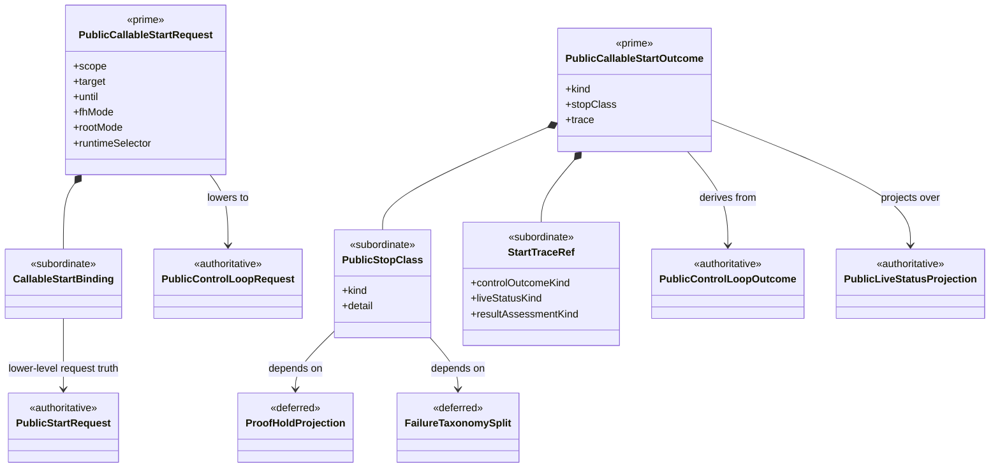

# M04 Complete `gen-start` Callable Surface Structural Carrier Diagram

```mermaid
classDiagram

class PublicCallableStartRequest {
  <<prime>>
  <<authoritative>>
  +scope
  +target
  +until
  +fhMode
  +rootMode
  +runtimeSelector
}

class PublicCallableStartOutcome {
  <<prime>>
  <<authoritative>>
  +kind
  +stopClass
  +trace
}

class CallableStartBinding {
  <<subordinate>>
}

class PublicStopClass {
  <<subordinate>>
  +kind
  +detail
}

class StartTraceRef {
  <<subordinate>>
  +controlOutcomeKind
  +liveStatusKind
  +resultAssessmentKind
}

class PublicStartRequest {
  <<authoritative>>
  <<upstream>>
}

class PublicControlLoopRequest {
  <<authoritative>>
  <<upstream>>
}

class PublicControlLoopOutcome {
  <<authoritative>>
  <<upstream>>
}

class PublicLiveStatusProjection {
  <<authoritative>>
  <<upstream>>
}

class ProofHoldProjection {
  <<deferred>>
}

class FailureTaxonomySplit {
  <<deferred>>
}

PublicCallableStartRequest *-- CallableStartBinding
PublicCallableStartRequest --> PublicControlLoopRequest : lowers to

PublicCallableStartOutcome *-- PublicStopClass
PublicCallableStartOutcome *-- StartTraceRef
PublicCallableStartOutcome --> PublicControlLoopOutcome : derives from
PublicCallableStartOutcome --> PublicLiveStatusProjection : projects over

CallableStartBinding --> PublicStartRequest : lower-level request truth
PublicStopClass --> ProofHoldProjection : depends on
PublicStopClass --> FailureTaxonomySplit : depends on
```
