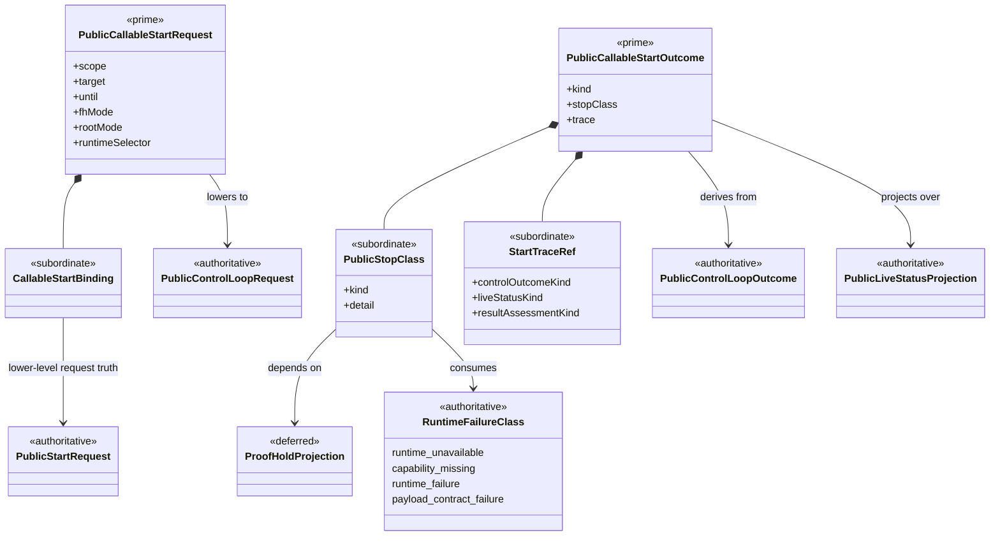

# M04 Complete `gen-start` Callable Surface Structural Carrier Diagram

**Status**: Active
**Date**: 2026-04-25
**Derived from**: [M04_MAXIMUM_AUTONOMY_GEN_START_DERIVATION.md](./M04_MAXIMUM_AUTONOMY_GEN_START_DERIVATION.md), [M04_MAXIMUM_AUTONOMY_GEN_START_FIRST_SLICE_IACS.md](./M04_MAXIMUM_AUTONOMY_GEN_START_FIRST_SLICE_IACS.md), [M03_M04_RUNTIME_FAILURE_TAXONOMY_STRUCTURAL_CARRIER_DIAGRAM.md](./M03_M04_RUNTIME_FAILURE_TAXONOMY_STRUCTURAL_CARRIER_DIAGRAM.md), [ABG_3_MODULE_DESIGN.md](./ABG_3_MODULE_DESIGN.md), [B-030-TS](../../../../.ai-workspace/tickets/completed/B-030-TS-realize-typescript-m04-complete-start-callable-surface-and-stop-taxonomy-over-canonical-public-control-truth.md)

## Purpose

Render the proposed TypeScript `B-030` callable-start and stop-taxonomy
boundary as one module-bounded Mermaid UML carrier topology so prime carriers,
subordinate payloads, upstream truth, and blocking deferred families are
inspectable before implementation claims closure.

## Diagram

