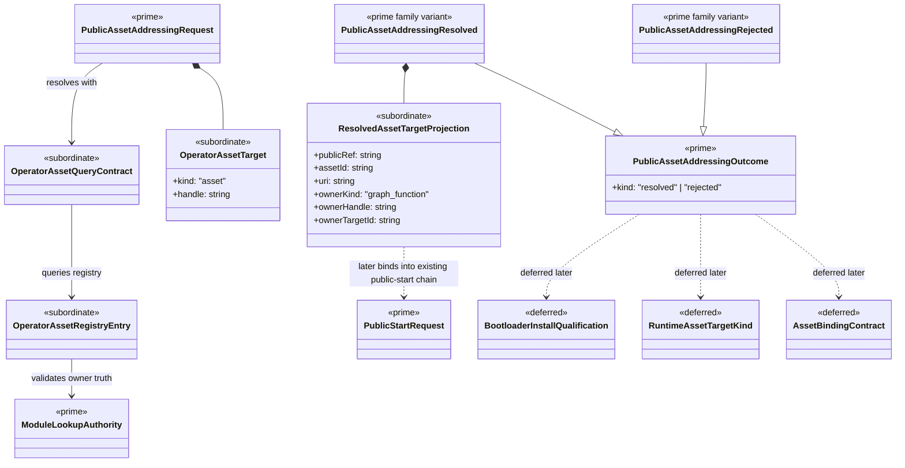

# M04 Public Asset Addressing Structural Carrier Diagram

**Status**: Completed
**Date**: 2026-04-24
**Derived from**: [M04_PUBLIC_ASSET_ADDRESSING_DERIVATION.md](./M04_PUBLIC_ASSET_ADDRESSING_DERIVATION.md), [M04_PUBLIC_ASSET_ADDRESSING_FIRST_SLICE_IACS.md](./M04_PUBLIC_ASSET_ADDRESSING_FIRST_SLICE_IACS.md), [ABG_3_MODULE_DESIGN.md](./ABG_3_MODULE_DESIGN.md), [T-025](../../.ai-workspace/tickets/completed/T-025-realize-typescript-m04-public-asset-addressing-through-a-published-operator-asset-registry.md)

## Purpose

Render the next `M04-app-bootstrap` public-asset-addressing boundary as one
module-bounded Mermaid UML carrier topology so Prime Rule, visibility, and
deferred-family discipline are inspectable before implementation starts.

## Diagram

## Reading Rules

- `PublicAssetAddressingRequest` and `PublicAssetAddressingOutcome` are the
  only prime outer carriers in this slice.
- `OperatorAssetQueryContract`, `OperatorAssetRegistryEntry`, and
  `ResolvedAssetTargetProjection` stay subordinate.
- `ModuleLookupAuthority` remains upstream authoritative truth and is consumed
  unchanged.
- the resolved asset projection is metadata over one governing graph-function
  owner, not a second traversal authority.
- bind-time asset binding, direct runtime `asset` target kinds, and later
  delivery/qualification families remain deferred.

## Sign-Off Claim

This public asset-addressing diagram is lawful only if the future TypeScript
code:

- admits one closed public asset-addressing request family,
- resolves asset handles only through an explicit operator asset registry
  contract,
- validates owner truth against published graph-function authority, and
- fails closed on unknown, malformed, or ambiguous asset targets.
