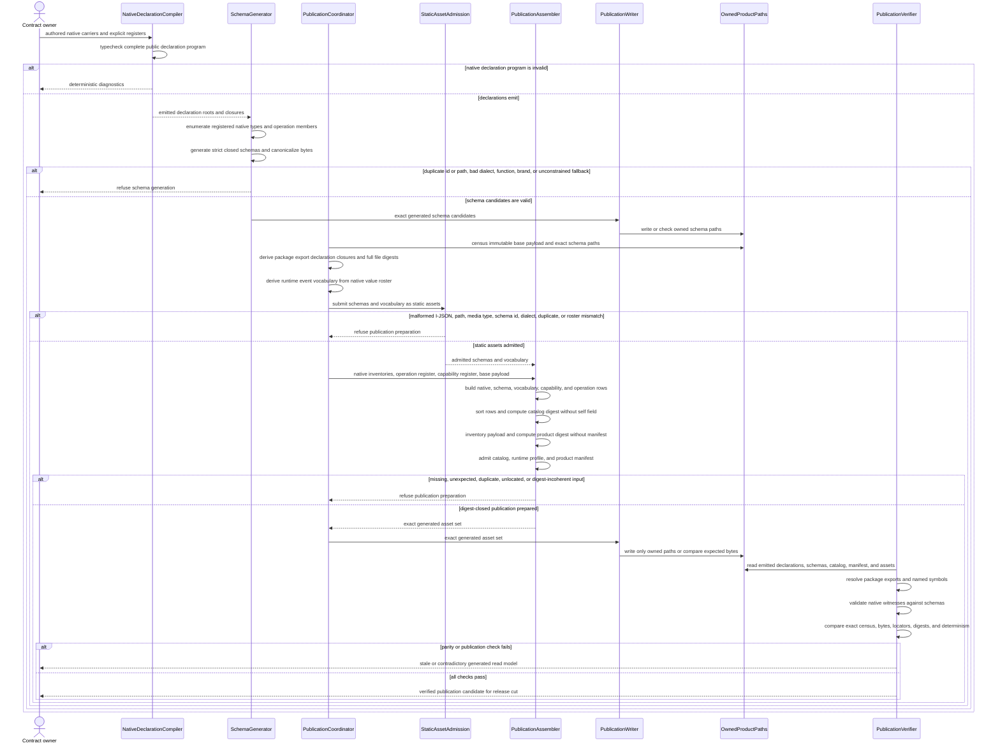
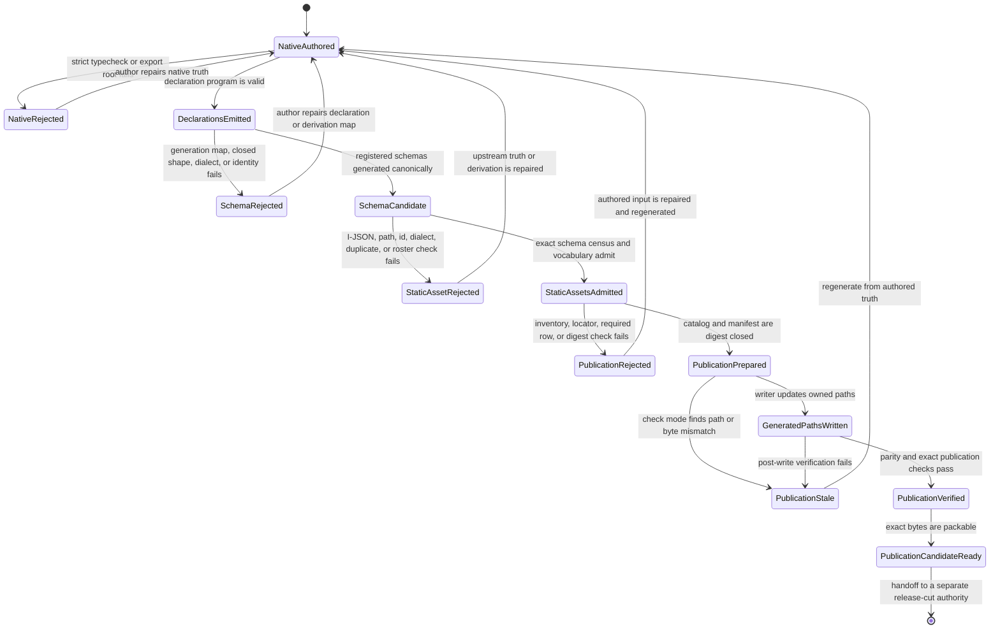

# M04 Public Contract Publication Behavior Design

**Status**: Candidate retrospective design
**Checkpoint under review**: `b445eb1` (`T-223` public SDK and CLI checkpoint)
**Review date**: 2026-07-12
**Change class**: `design_reframe`
**Method authority**: `specification_methodology/specification/standards/DESIGN_MODULE_METHOD.md` section 5E
**Tenant authority**: [TYPESCRIPT_REALIZATION_GUARDRAILS.md](./TYPESCRIPT_REALIZATION_GUARDRAILS.md)

## Boundary

- **Design verdict**: `candidate`
- **Feature-completeness verdict**: `blocked` for the complete ABIogenesis 5.0
  public-contract family; the implemented DS-1 subset is not the full catalog
- **Owning module**: M04 app bootstrap owns deterministic contract assembly and
  publication; native contract owners remain M01, M02, M03, M04, and M05
- **Requirements**:
  - `specification/PRODUCT.md`
  - `specification/requirements/product/REQ-P-PUBLIC-CONTRACTS-001..007A`
  - `specification/requirements/product/REQ-P-PUBLIC-CONTRACTS-008..014`
  - `specification/requirements/abg/REQ-R-ABG3-EVENTS.md`
- **Ticket**: T-223, public-contract publication and schema-parity part of the
  `b445eb1` checkpoint
- **Code scope**:
  - `code/src/app/m04/public_contracts/foundation.ts`
  - `code/src/app/m04/public_contracts/operations.ts`
  - `code/src/app/m04/public_contracts/publisher.ts`
  - `test_env/tools/generate_public_contract_schemas.mjs`
  - `test_env/tools/publish_abg_product_contracts.mjs`
  - static `contracts/schemas/`, `contracts/native/`, `contracts/operations/`,
    `contracts/capabilities/`, and `contracts/vocabularies/` publication assets
  - T-223 publication, generated-schema parity, native-export, and publication-tool
    tests, read at their `b445eb1` versions
- **Dependencies**: strict semantic TypeScript build; exact package export map;
  native public carrier definitions; RFC 8785 canonical I-JSON and SHA-256
  primitives; the native runtime-event kind roster
- **Explicit exclusions**: public SDK execution, CLI parsing, product install,
  runtime catalog admission, GraphFunction traversal, worker dispatch, hosted
  schema service, signing, hostile-local tamper resistance, multi-language code
  generation, the post-`b445eb1` generated ABG system catalog Module, the later
  packed installed vertical, and any claim that the current DS-1 subset is the
  complete 5.0 catalog

This is a retrospective reconstruction of code that already exists. It freezes
that code for independent axiom review and F_H ratification. It does not mark
the design accepted and does not authorize additional implementation.

The authority distinction is load-bearing:

1. specification defines required product truth;
2. authored native carrier definitions and explicit publication registers define
   the TypeScript realization input;
3. emitted declarations, generated JSON Schemas, inventories, rows, catalogs,
   and manifests are deterministic read models over those inputs;
4. after a release cut freezes their exact bytes and digests, those assets are
   the immutable public contracts of that released product;
5. generated files in the mutable source project never acquire authority to
   rewrite specification or native authored truth.

The publisher is an F_D release transform. It invokes no worker, owns no
traversal or closure state, and is not a hidden GraphFunction implementation.

## Domain Model

```mermaid
classDiagram
  direction LR

  class PublicContractRequirements {
    <<constitutional authority>>
    +required groups
    +required operations
    +required capabilities
    +digest and locator law
  }

  class NativeCarrierDefinitions {
    <<authored realization truth>>
    +closed TypeScript carriers
    +admitters and serializers
    +closed value rosters
  }

  class NativePublicationRegister {
    <<authored realization truth>>
    +contractId
    +packageExport
    +symbols
    +capabilityRefs
  }

  class OperationDefinitionRegister {
    <<authored realization truth>>
    +operationId
    +native symbols
    +defaults and domains
    +authority and effect classes
    +dispositions and exit map
  }

  class SchemaDefinitionRegister {
    <<authored derivation map>>
    +contractId
    +relativePath
    +nativeType
  }

  class EmittedDeclarationProgram {
    <<derived read model>>
    +package export roots
    +strict declaration closure
  }

  class NativeDeclarationCompiler {
    <<deterministic compiler boundary>>
    +typecheck strict program
    +emit declaration closure
  }

  class SchemaGenerator {
    <<deterministic derivation boundary>>
    +generate registered schemas
    +reject unconstrained fallback
  }

  class PublicationCoordinator {
    <<M04 release-candidate coordinator>>
    +census payload
    +derive exact publication inputs
  }

  class GeneratedSchemaAsset {
    <<derived read model>>
    +contractId as schema id
    +canonical bytes
    +product relative path
  }

  class NativeDeclarationInventory {
    <<derived read model>>
    +packageExport
    +declarationPath
    +declarationDigest
  }

  class RuntimeEventVocabularyAsset {
    <<derived read model>>
    +native roster equality
    +canonical bytes
  }

  class StaticAssetAdmission {
    <<admission boundary>>
    +I-JSON admission
    +schema identity and dialect
    +relative path
    +unique id and path
  }

  class PublicOperationAsset {
    <<derived publication asset>>
    +schema locators and digests
    +operation metadata
  }

  class CapabilityAsset {
    <<derived publication asset>>
    +capabilityId
    +requiredContractIds
  }

  class PublicContractRow {
    <<subordinate catalog row>>
    +contract identity and version
    +authority and capability refs
    +native locator
    +asset locator
  }

  class PublicContractCatalog {
    <<derived release candidate>>
    +catalog identity and version
    +catalog schema digest
    +catalog digest
    +sorted rows
  }

  class ProductContentInventory {
    <<derived digest basis>>
    +sorted path and digest tuples
    +manifest excluded
  }

  class ProductToolchainManifest {
    <<derived release candidate>>
    +product identity and version
    +product content digest
    +catalog path and digest
    +runtime system profile
  }

  class PublicationAssembler {
    <<M04 F_D transform>>
    +build foundation
    +build operation publication
    +close catalog and manifest digests
  }

  class PublicationWriter {
    <<release effect edge>>
    +write only owned generated paths
    +remove stale owned outputs
  }

  class OwnedProductPaths {
    <<effect-edge storage>>
    +mutable source-project generated paths
  }

  class PublicationVerifier {
    <<F_D proof surface>>
    +exact path census
    +byte equality
    +native locator resolution
    +schema parity
  }

  PublicContractRequirements --> NativeCarrierDefinitions : governs meaning
  PublicContractRequirements --> NativePublicationRegister : governs required identity
  PublicContractRequirements --> OperationDefinitionRegister : governs operation roster
  NativeCarrierDefinitions --> NativeDeclarationCompiler : compile input
  NativePublicationRegister --> NativeDeclarationCompiler : selects export roots
  NativeDeclarationCompiler --> EmittedDeclarationProgram : emits
  SchemaDefinitionRegister --> SchemaGenerator : maps native type to schema identity
  EmittedDeclarationProgram --> SchemaGenerator : declaration input
  SchemaGenerator --> GeneratedSchemaAsset : derives
  EmittedDeclarationProgram --> NativeDeclarationInventory : declaration closure and digest
  NativeCarrierDefinitions --> RuntimeEventVocabularyAsset : event roster derives bytes
  GeneratedSchemaAsset --> StaticAssetAdmission : must admit before publication
  RuntimeEventVocabularyAsset --> StaticAssetAdmission : must equal native roster
  OperationDefinitionRegister --> PublicOperationAsset : derives metadata
  StaticAssetAdmission --> PublicOperationAsset : binds exact schemas
  NativeDeclarationInventory --> PublicationAssembler : supplies native locators
  StaticAssetAdmission --> PublicationAssembler : supplies canonical assets
  PublicOperationAsset --> PublicationAssembler : supplies operation rows
  PublicationAssembler *-- CapabilityAsset : derives bounded capability assets
  PublicationAssembler *-- PublicContractRow : constructs exact rows
  PublicContractRow --> PublicContractCatalog : sorted catalog membership
  PublicationAssembler *-- ProductContentInventory : inventories immutable payload
  ProductContentInventory --> ProductToolchainManifest : binds content digest
  PublicContractCatalog --> ProductToolchainManifest : embeds and binds catalog
  PublicationCoordinator --> PublicationAssembler : supplies exact admitted inputs
  PublicationAssembler --> PublicationWriter : provides expected bytes
  PublicationWriter --> OwnedProductPaths : writes or checks only owned paths
  PublicationVerifier --> OwnedProductPaths : reads exact bytes
  PublicationVerifier --> GeneratedSchemaAsset : checks current and closed
  PublicationVerifier --> EmittedDeclarationProgram : resolves native exports and symbols
  PublicationVerifier --> PublicContractCatalog : verifies deterministic bytes and rows
  PublicationVerifier --> ProductToolchainManifest : verifies product digest basis
```

`PublicContractCatalog` and `ProductToolchainManifest` become public product
truth only as immutable assets of an exact release cut. Before that cut, they
remain generated candidates in the mutable source project. The generator,
publisher, writer, and verifier are effect or proof functions, not semantic
truth stores.

## Execution Sequence

Writing is not admission. The exact-path and byte check must succeed after the
write. Test fixtures are witnesses supplied to the verifier; they do not own
contract meaning or publication identity.

## Lifecycle State Machine

There is no transition from a hand-edited generated file back to
`NativeAuthored`. A generated mismatch returns to upstream authored truth and
regeneration. There is also no transition from `PublicationPrepared` directly
to a release claim; the exact output and parity checks intervene.

## Cross-View Invariants

| Check | Domain evidence | Sequence evidence | State evidence | Verdict |
|---|---|---|---|---|
| Every sequence participant has one domain role | External author plus compiler, generator, coordinator, admission, assembler, writer, owned-path store, and verifier map to declared truth, transform, effect, or proof roles | Every message crosses one named role boundary | State ownership changes only at those boundaries | pass |
| Generated artifacts never become source-project authority | Schemas, inventories, rows, catalogs, and manifests are marked derived before a release cut | Generator and assembler only consume authored registers and declarations | Every rejection returns to `NativeAuthored`; no generated-to-authored transition exists | pass |
| Native and canonical serialized contracts cannot silently diverge | Emitted declarations and generated schemas remain distinct carriers | Native witnesses and exact export symbols are checked against schema assets | Parity failure enters `PublicationStale`, not release-ready | pass |
| Every public locator is exact and digest bound | Rows bind native export/symbols or product-relative asset path plus digest | Admission and assembler validate path, identity, and digest before catalog construction | Locator failure enters `PublicationRejected` | pass |
| Catalog and manifest digest closure is non-circular | Catalog digest omits its own field; product inventory excludes the manifest | Assembler performs the two digest phases in order | Only digest-closed publication reaches `PublicationPrepared` | pass |
| Publication is deterministic F_D release work | Publisher, writer, and verifier are F_D transform/effect/proof roles | No worker, prompt, traversal, retry loop, or F_H decision appears | No runtime or agentic state exists | pass |
| A passing subset is not promoted to complete 5.0 truth | Requirements and implemented registers remain separate domain objects | Verifier checks implemented DS-1 exactly; it does not invent absent rows | `PublicationVerified` means exact subset verification, not feature completeness | pass |

## Axiom Evaluation

| Axiom | Authority | Domain evidence | Sequence evidence | State evidence | Native enforcement | Admission/compiler enforcement | Verdict | Gap owner |
|---|---|---|---|---|---|---|---|---|
| Specification outranks design, code, and generated views | workspace `AGENTS.md`; `PRODUCT.md`; `REQ-P-PUBLIC-CONTRACTS` | requirements are the sole constitutional class | transforms consume authored inputs only | every rejection returns to authored truth | explicit registers cannot add constitutional meaning | generated files are reproducible and stale-checkable | pass | none |
| Public serialization is canonical and cannot contradict native contracts | `REQ-P-PUBLIC-CONTRACTS-003`, `-006`, `-007A` | native definitions and schema assets are distinct but linked | schema generation precedes parity verification | parity failure reaches `PublicationStale` | strict emitted declarations and exact symbols | strict schemas, native witnesses, and AJV parity for implemented rows | pass | remaining rows under T-244/T-249 execution leaves |
| Native groups resolve without source-path inference | `REQ-P-PUBLIC-CONTRACTS-002A`, `-003`, `-005` | native rows carry package export and declaration inventory | coordinator walks emitted declaration closure only | unresolved locators reach `PublicationRejected` | exact package `types` exports | compiler resolution, payload census, tuple digest, and symbol tests for nine DS-1 groups | pass | none inside bounded subset |
| Asset paths are product relative and digest coherent | `REQ-P-PUBLIC-CONTRACTS-002`, `-002A`, `-003` | asset locators carry exact path, media, schema, and digest | admission precedes row construction | bad paths or digests reach rejection | closed locator carrier types | relative-path admission, exact census, byte digest, and stale checks | pass | none |
| Contract identity cannot resolve to two meanings | `REQ-P-PUBLIC-CONTRACTS-004` | id, version, and digest form one row | duplicates refuse before assembly | duplicate identity cannot reach `PublicationPrepared` | readonly discriminated row carriers | uniqueness maps, row admission, and deterministic sorting | pass | supersession remains a future versioning exercise |
| Catalog and product digests do not contain themselves | `REQ-P-PUBLIC-CONTRACTS-002A` | catalog basis and product inventory are explicit | catalog closes before manifest; manifest is excluded from inventory | only digest-closed output reaches `PublicationPrepared` | digest brands constrain format | canonical digest bases and negative digest tests | pass | none |
| Runtime event vocabulary equals native runtime truth | `REQ-P-PUBLIC-CONTRACTS-006`, `-006A`; `REQ-R-ABG3-EVENTS` | vocabulary derives from the native event roster | admission compares exact canonical values | roster mismatch reaches `StaticAssetRejected` | closed native value roster | equality admission and parity for event-kind vocabulary | pass | diagnostic and repair vocabularies not yet published |
| Generated and test surfaces are read models | `REQ-P-PUBLIC-CONTRACTS` Purpose; workspace authority law | generator and verifier are downstream roles | neither can amend native or constitutional truth | no generated-to-authored transition exists | generated assets supply no upstream meaning | write/check modes and reproducible derivation | pass | none |
| Publication remains a bounded static product artifact | `REQ-P-PUBLIC-CONTRACTS-014` | catalogs, schemas, vocabularies, and manifests are candidate assets | one local preparation/write/check sequence | lifecycle ends at a publication candidate, before release | no service or network carrier | no hosted registry, signing, or hostile-local machinery | pass | none |
| Source-blind builders can locate every mandatory 5.0 contract | `REQ-P-PUBLIC-CONTRACTS-005..013` | current DS-1 registers publish only a subset | verifier sees only present DS-1 rows | candidate readiness does not imply 5.0 completeness | 13 operation and 7 capability definitions are native facts | exact tests cannot prove absent rows | fail | remaining 5.0 public-contract leaves |

## Gap And Exclusion Register

| Gap | Current proof | Required closure before complete 5.0 claim |
|---|---|---|
| 23 of the 36 required operation identities are absent | `DS1_PUBLIC_OPERATION_DEFINITION_REGISTER` and parity tests contain 13 operations | Author, generate, publish, and verify every retained operation required by the final 5.0 reprice |
| 9 of the 16 mandatory capability identities are absent | `DS1_CAPABILITY_CONTRACT_REGISTER` contains 7 capabilities | Publish exact capability contracts only after their required contracts are realized and located |
| Mandatory schema, vocabulary, and corpus rows remain absent | the current baseline register and 54-row DS-1 catalog cover only the T-223 subset | Add the retained C-program, conformance, F_H, qualification, diagnostic vocabulary, and language corpus assets with native/serialized parity |
| Complete source-blind builder walkthrough is not yet earned | current locators are exact for present rows, but absent mandatory rows force inference or failure | Run `REQ-P-PUBLIC-CONTRACTS-013` against the packed candidate after the full retained catalog exists |
| Source-tree verification is not a release cut | write/check proves deterministic bytes in the mutable source project | Pack and release qualification must freeze and verify the same bytes before they become immutable released product truth |

The gaps above are feature gaps, not permission to add placeholder rows. A
capability or operation enters the catalog only when its native contract,
canonical serialization, owning requirement, and proof surface are real.

## Design Verdict

`candidate` for the bounded DS-1 publication mechanics at `b445eb1`;
`blocked` for complete 5.0 public-contract publication. The bounded candidate
may be accepted only if independent review confirms all three
views describe the current code at `b445eb1`, the generated-surface authority
distinction is correct, and the current DS-1 subset remains explicitly
non-complete. Until that verdict and F_H ratification are recorded, the code
covered by this retrospective design remains frozen and no dependent coding
should continue.
