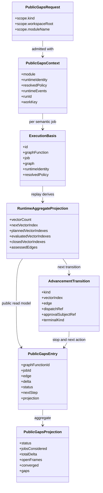

# M04 Public Gaps Projection Structural Carrier Diagram

**Status**: Completed
**Date**: 2026-04-25

```mermaid
classDiagram
  class PublicGapsRequest {
    +scope.kind
    +scope.workspaceRoot
    +scope.moduleName
  }

  class PublicGapsContext {
    +module
    +runtimeIdentity
    +resolvedPolicy
    +runtimeEvents
    +runId
    +workKey
  }

  class ExecutionBasis {
    +id
    +graphFunction
    +job
    +graph
    +runtimeIdentity
    +resolvedPolicy
  }

  class RuntimeAggregateProjection {
    +vectorCount
    +nextVectorIndex
    +plannedVectorIndexes
    +evaluatedVectorIndexes
    +closedVectorIndexes
    +assessedEdges
  }

  class AdvancementTransition {
    +kind
    +vectorIndex
    +edge
    +dispatchRef
    +approvalSubjectRef
    +terminalKind
  }

  class PublicGapsEntry {
    +graphFunctionId
    +jobId
    +edge
    +delta
    +status
    +nextStep
    +projection
  }

  class PublicGapsProjection {
    +status
    +jobsConsidered
    +totalDelta
    +openFrames
    +converged
    +gaps
  }

  PublicGapsRequest --> PublicGapsContext : admitted with
  PublicGapsContext --> ExecutionBasis : per semantic job
  ExecutionBasis --> RuntimeAggregateProjection : replay derives
  RuntimeAggregateProjection --> AdvancementTransition : next transition
  RuntimeAggregateProjection --> PublicGapsEntry : public read model
  AdvancementTransition --> PublicGapsEntry : stop and next action
  PublicGapsEntry --> PublicGapsProjection : aggregate
```
