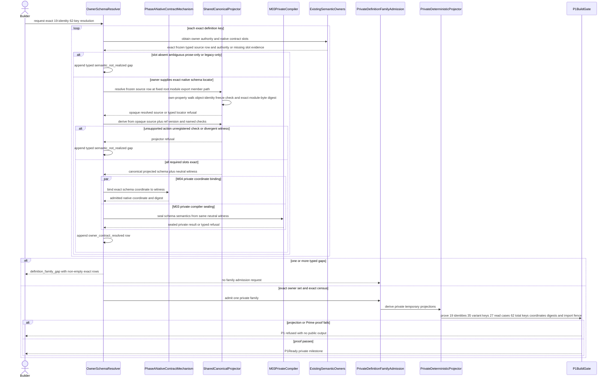
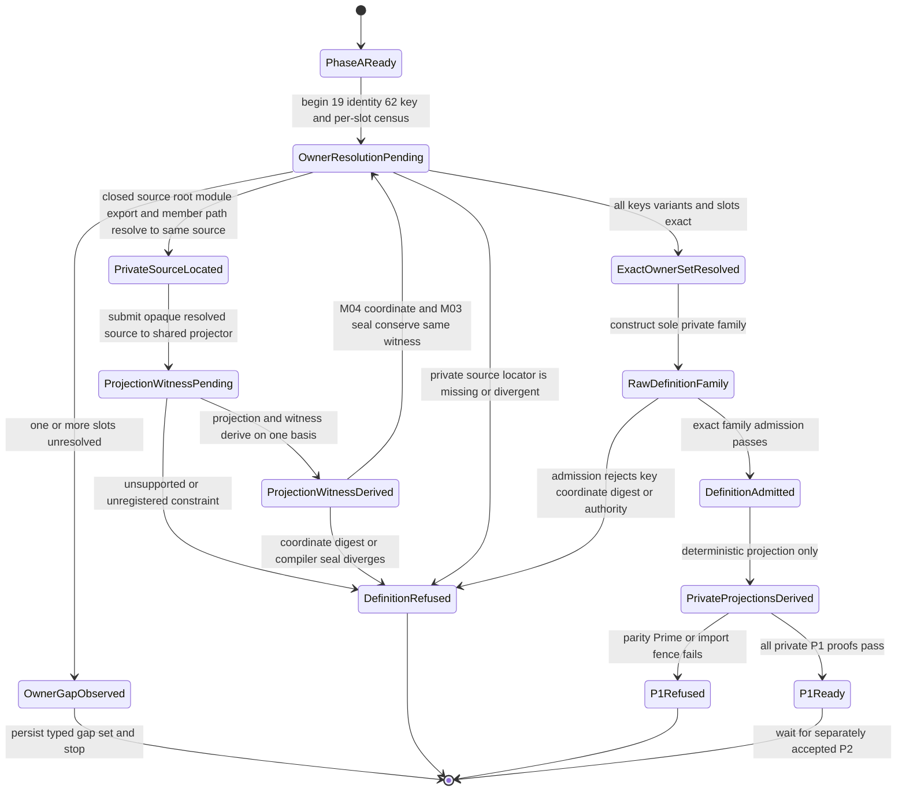

# M04 Public Operation Definition Family Behavior Design

**Status**: Accepted target; Phase A source/witness repair pending independent re-review; P1 implementation blocked on named owner-contract gaps; P2 gated

**Date**: 2026-07-16

**Ticket**: `T-281`

**Change class**: `design_reframe`

**Delivery boundary**: GOAL-035 P1 before T-270/T-272 runtime integration and after their neutral owner-contract milestones; P2 handler and packed parity excluded

**Ontology authority**: `ABIOGENESIS_PUBLIC_CONTROL_PLANE_ONTOLOGY.md`
version `abg.public-control-plane.ontology/9`, accepted semantic candidate
`1ca39b2b5c536be6d16eecfb30d8310e798853232ae7c03f71ac655a7f97bf40`,
current file digest
`f817a7e730bec935f053138e85cb09aa6e0f693e558eaf287be502803da20ee8`

**Ontology acceptance**:
`.ai-workspace/comments/codex/20260716T055554Z_DECISION_t278_ontology_ratified.md`

**Method authority**:
`specification_methodology/specification/standards/DESIGN_MODULE_METHOD.md`

**Prime authority**: [ADR-044](./adrs/ADR-044-prime-contraction-is-a-cross-boundary-design-gate.md)

## Boundary

This design realizes the P1 definition prerequisite in `GOALS.md`. It replaces
the superseded operation contract map, metadata register, CLI roster, schema
algorithms, and publication roster with one operation-indexed
`PublicFunctionDefinition<K>` authoring family for the exact ratified 19 public
operations. It preserves `PublicInvocation<K>` and `PublicOutcome<K>` as the
common independently admitted ingress and egress carriers required by
`REQ-P-PUBLIC-CONTRACTS-010`.

The definition family owns only the public operation-to-contract binding and
projection relation. Payload request/result/refusal meaning remains with each
semantic owner:

- operation identity and version;
- closed variant domain;
- exact bindings to owner-native request, result, refusal, and non-terminal
  result schemas;
- semantic authority reference and authority/effect class;
- actor and capability requirements;
- `workspaceBindingRequirement: forbidden | exactly_one` per variant;
- defaults and closed value domains;
- request/result/refusal/invocation/outcome schema coordinates;
- SDK member and CLI command coordinates; and
- adapter exit classification.

Catalog rows, schema assets, SDK declarations, CLI grammar, and parity
inventories are deterministic projections. Semantic functions, ABG
interpreters, event writers, filesystem effects, and operation-specific
handlers retain separate owners. A definition points to semantic authority; it
does not execute that authority.

Phase A is a private mechanism checkpoint. It proves one Valibot-native
contract definition/projector, the exact common authority/invocation/outcome
packets, and a schema-only non-Consensus fixture. It exports no product
contract, calls no handler, and claims neither the 19-row family nor the hard
break.

P1 attempts to author the exact 19-operation family from Phase A native
contracts and exact owner-supplied native schemas. It first resolves every
request, result, refusal, and declared non-terminal slot. An unresolved slot is
a typed build gap and terminates that P1 pass; prose, a TypeScript interface, a
legacy admitter, or a generated JSON Schema cannot substitute for the missing
owner schema. Only an exact resolved set may admit the private family and
derive private, temporary candidate projections.

Frozen 4.6 code may remain only as migration evidence; it cannot be imported
by, validate, generate, or appear in any 5.0 candidate projection. No P1 build
may publish or identify itself as the 5.0 public surface. P2 atomically binds
handlers, switches package exports, catalog, schemas, SDK and CLI to the P1
family, deletes the frozen legacy roster and aliases, and proves
source/package/install absence. Only that P2 cutover earns the hard break.

### Requirements

- `REQ-P-PUBLIC-CONTRACTS-005`, `-008`, `-009`, and `-010`;
- `REQ-P-POLICY` operation-specific behavior clauses;
- `PRODUCT.md` Public Operator Contract and hard-break law;
- ratified T-278 public control-plane Ontology;
- accepted T-270 `run.invoke` authority design;
- accepted T-272 F_H response and continuation design;
- accepted T-275 Consensus domain design's pure `ticket_consensus` read; and
- ADR-044 plus census rows `PC-004` and `PC-005`.

### Explicit Exclusions

- implementation or ownership of operation-specific semantic behavior;
- a metadata-driven mega-handler or general service controller;
- any semantic handler, handler binding, runtime invocation, or M03 dependency
  on an M04 public-carrier implementation;
- P2 handler binding and full packed public parity;
- a temporary public `not_implemented` or handler-missing behavior;
- a second authored contract map, ID array, CLI switch, schema roster, schema
  language, schema compiler, or catalog operation roster;
- unchecked `as unknown as`, permissive index signatures, or untyped generic
  dispatch used to erase `K`;
- a permissive optional-field mega-schema across variants;
- Consensus-specific operation identity, request, router, or handler law;
- hostile-workstation signing or tamper resistance; and
- legacy aliases, facades, defaults, fallbacks, or parallel public registers;
- Phase A product exports, handler calls, filesystem effects, publication, or
  claims that the 19-row family is complete; and
- a custom contract-constructor DSL, open-ended or operation-specific callback
  validator, schema fragment, or operation-specific validation branch.
- committed public schemas, package exports, catalog publication, SDK
  implementation, CLI switch implementation, or AF-24 publication in P1.

The supported environment is one trusted developer desktop. Proportional
defense targets likely malformed authored definitions, CLI/SDK input, and
worker/handler output. It does not add hostile in-process or filesystem
adversary machinery.

## Ontology Basis

The accepted Ontology contributes `PublicFunctionDefinition<K>`,
`PublicInvocation<K>`, `PublicOutcome<K>`, `InvocationAuthority<K>`,
`WorkspaceBinding`, `PublicContractCatalog`, the 27 atomic function families,
and the exact 19-operation projection. This design introduces no product
entity. It supplies native HOW relations and deterministic projectors for the
accepted public family.

Any change to the cited Ontology identity, accepted semantic candidate, file
digest, `REQ-P-PUBLIC-CONTRACTS-008..010`, or PRODUCT operation table makes this
design stale before implementation.

## Exact Public Definition Matrix

The variant strings below are the exact public and native discriminants.
CLI command spelling is an adapter coordinate and never rewrites those values.
Target paths, subjects, refs, and policies remain typed request fields.

| Operation identity | Closed native variant domain | Atomic/composed authority | Workspace binding | Actor | Effect class | CLI coordinate |
|---|---|---|---|---|---|---|
| `abg.operation.workspace.create` | `clean`, `imported` | `AF-01 constructWorkspace` | `forbidden` | required | workspace filesystem | `workspace create --policy <policy>` |
| `abg.operation.workspace.open` | `open` | `AF-02 openWorkspace` | `forbidden` | forbidden | read/admission | `workspace open` |
| `abg.operation.project.read` | closed `ProjectReadCase` source/projection relation below | `AF-03 project<S,K>` | per-case `forbidden` or `exactly_one` | forbidden | pure read | `project read <projection>` |
| `abg.operation.product.verify` | `verify` | `AF-04 verifyProductArtifact` | `forbidden` | forbidden | deterministic evaluation | `product verify` |
| `abg.operation.product.resolve` | `resolve` | `AF-05 resolveProductSet` | `forbidden` | forbidden | deterministic evaluation | `product resolve` |
| `abg.operation.product.install` | `install` | `AF-06 installProduct` | `forbidden` | required | immutable install filesystem | `product install` |
| `abg.operation.workspace.bind` | `bind` | `AF-07 bindWorkspace` | `forbidden` | required | binding persistence | `workspace bind` |
| `abg.operation.catalog.admit` | `admit` | `AF-08 admitCatalog` | `exactly_one` | required | catalog admission event | `catalog admit` |
| `abg.operation.catalog.view` | `allowlist` | `AF-09 deriveCatalogView` | `exactly_one` | required | deterministic narrowing | `catalog view` |
| `abg.operation.catalog.apply` | `node_type`, `overlay` | `AF-10 applyCatalogDeclaration` | `exactly_one` | required | declaration application admission | `catalog apply <kind>` |
| `abg.operation.run.invoke` | `invoke`, `start` | admitted One Surface program through `AF-11..AF-16`; T-270 owns AF-15 admission | `exactly_one` | required | ABG traversal | `run <variant>` |
| `abg.operation.run.continue` | `current_intent`, `selected_action` | T-272 `AF-17`; selected action returns through `AF-14/AF-15` | `exactly_one` | required | ABG continuation | `run continue --mode <mode>` |
| `abg.operation.interaction.respond` | `select`, `approve`, `reject`, `assess`, `answer_escalation` | `AF-18 admitHumanResponse` | `exactly_one` | required | F_H response admission event | `interaction respond <variant>` |
| `abg.operation.result.assess` | `assess` | `AF-19 admitResultAssessment` | `exactly_one` | required | result-assessment admission event | `result assess` |
| `abg.operation.witness.admit` | `reprice`, `attest`, `hygiene-stamp`, `intake`, `run-resumed`, `run-stopped` | `AF-20 admitWitnessedAct` | `exactly_one` | required | witnessed-act admission event | `witness admit <variant>` |
| `abg.operation.tuning.transition` | `propose`, `ratify`, `reject` | `AF-21 transitionTuningDraft` | `exactly_one` | required | tuning lifecycle event | `tuning transition <variant>` |
| `abg.operation.conformance.evaluate` | `gtl_program` | `AF-22 evaluateConformance` | `exactly_one` | required | deterministic evaluation/admission | `conformance evaluate gtl-program` |
| `abg.operation.product.materialize` | `context_bootstrap`, `configuration` | `AF-23 materializeProductAsset` | `exactly_one` | required | product filesystem | `product materialize <variant>` |
| `abg.operation.release.snapshot` | `published_rc`, `tapped_release` | `AF-25 materializeReleaseCut` | `exactly_one` | required | immutable release publication | `release snapshot <variant>` |

The six pre-binding atomic families named by Ontology invariant 3 are exactly
`AF-01`, `AF-02`, and `AF-04..AF-07`; their public variants forbid a binding.
The `project.read` relation closes binding cardinality per source/projection
case: workspace, catalog, runtime, interaction, continuation, assessment, and
witness cases require one binding; immutable install and release evidence cases
forbid it because their source identities carry their own admitted basis.
Every other current public variant is workspace- or execution-scoped and
requires one exact immutable binding. For `release.snapshot`, the invocation
binding must equal the binding named by the exact qualification basis; it is an
equality check, not a second release authority. Aggregate carrier syntax never
turns this sum into a freely optional binding.

`run.invoke(start)` additionally retains the closed `fh_mode` and `root_mode`
policy families from PRODUCT. They are request policy fields outside
`scope + target + until`, not operation variants or CLI-owned defaults.

## Closed Project Read Relation

`project.read` is one public identity over the closed relation below. It is not
one request with a free-form source and projection string. Every case has the
base request fields `sourceRef`, `sourceDigest`, `projectionBasisRef`, and
`projectionBasisDigest`. Replay cases additionally require an explicit cursor
or closed range. The catalog-description case additionally requires one
canonical handle. No read case admits an event or returns a non-terminal
outcome.

| Case key | Exact source carrier | Exact result carrier | Binding | Capability refs |
|---|---|---|---|---|
| `catalog_list` | `Catalog` | `CatalogListProjection` | `exactly_one` | `abg.capability.operator.public-contract@5` |
| `catalog_describe` | `Catalog` plus canonical handle | `CatalogDescriptionProjection` | `exactly_one` | `abg.capability.operator.public-contract@5` |
| `workspace_status` | `WorkspaceBinding` | `WorkspaceStatusProjection` | `exactly_one` | `abg.capability.operator.public-contract@5` |
| `run_status` | `Run` | `RunStatusProjection` | `exactly_one` | `abg.capability.runtime.replay-continuation@5` |
| `graph_call_status` | `GraphCall` | `GraphCallStatusProjection` | `exactly_one` | `abg.capability.runtime.replay-continuation@5` |
| `run_result` | `Run` | `RunResultProjection` | `exactly_one` | `abg.capability.runtime.replay-continuation@5` |
| `graph_call_result` | `GraphCall` | `GraphCallResultProjection` | `exactly_one` | `abg.capability.runtime.replay-continuation@5` |
| `run_evidence` | `Run` | `EvidenceProjection<Run>` | `exactly_one` | `abg.capability.runtime.replay-continuation@5` |
| `graph_call_evidence` | `GraphCall` | `EvidenceProjection<GraphCall>` | `exactly_one` | `abg.capability.runtime.replay-continuation@5` |
| `result_evidence` | `RuntimeResult` | `EvidenceProjection<RuntimeResult>` | `exactly_one` | `abg.capability.runtime.replay-continuation@5` |
| `assessment_evidence` | `ResultAssessment` | `EvidenceProjection<ResultAssessment>` | `exactly_one` | `abg.capability.runtime.admit-fp-result@5` |
| `witness_evidence` | `WitnessedAct` | `EvidenceProjection<WitnessedAct>` | `exactly_one` | `abg.capability.operator.public-contract@5` |
| `install_evidence` | `InstalledProduct` plus `InstallManifest` | `EvidenceProjection<InstalledProduct>` | `forbidden` | `abg.capability.install.bind-products@5` |
| `release_evidence` | `ReleaseCut` plus `ReleaseSnapshotManifest` | `EvidenceProjection<ReleaseCut>` | `forbidden` | `abg.capability.operator.public-contract@5` |
| `workspace_replay` | `WorkspaceBinding` plus runtime event log | `ReplayProjection<WorkspaceBinding>` | `exactly_one` | `abg.capability.runtime.replay-continuation@5` |
| `run_replay` | `Run` | `ReplayProjection<Run>` | `exactly_one` | `abg.capability.runtime.replay-continuation@5` |
| `graph_call_replay` | `GraphCall` | `ReplayProjection<GraphCall>` | `exactly_one` | `abg.capability.runtime.replay-continuation@5` |
| `interaction_replay` | `FhInteraction` | `ReplayProjection<FhInteraction>` | `exactly_one` | `abg.capability.runtime.replay-continuation@5` |
| `continuation_replay` | `Continuation` | `ReplayProjection<Continuation>` | `exactly_one` | `abg.capability.runtime.replay-continuation@5` |
| `c_call_replay` | `CProgramAtomReceipt` plus C-call identity | `ReplayProjection<CProgramAtomReceipt>` | `exactly_one` | `abg.capability.runtime.replay-continuation@5` |
| `workspace_gaps` | `WorkspaceBinding` plus latest admitted gap basis | `GapProjection<WorkspaceBinding>` | `exactly_one` | `abg.capability.operator.public-contract@5` |
| `run_gaps` | `Run` | `GapProjection<Run>` | `exactly_one` | `abg.capability.runtime.replay-continuation@5` |
| `run_lawful_actions` | `Run` plus current `NextActionProjection` | `LawfulActionProjection` | `exactly_one` | `abg.capability.runtime.replay-continuation@5` |
| `observer_report` | `WorkspaceBinding` plus admitted runtime/evidence basis | `ObserverReportProjection` | `exactly_one` | `abg.capability.operator.public-contract@5` |
| `observer_drafts` | `WorkspaceBinding` plus tuning draft basis | `ObserverDraftProjection` | `exactly_one` | `abg.capability.operator.public-contract@5` |
| `tuning_report` | `WorkspaceBinding` plus tuning draft basis | `TuningReportProjection` | `exactly_one` | `abg.capability.operator.public-contract@5` |
| `ticket_consensus` | admitted `ConsensusResult` plus exact ticket, output-authority, and replay basis | `TicketConsensusProjection` | `exactly_one` | `abg.capability.operator.public-contract@5` |

`ProjectReadRequest<C>` is a discriminated union indexed by this case key.
`sourceRef`, `sourceDigest`, and any handle/cursor/range fields use the source
and projection types fixed by `C`. `ProjectReadResult<C>` is exactly the result
carrier above. `ProjectReadRefusal<C>` is the closed union of
`unknown_source`, `source_kind_mismatch`, `source_digest_mismatch`,
`projection_basis_mismatch`, `projection_unsupported`, `not_found`,
`not_ready`, plus binding refusal derived from the case and
`cursor_invalid | range_invalid` only for replay cases. Defaults are empty.

T-281 owns this generic request/refusal wrapper and declares the non-terminal
slot absent for every read case. Each domain owner supplies the exact case
source and result coordinates. For `ticket_consensus`, T-274A supplies exactly
the `ConsensusResult` source coordinate and `TicketConsensusProjection` result
coordinate from its existing nine-schema family. Those two inputs compose the
T-281 wrapper; they do not transfer wrapper ownership to T-274A and do not pull
T-275's later handler/projection semantics into P1.

## Accepted Operation Contract Target Packet

The following packet states the accepted target semantics used for
constructability review. It does not close P1 constructor readiness. A named
type or braced prose shape becomes a P1 input only when its semantic owner
supplies an exact admitted native schema coordinate and digest. Braced shapes
describe closed objects: extra fields refuse. `NonEmpty<T>` and `Unique<T>`
are explicit array cardinality constraints, and every `Ref<T>` paired with
`Digest<T>` is verified before effect.

Every operation also derives `AdmissionRefusalFor<K>` from its definition. The
base codes are `unknown_definition`, `unknown_variant`, `invalid_request`,
`contract_catalog_mismatch`, and `authority_mismatch`. Actor, capability,
catalog-view, and binding codes exist only when that definition requires those
inputs. The binding codes are exactly `binding_missing`, `binding_forbidden`,
and `binding_mismatch`. The semantic refusal column below is unioned with that
derived admission refusal; no operation receives an irrelevant optional field
to make a refusal possible.

| Operation and variant | Closed request fields | Exact result | Semantic refusal codes | Non-terminal and defaults |
|---|---|---|---|---|
| `workspace.create(clean)` | `targetRoot: AbsolutePath`, `createPolicy: clean` | workspace identity, creation manifest, provenance refs | `invalid_target`, `workspace_exists`, `workspace_identity_conflict`, `filesystem_failure` | none; no defaults |
| `workspace.create(imported)` | clean fields plus `importAuthorityRef`, `importAuthorityDigest` | workspace identity and creation manifest citing imported authority | clean refusals plus `import_authority_invalid` | none; no defaults |
| `workspace.open(open)` | `targetRoot`, expected workspace-authority ref/digest | workspace, exact authority basis, readiness `ready` or `unbound`, manifest, residuals | `invalid_target`, `workspace_missing`, `authority_basis_mismatch`, `manifest_invalid` | none; no defaults |
| `product.verify(verify)` | artifact ref/digest, descriptor ref/digest, contribution-manifest ref/digest, resolved-lock ref/digest, expected contract refs | verified artifact and all checked identities, disposition, residuals, provenance | `invalid_artifact`, `digest_mismatch`, `descriptor_mismatch`, `contribution_mismatch`, `lock_mismatch`, `incompatible` | none; no defaults |
| `product.resolve(resolve)` | `requirements: NonEmpty<Unique<ProductRequirement>>`, `candidates: NonEmpty<Unique<ProductCoordinate>>` | exact resolved lock, selected products, residuals, provenance | `invalid_requirement`, `unresolved`, `incompatible`, `ambiguous`, `cyclic` | none; no defaults |
| `product.install(install)` | verified-artifact ref/digest, product descriptor ref/digest, `targetRoot`, closed install policy | installed product, install manifest, installer manifest, provenance | `verification_failed`, `invalid_target`, `identity_conflict`, `filesystem_failure` | none; no defaults |
| `workspace.bind(bind)` | workspace-authority ref/digest, `installedSet: NonEmpty<Unique<InstalledProductRef>>`, resolved-lock ref/digest, `declaredRoots: NonEmpty<Unique<AbsolutePath>>` | immutable workspace binding and binding manifest | `workspace_not_ready`, `product_not_installed`, `lock_mismatch`, `root_invalid`, `binding_conflict`, `incompatible` | none; no defaults |
| `catalog.admit(admit)` | `descriptors: NonEmpty<Unique<ProductDescriptorRef>>`, `contributions: NonEmpty<Unique<ContributionManifestRef>>`, resolved-lock ref/digest | catalog ref/digest and typed admitted/rejected row dispositions | `descriptor_invalid`, `contribution_invalid`, `conflict`, `incompatible`, `unready`, `unresolved` | none; no defaults |
| `catalog.view(allowlist)` | `allowlist: Unique<CanonicalCatalogHandle>` | narrowing catalog-view ref/digest, effective handles, residuals | `unknown`, `duplicate`, `ambiguous`, `unauthorized`, `inadmissible`, `not_ready` | none; no defaults |
| `catalog.apply(K)` for `K = node_type, overlay` | declaration ref/digest, target ref, application-basis ref/digest | declaration-application ref, kind, target, evidence refs | `kind_mismatch`, `outside_view`, `not_ready`, `target_invalid`, `application_refused`, `callable_kind_forbidden` | none; no defaults |
| `run.invoke(invoke)` | program ref/digest, GraphFunction ref/digest, declared input-contract ref/digest, admitted input, catalog-view ref/digest, declared `allowlist: Unique<CanonicalCatalogHandle>` | run ref, GraphCall ref, completed result or typed stop, evidence refs, replay ref | `program_invalid`, `function_nonmember`, `outside_view`, `noncallable`, `next_action_mismatch`, `intent_missing`, `input_invalid`, `capability_missing`, `runtime_failed` | `held`, `gap_stop`; no defaults |
| `run.invoke(start)` | program ref/digest, `scope`, closed target, `until`, catalog-view ref/digest, declared `allowlist: Unique<CanonicalCatalogHandle>`, `fh_mode`, `root_mode` | run ref, present nullable GraphCall ref, completed result or typed stop, evidence refs, replay ref | invoke refusals plus `target_invalid`, `mode_invalid`, `until_invalid` | `held`, `gap_stop`; defaults `fh_mode=direct`, `root_mode=supervised` |
| `run.continue(current_intent)` | run ref, continuation ref/digest, current-intent ref/digest, admitted response-or-input ref/digest, expected execution-basis ref/digest | continued run state, successor receipt, evidence refs, replay ref | `continuation_missing`, `continuation_resolved`, `intent_mismatch`, `response_missing`, `stale_replay`, `basis_fork_detected`, `runtime_failed` | `held`, `gap_stop`; no defaults |
| `run.continue(selected_action)` | run ref, continuation ref/digest, next-action projection ref/digest, closed `basis_relation` defined below; selected action remains projection-owned and is never caller-authored | new construction-intent ref then run/GraphCall state, evidence refs, replay ref | `next_action_stale`, `action_mismatch`, `intent_admission_refused`, `covering_reprice_missing`, `basis_fork_detected`, `runtime_failed` | `held`, `gap_stop`; no defaults |
| `interaction.respond(K)` for five response kinds | interaction ref/digest, response-contract ref/digest, `choiceRef` required only for `select` and null otherwise, canonical typed `value` for every kind, evidence refs, capability-provenance refs | responded-event ref and current interaction projection | `interaction_missing`, `interaction_resolved`, `response_kind_forbidden`, `response_contract_mismatch`, `choice_invalid`, `value_invalid`, `actor_capability_missing`, `basis_mismatch` | `responded` while run remains held; no defaults |
| `result.assess(assess)` | runtime-result ref/digest, assessment-contract ref/digest, typed assessment, evidence refs | assessment ref, admitted disposition, residuals, evidence refs | `result_missing`, `assessment_contract_mismatch`, `assessment_invalid`, `basis_mismatch` | `retry`, `blocked` when declared; no defaults |
| `witness.admit(K)` for six witnessed acts | subject ref/digest, act kind K, evidence refs, provenance refs | witnessed-act event ref and admitted evidence ref | `subject_missing`, `act_forbidden`, `evidence_invalid`, `basis_mismatch` | none; no defaults |
| `tuning.transition(propose)` | draft content contract ref/digest, typed draft content, subject basis ref/digest, evidence refs | proposed tuning-draft ref/version and event ref | `draft_invalid`, `subject_mismatch`, `basis_mismatch` | none; no defaults |
| `tuning.transition(K)` for `K = ratify, reject` | current tuning-draft ref/version/digest, decision evidence refs | transitioned draft projection and attributed event ref | `draft_missing`, `draft_stale`, `transition_forbidden`, `basis_mismatch` | none; no defaults |
| `conformance.evaluate(gtl_program)` | GTL program ref/digest, conformance-law ref/digest, closed `inventory_basis` defined below | conformance assessment, passed/failed disposition, stable diagnostics, law refs, evidence, repair affordances | `program_invalid`, `law_basis_mismatch`, `inventory_mismatch`, `assessment_blocked` | none; no defaults |
| `product.materialize(context_bootstrap)` | target-workspace ref, selected binding ref/digest, declared context inputs | content-addressed bootstrap asset and manifest with created/refreshed/preserved rows | `workspace_not_ready`, `binding_mismatch`, `input_invalid`, `authority_overwrite_forbidden`, `filesystem_failure` | none; no defaults |
| `product.materialize(configuration)` | configuration-contract ref/digest, selected binding ref/digest, declared typed inputs | configuration content ref/digest, validation disposition, provenance | `contract_invalid`, `binding_mismatch`, `input_invalid`, `mutable_default_forbidden`, `filesystem_failure` | none; no defaults |
| `release.snapshot(published_rc)` | pre-RC qualification-basis ref/digest, matching law-basis ref/digest, same-basis verdict ref/digest, requested RC identity/version | immutable RC cut, exact artifact refs/digests, snapshot manifest, provenance | `wrong_subject_kind`, `basis_mismatch`, `law_basis_mismatch`, `verdict_not_green`, `bypass_nonempty`, `identity_mismatch`, `bytes_mismatch`, `publication_failure` | none; no defaults |
| `release.snapshot(tapped_release)` | final-tap basis, matching law basis and verdict, requested final identity, accepted-RC ref/digest, installed-RC qualification refs/digests, complete FinalTapDelta ref/digest | immutable final cut, artifacts, snapshot manifest, provenance | published-RC refusals plus `accepted_rc_mismatch`, `installed_rc_authorization_missing`, `final_delta_incomplete`, `affected_gate_failed` | none; no defaults |

Grouped rows above share one packet only where their exact field structure is
identical. Their discriminant still changes the indexed contract key. In
particular, `ResponsePayloadByKind<K>` is closed as follows:

| Response kind | `choiceRef` | `value` |
|---|---|---|
| `select` | required exact member of the pending interaction's declared choice set | required canonical JSON admitted by the selected response contract |
| `approve`, `reject`, `assess`, `answer_escalation` | nullable; when present it must be an exact declared choice | required canonical JSON admitted by the selected response contract |

All five response packets also require the same interaction ref/digest,
response-contract ref/digest, evidence refs, and capability-provenance refs.
No response kind can make the value optional, substitute a free-form string,
or select a choice absent from the opened interaction. The two
`catalog.apply` variants, six `witness.admit` variants, and the
`tuning.transition(ratify|reject)` pair share their displayed closed fields;
only their discriminant, indexed capability or admitted act/transition kind
differs.

The remaining conditional inputs are closed discriminated objects, not absent
fields:

```text
basis_relation =
  { kind: "same_basis" }
  | { kind: "authority_changed",
      coveringRepriceRef: Ref<CoveringReprice>,
      coveringRepriceDigest: Digest<CoveringReprice> }

inventory_basis =
  { kind: "program_only" }
  | { kind: "declared_inventory",
      inventoryRefs: NonEmpty<Unique<InventoryRef>>,
      inventoryDigests: MatchingDigests<InventoryRef> }
```

The same-basis case cannot carry reprice fields. The authority-changed case
cannot omit them. The program-only case cannot carry inventory fields. The
declared-inventory case must bind every inventory ref to its exact digest.

The five response kinds are `select`, `approve`, `reject`, `assess`, and
`answer_escalation`. The six witnessed acts are `reprice`, `attest`,
`hygiene-stamp`, `intake`, `run-resumed`, and `run-stopped`. Those closed sets
are constructor inputs; no stringly extension is admitted.

### Definition Metadata And Coordinates

The remaining required fields are exact through this table and the deterministic
coordinate laws below.

| Operation | Capability refs | Event or manifest admission | Terminal dispositions | Non-terminal dispositions | Adapter profile |
|---|---|---|---|---|---|
| `workspace.create` | `abg.capability.operator.public-contract@5` | workspace manifest/provenance | `created` | none | `terminal_only` |
| `workspace.open` | `abg.capability.operator.public-contract@5` | none | `ready`, `unbound` | none | `terminal_only` |
| `project.read` | per closed read case | none | `projected` | none | `terminal_only` |
| `product.verify` | `abg.capability.install.bind-products@5` | verification provenance | `verified` | none | `terminal_only` |
| `product.resolve` | `abg.capability.install.bind-products@5` | resolved-lock admission | `resolved` | none | `terminal_only` |
| `product.install` | `abg.capability.install.bind-products@5` | install and installer manifests | `installed` | none | `terminal_only` |
| `workspace.bind` | `abg.capability.install.bind-products@5` | workspace-binding manifest | `bound` | none | `terminal_only` |
| `catalog.admit` | `abg.capability.catalog.contribute@5` | catalog admission events | `admitted` | none | `terminal_only` |
| `catalog.view` | `abg.capability.operator.public-contract@5` | catalog-view admission | `viewed` | none | `terminal_only` |
| `catalog.apply` | variant selects `abg.capability.catalog.apply-node-type@5` or `abg.capability.catalog.apply-overlay@5` | declaration-application admission | `applied` | none | `terminal_only` |
| `run.invoke` | `abg.capability.catalog.invoke-graph-function@5`, `abg.capability.runtime.execute-seven-term-c@5` | runtime execution events | `completed`, `blocked`, `runtime_failed` | `held`, `gap_stop` | `runtime_nonterminal` |
| `run.continue` | `abg.capability.runtime.replay-continuation@5` | continuation/runtime events | `completed`, `blocked`, `runtime_failed` | `held`, `gap_stop` | `runtime_nonterminal` |
| `interaction.respond` | `abg.capability.operator.public-contract@5`, `abg.capability.runtime.replay-continuation@5` | F_H response event | none | `responded` while the containing run remains separately held | `runtime_nonterminal` |
| `result.assess` | `abg.capability.runtime.admit-fp-result@5` | result-assessment event | `assessed` | `retry`, `blocked` | `runtime_nonterminal` |
| `witness.admit` | `abg.capability.operator.public-contract@5` | witnessed-act event | `admitted` | none | `terminal_only` |
| `tuning.transition` | `abg.capability.operator.public-contract@5` | tuning-draft event | `proposed`, `ratified`, `rejected` | none | `terminal_only` |
| `conformance.evaluate` | `abg.capability.gtl.typecheck@5` | conformance assessment | `passed`, `failed` | none | `terminal_only` |
| `product.materialize` | `abg.capability.install.bind-products@5` | product-asset manifest/provenance | `materialized` | none | `terminal_only` |
| `release.snapshot` | `abg.capability.operator.public-contract@5`, `abg.capability.qualification.self-conformance@5` | release cut and snapshot manifest | `materialized` | none | `terminal_only` |

Adapter profiles are closed constants:

- `terminal_only = { acceptedTerminal: 0, refused: 1,
  invalidInvocation: 2, acceptedNonTerminal: null, adapterFailure: 70 }`;
- `runtime_nonterminal = { acceptedTerminal: 0, refused: 1,
  invalidInvocation: 2, acceptedNonTerminal: 3, adapterFailure: 70 }`.

For operation suffix `S`, `Pascal(S)` splits only on dot, underscore, and
hyphen and capitalizes each non-empty segment. The admitted definition owns
`S` and its closed variants; the projector derives:

- native union symbols `Pascal(S)Request`, `Pascal(S)Result`, and
  `Pascal(S)Refusal`, each discriminated by the exact variant;
- schema ids `abg.schema.operation.S.request`, `.result`, and `.refusal`, at
  `contracts/schemas/operations/S/request.schema.json`,
  `result.schema.json`, and `refusal.schema.json`;
- the result asset as the closed union of admitted terminal results and any
  declared non-terminal values, while `PublicOutcome<K>` preserves their
  distinct outcome discriminants;
- SDK coordinate `sdk.S`, with the exact variant carried by its typed request;
  and
- the exact CLI coordinate in the 19-row matrix above.

Dots in `S` become path separators only for schema paths; they remain dots in
IDs and SDK coordinates. Multiple generated assets remain subordinate output
addressability and do not create multiple authoring sources. This preserves
the current file-level locator and digest law without adding fragment-aware
runtime resolution. The common descriptor rows are singular and exact:

- `abg.schema.public-operation-invocation` locates native
  `PublicInvocation`, `admitPublicInvocation`, and its generated schema;
- `abg.schema.public-operation-outcome` locates native `PublicOutcome`,
  `admitPublicOutcome`, and its generated schema.

These two common catalog rows and each operation row cite the same family
version and digest. Generated schemas may be separately addressable, but no
path, symbol, default, domain, capability, disposition, or exit mapping is
authored outside the admitted family.

## Definition Shape

For every operation/variant key `K`, the native definition closes this
relation without a weak index signature:

```text
PublicFunctionDefinition<K> = {
  functionId, version, variant,
  requestContract: OwnerNativeContractBinding<RequestOf<K>>,
  resultContract: OwnerNativeContractBinding<ResultOf<K>>,
  refusalContract: OwnerNativeContractBinding<RefusalOf<K>>,
  nonTerminalContract: OwnerNativeContractBinding<NonterminalOf<K>> | null,
  semanticAuthorityRef, authorityClass, effectClass, eventAdmission,
  authoritySlotRequirements, capabilityRefs,
  workspaceBindingRequirement,
  defaults,
  schemaCoordinates,
  sdkCoordinate, cliCoordinate, adapterExitMap
}

OwnerNativeContractBinding<S> = {
  ownerAuthorityRef,
  ownerAuthorityDigest,
  contractShapeBasisRef,
  contractShapeBasisDigest,
  contract: NativeContractDefinition<S>
}
```

The definition family owns the operation-indexed binding relation, not the
payload semantics. Each contract binding composes one exact owner-owned
`NativeContractDefinition<S>` whose authoritative value is a strict Valibot
schema `S`. Inline reconstruction of that schema inside the family refuses.
The native TypeScript type is
`v.InferOutput<S>`, runtime admission is `v.parse(S, raw)`, and canonical JSON
Schema is projected from the same `S` with pinned
`@valibot/to-json-schema@1.6.0`. A separately handwritten interface, validator
grammar, JSON Schema, or contract-constructor language for the same value is
forbidden. This is the native type lever that makes one source real rather than
a metadata claim.
Closed value-domain rows required by publication derive from these schemas;
the definition does not author a parallel domain roster.

Every owner-native source carries two non-interchangeable bases. The
`ownerAuthorityRef` and digest identify the owning requirement or owner-local
design that supplies payload meaning. The `contractShapeBasisRef` and digest
identify this accepted cross-boundary design, which fixes how that meaning is
addressed as one public request, result, refusal, or non-terminal slot. T-281
may derive the common authority/identity/version/locator envelope from those
inputs, but it cannot appear in the owner-authority fields. A gap uses the
actual owner authority when known and `null` when it is not yet admitted; it
never substitutes the contract-shape basis as semantic authority.

The definition family is one strict object keyed by the exact 19 operation
identities; each value is a strict object keyed by that operation's closed
variants. The key union, operation/variant lookup type, and
`PublicInvocation<K>` / `PublicOutcome<K>` relations infer from that object.
There is no duplicate ID tuple. A broad `Record<string, ...>`, a permissive
index signature, or a cast that reconstructs correlation after lookup is not
an acceptable implementation.

`PublicOperationKey` is derived from the native operation/variant relation.
`PublicInvocation<K>` requires the request and authority relation indexed by
that exact key. `PublicOutcome<K>` is a closed sum of the indexed result,
refusal, and declared non-terminal variants. A caller cannot construct
internal worker, traversal, continuation, event, selection, evaluation, or
closure authority through either public carrier.

Schema IDs, locators, native symbols, SDK members, and CLI paths are projected
through one schema/adapter projector. Generated artifacts may remain separately
addressable. Their multiplicity is output addressability, not authored truth.

## Native Contract Definition And Projection

The bounded source-resolution delta is governed by
`.ai-workspace/comments/codex/20260716T162446Z_REVIEW_t281_phase_a_source_resolution_rejection.md`.
It reopens only the Phase A witness boundary and affected P1 owner composition;
it does not authorize P1 construction or T-274B publication.

```text
NativeContractDefinition<S extends v.BaseSchema> = {
  nativeSymbol,
  schemaCoordinate,
  schema: S,
  projectionWitness: NativeSchemaProjectionWitness
}

NativeType<S>              = v.InferOutput<S>
admitNative<S>(S, raw)     = v.parse(S, raw)
projectJsonSchema<S>(S)    = shared pinned Valibot JSON-Schema projection
contractDigest<S>(S)       = sha256(canonical projected schema bytes)

NativeSchemaProjectionWitness = {
  kind,
  sourceLocator,
  sourceModuleDigest,
  sourceBasisDigest,
  schemaRef,
  schemaVersion,
  projectorRef,
  projectorVersion,
  projectorBasisDigest,
  projectionDigest,
  namedChecks: sorted [{ checkRef, registrationDigest, relationRef }],
  witnessDigest
}
```

Valibot strict objects, literals, picklists, tuples, arrays, nullables, and
unions own structure directly. Schemas use no value-changing transform,
callback-owned default, ambient input, open object, or operation-specific
validation branch. The projector runs with unsupported-schema handling set to
`throw`; it cannot silently erase a native constraint.

The shared projector preserves the original Phase A native-action set:

| Native action ID | Valibot form | Runtime meaning | Projector mapping |
|---|---|---|---|
| `type_brand` | `v.brand` after an admitting schema | type-only nominal identity; runtime value unchanged | project the inner schema and add deterministic `x-abg-native-brand` |
| `unicode_regex` | `v.regex` with the sole flag set `u` | exact shared lexical constraint | project `pattern` plus `x-abg-native-regex-flags: "u"` |
| `absolute_posix_path` | shared named `v.check` | absolute normalized POSIX path | project base string plus `x-abg-native-check` |
| `semantic_version` | shared named lexical check | accepted SemVer value | project its shared pattern plus `x-abg-native-check` |
| `safe_positive_integer` | shared integer/safe/minimum pipeline | integer in the safe positive domain | project integer and minimum plus `x-abg-native-check` where needed |
| `canonical_ijson` | shared named `v.check` | canonical I-JSON value | project structural JSON domain plus `x-abg-native-check` |
| `unique_by_identity` | shared named array `v.check` | no duplicate stable identity | project the item schema plus `x-abg-native-check` |
| converter structural actions | standard `v.integer`, finite `v.minValue`, non-negative safe `v.minLength`, and `v.readonly` | native structure already represented by the pinned converter or value-preserving readonly | retain the converter projection without a second rule tree |
| family-owned relation | exact `v.check` action object registered by its schema family | arbitrary relation remains native admission truth | project stable check identity, canonical registration digest, and accepted relation ref when present |

The original mapping table remains closed code. A family-owned relation enters
only through one immutable invocation-local registry that maps the exact action
object to one family/check identity and optional accepted relation ref. The
projector also requires every admitted schema and standard action to carry the
exact constructor reference from the pinned Valibot dependency; lookalike
objects with copied `kind`/`type` fields refuse. The
projector never inspects function source, message text, or a consumer kind, and
there is no global registry. Each used registration is projected into the
canonical schema and sorted into the derived witness. The registration digest
binds family/check identity, the canonical Valibot validation/check/reference
shape, and the relation ref; the registry separately requires the exact action
object itself to be immutable and resolves it by identity. `type_brand` is the sole
permitted Valibot transformation and cannot alter a value. Any other action,
flag set, transform, callback, or override throws and requires design re-entry.

The shared projector owns mechanics only. Its closed `semantic_build` resolver
accepts one recursively frozen typed owner-source row, loads its exact locator,
walks own data properties only, and requires the compiled export member to be
the same schema object carried by that row. It hashes the resolved compiled
owner-module bytes and mints an opaque `ResolvedNativeSchemaSource<S>`. The
projector accepts only that carrier and preserves `S` while deriving the
canonical projection and witness. A caller-authored or mismatched schema and
locator pair cannot mint the carrier; callers also cannot supply projected
I-JSON, a source-basis digest, or named-check rows. The derived schema embeds
the closed projector identity/version/law-basis so
`stableSha256Digest(projectedSchema) == projectionDigest`; `witnessDigest`
binds that digest to the exact private source locator, compiled source-module
digest, source-basis digest, schema ref/version, and sorted named-check basis.
Thus an owner predicate change changes witness truth even when JSON Schema
cannot encode the predicate and the projected schema bytes remain unchanged.
M04 owns public coordinates and publication. M03 may
consume the neutral witness for private compiler sealing but may not import an
M04 carrier or author another digest.

Scalar identity remains in the authoritative native schema. `ContractId<T>`,
`Ref<T>`, and `Sha256Digest<T>` use branded Valibot schemas with exact runtime
patterns. Absolute paths, canonical catalog handles, semantic versions,
positive/safe integers, and canonical I-JSON consume existing irreducible
admitters through shared Valibot schema values. A plain string cannot stand in
for one of those types, and the brand cannot exist only as an erased generic.

Defaults are definition-owned rows with the closed kinds `none | literal`.
Callbacks, named derivations, environment, clock, filesystem, and adapter
defaults are forbidden. No accepted 19-operation definition currently needs a
derived default, so adding that mechanism would be speculative. A literal
default must admit through the selected request-field schema before the
definition admits. Admission is ordered exactly:

```text
exact-key raw object admission
-> apply each declared default once
-> full strict Valibot admission
-> canonical request digest
```

Omission differs from `undefined`; output, refusal, and non-terminal schemas
have no defaults. The resulting canonical request type contains every applied
field.

Static schema composition reuses actual native Valibot schema objects and
explicit global definitions; there is no `contract_ref` schema constructor.
Runtime-selected contracts use one exact `PublicContractCoordinate`:

```text
{
  contractId, contractVersion, contractDigest,
  schemaId, schemaVersion, schemaDigest,
  nativeLocator: { packageName, packageExport, symbol }
}
```

The catalog basis is a distinct `PublicContractCatalogCoordinate`; it is not a
contract row and cannot be substituted by `PublicContractCoordinate`:

```text
{
  kind: "public_contract_catalog_coordinate",
  catalogId, catalogVersion, catalogDigest
}
```

Resolution occurs against that one exact admitted `PublicContractCatalog`
identity/version/digest.
The row must be unique and every contract, schema, native symbol, capability,
and digest coordinate must match. Unknown, duplicate, ambient-path, cyclic, or
digest-divergent references refuse. Recursive native schemas use explicit
Valibot lazy/global definitions only; cycles cannot appear through runtime
lookup.

## Exact Common Public Packets

`CapabilityGrantCoordinate` is exact and independently digest-bound:

```text
{
  kind: "capability_grant",
  grantRef, grantDigest,
  capabilityId, capabilityDefinitionRef, capabilityDefinitionDigest,
  actorRef, approvalRef, policyRef,
  scopeRef, scopeDigest,
  authorityBasisRef, authorityBasisDigest
}
```

`grantDigest` hashes the canonical row with `grantRef` and `grantDigest`
omitted; `grantRef` is `capability-grant:sha256:<grantDigest>`. Duplicate grant
refs, capabilities outside the selected definition, actor/basis mismatch, or
missing approval/policy/scope authority refuse. Availability and transport
steering never construct a grant.

Every authority slot is physically present and is a closed discriminated sum.
The exact admitted cases are:

| Slot | Forbidden case | Exact admitted case |
|---|---|---|
| actor | `{ state: "forbidden" }` | `{ state: "admitted_actor", actorRef, attributionRef, attributionDigest }` |
| workspace | `{ state: "forbidden" }` | `{ state: "admitted_workspace", bindingRef, bindingDigest }` |
| product set | `{ state: "forbidden" }` | `{ state: "admitted_product_set", productSetRef, productSetDigest }` |
| dependency lock | `{ state: "forbidden" }` | `{ state: "admitted_dependency_lock", lockRef, lockDigest }` |
| catalog scope | `{ state: "forbidden" }` | `{ state: "admitted_catalog_scope", viewRef, viewDigest, allowlistRef, allowlistDigest }` |
| execution program | `{ state: "forbidden" }` | `{ state: "admitted_execution_program", admittedGtlProgramRef, admittedGtlProgramDigest, graphFunctionRef, graphFunctionDigest, inputContract: PublicContractCoordinate, inputPayloadRef, inputPayloadDigest }` |
| invocation policy | `{ state: "forbidden" }` | `{ state: "admitted_invocation_policy", policyRef, policyDigest, sessionPolicyRef, sessionPolicyDigest }` |
| transport steering | `{ state: "forbidden" }` | `{ state: "declared_transport_steering", steeringRef, steeringDigest, provenanceRefs }` |

`InvocationAuthority<K>` is exactly:

```text
{
  kind: "invocation_authority",
  operationKey: K,
  authoritySetRef, authoritySetDigest,
  authorityBasisRef, authorityBasisDigest,
  definitionKey: K, definitionDigest,
  contractCatalog: PublicContractCatalogCoordinate,
  capabilityGrants: readonly CapabilityGrantCoordinate[],
  actor, workspace, productSet, dependencyLock,
  catalogScope, executionProgram, invocationPolicy, transportSteering
}
```

Grant rows are sorted by `grantRef` before admission and duplicates refuse.
`authoritySetDigest` hashes canonical I-JSON over the complete packet with only
`authoritySetRef` and `authoritySetDigest` omitted;
`authoritySetRef` is `invocation-authority:sha256:<authoritySetDigest>`.
Mutable observation, replay cursor, worker output, continuation state, and
adapter metadata are never part of the authority basis. The selected
definition fixes every slot state and required capability ID for `K`. A caller
cannot omit a slot, populate a forbidden slot, or provide an admitted slot or
grant not required by that definition.

`PublicInvocation<K>` is the strict object:

```text
{
  kind: "public_invocation",
  invocationRef, invocationDigest,
  definitionKey, definitionDigest,
  contractCatalog: PublicContractCatalogCoordinate,
  authority: InvocationAuthority<K>,
  requestContract: PublicContractCoordinate,
  requestRef, requestDigest, request: RequestOf<K>,
  expectedResultContract, expectedRefusalContract,
  expectedNonTerminalContract: PublicContractCoordinate | null,
  correlationRef, provenanceRefs
}
```

`invocationDigest` hashes canonical admitted fields with only itself omitted;
`requestDigest` hashes the canonical default-applied request. Every coordinate
must equal the selected definition. `PublicOutcome<K>` is the strict union:

```text
CommonOutcome<K> = {
  kind: "public_outcome",
  outcomeRef, outcomeDigest,
  invocationRef, invocationDigest,
  definitionKey: K, definitionDigest,
  payloadRef, payloadDigest,
  evidenceRefs, correlationRef, provenanceRefs
}

ResultOutcome<K> = CommonOutcome<K> & {
  outcomeKind: "result",
  payloadContract: ResultContractOf<K>,
  value: ResultOf<K>
}

RefusalOutcome<K> = CommonOutcome<K> & {
  outcomeKind: "refusal",
  payloadContract: RefusalContractOf<K>,
  value: RefusalOf<K>
}

NonTerminalOutcome<K> = CommonOutcome<K> & {
  outcomeKind: "nonterminal",
  payloadContract: NonTerminalContractOf<K>,
  value: NonTerminalOf<K>
}
```

`outcomeDigest` hashes canonical admitted fields with only itself omitted.
Every contract coordinate must equal the selected definition and outcome kind.
An operation with no declared non-terminal contract has no
`NonTerminalOutcome<K>` member. Malformed or cross-key owner output yields the
internal closed carrier
`{ kind: "outcome_admission_failure", failureClass, issuePaths,
invocationRef, definitionKey, candidateDigest }`; it never becomes a
`PublicOutcome` and carries no owner result truth. `failureClass` is exactly
`malformed | cross_operation | wrong_contract | digest_mismatch |
unexpected_nonterminal`.

`project.read` uses one closed `PROJECT_READ_CASE_FAMILY` whose 27 rows bind a
case key to its owner-supplied source and projection schemas, binding rule, and
capabilities. Shared wrapper factories derive three addressable operation
assets: request, result, and refusal, each a 27-case discriminated union. The
case map is metadata over owner schemas, not 27 independently authored public
schema families. T-281 owns the one generic `project.read` request/refusal
wrapper and the explicit absence of a non-terminal result. Each case owner
supplies only its case-specific result schema. `ticket_consensus` therefore
composes the T-274A `TicketConsensusProjection` result coordinate inside that
generic wrapper; T-274A does not author another `project.read` request,
refusal, or operation. The family-owned named-check registry binds each
relational action without a Consensus branch in projector code. A missing,
unregistered, or incompatible owner result schema remains an honest P1 gap
and cannot be filled from prose or a 4.6 interface.

## P1 Constructor Boundary And Constructability

P1 is a private build-time constructor pass. Its input is the Phase A native
contract mechanism plus exact native schemas supplied by the existing semantic
owners. Its output is either one admitted private 19-operation family with
derived private projections, or one typed non-empty gap set. It has no public
or runtime output.

Pre-P1 owner sources do not claim a package export that does not yet exist.
They identify one actual source module export and an exact member path:

```text
NeutralOwnerContractSource<S> = {
  authority: { owner, subject, carrierRevision, lawBasis }
  identity: { contractId, contractVersion, schemaId, schemaVersion }
  sourceLocator: {
    kind: "private_source_module"
    sourceRoot: "semantic_build"
    modulePath: "code/src/abg/m03/contracts/one_surface_operation_contracts.js"
    exportName: "ONE_SURFACE_NATIVE_CONTRACT_SOURCES"
    memberPath: [family, variant, slot, "schema"]
  }
  schema: S
}
```

The `schema` sibling is owner metadata for native inference and admission; it
is not accepted as locator attestation. The frozen row conserves the schema's
exact generic type, while the resolver follows the locator and requires the
compiled member to be the identical object before it mints the only carrier
accepted by the projector.

P1 passes the frozen typed owner-source row to the closed build resolver. The
resolver imports that source module, walks own data properties, proves that
`memberPath` resolves to the row's exact recursively frozen Valibot schema,
hashes the exact compiled owner-module bytes, and mints an opaque typed
resolved-source carrier. Only that carrier can construct a private
`NativeContractDefinition<S>`; a mismatched row or caller source digest
refuses. The Phase A locator vocabulary distinguishes
`private_source_module { kind, sourceRoot, modulePath, exportName, memberPath[] }`
from
`public_package_export { kind, packageName, packageExport, exportName }`. A
`packageExport` is lawful only after that exact package export and exported
name exist; P2 alone may derive the public locator during its atomic
publication switch. A neutral owner source, a proposed future export, or a
source file merely included in a package cannot claim public native
addressability. `sourceRoot` is the closed `semantic_build` root and
`modulePath` is a normalized relative `code/src/**/*.js` path; absolute and
traversal-bearing paths refuse before resolution.

`semantic_build` is the sole private source-root identity. P1 maps it to the
exact current `build/semantic/` root; `modulePath` is root-relative, must end in
`.js`, and admits neither an absolute path nor a `.` or `..` segment. The
coordinate therefore carries no ambient cwd or resolver-relative authority.

The build-only resolution is a closed sum:

```text
NonProjectReadOperationIdentity =
  Exclude<PublicOperationIdentity, "abg.operation.project.read">

NonProjectReadDefinitionKey<I extends NonProjectReadOperationIdentity> = {
  operationId: I
  memberKind: "variant"
  variant: ClosedVariantOf<I>
}

ProjectReadDefinitionKey<C> = {
  operationId: "abg.operation.project.read"
  memberKind: "project_read_case"
  caseKey: C
}

DefinitionKey =
  | NonProjectReadDefinitionKey<NonProjectReadOperationIdentity>
  | ProjectReadDefinitionKey<ProjectReadCase>

P1ContractSlot = request | result | refusal | nonterminal

P1ContractSlotCoordinate<K> = {
  definitionKey: K
  slot: P1ContractSlot
}

P1ResolvedContractSlot<K, S> = {
  kind: "owner_contract_slot_resolved"
  coordinate: P1ContractSlotCoordinate<K>
  ownerAuthorityRef: Ref
  ownerAuthorityDigest: Digest
  contractShapeBasisRef: Ref
  contractShapeBasisDigest: Digest
  contract: NativeContractDefinition<S>
}

P1MissingContractSlot<K> = {
  kind: "semantic_not_realized"
  gapCode: P1DefinitionGapCode
  coordinate: P1ContractSlotCoordinate<K>
  ownerAuthorityRef: Ref | null
  ownerAuthorityDigest: Digest | null
  ownerTicket: TicketRef | null
  ownerDesignRef: Ref | null
  evidenceRefs: NonEmptyUnique<Ref>
}

P1ResolvedOwnerContract<K> = {
      kind: "owner_contract_resolved"
      definitionKey: K
      request: P1ResolvedContractSlot<K, RequestOf<K>>
      result: P1ResolvedContractSlot<K, ResultOf<K>>
      refusal: P1ResolvedContractSlot<K, RefusalOf<K>>
      nonterminal:
        | P1ResolvedContractSlot<K, NonterminalOf<K>>
        | { kind: "nonterminal_not_declared"; coordinate: P1ContractSlotCoordinate<K> }
    }

P1DefinitionGap<K> = {
      kind: "definition_contract_gap"
      definitionKey: K
      missingSlots: NonEmptyUnique<P1MissingContractSlot<K>>
    }

P1OwnerContractResolution<K> =
  | P1ResolvedOwnerContract<K>
  | P1DefinitionGap<K>

ExactOwnerContractSet = {
  operationIdentities: ExactUniqueSet<PublicOperationIdentity, 19>
  nonProjectReadVariantKeys: ExactUniqueSet<NonProjectReadDefinitionKey<NonProjectReadOperationIdentity>, 35>
  projectReadCaseKeys: ExactUniqueSet<ProjectReadDefinitionKey, 27>
  definitionKeys: ExactUniqueSet<DefinitionKey, 62>
  resolutions: { [K in DefinitionKey]: P1ResolvedOwnerContract<K> }
}

P1DefinitionFamilyAdmission =
  | { kind: "exact_family_admitted"; familyDigest: Digest }
  | { kind: "definition_family_gap"; gaps: NonEmptyUnique<P1DefinitionGap<DefinitionKey>> }
```

`DefinitionKey` is the operation identity plus exactly one member of its closed
variant domain, except that `project.read` uses one exact `ProjectReadCase` as
the member. The accepted cardinalities are 19 public operation identities, 27
`project.read` case keys, and 62 total definition keys. Every definition key
has its own request, result, refusal, and explicit declared-or-absent
non-terminal slot resolution. The 19-identity public census therefore remains
unchanged while the constructor cannot collapse all `project.read` cases into
one four-slot row.

Each slot carries its own owner authority. The case key in
`ProjectReadDefinitionKey<C>` fixes the exact case for case-owned source/result
schemas. Case request/refusal slots and result slots therefore need not pretend
to share one owner.

`semantic_not_realized` is private build evidence. It is not a public
definition, result, refusal, `not_implemented` behavior, or permission to add a
prose field. `exact_family_admitted` is available only when every operation and
closed variant resolves all required slots, every nullable non-terminal slot
is explicitly declared, and the exact census is 19 identities with no extra or
legacy key. The pass never admits a partial family.

`ExactOwnerContractSet` additionally proves exactly 35 non-`project.read`
variant keys plus 27 `project.read` case keys, for 62 unique `DefinitionKey`
members. Grouping those keys by `operationId` must recover exactly the same 19
public identities; case and variant addressability cannot create another
public operation.

### Existing Owner Inputs

P1 reuses the following sources without re-authoring their semantic truth:

| Input role | Existing owner module | P1 treatment |
|---|---|---|
| canonical native-schema projection | `code/src/shared/validation/canonical_native_schema_projector.ts` | One neutral build resolver derives an opaque source from a closed locator and exact compiled module bytes; the projector derives canonical schema bytes and a witness from that retained Valibot schema. M03 and M04 consume the same result without cross-layer imports. |
| native contract mechanism and common packets | `code/src/app/m04/public_contracts/native_contract_phase_a.ts` | M04 coordinate/catalog owner delegates projection mechanics to the shared projector; no new constructor language. |
| Consensus contract family | `code/src/abg/m03/contracts/consensus_contract_family.ts` | Owner truth plus one immutable family-owned named-check registry. T-274A derives the `TicketConsensusProjection` result coordinate/witness through the shared projector. P1 composes it inside the generic `project.read` wrapper without duplicating the schema, relations, or operation. |
| legacy public carrier and admission evidence | `code/src/app/m04/public_sdk/carriers.ts`, `operation_admission.ts`, `carrier_admission.ts` | Field and refusal evidence only. These files cannot validate or generate the P1 family. |
| workspace behavior | `code/src/app/m04/workspace/operations.ts` | Existing semantic owner; target-native contract slots must resolve independently. |
| product intake behavior | `code/src/app/m04/product_intake/verify.ts`, `resolve.ts`, `install.ts` | Existing semantic owners; no shared mega-handler or copied admitter. |
| workspace binding | `code/src/app/m04/toolchain_binding/bind.ts` | Existing semantic owner; P1 requires the accepted stable-binding contract rather than legacy mutable-root fields. |
| catalog and runtime behavior | `code/src/abg/m03/contracts/runtime_catalog.ts`, `code/src/abg/m03/runner/catalog_invocation.ts`, `fh_interaction.ts` | Semantic evidence only. T-270/T-272 later consume neutral admitted projections; M03 never imports the private M04 family. |
| result and authoring behavior | `code/src/app/m04/result_assessment/carriers.ts`, `code/src/abg/m03/runner/runtime_authoring_routes.ts` | Existing owner carriers; an interface without an exact native schema remains a P1 gap. |
| conformance behavior | `code/src/abg/m03/contracts/gtl_program_conformance.ts` | Existing semantic owner; P1 may compose only an exact native owner schema. |
| product materialization | `code/src/app/m04/install_bootstrap/` | Existing semantic owners; no copied install/bootstrap branch. |
| release evidence | `code/src/qualification/m05/release_snapshot_carriers.ts` | Legacy evidence only; it cannot substitute for the accepted exact-candidate and final-tap contract family. |

`code/src/shared/validation/primitives.ts` contains general scalar parsing
helpers, not an operation-contract authority. P1 may reuse a primitive only
through the Phase A native path; it may not promote those imperative parsers
into a second schema source.

### Current Typed Gap Census

Constructability against the committed owner modules yields the following
named gaps. `Req/Res/Ref` means request, result, and refusal; `N` is the separately
declared non-terminal slot. Every row is currently gap-bearing because an
existing TypeScript carrier or prose packet is not a
`NativeContractDefinition<S>`. The implementation pass emits one row per exact
variant and may close a row only by citing the owner-native schema coordinate
and digest.

| Gap code | Exact definition keys | Missing native slots | Current owner evidence and minimum re-entry |
|---|---|---|---|
| `p1_contract_workspace_not_realized` | `workspace.create(clean|imported)`, `workspace.open(open)` | `Req/Res/Ref` | `app/m04/workspace/operations.ts` differs from target authority fields; Phase A clean fixture is proof-only. The workspace owner must supply exact neutral schemas or re-enter its design on a real field ambiguity. |
| `p1_contract_project_read_not_realized` | `project.read(all 27 cases)` | one generic `Req/Ref` wrapper, 27 case-specific `Res` slots, and explicit absent `N` | T-281 owns the generic wrapper. T-274A can close only the Consensus result slot through the shared projector and family-owned named checks. Every case must bind its exact projection owner or remain a gap. |
| `p1_contract_product_intake_not_realized` | `product.verify(verify)`, `product.resolve(resolve)`, `product.install(install)` | `Req/Res/Ref` | M04 verify/resolve/install carriers and admitters are semantic evidence only. Their owners must supply exact neutral schemas; T-281 cannot copy their imperative admission logic. |
| `p1_contract_workspace_bind_not_realized` | `workspace.bind(bind)` | `Req/Res/Ref` | `app/m04/toolchain_binding/bind.ts` does not expose the accepted stable-binding target schema. Re-enter that owner if declared-root meaning does not close. |
| `p1_contract_catalog_not_realized` | `catalog.admit(admit)`, `catalog.view(allowlist)`, `catalog.apply(node_type|overlay)` | `Req/Res/Ref` | Current catalog carriers are semantic evidence; `catalog.apply` target public contracts are absent. The catalog owner must supply exact neutral schemas. |
| `p1_contract_run_invoke_not_realized` | `run.invoke(invoke|start)` | `Req/Res/Ref/N` | T-270 owns the exact One Surface invocation/outcome meaning. Its neutral owner-native contract milestone must precede P1 admission; its public integration milestone remains after P1. |
| `p1_contract_run_continue_not_realized` | `run.continue(current_intent|selected_action)` | `Req/Res/Ref/N` | T-272 owns the exact continuation meaning. Its neutral owner-native contract milestone must precede P1 admission; continuation integration remains after P1. |
| `p1_contract_interaction_respond_not_realized` | `interaction.respond(select|approve|reject|assess|answer_escalation)` | `Req/Res/Ref/N` | T-272 owns response and held-state meaning. Resolve neutral native contracts before P1; do not import an M04 family into M03. |
| `p1_contract_result_assess_not_realized` | `result.assess(assess)` | `Req/Res/Ref/N` | `app/m04/result_assessment/carriers.ts` supplies semantic carrier evidence but no exact strict native operation contract. |
| `p1_contract_witness_not_realized` | `witness.admit(reprice|attest|hygiene-stamp|intake|run-resumed|run-stopped)` | `Req/Res/Ref` | `runtime_authoring_routes.ts` supplies owner evidence only; the witnessed-act owner must supply exact native schemas. |
| `p1_contract_tuning_not_realized` | `tuning.transition(propose|ratify|reject)` | `Req/Res/Ref` | Runtime authoring/tuning carriers remain semantic evidence until their exact native operation schemas resolve. |
| `p1_contract_conformance_not_realized` | `conformance.evaluate(gtl_program)` | `Req/Res/Ref` | `gtl_program_conformance.ts` owns semantics but does not currently export the exact strict native public-operation schema. |
| `p1_contract_materialize_not_realized` | `product.materialize(context_bootstrap|configuration)` | `Req/Res/Ref` | `app/m04/install_bootstrap/` owns behavior; configuration target fields are not closed by one exact native owner schema. |
| `p1_contract_release_not_realized` | `release.snapshot(published_rc|tapped_release)` | `Req/Res/Ref` | Exact-candidate qualification basis/verdict and final-tap delta contracts are absent; legacy M05 snapshot carriers cannot substitute. |

This census does not create new delivery tickets. It names the precise stop
conditions discovered before code. Owner milestones close their schema gaps;
P1 only reruns exact resolution and composes accepted inputs. It cannot author
an owner payload schema or produce `exact_family_admitted` until the gap set is
empty.

The current GOALS ordering is therefore too coarse at T-270/T-272. A
gap-bearing `run.invoke`, `run.continue`, or `interaction.respond` definition
cannot be consumed by those tickets and cannot enter the private family. The
minimum non-cyclic milestone order, without adding tickets or moving semantic
ownership, is:

```text
T-281 project.read wrapper plus T-274A ConsensusResult/TicketConsensusProjection coordinates plus T-270/T-272 neutral owner-native contract milestones
  -> T-281 P1 exact private family
  -> T-270/T-272 public runtime integration milestones
  -> T-274B -> T-275 -> T-281 P2
```

This is a milestone refinement, not permission to resume runtime work. GOALS,
T-270, and T-272 must record the same-basis split before this P1 design is
eligible for acceptance or implementation; the pre-P1 milestones must not
depend on P1. Otherwise P1 remains blocked on
`p1_contract_project_read_not_realized`, `p1_contract_run_invoke_not_realized`,
`p1_contract_run_continue_not_realized`, and
`p1_contract_interaction_respond_not_realized`.

### Prime Source Delta

The source delta is scoped to what T-281 can own:

| Authority/source class | Before P1 | After P1 | Disposition |
|---|---:|---:|---|
| Phase A private native mechanism | 1 | 1 | retain |
| owner-native payload schema sources | `N` incomplete | same accepted `N` | retain and compose; each owner milestone owns any required addition or repair |
| private operation-indexed definition family | 0 | 1 | add exactly one T-281 authority |
| T-281-authored independent schema/catalog/SDK/CLI/handler/parity rosters | 0 | 0 | forbidden |
| frozen legacy projection sources | `L` | same `L` | migration evidence only during P1; P2 later changes `L -> 0` atomically |

P1 therefore adds exactly one operation-family authority, not one authority
for the whole product. Existing owner-native schema authorities remain
distinct and retain payload meaning. Operation/variant unions, projected JSON
Schemas, private catalog rows, private SDK/CLI coordinate inventories, and the
parity/digest inventory are derived outputs and add zero authored truth
sources.

### Module Direction Fence

P1 is an M04 build concern. No M03 source may import
`app/m04/public_contracts/*`, the private definition family, or its private
projections. Neutral owner schemas may flow into the P1 build; neutral admitted
invocation and authority projections may later flow to T-270/T-272. The P1
proof includes a negative import-graph check for M03-to-M04 public-contract
dependencies.

### P1 Domain Model

```mermaid
classDiagram
  direction LR
  class PhaseANativeContractMechanism {
    <<M04 private binding mechanism>>
    +defineNativeContract
    +admitNativeValue
    +bindPublicCoordinate
  }
  class SharedCanonicalNativeSchemaProjector {
    <<neutral shared mechanism>>
    +resolveSemanticBuildSource
    +projectOpaqueResolvedSchema
    +deriveProjectionWitness
    +refuseUnregisteredConstraint
  }
  class OpaqueResolvedNativeSchemaSource {
    <<build private unforgeable carrier>>
    +modulePrivateSchemaState
    +moduleByteBasis
  }
  class NativeSchemaProjectionWitness {
    <<derived neutral receipt>>
    +sourceLocator
    +sourceModuleAndBasisDigests
    +schemaRefAndVersion
    +projectorIdentityAndBasis
    +projectionDigest
    +sortedNamedChecks
    +witnessDigest
  }
  class PrivateCompilerSeal {
    <<M03 private consumer>>
    +schemaRef
    +projectionDigest
    +namedCheckBasis
  }
  class OwnerSchemaInput {
    <<neutral owner truth>>
    +slotCoordinate
    +ownerAuthorityRef
    +ownerAuthorityDigest
    +nativeContract
  }
  class PrivateSourceModuleLocator {
    <<truthful pre-P1 source coordinate>>
    +sourceRoot semantic_build
    +modulePath
    +exportName
    +memberPath
  }
  class PublicPackageExportLocator {
    <<P2 publication coordinate only>>
    +packageName
    +packageExport
    +exportName
  }
  class ContractSlotResolution {
    <<per slot closed sum>>
    +slotCoordinate
    +resolvedOrMissing
    +ownerAuthorityRefOrNull
    +ownerAuthorityDigestOrNull
    +ownerTicketOrNull
    +ownerDesignRefOrNull
  }
  class OwnerContractResolutionK {
    <<closed build result>>
    +owner_contract_resolved
    +semantic_not_realized
  }
  class ResolvedOwnerContract {
    <<resolved member>>
    +definitionKey
    +request
    +result
    +refusal
    +nonterminalOrNull
  }
  class P1DefinitionGap {
    <<typed terminal evidence>>
    +definitionKey
    +nonEmptyMissingSlotRows
  }
  class ExactOwnerContractSet {
    <<closed exact set>>
    +nineteenOperationIdentities
    +thirtyFiveNonReadVariantKeys
    +twentySevenProjectReadCaseKeys
    +sixtyTwoDefinitionKeys
    +noLegacyKeys
  }
  class PrivateDefinitionFamily {
    <<single P1 authority>>
    +familyDigest
    +definitionsByKey
  }
  class PrivateProjectionSet {
    <<derived temp only>>
    +operationAndVariantUnion
    +jsonSchemas
    +candidateCatalogRows
    +sdkCliCoordinates
    +parityInventory
  }
  class SemanticOwner {
    <<existing separate authority>>
    +behaviorAndEffects
  }

  SemanticOwner "1" --> "1..*" OwnerSchemaInput : supplies neutral schemas
  OwnerSchemaInput "1" *-- "1" PrivateSourceModuleLocator : locates exact nested schema
  PrivateSourceModuleLocator --> SharedCanonicalNativeSchemaProjector : closed own-property resolution
  SharedCanonicalNativeSchemaProjector --> OpaqueResolvedNativeSchemaSource : mints only
  OpaqueResolvedNativeSchemaSource --> SharedCanonicalNativeSchemaProjector : sole projection input
  SharedCanonicalNativeSchemaProjector --> NativeSchemaProjectionWitness : derives only
  NativeSchemaProjectionWitness --> PhaseANativeContractMechanism : binds private M04 coordinate
  NativeSchemaProjectionWitness --> PrivateCompilerSeal : seals private M03 compilation
  PhaseANativeContractMechanism --> OwnerContractResolutionK : admits coordinate
  OwnerSchemaInput --> OwnerContractResolutionK : resolves exact slots
  OwnerContractResolutionK "1" *-- "3..4" ContractSlotResolution : preserves per slot owner
  OwnerContractResolutionK --> ResolvedOwnerContract : resolved branch
  OwnerContractResolutionK --> P1DefinitionGap : unrealized branch
  ResolvedOwnerContract "1..*" --> "1" ExactOwnerContractSet : closes exact census
  ExactOwnerContractSet --> PrivateDefinitionFamily : admits all or nothing
  PrivateDefinitionFamily --> PrivateProjectionSet : derives only
  PrivateProjectionSet ..> PublicPackageExportLocator : P2 may derive after publication
  P1DefinitionGap ..> PrivateDefinitionFamily : prohibits admission
```



`PrivateProjectionSet` has no package export, public contract asset, runtime
handler, or AF-24 edge. `SemanticOwner` is cited, not moved into the family.

### P1 Construction Sequence



T-274A may close the `ticket_consensus` result slot only by proving that its
neutral schema coordinate is accepted through the shared closed projector and
Phase A binding. T-281 still owns and proves the generic `project.read`
request/refusal wrapper and explicit absent non-terminal slot. Until both
relations close, the case remains `p1_contract_project_read_not_realized`.
T-275 is not a P1 dependency:
it provides later handler/projection semantics and therefore gates P2, not
private definition construction.

### P1 Lifecycle State Machine



`OwnerGapObserved` is a valid and useful P1 pass result, but it is not P1
closure. `P1Ready` is private build truth only and cannot enter public
publication or runtime invocation.

## Irreducible Architectural Carrier Set

| Carrier | Authority | Lifecycle role |
|---|---|---|
| `PublicFunctionDefinition<K>` | accepted public contract family | Sole operation-specific authoring relation and projection basis. |
| `NativeContractDefinition<S>` | semantic owner's native contract meaning | One strict owner-supplied Valibot schema plus stable native/schema coordinates consumed by type inference, runtime admission, digest, and JSON-Schema projection. T-281 binds it but does not re-author its fields. |
| `PublicInvocation<K>` | public ingress admission | One immutable typed proposal bound to one exact definition and authority. |
| `PublicOutcome<K>` | public egress admission | One immutable admitted result, refusal, or declared non-terminal outcome. |
| `InvocationAuthority<K>` | operation-indexed authority | Binds actor, grants, policy, view, steering, and stable authority required by the definition. |
| `CapabilityGrantCoordinate` | per-basis effect authority | Independently binds capability, actor, approval, policy, scope, and stable authority basis; availability and steering cannot substitute. |
| `WorkspaceBinding` | stable workspace/product authority | Present exactly when the selected definition variant requires it. |
| `PublicContractCatalog` | AF-24 product-definition publication | Publishes admitted definition and schema projections; does not author them. |

Subordinate payloads are operation ID arrays, variant arrays, native symbol
locators, schema definitions and paths, closed authority slots, public contract
coordinates, SDK member declarations, CLI grammar rows, adapter exit rows,
neutral native-schema projection witnesses, projection digests, parity
inventories, and generated assets. A projection witness remains subordinate to
the actual owner schema even though both M03 private compilation and M04 private
binding consume it. The later
`PublicOperationHandlerBinding<K>` is a P2 relation between a
definition and its existing semantic handler; it is not a second definition
authority and is not implemented by T-281.

## Entity Lifecycle Matrix

| Entity | Identity | Authority owner | Declare/create | Read/project | Update/transition | Delete/retire |
|---|---|---|---|---|---|---|
| `PublicFunctionDefinition<K>` | function id, version, variant, digest | PRODUCT/requirements; AF-24 publishes | T-281 native definition admission | schema/catalog/SDK/CLI projectors | semantic change creates a new version | hard-break migration retires legacy definitions |
| `NativeContractDefinition<S>` | native symbol plus schema coordinate and projected schema digest | existing semantic owner | owner admits strict native schema; T-281 binds its exact coordinate | type inference, `v.parse`, digest, and JSON-Schema projection | semantic schema change creates another contract version/digest | prior published contract remains version evidence |
| `NativeSchemaProjectionWitness` | witness digest over projector basis, source locator, exact compiled source-module/source-basis digests, schema ref/version, projection digest, and named-check rows | derived from an opaque resolved owner source by the shared projector | constructed only by the closed resolver/projector; no raw constructor | M03 private seal and M04 private binding | any owner-module semantics, source, schema, projector-basis, or named-check change creates another witness | temp proof receipt; never public semantic authority |
| `PublicInvocation<K>` | invocation and request refs plus definition key | public ingress | common invocation admission | exact outcome/evidence projection | immutable | retained as admitted evidence |
| `PublicOutcome<K>` | invocation ref plus outcome kind/digest | owning semantic function plus outcome admission | admitted after indexed output validation | SDK/CLI/public projection | corrected evidence creates another outcome/version under owning law | retained as evidence |
| `InvocationAuthority<K>` | authority-set ref and basis digest | operation admission | assembled only from definition-required authority | runtime/public evidence projection | immutable; changed authority creates another identity | retained as evidence |
| `CapabilityGrantCoordinate` | digest-derived grant ref over capability/actor/approval/policy/scope/basis | capability admission | admitted before effect-bearing invocation | invocation/evidence projection | any constituent change creates another grant | expires with scope/basis; retained as evidence |
| `WorkspaceBinding` | binding ref/digest | AF-07 | separately admitted before scoped invocation | definition validates forbidden/exactly-one cardinality | immutable | no 5.0 destructive retirement |
| `PublicContractCatalog` | catalog id/version/digest | AF-24 | publishes admitted projected rows | package/install/qualification reads | changed definition basis creates another version | prior catalog retained |
| Generated projection | definition digest plus projection kind | deterministic projector | derived from one admitted definition set | build, pack, install, and parity gates | regenerated only from changed source | stale output replaced; owns no history |

## Authority Matrix

| Function or transition | Proposer | Evaluator | Verifier | Admitter | Executor | Projector | Retirement owner |
|---|---|---|---|---|---|---|---|
| define 19-operation family | product design | Prime and whole-family design review | definition admission and exact census | AF-24 publication admission | deterministic generator | contract/schema/SDK/CLI projector | product contract publisher |
| define native contract | definition author | Valibot schema plus shared projector | strict-schema, source-locator, projector-basis, named-check, coordinate, projection, and witness-digest verifier | definition admission | `v.parse` when input arrives | shared inferred native type, pinned JSON-Schema projection, and neutral witness | owning definition version law |
| admit public invocation | caller/adapter | selected definition law | schema, variant, binding, actor, grants, and authority verifier | generic public ingress | owning semantic function after admission | generic public outcome transport | event/evidence retention owner |
| admit public outcome | owning semantic function/handler | indexed result/refusal law | output schema and causal basis verifier | owning result/event admission | not applicable | public egress projector | owning evidence law |
| bind semantic handler | P2 owner | exact key and behavior proof | handler parity/compiler | P2 build admission | existing operation-specific handler | packed SDK/CLI/catalog | handler owner |
| retire legacy public row | hard-break migration | exact accepted 19-row census | source/package/install negative scan | build/release gate | not applicable | absence proof | product contract publisher |

No metadata row proposes, evaluates, admits, or executes product behavior. The
definition records the semantic authority ref and effect classification; the
named owner performs the work.

## Function Derivation Matrix

| Discovered functionality | Atomic function/composition | Public projection | Effect | Definition disposition |
|---|---|---|---|---|
| workspace create/open | `AF-01`, `AF-02` | two workspace operations | filesystem; read/admission | retain distinct identities |
| catalog/runtime/evidence/replay/gap/action/observer/tuning reads | `AF-03 project` | one `project.read` family | pure read | contract variants under one relation |
| verify/resolve/install/bind | `AF-04..AF-07` | four distinct product/workspace operations | deterministic and filesystem/binding effects | retain distinct authority boundaries |
| catalog admit/view/apply | `AF-08..AF-10` | three catalog operations | admission, narrowing, non-callable application | retain callable/non-callable separation |
| invoke/start | One Surface `AF-11..AF-16` with T-270 at AF-15 | one `run.invoke` family | ABG traversal | contract only; no controller |
| continue current intent or selected action | T-272 AF-17 or AF-14/AF-15 path | one `run.continue` family | ABG continuation/traversal | contract only; no resume alias |
| human response | `AF-18` | one five-variant operation | attributed event admission | contract variants, not five operations |
| result assessment | `AF-19` | one operation | evidence/event admission | retain separate from F_H response |
| witnessed act | `AF-20` | one six-variant operation | attributed event admission | contract variants |
| tuning lifecycle | `AF-21` | one three-variant operation | attributed event admission | contract variants, draft remains separate entity |
| GTL program conformance | `AF-22` | one public variant | deterministic assessment | self-conformance stays qualification-only |
| context/config asset materialization | `AF-23` | one two-variant operation | product filesystem | contract variants |
| qualified RC/final cut materialization | `AF-25` | one two-variant operation | immutable release publication | installed-RC remains evidence, not a public variant |

`AF-11`, `AF-12`, `AF-13`, and `AF-16` remain distinct One Surface
authorities inside admitted GTL composition. Their absence from the public
operation roster is Prime contraction, not semantic collapse.

## Composition And Effects

1. **Identity**: definition projection followed by canonical admission returns
   the same operation/variant key and digest.
2. **Closed sum**: all invocation and outcome matches are exhaustive over the
   definition-derived key union; an unknown key is unrepresentable natively and
   refused by raw admission.
3. **Authority conservation**: projections may narrow representation but
   cannot add defaults, grants, binding, effect, or semantic authority.
4. **Effect separation**: definition and projection are deterministic and
   effect-free. Only the separately bound semantic function/handler performs
   the declared effect after public admission.
5. **Schema conservation**: native type, schema definition, catalog locator,
   SDK member, and CLI coordinate cite one definition key and digest.
6. **Variant closure**: no optional-field combination emulates another
   variant; each variant has one closed discriminated request and outcome.
7. **No partial publication**: release publication requires P2 handler parity
   for every P1 definition; P1 cannot expose missing-handler behavior.

For `run.invoke`, raw F_P transport output is not a `PublicOutcome<K>` and the
operation schema projector is not a worker-output parser. The T-256-selected
declared result contract, generic raw F_P envelope admission, contract decoder,
and owning relational admission must all succeed before admitted evidence can
reach AF-16 or propose an indexed public outcome. Malformed prose, missing
fields, a wrong contract ref, or a cross-operation payload therefore refuses
before write or closure.

## Prime Contraction Review

```json prime-contraction
{
  "schemaVersion": 1,
  "iacs": [
    "PublicFunctionDefinition<K>",
    "NativeContractDefinition<S>",
    "PublicInvocation<K>",
    "PublicOutcome<K>",
    "InvocationAuthority<K>",
    "CapabilityGrantCoordinate",
    "WorkspaceBinding",
    "PublicContractCatalog"
  ],
  "authoritativeCarriers": [
    "PublicFunctionDefinition<K>",
    "NativeContractDefinition<S>",
    "PublicInvocation<K>",
    "PublicOutcome<K>",
    "InvocationAuthority<K>",
    "CapabilityGrantCoordinate",
    "WorkspaceBinding",
    "PublicContractCatalog"
  ],
  "subordinatePayloads": [
    "operation and variant arrays",
    "native symbol locators",
    "schema definitions and asset paths",
    "SDK member declarations",
    "CLI grammar rows",
    "adapter exit rows",
    "closed default rows and projector overrides",
    "closed authority slots and public contract coordinates",
    "neutral native-schema projection witnesses",
    "projection digests and parity inventories"
  ],
  "promotionTests": [
    {
      "candidate": "PublicFunctionDefinition<K>",
      "verdict": "promote",
      "reason": "Every schema, catalog, SDK, CLI, and admission consumer directly pattern-matches the operation-indexed public contract relation."
    },
    {
      "candidate": "NativeContractDefinition<S>",
      "verdict": "promote",
      "reason": "Native inference, v.parse admission, canonical projected-schema digest, and JSON-Schema publication independently consume the same strict Valibot schema and stable coordinates."
    },
    {
      "candidate": "PublicInvocation<K>",
      "verdict": "promote",
      "reason": "Each immutable public request is independently admitted under one exact function definition and authority basis."
    },
    {
      "candidate": "PublicOutcome<K>",
      "verdict": "promote",
      "reason": "Each immutable result, refusal, or non-terminal truth is independently validated and transported."
    },
    {
      "candidate": "InvocationAuthority<K>",
      "verdict": "promote",
      "reason": "Operation-indexed actor, grant, view, policy, steering, and basis truth is independently verified before effects."
    },
    {
      "candidate": "CapabilityGrantCoordinate",
      "verdict": "promote",
      "reason": "Each effect-bearing grant independently binds capability, actor, approval, policy, scope, and stable basis authority and is not inferable from availability or steering."
    },
    {
      "candidate": "WorkspaceBinding",
      "verdict": "promote",
      "reason": "Scoped operations independently pattern-match one immutable product, install, catalog, and root authority."
    },
    {
      "candidate": "PublicContractCatalog",
      "verdict": "promote",
      "reason": "Installed products and qualification independently pattern-match the published contract-set identity and digest."
    },
    {
      "candidate": "schema SDK CLI and catalog rows",
      "verdict": "remain_subordinate",
      "reason": "They deterministically project one definition key and own no operation meaning."
    }
  ],
  "recurrenceReview": {
    "status": "extend_existing",
    "ref": "build_tenants/abiogenesis/typescript/design/A5_PRIME_CONTRACTION_CENSUS.md#pc-004---public-operation-realization-rosters"
  },
  "authoritySourceCount": {
    "before": 8,
    "after": 8
  },
  "authoringSourceCount": {
    "before": 9,
    "after": 1
  },
  "disposition": "commonize_tenant",
  "ownerTicket": "T-281"
}
```

Prime preserves eight independently pattern-matched authorities while reducing
operation-specific authoring from repeated contract, metadata, CLI, workspace,
schema, SDK, and publication rosters to one family. Valibot is consumed as the
existing native contract language; T-281 adds no rival schema language or
compiler. Handler implementations are not counted as definition authors. They
retain distinct behavior owners.

## Cross-View Invariants

| Check | Evidence | Verdict |
|---|---|---|
| Every public operation derives from accepted Ontology functionality | exact matrix maps all 19 rows to AF-01..AF-25 or admitted One Surface composition | pass |
| One definition family owns the operation-indexed binding/projection relation while payload semantics remain owner-owned | P1 domain owner-input edge, binding shape, and source-delta proof | pass as P1 design |
| Native type, raw admission, digest, and schema derive from one value | strict Valibot schema plus inferred type, `v.parse`, and pinned projector | pass as Phase A design |
| Missing owner truth is typed rather than invented | P1 closed resolution sum, gap sequence branch, and terminal `OwnerGapObserved` state | pass as P1 design |
| P1 adds one authoring source and no public or semantic authority | Prime source delta plus private projection relation | pass as P1 design |
| M03 does not depend on M04 public carriers | module direction fence, neutral owner-input edge, and negative import-graph proof | pass as P1 design |
| Semantic behavior remains separately owned | domain `SemanticOwner`; sequence requests neutral schemas only and invokes no runtime owner | pass as P1 design |
| Binding cardinality is closed per variant | exact matrix and domain closed-sum note | pass |
| `project.read` is a closed source/projection target relation | 27 exact cases are enumerated; per-slot owner resolution preserves mixed owners | target complete; `p1_contract_project_read_not_realized` remains blocking |
| Malformed input cannot reach an effect | accepted Phase A admission proof; P1 sequence has no effect edge | pass as Phase A proof |
| Malformed output cannot become public truth | accepted Phase A outcome proof; P1 publishes no output | pass as Phase A proof |
| No partial public surface is published after P1 | P1 sequence yields typed gaps or private projections; `P1Ready` is terminal | pass as P1 design |
| Hard break removes rival public truth | outside P1; P2 remains separately gated on exact family and handler parity | target only; P2 proof pending |
| Non-Consensus proof prevents consumer-shaped infrastructure | schema-only `workspace.create(clean)` fixture with no handler/effect | pass as Phase A design |

## Axiom Evaluation

| Axiom | Authority | Domain evidence | Sequence evidence | State evidence | Native enforcement | Admission/compiler enforcement | Verdict | Gap owner |
|---|---|---|---|---|---|---|---|---|
| GTL program is program; GraphFunction is callable member | PRODUCT, T-278, T-270 | run.invoke definition cites semantic owner only | P1 sequence never invokes by metadata | `P1Ready` is not runtime state | owner-native run.invoke types required | T-270 later owns program membership admission | target passes; P1 blocked | `p1_contract_run_invoke_not_realized` |
| Prime contract authority | ADR-044 | one definition family; projections subordinate | single projector | no second authored state | `satisfies` and closed mapped types | Prime and parity gates | pass | none |
| Native/schema one-source law | REQ-P-PUBLIC-CONTRACTS-005 | one strict Valibot schema is directly consumed | infer parse project digest | unsupported schema or override refuses | `v.InferOutput<S>` | `v.parse` and pinned JSON-Schema projection share source | pass as Phase A design | T-281 Phase A proof |
| Operation-indexed type conservation | REQ-P-PUBLIC-CONTRACTS-009..010 | definition and every contract slot remain keyed by K | exact owner-slot resolution precedes family admission | cross-key or missing slot refuses P1 | nominal/discriminated types; no weak index | definition admission and exact census | pass as P1 design | owner-native gap set |
| No metadata mega-handler | PRODUCT layer law | separate semantic owner and no P1 handler | P1 contains no effect call | metadata has no running state | handler types excluded from P1 | import/source scan rejects dispatch | pass as P1 design | P2 proof remains separate |
| Malformed likely inputs fail closed | trusted-desktop operating boundary | definition binds exact owner-schema coordinates | refuse before effect | explicit refusal states | native constructors and raw admitters | schema and projection parity | pass | none |
| Malformed likely outputs fail closed | F_P/output admission law | PublicOutcome remains distinct | excluded from P1 runtime | no P1 outcome state | indexed result/refusal bindings | Phase A proof accepted; runtime proof later | target only | handler owners |
| Hard break | PRODUCT and requirement 008 | P1 remains private; P2 is the later atomic public switch | no P1 publication route | `P1Ready` terminates before P2 | exact key union | P2 source/package/install negative scans | target only | T-281/P2 proof |
| Proportional defense | GOAL-035 operating boundary | no signer lock service or adversary model | local validation only | bounded refusal states | ordinary strict TypeScript | deterministic local gates | pass | none |
| Honest incompleteness | SPEC_METHOD | Phase A, owner-slot gaps, private P1, and later P2 are distinct | build emits typed gaps and refuses partial publication | `OwnerGapObserved` terminates; `P1Ready` waits for P2 | no fake implementation member | named owner gaps and same-basis ordering remain blockers | pass as design | owner milestones plus T-281/P2 |

## Realization And Proof Plan

Phase A is independently closable and shall:

1. pin `@valibot/to-json-schema@1.6.0` beside Valibot `1.3.x`, expose one
   shared canonical projector plus derived neutral projection witness, and let
   M04 bind `NativeContractDefinition<S>` without owning projection mechanics;
2. define the exact `InvocationAuthority<K>`, `PublicInvocation<K>`,
   `PublicOutcome<K>`, `PublicContractCoordinate`, default, ref, digest, scalar,
   and internal `OutcomeAdmissionFailure` schemas;
3. prove inferred native types, strict raw admission, canonical schema bytes,
   and digests all derive from the exact schema retained by an opaque typed
   fixed-root resolved-source carrier; prove mismatched owner source rows,
   forged carriers, non-owning paths, unfrozen schemas, and module-cache basis
   divergence refuse;
4. prove `none | literal` default ordering and refusal without a callback,
   derivation, environment, time, filesystem, or adapter source, and prove the
   original seven native-action projector mappings byte-for-byte; later family
   onboarding may add only converter-backed structural actions or immutable,
   family-owned named checks, with every unadmitted action rejected;
5. prove a private schema-only `workspace.create(clean)` fixture plus one
   external public-contract-coordinate resolution fixture; and
6. prove source/package/publication scans contain no Phase A product export,
   operation row, SDK/CLI path, handler call, filesystem effect, custom schema
   algebra, or unchecked correlation cast.

Phase A stops after that mechanism proof. It does not author the 19-row family.

P1 then shall:

1. resolve each accepted operation request/result/refusal/non-terminal slot
   from its owning exact native schema; emit a typed `semantic_not_realized`
   row where authority does not close exact fields;
2. refuse family construction when the typed gap set is non-empty, and never
   substitute prose, a legacy interface/admitter, or generated JSON Schema;
3. define one closed object keyed by the exact 19 operation identities only
   after every closed variant and required slot resolves, with no duplicate ID
   array;
4. derive operation/variant key unions, private JSON Schemas, private candidate
   catalog rows, SDK/CLI coordinate inventories, and parity/digest inventory
   from that one family; commit or publish none of them as product assets;
5. derive the private `project.read` relation from one closed 27-case map, one
   generic request/refusal wrapper, explicit absent non-terminal truth, and 27
   neutral owner result schemas; include the `ticket_consensus` result only
   after T-274A proves a Phase-A-compatible coordinate, otherwise retain its
   typed gap;
6. reject missing, extra, cross-key, binding, coordinate, owner-schema,
   duplicate, legacy-contribution, projection-digest, and M03-to-M04 import
   mismatches; and
7. retain the admitted family and projections as private candidate truth for
   the later P2 atomic switch.

P2 binds one explicit typed handler map, atomically switches exports,
publication, SDK, CLI, and catalog to the P1 family, deletes the frozen legacy
roster/assets/facades, and proves source/package/install parity. T-270 and
T-272 may consume neutral admitted invocation/authority projections but may
not import the private M04 definition-family implementation; they cannot close
public integration before P2. T-268 cannot claim
`abg.capability.operator.public-contract@5` until P2 is green.

### Negative Proof

- 18 or 20 definition identities refuse;
- any legacy identity or alias refuses;
- duplicate identity, operation/variant key, CLI path, SDK coordinate, schema
  locator, or public catalog row refuses;
- an unknown or omitted variant refuses;
- a value-changing transform, non-listed action, ad hoc callback, unsupported,
  ambient, cyclic, or digest-divergent native schema/projection refuses before
  a definition admits;
- any custom schema constructor algebra or handwritten schema equivalent fails
  the Phase A source scan;
- unknown, duplicate, or digest-divergent `PublicContractCoordinate` resolution
  refuses against the exact admitted catalog basis;
- an unsupported `project.read` source/projection pair or a source whose kind
  does not match its selected case refuses;
- a binding on a forbidden variant and no binding on an exactly-one variant
  both refuse;
- request, result, or refusal substitution across operation/variant keys
  refuses;
- raw F_P output cannot substitute for an admitted `run.invoke` result or
  bypass its declared result-contract admission chain;
- a permissive union whose optional fields emulate another variant refuses;
- any schema/SDK/CLI/catalog projector with independent defaults or IDs fails
  digest/parity proof;
- an unchecked generic cast or permissive operation index fails source review;
- a missing handler prevents P2/release publication rather than producing a
  public runtime fallback; and
- Phase A and P1 package/publication scans contain no candidate public surface;
- an M03 import of the private M04 definition family or projection path fails
  the P1 import-direction gate; and
- after P2, source, packed tarball, and clean install contain no superseded
  public operation identities, schemas, SDK members, or parallel catalog rows.

## Stop Conditions

- stop if the exact 19-operation or variant domain requires a constitutional
  change rather than this design reframe;
- stop if one variant's workspace-binding classification cannot be derived
  from accepted entity lifecycle and authority law;
- stop if strict TypeScript cannot preserve operation/request/result/refusal
  correlation without an unchecked cast or permissive index;
- stop if the native projector silently drops a Valibot constraint or requires
  a global registry, consumer switch, function-source inspection, or
  caller-supplied projection witness;
- stop if Phase A becomes a general schema language/compiler or grows beyond a
  bounded shared wrapper and projector;
- stop if the new family cannot delete more authored validation, schema,
  roster, and adapter truth than it adds;
- stop if a projector begins owning defaults, authority, effects, or behavior;
- stop if implementation requires a generic controller or moves semantic
  behavior into the definition register;
- stop if P1 must publish a partially bound public surface to unblock T-270;
- stop if a legacy alias or second register appears necessary; and
- stop and re-enter the owning design if malformed F_P or handler output can
  bypass indexed outcome admission.

## Verdict

`p1_candidate_blocked_pending_phase_a_source_resolution_rereview_and_owner_gaps`

The exact 19-operation target and Prime one-family direction remain accepted.
This repaired candidate rejects the custom contract algebra, closes the native
Phase A mechanism and common packet laws, preserves a private P1 and atomic P2
hard break, and keeps missing operation-owner schemas as honest P1 gaps.
Independent review rejected the committed Phase A source/witness binding while
retaining its packet and projector mechanics. The bounded opaque-source and
compiled-owner-basis repair is implemented but Phase A remains reopened until
independent re-review. This P1 delta is constructor-ready only as an
all-or-nothing resolution process: the current gap census must become empty
before the private family can admit. GOALS, T-270, and T-272 must first record
the non-cyclic neutral-contract/runtime-integration milestone split on the same
basis. The resulting design then requires independent review and explicit
acceptance before P1 implementation. P2 remains separately gated and
release-blocking.
