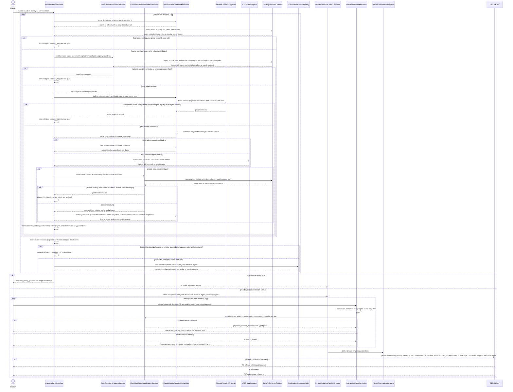
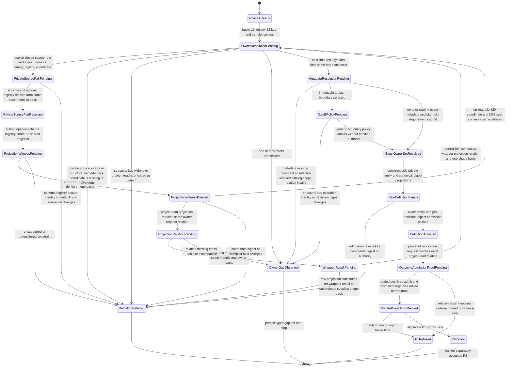

# M04 Public Operation Definition Family Behavior Design

> **T-283 authority disposition (2026-07-20):**
> `invalidated_for_5_0_implementation_by_upstream_intent_reprice`. This file is
> retained as historical and current-state evidence only. Prior acceptance
> records its former basis; it does not authorize design, code, proof, Product
> scope, or closure under the T-283 candidate. Reusable local contracts must be
> re-derived under the accepted direct-GTL replacement design after T-283
> closes.

**Status**: Accepted for P1 on its recorded superseded basis; invalidated for current 5.0 implementation

**Accepted P1 semantic candidate digest**:
`18d9bcc559d973daac355ad768b1cf5eb8ffb7f9dcd3cd6d2c60c95e5bea1801`

**Date**: 2026-07-16

**Ticket**: `T-281`

**Change class**: `design_reframe`

**Delivery boundary**: GOAL-035 P1 before T-270/T-272 runtime integration and after their neutral owner-contract milestones; P2 handler and packed parity excluded

**Ontology authority**: `ABIOGENESIS_PUBLIC_CONTROL_PLANE_ONTOLOGY.md`
version `abg.public-control-plane.ontology/9`, accepted semantic candidate
`1ca39b2b5c536be6d16eecfb30d8310e798853232ae7c03f71ac655a7f97bf40`,
current file digest
`bcbacd4a4b4dd3b5b6db2a3ad281c92bf76a7a889da38562d5b6301e85764615`

The prior design basis cited the Ontology file digest
`039c19d3b6639ebc0357b40d8f12a6e8340e55ba0f8ef2f41c1e8cab914f53f1`.
The current file differs from that basis only in the GOALS source-digest row.
The accepted semantic candidate, 27 atomic families, seven compositions, 19
public identities, and every operation behavior row are unchanged. This rebind
therefore carries no semantic delta into this design.

**Ontology acceptance**:
`.ai-workspace/comments/codex/20260716T055554Z_DECISION_t278_ontology_ratified.md`

**Method authority**:
`../../../../.genesis/docs/standards/DESIGN_MODULE_METHOD.md`

**Prime authority**: [ADR-044](./adrs/ADR-044-prime-contraction-is-a-cross-boundary-design-gate.md)

## Boundary

This design realizes the P1 definition prerequisite in `GOALS.md`. It replaces
the superseded operation contract map, metadata register, CLI roster, schema
algorithms, and publication roster with one operation-indexed
`PublicFunctionDefinition<K>` authoring family for the exact ratified 19 public
operations. It preserves `PublicInvocation<K>` and `PublicOutcome<K>` as the
common independently admitted ingress and egress carriers required by
`REQ-P-PUBLIC-CONTRACTS-010`.

The definition family owns only the public operation-to-contract binding and
projection relation. Payload request/result/refusal meaning remains with each
semantic owner:

- operation identity and version;
- closed variant domain;
- exact bindings to owner-native request, result, refusal, and non-terminal
  result schemas;
- semantic authority reference and authority/effect class;
- actor and capability requirements;
- `workspaceBindingRequirement: forbidden | exactly_one` per variant;
- defaults and closed value domains;
- request/result/refusal/invocation/outcome schema coordinates;
- SDK member and CLI command coordinates; and
- adapter exit classification.

Catalog rows, schema assets, SDK declarations, CLI grammar, and parity
inventories are deterministic projections. Semantic functions, ABG
interpreters, event writers, filesystem effects, and operation-specific
handlers retain separate owners. A definition points to semantic authority; it
does not execute that authority.

Phase A is a private mechanism checkpoint. It proves one Valibot-native
contract definition/projector, the exact common authority/invocation/outcome
packets, and a schema-only non-Consensus fixture. It exports no product
contract, calls no handler, and claims neither the 19-row family nor the hard
break.

P1 attempts to author the exact 19-operation family from Phase A native
contracts and exact owner-supplied native schemas. It first resolves every
request, result, refusal, and declared non-terminal slot. Where a schema uses
a family-owned relational check, the same owner source module also supplies
the exact immutable named-check registry; callers cannot select or add a
registry during projection. An unresolved slot or source pair is a typed build
gap and terminates that P1 pass; prose, a TypeScript interface, a legacy
admitter, a generated JSON Schema, or a caller-selected registry cannot
substitute for owner truth. Only an exact resolved set may admit the private
family and derive private, temporary candidate projections.

Frozen 4.6 code may remain only as migration evidence; it cannot be imported
by, validate, generate, or appear in any 5.0 candidate projection. No P1 build
may publish or identify itself as the 5.0 public surface. P2 atomically binds
handlers, switches package exports, catalog, schemas, SDK and CLI to the P1
family, deletes the frozen legacy roster and aliases, and proves
source/package/install absence. Only that P2 cutover earns the hard break.

### Requirements

- `REQ-P-PUBLIC-CONTRACTS-005`, `-008`, `-009`, and `-010`;
- `REQ-P-POLICY` operation-specific behavior clauses;
- `REQ-P-INSTALL-043..060` supplied-artifact, binding, create, and open law;
- `REQ-P-CATALOG-023..030` session-view, admission, and application law;
- `REQ-R-ABG3-TUNER-003..005` public transition and draft-state law;
- `PRODUCT.md` Public Operator Contract and hard-break law;
- ratified T-278 public control-plane Ontology;
- accepted T-270 `run.invoke` authority design;
- accepted T-272 F_H response and continuation design;
- accepted T-275 Consensus domain design's pure `ticket_consensus` read; and
- ADR-044 plus census rows `PC-004` and `PC-005`.

### Explicit Exclusions

- implementation or ownership of operation-specific semantic behavior;
- a metadata-driven mega-handler or general service controller;
- any semantic handler, handler binding, runtime invocation, or M03 dependency
  on an M04 public-carrier implementation;
- P2 handler binding and full packed public parity;
- a temporary public `not_implemented` or handler-missing behavior;
- a second authored contract map, ID array, CLI switch, schema roster, schema
  language, schema compiler, or catalog operation roster;
- unchecked `as unknown as`, permissive index signatures, or untyped generic
  dispatch used to erase `K`;
- a permissive optional-field mega-schema across variants;
- Consensus-specific operation identity, request, router, or handler law;
- hostile-workstation signing or tamper resistance; and
- legacy aliases, facades, defaults, fallbacks, or parallel public registers;
- Phase A product exports, handler calls, filesystem effects, publication, or
  claims that the 19-row family is complete; and
- a custom contract-constructor DSL, open-ended or operation-specific callback
  validator, schema fragment, or operation-specific validation branch.
- committed public schemas, package exports, catalog publication, SDK
  implementation, CLI switch implementation, or AF-24 publication in P1.

The supported environment is one trusted developer desktop. Proportional
defense targets likely malformed authored definitions, CLI/SDK input, and
worker/handler output. It does not add hostile in-process or filesystem
adversary machinery.

## Ontology Basis

The accepted Ontology contributes `PublicFunctionDefinition<K>`,
`PublicInvocation<K>`, `PublicOutcome<K>`, `InvocationAuthority<K>`,
`WorkspaceBinding`, `PublicContractCatalog`, the 27 atomic function families,
and the exact 19-operation projection. This design introduces no product
entity. It supplies native HOW relations and deterministic projectors for the
accepted public family.

Any change to the cited Ontology identity, accepted semantic candidate, file
digest, `REQ-P-PUBLIC-CONTRACTS-008..010`, or PRODUCT operation table makes this
design stale before implementation.

## Exact Public Definition Matrix

The variant strings below are the exact public and native discriminants.
CLI command spelling is an adapter coordinate and never rewrites those values.
Target paths, subjects, refs, and policies remain typed request fields.

| Operation identity | Closed native variant domain | Atomic/composed authority | Workspace binding | Actor | Effect class | CLI coordinate |
|---|---|---|---|---|---|---|
| `abg.operation.workspace.create` | `clean`, `imported` | `AF-01 constructWorkspace` | `forbidden` | required | workspace filesystem | `workspace create --policy <policy>` |
| `abg.operation.workspace.open` | `open` | `AF-02 openWorkspace` | `forbidden` | forbidden | read/admission | `workspace open` |
| `abg.operation.project.read` | closed `ProjectReadCase` source/projection relation below | `AF-03 project<S,K>` | per-case `forbidden` or `exactly_one` | forbidden | pure read | `project read <projection>` |
| `abg.operation.product.verify` | `verify` | `AF-04 verifyProductArtifact` | `forbidden` | forbidden | deterministic evaluation | `product verify` |
| `abg.operation.product.resolve` | `resolve` | `AF-05 resolveProductSet` | `forbidden` | forbidden | deterministic evaluation | `product resolve` |
| `abg.operation.product.install` | `install` | `AF-06 installProduct` | `forbidden` | required | immutable install filesystem | `product install` |
| `abg.operation.workspace.bind` | `bind` | `AF-07 bindWorkspace` | `forbidden` | required | binding persistence | `workspace bind` |
| `abg.operation.catalog.admit` | `admit` | `AF-08 admitCatalog` | `exactly_one` | required | catalog admission event | `catalog admit` |
| `abg.operation.catalog.view` | `allowlist` | `AF-09 deriveCatalogView` | `exactly_one` | required | deterministic narrowing | `catalog view` |
| `abg.operation.catalog.apply` | `node_type`, `overlay` | `AF-10 applyCatalogDeclaration` | `exactly_one` | required | declaration application admission | `catalog apply <kind>` |
| `abg.operation.run.invoke` | `invoke`, `start` | admitted One Surface program through `AF-11..AF-16`; T-270 owns AF-15 admission | `exactly_one` | required | ABG traversal | `run <variant>` |
| `abg.operation.run.continue` | `current_intent`, `selected_action` | T-272 `AF-17`; selected action returns through `AF-14/AF-15` | `exactly_one` | required | ABG continuation | `run continue --mode <mode>` |
| `abg.operation.interaction.respond` | `select`, `approve`, `reject`, `assess`, `answer_escalation` | `AF-18 admitHumanResponse` | `exactly_one` | required | F_H response admission event | `interaction respond <variant>` |
| `abg.operation.result.assess` | `assess` | `AF-19 admitResultAssessment` | `exactly_one` | required | result-assessment admission event | `result assess` |
| `abg.operation.witness.admit` | `reprice`, `attest`, `hygiene-stamp`, `intake`, `run-resumed`, `run-stopped` | `AF-20 admitWitnessedAct` | `exactly_one` | required | witnessed-act admission event | `witness admit <variant>` |
| `abg.operation.tuning.transition` | `propose`, `ratify`, `reject` | `AF-21 transitionTuningDraft` | `exactly_one` | required | tuning lifecycle event | `tuning transition <variant>` |
| `abg.operation.conformance.evaluate` | `gtl_program` | `AF-22 evaluateConformance` | `exactly_one` | required | deterministic evaluation/admission | `conformance evaluate gtl-program` |
| `abg.operation.product.materialize` | `context_bootstrap`, `configuration` | `AF-23 materializeProductAsset` | `exactly_one` | required | product filesystem | `product materialize <variant>` |
| `abg.operation.release.snapshot` | `published_rc`, `tapped_release` | `AF-25 materializeReleaseCut` | `exactly_one` | required | immutable release publication | `release snapshot <variant>` |

The six pre-binding atomic families named by Ontology invariant 3 are exactly
`AF-01`, `AF-02`, and `AF-04..AF-07`; their public variants forbid a binding.
The `project.read` relation closes binding cardinality per source/projection
case: workspace, catalog, runtime, interaction, continuation, assessment, and
witness cases require one binding; immutable install and release evidence cases
forbid it because their source identities carry their own admitted basis.
Every other current public variant is workspace- or execution-scoped and
requires one exact immutable binding. For `release.snapshot`, the invocation
binding must equal the binding named by the exact qualification basis; it is an
equality check, not a second release authority. Aggregate carrier syntax never
turns this sum into a freely optional binding.

`run.invoke(start)` additionally retains the closed `fh_mode` and `root_mode`
policy families from PRODUCT. They are request policy fields outside
`scope + target + until`, not operation variants or CLI-owned defaults.

## Closed Project Read Relation

`project.read` is one public identity over the closed relation below. It is not
one request with a free-form source and projection string. Every case has the
base request fields `sourceRef`, `sourceDigest`, `projectionBasisRef`, and
`projectionBasisDigest`. Replay cases additionally require explicit
`fromOrdinal` and `limit` fields. The catalog-description case requires one
canonical handle. No read case admits an event or returns a non-terminal
outcome.

| Case key | Exact source carrier | Exact result carrier | Binding | Capability refs |
|---|---|---|---|---|
| `catalog_list` | `Catalog` | `CatalogListProjection` | `exactly_one` | `abg.capability.operator.public-contract@5` |
| `catalog_describe` | `Catalog` plus canonical handle | `CatalogDescriptionProjection` | `exactly_one` | `abg.capability.operator.public-contract@5` |
| `workspace_status` | `WorkspaceBinding` | `WorkspaceStatusProjection` | `exactly_one` | `abg.capability.operator.public-contract@5` |
| `run_status` | `Run` | `RunStatusProjection` | `exactly_one` | `abg.capability.runtime.replay-continuation@5` |
| `graph_call_status` | `GraphCall` | `GraphCallStatusProjection` | `exactly_one` | `abg.capability.runtime.replay-continuation@5` |
| `run_result` | `Run` | `RunResultProjection` | `exactly_one` | `abg.capability.runtime.replay-continuation@5` |
| `graph_call_result` | `GraphCall` | `GraphCallResultProjection` | `exactly_one` | `abg.capability.runtime.replay-continuation@5` |
| `run_evidence` | `Run` | `EvidenceProjection<Run>` | `exactly_one` | `abg.capability.runtime.replay-continuation@5` |
| `graph_call_evidence` | `GraphCall` | `EvidenceProjection<GraphCall>` | `exactly_one` | `abg.capability.runtime.replay-continuation@5` |
| `result_evidence` | `RuntimeResult` | `EvidenceProjection<RuntimeResult>` | `exactly_one` | `abg.capability.runtime.replay-continuation@5` |
| `assessment_evidence` | `ResultAssessment` | `EvidenceProjection<ResultAssessment>` | `exactly_one` | `abg.capability.runtime.admit-fp-result@5` |
| `witness_evidence` | `WitnessedAct` | `EvidenceProjection<WitnessedAct>` | `exactly_one` | `abg.capability.operator.public-contract@5` |
| `install_evidence` | `InstalledProduct` plus `InstallManifest` | `EvidenceProjection<InstalledProduct>` | `forbidden` | `abg.capability.install.bind-products@5` |
| `release_evidence` | `ReleaseCut` plus `ReleaseSnapshotManifest` | `EvidenceProjection<ReleaseCut>` | `forbidden` | `abg.capability.operator.public-contract@5` |
| `workspace_replay` | `WorkspaceBinding` plus runtime event log | `ReplayProjection<WorkspaceBinding>` | `exactly_one` | `abg.capability.runtime.replay-continuation@5` |
| `run_replay` | `Run` | `ReplayProjection<Run>` | `exactly_one` | `abg.capability.runtime.replay-continuation@5` |
| `graph_call_replay` | `GraphCall` | `ReplayProjection<GraphCall>` | `exactly_one` | `abg.capability.runtime.replay-continuation@5` |
| `interaction_replay` | `FhInteraction` | `ReplayProjection<FhInteraction>` | `exactly_one` | `abg.capability.runtime.replay-continuation@5` |
| `continuation_replay` | `Continuation` | `ReplayProjection<Continuation>` | `exactly_one` | `abg.capability.runtime.replay-continuation@5` |
| `c_call_replay` | `CProgramAtomReceipt` plus C-call identity | `ReplayProjection<CProgramAtomReceipt>` | `exactly_one` | `abg.capability.runtime.replay-continuation@5` |
| `workspace_gaps` | `WorkspaceBinding` plus latest admitted gap basis | `GapProjection<WorkspaceBinding>` | `exactly_one` | `abg.capability.operator.public-contract@5` |
| `run_gaps` | `Run` | `GapProjection<Run>` | `exactly_one` | `abg.capability.runtime.replay-continuation@5` |
| `run_lawful_actions` | `Run` plus current `NextActionProjection` | `LawfulActionProjection` | `exactly_one` | `abg.capability.runtime.replay-continuation@5` |
| `observer_report` | `WorkspaceBinding` plus admitted runtime/evidence basis | `ObserverReportProjection` | `exactly_one` | `abg.capability.operator.public-contract@5` |
| `observer_drafts` | `WorkspaceBinding` plus `ObserverObservables` basis | `ObserverDraftProjection` | `exactly_one` | `abg.capability.operator.public-contract@5` |
| `tuning_report` | `WorkspaceBinding` plus tuning draft basis | `TuningReportProjection` | `exactly_one` | `abg.capability.operator.public-contract@5` |
| `ticket_consensus` | admitted `ConsensusResult` plus exact ticket, output-authority, and replay basis | `TicketConsensusProjection` | `exactly_one` | `abg.capability.operator.public-contract@5` |

`ProjectReadRequest<C>` is a discriminated union indexed by this case key.
`sourceRef`, `sourceDigest`, and any handle or cursor fields use the source and
projection types fixed by `C`. Replay uses one bounded cursor grammar:
`fromOrdinal` plus `limit`; it has no second range carrier.
`ProjectReadResult<C>` is exactly the result carrier above.
`ProjectReadRefusal<C>` is the case-indexed closed union specified below;
`cursor_invalid | range_invalid` exist only for replay cases.
`cursor_invalid` means an invalid `fromOrdinal`; `range_invalid` means an
invalid `limit`. Defaults are empty.

### Constructor-Ready Project Read Contract Family

This repair closes the owner-projection shape for the 26 projections not owned
by T-274A. It does not by itself close the 27 public result contracts. The
projections are applications of ten
Prime families: catalog list/describe, workspace status, `Status<S>`,
`Result<S>`, `Evidence<S>`, `Replay<S>`, `Gap<S>`, lawful actions,
observer report/drafts, and tuning report. Concrete schema applications stay
with their semantic owners; only native structural constructors are shared.

`ticket_consensus` remains the twenty-seventh projection. P1 consumes the exact
T-274A
`CONSENSUS_PUBLIC_CONTRACT_SOURCES.ticket_consensus_projection.schema`;
T-281 does not copy or re-export it as new owner truth. Like every other case,
the generic T-281 wrapper composes that owner projection into the final
`ProjectReadResult<C>` contract.

#### Structural Request And Refusal

The shared request/refusal family is indexed by the structural key, never a
fabricated variant:

```text
ProjectReadDefinitionKey<C> = {
  operationId: "abg.operation.project.read"
  memberKind: "project_read_case"
  caseKey: C
}

RefDigest<T> = { ref: Ref<T>, digest: Sha256Digest<T> }

ProjectReadRequest<C> = {
  kind: "project_read_request"
  caseKey: C
  source: {
    kind: literal SourceKindOf<C>
    sourceRef: Ref<SourceOf<C>>
    sourceDigest: Sha256Digest<SourceOf<C>>
  }
  projectionBasis: RefDigest<ProjectionBasisOf<C>>
  selector: ProjectReadSelector<C>
}

ProjectReadProjectionBasis<C> = {
  kind: "project_read_projection_basis"
  definitionKey: ProjectReadDefinitionKey<C>
  source: ProjectReadRequest<C>.source
  selector: ProjectReadSelector<C>
}

ProjectionBasisOf<C> = ProjectReadProjectionBasis<C>

ProjectReadResult<C> = {
  kind: "project_read_result"
  caseKey: C
  projectionBasis: RefDigest<ProjectReadProjectionBasis<C>>
  projection: ProjectReadProjectionOf<C>
}
```

`ProjectReadProjectionBasis<C>` is a subordinate deterministic seal, not a
new semantic authority. Its digest is the canonical digest of the complete
object above and its ref is
`project-read-basis:sha256:<projectionBasisDigest>`. Admission reconstructs it
from the outer structural key, the admitted request source, and the exact
case-indexed selector, then requires both the supplied ref and digest to match.
The selector therefore names every source-side basis that can affect the read;
no ambient observation, replay window, catalog view, manifest, gap basis,
action projection, observer basis, tuning basis, or Consensus basis can be
omitted. Owner projection schemas and their request-to-projection relations
retain semantic truth; central P1 alone derives the wrapped result contract.

`SourceKindOf<C>` is closed exactly as follows:

| Case group | Exact source kind |
|---|---|
| `catalog_list`, `catalog_describe` | `Catalog` |
| `workspace_status`, `workspace_replay`, `workspace_gaps`, `observer_report`, `observer_drafts`, `tuning_report` | `WorkspaceBinding` |
| `run_status`, `run_result`, `run_evidence`, `run_replay`, `run_gaps`, `run_lawful_actions` | `Run` |
| `graph_call_status`, `graph_call_result`, `graph_call_evidence`, `graph_call_replay` | `GraphCall` |
| `result_evidence`, `assessment_evidence`, `witness_evidence` | `RuntimeResult`, `ResultAssessment`, `WitnessedAct` respectively |
| `install_evidence`, `release_evidence` | `InstalledProduct`, `ReleaseCut` respectively |
| `interaction_replay`, `continuation_replay`, `c_call_replay` | `FhInteraction`, `Continuation`, `CProgramAtomReceipt` respectively |
| `ticket_consensus` | `ConsensusResult` |

`ProjectReadSelector<C>` is a closed conditional sum:

| Case | Exact selector fields |
|---|---|
| `catalog_list` | `{ visibilityBasis: workspace_catalog or { kind: "session_view", view: RefDigest<CatalogView> } }` |
| `catalog_describe` | catalog-list payload plus `canonicalHandle: CanonicalCatalogHandle` |
| `install_evidence` | `{ installManifest: RefDigest<InstallManifest> }` |
| `release_evidence` | `{ releaseSnapshotManifest: RefDigest<ReleaseSnapshotManifest> }` |
| `workspace_replay` | `{ runtimeEventLog: RefDigest<RuntimeEventLog>, fromOrdinal: SafeNonNegativeInteger, limit: SafePositiveInteger }` |
| `run_replay`, `graph_call_replay`, `interaction_replay`, `continuation_replay` | `{ fromOrdinal: SafeNonNegativeInteger, limit: SafePositiveInteger }` |
| `c_call_replay` | replay fields plus `cCall: RefDigest<CCall>` |
| `workspace_gaps` | `{ gapBasis: RefDigest<AdmittedGapBasis> }` |
| `run_lawful_actions` | `{ nextActionProjection: RefDigest<NextActionProjection> }` |
| `observer_report` | `{ observationBasis: RefDigest<ObserverObservables>, sourceProjectionRefs: NonEmptyUnique<Ref> }` |
| `observer_drafts` | `{ observerObservables: RefDigest<ObserverObservables> }` |
| `tuning_report` | `{ tuningTelemetryBasis: RefDigest<TuningTelemetryBasis> }` |
| `ticket_consensus` | `{ ticket: RefDigest<Ticket>, outputAuthority: RefDigest<ConsensusOutputAuthority>, replayBasis: RefDigest<ConsensusReplayBasis> }` |
| all other cases | strict empty object `{}` |

Replay has one bounded HOW grammar: `fromOrdinal + limit`. There is no range
object. `cursor_invalid` names an invalid `fromOrdinal`; `range_invalid` names
an invalid `limit`.

```text
ProjectReadRefusal<C> = {
  kind: "project_read_refusal"
  caseKey: C
  source: ProjectReadRequest<C>.source
  projectionBasis: RefDigest<ProjectionBasisOf<C>>
  code: ProjectReadRefusalReason<C>
  residualRefs: NonEmptyUnique<Ref>
  evidenceRefs: Unique<Ref>
  provenanceRefs: Unique<Ref>
}

ProjectReadRefusalReason<C> =
  unknown_source | source_kind_mismatch | source_digest_mismatch |
  projection_basis_mismatch | projection_unsupported | not_found | not_ready
  | (C == catalog_list
      ? incompatible | unbound | inadmissible
      : never)
  | (C == catalog_describe
      ? unknown_handle | ambiguous_handle | hidden_by_view |
        incompatible | unbound | inadmissible
      : never)
  | (C is ReplayCase ? cursor_invalid | range_invalid : never)
```

`hidden_by_view` reports an admitted handle outside the effective view;
`unknown_handle` reports no admitted canonical identity. Binding refusals
remain definition-derived admission truth outside this semantic wrapper.
Public invocation admission requires `request.caseKey == K.caseKey`; outcome
admission requires `result.caseKey == K.caseKey` or
`refusal.caseKey == K.caseKey`, and the outcome basis must equal the admitted
request basis. `PublicInvocation<K>` and `PublicOutcome<K>` remain the sole
carriers of the complete structural `DefinitionKey`; request, result, and
refusal payloads contain no second operation key.

#### Ten Prime Result Graphs

All objects are strict and readonly. Every ref/digest pair is relationally
admitted, identity arrays reject duplicates, and each projection digest seals
the complete canonical value.

| Family | Exact closed field graph |
|---|---|
| catalog list/describe | both cases carry `kind`, projection/catalog/binding coordinates and the closed workspace-catalog-or-session-view basis. List carries unique rows keyed by canonical handle; each row has kind, owning product/version, readiness, eligibility, callability, visibility, compatibility, and provenance. Describe carries one canonical handle, kind, owning product/version, owning artifact coordinate, exact contract-or-schema declaration, unique dependency rows with resolved/unresolved/incompatible disposition, readiness blockers, readiness, eligibility, callability, visible session disposition, compatible disposition, and provenance |
| workspace status | projection/workspace/workspace-authority/binding coordinates, authority mode, `ready | stale | malformed | incompatible`, non-empty bound-product refs, matching configuration coordinates, nullable catalog coordinate, residuals, provenance |
| `Status<S>` | exact `S = Run | GraphCall` coordinate, projection coordinate, `pending | running | held | gap_stop | completed | blocked | runtime_failed`, terminal-or-not-terminal sum, absent-or-present pending interaction, result/gap/evidence/replay refs, and exact program/binding/execution-basis substrate |
| `Result<S>` | exact subject plus admitted result rows carrying result and declared-contract coordinates, the existing exact `RuntimePublicResultProjection["disposition"]` vocabulary (`converged | stopped | yielded | blocked | human_gate_required`), closure eligibility, residuals, absent-or-present payload/artifact/assessment, evidence, provenance, replay; `Result<Run>` has a non-empty unique `results[]`, while `Result<GraphCall>` has one exact `result` |
| `Evidence<S>` | exact `S = Run | GraphCall | RuntimeResult | ResultAssessment | WitnessedAct | InstalledProduct | ReleaseCut`; projection and subject coordinates plus unique evidence rows carrying an existing evidence-contract coordinate and admitted value, exact same subject, content-or-artifact sum, producer, basis, provenance, and replay |
| `Replay<S>` | exact `S = WorkspaceBinding | Run | GraphCall | FhInteraction | Continuation | CProgramAtomReceipt`; projection/subject/basis coordinates, `fromOrdinal`, `limit`, returned-through and next ordinals, and strictly ordered unique rows admitted by the exact `CanonicalRuntimeEvent` schema, carrying ordinal, event ref/digest, source refs, and the admitted event value |
| `Gap<S>` | exact `S = WorkspaceBinding | Run`; projection/subject/replay-basis coordinates and unique rows carrying `stop | hold | gap | missing_capability | unresolved_observation | pending_human_interaction`, absent-or-present implicated asset and GraphFunction, non-empty reasons, required capabilities, absent-or-present interaction, evidence, and replay |
| lawful actions | projection/run/frontier/accepted-`NextActionProjection`/replay-basis coordinates and unique action rows carrying kind, exact public-target-or-pending-interaction sum, eligible-with-empty-blockers or blocked-with-non-empty-blockers, none-or-contract-bound required input, capabilities, and provenance |
| observer report/drafts | report carries workspace binding, `ObserverObservables` basis, source event/projection refs, finding-contract coordinates plus values admitted by those contracts, evidence, provenance; drafts carry workspace binding, the same observables coordinate, exact `ObserverTicketDraft` rows, evidence, provenance |
| tuning report | workspace binding and tuning-telemetry basis, exact `TunerDraftStateRow`, `TunerModeSignalRow`, `ConfigurationCostRow`, and `TunerDivergenceObligation` arrays, evidence, provenance |

The family-specific closure details are:

- catalog list row domains are
  `graph_function | node_type | overlay`, `ready | not_ready`,
  `eligible | ineligible`, `callable | non_callable`,
  `visible | hidden`, and `compatible | incompatible | unresolved`;
- a successful catalog description is necessarily visible and compatible;
  every other truth uses its typed refusal rather than absence;
- `WorkspaceStatusProjection` is a distinct schema over an admitted binding.
  It cannot alias `workspace.open(open)`, whose result may be unbound;
- a run may own several admitted GraphCall results; a GraphCall resolves to one
  exact result. Missing results refuse `not_ready | not_found`;
- replay never admits a broad `{ kind: "subordinate", subjectId }` source.
  Events start at or after `fromOrdinal`, have length at most `limit`, and
  strictly increase by admission ordinal. Returned-through is null exactly for
  an empty page; a present next ordinal is greater than the returned ordinal;
- `Gap<S>` only renders admitted gap truth. Lawful actions only render the
  accepted `NextActionProjection`. Neither invokes `evalGap`, invokes
  `evaluateNext`, ranks, selects, admits, or executes an action;
- observer drafts are `ObserverObservables -> ObserverTicketDraft`. They do not
  consume tuner drafts or a tuning basis; and
- tuning report alone consumes tuning telemetry and draft-state truth. Neither
  observer nor tuner reads admit an event or change draft lifecycle.

No result family invents an `EvidenceKind`, `ObserverFindingKind`, event-kind,
or other open vocabulary. Evidence and observer payloads bind existing exact
contract coordinates; replay admits the existing closed
`CanonicalRuntimeEvent` schema; action, gap, catalog, observer-draft, and tuner
values use their named owner vocabularies above.

#### Structural Owner Constructor And Placement

The neutral owner-source helper is Prime-generalized once:

```text
ownerNativeDefinitionContractSource<K, Slot, S>({
  owner
  definitionKey: K
  slot
  semanticOwnerBasis
  modulePath
  exportName
  memberPath
  namedChecks:
    | { kind: "none" }
    | {
        kind: "family_registry"
        exportName
        memberPath
      }
  schema: S
})
```

Every source explicitly selects `none | family_registry`. The registry
coordinate has no module path, so it inherits the schema's exact
`semantic_build` module bytes and source basis. Raw registries, callbacks, and
operation-to-registry maps are not constructor inputs.

Both native constructor signatures enforce the hard break in their TypeScript
inputs, not only at runtime. For the general constructor,
`K extends { operationId: "abg.operation.project.read", memberKind: "variant" }`
reduces the input to `never`. For the variant adapter,
`OperationId extends "abg.operation.project.read"` reduces the input to
`never`. A compile fixture for the forbidden legacy-adapter call is marked
`@ts-expect-error`; untyped JavaScript and cast callers remain covered by the
same runtime refusal. This conditional constraint needs no M04 import and
duplicates no case roster.

Its authority subject and derived identity retain structural `K`. The existing
variant helper becomes a derived adapter that supplies a variant-shaped `K`;
project-read supplies `ProjectReadDefinitionKey<C>`. Neither path passes
`variant: caseKey`, adds a variant field, accepts the broad key schema, or
creates a flattened selector. The exact literal schema from
`definitionKeySchemaFor` is mandatory.

The T-281-owned request/refusal applications live at
`code/src/app/m04/public_contracts/project_read_operation_contracts.js`,
export `PROJECT_READ_OPERATION_NATIVE_CONTRACT_SOURCES`, member paths
`[caseKey, request|refusal, schema]`. Their semantic basis is
`REQ-R-ABG3-PROJECTION-023` at
`sha256:ea67216190dc59dd14eac9797ab544ee79d9798673a82925d2d8bcddb2a2dfb5`.
Explicit absent non-terminal truth stays in the definition family.

| Prime result family | Semantic-owner basis | Concrete module / export / member |
|---|---|---|
| catalog list/describe | `REQ-P-CATALOG-019..022`, `sha256:af273d059574c4e8e19a9599005956683372db88ba0d8e57d5c5b14a58ff3c84` | `abg/m03/contracts/catalog_operation_contracts.js` / `CATALOG_OPERATION_NATIVE_CONTRACT_SOURCES` / `[project_read, caseKey, result, schema]` |
| workspace status | `REQ-R-ABG3-PROJECTION-023`, PROJECTION digest above | `app/m04/workspace/operation_contracts.js` / `WORKSPACE_NATIVE_CONTRACT_SOURCES` / `[project_read, workspace_status, result, schema]`, never `workspace_open` |
| `Status<S>`, `Result<S>` | `REQ-P-POLICY-026`, `-027`, `sha256:89cf57e14f74cd4ea433c277f88d89a5972e49b421801878d44b7481801c022f` | `abg/m03/contracts/runtime_projection_operation_contracts.js` / `RUNTIME_PROJECTION_NATIVE_CONTRACT_SOURCES` / `[project_read, caseKey, result, schema]` |
| `Evidence<S>` | `REQ-P-POLICY-055`, POLICY digest above | run/GraphCall/result in runtime-projection module; assessment in `app/m04/result_assessment/operation_contracts.js` / `RESULT_ASSESSMENT_NATIVE_CONTRACT_SOURCES`; witness in `abg/m03/contracts/runtime_authoring_operation_contracts.js` / `RUNTIME_AUTHORING_OPERATION_NATIVE_CONTRACT_SOURCES`; install in `app/m04/product_intake/operation_contracts.js` / `PRODUCT_INTAKE_NATIVE_CONTRACT_SOURCES`; release in `qualification/m05/exact_candidate_release_operation_contracts.js` / `RELEASE_OPERATION_NATIVE_CONTRACT_SOURCES`; all use `[project_read, caseKey, result, schema]` |
| `Replay<S>` | `REQ-P-POLICY-028`, POLICY digest above | runtime-projection module/export / `[project_read, caseKey, result, schema]` |
| `Gap<S>` | `REQ-P-POLICY-029`, POLICY digest above | `app/m04/gaps/operation_contracts.js` / `GAPS_PROJECT_READ_NATIVE_CONTRACT_SOURCES` / `[project_read, caseKey, result, schema]` |
| lawful actions | `REQ-P-POLICY-030`, POLICY digest above | `abg/m03/contracts/one_surface_operation_contracts.js` / `ONE_SURFACE_NATIVE_CONTRACT_SOURCES` / `[project_read, run_lawful_actions, result, schema]` |
| observer report/drafts | `REQ-P-POLICY-036`, POLICY digest above | `abg/m03/contracts/observer_operation_contracts.js` / `OBSERVER_PROJECT_READ_NATIVE_CONTRACT_SOURCES` / `[project_read, caseKey, result, schema]` |
| tuning report | `REQ-R-ABG3-TUNER-002..003`, `sha256:8c3fb81bcdc831f7f4b1c5dc7b640e9bc9a18c64a57bb54df80c23a0ee0a5c0f` | `abg/m03/contracts/tuner_operation_contracts.js` / `TUNER_PROJECT_READ_NATIVE_CONTRACT_SOURCES` / `[project_read, tuning_report, result, schema]` |

The unchanged T-274A locator is
`abg/m03/contracts/consensus_contract_family.js` /
`CONSENSUS_PUBLIC_CONTRACT_SOURCES` /
`[ticket_consensus_projection, schema]`, under
`REQ-P-CONSENSUS-004/-008A/-012` at
`sha256:d6e92b75cd52fb9f2063d0a6ff99d36a7617a52c997ff165236cb2571c9fd36d`.
It selects `family_registry` with export
`CONSENSUS_NATIVE_CHECK_REGISTRY` and an empty member path. T-281 creates no
Consensus check, registry, branch, or replacement result schema.

Shared static Valibot functions may factor the displayed structures but accept
only exact literal subject kinds and return actual strict schemas. Concrete
owner modules instantiate and locate them. No shared constructor accepts
arbitrary fields, callbacks, schema fragments, operation IDs, or
runtime-selected subject kinds. P1 remains schema-only: no event, handler,
runtime dispatch, or public/package output is added.

#### Neutral Request-To-Projection Relation

A result schema cannot prove that its projection derives from the admitted
request. Schema-local named checks receive only the parsed value. One neutral
shared-validation carrier closes that cross-value relation:

```text
OwnerProjectionRelationSource<K, Req, Projection> = {
  relationIdentity, semanticOwnerBasis: { ref, digest },
  sourceLocator: { sourceRoot: "semantic_build", modulePath, exportName, memberPath },
  relation: typed action over {
    definitionKey: K,
    admittedRequest: Req,
    candidateProjection: Projection
  } returning
    | { kind: "projection_related" }
    | { kind: "projection_relation_mismatch",
        issuePaths: NonEmptyUnique<JsonPath> }
}

OwnerProjectionRelationWitnessProjection<K> = {
  relationIdentity,
  definitionKey: K,
  semanticOwnerBasisRef,
  semanticOwnerBasisDigest,
  sourceLocator: {
    sourceRoot: "semantic_build",
    modulePath,
    exportName,
    memberPath
  },
  sourceModuleDigest,
  relationMemberIdentity
}

OwnerProjectionRelationWitness<K> =
  OwnerProjectionRelationWitnessProjection<K> & {
    relationWitnessDigest:
      stableSha256Digest(OwnerProjectionRelationWitnessProjection<K>)
  }

ResolvedOwnerProjectionRelation<K, Req, Projection> =
  opaque fixed-root carrier preserving K, Req, Projection, owner basis,
  module digest, relation member identity, the executable typed relation, and
  OwnerProjectionRelationWitness<K>
```

The resolver requires the relation and projection schema to share owner module
and semantic basis. Ten Prime owner constructors supply the relations; T-274A
supplies its exact application. T-281 receives only the opaque carrier and adds
the wrapper/basis seal. Caller callbacks, 27 M04 predicates, path heuristics,
runtime reads, events, and projection construction are forbidden.
The shared carrier is structurally generic in `K`, `Req`, and `Projection`; it
does not import or name M04 `project.read` keys or requests. The M04 P1 join
alone instantiates `K = ProjectReadDefinitionKey<C>` and adapts its already
admitted `ProjectReadRequest<C>`. Semantic-owner modules therefore supply their
own typed values without depending on `app/m04/public_contracts/*`.
`relationMemberIdentity` is the exact owner-member identity resolved through
the displayed locator; it is not inferred from function text. The canonical
witness projection includes the relation identity, structural `K`, semantic
owner basis, source module/export/member coordinate, source-module digest, and
relation-member identity. It omits its own digest. Function source text,
function serialization, object identity, and the executable function value are
never hashed. The executable relation remains private state on the opaque
carrier so later indexed outcome admission can apply the witnessed law rather
than trusting a digest as executable proof.
This trusted-desktop check targets likely malformed projection output; it adds
no signing, sandbox, or hostile in-process tamper defense.

## Accepted Operation Contract Target Packet

The following packet states the accepted target semantics used for
constructability review. It does not close P1 constructor readiness. A named
type or braced prose shape becomes a P1 input only when its semantic owner
supplies an exact admitted native schema coordinate and digest. Braced shapes
describe closed objects: extra fields refuse. `NonEmpty<T>` and `Unique<T>`
are explicit array cardinality constraints, and every `Ref<T>` paired with
`Digest<T>` is verified before effect.

Every operation also derives `AdmissionRefusalFor<K>` from its definition. The
base codes are `unknown_definition`, `unknown_variant`, `invalid_request`,
`contract_catalog_mismatch`, and `authority_mismatch`. Actor, capability,
catalog-view, and binding codes exist only when that definition requires those
inputs. The binding codes are exactly `binding_missing`, `binding_forbidden`,
and `binding_mismatch`. The semantic refusal column below is unioned with that
derived admission refusal; no operation receives an irrelevant optional field
to make a refusal possible.

| Operation and variant | Closed request fields | Exact result | Semantic refusal codes | Non-terminal and defaults |
|---|---|---|---|---|
| `workspace.create(clean)` | `targetRoot: AbsolutePath`, `createPolicy: clean`, explicit scaffold policy | workspace identity, authority mode, explicit scaffold state or bootstrap eligibility, creation manifest, provenance refs | `invalid_target`, `workspace_exists`, `workspace_identity_conflict`, `scaffold_policy_invalid`, `filesystem_failure` | none; no defaults |
| `workspace.create(imported)` | `targetRoot: AbsolutePath`, `createPolicy: imported`, `importAuthorityRef`, `importAuthorityDigest`, explicit preservation policy | workspace identity, imported authority mode, preserved-project/scaffold state, creation manifest citing imported authority, provenance refs | clean refusals plus `import_authority_invalid`, `import_preservation_failed` | none; no defaults |
| `workspace.open(open)` | `targetRoot`, expected workspace-authority ref/digest | closed `WorkspaceOpenProjection` below: workspace identity, exact authority basis, authority mode, explicit current selected-binding/configuration refs, and `ready`, `unbound`, `stale`, `malformed`, or `incompatible` readiness with residuals | `invalid_target`, `workspace_missing`, `authority_basis_mismatch` | none; no defaults |
| `product.verify(verify)` | artifact ref/digest and content identity, descriptor ref/digest, contribution-manifest ref/digest, resolved-lock ref/digest, expected contract refs | verified artifact and every checked identity, verification disposition exactly `verified` or `installed_unbound`, typed residuals, provenance | `artifact_invalid`, `content_mismatch`, `identity_mismatch`, `descriptor_mismatch`, `contribution_mismatch`, `lock_mismatch`, `unresolved_dependency`, `incompatible_dependency`, `unsupported_contract`, `installed_state_missing`, `installed_state_stale` | none; no defaults |
| `product.resolve(resolve)` | `requirements: NonEmpty<Unique<ProductRequirement>>`, `candidates: NonEmpty<Unique<ProductCoordinate>>` | exact resolved lock, one selected coordinate per unique required product identity, selected dependency graph, typed residuals, provenance | `invalid_requirement`, `unresolved`, `incompatible`, `ambiguous`, `cyclic` | none; no defaults |
| `product.install(install)` | verified-artifact ref/digest and content identity, product-descriptor ref/digest, contribution-manifest ref/digest, resolved-lock ref/digest, `targetRoot`, closed install policy | verification disposition exactly `verified`, materialization disposition exactly `materialized` or `idempotent`, installed-product ref/digest, install-manifest ref/digest, installer-manifest ref/digest, selected dependency graph, provenance | `verification_failed`, `invalid_target`, `identity_conflict`, `content_conflict`, `descriptor_conflict`, `contribution_conflict`, `lock_conflict`, `unsupported_contract`, `filesystem_failure` | none; no defaults |
| `workspace.bind(bind)` | workspace-authority ref/digest, `installedSet: NonEmpty<Unique<InstalledProductRef>>`, resolved-lock ref/digest, `declaredRoots: NonEmpty<Unique<AbsolutePath>>` | immutable workspace-binding ref/digest and manifest containing the exact ordered bound-product rows, resolved dependency graph, selected toolchain/product/package roots, declared mutable roots, contract refs, and provenance | `workspace_not_ready`, `product_not_installed`, `unresolved`, `ambiguous`, `lock_mismatch`, `content_mismatch`, `root_invalid`, `binding_conflict`, `incompatible` | none; no defaults |
| `catalog.admit(admit)` | workspace-binding ref/digest, `descriptors: NonEmpty<Unique<ProductDescriptorCoordinate>>`, `contributions: NonEmpty<Unique<ContributionManifestCoordinate>>`, resolved-lock ref/digest; every coordinate carries its ref and digest | catalog ref/digest and the structurally disjoint six-way `CatalogAdmissionRow` algebra below, admitted only under `CatalogAdmissionConservation` | `descriptor_invalid`, `contribution_invalid`, `conflict`, `incompatible`, `unready`, `unresolved` | none; no defaults |
| `catalog.view(allowlist)` | admitted catalog ref/digest, `allowlist: Unique<CanonicalCatalogHandle>` | narrowing catalog-view ref/digest, effective handles, residuals | `unknown`, `duplicate`, `ambiguous`, `unauthorized`, `inadmissible`, `not_ready` | none; no defaults |
| `catalog.apply(K)` for `K = node_type, overlay` | admitted catalog-row ref/digest of kind K, catalog-view ref/digest, declaration ref/digest, target ref/digest, application-basis ref/digest | declaration-application ref, kind, target ref/digest, admitted evidence refs, provenance | `kind_mismatch`, `outside_view`, `not_ready`, `target_invalid`, `application_refused`, `callable_kind_forbidden` | none; no defaults |
| `run.invoke(invoke)` | program ref/digest, GraphFunction ref/digest, declared input-contract ref/digest, admitted input, catalog-view ref/digest, declared `allowlist: Unique<CanonicalCatalogHandle>` | run ref, GraphCall ref, completed result or typed stop, evidence refs, replay ref | `program_invalid`, `function_nonmember`, `outside_view`, `noncallable`, `next_action_mismatch`, `intent_missing`, `input_invalid`, `capability_missing`, `runtime_failed` | `held`, `gap_stop`; no defaults |
| `run.invoke(start)` | program ref/digest, `scope`, closed target, `until`, catalog-view ref/digest, declared `allowlist: Unique<CanonicalCatalogHandle>`, `fh_mode`, `root_mode` | run ref, present nullable GraphCall ref, completed result or typed stop, evidence refs, replay ref | invoke refusals plus `target_invalid`, `mode_invalid`, `until_invalid` | `held`, `gap_stop`; defaults `fh_mode=direct`, `root_mode=supervised` |
| `run.continue(current_intent)` | run ref, continuation ref/digest, current-intent ref/digest, admitted response-or-input ref/digest, expected execution-basis ref/digest | continued run state, successor receipt, evidence refs, replay ref | `continuation_missing`, `continuation_resolved`, `intent_mismatch`, `response_missing`, `stale_replay`, `basis_fork_detected`, `runtime_failed` | `held`, `gap_stop`; no defaults |
| `run.continue(selected_action)` | run ref, continuation ref/digest, next-action projection ref/digest, closed `basis_relation` defined below; selected action remains projection-owned and is never caller-authored | new construction-intent ref then run/GraphCall state, evidence refs, replay ref | `next_action_stale`, `action_mismatch`, `intent_admission_refused`, `covering_reprice_missing`, `basis_fork_detected`, `runtime_failed` | `held`, `gap_stop`; no defaults |
| `interaction.respond(K)` for five response kinds | interaction ref/digest, response-contract ref/digest, `choiceRef` required only for `select` and exactly null otherwise, canonical typed `value` for every kind, evidence refs, capability-provenance refs | responded-event ref and current interaction projection | `interaction_missing`, `interaction_resolved`, `response_kind_forbidden`, `response_contract_mismatch`, `choice_invalid`, `value_invalid`, `actor_capability_missing`, `basis_mismatch` | `responded` while run remains held; no defaults |
| `result.assess(assess)` | expected runtime-result ref/digest, assessment-contract ref/digest, typed assessment, actor ref, capability-provenance refs, evidence refs, current execution-basis ref/digest | assessment ref plus structurally disjoint `admitted` or `rejected` disposition, closure eligibility, typed residuals, evidence refs | `result_missing`, `result_digest_mismatch`, `assessment_contract_mismatch`, `assessment_invalid`, `actor_capability_missing`, `evidence_invalid`, `basis_mismatch` | `retry`, `blocked` are typed non-close outcomes; no defaults |
| `witness.admit(K)` for six witnessed acts | actor ref, subject ref/digest, act kind K, closed typed reason-or-payload, the act-applicable run/segment/workspace/basis context, evidence refs, provenance refs | actor-attributed witnessed-act event ref and admitted evidence ref | `actor_missing`, `subject_missing`, `act_forbidden`, `content_invalid`, `context_mismatch`, `evidence_invalid`, `provenance_invalid`, `basis_mismatch` | none; no defaults |
| `tuning.transition(propose)` | draft-content contract ref/digest, typed draft content including proposer, telemetry-basis refs, affected-declaration refs and before/after digests, closed actor-or-policy authority, subject-basis ref/digest, typed rationale contract/value, evidence refs | proposed tuning-draft ref/version preserving those fields, `proposed` disposition, attributed event ref | `draft_invalid`, `authority_invalid`, `subject_mismatch`, `rationale_invalid`, `evidence_invalid`, `basis_mismatch` | none; no defaults |
| `tuning.transition(K)` for `K = ratify, reject` | current tuning-draft ref/version/digest, closed actor-or-policy authority, current draft-basis ref/digest, typed rationale contract/value, decision evidence refs | transitioned draft projection preserving proposer, telemetry basis, affected declarations and before/after digests, with exactly the K-indexed `ratified` or `rejected` disposition, decision authority, and attributed event ref | `draft_missing`, `draft_stale`, `authority_invalid`, `transition_forbidden`, `rationale_invalid`, `evidence_invalid`, `basis_mismatch` | none; no defaults |
| `conformance.evaluate(gtl_program)` | GTL program ref/digest, conformance-law ref/digest, closed `inventory_basis` defined below | program and optional declared-inventory identity, conformance-assessment ref/digest, passed/failed disposition, stable diagnostics, violated law/contract refs, evidence refs, repair affordances | `program_invalid`, `law_basis_mismatch`, `inventory_mismatch`, `assessment_blocked` | none; no defaults |
| `product.materialize(context_bootstrap)` | admitted target-workspace ref/digest, selected binding ref/digest, declared context inputs | content-addressed bootstrap asset ref/digest and manifest ref/digest with exact `created`, `refreshed`, `preserved`, or `refused` rows, typed residuals, provenance | `workspace_not_ready`, `binding_mismatch`, `input_invalid`, `authority_overwrite_forbidden`, `filesystem_failure` | none; no defaults |
| `product.materialize(configuration)` | admitted configuration-contract ref/digest, selected binding ref/digest, declared typed inputs | affected workspace/configuration subject, configuration-content ref/digest, materialization-manifest ref/digest, validation disposition, typed residuals, provenance | `contract_invalid`, `binding_mismatch`, `input_invalid`, `mutable_default_forbidden`, `filesystem_failure` | none; no defaults |
| `release.snapshot(published_rc)` | pre-RC qualification-basis ref/digest, matching law-basis ref/digest, same-basis verdict ref/digest, requested RC identity/version | immutable RC cut, exact artifact refs/digests, snapshot manifest, qualification disposition, residuals, provenance | `wrong_subject_kind`, `basis_mismatch`, `law_basis_mismatch`, `verdict_not_green`, `bypass_nonempty`, `identity_mismatch`, `bytes_mismatch`, `publication_failure` | none; no defaults |
| `release.snapshot(tapped_release)` | final-tap basis, matching law basis and verdict, requested final identity, accepted-RC ref/digest, installed-RC qualification refs/digests, complete FinalTapDelta ref/digest | immutable final cut, artifacts, snapshot manifest, qualification disposition, residuals, provenance | published-RC refusals plus `accepted_rc_mismatch`, `installed_rc_authorization_missing`, `final_delta_incomplete`, `affected_gate_failed` | none; no defaults |

Grouped rows above share one packet only where their exact field structure is
identical. Their discriminant still changes the indexed contract key. In
particular, `ResponsePayloadByKind<K>` is closed as follows:

| Response kind | `choiceRef` | `value` |
|---|---|---|
| `select` | required exact member of the pending interaction's declared choice set | required canonical JSON admitted by the selected response contract |
| `approve`, `reject`, `assess`, `answer_escalation` | exactly null; a non-select response cannot carry a choice | required canonical JSON admitted by the selected response contract |

All five response packets also require the same interaction ref/digest,
response-contract ref/digest, evidence refs, and capability-provenance refs.
No response kind can make the value optional, substitute a free-form string,
or select a choice absent from the opened interaction. The two
`catalog.apply` variants, six `witness.admit` variants, and the
`tuning.transition(ratify|reject)` pair share their displayed closed field
families; their discriminants select distinct result dispositions and prevent
a ratify request from producing a rejected result or the converse.

The catalog result is not one row with nullable reason/event fields. Its owner
schema supplies this exact closed algebra, and every row carries the evidence
that justified its disposition:

```text
CatalogAdmissionRow =
  | { disposition: "admitted", inputRowKey: CatalogInputRowKey,
      subjectRef, subjectDigest,
      admissionEventRef, evidenceRefs: NonEmptyUnique<Ref> }
  | { disposition: "rejected", inputRowKey: CatalogInputRowKey,
      subjectRef, subjectDigest,
      reason: CatalogRejectedReason, evidenceRefs: NonEmptyUnique<Ref> }
  | { disposition: "incompatible", inputRowKey: CatalogInputRowKey,
      subjectRef, subjectDigest,
      reason: CatalogIncompatibleReason, evidenceRefs: NonEmptyUnique<Ref> }
  | { disposition: "conflicting", inputRowKey: CatalogInputRowKey,
      subjectRef, subjectDigest,
      reason: CatalogConflictReason, evidenceRefs: NonEmptyUnique<Ref> }
  | { disposition: "unready", inputRowKey: CatalogInputRowKey,
      subjectRef, subjectDigest,
      reason: CatalogUnreadyReason, evidenceRefs: NonEmptyUnique<Ref> }
  | { disposition: "unresolved", inputRowKey: CatalogInputRowKey,
      subjectRef, subjectDigest,
      reason: CatalogUnresolvedReason, evidenceRefs: NonEmptyUnique<Ref> }

CatalogInputRowKey = {
  descriptorRef, descriptorDigest,
  contributionManifestRef, contributionManifestDigest,
  contributionRowRef, contributionRowDigest
}

CatalogAdmissionConservation = {
  relationRef:
    "relation://abg/catalog/admission-input-output-conservation@5"
  evaluate(request, result):
    let input = exact unique CatalogInputRowKey set obtained from every row of
      every supplied contribution manifest after descriptor, binding, and lock
      agreement is verified
    let output = result.rows.map(row => row.inputRowKey)
    require output.length == input.length
    require Unique(output)
    require Set(output) == Set(input)
}
```

The `admitted` member has no reason field. The five non-admitted members have no
admission-event field and require their disposition-indexed typed reason. A
single optional `reason` or `admissionEventRef`, an empty evidence set, or a
generic non-admitted member is structurally inadmissible.
`CatalogAdmissionConservation` is one catalog-family-owned named relation,
registered with the shared native projector. It rejects a missing, extra,
duplicated, substituted, or cross-descriptor output row. Exactly one of the six
disposition members therefore exists for every exact submitted manifest row;
the catalog owner cannot report two dispositions for one input or silently
drop a rejected row.

`result.assess` follows the same no-contradiction rule. `admitted` and
`rejected` are the two admitted result-slot members. `blocked` and `retry` are
the two non-terminal-slot members and require `closureEligible: false` and
non-empty typed residuals; `retry` is the requirement's retry-eligible
non-close truth. The closed `PublicOutcome` union therefore distinguishes all
four without putting one disposition in two slots. Each member retains the
exact expected result, actor/capability, contract, evidence, and current-basis
relation from its request. Rejected assessment truth cannot be reported as
admitted, and prose without its declared assessment contract never enters this
algebra.

Witness content and context are closed owner-indexed sums. Content is exactly
one typed reason or one contract-bound typed payload; context is exactly the
run, segment-with-run, workspace, or basis coordinate applicable to act kind
K. No optional bag can erase actor, subject, context, evidence, or provenance.
Tuning authority is likewise exactly one actor-with-capability provenance or
one admitted policy-authority ref/digest. Its rationale is contract-bound and
its subject or current-draft basis is mandatory for every transition.

The remaining conditional inputs are closed discriminated objects, not absent
fields:

```text
WorkspaceOpenProjection =
  | { readiness: "ready", workspaceRef, workspaceAuthorityBasisRef,
      workspaceAuthorityBasisDigest, authorityMode,
      selectedBindingRef, selectedBindingDigest,
      configurationRefs: Unique<Ref>,
      configurationDigests: MatchingDigests<Ref>, residuals: [] }
  | { readiness: "unbound", workspaceRef, workspaceAuthorityBasisRef,
      workspaceAuthorityBasisDigest, authorityMode,
      selectedBindingRef: null, selectedBindingDigest: null,
      configurationRefs: Unique<Ref>,
      configurationDigests: MatchingDigests<Ref>, residuals }
  | { readiness: "stale" | "malformed" | "incompatible",
      workspaceRef, workspaceAuthorityBasisRef,
      workspaceAuthorityBasisDigest, authorityMode,
      observedBindingRef: Ref | null, observedBindingDigest: Digest | null,
      configurationRefs: Unique<Ref>,
      configurationDigests: MatchingDigests<Ref>,
      residuals: NonEmptyUnique<TypedResidual> }

ResolvedProductSelection = {
  productIdentity,
  selectedCoordinate,
  satisfiedRequirementRefs: NonEmptyUnique<Ref>
}

basis_relation =
  { kind: "same_basis" }
  | { kind: "authority_changed",
      coveringRepriceRef: Ref<CoveringReprice>,
      coveringRepriceDigest: Digest<CoveringReprice> }

inventory_basis =
  { kind: "program_only" }
  | { kind: "declared_inventory",
      inventoryRefs: NonEmpty<Unique<InventoryRef>>,
      inventoryDigests: MatchingDigests<InventoryRef> }
```

`WorkspaceOpenProjection` reports current workspace truth but selects or
changes none of it. Its paired ref/digest nullability is relational: both are
present or both are null. `product.resolve` requires exactly one
`ResolvedProductSelection` for each unique required product identity and no
selection for an unrequired identity. Candidate coordinates remain unique as
coordinates, not by product identity, so version or source alternatives for
the same product can be compared before the single result coordinate admits.

The same-basis case cannot carry reprice fields. The authority-changed case
cannot omit them. The program-only case cannot carry inventory fields. The
declared-inventory case must bind every inventory ref to its exact digest.

The five response kinds are `select`, `approve`, `reject`, `assess`, and
`answer_escalation`. The six witnessed acts are `reprice`, `attest`,
`hygiene-stamp`, `intake`, `run-resumed`, and `run-stopped`. Those closed sets
are constructor inputs; no stringly extension is admitted.

### Definition Metadata And Coordinates

The remaining required fields are exact through this table and the deterministic
coordinate laws below.

| Operation | Capability refs | Event or manifest admission | Terminal dispositions | Non-terminal dispositions | Adapter profile |
|---|---|---|---|---|---|
| `workspace.create` | `abg.capability.operator.public-contract@5` | workspace manifest/provenance | `created` | none | `terminal_only` |
| `workspace.open` | `abg.capability.operator.public-contract@5` | none | `ready`, `unbound`, `stale`, `malformed`, `incompatible` | none | `terminal_only` |
| `project.read` | per closed read case | none | `projected` | none | `terminal_only` |
| `product.verify` | `abg.capability.install.bind-products@5` | verification provenance | `verified`, `installed_unbound` | none | `terminal_only` |
| `product.resolve` | `abg.capability.install.bind-products@5` | resolved-lock admission | `resolved` | none | `terminal_only` |
| `product.install` | `abg.capability.install.bind-products@5` | install and installer manifests | `installed` | none | `terminal_only` |
| `workspace.bind` | `abg.capability.install.bind-products@5` | admitted immutable `WorkspaceBinding` truth | `bound` | none | `terminal_only` |
| `catalog.admit` | `abg.capability.catalog.contribute@5` | catalog admission events | `admitted` | none | `terminal_only` |
| `catalog.view` | `abg.capability.operator.public-contract@5` | catalog-view admission | `viewed` | none | `terminal_only` |
| `catalog.apply` | variant selects `abg.capability.catalog.apply-node-type@5` or `abg.capability.catalog.apply-overlay@5` | declaration-application admission | `applied` | none | `terminal_only` |
| `run.invoke` | `abg.capability.catalog.invoke-graph-function@5`, `abg.capability.runtime.execute-seven-term-c@5` | runtime execution events | `completed`, `blocked`, `runtime_failed` | `held`, `gap_stop` | `runtime_nonterminal` |
| `run.continue` | `abg.capability.runtime.replay-continuation@5` | continuation/runtime events | `completed`, `blocked`, `runtime_failed` | `held`, `gap_stop` | `runtime_nonterminal` |
| `interaction.respond` | `abg.capability.operator.public-contract@5`, `abg.capability.runtime.replay-continuation@5` | F_H response event | none | `responded` while the containing run remains separately held | `runtime_nonterminal` |
| `result.assess` | `abg.capability.runtime.admit-fp-result@5` | result-assessment event | `admitted`, `rejected` | `retry`, `blocked` | `runtime_nonterminal` |
| `witness.admit` | `abg.capability.operator.public-contract@5` | witnessed-act event | `admitted` | none | `terminal_only` |
| `tuning.transition` | `abg.capability.operator.public-contract@5` | tuning-draft event | `proposed`, `ratified`, `rejected` | none | `terminal_only` |
| `conformance.evaluate` | `abg.capability.gtl.typecheck@5` | conformance assessment | `passed`, `failed` | none | `terminal_only` |
| `product.materialize` | `abg.capability.install.bind-products@5` | product-asset manifest/provenance | `materialized` | none | `terminal_only` |
| `release.snapshot` | `abg.capability.operator.public-contract@5`, `abg.capability.qualification.self-conformance@5` | release cut and snapshot manifest | `materialized` | none | `terminal_only` |

Adapter profiles are closed constants:

- `terminal_only = { acceptedTerminal: 0, refused: 1,
  invalidInvocation: 2, acceptedNonTerminal: null, adapterFailure: 70 }`;
- `runtime_nonterminal = { acceptedTerminal: 0, refused: 1,
  invalidInvocation: 2, acceptedNonTerminal: 3, adapterFailure: 70 }`.

For operation suffix `S`, `Pascal(S)` splits only on dot, underscore, and
hyphen and capitalizes each non-empty segment. The admitted definition owns
`S` and its closed variants; the projector derives:

- native union symbols `Pascal(S)Request`, `Pascal(S)Result`, and
  `Pascal(S)Refusal`, each discriminated by the exact variant;
- schema ids `abg.schema.operation.S.request`, `.result`, and `.refusal`, at
  `contracts/schemas/operations/S/request.schema.json`,
  `result.schema.json`, and `refusal.schema.json`;
- the result asset as the closed union of admitted terminal results and any
  declared non-terminal values, while `PublicOutcome<K>` preserves their
  distinct outcome discriminants;
- SDK coordinate `sdk.S`, with the exact variant carried by its typed request;
  and
- the exact CLI coordinate in the 19-row matrix above.

Dots in `S` become path separators only for schema paths; they remain dots in
IDs and SDK coordinates. Multiple generated assets remain subordinate output
addressability and do not create multiple authoring sources. This preserves
the current file-level locator and digest law without adding fragment-aware
runtime resolution. The common descriptor rows are singular and exact:

- `abg.schema.public-operation-invocation` locates native
  `PublicInvocation`, `admitPublicInvocation`, and its generated schema;
- `abg.schema.public-operation-outcome` locates native `PublicOutcome`,
  `admitPublicOutcome`, and its generated schema.

These two common catalog rows and each operation row cite the same family
version and digest. Generated schemas may be separately addressable, but no
path, symbol, default, domain, capability, disposition, or exit mapping is
authored outside the admitted family.

### Exact Invocation-Authority Requirements

The eight authority slots are definition metadata. Workspace remains fixed
`forbidden | exactly_one`; the only selector-indexed slot is catalog scope for
the two catalog reads:

```text
AuthorityPresenceRequirement = "forbidden" | "exactly_one"

CatalogScopeRequirement<K> =
  K extends ProjectReadDefinitionKey<"catalog_list" | "catalog_describe">
    ? {
        kind: "by_visibility_basis"
        workspace_catalog: "forbidden"
        session_view: "exactly_one_matching_selector"
      }
    : {
        kind: "fixed"
        requirement: AuthorityPresenceRequirement
      }

AuthoritySlotRequirements<K> = {
  actor: "forbidden" | "required", workspace: "forbidden" | "exactly_one",
  productSet: AuthorityPresenceRequirement,
  dependencyLock: AuthorityPresenceRequirement,
  catalogScope: CatalogScopeRequirement<K>,
  executionProgram: AuthorityPresenceRequirement,
  invocationPolicy: AuthorityPresenceRequirement,
  transportSteering: AuthorityPresenceRequirement
}
```

The matrix derives from `REQ-P-PUBLIC-CONTRACTS-010`, `REQ-P-POLICY-062`,
Ontology invariants 3 and 5 through 9, and the accepted request table:

| Definition keys | Product set | Dependency lock | Catalog scope | Execution program | Invocation policy | Transport steering | Derivation |
|---|---|---|---|---|---|---|---|
| `workspace.create(clean|imported)`, `workspace.open(open)`, `product.resolve(resolve)` | forbidden | forbidden | forbidden | forbidden | forbidden | forbidden | no binding or admitted product/lock/view/program exists yet |
| `product.verify(verify)`, `product.install(install)` | forbidden | exactly_one | forbidden | forbidden | forbidden | forbidden | each request consumes the exact resolved lock but not an admitted product set |
| `workspace.bind(bind)` | exactly_one | exactly_one | forbidden | forbidden | forbidden | forbidden | request consumes the exact installed-product set and resolved lock from which it admits the binding |
| `project.read(install_evidence|release_evidence)` | forbidden | forbidden | forbidden | forbidden | forbidden | forbidden | source identities carry their own admitted basis and the cases forbid a workspace binding |
| `project.read(catalog_list|catalog_describe)` | exactly_one | exactly_one | selector-indexed: `workspace_catalog -> forbidden`; `session_view -> exactly_one_matching_selector` | forbidden | forbidden | forbidden | Ontology invariant 8 permits the non-workspace constituent to be closed by the admitted selector; the session-view coordinate must equal the selector and no optional slot exists |
| every other bound `project.read` case | exactly_one | exactly_one | forbidden | forbidden | forbidden | forbidden | exact binding conserves set and lock; these projections consume no catalog view |
| `catalog.admit(admit)`, `catalog.view(allowlist)` | exactly_one | exactly_one | forbidden | forbidden | forbidden | forbidden | admission consumes binding/set/lock and creates a catalog; view derives a view and therefore cannot consume the view it creates |
| `catalog.apply(node_type|overlay)` | exactly_one | exactly_one | exactly_one | forbidden | forbidden | forbidden | application consumes an admitted narrowing view but opens no execution program |
| `run.invoke(invoke|start)`, `run.continue(current_intent|selected_action)` | exactly_one | exactly_one | exactly_one | exactly_one | exactly_one | exactly_one | Ontology invariant 9 requires the effective view, program, policy, steering provenance, and grants for execution-scoped work |
| `interaction.respond(*)`, `result.assess(assess)`, `witness.admit(*)`, `tuning.transition(*)`, `conformance.evaluate(gtl_program)`, `product.materialize(*)`, `release.snapshot(*)` | exactly_one | exactly_one | forbidden | forbidden | forbidden | forbidden | bound non-catalog operations conserve binding/set/lock and consume none of the four execution-only slots |

For the two catalog reads, `session_view` requires all four admitted
`catalogScope` fields to equal the resolved view and its allowlist coordinates:
`viewRef`, `viewDigest`, `allowlistRef`, and `allowlistDigest`. Missing,
forbidden-branch presence, or any mismatch refuses. This is a closed
invariant-8 relation, not an optional slot or extra definition key.

The five semantic metadata fields are not prose-derived at construction time.
They come from one private 19-row basis keyed by operation identity. Variants
and read cases inherit the row through `K.operationId`; no 62-row copy exists.
The exact closed types are:

```text
AuthorityClass = "pure" | "read" | "write" | "attestation"

EffectClass =
  | "workspace_filesystem" | "workspace_read_admission" | "pure_projection"
  | "deterministic_evaluation" | "immutable_install_filesystem"
  | "workspace_binding_persistence" | "catalog_event_admission"
  | "deterministic_narrowing" | "declaration_application_admission"
  | "abg_traversal" | "abg_continuation" | "fh_response_admission"
  | "result_assessment_admission" | "witnessed_act_admission"
  | "tuning_lifecycle_admission" | "conformance_evaluation_admission"
  | "product_filesystem" | "immutable_release_publication"

EventAdmission =
  | "none"
  | "owning_semantic_authority"
  | "immutable_artifact_boundary"

SemanticAuthorityRef =
  | Ref<ABIOGENESIS_PUBLIC_CONTROL_PLANE_ONTOLOGY#AF-01>
  | Ref<ABIOGENESIS_PUBLIC_CONTROL_PLANE_ONTOLOGY#AF-02>
  | Ref<ABIOGENESIS_PUBLIC_CONTROL_PLANE_ONTOLOGY#AF-03>
  | Ref<ABIOGENESIS_PUBLIC_CONTROL_PLANE_ONTOLOGY#AF-04>
  | Ref<ABIOGENESIS_PUBLIC_CONTROL_PLANE_ONTOLOGY#AF-05>
  | Ref<ABIOGENESIS_PUBLIC_CONTROL_PLANE_ONTOLOGY#AF-06>
  | Ref<ABIOGENESIS_PUBLIC_CONTROL_PLANE_ONTOLOGY#AF-07>
  | Ref<ABIOGENESIS_PUBLIC_CONTROL_PLANE_ONTOLOGY#AF-08>
  | Ref<ABIOGENESIS_PUBLIC_CONTROL_PLANE_ONTOLOGY#AF-09>
  | Ref<ABIOGENESIS_PUBLIC_CONTROL_PLANE_ONTOLOGY#AF-10>
  | Ref<M03_M04_PUBLIC_CATALOG_INVOCATION_AUTHORITY_BEHAVIOR_DESIGN>
  | Ref<M03_M04_FH_RUNTIME_CONTINUATION_BEHAVIOR_DESIGN>
  | Ref<ABIOGENESIS_PUBLIC_CONTROL_PLANE_ONTOLOGY#AF-18>
  | Ref<ABIOGENESIS_PUBLIC_CONTROL_PLANE_ONTOLOGY#AF-19>
  | Ref<ABIOGENESIS_PUBLIC_CONTROL_PLANE_ONTOLOGY#AF-20>
  | Ref<ABIOGENESIS_PUBLIC_CONTROL_PLANE_ONTOLOGY#AF-21>
  | Ref<ABIOGENESIS_PUBLIC_CONTROL_PLANE_ONTOLOGY#AF-22>
  | Ref<ABIOGENESIS_PUBLIC_CONTROL_PLANE_ONTOLOGY#AF-23>
  | Ref<ABIOGENESIS_PUBLIC_CONTROL_PLANE_ONTOLOGY#AF-25>

OperationMetadataBasis = {
  semanticAuthorityRef: SemanticAuthorityRef,
  semanticAuthorityDigest: Sha256Digest,
  authorityClass: AuthorityClass,
  effectClass: EffectClass,
  eventAdmission: EventAdmission
}

SEMANTIC_AUTHORITY_DIGESTS = {
  ontology: "sha256:bcbacd4a4b4dd3b5b6db2a3ad281c92bf76a7a889da38562d5b6301e85764615",
  runInvoke: "sha256:71076f364d06a9725b5482ee0cdc84e64d29a4c18447a5ab4c41e1b62ba7f430",
  runContinue: "sha256:1b879535201080f5ed7da4bc781bd447fa46c72ad5f500c71e73e0b0ed62b0b2"
} as const

METADATA_BASIS_BY_OPERATION = {
  "abg.operation.workspace.create":     ["build_tenants/abiogenesis/typescript/design/ABIOGENESIS_PUBLIC_CONTROL_PLANE_ONTOLOGY.md#AF-01", SEMANTIC_AUTHORITY_DIGESTS.ontology, "write",       "workspace_filesystem",              "immutable_artifact_boundary"],
  "abg.operation.workspace.open":       ["build_tenants/abiogenesis/typescript/design/ABIOGENESIS_PUBLIC_CONTROL_PLANE_ONTOLOGY.md#AF-02", SEMANTIC_AUTHORITY_DIGESTS.ontology, "read",        "workspace_read_admission",          "none"],
  "abg.operation.project.read":         ["build_tenants/abiogenesis/typescript/design/ABIOGENESIS_PUBLIC_CONTROL_PLANE_ONTOLOGY.md#AF-03", SEMANTIC_AUTHORITY_DIGESTS.ontology, "read",        "pure_projection",                   "none"],
  "abg.operation.product.verify":       ["build_tenants/abiogenesis/typescript/design/ABIOGENESIS_PUBLIC_CONTROL_PLANE_ONTOLOGY.md#AF-04", SEMANTIC_AUTHORITY_DIGESTS.ontology, "attestation", "deterministic_evaluation",          "none"],
  "abg.operation.product.resolve":      ["build_tenants/abiogenesis/typescript/design/ABIOGENESIS_PUBLIC_CONTROL_PLANE_ONTOLOGY.md#AF-05", SEMANTIC_AUTHORITY_DIGESTS.ontology, "pure",        "deterministic_evaluation",          "none"],
  "abg.operation.product.install":      ["build_tenants/abiogenesis/typescript/design/ABIOGENESIS_PUBLIC_CONTROL_PLANE_ONTOLOGY.md#AF-06", SEMANTIC_AUTHORITY_DIGESTS.ontology, "write",       "immutable_install_filesystem",      "immutable_artifact_boundary"],
  "abg.operation.workspace.bind":       ["build_tenants/abiogenesis/typescript/design/ABIOGENESIS_PUBLIC_CONTROL_PLANE_ONTOLOGY.md#AF-07", SEMANTIC_AUTHORITY_DIGESTS.ontology, "write",       "workspace_binding_persistence",     "immutable_artifact_boundary"],
  "abg.operation.catalog.admit":        ["build_tenants/abiogenesis/typescript/design/ABIOGENESIS_PUBLIC_CONTROL_PLANE_ONTOLOGY.md#AF-08", SEMANTIC_AUTHORITY_DIGESTS.ontology, "write",       "catalog_event_admission",           "owning_semantic_authority"],
  "abg.operation.catalog.view":         ["build_tenants/abiogenesis/typescript/design/ABIOGENESIS_PUBLIC_CONTROL_PLANE_ONTOLOGY.md#AF-09", SEMANTIC_AUTHORITY_DIGESTS.ontology, "pure",        "deterministic_narrowing",            "none"],
  "abg.operation.catalog.apply":        ["build_tenants/abiogenesis/typescript/design/ABIOGENESIS_PUBLIC_CONTROL_PLANE_ONTOLOGY.md#AF-10", SEMANTIC_AUTHORITY_DIGESTS.ontology, "write",       "declaration_application_admission",  "none"],
  "abg.operation.run.invoke":           ["build_tenants/abiogenesis/typescript/design/M03_M04_PUBLIC_CATALOG_INVOCATION_AUTHORITY_BEHAVIOR_DESIGN.md", SEMANTIC_AUTHORITY_DIGESTS.runInvoke, "write", "abg_traversal", "owning_semantic_authority"],
  "abg.operation.run.continue":         ["build_tenants/abiogenesis/typescript/design/M03_M04_FH_RUNTIME_CONTINUATION_BEHAVIOR_DESIGN.md", SEMANTIC_AUTHORITY_DIGESTS.runContinue, "write", "abg_continuation", "owning_semantic_authority"],
  "abg.operation.interaction.respond":  ["build_tenants/abiogenesis/typescript/design/ABIOGENESIS_PUBLIC_CONTROL_PLANE_ONTOLOGY.md#AF-18", SEMANTIC_AUTHORITY_DIGESTS.ontology, "write",       "fh_response_admission",             "owning_semantic_authority"],
  "abg.operation.result.assess":        ["build_tenants/abiogenesis/typescript/design/ABIOGENESIS_PUBLIC_CONTROL_PLANE_ONTOLOGY.md#AF-19", SEMANTIC_AUTHORITY_DIGESTS.ontology, "attestation", "result_assessment_admission",       "owning_semantic_authority"],
  "abg.operation.witness.admit":        ["build_tenants/abiogenesis/typescript/design/ABIOGENESIS_PUBLIC_CONTROL_PLANE_ONTOLOGY.md#AF-20", SEMANTIC_AUTHORITY_DIGESTS.ontology, "attestation", "witnessed_act_admission",           "owning_semantic_authority"],
  "abg.operation.tuning.transition":    ["build_tenants/abiogenesis/typescript/design/ABIOGENESIS_PUBLIC_CONTROL_PLANE_ONTOLOGY.md#AF-21", SEMANTIC_AUTHORITY_DIGESTS.ontology, "write",       "tuning_lifecycle_admission",        "owning_semantic_authority"],
  "abg.operation.conformance.evaluate": ["build_tenants/abiogenesis/typescript/design/ABIOGENESIS_PUBLIC_CONTROL_PLANE_ONTOLOGY.md#AF-22", SEMANTIC_AUTHORITY_DIGESTS.ontology, "attestation", "conformance_evaluation_admission",  "none"],
  "abg.operation.product.materialize":  ["build_tenants/abiogenesis/typescript/design/ABIOGENESIS_PUBLIC_CONTROL_PLANE_ONTOLOGY.md#AF-23", SEMANTIC_AUTHORITY_DIGESTS.ontology, "write",       "product_filesystem",                "immutable_artifact_boundary"],
  "abg.operation.release.snapshot":     ["build_tenants/abiogenesis/typescript/design/ABIOGENESIS_PUBLIC_CONTROL_PLANE_ONTOLOGY.md#AF-25", SEMANTIC_AUTHORITY_DIGESTS.ontology, "write",       "immutable_release_publication",     "immutable_artifact_boundary"]
} as const satisfies ExactOperationMetadataBasis<PublicOperationIdentity>

MetadataBasisOf<K extends DefinitionKey> =
  TupleToOperationMetadataBasis<
    typeof METADATA_BASIS_BY_OPERATION[K["operationId"]]
  >

DefinitionMetadataProjectionOf<K extends DefinitionKey> =
  MetadataBasisOf<K> & {
  authoritySlotRequirements: AuthoritySlotRequirements<K>,
  capabilityRefs, workspaceBindingRequirement, defaults,
  schemaCoordinates, sdkCoordinate, cliCoordinate, adapterExitMap
}
```

The table contains the exact repo-relative Ontology fragment or accepted design
ref and its exact accepted source digest; shorthand never enters the family. An
exact-own-key guard requires precisely the 19 operation identities and rejects
missing or extra rows. `eventAdmission` states how an effect enters runtime
truth. An `owning_semantic_authority` operation performs its existing admitted
event action. An `immutable_artifact_boundary` operation first produces its
owner-authoritative artifact and then uses the one generic
`public_operation_artifact_admitted` boundary event before ABG consumes that
artifact. The boundary does not select a handler or acquire result, closure,
retry, continuation, or next-action authority. `workspace.create`,
`product.install`, `workspace.bind`, `product.materialize`, and
`release.snapshot` are the complete Rule-B operation set. `workspace.bind` is
its first implemented steel-thread consumer. Manifest, provenance, and result
facts remain in owner contract truth. `catalog.apply` is the deliberate
write-without-event exception required by `REQ-P-CATALOG-030`: Product
validates the immutable application value and seals the exact installed
Product, publication, selected row, contributor, Program composition, and
node-or-Program target basis in an opaque receipt. ABG admits the
Product-branded carrier only in the originating event-store context, and that
authority expires when the context closes. The exact `node_type` and `overlay`
variants append no runtime or generic artifact event.

All other exact values derive from the existing accepted tables above. The
metadata basis is the one authored constructor input; those prose tables become
its explanatory projection, not a second register. Missing or divergent
metadata joins the P1 gap set and prevents family/digest emission.

## Definition Shape

For every operation/variant key `K`, the native definition closes this
relation without a weak index signature:

```text
RequestSchemaOf<K> = exact owner-native request schema indexed by K
ResultSchemaOf<K> =
  K extends ProjectReadDefinitionKey<infer C>
    ? strict ProjectReadResult<C> containing
        v.InferOutput<ProjectReadProjectionSchemaOf<C>>
    : exact owner-native result schema indexed by K
RefusalSchemaOf<K> = exact owner-native refusal schema indexed by K
NonterminalSchemaOf<K> = exact owner-native non-terminal schema indexed by K | null

RequestOf<K> = v.InferOutput<RequestSchemaOf<K>>
ResultOf<K> = v.InferOutput<ResultSchemaOf<K>>
RefusalOf<K> = v.InferOutput<RefusalSchemaOf<K>>
NonterminalOf<K> =
  NonterminalSchemaOf<K> extends infer S extends v.GenericSchema
    ? v.InferOutput<S>
    : never

ResultContractBindingOf<K> =
  K extends ProjectReadDefinitionKey<infer C>
    ? ProjectReadWrappedResultContract<
        C,
        ProjectReadProjectionSchemaOf<C>
      >
    : OwnerNativeContractBinding<ResultSchemaOf<K>>

PublicFunctionDefinition<K> = {
  definitionKey: K,
  version: "5.0.0",
  requestContract: OwnerNativeContractBinding<RequestSchemaOf<K>>,
  resultContract: ResultContractBindingOf<K>,
  refusalContract: OwnerNativeContractBinding<RefusalSchemaOf<K>>,
  nonTerminalContract:
    NonterminalSchemaOf<K> extends infer S extends v.GenericSchema
      ? OwnerNativeContractBinding<S>
      : null,
  semanticAuthorityRef, semanticAuthorityDigest,
  authorityClass, effectClass, eventAdmission,
  authoritySlotRequirements: AuthoritySlotRequirements<K>, capabilityRefs,
  workspaceBindingRequirement, defaults, schemaCoordinates,
  sdkCoordinate, cliCoordinate, adapterExitMap,
  definitionDigest: Digest
}

OwnerNativeContractBinding<S extends v.GenericSchema> = {
  ownerAuthorityRef,
  ownerAuthorityDigest,
  contractShapeBasisRef,
  contractShapeBasisDigest,
  contract: NativeContractDefinition<S>
}
```

`definitionKey` is structural: a non-read member carries `variant`, while a
`project.read` member carries `caseKey`. No universal `variant`, sibling
`functionId`, flattened selector, or duplicated operation identity exists.
`definitionKey.operationId` is the derived function identity. The nested
family's containment and member key must equal the structural value before the
definition can admit.

The definition family owns the operation-indexed binding relation, not the
payload semantics. Each contract binding composes one exact owner-owned
`NativeContractDefinition<S>` whose authoritative value is a strict Valibot
schema `S`. Inline reconstruction of that schema inside the family refuses.
The native TypeScript type is
`v.InferOutput<S>`, runtime admission is `v.parse(S, raw)`, and canonical JSON
Schema is projected from the same `S` with pinned
`@valibot/to-json-schema@1.6.0`. A separately handwritten interface, validator
grammar, JSON Schema, or contract-constructor language for the same value is
forbidden. This is the native type lever that makes one source real rather than
a metadata claim.
Closed value-domain rows required by publication derive from these schemas;
the definition does not author a parallel domain roster.

Every neutral owner-native source carries only the `ownerAuthorityRef` and
digest that identify the owning requirement or owner-local design supplying
payload meaning. It does not receive, define, duplicate, or import the T-281
contract-shape basis. After exact source resolution, the M04 P1 join composes
the independently accepted T-281 `contractShapeBasisRef` and digest with that
source to form `OwnerNativeContractBinding<S>`. T-281 may derive the common
authority/identity/version/locator envelope, but its contract-shape basis
cannot appear in neutral owner-authority fields. A gap uses the actual owner
authority when known and `null` when it is not yet admitted; it never
substitutes the contract-shape basis as semantic authority.

The definition family is one strict object keyed by the exact 19 operation
identities; each value is a strict object keyed by that operation's closed
variants. The key union, operation/variant lookup type, and
`PublicInvocation<K>` / `PublicOutcome<K>` relations infer from that object.
There is no duplicate ID tuple. A broad `Record<string, ...>`, a permissive
index signature, or a cast that reconstructs correlation after lookup is not
an acceptable implementation.

`PublicOperationKey` is derived from the native operation/variant relation.
`PublicInvocation<K>` requires the request and authority relation indexed by
that exact key. `PublicOutcome<K>` is a closed sum of the indexed result,
refusal, and declared non-terminal variants. A caller cannot construct
internal worker, traversal, continuation, event, selection, evaluation, or
closure authority through either public carrier.

Schema IDs, locators, native symbols, SDK members, and CLI paths are projected
through one schema/adapter projector. Generated artifacts may remain separately
addressable. Their multiplicity is output addressability, not authored truth.

Definition and family digests hash canonical projections rather than schema
objects, functions, or self-referential receipt fields:

```text
ContractBindingDigestProjection<K, Slot> = {
  coordinate: { definitionKey: K, slot: Slot },
  ownerAuthorityRef, ownerAuthorityDigest,
  contractShapeBasisRef, contractShapeBasisDigest,
  contractCoordinate, nativeLocator, projectionWitnessDigest
}

DefinitionDigestProjection<K> = {
  definitionKey: K, version: "5.0.0", request, result, refusal,
  nonterminal: binding | { kind: "nonterminal_not_declared", coordinate },
  metadata: DefinitionMetadataProjectionOf<K>
}

projectReadResult projection additionally binds wrapper and projection-owner
authority, projection contract/witness, and relation-witness digest.
definitionDigest(K) = stableSha256Digest(DefinitionDigestProjection<K>)
FamilyDigestProjection = exact nested operation/member map of definition digests
familyDigest = stableSha256Digest(FamilyDigestProjection)
```

The structural nested order is authoritative. Raw schemas/functions appear
only through coordinates and witnesses; derived digest fields are omitted from
their own projections. No flattened registry participates.

## Native Contract Definition And Projection

```text
NativeContractDefinition<S extends v.GenericSchema> = {
  nativeSymbol,
  schemaCoordinate,
  schema: S,
  projectionWitness: NativeSchemaProjectionWitness
}

OwnerNativeNamedCheckCoordinate =
  | { kind: "none" }
  | {
      kind: "family_registry"
      exportName: NativeExportName
      memberPath: ReadonlyArray<NativeExportName>
    }

OwnerNativeContractSourceRow<S extends v.GenericSchema> = {
  sourceLocator: PrivateNativeSchemaSourceLocator
  namedChecks: OwnerNativeNamedCheckCoordinate
  schema: S
}

ResolvedOwnerNativeContractSource<S extends v.GenericSchema> =
  opaque resolver-minted carrier over {
    sourceLocator, sourceModuleDigest, sourceBasisDigest,
    schema: S,
    namedChecks: none | resolved same-module NativeNamedCheckRegistry
  }

defineNativeContract<S>({
  identity,
  source: ResolvedOwnerNativeContractSource<S>
}) -> NativeContractDefinition<S>

NativeType<S>              = v.InferOutput<S>
admitNative<S>(S, raw)     = v.parse(S, raw)
projectJsonSchema<S>(S)    = shared pinned Valibot JSON-Schema projection
contractDigest<S>(S)       = sha256(canonical projected schema bytes)

NativeSchemaProjectionWitness = {
  kind,
  sourceLocator,
  namedCheckSource: OwnerNativeNamedCheckCoordinate,
  schemaRef,
  schemaVersion,
  projectorRef,
  projectorVersion,
  projectorBasisDigest,
  projectionDigest,
  namedChecks: sorted [{ checkRef, registrationDigest, relationRef }],
  witnessDigest
}
```

`namedChecks` is required, never optional. `none` has no other fields.
`family_registry` supplies only an export and zero-or-more member path relative
to the schema locator's compiled module; an empty path addresses a top-level
registry export such as `CONSENSUS_NATIVE_CHECK_REGISTRY`. The fixed-root
resolver imports and hashes that module once, resolves recursively immutable
schema and registry own-data values, and mints the only opaque carrier.
`defineNativeContract` accepts identity plus that carrier, never a schema,
registry, registry resolver, operation ID, consumer kind, or projector
override. Direct projector tests cannot mint a P1 native contract or witness.

Valibot strict objects, literals, picklists, tuples, arrays, nullables, and
unions own structure directly. Schemas use no value-changing transform,
callback-owned default, ambient input, open object, or operation-specific
validation branch. The projector runs with unsupported-schema handling set to
`throw`; it cannot silently erase a native constraint.

The shared projector preserves the original Phase A native-action set:

| Native action ID | Valibot form | Runtime meaning | Projector mapping |
|---|---|---|---|
| `type_brand` | `v.brand` after an admitting schema | type-only nominal identity; runtime value unchanged | project the inner schema and add deterministic `x-abg-native-brand` |
| `unicode_regex` | `v.regex` with the sole flag set `u` | exact shared lexical constraint | project `pattern` plus `x-abg-native-regex-flags: "u"` |
| `absolute_posix_path` | shared named `v.check` | absolute normalized POSIX path | project base string plus `x-abg-native-check` |
| `semantic_version` | shared named lexical check | accepted SemVer value | project its shared pattern plus `x-abg-native-check` |
| `safe_positive_integer` | shared integer/safe/minimum pipeline | integer in the safe positive domain | project integer and minimum plus `x-abg-native-check` where needed |
| `canonical_ijson` | shared named `v.check` | canonical I-JSON value | project structural JSON domain plus `x-abg-native-check` |
| `unique_by_identity` | shared named array `v.check` | no duplicate stable identity | project the item schema plus `x-abg-native-check` |
| converter structural actions | standard `v.integer`, finite `v.minValue`, non-negative safe `v.minLength`, and `v.readonly` | native structure already represented by the pinned converter or value-preserving readonly | retain the converter projection without a second rule tree |
| family-owned relation | exact `v.check` action object registered by its schema family | arbitrary relation remains native admission truth | project stable check identity, canonical registration digest, and accepted relation ref when present |

The original mapping table remains closed code. A family-owned relation enters
only through one immutable family registry that maps the exact action object
to one family/check identity and optional accepted relation ref. The owner
source structurally selects `family_registry`; the fixed-root source resolver,
not a projector caller, resolves that registry from the same compiled module
as the schema. The projector never inspects function source, message text, an
operation ID, or a consumer kind, and there is no global registry. Each used
registration is projected into the canonical schema and sorted into the
derived witness. The registration digest binds family/check identity, the
canonical Valibot validation/check/reference shape, and the relation ref; the
registry separately requires the exact action object itself to be immutable
and resolves it by identity. `type_brand` is the sole permitted Valibot
transformation and cannot alter a value. Any other action, flag set, transform,
callback, registry override, or unregistered family relation throws and
requires design re-entry.

The shared projector owns mechanics only. On the native-contract path it
consumes the resolver-minted schema/registry carrier and derives the canonical
projection plus witness in one call. No caller may supply projected I-JSON, a
digest, named-check rows, or a registry. The derived schema embeds the
closed projector identity/version/law-basis so
`stableSha256Digest(projectedSchema) == projectionDigest`; `witnessDigest`
binds that digest to the exact private schema locator, structural named-check
source coordinate, schema ref/version, and sorted named-check basis. M04 owns
public coordinates and publication. M03 may
consume the neutral witness for private compiler sealing but may not import an
M04 carrier or author another digest.

Scalar identity remains in the authoritative native schema. `ContractId<T>`,
`Ref<T>`, and `Sha256Digest<T>` use branded Valibot schemas with exact runtime
patterns. Absolute paths, canonical catalog handles, semantic versions,
positive/safe integers, and canonical I-JSON consume existing irreducible
admitters through shared Valibot schema values. A plain string cannot stand in
for one of those types, and the brand cannot exist only as an erased generic.

Defaults are definition-owned rows with the closed kinds `none | literal`.
Callbacks, named derivations, environment, clock, filesystem, and adapter
defaults are forbidden. No accepted 19-operation definition currently needs a
derived default, so adding that mechanism would be speculative. A literal
default must admit through the selected request-field schema before the
definition admits. Admission is ordered exactly:

```text
exact-key raw object admission
-> apply each declared default once
-> full strict Valibot admission
-> canonical request digest
```

Omission differs from `undefined`; output, refusal, and non-terminal schemas
have no defaults. The resulting canonical request type contains every applied
field.

Static schema composition reuses actual native Valibot schema objects and
explicit global definitions; there is no `contract_ref` schema constructor.
Runtime-selected contracts use one exact `PublicContractCoordinate`:

```text
{
  contractId, contractVersion, contractDigest,
  schemaId, schemaVersion, schemaDigest,
  nativeLocator: { packageName, packageExport, symbol } | null,
  assetLocator?: {
    relativePath, mediaType, schemaId, schemaVersion, digest
  } | null
}
```

At least one locator is required. A runtime-selected serialized input contract
requires the canonical asset locator and may be asset-only; it never acquires a
synthetic native symbol. A private native source may omit the asset locator
before publication. When both exist, the schema identity, version, and digest
must agree. This is one closed coordinate family over distinct lifecycle
states, not two authored contract registries.

The catalog basis is a distinct `PublicContractCatalogCoordinate`; it is not a
contract row and cannot be substituted by `PublicContractCoordinate`:

```text
{
  kind: "public_contract_catalog_coordinate",
  catalogId, catalogVersion, catalogDigest
}
```

Resolution occurs against that one exact admitted `PublicContractCatalog`
identity/version/digest.
The row must be unique and every contract, schema, native symbol, capability,
and digest coordinate must match. Unknown, duplicate, ambient-path, cyclic, or
digest-divergent references refuse. Recursive native schemas use explicit
Valibot lazy/global definitions only; cycles cannot appear through runtime
lookup.

## Exact Common Public Packets

`CapabilityGrantCoordinate` is exact and independently digest-bound:

```text
{
  kind: "capability_grant",
  grantRef, grantDigest,
  capabilityId, capabilityDefinitionRef, capabilityDefinitionDigest,
  actorRef, approvalRef, policyRef,
  scopeRef, scopeDigest,
  authorityBasisRef, authorityBasisDigest
}
```

`grantDigest` hashes the canonical row with `grantRef` and `grantDigest`
omitted; `grantRef` is `capability-grant:sha256:<grantDigest>`. Duplicate grant
refs, capabilities outside the selected definition, actor/basis mismatch, or
missing approval/policy/scope authority refuse. Availability and transport
steering never construct a grant.

Every authority slot is physically present and is a closed discriminated sum.
The exact admitted cases are:

| Slot | Forbidden case | Exact admitted case |
|---|---|---|
| actor | `{ state: "forbidden" }` | `{ state: "admitted_actor", actorRef, attributionRef, attributionDigest }` |
| workspace | `{ state: "forbidden" }` | `{ state: "admitted_workspace", bindingRef, bindingDigest }` |
| product set | `{ state: "forbidden" }` | `{ state: "admitted_product_set", productSetRef, productSetDigest }` |
| dependency lock | `{ state: "forbidden" }` | `{ state: "admitted_dependency_lock", lockRef, lockDigest }` |
| catalog scope | `{ state: "forbidden" }` | `{ state: "admitted_catalog_scope", viewRef, viewDigest, allowlistRef, allowlistDigest }` |
| execution program | `{ state: "forbidden" }` | `invoke -> { state: "admitted_execution_program", selectionState: "selected_graph_function", admittedGtlProgramRef, admittedGtlProgramDigest, canonicalHandle, inputContract: PublicContractCoordinate, inputPayloadRef, inputPayloadDigest }`; `start -> { state: "admitted_execution_program", selectionState: "program_constraints_only", admittedGtlProgramRef, admittedGtlProgramDigest }`. The internal GraphFunction identity/digest derives only after exact catalog-handle resolution. |
| invocation policy | `{ state: "forbidden" }` | `{ state: "admitted_invocation_policy", policyRef, policyDigest, sessionPolicyRef, sessionPolicyDigest }` |
| transport steering | `{ state: "forbidden" }` | `{ state: "declared_transport_steering", steeringRef, steeringDigest, provenanceRefs }` |

The P1 `DefinitionKey` derived from the nested family below is admitted by one
strict structural discriminated schema with exactly these two shapes:

```text
VariantDefinitionKey = {
  operationId: NonEmptyText,
  memberKind: "variant",
  variant: NonEmptyText
}

ProjectReadDefinitionKey = {
  operationId: "abg.operation.project.read",
  memberKind: "project_read_case",
  caseKey: ProjectReadCase
}

DefinitionKey = VariantDefinitionKey | ProjectReadDefinitionKey
```

For a nested-family member `K`, Phase A materializes an exact strict schema by
replacing its variable fields with literals from that structural value. Packet
construction and admission parse both the general structural schema and that
exact literal schema, then require canonical structural equality. A string,
flattened selector, extra field, alternate member shape, or merely equal
`operationId` cannot substitute for `K`.

The exact schema privately carries its canonical structural `K` as a typed
schema/value witness. Authority, invocation, and outcome APIs accept only that
exact schema family; the general structural union schema cannot instantiate a
packet generic. Admission also compares the parsed structural value with the
schema's carried value. A different exact schema and value fail at the type
boundary before runtime admission.

`InvocationAuthority<K>` is exactly:

```text
{
  kind: "invocation_authority",
  authoritySetRef, authoritySetDigest,
  authorityBasisRef, authorityBasisDigest,
  definitionKey: K, definitionDigest,
  contractCatalog: PublicContractCatalogCoordinate,
  capabilityGrants: readonly CapabilityGrantCoordinate[],
  actor, workspace, productSet, dependencyLock,
  catalogScope, executionProgram, invocationPolicy, transportSteering
}
```

Grant rows are sorted by `grantRef` before admission and duplicates refuse.
`authoritySetDigest` hashes canonical I-JSON over the complete packet with only
`authoritySetRef` and `authoritySetDigest` omitted;
`authoritySetRef` is `invocation-authority:sha256:<authoritySetDigest>`.
Mutable observation, replay cursor, worker output, continuation state, and
adapter metadata are never part of the authority basis. The selected
definition fixes every slot state and required capability ID for `K`. A caller
cannot omit a slot, populate a forbidden slot, or provide an admitted slot or
grant not required by that definition.

`definitionKey` is the sole packet key and sole operation discriminator.
`operationId` is always derived as `definitionKey.operationId`; authority,
invocation, outcome, and outcome-admission-failure carriers contain no sibling
`operationKey` or operation ID. Authority and invocation admission require
canonical structural equality with the expected `K`; outcome admission
requires the candidate key to equal the invoking packet's `K` before any
payload truth can admit.

`PublicInvocation<K>` is the strict object:

```text
{
  kind: "public_invocation",
  invocationRef, invocationDigest,
  definitionKey: K, definitionDigest,
  contractCatalog: PublicContractCatalogCoordinate,
  authority: InvocationAuthority<K>,
  requestContract: PublicContractCoordinate,
  requestRef, requestDigest, request: RequestOf<K>,
  expectedResultContract, expectedRefusalContract,
  expectedNonTerminalContract: PublicContractCoordinate | null,
  correlationRef, provenanceRefs
}
```

`invocationDigest` hashes canonical admitted fields with only itself omitted;
`requestDigest` hashes the canonical default-applied request. Every coordinate
must equal the selected definition. `PublicOutcome<K>` is the strict union:

```text
CommonOutcome<K> = {
  kind: "public_outcome",
  outcomeRef, outcomeDigest,
  invocationRef, invocationDigest,
  definitionKey: K, definitionDigest,
  payloadRef, payloadDigest,
  evidenceRefs, correlationRef, provenanceRefs
}

ResultOutcome<K> = CommonOutcome<K> & {
  outcomeKind: "result",
  payloadContract: ResultContractOf<K>,
  value: ResultOf<K>
}

RefusalOutcome<K> = CommonOutcome<K> & {
  outcomeKind: "refusal",
  payloadContract: RefusalContractOf<K>,
  value: RefusalOf<K>
}

NonTerminalOutcome<K> = CommonOutcome<K> & {
  outcomeKind: "nonterminal",
  payloadContract: NonTerminalContractOf<K>,
  value: NonterminalOf<K>
}

admitPublicOutcome<K extends DefinitionKey>(input: {
  definition: PublicFunctionDefinition<K>,
  invocation: PublicInvocation<K>,
  candidate: unknown
}): PublicOutcome<K> | OutcomeAdmissionFailure<K>
```

`outcomeDigest` hashes canonical admitted fields with only itself omitted.
Every contract coordinate must equal the selected definition and outcome kind.
An operation with no declared non-terminal contract has no
`NonTerminalOutcome<K>` member. Malformed or cross-key owner output yields the
internal closed carrier
`{ kind: "outcome_admission_failure", failureClass, issuePaths,
invocationRef, definitionKey: K, candidateDigest }`; it never becomes a
`PublicOutcome` and carries no owner result truth. `failureClass` is exactly
`malformed | cross_operation | wrong_contract | digest_mismatch |
unexpected_nonterminal | relation_mismatch`. Failure admission is parameterized
by the same exact key schema as outcome admission, so malformed, relation, and
cross-key branches retain the invocation's literal structural `K` rather than
widening to the general key union.

Outcome admission receives the full already-admitted invocation, not a narrowed
identity envelope. It first conserves the invocation/definition/catalog/key and
contract coordinates, then parses the common outcome and its K-indexed payload.
For a `project.read` result only, it obtains the mandatory opaque relation from
`definition.resultContract` and evaluates:

```text
definition.resultContract.projectionRelation({
  definitionKey: invocation.definitionKey,
  admittedRequest: invocation.request,
  candidateProjection: parsedResult.value.projection
})
```

Only `projection_related` permits payload-digest and outcome-digest admission.
`projection_relation_mismatch` becomes the existing internal failure carrier
with `failureClass: "relation_mismatch"` and the typed issue paths. It creates
no `PublicOutcome`. Refusal and non-terminal members do not run the projection
relation. No API accepts an optional relation, caller callback, reconstructed
request, or witness digest as a substitute for executing this admitted law.

`project.read` uses one closed `PROJECT_READ_CASE_FAMILY` whose 27 rows bind a
case key to 54 T-281-owned structural request/refusal sources, 27
owner-supplied projection schemas and request-to-projection relations, one
binding rule, and exact capabilities. T-281 owns the generic Req/Ref/Res
wrappers, projection-basis seal, and absent non-terminal; each owner supplies
only its projection schema and same-basis relation. A raw projection is never
`ResultSchemaOf<K>`: central P1 wraps it and preserves owner authority.
`ticket_consensus` reuses T-274A identically. Missing projection/relation truth
is a typed P1 gap; prose, path heuristics, and 4.6 interfaces cannot fill it.

## P1 Constructor Boundary And Constructability

P1 is a private build-time constructor pass. Its input is the Phase A native
contract mechanism plus exact native schemas supplied by the existing semantic
owners. Its output is either one admitted private 19-operation family with
derived private projections, or one typed non-empty gap set. It has no public
or runtime output.

Pre-P1 owner sources do not claim a package export that does not yet exist.
They identify one actual source module export and an exact member path:

```text
NeutralOwnerContractSource<K, Slot, S> =
  OwnerNativeContractSourceRow<S> & {
  ownerIdentity: { owner, subject }
  semanticOwnerBasis: { ref, digest }
  definitionKey: K
  slot: Slot
}
```

Each M03, M04, or M05 owner supplies its own module path, export name, and member
path as owner-neutral source coordinates. The neutral shared envelope
constructor derives `carrierRevision`, contract and schema identities and
versions, authority subject, and the final source locator from those inputs.
It contains no M03, M04, M05, operation, or consumer default.
`semanticOwnerBasis` is the sole payload-law basis and the sole authority basis
on this neutral carrier. An owner module cannot author any derived envelope
field or any T-281 contract-shape basis locally. M03 and M05 therefore neither
receive nor import the M04 P1 contract-shape basis.

P1 resolves the schema and optional family registry from the same compiled
module into `ResolvedOwnerNativeContractSource<S>`. Only that carrier can
construct `NativeContractDefinition<S>`. P1 then composes the independently
accepted T-281 contract-shape basis at the M04 join. The locator vocabulary
distinguishes
`private_source_module { kind, sourceRoot, modulePath, exportName, memberPath[] }`
from
`public_package_export { kind, packageName, packageExport, exportName }`. A
`packageExport` is lawful only after that exact package export and exported
name exist; P2 alone may derive the public locator during its atomic
publication switch. A neutral owner source, a proposed future export, or a
source file merely included in a package cannot claim public native
addressability. `sourceRoot` is the closed `semantic_build` root and
`modulePath` is a normalized relative `code/src/**/*.js` path; absolute and
traversal-bearing paths refuse before resolution.

`semantic_build` is the sole private source-root identity. P1 maps it to the
exact current `build/semantic/` root; `modulePath` is root-relative, must end in
`.js`, and admits neither an absolute path nor a `.` or `..` segment. The
coordinate therefore carries no ambient cwd or resolver-relative authority.

The registry coordinate inherits the schema locator's source root, module,
module digest, and source-basis digest. Only export and zero-or-more member
path remain variable. Source mismatch and registry/check admission failures
take the typed gap branch below.

The build-only resolution is a closed sum:

```text
OwnerSourceOf<K, Slot, S> =
  NeutralOwnerContractSource<K, Slot, S>

ResolvedSourceOf<K, Slot, S> =
  opaque ResolvedOwnerNativeContractSource<S> preserving K and Slot

NativeContractOf<K, Slot, S> =
  defineNativeContract({
    identity: DerivedIdentityOf<K, Slot>,
    source: ResolvedSourceOf<K, Slot, S>
  })

ProjectReadProjectionInput<C, Projection> = {
  definitionKey: ProjectReadDefinitionKey<C>
  slot: "result_projection"
  projectionOwnerAuthorityRef
  projectionOwnerAuthorityDigest
  projectionContract: NativeContractDefinition<Projection>
  projectionRelation:
    ResolvedOwnerProjectionRelation<
      ProjectReadDefinitionKey<C>,
      ProjectReadRequest<C>,
      v.InferOutput<Projection>
    >
}

ProjectReadWrappedResultContract<C, Projection> = {
  coordinate: {
    definitionKey: ProjectReadDefinitionKey<C>
    slot: "result"
  }
  wrapperAuthorityRef: REQ-R-ABG3-PROJECTION-023
  wrapperAuthorityDigest
  projectionOwnerAuthorityRef
  projectionOwnerAuthorityDigest
  projectionContractCoordinate
  projectionWitnessDigest
  projectionRelationWitnessDigest
  projectionRelation:
    ResolvedOwnerProjectionRelation<
      ProjectReadDefinitionKey<C>,
      ProjectReadRequest<C>,
      v.InferOutput<Projection>
    >
  contractShapeBasisRef
  contractShapeBasisDigest
  contract: NativeContractDefinition<
    strict ProjectReadResult<C> containing v.InferOutput<Projection>
  >
}

NonProjectReadOperationIdentity =
  Exclude<PublicOperationIdentity, "abg.operation.project.read">

OperationMemberKey<I extends PublicOperationIdentity> =
  I extends "abg.operation.project.read"
    ? ProjectReadCase
    : I extends NonProjectReadOperationIdentity
      ? ClosedVariantOf<I>
      : never

DefinitionKeyFor<
  I extends PublicOperationIdentity,
  M extends OperationMemberKey<I>
> =
  I extends "abg.operation.project.read"
    ? M extends ProjectReadCase
      ? { operationId: I, memberKind: "project_read_case", caseKey: M }
      : never
    : I extends NonProjectReadOperationIdentity
      ? M extends ClosedVariantOf<I>
        ? { operationId: I, memberKind: "variant", variant: M }
        : never
      : never

DefinitionKeyFamily = {
  [I in PublicOperationIdentity]: {
    [M in OperationMemberKey<I>]: DefinitionKeyFor<I, M>
  }
}

DefinitionKey = {
  [I in PublicOperationIdentity]:
    DefinitionKeyFamily[I][OperationMemberKey<I>]
}[PublicOperationIdentity]

PublicFunctionDefinitionFamily = {
  [I in PublicOperationIdentity]: {
    [M in OperationMemberKey<I>]:
      PublicFunctionDefinition<DefinitionKeyFor<I, M>>
  }
}

P1ContractSlot = request | result | refusal | nonterminal

P1ContractSlotCoordinate<K, Slot extends P1ContractSlot> = {
  definitionKey: K
  slot: Slot
}

P1ResolvedContractSlot<
  K,
  Slot extends P1ContractSlot,
  S extends v.GenericSchema
> = {
  kind: "owner_contract_slot_resolved"
  coordinate: P1ContractSlotCoordinate<K, Slot>
  ownerAuthorityRef: Ref
  ownerAuthorityDigest: Digest
  contractShapeBasisRef: Ref
  contractShapeBasisDigest: Digest
  contract: NativeContractOf<K, Slot, S>
}

P1MissingContractSlot<K, Slot extends P1ContractSlot> = {
  kind: "semantic_not_realized"
  gapCode: P1DefinitionGapCode
  coordinate: P1ContractSlotCoordinate<K, Slot>
  ownerAuthorityRef: Ref | null
  ownerAuthorityDigest: Digest | null
  ownerTicket: TicketRef | null
  ownerDesignRef: Ref | null
  evidenceRefs: NonEmptyUnique<Ref>
}

P1MissingContractSlotRow<K> = {
  [Slot in P1ContractSlot]: P1MissingContractSlot<K, Slot>
}[P1ContractSlot]

P1ResolvedOwnerContract<K> = {
      kind: "owner_contract_resolved"
      definitionKey: K
      request: P1ResolvedContractSlot<K, "request", RequestSchemaOf<K>>
      result:
        K extends ProjectReadDefinitionKey<infer C>
          ? ProjectReadWrappedResultContract<C, ProjectReadProjectionSchemaOf<C>>
          : P1ResolvedContractSlot<K, "result", ResultSchemaOf<K>>
      refusal: P1ResolvedContractSlot<K, "refusal", RefusalSchemaOf<K>>
      nonterminal:
        NonterminalSchemaOf<K> extends infer S extends v.GenericSchema
          ? P1ResolvedContractSlot<K, "nonterminal", S>
          : { kind: "nonterminal_not_declared";
              coordinate: P1ContractSlotCoordinate<K, "nonterminal"> }
    }

P1MetadataGap<K> = {
  kind: "definition_metadata_not_realized"
  gapCode: "p1_definition_metadata_not_realized"
  definitionKey: K
  fieldPath: NonEmptyText
  authorityRefs: NonEmptyUnique<Ref>
  evidenceRefs: NonEmptyUnique<Ref>
}

P1DefinitionGapEntry<K> =
  | P1MissingContractSlotRow<K>
  | P1MetadataGap<K>

P1DefinitionGap<K> = {
      kind: "definition_family_input_gap"
      definitionKey: K
      gaps: NonEmptyUnique<P1DefinitionGapEntry<K>>
    }

P1OwnerContractResolution<K> =
  | P1ResolvedOwnerContract<K>
  | P1DefinitionGap<K>

P1ResolvedOwnerContractRow<
  K extends DefinitionKey = DefinitionKey
> = K extends DefinitionKey ? P1ResolvedOwnerContract<K> : never

P1DefinitionGapRow<
  K extends DefinitionKey = DefinitionKey
> = K extends DefinitionKey ? P1DefinitionGap<K> : never

ExactOwnerContractSet = {
  operationIdentities: ExactUniqueSet<PublicOperationIdentity, 19>
  nonProjectReadVariantKeys: ExactUniqueSet<Extract<DefinitionKey, { memberKind: "variant" }>, 35>
  projectReadCaseKeys: ExactUniqueSet<Extract<DefinitionKey, { memberKind: "project_read_case" }>, 27>
  definitionKeys: ExactUniqueSet<DefinitionKey, 62>
  resolutions: readonly P1ResolvedOwnerContractRow[]
}

P1DefinitionFamilyAdmission =
  | { kind: "exact_family_admitted"; familyDigest: Digest }
  | { kind: "definition_family_gap";
      gaps: NonEmptyUniqueReadonly<P1DefinitionGapRow> }
```

`PublicFunctionDefinitionFamily` is the sole authoritative nested object. Its
first key is one of the 19 operation identities and its second key is a member
of that operation's own closed variant or read-case domain. `DefinitionKey` is
a distributive projection of that nested relation. It is never used as a
JavaScript or TypeScript property key, serialized selector, registry key, or
second roster. The accepted cardinalities are 19 public operation identities,
27 `project.read` case keys, and 62 total definition keys. Every definition key
has its own request, result, refusal, and explicit declared-or-absent
non-terminal slot resolution. The 19-identity public census therefore remains
unchanged while the constructor cannot collapse all `project.read` cases into
one four-slot row.

Each distributively projected structural value instantiates the one strict
Phase A `DefinitionKey` schema as an exact literal schema for that member. The
schema is therefore a typed carrier for the nested relation, not another key
source. The constructor never serializes a key, widens `K` to `string`, or
reconstructs an operation identifier beside the structural value.

Resolved and missing rows are distributive unions over one exact structural
`DefinitionKey`. They are stored only as readonly discriminated collections.
Before `ExactOwnerContractSet` admits, exact-set admission compares those
structural discriminants with the nested family, requires exactly one resolved
row per member, proves 35 non-read members plus 27 read cases, and rejects a
missing, extra, duplicate, or cross-key slot. No flattened string key or lookup
registry is authored to perform that comparison.

Each slot carries its own owner authority. The case key in
`DefinitionKeyFor<"abg.operation.project.read", C>` fixes the exact case for
case-owned structural schemas and projection inputs. Case request/refusal
sources and the nested projection owner therefore need not pretend to share one
semantic owner; the final result wrapper conserves both.

Neutral subordinate carriers end at owner authority, schema or projection
truth, and their resolver witness. They contain no T-281 contract-shape basis.
Only the central M04 P1 join adds the single accepted
`contractShapeBasisRef/digest` while forming each final contract binding. For a
`project.read` result, that same join constructs the exact outer wrapper,
retains the nested projection-owner authority and relation witness, and then
adds the contract-shape basis. Request and refusal bindings already carry their
T-281 semantic-owner basis and receive no additional wrapper-authority fields.
An independently attached contract-shape basis or universal
`wrapperAuthorityRef` on a subordinate slot is duplicate authority and refuses.

`semantic_not_realized` is private build evidence. It is not a public
definition, result, refusal, `not_implemented` behavior, or permission to add a
prose field. `exact_family_admitted` is available only when every operation and
closed variant resolves all required slots, every nullable non-terminal slot
is explicitly declared, and the exact census is 19 identities with no extra or
legacy key. The pass never admits a partial family.

The project-read census is therefore not 81 owner operation contracts. It is
54 structural owner sources (`Req/Ref`) plus 27 semantic-owner projection
sources and 27 same-owner request-to-projection relation sources. Central P1
derives 27 wrapped `Res` contracts from those inputs. Together with the 115
non-read schema-bearing slots, exact family admission proves 196 final contract
schemas and 52 explicit non-terminal absences. Raw projection sources never
count as final result slots.

`ExactOwnerContractSet` additionally proves exactly 35 non-`project.read`
variant keys plus 27 `project.read` case keys, for 62 unique `DefinitionKey`
members. Grouping those keys by `operationId` must recover exactly the same 19
public identities; case and variant addressability cannot create another
public operation.

### Existing Owner Inputs

P1 reuses the following sources without re-authoring their semantic truth:

| Input role | Existing owner module | P1 treatment |
|---|---|---|
| canonical native-schema projection | `code/src/shared/validation/canonical_native_schema_projector.ts` | One neutral projector derives canonical schema bytes and a witness from the actual Valibot schema; M03 and M04 consume the same result without cross-layer imports. |
| neutral request-to-projection relation | `code/src/shared/validation/` bounded addition beside the native-schema projector | One fixed-root resolver correlates an owner-located typed relation action with the exact projection schema module and semantic-owner basis. Ten Prime result-family constructors supply the relation; T-281 receives only an opaque typed carrier and never authors 27 predicates. |
| native contract mechanism and common packets | `code/src/app/m04/public_contracts/native_contract_phase_a.ts` | M04 coordinate/catalog owner delegates projection mechanics to the shared projector; no new constructor language. |
| Consensus contract family | `code/src/abg/m03/contracts/consensus_contract_family.ts` | T-274A reuses the existing schema plus same-module `CONSENSUS_NATIVE_CHECK_REGISTRY`; T-281 adds no Consensus branch or registry. |
| legacy public carrier and admission evidence | `code/src/app/m04/public_sdk/carriers.ts`, `operation_admission.ts`, `carrier_admission.ts` | Field and refusal evidence only. These files cannot validate or generate the P1 family. |
| workspace behavior | `code/src/app/m04/workspace/operations.ts` | Existing semantic owner; target-native contract slots must resolve independently. |
| product intake behavior | `code/src/app/m04/product_intake/verify.ts`, `resolve.ts`, `install.ts` | Existing semantic owners; no shared mega-handler or copied admitter. |
| workspace binding | `code/src/app/m04/toolchain_binding/bind.ts` | Existing semantic owner; P1 requires the accepted stable-binding contract rather than legacy mutable-root fields. |
| One Surface neutral owner schemas | `code/src/abg/m03/contracts/one_surface_operation_contracts.ts` | Existing T-270/T-272 schema evidence uses a separate local envelope and `lawBasis`. It is not admitted as a second neutral constructor. Before P1 can resolve `run.invoke`, `run.continue`, or `interaction.respond`, the accepted neutral owner projection must conserve the same semantic basis, locator, and schema through the shared neutral carrier. This design repair does not migrate runtime code. |
| catalog and runtime behavior | `code/src/abg/m03/contracts/runtime_catalog.ts`, `code/src/abg/m03/runner/catalog_invocation.ts`, `fh_interaction.ts` | Semantic evidence only. T-270/T-272 later consume neutral admitted projections; M03 never imports the private M04 family. |
| result and authoring behavior | `code/src/app/m04/result_assessment/carriers.ts`, `code/src/abg/m03/runner/runtime_authoring_routes.ts` | Existing owner carriers; an interface without an exact native schema remains a P1 gap. |
| conformance behavior | `code/src/abg/m03/contracts/gtl_program_conformance.ts` | Existing semantic owner; P1 may compose only an exact native owner schema. |
| product materialization | `code/src/app/m04/install_bootstrap/` | Existing semantic owners; no copied install/bootstrap branch. |
| release evidence | `code/src/qualification/m05/release_snapshot_carriers.ts` | Legacy evidence only; it cannot substitute for the accepted exact-candidate and final-tap contract family. |

`code/src/shared/validation/primitives.ts` contains general scalar parsing
helpers, not an operation-contract authority. P1 may reuse a primitive only
through the Phase A native path; it may not promote those imperative parsers
into a second schema source.

### Typed Gap Vocabulary

The constructor retains named operation-family gap codes, but current state is
not inferred from this vocabulary. `Req/Res/Ref` means request, result, and
refusal; `N` is the separately declared non-terminal slot.

| Gap code | Exact definition keys | Semantic owner |
|---|---|---|
| `p1_contract_workspace_not_realized` | workspace create/open | workspace |
| `p1_contract_project_read_not_realized` | all 27 project-read cases | ten Prime projection families plus T-274A; central wrapper is T-281 |
| `p1_contract_product_intake_not_realized` | product verify/resolve/install | product intake/install |
| `p1_contract_workspace_bind_not_realized` | workspace bind | toolchain binding |
| `p1_contract_catalog_not_realized` | catalog admit/view/apply | catalog |
| `p1_contract_run_invoke_not_realized` | run invoke/start | T-270 neutral owner contract |
| `p1_contract_run_continue_not_realized` | run continue modes | T-272 neutral owner contract |
| `p1_contract_interaction_respond_not_realized` | five response kinds | T-272 neutral owner contract |
| `p1_contract_result_assess_not_realized` | result assess | result assessment |
| `p1_contract_witness_not_realized` | six witnessed acts | runtime authoring |
| `p1_contract_tuning_not_realized` | propose/ratify/reject | tuning |
| `p1_contract_conformance_not_realized` | GTL-program evaluation | conformance |
| `p1_contract_materialize_not_realized` | context/configuration | install bootstrap |
| `p1_contract_release_not_realized` | published RC/final tap | release qualification |

Current landed inputs are exact: `d80cef8f` closes all 35 non-read keys and
115 owner slots; `6e280bb8` closes 54 project-read request/refusal sources; and
`86193832` closes all 27 raw projection sources. The non-read gap codes are
therefore dormant regression classes, not current missing inputs. The current
P1 blockers are the 27 executable relation carriers and centrally wrapped
results, the exact 19-row metadata basis, and all-or-nothing family/digest
admission. A regression reactivates its typed gap; prose never does.

This vocabulary creates no delivery ticket and moves no semantic ownership.
P1 cannot author an owner payload schema or emit `exact_family_admitted` while
any current gap exists. Public T-270/T-272 integration and all P2 work remain
downstream of the private P1 family.

### Prime Source Delta

The source delta is scoped to what T-281 can own:

| Authority/source class | Before P1 | After P1 | Disposition |
|---|---:|---:|---|
| Phase A private native mechanism | 1 | 1 | retain |
| accepted neutral owner-source envelope constructor | 0 | 1 | add one subordinate shared constructor; derive authority subject, contract/schema identity, version, and final schema locator from owner inputs; bespoke evidence envelopes remain unadmitted until conserved through this carrier |
| neutral request-to-projection relation resolver | 0 | 1 | add one subordinate shared resolver because schema-only admission cannot observe request context; ten owner result-family constructors supply typed relation actions from their own module/basis, with zero M04 predicates |
| owner-native payload schema sources | `N` incomplete | same accepted `N` | retain and compose; each owner milestone owns any required addition or repair |
| private operation-indexed definition family | 0 | 1 | add exactly one T-281 authority |
| T-281-authored independent schema/catalog/SDK/CLI/handler/parity rosters | 0 | 0 | forbidden |
| frozen legacy projection sources | `L` | same `L` | migration evidence only during P1; P2 later changes `L -> 0` atomically |

P1 therefore adds exactly one operation-family authority, not one authority
for the whole product. Existing owner-native schema authorities remain
distinct and retain payload meaning. Operation/variant unions, projected JSON
Schemas, private catalog rows, private SDK/CLI coordinate inventories, and the
parity/digest inventory are derived outputs and add zero authored truth
sources.

The neutral owner-source constructor owns no semantic row or registry. Each
owner supplies only its owner identity, semantic-owner basis, exact structural
`DefinitionKey`, slot, module/export/member location, exact schema, and the
structural named-check coordinate defined above. The
constructor derives the repeated carrier revision, contract/schema IDs and
versions, authority subject, and locator terminator. Owner modules must not
reconstruct that envelope locally and must not receive or import the M04
contract-shape basis. The M04 P1 resolver composes the independently accepted
T-281 basis only after it proves the exact source locator and schema identity.

### Module Direction Fence

P1 is an M04 build concern. No M03 source may import
`app/m04/public_contracts/*`, the private definition family, or its private
projections. Neutral owner schemas may flow into the P1 build; neutral admitted
invocation and authority projections may later flow to T-270/T-272. The P1
proof includes a negative import-graph check for M03-to-M04 public-contract
dependencies.

### P1 Domain Model

```mermaid
classDiagram
  direction LR
  class PhaseANativeContractMechanism {
    <<M04 private binding mechanism>>
    +defineNativeContract
    +admitNativeValue
    +bindPublicCoordinate
  }
  class SharedCanonicalNativeSchemaProjector {
    <<neutral shared mechanism>>
    +projectActualValibotSchema
    +deriveProjectionWitness
    +refuseUnregisteredConstraint
  }
  class NativeSchemaProjectionWitness {
    <<derived neutral receipt>>
    +sourceLocator
    +namedCheckSourceCoordinate
    +schemaRefAndVersion
    +projectorIdentityAndBasis
    +projectionDigest
    +sortedNamedChecks
    +witnessDigest
  }
  class PrivateCompilerSeal {
    <<M03 private consumer>>
    +schemaRef
    +projectionDigest
    +namedCheckBasis
  }
  class OwnerSchemaInput {
    <<neutral owner truth>>
    +structuralDefinitionKey
    +slotCoordinate
    +ownerAuthorityRef
    +ownerAuthorityDigest
    +schemaSourceLocator
    +noneOrFamilyRegistryCoordinate
    +schema
  }
  class OwnerProjectionRelationInput {
    <<neutral owner truth>>
    +projectReadCaseKey
    +semanticOwnerBasis
    +sameModuleRelationLocator
    +typedRequestProjectionAction
  }
  class ResolvedOwnerProjectionRelation {
    <<opaque derived carrier>>
    +caseRequestProjectionTypesPreserved
    +sameModuleAndOwnerBasis
    +executableTypedRelation
    +canonicalWitnessProjection
    +relationWitnessDigest
  }
  class OwnerProjectionRelationWitness {
    <<canonical derived receipt>>
    +relationIdentity
    +structuralDefinitionKey
    +semanticOwnerBasis
    +moduleExportMemberCoordinate
    +sourceModuleDigest
    +relationMemberIdentity
    +relationWitnessDigest
  }
  class WrappedProjectReadResultContract {
    <<central M04 composition>>
    +genericResultWrapper
    +projectionOwnerAuthority
    +projectionRelationWitness
    +mandatoryOpaqueExecutableRelation
    +singleContractShapeBasis
  }
  class ResultContractBindingOfK {
    <<closed conditional binding>>
    +ordinarySchemaOnlyBinding
    +projectReadRequestRelatedBinding
  }
  class AdmittedPublicInvocationK {
    <<existing Phase A truth>>
    +structuralDefinitionKey
    +admittedRequest
    +definitionAndContractCoordinates
  }
  class IndexedOutcomeAdmissionK {
    <<existing Phase A admission extended>>
    +receivesFullAdmittedInvocation
    +parsesKIndexedPayload
    +executesProjectReadRelation
    +admitsDigestOnlyAfterRelation
  }
  class OutcomeAdmissionFailureK {
    <<internal closed refusal>>
    +literalStructuralDefinitionKey
    +typedFailureClass
    +issuePaths
    +noOwnerResultTruth
  }
  class DefinitionMetadataProjection {
    <<derived from one exact 19 row basis by K operationId>>
    +exactSemanticAuthorityRef
    +closedAuthorityClass
    +closedEffectClass
    +closedEventAdmission
    +eightClosedAuthoritySlots
    +capabilitiesDefaultsDispositions
    +adapterAndDerivedCoordinates
  }
  class RuleBArtifactBoundaryPolicy {
    <<derived metadata only>>
    +oneGenericBoundaryEvent
    +structuralDefinitionKeyEquality
    +artifactAvailabilityFluentOnly
    +noSemanticOutcomeAuthority
  }
  class ResolvedOwnerNativeContractSource {
    <<opaque derived carrier>>
    +schemaTypePreserved
    +sameModuleBasis
    +noneOrAdmittedFamilyRegistry
    +noPublicConstructor
  }
  class PrivateSourceModuleLocator {
    <<truthful pre-P1 source coordinate>>
    +sourceRoot semantic_build
    +modulePath
    +exportName
    +memberPath
  }
  class PublicPackageExportLocator {
    <<P2 publication coordinate only>>
    +packageName
    +packageExport
    +exportName
  }
  class ContractSlotResolution {
    <<per slot closed sum>>
    +slotCoordinate
    +resolvedOrMissing
    +ownerAuthorityRefOrNull
    +ownerAuthorityDigestOrNull
    +ownerTicketOrNull
    +ownerDesignRefOrNull
  }
  class OwnerContractResolutionK {
    <<closed build result>>
    +owner_contract_resolved
    +semantic_not_realized
  }
  class ResolvedOwnerContract {
    <<resolved member>>
    +definitionKey
    +request
    +result
    +refusal
    +nonterminalOrNull
  }
  class P1DefinitionGap {
    <<typed terminal evidence>>
    +definitionKey
    +nonEmptyMissingSlotRows
  }
  class ExactOwnerContractSet {
    <<closed exact set>>
    +nineteenOperationIdentities
    +thirtyFiveNonReadVariantKeys
    +twentySevenProjectReadCaseKeys
    +sixtyTwoDefinitionKeys
    +readonlyDiscriminatedResolutionRows
    +sameKeySlotConservation
    +noLegacyKeys
  }
  class PrivateDefinitionFamily {
    <<single P1 authority>>
    +familyDigest
    +definitionsByOperationAndOwnMember
    +distributiveDefinitionKeyProjection
    +definitionDigestProjection
  }
  class PrivateProjectionSet {
    <<derived temp only>>
    +operationAndVariantUnion
    +jsonSchemas
    +candidateCatalogRows
    +sdkCliCoordinates
    +parityInventory
  }
  class SemanticOwner {
    <<existing separate authority>>
    +behaviorAndEffects
  }
  class ProjectReadContractSources {
    <<27 structural case applications>>
    +fiftyFourStructuralRequestRefusalSources
    +twentySevenOwnerProjectionSources
    +tenPrimeRelationConstructors
    +ticketConsensusExactProjectionAndRelation
    +twentySevenDerivedWrappedResults
    +noNonterminal
  }

  SemanticOwner "1" --> "1..*" OwnerSchemaInput : supplies neutral schemas
  SemanticOwner "1" --> "1..*" OwnerProjectionRelationInput : supplies typed projection relation
  ProjectReadContractSources "1" --> "81" OwnerSchemaInput : supplies 54 structural plus 27 projection sources
  ProjectReadContractSources "1" --> "27" OwnerProjectionRelationInput : instantiates ten Prime relations
  OwnerSchemaInput "1" *-- "1" PrivateSourceModuleLocator : locates actual nested source
  OwnerProjectionRelationInput "1" *-- "1" PrivateSourceModuleLocator : locates same owner module
  OwnerSchemaInput --> ResolvedOwnerNativeContractSource : fixed-root resolver correlates schema and registry
  OwnerProjectionRelationInput --> ResolvedOwnerProjectionRelation : fixed-root resolver correlates relation and owner basis
  ResolvedOwnerProjectionRelation --> OwnerProjectionRelationWitness : derives canonical witness without function hashing
  ResolvedOwnerNativeContractSource --> SharedCanonicalNativeSchemaProjector : supplies opaque schema registry pair
  SharedCanonicalNativeSchemaProjector --> NativeSchemaProjectionWitness : derives only
  ResolvedOwnerNativeContractSource --> PhaseANativeContractMechanism : defineNativeContract consumes only this source
  NativeSchemaProjectionWitness --> PhaseANativeContractMechanism : binds private M04 coordinate
  NativeSchemaProjectionWitness --> PrivateCompilerSeal : seals private M03 compilation
  PhaseANativeContractMechanism --> OwnerContractResolutionK : admits coordinate
  OwnerSchemaInput --> OwnerContractResolutionK : resolves exact slots
  ResolvedOwnerProjectionRelation --> WrappedProjectReadResultContract : proves request projection relation
  ResolvedOwnerNativeContractSource --> WrappedProjectReadResultContract : supplies owner projection schema
  PhaseANativeContractMechanism --> WrappedProjectReadResultContract : central join adds wrapper and shape basis
  WrappedProjectReadResultContract --> ResultContractBindingOfK : request-related branch
  ResolvedOwnerNativeContractSource --> ResultContractBindingOfK : ordinary schema-only branch
  AdmittedPublicInvocationK --> IndexedOutcomeAdmissionK : supplies exact admitted request
  ResultContractBindingOfK --> IndexedOutcomeAdmissionK : supplies schema and mandatory relation when project read
  IndexedOutcomeAdmissionK --> ResolvedOwnerProjectionRelation : executes only for project read result
  IndexedOutcomeAdmissionK --> OutcomeAdmissionFailureK : malformed cross-key or relation mismatch
  WrappedProjectReadResultContract --> OwnerContractResolutionK : supplies final project read result slot
  DefinitionMetadataProjection --> RuleBArtifactBoundaryPolicy : derives only for immutable artifact operations
  DefinitionMetadataProjection --> OwnerContractResolutionK : closes exact metadata or gap
  OwnerContractResolutionK "1" *-- "3..4" ContractSlotResolution : preserves per slot owner
  OwnerContractResolutionK --> ResolvedOwnerContract : resolved branch
  OwnerContractResolutionK --> P1DefinitionGap : unrealized branch
  ResolvedOwnerContract "1..*" --> "1" ExactOwnerContractSet : closes exact census
  ExactOwnerContractSet --> PrivateDefinitionFamily : admits all or nothing with canonical digests
  PrivateDefinitionFamily --> PrivateProjectionSet : derives only
  PrivateProjectionSet ..> PublicPackageExportLocator : P2 may derive after publication
  P1DefinitionGap ..> PrivateDefinitionFamily : prohibits admission
```



`PrivateProjectionSet` has no package export, public contract asset, runtime
handler, or AF-24 edge. `SemanticOwner` is cited, not moved into the family.

### P1 Construction Sequence



T-274A has independently closed the `ticket_consensus` projection source by
proving that its neutral schema coordinate admits through the shared closed
projector and Phase A binding. It has not closed the final wrapped result
contract or request-to-projection relation. The constructor-ready packet above
fixes the generic request/refusal/result wrapper, explicit absent non-terminal,
structural-key constructor, and all 27 projection-source placements. The typed
gap denotes the remaining owner relations, central wrapper composition, exact
metadata, and P1 resolution rather than an invitation to invent semantics.
T-275 is not a P1 dependency:
it provides later handler/projection semantics and therefore gates P2, not
private definition construction.

### P1 Lifecycle State Machine



`OwnerGapObserved` is a valid and useful P1 pass result, but it is not P1
closure. `P1Ready` is private build truth only and cannot enter public
publication or runtime invocation.

## Irreducible Architectural Carrier Set

| Carrier | Authority | Lifecycle role |
|---|---|---|
| `PublicFunctionDefinition<K>` | accepted public contract family | Sole operation-specific authoring relation and projection basis. |
| `NativeContractDefinition<S>` | semantic owner's native contract meaning | One strict owner-supplied Valibot schema plus stable native/schema coordinates consumed by type inference, runtime admission, digest, and JSON-Schema projection. T-281 binds it but does not re-author its fields. |
| `ResolvedOwnerProjectionRelation<K, Req, Projection>` | semantic owner's source-to-projection law | Opaque, structurally generic same-module/basis carrier for the typed relation that schema-only admission cannot prove; ten Prime owner constructors instantiate owner-native values, M04 adapts its admitted project-read key/request at the join, and T-281 cannot supply a callback. |
| `ProjectReadWrappedResultContract<C, Projection>` | T-281 wrapper authority composed with projection-owner authority | Final public result contract for one read case; preserves the owner projection, mandatory opaque executable relation, canonical relation witness, and single central contract-shape basis. |
| `ResultContractBindingOf<K>` | structural-key-indexed definition law | Closed conditional: ordinary keys retain schema-only result bindings; project-read keys retain the request-related wrapped binding. |
| `PublicInvocation<K>` | public ingress admission | One immutable typed proposal bound to one exact definition and authority. |
| `PublicOutcome<K>` | public egress admission | One immutable admitted result, refusal, or declared non-terminal outcome. |
| `InvocationAuthority<K>` | operation-indexed authority | Binds actor, grants, policy, view, steering, and stable authority required by the definition. |
| `CapabilityGrantCoordinate` | per-basis effect authority | Independently binds capability, actor, approval, policy, scope, and stable authority basis; availability and steering cannot substitute. |
| `WorkspaceBinding` | stable workspace/product authority | Present exactly when the selected definition variant requires it. |
| `PublicContractCatalog` | AF-24 product-definition publication | Publishes admitted definition and schema projections; does not author them. |

Subordinate payloads are operation ID arrays, variant arrays, native symbol
locators, schema definitions and paths, closed authority slots, public contract
coordinates, SDK member declarations, CLI grammar rows, adapter exit rows,
neutral native-schema projection witnesses, projection digests, parity
inventories, and generated assets. A projection witness remains subordinate to
the actual owner schema even though both M03 private compilation and M04 private
binding consume it. The later
`PublicOperationHandlerBinding<K>` is a P2 relation between a
definition and its existing semantic handler; it is not a second definition
authority and is not implemented by T-281.

## Entity Lifecycle Matrix

| Entity | Identity | Authority owner | Declare/create | Read/project | Update/transition | Delete/retire |
|---|---|---|---|---|---|---|
| `PublicFunctionDefinition<K>` | function id, version, variant, digest | PRODUCT/requirements; AF-24 publishes | T-281 native definition admission | schema/catalog/SDK/CLI projectors | semantic change creates a new version | hard-break migration retires legacy definitions |
| `NativeContractDefinition<S>` | native symbol plus schema coordinate and projected schema digest | existing semantic owner | owner admits strict native schema; T-281 binds its exact coordinate | type inference, `v.parse`, digest, and JSON-Schema projection | semantic schema change creates another contract version/digest | prior published contract remains version evidence |
| `NativeSchemaProjectionWitness` | witness digest over projector basis, schema locator, structural named-check source coordinate, schema ref/version, projection digest, and named-check rows | derived from existing semantic owner schema/registry source by the shared projector | constructed only from the opaque resolved source; no raw constructor | M03 private seal and M04 private binding | any source, schema, registry coordinate, projector-basis, or named-check change creates another witness | temp proof receipt; never public semantic authority |
| `OwnerProjectionRelationWitness<K>` | witness digest over relation identity, generic structural key, owner basis, module/export/member coordinate, module digest, and member identity | derived from the semantic-owner relation source | fixed-root resolver derives; executable function value is retained privately but not hashed | definition digest and indexed project-read outcome admission | any canonical coordinate or owner-basis change creates another witness and binding | temp proof receipt; never replaces execution of the relation |
| `PublicInvocation<K>` | invocation and request refs plus definition key | public ingress | common invocation admission | exact outcome/evidence projection | immutable | retained as admitted evidence |
| `PublicOutcome<K>` | invocation ref plus outcome kind/digest | owning semantic function plus outcome admission | admitted after indexed output validation | SDK/CLI/public projection | corrected evidence creates another outcome/version under owning law | retained as evidence |
| `InvocationAuthority<K>` | authority-set ref and basis digest | operation admission | assembled only from definition-required authority | runtime/public evidence projection | immutable; changed authority creates another identity | retained as evidence |
| `CapabilityGrantCoordinate` | digest-derived grant ref over capability/actor/approval/policy/scope/basis | capability admission | admitted before effect-bearing invocation | invocation/evidence projection | any constituent change creates another grant | expires with scope/basis; retained as evidence |
| `WorkspaceBinding` | binding ref/digest | AF-07 | separately admitted before scoped invocation | definition validates forbidden/exactly-one cardinality | immutable | no 5.0 destructive retirement |
| `PublicContractCatalog` | catalog id/version/digest | AF-24 | publishes admitted projected rows | package/install/qualification reads | changed definition basis creates another version | prior catalog retained |
| Generated projection | definition digest plus projection kind | deterministic projector | derived from one admitted definition set | build, pack, install, and parity gates | regenerated only from changed source | stale output replaced; owns no history |

## Authority Matrix

| Function or transition | Proposer | Evaluator | Verifier | Admitter | Executor | Projector | Retirement owner |
|---|---|---|---|---|---|---|---|
| define 19-operation family | product design | Prime and whole-family design review | definition admission and exact census | AF-24 publication admission | deterministic generator | contract/schema/SDK/CLI projector | product contract publisher |
| define native contract | definition author | Valibot schema plus shared projector | strict-schema, source-locator, projector-basis, named-check, coordinate, projection, and witness-digest verifier | definition admission | `v.parse` when input arrives | shared inferred native type, pinned JSON-Schema projection, and neutral witness | owning definition version law |
| admit public invocation | caller/adapter | selected definition law | schema, variant, binding, actor, grants, and authority verifier | generic public ingress | owning semantic function after admission | generic public outcome transport | event/evidence retention owner |
| admit public outcome | owning semantic function/handler | indexed result/refusal law | full admitted invocation, output schema, causal basis, and mandatory project-read request-to-projection relation | owning result/event admission | project-read relation executes before truth; otherwise not applicable | public egress projector | owning evidence law |
| bind semantic handler | P2 owner | exact key and behavior proof | handler parity/compiler | P2 build admission | existing operation-specific handler | packed SDK/CLI/catalog | handler owner |
| retire legacy public row | hard-break migration | exact accepted 19-row census | source/package/install negative scan | build/release gate | not applicable | absence proof | product contract publisher |

No metadata row proposes, evaluates, admits, or executes product behavior. The
definition records the semantic authority ref and effect classification; the
named owner performs the work.

## Function Derivation Matrix

| Discovered functionality | Atomic function/composition | Public projection | Effect | Definition disposition |
|---|---|---|---|---|
| workspace create/open | `AF-01`, `AF-02` | two workspace operations | filesystem; read/admission | retain distinct identities |
| catalog/runtime/evidence/replay/gap/action/observer/tuning reads | `AF-03 project` | one `project.read` family | pure read | contract variants under one relation |
| verify/resolve/install/bind | `AF-04..AF-07` | four distinct product/workspace operations | deterministic and filesystem/binding effects | retain distinct authority boundaries |
| catalog admit/view/apply | `AF-08..AF-10` | three catalog operations | admission, narrowing, non-callable application | retain callable/non-callable separation |
| invoke/start | One Surface `AF-11..AF-16` with T-270 at AF-15 | one `run.invoke` family | ABG traversal | contract only; no controller |
| continue current intent or selected action | T-272 AF-17 or AF-14/AF-15 path | one `run.continue` family | ABG continuation/traversal | contract only; no resume alias |
| human response | `AF-18` | one five-variant operation | attributed event admission | contract variants, not five operations |
| result assessment | `AF-19` | one operation | evidence/event admission | retain separate from F_H response |
| witnessed act | `AF-20` | one six-variant operation | attributed event admission | contract variants |
| tuning lifecycle | `AF-21` | one three-variant operation | attributed event admission | contract variants, draft remains separate entity |
| GTL program conformance | `AF-22` | one public variant | deterministic assessment | self-conformance stays qualification-only |
| context/config asset materialization | `AF-23` | one two-variant operation | product filesystem | contract variants |
| qualified RC/final cut materialization | `AF-25` | one two-variant operation | immutable release publication | installed-RC remains evidence, not a public variant |

`AF-11`, `AF-12`, `AF-13`, and `AF-16` remain distinct One Surface
authorities inside admitted GTL composition. Their absence from the public
operation roster is Prime contraction, not semantic collapse.

## Composition And Effects

1. **Identity**: definition projection followed by canonical admission returns
   the same operation/variant key and digest.
2. **Closed sum**: all invocation and outcome matches are exhaustive over the
   definition-derived key union; an unknown key is unrepresentable natively and
   refused by raw admission.
3. **Authority conservation**: projections may narrow representation but
   cannot add defaults, grants, binding, effect, or semantic authority.
4. **Effect separation**: definition and projection are deterministic and
   effect-free. Only the separately bound semantic function/handler performs
   the declared effect after public admission.
5. **Schema conservation**: native type, schema definition, catalog locator,
   SDK member, and CLI coordinate cite one definition key and digest.
6. **Variant closure**: no optional-field combination emulates another
   variant; each variant has one closed discriminated request and outcome.
7. **No partial publication**: release publication requires P2 handler parity
   for every P1 definition; P1 cannot expose missing-handler behavior.

For `run.invoke`, raw F_P transport output is not a `PublicOutcome<K>` and the
operation schema projector is not a worker-output parser. The T-256-selected
declared result contract, generic raw F_P envelope admission, contract decoder,
and owning relational admission must all succeed before admitted evidence can
reach AF-16 or propose an indexed public outcome. Malformed prose, missing
fields, a wrong contract ref, or a cross-operation payload therefore refuses
before write or closure.

## Prime Contraction Review

```json prime-contraction
{
  "schemaVersion": 1,
  "iacs": [
    "PublicFunctionDefinition<K>",
    "NativeContractDefinition<S>",
    "PublicInvocation<K>",
    "PublicOutcome<K>",
    "InvocationAuthority<K>",
    "CapabilityGrantCoordinate",
    "WorkspaceBinding",
    "PublicContractCatalog"
  ],
  "authoritativeCarriers": [
    "PublicFunctionDefinition<K>",
    "NativeContractDefinition<S>",
    "PublicInvocation<K>",
    "PublicOutcome<K>",
    "InvocationAuthority<K>",
    "CapabilityGrantCoordinate",
    "WorkspaceBinding",
    "PublicContractCatalog"
  ],
  "subordinatePayloads": [
    "operation and variant arrays",
    "native symbol locators",
    "schema definitions and asset paths",
    "SDK member declarations",
    "CLI grammar rows",
    "adapter exit rows",
    "closed default rows and projector overrides",
    "closed authority slots and public contract coordinates",
    "neutral native-schema projection witnesses",
    "projection digests and parity inventories"
  ],
  "promotionTests": [
    {
      "candidate": "PublicFunctionDefinition<K>",
      "verdict": "promote",
      "reason": "Every schema, catalog, SDK, CLI, and admission consumer directly pattern-matches the operation-indexed public contract relation."
    },
    {
      "candidate": "NativeContractDefinition<S>",
      "verdict": "promote",
      "reason": "Native inference, v.parse admission, canonical projected-schema digest, and JSON-Schema publication independently consume the same strict Valibot schema and stable coordinates."
    },
    {
      "candidate": "PublicInvocation<K>",
      "verdict": "promote",
      "reason": "Each immutable public request is independently admitted under one exact function definition and authority basis."
    },
    {
      "candidate": "PublicOutcome<K>",
      "verdict": "promote",
      "reason": "Each immutable result, refusal, or non-terminal truth is independently validated and transported."
    },
    {
      "candidate": "InvocationAuthority<K>",
      "verdict": "promote",
      "reason": "Operation-indexed actor, grant, view, policy, steering, and basis truth is independently verified before effects."
    },
    {
      "candidate": "CapabilityGrantCoordinate",
      "verdict": "promote",
      "reason": "Each effect-bearing grant independently binds capability, actor, approval, policy, scope, and stable basis authority and is not inferable from availability or steering."
    },
    {
      "candidate": "WorkspaceBinding",
      "verdict": "promote",
      "reason": "Scoped operations independently pattern-match one immutable product, install, catalog, and root authority."
    },
    {
      "candidate": "PublicContractCatalog",
      "verdict": "promote",
      "reason": "Installed products and qualification independently pattern-match the published contract-set identity and digest."
    },
    {
      "candidate": "schema SDK CLI and catalog rows",
      "verdict": "remain_subordinate",
      "reason": "They deterministically project one definition key and own no operation meaning."
    }
  ],
  "recurrenceReview": {
    "status": "extend_existing",
    "ref": "build_tenants/abiogenesis/typescript/design/A5_PRIME_CONTRACTION_CENSUS.md#pc-004---public-operation-realization-rosters"
  },
  "authoritySourceCount": {
    "before": 8,
    "after": 8
  },
  "authoringSourceCount": {
    "before": 9,
    "after": 1
  },
  "disposition": "commonize_tenant",
  "ownerTicket": "T-281"
}
```

Prime preserves eight independently pattern-matched authorities while reducing
operation-specific authoring from repeated contract, metadata, CLI, workspace,
schema, SDK, and publication rosters to one family. Valibot is consumed as the
existing native contract language; T-281 adds no rival schema language or
compiler. Handler implementations are not counted as definition authors. They
retain distinct behavior owners.

## Cross-View Invariants

| Check | Evidence | Verdict |
|---|---|---|
| Every public operation derives from accepted Ontology functionality | exact matrix maps all 19 rows to AF-01..AF-25 or admitted One Surface composition | pass |
| One definition family owns the operation-indexed binding/projection relation while payload semantics remain owner-owned | P1 domain owner-input edge, binding shape, and source-delta proof | pass as P1 design |
| Native type, raw admission, digest, and schema derive from one value | strict Valibot schema plus inferred type, `v.parse`, and pinned projector | pass as Phase A design |
| Schema/registry closure has one source authority | required `none | family_registry`, same-module resolution (including empty member path for a top-level export), opaque carrier, and registry-free `defineNativeContract`; malformed coordinates, cross-module selection, mutable/missing/invalid registries, unregistered exact actions, caller registries, and copied Consensus sources refuse | repaired design; realization proof pending |
| Missing owner truth is typed rather than invented | P1 closed resolution sum, gap sequence branch, and terminal `OwnerGapObserved` state | pass as P1 design |
| P1 adds one authoring source and no public or semantic authority | Prime source delta plus private projection relation | pass as P1 design |
| M03 does not depend on M04 public carriers | module direction fence, neutral owner-input edge, and negative import-graph proof | pass as P1 design |
| Semantic behavior remains separately owned | domain `SemanticOwner`; sequence requests neutral schemas only and invokes no runtime owner | pass as P1 design |
| Five semantic metadata fields are constructor-ready without a second roster | exact 19-row private basis, full authority refs and accepted digests, closed authority/effect/event literals, exact-own-key guard, and `K.operationId` projection | repaired design; realization proof pending |
| Binding cardinality is closed per variant | exact matrix and domain closed-sum note | pass |
| `project.read` is a closed source/projection target relation | 27 exact cases, structural request/refusal, ten Prime result families, exact owner placements, conditional result binding, mandatory opaque relation, canonical witness without function hashing, and full-invocation outcome admission | repaired design; native realization and exact P1 resolution remain blocking |
| Malformed input cannot reach an effect | accepted Phase A admission proof; P1 sequence has no effect edge | pass as Phase A proof |
| Malformed output cannot become public truth | indexed admission receives the full admitted invocation, parses the wrapped result, executes the project-read relation over the admitted request and candidate projection, and emits internal `relation_mismatch` before any outcome digest/truth | repaired design; realization proof pending |
| No partial public surface is published after P1 | P1 sequence yields typed gaps or private projections; `P1Ready` is terminal | pass as P1 design |
| Hard break removes rival public truth | outside P1; P2 remains separately gated on exact family and handler parity | target only; P2 proof pending |
| Non-Consensus proof prevents consumer-shaped infrastructure | schema-only `workspace.create(clean)` fixture with no handler/effect | pass as Phase A design |

## Axiom Evaluation

| Axiom | Authority | Domain evidence | Sequence evidence | State evidence | Native enforcement | Admission/compiler enforcement | Verdict | Gap owner |
|---|---|---|---|---|---|---|---|---|
| GTL program is program; GraphFunction is callable member | PRODUCT, T-278, T-270 | run.invoke definition cites semantic owner only | P1 sequence never invokes by metadata | `P1Ready` is not runtime state | owner-native run.invoke types landed in the 115-slot non-read family | T-270 later owns program membership admission | pass for P1; runtime integration remains downstream | none in P1 |
| Prime contract authority | ADR-044 | one definition family; projections subordinate | single projector | no second authored state | `satisfies` and closed mapped types | Prime and parity gates | pass | none |
| Native/schema one-source law | REQ-P-PUBLIC-CONTRACTS-005 | one strict Valibot schema is directly consumed | infer parse project digest | unsupported schema or override refuses | `v.InferOutput<S>` | `v.parse` and pinned JSON-Schema projection share source | pass as Phase A design | T-281 Phase A proof |
| Operation-indexed type conservation | REQ-P-PUBLIC-CONTRACTS-009..010 | nested operation/member family derives a distributive key union; every contract slot remains keyed by one member K | exact owner-slot resolution precedes family admission | cross-operation variant, cross-key slot, same-key slot permutation, schema/value substitution, or missing slot refuses P1 | separate `*SchemaOf<K>` and inferred `*Of<K>` aliases; literal-slot coordinates; nested string-literal mapped types plus distributive discriminated row unions; no object-valued property key or weak index | strict positive/negative TypeScript witness plus exact-set admission over readonly structural rows | pass as repaired P1 design | owner-native gap set |
| No metadata mega-handler | PRODUCT layer law | separate semantic owner and no P1 handler | P1 contains no effect call | metadata has no running state | handler types excluded from P1 | import/source scan rejects dispatch | pass as P1 design | P2 proof remains separate |
| Malformed likely inputs fail closed | trusted-desktop operating boundary | definition binds exact owner-schema coordinates | refuse before effect | explicit refusal states | native constructors and raw admitters | schema and projection parity | pass | none |
| Malformed likely outputs fail closed | F_P/output admission law | `ResultContractBindingOf<K>` preserves the executable relation only for project read | private P1 fixture applies relation using full admitted invocation | relation proof precedes `P1Ready` | indexed bindings and full `PublicInvocation<K>` input | mismatch yields internal typed failure before outcome truth; later P2 repeats packed path | repaired design; realization pending | T-281 then handler owners |
| Hard break | PRODUCT and requirement 008 | P1 remains private; P2 is the later atomic public switch | no P1 publication route | `P1Ready` terminates before P2 | exact key union | P2 source/package/install negative scans | target only | T-281/P2 proof |
| Proportional defense | GOAL-035 operating boundary | no signer lock service or adversary model | local validation only | bounded refusal states | ordinary strict TypeScript | deterministic local gates | pass | none |
| Honest incompleteness | SPEC_METHOD | Phase A, owner-slot gaps, private P1, and later P2 are distinct | build emits typed gaps and refuses partial publication | `OwnerGapObserved` terminates; `P1Ready` waits for P2 | no fake implementation member | named owner gaps and same-basis ordering remain blockers | pass as design | owner milestones plus T-281/P2 |

## Realization And Proof Plan

Phase A is independently closable and shall:

1. pin `@valibot/to-json-schema@1.6.0` beside Valibot `1.3.x`, expose one
   shared canonical projector plus derived neutral projection witness, and let
   M04 bind `NativeContractDefinition<S>` without owning projection mechanics;
2. define the exact `InvocationAuthority<K>`, `PublicInvocation<K>`,
   `PublicOutcome<K>`, `PublicContractCoordinate`, default, ref, digest, scalar,
   and internal `OutcomeAdmissionFailure` schemas;
3. prove inferred native types, strict raw admission, canonical schema bytes,
   and digests all derive from the same schema value;
4. prove `none | literal` default ordering and refusal without a callback,
   derivation, environment, time, filesystem, or adapter source, and prove the
   original seven native-action projector mappings byte-for-byte; later family
   onboarding may add only converter-backed structural actions or immutable,
   family-owned named checks, with every unadmitted action rejected;
5. prove a private schema-only `workspace.create(clean)` fixture plus one
   external public-contract-coordinate resolution fixture; and
6. prove source/package/publication scans contain no Phase A product export,
   operation row, SDK/CLI path, handler call, filesystem effect, custom schema
   algebra, or unchecked correlation cast.

Phase A stops after that mechanism proof. It does not author the 19-row family.

P1 then shall:

1. resolve each accepted operation request/result/refusal/non-terminal slot
   from its semantic-authority-only neutral owner source, then compose the
   independently accepted T-281 contract-shape basis at the M04 join; emit a
   typed `semantic_not_realized` row where authority does not close exact
   fields;
2. refuse family construction when the typed gap set is non-empty, and never
   substitute prose, a legacy interface/admitter, or generated JSON Schema;
3. define one closed object keyed by the exact 19 operation identities only
   after every closed variant and required slot resolves, with no duplicate ID
   array;
4. derive operation/variant key unions, private JSON Schemas, private candidate
   catalog rows, SDK/CLI coordinate inventories, and parity/digest inventory
   from that one family; commit or publish none of them as product assets;
5. derive the private `project.read` relation from one closed 27-case map, one
   generic request/refusal/result wrapper, explicit absent non-terminal truth,
   27 owner projection schemas, and 27 same-owner relation witnesses; central
   P1 derives the wrapped result contracts and consumes T-274A's
   Phase-A-compatible `ticket_consensus` projection without duplicating it;
6. retain each project-read opaque executable relation in
   `ResultContractBindingOf<K>`, pass the full admitted invocation to indexed
   outcome admission, and prove related positive plus relation-mismatch
   negative fixtures before any result truth admits;
7. derive the five semantic metadata fields from one exact 19-row private
   operation basis and prove full refs and accepted source digests,
   exact-own-key equality, closed literal domains, and per-member
   `K.operationId` inheritance;
8. reject missing, extra, cross-key, literal-slot permutation, schema/value,
   binding, coordinate, owner-schema, duplicate, legacy-contribution,
   projection-digest, and M03-to-M04 import mismatches; prove the positive and
   negative type relations with `test:t281:p1-design-types`; and
9. retain the admitted family and projections as private candidate truth for
   the later P2 atomic switch.

P2 binds one explicit typed handler map, atomically switches exports,
publication, SDK, CLI, and catalog to the P1 family, deletes the frozen legacy
roster/assets/facades, and proves source/package/install parity. T-270 and
T-272 may consume neutral admitted invocation/authority projections but may
not import the private M04 definition-family implementation; they cannot close
public integration before P2. T-268 cannot claim
`abg.capability.operator.public-contract@5` until P2 is green.

### Negative Proof

- 18 or 20 definition identities refuse;
- any legacy identity or alias refuses;
- duplicate identity, operation/variant key, CLI path, SDK coordinate, schema
  locator, or public catalog row refuses;
- an unknown or omitted variant refuses;
- a value-changing transform, non-listed action, ad hoc callback, unsupported,
  ambient, cyclic, or digest-divergent native schema/projection refuses before
  a definition admits;
- any custom schema constructor algebra or handwritten schema equivalent fails
  the Phase A source scan;
- unknown, duplicate, or digest-divergent `PublicContractCoordinate` resolution
  refuses against the exact admitted catalog basis;
- an unsupported `project.read` source/projection pair or a source whose kind
  does not match its selected case refuses;
- a missing, optional, caller-authored, cross-owner, witness-only, or
  function-source-hashed project-read relation refuses before a result binding
  or outcome can admit;
- a project-read projection that parses structurally but does not relate to the
  full admitted invocation request yields internal `relation_mismatch` and no
  public outcome truth;
- a semantic-metadata basis with 18 or 20 keys, an unlisted authority/effect/
  event literal, a shortened authority ref, or a member-local override refuses;
- a binding on a forbidden variant and no binding on an exactly-one variant
  both refuse;
- request, result, or refusal substitution across operation/variant keys
  refuses;
- an inferred `RequestOf<K>`, `ResultOf<K>`, `RefusalOf<K>`, or
  `NonterminalOf<K>` value cannot instantiate a schema-bound contract;
- a same-key request/result/refusal/non-terminal slot permutation fails the
  literal-slot coordinate type before exact-set admission;
- a definition key pairing one operation with another operation's member, or a
  resolved/gap row carrying a slot for another definition key, refuses;
- raw F_P output cannot substitute for an admitted `run.invoke` result or
  bypass its declared result-contract admission chain;
- a permissive union whose optional fields emulate another variant refuses;
- any schema/SDK/CLI/catalog projector with independent defaults or IDs fails
  digest/parity proof;
- an unchecked generic cast or permissive operation index fails source review;
- a missing handler prevents P2/release publication rather than producing a
  public runtime fallback; and
- Phase A and P1 package/publication scans contain no candidate public surface;
- an M03 import of the private M04 definition family or projection path fails
  the P1 import-direction gate; and
- after P2, source, packed tarball, and clean install contain no superseded
  public operation identities, schemas, SDK members, or parallel catalog rows.

## Stop Conditions

- stop if the exact 19-operation or variant domain requires a constitutional
  change rather than this design reframe;
- stop if one variant's workspace-binding classification cannot be derived
  from accepted entity lifecycle and authority law;
- stop if strict TypeScript cannot preserve operation/request/result/refusal
  correlation without an unchecked cast or permissive index;
- stop if `admitPublicOutcome` cannot retain full `PublicInvocation<K>` request
  truth or if the project-read binding cannot expose the mandatory opaque
  relation without accepting a callback;
- stop if the native projector silently drops a Valibot constraint or requires
  a global registry, consumer switch, function-source inspection, or
  caller-supplied projection witness;
- stop if Phase A becomes a general schema language/compiler or grows beyond a
  bounded shared wrapper and projector;
- stop if the new family cannot delete more authored validation, schema,
  roster, and adapter truth than it adds;
- stop if a projector begins owning defaults, authority, effects, or behavior;
- stop if implementation requires a generic controller or moves semantic
  behavior into the definition register;
- stop if P1 must publish a partially bound public surface to unblock T-270;
- stop if a legacy alias or second register appears necessary; and
- stop and re-enter the owning design if malformed F_P or handler output can
  bypass indexed outcome admission.

## Verdict

`p1_design_accepted_for_realization`

The exact 19-operation target and Prime one-family direction remain accepted.
This candidate supersedes the prior structural-key, registry-source, and
project-read constructor assumptions only where constructability proved them
incomplete. It keeps one structural key through the native Phase A mechanism,
binds schema-local checks to their owner module, treats the 27 owner result
schemas as projection inputs rather than final public result contracts, derives
the generic wrapped results centrally, and executes each owner relation against
the full admitted invocation before outcome truth. One exact 19-row metadata
basis, including semantic-authority digests, closes all 62 definition rows.
The private P1 and atomic P2 hard break remain unchanged. Two independent
reviews accepted the exact semantic candidate digest above and authorize P1
implementation. Current typed input gaps still gate private-family admission;
P2 remains separately release-blocking.
