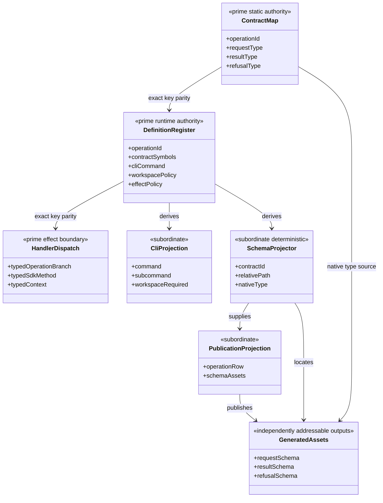
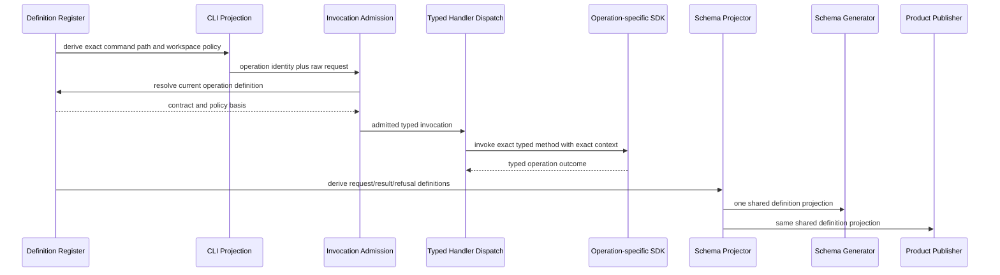
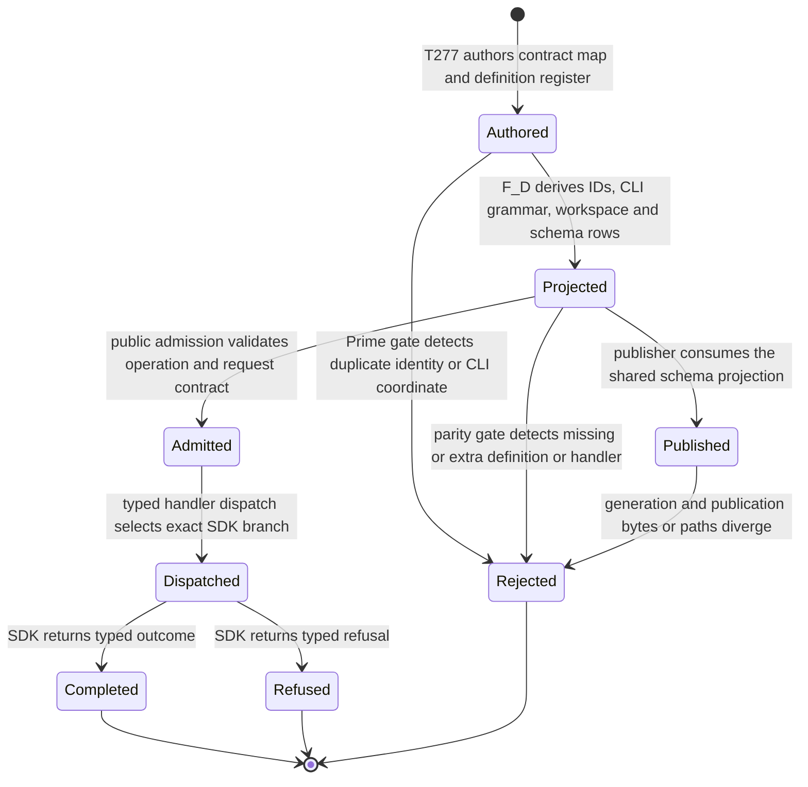

# M04 Public Operation Prime Contraction Behavior Design

**Status**: F_H-authorized for implementation under T-277; independent closure review pending

**Date**: 2026-07-15

**Owner**: T-277

**Change class**: `realization_refactor`

**Governing design**: [ADR-044](./adrs/ADR-044-prime-contraction-is-a-cross-boundary-design-gate.md)

**Census rows**: `PC-004`, `PC-005`

## Boundary

This design contracts repeated realization authorship for the 19 currently
implemented public operations. It does not add the 17 remaining 5.0
operations, change any public identity, alter an operation request, result,
refusal, effect, or admission policy, or replace typed SDK behavior with a
generic controller.

The current realization repeats operation truth through an identity tuple,
the operation definition register, CLI command routing, workspace policy,
invocation construction, an operation-slug table, SDK dispatch, and two
schema-definition algorithms. The target retains two semantic authoring
surfaces:

1. `Ds1PublicOperationContractMap` owns the exact TypeScript request, result,
   and refusal relation for each public operation identity.
2. `Ds1PublicOperationDefinitionRegister` owns runtime operation metadata,
   CLI coordinates, and workspace policy.

The existing typed SDK dispatch remains the effect boundary. It is not a
second identity or metadata roster. A parity proof must show that every
definition reaches exactly one typed dispatch branch.

The operation schema projector is subordinate. It derives contract IDs,
paths, and native symbols from the definition register and is consumed by
both schema generation and product publication.

## Irreducible Architectural Carrier Set

- `Ds1PublicOperationContractMap`: compile-time operation-to-contract relation
- `Ds1PublicOperationDefinitionRegister`: admitted runtime definition and
  projection source
- `PublicOperationHandlerDispatch`: typed effect boundary preserving
  operation-specific SDK and context behavior

Subordinate values include operation ID arrays, CLI grammar rows, workspace
classification, operation slugs, invocation envelopes, schema definitions,
publication rows, and generated assets.

## Prime Contraction Review

```json prime-contraction
{
  "schemaVersion": 1,
  "iacs": [
    "Ds1PublicOperationContractMap",
    "Ds1PublicOperationDefinitionRegister",
    "PublicOperationHandlerDispatch"
  ],
  "authoritativeCarriers": [
    "Ds1PublicOperationContractMap",
    "Ds1PublicOperationDefinitionRegister",
    "PublicOperationHandlerDispatch"
  ],
  "subordinatePayloads": [
    "PublicOperationIdProjection",
    "PublicOperationCliProjection",
    "PublicOperationWorkspaceProjection",
    "PublicOperationSlugProjection",
    "PublicOperationSchemaDefinitionProjection",
    "PublicOperationPublicationProjection"
  ],
  "promotionTests": [
    {
      "candidate": "Ds1PublicOperationContractMap",
      "verdict": "promote",
      "reason": "It owns the exact static relation from every public operation identity to its request, result, and refusal types."
    },
    {
      "candidate": "Ds1PublicOperationDefinitionRegister",
      "verdict": "promote",
      "reason": "It is the single runtime source admitted by operation, CLI, schema, and publication projections."
    },
    {
      "candidate": "PublicOperationHandlerDispatch",
      "verdict": "promote",
      "reason": "It is the typed effect boundary that selects operation-specific SDK behavior and context construction."
    },
    {
      "candidate": "PublicOperationSchemaDefinitionProjection",
      "verdict": "remain_subordinate",
      "reason": "It deterministically projects existing operation definitions and owns no contract meaning."
    }
  ],
  "recurrenceReview": {
    "status": "commonize_tenant",
    "ref": "build_tenants/abiogenesis/typescript/design/A5_PRIME_CONTRACTION_CENSUS.md#pc-004---public-operation-realization-rosters"
  },
  "authoritySourceCount": {
    "before": 3,
    "after": 3
  },
  "authoringSourceCount": {
    "before": 9,
    "after": 3
  },
  "disposition": "migrate_authority",
  "ownerTicket": "T-277"
}
```

## Domain View



## Execution View



## State View



Transition owners are explicit: T-277 owns authored contraction and projection;
existing M04 admission owns `Admitted`; the existing typed CLI/SDK dispatch
owns `Dispatched`; operation-specific SDK methods own `Completed` and
`Refused`; existing publication gates own `Published`.

## Migration

1. Derive `PublicOperationId` from `Ds1PublicOperationContractMap`.
2. Extend each operation definition with one CLI command coordinate and one
   workspace policy.
3. Derive the runtime operation ID roster, CLI resolution, workspace
   classification, and operation slug from the definition register.
4. Collapse the repeated invocation-construction switch only if strict
   TypeScript preserves the operation/request relation without unchecked cast.
5. Keep the typed SDK dispatch explicit and prove exact parity with the
   definition register.
6. Replace both operation schema algorithms with one tenant-local projector.
7. Regenerate and compare every current public operation asset.

The measured combined contraction is `9 -> 3`: PC-004 reduces seven repeated
roster and branch surfaces to the definition register and typed effect
dispatch; PC-005 reduces two schema-definition algorithms to one subordinate
projector. The independent static contract map is retained outside that
recurrence count.

## Negative Proof

- duplicate operation identity fails register construction or parity proof
- duplicate CLI command path fails before CLI execution
- missing or extra typed handler branch fails the exact source census
- an unknown operation or command remains rejected
- workspace policy remains identical for all 19 current operations
- schema generator and publisher consume the same projection and cannot
  independently choose IDs or paths
- request, result, and refusal assets remain separately addressable and
  cross-projection substitution remains invalid

## Stop Conditions

- stop if contraction requires `as unknown as`, a permissive index signature,
  or loss of operation/request/result discrimination
- stop if any public operation identity or generated schema path changes
- stop if a behavior branch moves into the metadata register
- stop if the common schema projector begins admitting or deciding contract
  meaning
- stop and reprice if the remaining 17 operations cannot use the same two
  authoring surfaces without changing requirement truth
