# M04 Public Start Structural Carrier Diagram

**Status**: Active
**Date**: 2026-04-23
**Purpose**: Module-bounded structural carrier sign-off asset for the first
TypeScript `M04-app-bootstrap` public-start slice.

## Scope

This diagram covers the active first `M04` boundary only:

- one admitted public start request carrier
- one closed public start outcome family
- one explicit runtime or worker identity projection path
- one canonical route into completed `M03` kernel truth

It does **not** claim to show:

- auto loops
- human proxy flow
- event-ingress or result-assessment command families
- install/bootstrap or bootloader carriers
- sandbox/scenario qualification

## Mermaid UML View

```mermaid
classDiagram
class PublicStartRequest {
  <<prime>>
  <<authoritative>>
  +startIntent
  -controlModes
  -runtimeSelector
}

class PublicControlModes {
  <<subordinate>>
  -fhMode
  -rootMode
}

class ConfiguredRuntimeSelector {
  <<subordinate>>
  -workerRef
  -runtimeRef
}

class KernelRouteBinding {
  <<subordinate>>
  -startIntent
  -moduleName
  -workspaceRoot
  -resolvedRuntimeRef
}

class PublicStartOutcome {
  <<prime>>
  <<authoritative>>
}

class PublicStartAdvanced {
  <<prime>>
  <<authoritative>>
  +kind
}

class PublicStartBlocked {
  <<prime>>
  <<authoritative>>
  +kind
}

class PublicStartYielded {
  <<prime>>
  <<authoritative>>
  +kind
}

class PublicStartConverged {
  <<prime>>
  <<authoritative>>
  +kind
}

class PublicStartRejected {
  <<prime>>
  <<authoritative>>
  +kind
  +reason
}

class PublicRuntimeIdentityProjection {
  <<subordinate>>
  -workerId
  -backendId
  -buildId
  -resolvedRuntimeRef
}

class PublicKernelTraceRef {
  <<subordinate>>
  -basisId
  -runId
  -workKey
  -frameId
  -frameLineageId
}

class PublicStopDetail {
  <<subordinate>>
  -terminalKind
  -gateReason
  -dispatchRef
  -approvalSubjectRef
}

class StartIntent {
  <<downstream>>
  <<authoritative>>
}

class ExecutionBasis {
  <<downstream>>
  <<authoritative>>
}

class AdvancementTransition {
  <<downstream>>
  <<authoritative>>
}

class RuntimeEvent {
  <<downstream>>
  <<authoritative>>
}

class AutoProgressionLoop {
  <<deferred>>
}

class HumanProxyDecision {
  <<deferred>>
}

class EventIngressCommand {
  <<deferred>>
}

class ResultAssessmentIngress {
  <<deferred>>
}

class InstallBootstrap {
  <<deferred>>
}

PublicStartRequest *-- PublicControlModes
PublicStartRequest *-- ConfiguredRuntimeSelector
PublicStartRequest *-- KernelRouteBinding
PublicStartRequest --> StartIntent
KernelRouteBinding --> StartIntent
KernelRouteBinding --> ExecutionBasis
PublicStartOutcome <|-- PublicStartAdvanced
PublicStartOutcome <|-- PublicStartBlocked
PublicStartOutcome <|-- PublicStartYielded
PublicStartOutcome <|-- PublicStartConverged
PublicStartOutcome <|-- PublicStartRejected
PublicStartAdvanced *-- PublicRuntimeIdentityProjection
PublicStartAdvanced *-- PublicKernelTraceRef
PublicStartBlocked *-- PublicRuntimeIdentityProjection
PublicStartBlocked *-- PublicKernelTraceRef
PublicStartBlocked *-- PublicStopDetail
PublicStartYielded *-- PublicRuntimeIdentityProjection
PublicStartYielded *-- PublicKernelTraceRef
PublicStartYielded *-- PublicStopDetail
PublicStartConverged *-- PublicRuntimeIdentityProjection
PublicStartConverged *-- PublicKernelTraceRef
PublicStartRejected *-- PublicRuntimeIdentityProjection
PublicStartAdvanced --> AdvancementTransition
PublicStartBlocked --> AdvancementTransition
PublicStartYielded --> AdvancementTransition
PublicStartConverged --> AdvancementTransition
PublicStartAdvanced --> RuntimeEvent
PublicStartBlocked --> RuntimeEvent
PublicStartYielded --> RuntimeEvent
PublicStartConverged --> RuntimeEvent
PublicStartOutcome ..> AutoProgressionLoop : consumed later
PublicStartOutcome ..> HumanProxyDecision : consumed later
PublicStartOutcome ..> EventIngressCommand : downstream later
PublicStartOutcome ..> ResultAssessmentIngress : downstream later
PublicStartOutcome ..> InstallBootstrap : downstream later
```

## Reading Rules

- `<<prime>>` means top-level carrier family for the active `M04` slice.
- `<<subordinate>>` means nested payload detail that remains inside the prime
  `M04` carriers.
- `<<downstream>>` means upstream authoritative carriers consumed by `M04`
  rather than redefined by it.
- `<<deferred>>` means later `M04` or qualification families outside the first
  public-start steel thread.
- `+` fields are public/exported carrier truth for the active slice.
- `-` fields are module-bounded subordinate detail.

## Sign-Off Consequence

This asset is the visual check that:

- the first `M04` slice has only two outer carrier families:
  `PublicStartRequest` and `PublicStartOutcome`
- control modes, runtime selection, stop detail, and kernel trace are nested
  subordinate detail rather than rival public carriers
- `M04` consumes `StartIntent`, `ExecutionBasis`, `AdvancementTransition`, and
  `RuntimeEvent` as upstream kernel truth instead of reconstructing them
- loop, proxy, ingest, install, and qualification families remain explicitly
  deferred
