# M04 Result Assessment Structural Carrier Diagram

**Status**: Active
**Date**: 2026-04-24
**Derived from**: [M04_RESULT_ASSESSMENT_DERIVATION.md](./M04_RESULT_ASSESSMENT_DERIVATION.md), [M04_RESULT_ASSESSMENT_FIRST_SLICE_IACS.md](./M04_RESULT_ASSESSMENT_FIRST_SLICE_IACS.md), [ABG_3_MODULE_DESIGN.md](./ABG_3_MODULE_DESIGN.md), [T-017](../../.ai-workspace/tickets/completed/T-017-realize-typescript-m04-result-assessment-ingress-over-canonical-result-ingest-law.md)

## Purpose

Render the next `M04-app-bootstrap` result-assessment boundary as one
module-bounded Mermaid UML carrier topology so Prime Rule, visibility, and
deferred-family discipline are inspectable before implementation starts.

## Diagram

```mermaid
classDiagram

class DispatchRequest {
  <<prime>>
  <<authoritative>>
}

class ResultArtifact {
  <<prime>>
  <<authoritative>>
}

class ResultIngestOutcome {
  <<prime>>
  <<authoritative>>
}

class RuntimeEvent {
  <<prime>>
  <<authoritative>>
}

class PublicResultAssessmentRequest {
  <<prime>>
  <<authoritative>>
  +kind: "fp_assessed"
}

class PublicResultAssessmentOutcome {
  <<prime>>
  <<authoritative>>
  +kind: "accepted" | "rejected"
}

class AssessmentIngressRouteBinding {
  <<subordinate>>
}

class AssessmentManifestProvenance {
  <<subordinate>>
  +specHash: string
  +manifestId: string
}

class FulfillmentAssessmentRef {
  <<subordinate>>
  +obligationId: string
}

class PublishedLedgerRef {
  <<subordinate>>
  +ref: string
}

class AssessmentTraceRef {
  <<subordinate>>
  +emittedKinds: readonly string[]
}

class PublicResultAssessmentAccepted {
  <<prime family variant>>
}

class PublicResultAssessmentRejected {
  <<prime family variant>>
}

class AssessedReview {
  <<deferred>>
}

class ClosureFanout {
  <<deferred>>
}

class LiveStatusProjection {
  <<deferred>>
}

class InstallBootstrap {
  <<deferred>>
}

class Bootloader {
  <<deferred>>
}

class SandboxQualification {
  <<deferred>>
}

PublicResultAssessmentRequest --> DispatchRequest : consumes
PublicResultAssessmentRequest --> ResultArtifact : admits
PublicResultAssessmentRequest *-- AssessmentIngressRouteBinding
PublicResultAssessmentRequest *-- AssessmentManifestProvenance
PublicResultAssessmentRequest *-- FulfillmentAssessmentRef
PublicResultAssessmentRequest *-- PublishedLedgerRef

AssessmentIngressRouteBinding --> ResultIngestOutcome : binds into canonical ingest
AssessmentIngressRouteBinding --> RuntimeEvent : binds into canonical emit

PublicResultAssessmentAccepted --|> PublicResultAssessmentOutcome
PublicResultAssessmentRejected --|> PublicResultAssessmentOutcome

PublicResultAssessmentAccepted *-- AssessmentTraceRef
PublicResultAssessmentRejected *-- AssessmentTraceRef

PublicResultAssessmentOutcome ..> AssessedReview : deferred later
PublicResultAssessmentOutcome ..> ClosureFanout : deferred later
PublicResultAssessmentOutcome ..> LiveStatusProjection : deferred later
PublicResultAssessmentRequest ..> InstallBootstrap : deferred later
PublicResultAssessmentRequest ..> Bootloader : deferred later
PublicResultAssessmentOutcome ..> SandboxQualification : deferred later
```

## Reading Rules

- `PublicResultAssessmentRequest` and `PublicResultAssessmentOutcome` are the
  only prime outer carriers in this slice.
- `DispatchRequest`, `ResultArtifact`, `ResultIngestOutcome`, and `RuntimeEvent`
  remain upstream authoritative truth and are consumed through canonical ingest
  and canonical `emit(...)`.
- `AssessmentIngressRouteBinding`, `AssessmentManifestProvenance`,
  `FulfillmentAssessmentRef`, `PublishedLedgerRef`, and `AssessmentTraceRef`
  stay subordinate.
- `assessed{kind: fh_review}`, proof/closure fan-out, live-status,
  install/bootstrap, bootloader, and sandbox families remain deferred.

## Sign-Off Claim

This result-assessment diagram is lawful only if the future TypeScript code:

- admits one closed public result-assessment request family,
- routes through canonical ingest and canonical `emit(...)`,
- keeps first-slice public outcome truth closed and replay-readable, and
- keeps non-F_P review, closure fan-out, live-status, install/bootstrap,
  bootloader, and sandbox families deferred until successor tickets open them.
