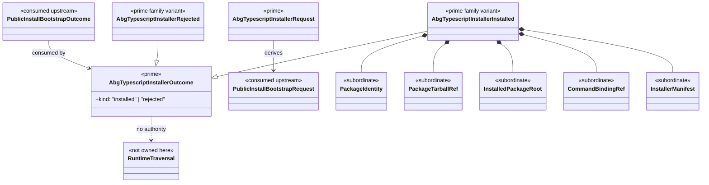

# M04 TypeScript Installer Structural Carrier Diagram

**Status**: Active
**Date**: 2026-04-26
**Derived from**: [M04_TYPESCRIPT_INSTALLER_DERIVATION.md](./M04_TYPESCRIPT_INSTALLER_DERIVATION.md), [M04_TYPESCRIPT_INSTALLER_FIRST_SLICE_IACS.md](./M04_TYPESCRIPT_INSTALLER_FIRST_SLICE_IACS.md), [T-076](../../.ai-workspace/tickets/completed/T-076-realize-typescript-abg-installer-for-downstream-sandbox-population.md)

## Purpose

Render the TypeScript installer boundary as one module-bounded carrier topology
so package installation and command binding are governed as ABG delivery truth
rather than private test fixture behavior.

## Diagram

## Reading Rules

- the installer is a delivery boundary above install/bootstrap, not a new
  runtime controller.
- package tarball, installed package root, command refs, and installer manifest
  stay subordinate to the installer outcome.
- runtime traversal stays outside the installer.
