# M04 TypeScript Installer Structural Carrier Diagram

**Status**: Active
**Date**: 2026-04-26
**Derived from**: [M04_TYPESCRIPT_INSTALLER_DERIVATION.md](./M04_TYPESCRIPT_INSTALLER_DERIVATION.md), [M04_TYPESCRIPT_INSTALLER_FIRST_SLICE_IACS.md](./M04_TYPESCRIPT_INSTALLER_FIRST_SLICE_IACS.md), [T-076](../../../../.ai-workspace/tickets/completed/T-076-realize-typescript-abg-installer-for-downstream-sandbox-population.md), [T-079](../../../../.ai-workspace/tickets/completed/T-079-realize-typescript-installer-standards-reference-copy-and-product-contract-proof.md)

## Purpose

Render the TypeScript installer boundary as one module-bounded carrier topology
so package installation and command binding are governed as ABG delivery truth
rather than private test fixture behavior.

## Diagram

```mermaid
classDiagram

class AbgTypescriptInstallerRequest {
  <<prime>>
  <<authoritative>>
}

class AbgTypescriptInstallerOutcome {
  <<prime>>
  <<authoritative>>
  +kind: "installed" | "rejected"
}

class AbgTypescriptInstallerInstalled {
  <<prime family variant>>
}

class AbgTypescriptInstallerRejected {
  <<prime family variant>>
}

class PublicInstallBootstrapRequest {
  <<consumed upstream>>
}

class PublicInstallBootstrapOutcome {
  <<consumed upstream>>
}

class PackageIdentity {
  <<subordinate>>
}

class RuntimeIdentity {
  <<subordinate>>
}

class InstallMode {
  <<subordinate>>
}

class PackageTarballRef {
  <<subordinate>>
}

class InstalledPackageRoot {
  <<subordinate>>
}

class CommandBindingRef {
  <<subordinate>>
}

class CliRuntimeBindingPath {
  <<subordinate>>
}

class InstalledStandardsRoot {
  <<subordinate>>
}

class InstalledDocsRoot {
  <<subordinate>>
}

class InstalledFileEvidence {
  <<subordinate>>
}

class InstallerManifest {
  <<subordinate>>
}

class InstallProvenance {
  <<subordinate>>
}

class TopologyVerification {
  <<subordinate>>
}

class RuntimeTraversal {
  <<not owned here>>
}

AbgTypescriptInstallerRequest --> PublicInstallBootstrapRequest : derives
PublicInstallBootstrapOutcome --> AbgTypescriptInstallerOutcome : consumed by

AbgTypescriptInstallerInstalled --|> AbgTypescriptInstallerOutcome
AbgTypescriptInstallerRejected --|> AbgTypescriptInstallerOutcome

AbgTypescriptInstallerInstalled *-- PackageIdentity
AbgTypescriptInstallerInstalled *-- RuntimeIdentity
AbgTypescriptInstallerInstalled *-- InstallMode
AbgTypescriptInstallerInstalled *-- PackageTarballRef
AbgTypescriptInstallerInstalled *-- InstalledPackageRoot
AbgTypescriptInstallerInstalled *-- CommandBindingRef
AbgTypescriptInstallerInstalled *-- CliRuntimeBindingPath
AbgTypescriptInstallerInstalled *-- InstalledStandardsRoot
AbgTypescriptInstallerInstalled *-- InstalledDocsRoot
AbgTypescriptInstallerInstalled *-- InstalledFileEvidence
AbgTypescriptInstallerInstalled *-- InstallerManifest
AbgTypescriptInstallerInstalled *-- InstallProvenance
AbgTypescriptInstallerInstalled *-- TopologyVerification

AbgTypescriptInstallerOutcome ..> RuntimeTraversal : no authority
```

## Reading Rules

- the installer is a delivery boundary above install/bootstrap, not a new
  runtime controller.
- package tarball, installed package root, runtime identity, command refs, CLI
  runtime binding, and installer manifest stay subordinate to the installer
  outcome.
- install mode is a subordinate observation of whether the target had existing
  admitted installer truth before write effects. It may classify `fresh` versus
  `refresh`; it is not a second outcome family.
- standards/docs reference copies, file evidence, provenance, and topology
  verification stay subordinate to the installer outcome.
- clean-target `no_scaffold` means no project-authority surface is created by
  the ABG substrate installer.
- the CLI runtime binding is a domain-neutral substrate self-test binding. It
  must not become downstream graph catalog or asset authority.
- runtime traversal stays outside the installer.
