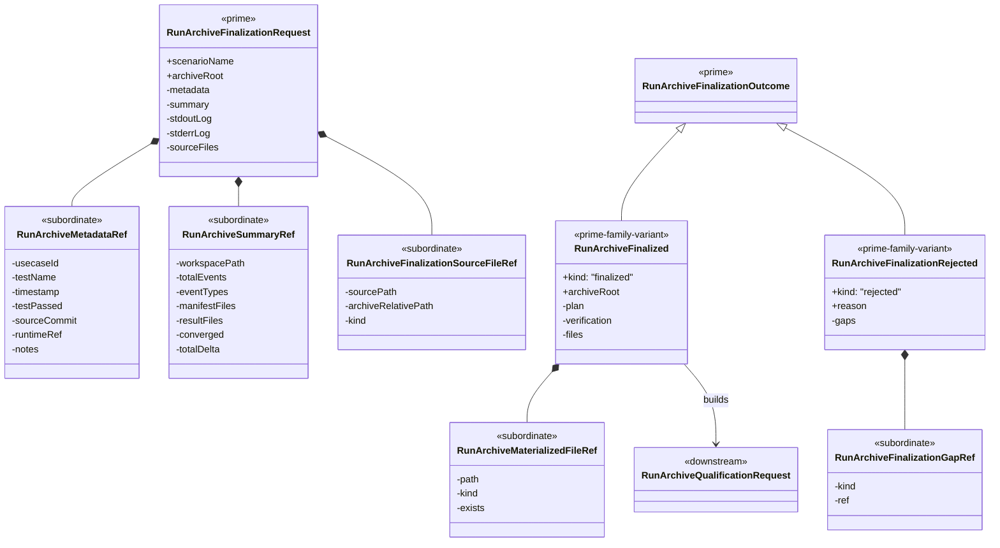

# M05 Archive Finalization Structural Carrier Diagram

**Status**: Completed
**Date**: 2026-04-24
**Derived from**: [M05_ARCHIVE_FINALIZATION_DERIVATION.md](./M05_ARCHIVE_FINALIZATION_DERIVATION.md), [M05_ARCHIVE_FINALIZATION_FIRST_SLICE_IACS.md](./M05_ARCHIVE_FINALIZATION_FIRST_SLICE_IACS.md), [T-030](../../.ai-workspace/tickets/completed/T-030-realize-typescript-m05-installed-run-archive-writer-and-postmortem-finalization-proof-under-explicit-archive-finalization-law.md)

## Legend

- `<<prime>>` marks the outer archive-finalization carriers for this slice.
- `<<subordinate>>` marks nested detail that does not become a rival public or
  persisted boundary.
- `<<prime-family-variant>>` marks explicit outcome variants pattern-matched
  under one outcome family.
- `<<downstream>>` marks the already-completed qualification family that
  consumes successful finalization output.
