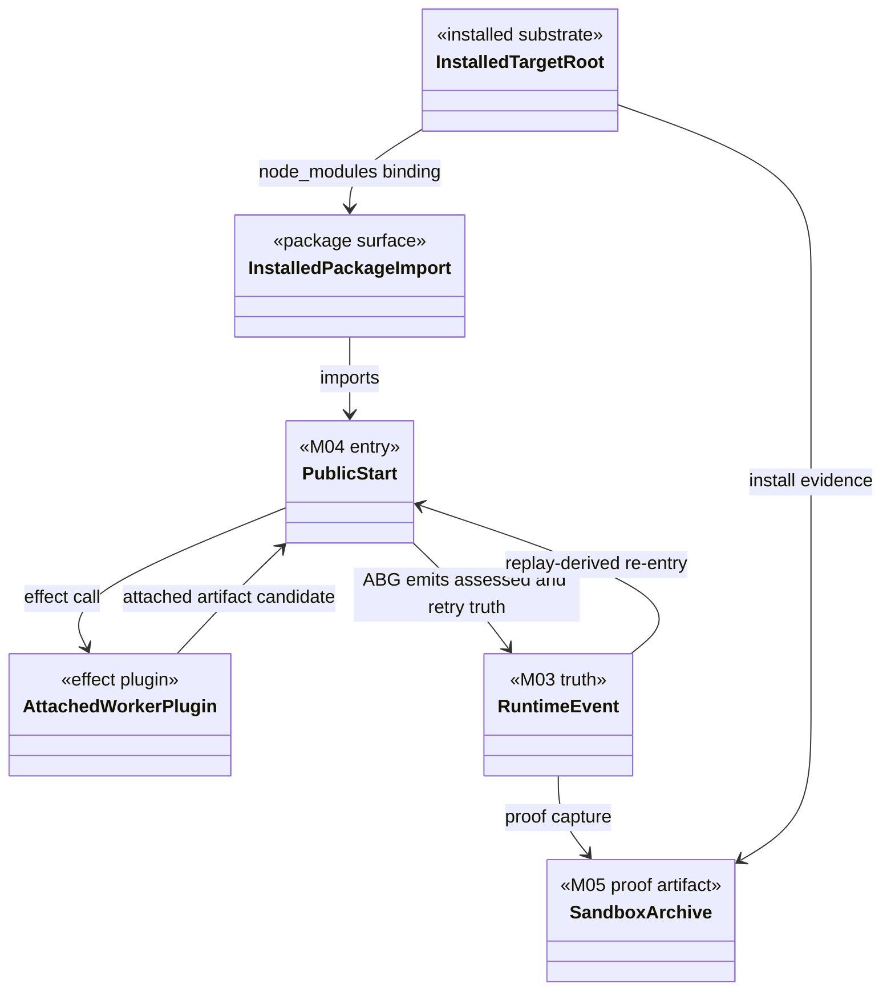

# M05 Attached F_P Local Live Sandbox Structural Carrier Diagram

**Status**: Active
**Date**: 2026-04-27
**Derived from**: [M05_ATTACHED_FP_LOCAL_LIVE_SANDBOX_DERIVATION.md](./M05_ATTACHED_FP_LOCAL_LIVE_SANDBOX_DERIVATION.md), [M05_ATTACHED_FP_LOCAL_LIVE_SANDBOX_FIRST_SLICE_IACS.md](./M05_ATTACHED_FP_LOCAL_LIVE_SANDBOX_FIRST_SLICE_IACS.md), [T-085](../../../../.ai-workspace/tickets/backlog/T-085-prove-attached-fp-loop-through-local-live-installed-sandbox.md)

## Diagram

## Reading Rules

- The plugin is an effect boundary only.
- Runtime authority remains in ABG events and projection.
- The archive is evidence for qualification; it is not a second runtime truth
  source.

