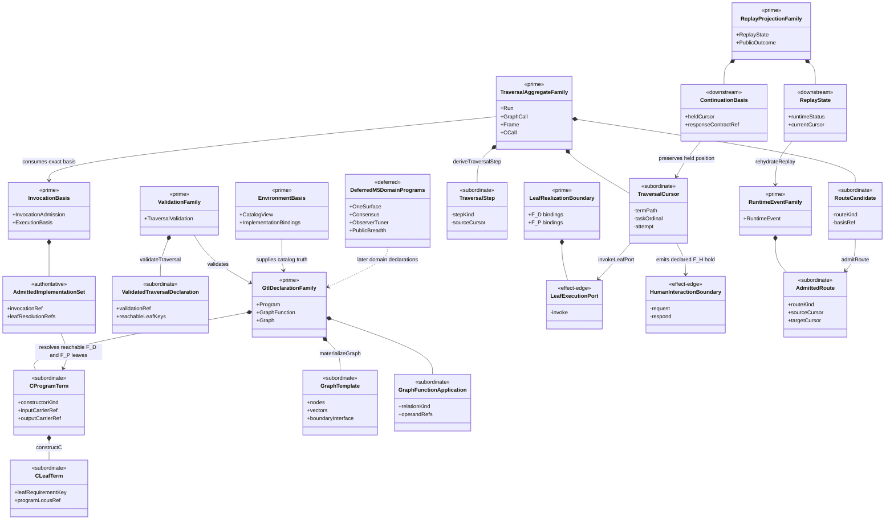
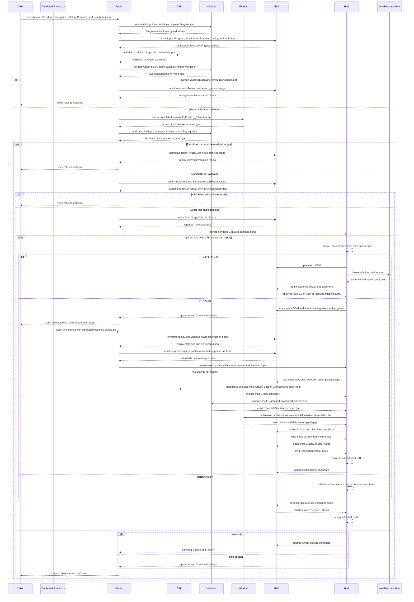
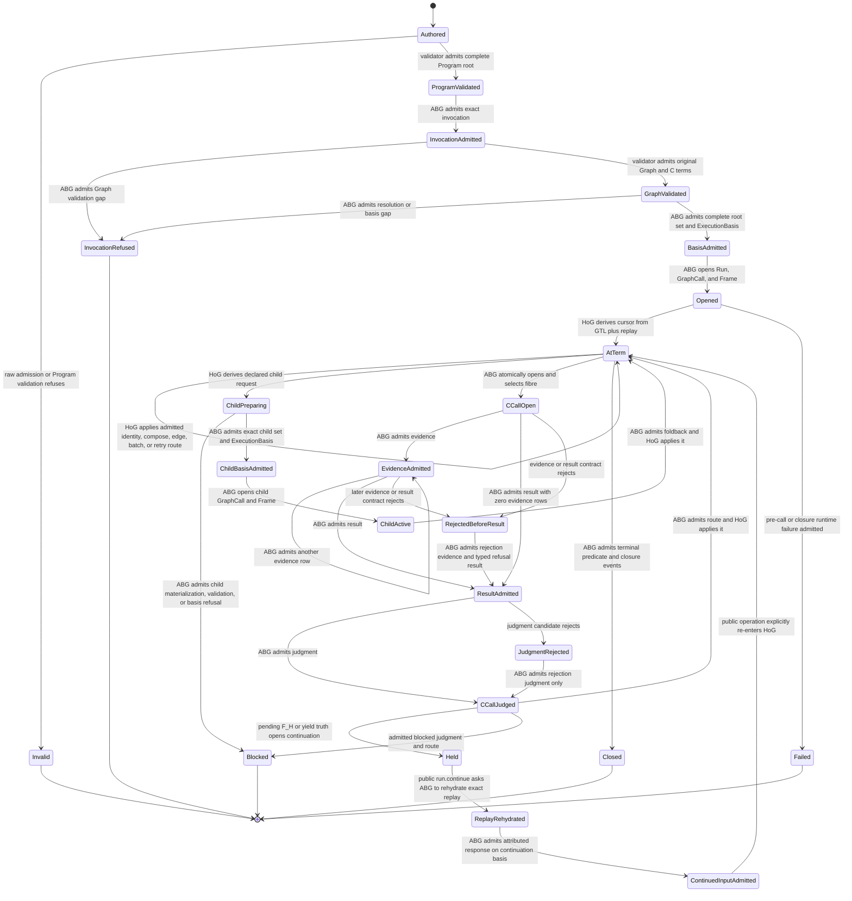

# M05 Direct GTL Traversal Expansion Design

**Status**: Candidate under T-270; co-evolution evidence may proceed, promotion
requires acceptance of this affected-boundary delta
**Date**: 2026-07-22
**Parent design**:
`M03_DIRECT_GTL_TRAVERSAL_BEHAVIOR_DESIGN.md`, accepted SHA-256
`9faeb41ddac839edc9cd2ccb83ae11b05bb54d32168fc35e74a1a9cfb97e92f0`
**Product boundary**: `A5-F02`, `A5-F03`, `A5-F04`, `A5-F09`, `A5-F10`,
`A5-F14`; enables later `A5-F07`, `A5-F08`, `A5-F12`, and `A5-F17`
**Scenario boundary**: `ABG5-S02`, with continuation inputs for `ABG5-S03`
**Work owner**: T-270
**Sequencing**: co-evolution inside the decisions fixed here; a newly exposed
material authority or lifecycle ambiguity returns to design before promotion

## 1. Decision

M5 extends the installed M4 root into a generic direct traversal without a
compiled execution carrier.

```text
admitted GTL Program and materialized Graph
  -> non-lowering validation of graph and C terms
  -> ABG-admitted invocation and complete implementation-resolution set
  -> HoG cursor derived from the original GTL value plus replay
  -> direct traversal of graph relations and seven C constructors
  -> declared implementation port at each leaf
  -> ABG evidence, result, judgment, route, continuation, and closure admission
  -> replay-derived state and public outcome
```

The accepted M3 authority split remains unchanged:

- GTL owns graph topology, C terms, callable relations, contracts, and routes.
- The validator owns closed static judgments and never lowers GTL.
- Product projection proposes exact implementation matches from the admitted
  catalog.
- ABG admits invocation, implementation matches, runtime facts, and closure.
- HoG traverses the original admitted GTL and applies only ABG-admitted routes.
- Implementations own leaf interiors only.
- Public SDK and CLI transport public operations and project replay truth.

No generated program, compiled C plan, normalized executable declaration,
feature runner, implementation selector, scheduler, or controller is added.

## 2. Scope And Non-Scope

### In scope

1. The seven-constructor C declaration family:
   `C.of`, `C.id`, `C.compose`, `C.edge`, `workflow.C`, `C.batch`, and
   `C.retry`.
2. Graph traversal over declared nodes and vectors, including child
   GraphFunction traversal and declared GraphFunction applications.
3. A complete per-invocation implementation-resolution set admitted before
   HoG enters the graph.
4. General C-call locus identity across source path, task ordinal, attempt,
   retry path, and graph-call lineage. Compute fibre remains selected interior
   truth and never enters C-call identity.
5. Deterministic and probabilistic leaf ports plus a distinct typed external
   human-hold boundary that invokes no implementation.
6. Durable event-log reopening sufficient for same-run continuation.
7. Data-driven traversal and fibre-substitution proof rows.
8. Removal of the current GTL and validator dependency on Product utility
   modules.

### Deferred to existing owners

| Boundary | Owner |
|---|---|
| One Surface semantic program and F_H interaction policy | T-272 |
| Consensus declarations and result semantics | T-274, T-275, T-276 |
| complete public projection and downstream flavored catalog | T-281 |
| observer and tuner | T-268 |
| qualification and release | T-247, T-248 |

The generic carriers and lifecycle required by those slices are in scope.
Their domain programs are not.

## 3. Ontology Delta

This is an affected slice of the accepted M3 Ontology. The M3 Prime families
remain authoritative. M5 adds variants and relations inside those families; it
does not add a peer authority.

### 3.1 Entities And Relationships

| Identity | M3 family | Authority | Relationship |
|---|---|---|---|
| `CProgramTerm` | `GtlDeclarationFamily` | GTL | One closed discriminated term built from exactly seven constructors. |
| `CLeafTerm` | `GtlDeclarationFamily` | GTL | One `C.of` locus with role, fibre, arm, carrier, contract, judgment, and implementation-binding refs. |
| `GraphTemplate` | `GtlDeclarationFamily` | GTL | Complete immutable graph with boundary nodes, nodes, vectors, contexts, rules, effects, tags, and one C term at each compute locus. |
| `GraphFunctionApplication` | `GtlDeclarationFamily` | GTL | One declared graph relation for composition, substitution, recursion, fan-out, fan-in, gate, promote, identity, or same-object identity. |
| `ValidatedTraversalDeclaration` | `ValidationFamily` | validator | Exact static judgment over Program, GraphFunction, materialized Graph, C terms, contracts, and implementation declarations. |
| `AdmittedImplementationSet` | `InvocationBasis` | ABG | Complete one-to-one admitted resolution for every statically reachable F_D/F_P leaf key under the validated root; child bases consume exact graph-local subsets. |
| `TraversalCursor` | `TraversalAggregateFamily` | HoG under admitted scope | Subordinate position derived from original GTL plus replay; never authored or published as a program. |
| `TraversalStep` | `TraversalAggregateFamily` | HoG proposal | One derived structural step: pass identity, enter term, open leaf, enter child, start task, retry, advance graph, hold, or terminal. |
| `LeafExecutionPort` | `LeafRealizationBoundary` | admitted implementation seam | Exact `F_D` or `F_P` function addressed by one admitted resolution; no event or transition authority. |
| `HumanInteractionBoundary` | external actor, outside the IACS | direct or lawfully proxied F_H | Receives an attributed request and returns a response candidate; it is not an implementation binding or executable port. |
| `RouteCandidate` | `TraversalAggregateFamily` | declared implementation or HoG proposal | Candidate consequence constrained to GTL-declared routes. |
| `AdmittedRoute` | `RuntimeEventFamily` | ABG | Canonical event truth accepting one route on current replay and authority basis. |
| `ContinuationBasis` | `ReplayProjectionFamily` | ABG replay | Downstream held cursor, response contract, authority, and event-log identity derived from admitted events. |
| `ReplayState` | `ReplayProjectionFamily` | downstream | Complete state derived only from admitted events. |

### 3.2 Invariants And Cardinality

1. A `CProgramTerm` has exactly one constructor discriminant.
2. A `C.of` has one C-call spine. `C.id` has none. Structural constructors do
   not fabricate C calls.
3. `C.compose` is canonically flat: construction flattens nested composition
   syntax into one ordered non-empty term family while preserving each original
   leaf. `C.compose` and `C.edge` preserve exact carrier continuity.
4. `workflow.C` names one admitted child GraphFunction and opens one child
   graph call and frame under the same run.
5. `C.batch` contains a non-empty ordered task family with equal outer carrier
   and per-task result cardinality. Each task retains its own C-call identity.
6. `C.retry` has a positive budget and repeats the same declared term with a
   fresh positive attempt coordinate. Retry is not graph recursion.
7. Every reachable `F_D` or `F_P` effectful leaf has exactly one admitted
   implementation resolution before HoG entry. Zero or multiple matches
   refuse. An `F_H` leaf instead has one declared interaction and response
   contract and no implementation resolution.
8. A leaf requirement key is the stable digest of Program, GraphFunction,
   GraphFunction digest, program locus, role, fibre, arm, binding, and all seam
   contract refs. The validated transitive root declares the complete key set.
   A child materialization declares its exact graph-local key subset. Child
   basis admission requires set equality between those keys and the matching
   rows already admitted in the root set; missing, extra, drifted, or ambiguous
   rows refuse before child HoG entry.
9. Fibre substitution changes only the leaf interior, evidence class, and
   admitted binding. Topology, source path, C-call spine order, and
   continuation law remain unchanged.
10. A HoG cursor is reproducible from `(admitted GTL, opened scope, replay)`.
   Ambient process memory cannot be required for continuation.
11. A route is applicable only when declared by the current GTL boundary and
    admitted by ABG against current replay.
12. Once a C call opens, every success, failure, malformed result, or admission
    rejection completes the inherited M3 spine through one result-admitted row
    and one judged row. Only pre-call refusal may terminate without a C call.
13. Public outcome is replay projection. A worker, test, CLI, or implementation
    cannot author result, continuation, or closure truth.

### 3.3 Lifecycle Completeness

| Entity | Initial | Lawful next states | Terminal or refusal |
|---|---|---|---|
| authored GTL | authored | raw admitted, invalid | invalid |
| admitted GTL | admitted | validated, semantic gap | invalid or unresolved |
| invocation basis | raw input and Program validated | invocation admitted, Graph materialized and validated, implementation set admitted, exact basis admitted | `invocation_refused` after invocation admission; typed refusal before it |
| traversal | opened | at term, at leaf, child, retry, next node, held | blocked, failed, closed |
| C call | atomically opened and fibre selected | evidenced, result admitted, judged | judged success, failure, refusal, pending, blocked, or escalation; never stranded |
| child traversal | opened | traversing, folded back | blocked, held, failed, closed |
| continuation | proposed | held, response admitted, resumed | rejected or superseded by admitted reprice |
| run | active | active, held, blocked, failed | closed |

The affected entity closure is explicit below. Immutable declaration and
judgment carriers retire by supersession or invocation completion, not mutation.

| Entity | Create / admit | Read / project | Transition / execute | Retire / terminal |
|---|---|---|---|---|
| `CProgramTerm` | GTL constructor or raw admission | validator and HoG read original term | HoG folds without rewriting | declaration version supersedes |
| `CLeafTerm` | `C.of` or raw admission | validator derives one leaf key | exact admitted port or F_H hold | owning term supersedes |
| `GraphTemplate` | GraphFunction publication | materialization and validation | pure materialization only | GraphFunction version supersedes |
| `GraphFunctionApplication` | GTL graph algebra | validator and HoG read relation | HoG proposes only declared child/route work | owning declaration supersedes |
| `ValidatedTraversalDeclaration` | validator closed judgment | Product, ABG, and audit read exact digest | never executes | invocation ends or subject digest changes |
| `AdmittedImplementationSet` | ABG admits exact validated root set | root and child basis admission read keyed rows | never selects or executes | invocation terminates |
| `TraversalCursor` | HoG derives from GTL, scope, and replay | HoG reads current derived position | replaced only after an admitted event/route | next cursor or terminal event supersedes |
| `TraversalStep` | HoG derives one total step | ABG evaluates candidate against scope | HoG executes only after required admission | accepted, refused, or superseded by newer replay |
| `LeafExecutionPort` | package plus implementation binding admission | HoG addresses exact admitted port | implementation realizes F_D/F_P interior | call or invocation terminates |
| `HumanInteractionBoundary` | GTL declares callout and ABG admits hold | public projection renders pending interaction | attributed external actor returns candidate | response admitted, rejected, abandoned, or superseded |
| `RouteCandidate` | HoG or declared implementation proposes within GTL route set | ABG evaluates against replay | never applies itself | admitted, refused, or superseded |
| `AdmittedRoute` | ABG admits canonical route event | replay projects route truth | HoG applies exact admitted route | application event or terminal event consumes it |
| `ContinuationBasis` | replay derives open obligation | public read and `run.continue` consume exact basis | never invokes HoG itself | resolved, superseded, abandoned, or run terminal |
| `ReplayState` | pure fold of admitted event log | HoG and public projections read | never writes events or executes work | superseded by a longer valid prefix |

### 3.4 Authority Matrix

| Function | Proposer | Evaluator | Verifier | Executor | Projector | Admitter / truth owner | Retirement |
|---|---|---|---|---|---|---|---|
| construct C or graph relation | GTL author | TypeScript and validator | validator | pure GTL constructor | validation report | raw admission and closed static judgment | declaration supersession |
| resolve leaf implementation | Product catalog projection | validator | ABG basis checks | none | invocation replay | ABG; F_D and F_P only | invocation terminal |
| derive next structural cursor | HoG | GTL relation plus replay | ABG scope identity | HoG after required admission | replay cursor | no new truth until route admission | next admitted event |
| realize leaf interior | admitted F_D or F_P implementation | result contract | ABG result checks | exact implementation port | replayed C-call | ABG | judged C call or invocation terminal |
| request or answer human work | HoG proposes declared hold; attributed human answers | declared interaction and response contracts | F_H authority and replay basis | external human only | continuation and public interaction views | ABG | resolved, rejected, abandoned, or superseded continuation |
| choose consequence candidate | declared implementation or HoG from declared relation | GTL route set | ABG current replay | none | route diagnostic | ABG | admission, refusal, or newer replay |
| apply transition | admitted route | GTL cursor relation | replay | HoG | replay cursor | ABG event is prior truth | next cursor or terminal event |
| totalize post-open rejection | actual contract rejection | refusal and rejection contracts | current C-call spine | ABG appends only missing suffix | replayed rejected C-call | ABG | judged rejection |
| hold and resume | HoG proposes declared hold; external F_H actor later proposes a response | declared interaction and response contracts | authority and replay basis | public operation explicitly re-enters HoG after ABG admission | continuation and replay views | ABG | continuation resolution or termination |
| close | HoG submits current judged terminal | closure predicate | replay and exact contracts | ABG appends closure transaction | replay and PublicOutcome | ABG | immutable terminal run |

## 4. Function And Composition Derivation

### 4.1 Atomic function families

| Family | Input -> output | Owner |
|---|---|---|
| `constructC` | typed constructor arguments -> canonical `CProgramTerm` | GTL |
| `rawAdmitProgram` | erased Program, GraphFunction, Graph, and C data -> admitted declarations or typed refusal | raw admission |
| `validateProgram` | admitted whole root -> Program validation or typed gap | validator |
| `materializeGraph` | admitted GraphFunction plus admitted input -> original GTL Graph candidate | GTL |
| `validateTraversal` | materialized Graph plus Program validation -> static Graph/C validation or typed gap | validator |
| `resolveImplementations` | catalog view plus reachable F_D/F_P leaves -> candidate set or typed gap | Product projection |
| `admitImplementationSet` | candidate set plus invocation basis -> admitted set or refusal | ABG |
| `deriveTraversalStep` | GTL plus scope plus replay -> structural step | HoG |
| `invokeLeafPort` | admitted F_D/F_P leaf input -> evidence and result candidates | implementation seam |
| `admitHumanHold` | declared F_H locus plus replay -> admitted hold event and continuation projection | ABG |
| `admitLeafTruth` | candidates plus contracts -> admitted C-call truth or rejection | ABG |
| `completeRejectedCCall` | opened C call plus current spine position plus actual admission rejection -> only the missing suffix: rejection evidence and typed refusal result before result admission, then rejection judgment; judgment only after result admission | ABG |
| `admitRoute` | route candidate plus current replay -> admitted route or refusal | ABG |
| `applyRoute` | admitted route plus GTL cursor -> next cursor | HoG |
| `rehydrateReplay` | durable admitted event log -> replay state | ABG |

### 4.2 Higher-order composition

`traverseC` is the direct fold over the original `CProgramTerm`. It composes
the atomic families above and is parameterized by admitted ports. It does not
produce or consume another program value.

`traverseGraph` composes `traverseC` with declared graph vectors and admitted
routes. `workflow.C`, recursion, fan-out, and fan-in reuse `traverseGraph` at a
child scope. Batch and retry reuse `traverseC` with task and attempt
coordinates. None owns a parallel runtime.

### 4.3 Whole-family Prime contraction

Candidate alternatives were:

1. one interpreter or runner per C constructor;
2. a lowered normalized execution plan;
3. one generic direct fold over the original GTL term;
4. feature-owned controllers for workflow, batch, retry, and recursion.

Only option 3 preserves one program identity and one traversal authority. The
M3 Prime set therefore remains eight families. This delta adds subordinate
variants to `GtlDeclarationFamily`, `InvocationBasis`, and
`TraversalAggregateFamily`; it adds no ninth authority family and no second
authoring surface.

## 5. Irreducible Architectural Carrier Set Delta

The accepted M3 IACS remains the complete eight-family carrier set. This table
classifies only M5 members and payloads inside those families; no row is a ninth
Prime family.

| Carrier | Parent M3 IACS family | Classification | Module | Purpose |
|---|---|---|---|---|
| `CProgramTerm` | `GtlDeclarationFamily` | `<<subordinate>> <<authoritative>>` | `src/gtl` | Original seven-constructor program data. |
| `GraphFunctionApplication` | `GtlDeclarationFamily` | `<<subordinate>> <<authoritative>>` | `src/gtl` | Original graph-algebra relation data. |
| `TraversalValidation` | `ValidationFamily` | `<<subordinate>> <<authoritative>>` | `src/validator` | Static closed judgment; never executable. |
| `AdmittedImplementationSet` | `InvocationBasis` | `<<authoritative>>` | `src/abg` | Invocation-bound complete leaf realization basis. |
| `TraversalCursor` | `TraversalAggregateFamily` | `<<subordinate>>` | `src/hog` | Derived, invocation-local position. |
| `TraversalStep` | `TraversalAggregateFamily` | `<<subordinate>>` | `src/hog` | Exhaustive direct-fold result. |
| `LeafExecutionPort` | `LeafRealizationBoundary` | `<<effect-edge>>` | `src/implementation` | Bound F_D or F_P leaf effect interior. |
| `HumanInteractionBoundary` | external actor, not IACS | `<<effect-edge>>` | external plus `src/abg` admission | F_H request and attributed response candidate; never an implementation port. |
| `AdmittedRoute` | `RuntimeEventFamily` | `<<authoritative>>` | `src/abg` | Accepted runtime transition event. |
| `ContinuationBasis` | `ReplayProjectionFamily` | `<<downstream>>` | `src/abg` | Events-only hold and resume projection. |
| `ReplayState` | `ReplayProjectionFamily` | `<<downstream>>` | `src/abg` | Events-only runtime projection. |

Canonical JSON, digest, immutable-value, and opaque-ref utilities move to
`src/shared`. They are pure implementation primitives, not Ontology carriers,
program meaning, or admission authority. `gtl` and `validator` may depend on
`shared`; `product` consumes them rather than owning them.

## 6. Direct Traversal Semantics

| Constructor | HoG relation | ABG truth |
|---|---|---|
| `C.of` | derive one leaf stop at exact term path and invoke exact admitted port | uniform C-call spine |
| `C.id` | pass admitted input unchanged | no C-call and no fabricated gate pass |
| `C.compose` | traverse the canonical flat term family in order, binding each admitted output into the next term | each child retains its own truth |
| `C.edge` | traverse transform, evaluate, consequence in declared order | ordinary child C calls; no edge runner |
| `workflow.C` | open child graph call/frame and traverse named GraphFunction | child lineage plus `sub_traversal` evidence and foldback |
| `C.batch` | traverse the declared non-empty task family in stable ordinal order; concurrency is optional realization | one C-call per task plus grouping ref; all-or-block vector result |
| `C.retry` | traverse wrapped term until success, non-retry disposition, or budget | fresh attempt identity, admitted retry route, retained prior evidence |

An `F_H` `C.of` follows the same C-call locus and selected-fibre event shape but
does not call `LeafExecutionPort`. Its request invocation completes the uniform
spine with a typed pending result and pending judgment, from which ABG event
truth opens the continuation. A later attributed response candidate is admitted
against that exact replay-derived continuation and response contract before the
continued traversal may advance. It does not append a second result or judgment
to the already completed request C call. T-272 owns the domain interaction
policy and the exact continued GTL locus.

The source path is a stable sequence of segments rooted at the graph node:

```text
node/<node-ref>/c
  /terms/<zero-based-ordinal>
  /transform | /evaluate | /consequence
  /tasks/<zero-based-ordinal>
  /term
```

The path is identity input, not a compiled node. HoG reads the term at that
path from the admitted materialized Graph each time it derives a step.

### 6.1 Graph algebra projection

The complete `GraphTemplate` preserves the constitutional Graph fields. Graph
algebra operations remain GTL constructors. Runtime traverses their resulting
declared relation; it does not infer or reconstruct the operation.

| Relation | GTL construction truth | Direct runtime meaning |
|---|---|---|
| `edge` | one explicit GraphVector between typed boundary nodes | traverse source locus, declared vector relation, then target locus |
| `identity` | graph or GraphFunction preserving one interface | pass admitted value with no fabricated check or effect |
| `compose` | one application relation and materialized composed graph with exact interface wiring | traverse declared left then right child relation |
| `substitute` | outer graph with one exact vector replaced by visible interface-compatible inner graph | traverse the resulting graph; provenance retains outer vector and inner graph refs |
| `recurse` | callable relation with termination, foldback, and positive bound | open child graph calls until admitted termination; foldback rebinds and re-evaluates parent |
| `fan_out` | element GraphFunction plus explicit ordered input/output vector relation | traverse one declared child application per stable input ordinal without constructing a runtime C term |
| `fan_in` | reducer GraphFunction plus complete vector contract | invoke one child reducer only after complete vector admission |
| `gate` | target, rule, and evaluator refs | admit block or advance from evaluator truth; never select a candidate |
| `promote` | explicit representation-boundary relation | apply the declared typed relation without changing semantic identity |
| `same_object` | exact identity witness | no runtime work; validator proves identity |

Composition, substitution, promotion, identity, and same-object are normally
resolved by typed construction and validation into the materialized original
GTL value. Recursion, fan-out, fan-in, and gate retain explicit runtime-visible
application declarations because they govern child traversal or admission.
Every child GraphFunction reachable through those declarations is included in
whole-root validation and the transitive implementation-set census before the
root HoG entry. Dynamic selection may choose only among that statically admitted
reachable set. A selected child is materialized and its exact call/frame basis
is admitted before child HoG entry; the root set is not a substitute for that
child invocation-local admission.

The mapping is decidable:

```text
keys(rootSet.rows) == rootValidation.transitiveReachableLeafKeys
childKeys == childValidation.reachableLeafKeys
childRows == rootSet.rows filtered by childKeys
keys(childRows) == childKeys
```

Every filtered row retains the root-set ref and digest plus its leaf key. The
child `ExecutionBasis` binds the root-set ref/digest, exact child-set digest,
child GraphFunction and materialization digests, and child validation ref. This
is invocation-local admission of already resolved declarations, not ambient
selection or a second implementation-resolution authority.

### 6.2 Preserved M3 admission staging

M5 widens cardinality without collapsing the accepted M3 stages:

```text
raw input and complete Program root admitted
  -> ProgramValidation
  -> InvocationAdmission
  -> GraphFunction materialization from admitted input
  -> GraphValidation over the original materialized Graph and C terms
  -> Product proposes the complete reachable F_D/F_P implementation set
  -> validator checks declaration, package, and contract relations
  -> ABG admits the implementation set and exact ExecutionBasis
  -> ABG opens Run, GraphCall, and Frame
  -> HoG enters the original GTL
```

A refusal after `InvocationAdmission` is admitted as `invocation_refused` and
projects through replay. A refusal before it returns the typed pre-invocation
result. Neither path can enter HoG. After a C call opens, an actual contract or
candidate rejection is totalized by `completeRejectedCCall`; direct transition
to `Blocked` or `Failed` without `result_admitted -> judged` is prohibited.

## 7. Three-View Projection

### 7.1 Domain view



### 7.2 Sequence view

| Participant | Domain identity or boundary |
|---|---|
| Caller | explicitly external actor |
| Attributed F_H Actor | explicitly external actor |
| Public | stateless public operation transport; no semantic carrier or state |
| GTL | `GtlDeclarationFamily`; materializes the published GraphFunction template |
| Validator | `ValidationFamily` |
| Product | `EnvironmentBasis` catalog projection; proposes implementation matches |
| ABG | `InvocationBasis`, `TraversalAggregateFamily`, `RuntimeEventFamily`, and `ReplayProjectionFamily` |
| HoG | subordinate `TraversalCursor` and `TraversalStep` under `TraversalAggregateFamily` |
| LeafExecutionPort | effect edge under `LeafRealizationBoundary` |



### 7.3 Lifecycle view



## 8. Cross-View Axiom Evaluation

| Axiom | Ontology evidence | Authority | Domain | Sequence | State | Native enforcement | Admission enforcement | Verdict | Gap owner |
|---|---|---|---|---|---|---|---|---|---|
| original GTL is sole program | C term and application relations | GTL | declaration family | direct fold | authored to validated | discriminated unions | validation digest and basis | pass | none |
| no compiled execution carrier | Prime contraction | GTL and HoG | no plan carrier | original term consumed | no plan state | import and type boundary | rival-authority mutation | pass | none |
| seven constructors exhaustive | C invariant | GTL | `CProgramTerm` | exhaustive fold | structural loop | `never` exhaustiveness | raw admission and validator | pass | none |
| C-call identity is fibre-free | C-call locus invariant | ABG | `CLeafTerm` plus traversal aggregate | fibre selected only after open | one locus through every fibre | identity tuple omits regime | C-call open/select admission | pass | none |
| implementation selection precedes traversal | implementation-set relation | Product proposes, ABG admits | admitted set | admission before HoG | basis refused or opened | complete F_D/F_P map type | exact transitive leaf-set equality | pass | none |
| child basis is exact and local | child-set equality law | validator, Product projection, ABG | root set plus child validation | materialize, validate, subset, admit, open | ChildPreparing to ChildActive | stable leaf requirement keys | child ExecutionBasis binds both set digests | pass | none |
| post-invocation gaps are runtime truth | preserved M3 staging | ABG | InvocationBasis and RuntimeEventFamily | public submits typed gap to ABG | InvocationAdmitted to InvocationRefused | no validator event writer | `admitInvocationRefusal` | pass | none |
| uniform C-call spine | lifecycle matrix | ABG | traversal aggregate | leaf admission | open to judged | shared CCall API | replay-order checks | pass | none |
| post-open rejection adds only missing suffix | rejection lifecycle and authority row | ABG | rejection candidate under C call | stage-sensitive totalizer | rejected-before-result or judgment-rejected to judged | spine-position union | exactly one result and judgment | pass | none |
| fibre substitution preserves shape | fibre invariant | GTL declaration | same term topology | same fold | same lifecycle | generic leaf variant | differential proof | pass | T-270 proof |
| worker cannot mint truth | authority matrix | ABG | effect-edge port | candidates returned | no direct closed edge | port lacks event methods | candidate admission | pass | none |
| F_H is not an implementation or ABG callback | entity and authority matrices | human, public operation, and ABG | distinct interaction boundary | first operation stops; later operation rehydrates, admits, then re-enters HoG | Held through ReplayRehydrated and ContinuedInputAdmitted | no F_H port and no ABG-to-HoG call | attributed response admission | pass | T-272 behavior |
| child traversal is transparent | relationship inventory | HoG plus ABG | child lineage | child scope and foldback | ChildActive | typed child relation | child basis and replay | pass | T-270 implementation |
| continuation is replay-derived | continuation relation | ABG | continuation basis | replay reopen | Held to AtTerm | no public cursor setter | durable log validation | pass | T-272 behavior |
| public layer is not controller | unchanged M3 law | Product/ABG/HoG | no public Prime | one invoke call | no public private state | stateless operation types | public-controller mutation | pass | T-281 breadth |

## 9. Implementation Projection

Implementation proceeds as one current-line evolution, not a donor merge:

1. move canonical JSON, digest, immutable-value, and opaque-ref primitives to
   `src/shared`; preserve M4 behavior;
2. add the typed C and GraphFunction-application declarations and constructors
   to `src/gtl`;
3. add raw admission and whole-root validation for those declarations;
4. generalize implementation resolution and `ExecutionBasis` from one root
   leaf to the complete reachable leaf set;
5. generalize C-call identity and evidence classes;
6. replace root-only traversal with the exhaustive direct fold while retaining
   the M4 root as an ordinary one-leaf case;
7. add data-driven installed traversal and fibre-substitution proofs;
8. add live F_P only after RC5 B-001 transport behavior is re-adopted; and
9. expose durable reopen and continuation ports for T-272 without implementing
   One Surface inside T-270.

Implementation may refine private function decomposition and TypeScript
generic spelling. It may not change the entities, authority, lifecycle,
cross-module topology, effect ownership, or absence rules above without design
re-entry.

## 10. Acceptance Conditions

This design delta is acceptable when review confirms:

1. all seven C constructors are direct GTL data and have one exhaustive HoG
   interpretation;
2. complete implementation resolution precedes HoG and no public or HoG
   selector exists;
3. retry, batch, workflow, recursion, and graph transitions preserve exact
   lineage and ABG truth;
4. the durable continuation basis is replay-derived;
5. shared primitives carry no semantic authority;
6. the three views project the same Ontology delta;
7. the M3 Prime family is contracted rather than expanded; and
8. no compiled plan, generated program, feature controller, or rival event
   path is constructible.
