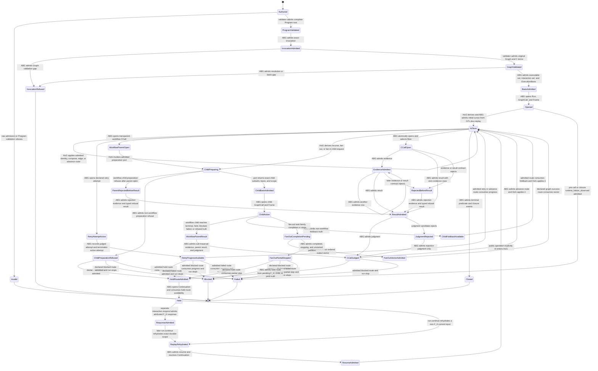
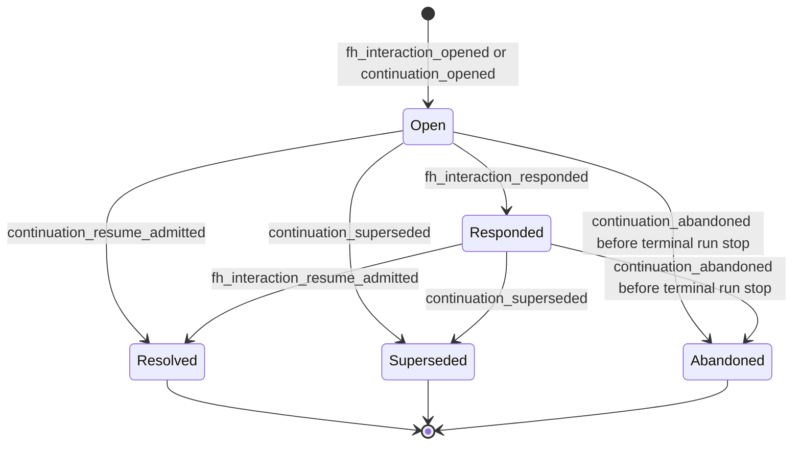

# M05 Direct GTL Traversal Expansion Design

**Status**: M5 base accepted at `d6da4269`; Section 12 is the co-evolving
T-272 affected-boundary design. Acceptance is subsection-scoped and recorded
by T-272 and its exact decision receipts; implementation beyond the latest
accepted subsection remains held.
**Date**: 2026-07-22
**Section 12 updated**: 2026-07-25
**Parent design**:
`M03_DIRECT_GTL_TRAVERSAL_BEHAVIOR_DESIGN.md`, accepted SHA-256
`9faeb41ddac839edc9cd2ccb83ae11b05bb54d32168fc35e74a1a9cfb97e92f0`
**Product boundary**: `A5-F02`, `A5-F03`, `A5-F04`, `A5-F09`, `A5-F10`,
`A5-F14`; enables later `A5-F07`, `A5-F08`, `A5-F12`, and `A5-F17`
**Scenario boundary**: completed `ABG5-S02`; Section 12 advances `ABG5-S03`
**Work owner**: T-270 parent; T-272 for Section 12
**Sequencing**: co-evolution inside the decisions fixed here; a newly exposed
material authority or lifecycle ambiguity returns to design before promotion

## 1. Decision

M5 extends the installed M4 root into a generic direct traversal without a
compiled execution carrier.

```text
admitted GTL Program and materialized Graph
  -> non-lowering validation of graph and C terms
  -> ABG-admitted invocation, executable-resolution set, and F_H contract set
  -> HoG cursor derived from the original GTL value plus replay
  -> direct traversal of graph relations and seven C constructors
  -> declared implementation port at each F_D/F_P leaf or admitted F_H interaction boundary
  -> ABG evidence, result, judgment, route, continuation, and closure admission
  -> replay-derived state and public outcome
```

The accepted M3 authority split remains unchanged:

- GTL owns graph topology, C terms, callable relations, contracts, and routes.
- The validator owns closed static judgments and never lowers GTL.
- Product projection proposes exact implementation matches from the admitted
  catalog.
- ABG admits invocation, executable matches, F_H contract rows, runtime facts,
  and closure.
- HoG traverses the original admitted GTL and applies only ABG-admitted routes.
- Implementations own F_D/F_P leaf interiors only.
- Public SDK and CLI transport public operations and project replay truth.

No generated program, compiled C plan, normalized executable declaration,
feature runner, implementation selector, scheduler, or controller is added.

## 2. Scope And Non-Scope

### In scope

1. The seven-constructor C declaration family:
   `C.of`, `C.id`, `C.compose`, `C.edge`, `workflow.C`, `C.batch`, and
   `C.retry`.
2. Graph traversal over declared nodes and vectors, including child
   GraphFunction traversal and declared GraphFunction applications.
3. A complete per-invocation executable-resolution set and a distinct complete
   F_H interaction-contract set admitted before HoG enters the graph.
4. General C-call locus identity across source path, task ordinal, attempt,
   retry path, and graph-call lineage. Compute fibre remains selected interior
   truth and never enters C-call identity.
5. Deterministic and probabilistic leaf ports plus a distinct typed external
   human-hold boundary that invokes no implementation.
6. Durable event-log reopening sufficient for same-run continuation.
7. Data-driven traversal and fibre-substitution proof rows.
8. Removal of the current GTL and validator dependency on Product utility
   modules.

### Deferred to existing owners

| Boundary | Owner |
|---|---|
| One Surface semantic program and F_H interaction policy | T-272 |
| Consensus declarations and result semantics | T-274, T-275, T-276 |
| complete public projection and downstream flavored catalog | T-281 |
| observer and tuner | T-268 |
| qualification and release | T-247, T-248 |

The generic carriers and lifecycle required by those slices are in scope.
Their domain programs are not.

### Requirement trace for this delta

| Boundary | Governing requirement or accepted design |
|---|---|
| transparent workflow parent call | `REQ-L-GTL3-C-ALGEBRA-006`; `REQ-R-ABG3-CCALL-013` |
| executable versus F_H leaf identity | `REQ-L-GTL3-C-ALGEBRA-010`; `REQ-R-ABG3-CCALL-003` |
| authoritative durable continuation | `REQ-R-ABG3-CONTINUATION-001..014`; `REQ-P-POLICY-024`, `-031..033` |
| ordered batch and fan-out | `REQ-L-GTL3-C-ALGEBRA-007`; `REQ-L-GTL3-HOF-009..012` |
| durable append-context reopening | `REQ-R-ABG3-EVENTS-024`, `-027`, `-028` |
| fan-out completion and partial stop | `REQ-L-GTL3-HOF-010`; `REQ-R-ABG3-EVENTS-002`, `-011` |
| continuation ingress authority | `REQ-P-POLICY-024`; `REQ-R-ABG3-EVENTS-031` |
| child module topology | accepted M3 design Section 8 dependency law and Section 9.2 operation composition |
| event and replay closure | `REQ-R-ABG3-EVENTS-002`, `-004`, `-011`, `-018`, `-024`, `-029` |

## 3. Ontology Delta

This is an affected slice of the accepted M3 Ontology. The M3 Prime families
remain authoritative. M5 adds variants and relations inside those families; it
does not add a peer authority.

### 3.1 Entities And Relationships

| Identity | M3 family | Authority | Relationship |
|---|---|---|---|
| `CProgramTerm` | `GtlDeclarationFamily` | GTL | One closed discriminated term built from exactly seven constructors. |
| `CLeafTerm` | `GtlDeclarationFamily` | GTL | One `C.of` locus with role, fibre, arm, carriers, and judgment refs. An F_D/F_P leaf carries an executable requirement; an F_H leaf carries an interaction requirement. |
| `ExecutableLeafRequirement` | `GtlDeclarationFamily` | GTL | Stable F_D/F_P requirement key over the locus, binding, and executable seam contracts. |
| `InteractionLeafRequirement` | `GtlDeclarationFamily` | GTL | Stable F_H requirement key over the locus, interaction kind, actor-capability, request, response, and continuation contracts; it has no implementation binding. |
| `GraphTemplate` | `GtlDeclarationFamily` | GTL | Complete immutable graph with boundary nodes, nodes, vectors, contexts, rules, effects, tags, and one C term at each compute locus. |
| `GraphFunctionApplication` | `GtlDeclarationFamily` | GTL | One declared graph relation for composition, substitution, recursion, fan-out, fan-in, gate, promote, identity, or same-object identity. |
| `ValidatedTraversalDeclaration` | `ValidationFamily` | validator | Exact static judgment over Program, GraphFunction, materialized Graph, C terms, contracts, and implementation declarations. |
| `AdmittedImplementationSet` | `InvocationBasis` | ABG | Complete one-to-one admitted resolution for every statically reachable F_D/F_P leaf key under the validated root; child bases consume exact graph-local subsets. |
| `AdmittedInteractionSet` | `InvocationBasis` | ABG | Complete admitted F_H interaction-contract rows for every statically reachable F_H key; no row is executable. |
| `ChildTraversalPreparationPort` | `InvocationBasis` | stateless operation composition over GTL, validator, and ABG owner ports | Total preparation of one GTL-declared child into validated Graph, exact admitted child subsets, ExecutionBasis, and opened scope; it neither selects the child nor re-resolves Product catalog truth. |
| `TraversalCursor` | `TraversalAggregateFamily` | HoG under admitted scope | Subordinate position derived from original GTL plus replay; never authored or published as a program. |
| `TraversalStep` | `TraversalAggregateFamily` | HoG proposal | One derived structural step: pass identity, enter term, open leaf, enter child, start task, retry, advance graph, hold, or terminal. |
| `LeafExecutionPort` | `LeafRealizationBoundary` | admitted implementation seam | Exact `F_D` or `F_P` function addressed by one admitted resolution; no event or transition authority. |
| `HumanInteractionBoundary` | external actor, outside the IACS | direct or lawfully proxied F_H | Receives an attributed request and returns a response candidate; it is not an implementation binding or executable port. |
| `RouteCandidate` | `TraversalAggregateFamily` | declared implementation or HoG proposal | Candidate consequence constrained to GTL-declared routes. |
| `AdmittedRoute` | `RuntimeEventFamily` | ABG | Canonical event truth accepting one route on current replay and authority basis. |
| `FanOutCompletion` | `RuntimeEventFamily` | ABG | Frame-local authoritative completion truth with disjoint `complete_vector` and `partial_stop` variants; Vector is never an aggregate. |
| `Continuation` | `TraversalAggregateFamily` | ABG | Authoritative run-local open obligation with open, resolved, superseded, and abandoned lifecycle truth. |
| `ContinuationBasis` | `ReplayProjectionFamily` | ABG replay | Downstream held cursor, response contract, authority, and event-log identity derived from admitted events. |
| `ReopenedEventStoreContext` | `RuntimeEventFamily` | ABG event-store boundary | One exclusive live append context seeded from a verified existing durable log without restamping historical events. |
| `ReplayState` | `ReplayProjectionFamily` | downstream | Complete state derived only from admitted events. |

### 3.2 Invariants And Cardinality

1. A `CProgramTerm` has exactly one constructor discriminant.
2. A `C.of` has one C-call spine. `C.id` has none. Structural constructors do
   not fabricate C calls.
3. `C.compose` is canonically flat: construction flattens nested composition
   syntax into one ordered non-empty term family while preserving each original
   leaf. `C.compose` and `C.edge` preserve exact carrier continuity.
4. `workflow.C` names one admitted child GraphFunction and is one transparent
   parent C call. ABG opens and selects that parent C call before child
   preparation. The child GraphCall and Frame remain under the same run. Child
   completion, block, failure, refusal, or hold becomes `sub_traversal`
   evidence followed by exactly one parent result and judgment for that
   attempt. Preparation rejection totalizes the already-open parent C call.
5. `C.batch` contains a non-empty ordered task family with equal outer carrier
   and per-task result cardinality. Each task retains its own C-call, result,
   and judgment. The batch ref groups ordered per-task rows; it is not a
   synthetic aggregate call or result.
6. `C.retry` has a positive budget and repeats the same declared term with a
   fresh positive attempt coordinate. Retry is not graph recursion.
7. Every reachable `F_D` or `F_P` effectful leaf has exactly one admitted
   implementation resolution before HoG entry. Zero or multiple matches
   refuse. An `F_H` leaf instead has one declared interaction and response
   contract and no implementation resolution.
8. An executable requirement key is the stable digest of Program,
   GraphFunction, GraphFunction digest, program locus, role, fibre, arm,
   binding, and executable seam contract refs. An interaction requirement key
   replaces binding and executable contracts with interaction kind,
   actor-capability, request, response, and continuation contract refs. The
   key families are disjoint and exhaustive.
9. The validated transitive root declares complete executable and interaction
   key sets. Child validation declares exact graph-local subsets of both.
   Child basis admission requires equality against matching rows already
   admitted in the corresponding root set. Missing, extra, cross-family,
   drifted, or ambiguous rows refuse before child HoG entry.
10. Fibre substitution changes only the leaf interior, evidence class, and the
    applicable executable or interaction requirement. Topology, source path,
    C-call spine order, and continuation law remain unchanged.
11. A HoG cursor is reproducible from `(admitted GTL, opened scope, replay)`.
   Ambient process memory cannot be required for continuation.
12. A route is applicable only when declared by the current GTL boundary and
    admitted by ABG against current replay.
13. Once a C call opens, every success, failure, malformed result, admission
    rejection, child outcome, or hold completes the inherited M3 spine for that
    attempt through one result-admitted row and one judged row. Only pre-call
    refusal may terminate without a C call. A resumed child or F_H obligation
    uses a fresh attempt coordinate and cannot append a second result to the
    completed pending attempt.
14. Public outcome is replay projection. A worker, test, CLI, or implementation
    cannot author result, continuation, or closure truth.
15. Durable reopening preserves every historical canonical envelope byte,
    `eventId`, payload digest, and admission ordinal. Historical ordinals are the
    unique gap-free sequence `1..n`; the reopened live context owns the same
    sink and stamps its first new event at `maxOrdinal + 1`. Reopening never
    truncates, rewrites, reorders, or re-admits historical truth.
16. Fan-out completion is exactly one discriminated ABG admission. A complete
    variant contains every task exactly once in input ordinal order and one
    contract-valid output vector. A partial-stop variant partitions the input
    tasks into completed rows, exactly one stopping task/ordinal, and exact
    unstarted rows, and contains no output vector.

### 3.3 Lifecycle Completeness

| Entity | Initial | Lawful next states | Terminal or refusal |
|---|---|---|---|
| authored GTL | authored | raw admitted, invalid | invalid |
| admitted GTL | admitted | validated, semantic gap | invalid or unresolved |
| invocation basis | raw input and Program validated | invocation admitted, Graph materialized and validated, executable and interaction sets admitted, exact basis admitted | `invocation_refused` after invocation admission; typed refusal before it |
| traversal | opened | at term, at leaf, child, retry, next node, held | blocked, failed, closed |
| C call | atomically opened and fibre selected | evidenced, result admitted, judged | judged success, failure, refusal, pending, blocked, or escalation; never stranded |
| child traversal | opened | traversing, folded back | blocked, held, failed, closed |
| fan-out completion | declared ordered tasks | task truth accumulating | complete vector admitted or partial stop admitted |
| continuation | opened from admitted hold | open, responded, resume admitted | resolved, superseded, or abandoned |
| durable event store | absent or verified historical log | exclusive append context open | append context closed or reopen refused |
| run | active | active, held, blocked, failed | closed or stopped with an admitted terminal disposition |

The affected entity closure is explicit below. Immutable declaration and
judgment carriers retire by supersession or invocation completion, not mutation.

| Entity | Create / admit | Read / project | Transition / execute | Retire / terminal |
|---|---|---|---|---|
| `CProgramTerm` | GTL constructor or raw admission | validator and HoG read original term | HoG folds without rewriting | declaration version supersedes |
| `CLeafTerm` | `C.of` or raw admission | validator derives one executable or interaction key | exact admitted port or F_H hold | owning term supersedes |
| `ExecutableLeafRequirement` | GTL declaration and validation | Product resolves and ABG admits matching row | exact admitted implementation only | invocation terminal or declaration supersession |
| `InteractionLeafRequirement` | GTL declaration and validation | ABG admits exact non-executable contract row | F_H request and response admission only | continuation terminal or declaration supersession |
| `GraphTemplate` | GraphFunction publication | materialization and validation | pure materialization only | GraphFunction version supersedes |
| `GraphFunctionApplication` | GTL graph algebra | validator and HoG read relation | HoG proposes only declared child/route work | owning declaration supersedes |
| `ValidatedTraversalDeclaration` | validator closed judgment | Product, ABG, and audit read exact digest | never executes | invocation ends or subject digest changes |
| `AdmittedImplementationSet` | ABG admits exact validated root set | root and child basis admission read keyed rows | never selects or executes | invocation terminates |
| `AdmittedInteractionSet` | ABG admits exact validated root interaction set | root and child basis admission read keyed rows | never invokes a human or HoG | invocation terminates |
| `ChildTraversalPreparationPort` | operation application binds owner functions once | HoG calls it with a GTL-selected child and admitted parent sets | GTL materializes, validator judges, ABG admits; Product is not called | returns one prepared child or typed refusal |
| `TraversalCursor` | HoG derives from GTL, scope, and replay | HoG reads current derived position | replaced only after an admitted event/route | next cursor or terminal event supersedes |
| `TraversalStep` | HoG derives one total step | ABG evaluates candidate against scope | HoG executes only after required admission | accepted, refused, or superseded by newer replay |
| `LeafExecutionPort` | package plus implementation binding admission | HoG addresses exact admitted port | implementation realizes F_D/F_P interior | call or invocation terminates |
| `HumanInteractionBoundary` | GTL declares callout and ABG admits hold | public projection renders pending interaction | attributed external actor returns candidate | response admitted, rejected, abandoned, or superseded |
| `RouteCandidate` | HoG or declared implementation proposes within GTL route set | ABG evaluates against replay | never applies itself | admitted, refused, or superseded |
| `AdmittedRoute` | ABG admits canonical route event | replay projects route truth | HoG deterministically applies exact admitted route | next admitted route or terminal event supersedes it |
| `FanOutCompletion` | ABG admits one closed completion variant | replay projects ordered vector or partial-stop facts | only a later declared route may consume it | owning frame or run terminal |
| `Continuation` | ABG admits an opening lifecycle event | replay projects exactly one run-local member | only separate response and continuation operations may advance it | resolved, superseded, or explicitly abandoned before run termination |
| `ContinuationBasis` | replay derives open obligation | public read and `run.continue` consume exact basis | never invokes HoG itself | resolved, superseded, abandoned, or run terminal |
| `ReopenedEventStoreContext` | ABG validates an existing log and acquires exclusive append ownership | replay and event admission read the exact seeded prefix | new events append at the next ordinal only | context closes; historical log remains immutable truth |
| `ReplayState` | pure fold of admitted event log | HoG and public projections read | never writes events or executes work | superseded by a longer valid prefix |

### 3.4 Authority Matrix

| Function | Proposer | Evaluator | Verifier | Executor | Projector | Admitter / truth owner | Retirement |
|---|---|---|---|---|---|---|---|
| construct C or graph relation | GTL author | TypeScript and validator | validator | pure GTL constructor | validation report | raw admission and closed static judgment | declaration supersession |
| resolve leaf implementation | Product catalog projection | validator | ABG basis checks | none | invocation replay | ABG; F_D and F_P only | invocation terminal |
| admit F_H interaction contracts | GTL plus validator | validator | ABG basis checks | none | invocation replay | ABG; F_H only | invocation terminal |
| prepare child traversal | HoG supplies only GTL-declared child ref and input | fixed operation-bound port invokes GTL and validator owners | ABG checks parent scope and exact root-set subsets | stateless port composition | prepared-child result | ABG owns admitted child basis and scope | child terminal or parent invocation terminal |
| derive next structural cursor | HoG | GTL relation plus replay | ABG scope identity | HoG after required admission | replay cursor | no new truth until route admission | next admitted event |
| realize leaf interior | admitted F_D or F_P implementation | result contract | ABG result checks | exact implementation port | replayed C-call | ABG | judged C call or invocation terminal |
| request or answer human work | HoG proposes declared hold; attributed human answers | declared interaction and response contracts | F_H authority and replay basis | external human only | continuation and public interaction views | ABG | resolved, rejected, abandoned, or superseded continuation |
| choose consequence candidate | declared implementation or HoG from declared relation | GTL route set | ABG current replay | none | route diagnostic | ABG | admission, refusal, or newer replay |
| apply transition | admitted route | GTL cursor relation | replay | HoG | replay cursor | ABG event is prior truth | next cursor or terminal event |
| admit fan-out completion | HoG submits task-result census | declared vector and task contracts | ABG checks exact ordinal partition and current replay | none | ordered vector or partial-stop projection | ABG | owning frame or run terminal |
| totalize post-open rejection | actual contract rejection | refusal and rejection contracts | current C-call spine | ABG appends only missing suffix | replayed rejected C-call | ABG | judged rejection |
| respond to hold | attributed F_H actor | declared response and capability contracts | ABG verifies open continuation and replay basis | `interaction.respond` only admits response truth | responded interaction view | ABG | response consumed, rejected, or continuation terminal |
| reopen durable truth | caller supplies existing sink and expected digest | canonical log grammar and event union | ABG validates immutable stamps, ordinal order, causation, scope, and exclusive append ownership | event store seeds one live context without emitting | replay prefix and next ordinal | ABG event-store boundary | context closes or reopen refuses |
| continue held run | admitted `run.continue` ingress names existing run/continuation, actor, capability, and input | declared continuation contract | ABG uses the reopened context to verify exact durable scope and public authority | `run.continue` explicitly re-enters HoG after resume admission | continuation and replay views | ABG | resolved, superseded, abandoned, or run terminal |
| close | HoG submits current judged terminal | closure predicate | replay and exact contracts | ABG appends closure transaction | replay and PublicOutcome | ABG | immutable terminal run |

## 4. Function And Composition Derivation

### 4.1 Atomic function families

| Family | Input -> output | Owner |
|---|---|---|
| `constructC` | typed constructor arguments -> canonical `CProgramTerm` | GTL |
| `rawAdmitProgram` | erased Program, GraphFunction, Graph, and C data -> admitted declarations or typed refusal | raw admission |
| `validateProgram` | admitted whole root -> Program validation or typed gap | validator |
| `materializeGraph` | admitted GraphFunction plus admitted input -> original GTL Graph candidate | GTL |
| `validateTraversal` | materialized Graph plus Program validation -> static Graph/C validation or typed gap | validator |
| `resolveImplementations` | catalog view plus reachable executable keys -> candidate set or typed gap | Product projection |
| `admitImplementationSet` | candidate set plus invocation basis -> admitted set or refusal | ABG |
| `admitInteractionSet` | validated reachable F_H contract rows plus invocation basis -> admitted non-executable set or refusal | ABG |
| `prepareChildTraversal` | GTL-declared child ref, admitted child input, parent scope, root executable set, and root interaction set -> prepared child with original Graph, validation, exact admitted subsets, ExecutionBasis, and opened scope, or typed refusal | stateless operation-bound port over GTL, validator, and ABG owner functions |
| `reopenEventStore` | existing durable log path, expected log digest, and immutable event-contract basis -> exclusive `ReopenedEventStoreContext` seeded with exact historical envelopes and next ordinal, or typed refusal | ABG |
| `deriveTraversalStep` | GTL plus scope plus replay -> structural step | HoG |
| `invokeLeafPort` | admitted F_D/F_P leaf input -> evidence and result candidates | implementation seam |
| `admitHumanHold` | declared F_H locus plus replay -> admitted hold event and continuation projection | ABG |
| `admitInteractionResponse` | public `interaction.respond` candidate plus open continuation -> actor-attributed response truth or refusal; never invokes HoG | ABG |
| `rehydrateContinuation` | reopened event-store context plus immutable Product/workspace/catalog/declaration basis and continuation identity -> owner-validated replay, ExecutionBasis, opened scope, cursor, and input, or typed basis-fork/refusal | ABG |
| `continueExecution` | admitted public `run.continue` operation, acting operator/capability, declared input, rehydrated scope, and admitted response when required -> resume admission and explicit HoG re-entry | public operation over ABG and HoG ports |
| `admitLeafTruth` | candidates plus contracts -> admitted C-call truth or rejection | ABG |
| `admitFanOutCompletion` | declared fan-out application, ordered task census, current replay, and candidate complete vector or partial stop -> authoritative discriminated completion event or typed refusal | ABG |
| `completeRejectedCCall` | opened C call plus current spine position plus actual admission rejection -> only the missing suffix: rejection evidence and typed refusal result before result admission, then rejection judgment; judgment only after result admission | ABG |
| `admitRoute` | route candidate plus current replay -> admitted route or refusal | ABG |
| `applyRoute` | admitted route plus GTL cursor -> next cursor | HoG |
| `rehydrateReplay` | reopened event-store context with verified historical prefix -> replay state | ABG |

### 4.2 Higher-order composition

`traverseC` is the direct fold over the original `CProgramTerm`. It composes
the atomic families above and is parameterized by admitted ports. It does not
produce or consume another program value.

`traverseGraph` composes `traverseC` with declared graph vectors and admitted
routes. `workflow.C`, recursion, fan-out, and fan-in reuse `traverseGraph` at a
child scope prepared through `ChildTraversalPreparationPort`. Batch and retry
reuse `traverseC` with task and attempt coordinates. None owns a parallel
runtime.

### 4.3 Whole-family Prime contraction

Candidate alternatives were:

1. one interpreter or runner per C constructor;
2. a lowered normalized execution plan;
3. one generic direct fold over the original GTL term;
4. feature-owned controllers for workflow, batch, retry, and recursion.

Only option 3 preserves one program identity and one traversal authority. The
M3 Prime set therefore remains eight families. This delta adds subordinate
variants to `GtlDeclarationFamily`, `InvocationBasis`, and
`TraversalAggregateFamily`; it adds no ninth authority family and no second
authoring surface.

## 5. Irreducible Architectural Carrier Set Delta

The accepted M3 IACS remains the complete eight-family carrier set. This table
classifies only M5 members and payloads inside those families; no row is a ninth
Prime family.

| Carrier | Parent M3 IACS family | Classification | Module | Purpose |
|---|---|---|---|---|
| `CProgramTerm` | `GtlDeclarationFamily` | `<<subordinate>> <<authoritative>>` | `src/gtl` | Original seven-constructor program data. |
| `GraphFunctionApplication` | `GtlDeclarationFamily` | `<<subordinate>> <<authoritative>>` | `src/gtl` | Original graph-algebra relation data. |
| `TraversalValidation` | `ValidationFamily` | `<<subordinate>> <<authoritative>>` | `src/validator` | Static closed judgment; never executable. |
| `AdmittedImplementationSet` | `InvocationBasis` | `<<authoritative>>` | `src/abg` | Invocation-bound complete executable-leaf realization basis. |
| `AdmittedInteractionSet` | `InvocationBasis` | `<<authoritative>>` | `src/abg` | Invocation-bound F_H request, response, capability, and continuation contract basis; never executable. |
| `ChildTraversalPreparationPort` | `InvocationBasis` | `<<effect-edge>>` | operation application over `src/gtl`, `src/validator`, and `src/abg` owner ports | Total child preparation without HoG-to-Product or HoG-to-validator dependency. |
| `TraversalCursor` | `TraversalAggregateFamily` | `<<subordinate>>` | `src/hog` | Derived, invocation-local position. |
| `TraversalStep` | `TraversalAggregateFamily` | `<<subordinate>>` | `src/hog` | Exhaustive direct-fold result. |
| `LeafExecutionPort` | `LeafRealizationBoundary` | `<<effect-edge>>` | `src/implementation` | Bound F_D or F_P leaf effect interior. |
| `HumanInteractionBoundary` | external actor, not IACS | `<<effect-edge>>` | external plus `src/abg` admission | F_H request and attributed response candidate; never an implementation port. |
| `AdmittedRoute` | `RuntimeEventFamily` | `<<authoritative>>` | `src/abg` | Accepted runtime transition event. |
| `FanOutCompletion` | `RuntimeEventFamily` | `<<subordinate>> <<authoritative>>` | `src/abg` | Frame-local complete-vector or partial-stop truth; never a Vector aggregate. |
| `Continuation` | `TraversalAggregateFamily` | `<<authoritative>>` | `src/abg` | Run-local open obligation and exact terminal lifecycle truth. |
| `ContinuationBasis` | `ReplayProjectionFamily` | `<<downstream>>` | `src/abg` | Events-only hold and resume projection. |
| `ReopenedEventStoreContext` | `RuntimeEventFamily` | `<<effect-edge>>` | `src/abg` | Exclusive append context over one verified durable event prefix; no new authority family. |
| `ReplayState` | `ReplayProjectionFamily` | `<<downstream>>` | `src/abg` | Events-only runtime projection. |

Canonical JSON, digest, immutable-value, and opaque-ref utilities move to
`src/shared`. They are pure implementation primitives, not Ontology carriers,
program meaning, or admission authority. `gtl` and `validator` may depend on
`shared`; `product` consumes them rather than owning them.

## 6. Direct Traversal Semantics

| Constructor | HoG relation | ABG truth |
|---|---|---|
| `C.of` | derive one leaf stop at exact term path and invoke exact admitted port | uniform C-call spine |
| `C.id` | pass admitted input unchanged | no C-call and no fabricated gate pass |
| `C.compose` | traverse the canonical flat term family in order, binding each admitted output into the next term | each child retains its own truth |
| `C.edge` | traverse transform, evaluate, consequence in declared order | ordinary child C calls; no edge runner |
| `workflow.C` | open one transparent parent C call, prepare/open/traverse the named child, then complete the parent attempt | child lineage plus `sub_traversal` evidence, one parent result and judgment, and admitted foldback; preparation rejection totalizes the parent spine |
| `C.batch` | traverse the declared non-empty task family in stable ordinal order; concurrency is optional realization | one C-call, result, and judgment per task plus a non-authoritative grouping ref and ordered per-task result projection; no synthetic aggregate result |
| `C.retry` | traverse wrapped term until success, non-retry disposition, or budget | fresh attempt identity, admitted retry route, retained prior evidence |

An `F_H` `C.of` follows the same C-call locus and selected-fibre event shape but
does not call `LeafExecutionPort`. Its request invocation completes the uniform
spine with a typed pending result and pending judgment, from which ABG event
truth opens the authoritative `Continuation` aggregate. A later
`interaction.respond` operation admits an attributed response against that
exact continuation and response contract but does not invoke HoG. A separate
`run.continue` operation rehydrates the durable scope, admits resume truth, and
then explicitly re-enters HoG. It does not append a second result or judgment
to the completed request C call. T-272 owns the domain interaction policy and
the exact continued GTL locus.

`workflow.C` follows the same parent-level law. It first opens a transparent
parent C call, then traverses its prepared child. A terminal child produces
`sub_traversal` evidence and the one parent result and judgment. A rejected
child preparation totalizes the parent call from the actual rejection. A held
child completes that parent attempt with pending evidence, result, and
judgment, and opens a continuation. Resumption uses a fresh positive parent
attempt coordinate, consumes the replay-derived child completion, and never
re-executes a closed child or appends to the prior pending C call.

The source path is a stable sequence of segments rooted at the graph node:

```text
node/<node-ref>/c
  /terms/<zero-based-ordinal>
  /transform | /evaluate | /consequence
  /tasks/<zero-based-ordinal>
  /term
```

The path is identity input, not a compiled node. HoG reads the term at that
path from the admitted materialized Graph each time it derives a step.

### 6.1 Graph algebra projection

The complete `GraphTemplate` preserves the constitutional Graph fields. Graph
algebra operations remain GTL constructors. Runtime traverses their resulting
declared relation; it does not infer or reconstruct the operation.

| Relation | GTL construction truth | Direct runtime meaning |
|---|---|---|
| `edge` | one explicit GraphVector between typed boundary nodes | traverse source locus, declared vector relation, then target locus |
| `identity` | graph or GraphFunction preserving one interface | pass admitted value with no fabricated check or effect |
| `compose` | one application relation and materialized composed graph with exact interface wiring | traverse declared left then right child relation |
| `substitute` | outer graph with one exact vector replaced by visible interface-compatible inner graph | traverse the resulting graph; provenance retains outer vector and inner graph refs |
| `recurse` | callable relation with termination, foldback, and positive bound | open child graph calls until admitted termination; foldback rebinds and re-evaluates parent |
| `fan_out` | element GraphFunction plus explicit ordered input/output vector relation | pure GTL materialization projects one `C.batch` task per admitted input member before child HoG entry; each task retains ordinal, member lineage, child GraphFunction, contracts, and enclosing C authority; ABG admits exactly one complete-vector or partial-stop event after task traversal |
| `fan_in` | reducer GraphFunction plus complete vector contract | invoke one child reducer only after complete vector admission |
| `gate` | target, rule, and evaluator refs | admit block or advance from evaluator truth; never select a candidate |
| `promote` | explicit representation-boundary relation | apply the declared typed relation without changing semantic identity |
| `same_object` | exact identity witness | no runtime work; validator proves identity |

Composition, substitution, promotion, identity, and same-object are normally
resolved by typed construction and validation into the materialized original
GTL value. Recursion, fan-out, fan-in, and gate retain explicit runtime-visible
application declarations because they govern child traversal or admission.
Every child GraphFunction reachable through those declarations is included in
whole-root validation and the transitive executable and interaction censuses
before root HoG entry. Dynamic selection may choose only among that statically admitted
reachable set. A selected child is materialized and its exact call/frame basis
is admitted before child HoG entry; the root set is not a substitute for that
child invocation-local admission.

The mapping is decidable:

```text
keys(rootExecutableSet.rows) == rootValidation.transitiveReachableExecutableLeafKeys
keys(rootInteractionSet.rows) == rootValidation.transitiveReachableInteractionLeafKeys
childExecutableKeys == childValidation.reachableExecutableLeafKeys
childInteractionKeys == childValidation.reachableInteractionLeafKeys
childExecutableRows == rootExecutableSet.rows filtered by childExecutableKeys
childInteractionRows == rootInteractionSet.rows filtered by childInteractionKeys
keys(childExecutableRows) == childExecutableKeys
keys(childInteractionRows) == childInteractionKeys
```

Every filtered row retains its owning root-set ref and digest plus its typed
key. The child `ExecutionBasis` binds both root-set refs/digests, both exact
child-set digests, the child GraphFunction and materialization digests, and the
child validation ref. F_H rows never enter an implementation set. This is
invocation-local admission of already resolved declarations, not ambient
selection or a second implementation-resolution authority.

Child preparation preserves the accepted M3 topology. The stateless operation
application binds `ChildTraversalPreparationPort` once from the GTL
materializer, validator judgment, and ABG admission functions and supplies the
total port to HoG. HoG sends only the GTL-declared child ref, admitted child
input, parent scope, and admitted root sets. It receives one
`PreparedChildTraversal` or typed refusal. HoG never imports or invokes Product
or validator, Product never re-resolves the admitted root set during traversal,
and the port cannot select a child or author topology.

For fan-out, the ordered task declarations are fixed before the first task
enters HoG. After traversal, `admitFanOutCompletion` compares the declared input
cardinality against the full replayed task census. The `complete_vector` variant
requires one judged task row and one contract-valid output member at every
ordinal and admits the canonical ordered output vector. The `partial_stop`
variant requires exact completed, stopping, and unstarted partitions and
forbids an output-vector field. Either admission precedes any fan-in or graph
success route; only `complete_vector` can make those routes applicable.

### 6.2 Preserved M3 admission staging

M5 widens cardinality without collapsing the accepted M3 stages:

```text
raw input and complete Program root admitted
  -> ProgramValidation
  -> InvocationAdmission
  -> GraphFunction materialization from admitted input
  -> GraphValidation over the original materialized Graph and C terms
  -> Product proposes the complete reachable F_D/F_P implementation set
  -> validator checks declaration, package, and contract relations
  -> validator emits the complete reachable F_H interaction-contract set
  -> ABG admits both disjoint sets and the exact ExecutionBasis
  -> ABG opens Run, GraphCall, and Frame
  -> HoG enters the original GTL
```

A refusal after `InvocationAdmission` is admitted as `invocation_refused` and
projects through replay. A refusal before it returns the typed pre-invocation
result. Neither path can enter HoG. After a C call opens, an actual contract or
candidate rejection is totalized by `completeRejectedCCall`; direct transition
to `Blocked` or `Failed` without `result_admitted -> judged` is prohibited.

### 6.3 Durable continuation reconstruction

Durability belongs to the admitted event log and immutable declaration basis,
not to process-local brands, closures, weak sets, or object identity. Reopening
first constructs the event append context; continuation carriers are rebuilt
only inside that context.

`reopenEventStore` consumes an existing durable path, the expected complete-log
digest projected by the current `ContinuationBasis`, and the immutable
event-contract basis. A caller may echo that digest but cannot select another
one. The function:

1. opens the existing sink without create or truncate and acquires exclusive
   append ownership for the context lifetime;
2. reads the complete canonical JSON-lines prefix, requiring a terminal newline
   and rejecting a partial or non-canonical record;
3. validates every preserved envelope against the selected event union,
   recomputes its payload digest and event id using its preserved ordinal, and
   requires unique event ids plus the exact gap-free ordinal sequence `1..n`;
4. validates every historical causation ref against an earlier event in the
   same prefix and re-applies the canonical scope and cross-run rules;
5. compares the canonical prefix digest and file identity/length with the
   requested basis, then seeds one `ReopenedEventStoreContext` with those exact
   frozen historical envelopes and the same durable path; and
6. sets the live admission cursor to `maxOrdinal` (`0` for an empty existing
   log). The next candidate is store-stamped at `maxOrdinal + 1`, appended with
   append-only semantics, durably synchronized, and only then made visible to
   replay. Each append rechecks the owned file identity and expected prior
   length so a second writer or replaced sink fails closed.

No historical event passes through live admission, receives another stamp, or
is written again. Reopening itself emits no runtime event. It changes no fluent;
it validates and resumes the one canonical emitter context required to append
new truth. The context is operation-scoped and closes after its atomic admission
batch; a later public operation lawfully reopens the same verified prefix rather
than sharing ambient process state.

Initial invocation and later reopening are disjoint operations. Initial
invocation may create one absent sink with exclusive-create semantics. A
response or continuation operation must call `reopenEventStore` on that existing
sink and is forbidden from invoking the create-empty path.

An admitted `run.continue` public operation then supplies that reopened context,
the public-operation admission ref, continuation identity, expected run, acting
operator and capability, selected immutable Product/install/workspace/catalog
basis, and any declared continuation input. `rehydrateContinuation`:

1. replays exactly one run-local open `Continuation` with no resolved,
   superseded, or abandoned terminal event;
2. verifies its Product, workspace binding, catalog view, Program,
   GraphFunction, materialization, validation, executable-set,
   interaction-set, ExecutionBasis, Run, GraphCall, Frame, C-call, cursor,
   input, request, and response-contract refs and digests against the selected
   immutable declarations;
3. requires exactly one matching admitted response when the continuation kind
   requires F_H input;
4. verifies the `run.continue` public-operation event, acting operator,
   capability, continuation identity, and declared input against the open
   member and policy;
5. reconstructs fresh owner-issued `ExecutionBasis`, `OpenedTraversalScope`,
   cursor, and input carriers only after canonical body and digest equality;
   process-local branding is renewed evidence, never durable authority; and
6. appends `fh_interaction_resume_admitted` for F_H or
   `continuation_resume_admitted` for another declared continuation kind before
   `run.continue` explicitly re-enters HoG.

Missing bodies, log replacement, ordinal or stamp drift, stale or multiple open
members, wrong public operation, actor, capability, response contract, cross-run
identity, changed workspace/product/catalog authority, or another basis fork
refuses before HoG and appends no resume event. The `interaction.respond`
operation may obtain its own reopened append context, but its semantic admission
only appends actor-attributed response truth; it cannot reconstruct execution
carriers or perform continuation steps 1-6.

## 7. Three-View Projection

### 7.1 Domain view


### 7.2 Sequence view

| Participant | Domain identity or boundary |
|---|---|
| Caller | explicitly external actor |
| Attributed F_H Actor | explicitly external actor |
| Public | stateless public operation transport; no semantic carrier or state |
| Child Preparation Port | stateless operation-bound composition of GTL, validator, and ABG owner functions; no selection or state |
| GTL | `GtlDeclarationFamily`; materializes the published GraphFunction template |
| Validator | `ValidationFamily` |
| Product | `EnvironmentBasis` catalog projection; proposes implementation matches |
| ABG | `InvocationBasis`, `TraversalAggregateFamily`, `RuntimeEventFamily`, and `ReplayProjectionFamily` |
| HoG | subordinate `TraversalCursor` and `TraversalStep` under `TraversalAggregateFamily` |
| LeafExecutionPort | effect edge under `LeafRealizationBoundary` |

```mermaid
sequenceDiagram
  participant Caller
  participant Human as Attributed F_H Actor
  participant Public
  participant Prep as Child Preparation Port
  participant GTL
  participant Validator
  participant Product
  participant ABG
  participant HoG
  participant Port as LeafExecutionPort
  Caller->>Public: invoke exact Product, workspace, catalog, Program, and GraphFunction
  Public->>Validator: raw-admit input and validate complete Program root
  Validator-->>Public: ProgramValidation or typed refusal
  Public->>ABG: admit input, Program, function, environment, policy, and authority
  ABG-->>Public: InvocationAdmission or typed refusal
  Public->>GTL: materialize original Graph from admitted input
  GTL-->>Public: original GTL Graph candidate
  Public->>Validator: validate Graph plus C terms against ProgramValidation
  Validator-->>Public: TraversalValidation or typed gap
  alt Graph validation gap after InvocationAdmission
    Public->>ABG: admitInvocationRefusal with exact gap and stage
    ABG-->>Public: replay-derived invocation refusal
    Public-->>Caller: typed refused outcome
  else Graph validation admitted
    Public->>Product: resolve complete transitive executable-key set
    Product-->>Public: exact implementation candidates or typed gap
    Public->>Validator: validate executable matches and exact F_H contract-key set
    Validator-->>Public: validated disjoint executable and interaction sets or typed gap
    alt Resolution or candidate-validation gap
      Public->>ABG: admitInvocationRefusal with exact rejected stage
      ABG-->>Public: replay-derived invocation refusal
      Public-->>Caller: typed refused outcome
    else Candidate set validated
      Public->>ABG: admit executable set, interaction set, and exact ExecutionBasis
      ABG-->>Public: ExecutionBasis or replay-derived invocation refusal
      alt ABG basis admission refused
        Public-->>Caller: typed refused outcome
      else Exact root basis admitted
        Public->>ABG: open Run, GraphCall, and Frame
        ABG-->>Public: OpenedTraversalScope
        Public->>HoG: traverse original GTL with admitted ports
        HoG->>ABG: admit initial traversal_cursor_entered from original GTL and scope
        ABG-->>HoG: replay-derived active initial locus
        loop direct fold over GTL and current replay
        HoG->>HoG: derive TraversalStep from term and cursor
        alt F_D or F_P C.of
          HoG->>ABG: open exact CCall
          HoG->>Port: invoke admitted leaf interior
          Port-->>HoG: evidence and result candidates
          HoG->>ABG: admit evidence, result, and judgment
          ABG-->>HoG: replay-derived CCall truth or totalized missing suffix
        else F_H C.of
          HoG->>ABG: open exact CCall and submit pending suffix, GTL hold route, and Continuation
          ABG->>ABG: atomically append judgment, hold route, then caused continuation opening
          ABG-->>HoG: replay-derived held truth
          HoG-->>Public: typed held traversal stop
          Public-->>Caller: typed held outcome, current operation stops
          Human->>Public: later interaction.respond with attributed response candidate
          Public->>ABG: reopen existing durable sink without restamping
          ABG-->>Public: ReopenedEventStoreContext or typed refusal
          Public->>ABG: admit interaction.respond ingress with actor and capability
          ABG-->>Public: public-operation admission event
          Public->>ABG: admit response against exact open Continuation
          ABG-->>Public: actor-attributed response truth only
          Public-->>Human: typed response-admitted outcome
          Caller->>Public: later run.continue naming run, Continuation, actor, capability, and input
          Public->>ABG: reopen existing durable sink and preserve exact historical prefix
          ABG-->>Public: ReopenedEventStoreContext or typed refusal
          Public->>ABG: admit run.continue ingress with actor, capability, and input
          ABG-->>Public: public-operation admission event
          Public->>ABG: rehydrate replay and exact immutable authority basis in reopened context
          ABG->>ABG: reconstruct owner-issued basis, scope, cursor, and input and admit resume
          ABG-->>Public: RehydratedContinuationScope or typed basis-fork refusal
          Public->>HoG: explicitly re-enter exact cursor with admitted continued input
        else workflow.C
          HoG->>ABG: open transparent parent CCall with declared parent fibre and arm
          HoG->>Prep: prepare GTL-declared child using parent scope and admitted root sets
          Prep->>GTL: materialize original child Graph
          GTL-->>Prep: original child GTL value
          Prep->>Validator: validate child Graph and both exact child key subsets
          Validator-->>Prep: child TraversalValidation or typed gap
          Prep->>ABG: admit child subsets, ExecutionBasis, GraphCall, and Frame
          ABG-->>Prep: PreparedChildTraversal or admitted child refusal
          Prep-->>HoG: prepared child or typed refusal
          alt child preparation refused
            HoG->>ABG: totalize parent CCall from actual preparation rejection
          else child prepared
            HoG->>HoG: traverse named child GTL
            HoG->>ABG: admit sub_traversal evidence, parent result, and parent judgment
            ABG-->>HoG: complete transparent parent CCall truth
          end
        else recurse, fan_out, or fan_in child relation
          HoG->>Prep: prepare exact GTL-declared child application
          Prep-->>HoG: PreparedChildTraversal or typed refusal
          alt child preparation refused
            Prep->>ABG: admit child_preparation_refused under parent frame
            ABG-->>HoG: replay-derived refusal available to declared route evaluation
          else child prepared
            HoG->>HoG: traverse named child GTL or projected fan-out C.batch
            HoG->>ABG: admit child foldback candidate
            opt fan_out application completed or stopped
              HoG->>ABG: submit exact ordered task census and completion variant
              ABG-->>HoG: fan_out_completion_admitted or typed refusal
            end
          end
        else batch or retry
          HoG->>HoG: derive task or attempt cursor from declared term
        end
        opt branch has not already consumed an admitted hold or terminal route
          HoG->>ABG: propose declared consequence route when current replay permits
          ABG-->>HoG: admitted route or typed refusal
          HoG->>HoG: apply admitted route
        end
        end
        alt terminal
          HoG->>ABG: submit current closure candidate
          ABG-->>Public: admitted closure and replay
        else F_H hold or gap
          ABG-->>Public: replay-derived ContinuationBasis
        end
        Public-->>Caller: typed replay-derived outcome
      end
    end
  end
```



### 7.3 Lifecycle view



The lifecycle view above projects this exact run-local continuation substate:



## 8. Cross-View Axiom Evaluation

| Axiom | Ontology evidence | Authority | Domain | Sequence | State | Native enforcement | Admission enforcement | Verdict | Gap owner |
|---|---|---|---|---|---|---|---|---|---|
| original GTL is sole program | C term and application relations | GTL | declaration family | direct fold | authored to validated | discriminated unions | validation digest and basis | pass | none |
| no compiled execution carrier | Prime contraction | GTL and HoG | no plan carrier | original term consumed | no plan state | import and type boundary | rival-authority mutation | pass | none |
| seven constructors exhaustive | C invariant | GTL | `CProgramTerm` | exhaustive fold | structural loop | `never` exhaustiveness | raw admission and validator | pass | none |
| C-call identity is fibre-free | C-call locus invariant | ABG | `CLeafTerm` plus traversal aggregate | fibre selected only after open | one locus through every fibre | identity tuple omits regime | C-call open/select admission | pass | none |
| executable selection and F_H contract admission precede traversal | disjoint requirement and set relations | Product proposes executable matches; validator declares F_H rows; ABG admits both | executable and interaction sets | both admitted before HoG | basis refused or opened | disjoint key unions | exact transitive equality for both sets | pass | none |
| child basis is exact and local without topology drift | preparation-port and child-set equality laws | stateless port invokes GTL, validator, and ABG owners | root sets plus child validation | HoG calls one admitted preparation port | ChildPreparing to ChildActive | typed total port | child ExecutionBasis binds both root and child set digests | pass | none |
| post-invocation gaps are runtime truth | preserved M3 staging | ABG | InvocationBasis and RuntimeEventFamily | public submits typed gap to ABG | InvocationAdmitted to InvocationRefused | no validator event writer | `admitInvocationRefusal` | pass | none |
| uniform C-call spine | lifecycle matrix | ABG | traversal aggregate | leaf admission | open to judged | shared CCall API | replay-order checks | pass | none |
| workflow.C has one transparent parent spine | workflow invariant and lifecycle | ABG | parent CCall plus child scope | parent opens before preparation and completes after child outcome | WorkflowParentOpen through CCallJudged | parent attempt identity | sub_traversal evidence and exactly one parent result/judgment | pass | none |
| post-open rejection adds only missing suffix | rejection lifecycle and authority row | ABG | rejection candidate under C call | stage-sensitive totalizer | rejected-before-result or judgment-rejected to judged | spine-position union | exactly one result and judgment | pass | none |
| batch and fan-out preserve task cardinality | C.batch and fan-out laws | GTL, HoG, ABG | ordered task declarations plus `FanOutCompletion` | GTL projects batch, HoG traverses tasks, ABG admits complete or partial census | one task spine each then one completion variant | stable ordinal task union | exact complete-vector or completed/stopping/unstarted partition; no vector on partial stop | pass | none |
| fibre substitution preserves shape | fibre invariant | GTL declaration | same term topology | same fold | same lifecycle | generic leaf variant | differential proof | pass | T-270 proof |
| worker cannot mint truth | authority matrix | ABG | effect-edge port | candidates returned | no direct closed edge | port lacks event methods | candidate admission | pass | none |
| F_H is not an implementation or ABG callback | disjoint key sets and authority matrices | human, separate public operations, and ABG | interaction requirement plus Continuation | invoke stops, interaction.respond admits only response, run.continue rehydrates and re-enters HoG | Held through Responded, ReplayRehydrated, and ResumeAdmitted | no F_H implementation port and no ABG-to-HoG call | attributed response and resume admissions | pass | T-272 behavior |
| child traversal is transparent | relationship inventory | HoG plus ABG | child lineage | child scope and foldback | ChildActive | typed child relation | child basis and replay | pass | T-270 implementation |
| continuation is authoritative and replay-constructible | Continuation aggregate, reopened store, and basis relation | ABG | open obligation plus downstream basis and exact historical prefix | reopen without restamp, verify public ingress, reconstruct, then separate resume and HoG re-entry | open to resolved, superseded, or abandoned | preserved ordinals and owner constructors renewed only after equality | existing sink, max-plus-one append, immutable authority basis, and basis-fork refusal | pass | T-272 behavior |
| continuation resume is actor-authorized | public-operation and continuation relations | public ingress plus ABG | `run.continue` admission, actor, capability, and input | public admission precedes same-run resume event | reopened through ResumeAdmitted | typed operation and capability refs | exact ingress event is causal input to resume | pass | T-272 behavior |
| every new runtime fact has one event/effect law | RuntimeEventFamily delta | ABG | fixed event kinds and closed payload variants | append precedes downstream effect | every initiated active fluent has an explicit terminal consumer | closed event union | declared Event Calculus effect table and mutation proof | pass | none |
| public layer is not controller | unchanged M3 law | Product/ABG/HoG | no public Prime | one invoke call | no public private state | stateless operation types | public-controller mutation | pass | T-281 breadth |

## 9. Runtime Event And Replay Delta

M5 retains the accepted opening and closure kinds and extends the published
`RUNTIME_EVENT_KIND_VALUES` union with the new exact kinds below. The table
repeats existing opening kinds where their fluent effects participate in the
expanded lifecycle. It does not create another envelope or event family. Every row carries
the canonical envelope, a store-assigned admission ordinal, `basisId`, `runId`,
`graphFunctionRef`, `materializationRef`, `graphCallId`, `frameId`,
`frameLineageId`, unique admitted `causationEventRefs`, and `correlationId`
where the aggregate exists. Event-sink acceptance durably appends the event
before the next effectful step observes it.

| Event kind | Aggregate and required closed payload | Required causal basis | Declared Event Calculus effects |
|---|---|---|---|
| `run_segment_opened` | existing `run` payload plus exact ExecutionBasis and opening public-operation refs | admitted basis and invocation | initiates `run_active(runId)` |
| `graph_call_opened` | existing `graph_call` payload plus child relation, parent frame, and parent cursor refs when this is a child | active run plus admitted GraphFunction/materialization basis | initiates `graph_call_active(graphCallId)`; the child variant also initiates `parent_waiting_on_child(childGraphCallId)` |
| `frame_opened` | existing `frame` payload plus exact GraphCall and frame-lineage refs | active GraphCall | initiates `frame_active(frameId)` |
| `traversal_cursor_entered` | `frame`; initial cursor ref/digest, original GTL declaration and materialization refs/digests, term path, input ref/digest, and opened scope refs | active frame plus validated original GTL | initiates `locus_active(cursorRef)` |
| `traversal_route_admitted` | `frame`; route ref/digest, route kind from `advance`, `retry`, `hold`, `blocked`, `failed`, or `terminal`, declaration ref/digest, source and optional target cursor refs/digests, applicable CCall/judgment and consumed-availability refs | current opened scope plus the judgment, child refusal/foldback, fan-out completion, gate result, retry progress, or structural declaration that permits the route | every variant terminates `locus_active(sourceCursorRef)` and any named consumed-availability fluent; `advance` and `retry` initiate `locus_active(targetCursorRef)`; `hold` terminates `frame_active` and initiates `hold_route_admitted(routeRef)`; `blocked` and `failed` terminate `frame_active` plus exact active retry/hold fluents and initiate `frame_blocked(frameId)` or `frame_failed(frameId)`; `terminal` initiates `terminal_route_available(routeRef)` |
| `child_preparation_refused` | parent `frame`; application and child GraphFunction refs/digests, admitted child input ref/digest, preparation stage, exact validation gap or ABG refusal, source cursor ref/digest, and parent workflow CCall ref when present | active parent frame plus the exact preparation candidate and owner-produced gap/refusal | the non-workflow variant initiates `child_preparation_refusal_available(applicationRef)` for a later declared route; the workflow-parent variant initiates no free availability and instead becomes the direct cause of rejection evidence that totalizes the already-open parent CCall |
| `child_foldback_admitted` | parent `frame`; parent and child basis/GraphCall/Frame refs, closed child lifecycle disposition, child result/judgment/closure-or-stop refs, parent workflow CCall ref when present, foldback contract, source and candidate target cursor refs/digests | child close or stop event plus `parent_waiting_on_child` or parent CCall-open truth | terminates `parent_waiting_on_child(childGraphCallId)`; the non-workflow variant initiates `child_foldback_available(childGraphCallId)` for a later route or fan-out completion, while the workflow-parent variant becomes the direct cause of `sub_traversal` CCall evidence and initiates no free availability; the `stopped` variant also terminates still-active child GraphCall/Frame fluents, while the `closed` variant requires canonical close events already terminated them |
| `retry_attempt_opened` | `frame`; term path, task ordinal, positive attempt, retry path, declared budget and allowlist, prior judgment/route refs when present | initial term entry or admitted retry route | initiates `retry_attempt_active(attemptRef)` |
| `retry_progress_recorded` | `frame`; attempt ref, admitted result/judgment refs, retryability class, completed-attempt set, remaining budget | judged CCall for the exact attempt | terminates `retry_attempt_active(attemptRef)` and initiates `retry_progress_available(attemptRef)`; the next declared route consumes that fluent |
| `fan_out_completion_admitted` | parent `frame`; application, batch, input vector, contract and task refs; closed `completionKind`; `complete_vector` carries every ordered task CCall/result/judgment/output row plus canonical output vector ref/digest/body; `partial_stop` carries exact completed rows, one stopping ordinal/task/disposition/event, exact unstarted rows, and no output vector | all cited task judgments/foldbacks under the exact declared fan-out application and current replay | terminates every cited task `child_foldback_available` fluent; `complete_vector` initiates `fan_out_vector_available(applicationRef)`; `partial_stop` initiates `fan_out_partial_stop_available(applicationRef)`; a later declared route consumes the exact completion fluent, and no partial variant initiates vector truth |
| `continuation_opened` | `continuation`; continuation id, closed kind of `child_traversal`, `yield`, `retry`, or `external_input`, caused-by event, admitted hold-route ref, optional workspace reentry-link ref, held cursor ref/digest, remaining schedule or child refs, continuation-input contract, and complete Section 6.3 reconstruction basis | admitted hold route plus pending child/retry/yield truth in the same run; a replacement-run opening also cites the admitted workspace link | terminates `hold_route_admitted(routeRef)` and the cited `continuation_reentry_link_available` fluent when present; initiates `continuation_open(continuationId,runId)` and `frame_held(frameId)` |
| `fh_interaction_opened` | `continuation`; continuation id, kind `fh_interaction`, caused-by event, admitted hold-route ref, request and response contract refs, actor-capability ref, held cursor ref/digest, input ref/digest/body, executable and interaction set refs/digests, ExecutionBasis, Run, GraphCall, Frame, CCall, Program, GraphFunction, materialization, validation, Product, install, workspace, and catalog refs/digests | pending CCall judgment plus admitted hold route in the same run | terminates `hold_route_admitted(routeRef)`; initiates `continuation_open(continuationId,runId)`, `interaction_pending(continuationId)`, and `frame_held(frameId)` |
| `fh_interaction_responded` | `continuation`; actor and capability refs, response contract, response ref/digest and canonical admitted value, `interaction.respond` public-operation admission ref | exact open interaction plus admitted `interaction.respond` ingress in the same reopened store | initiates `continuation_response_available(continuationId)`; changes no traversal or terminal fluent |
| `continuation_resume_admitted` | `continuation`; durable prefix/replay digests, opened-event ref, `run.continue` public-operation admission ref, acting operator and capability refs, declared input ref/digest/body, verified reconstructed scope refs/digests, successor cursor and input refs/digests | exact open non-F_H member, admitted same-run `run.continue` ingress, valid current basis, and declared current input | terminates `continuation_open` and `frame_held`; initiates `continuation_terminated(continuationId,resolved)`, `frame_active(frameId)`, and `locus_active(successorCursorRef)` |
| `fh_interaction_resume_admitted` | `continuation`; durable prefix/replay digests, opened/responded-event refs, `run.continue` public-operation admission ref, acting operator and capability refs, declared input ref/digest/body, verified reconstructed scope refs/digests, successor cursor and input refs/digests | exact open member, admitted same-run `run.continue` ingress, valid current basis, and required admitted response truth | terminates `continuation_open`, `interaction_pending`, `continuation_response_available`, and `frame_held`; initiates `continuation_terminated(continuationId,resolved)`, `frame_active(frameId)`, and `locus_active(successorCursorRef)` |
| `continuation_superseded` | `continuation`; old member, response-state discriminant, accepted correction or reprice ref, and reason ref | exact open member plus admitted same-run authority change | terminates `continuation_open` and `frame_held`; the F_H variant also terminates `interaction_pending` and, only when the discriminant is `responded`, `continuation_response_available`; initiates `continuation_terminated(continuationId,superseded)` |
| `continuation_abandoned` | `continuation`; member, response-state discriminant, abandoning actor when present, prior terminal-cause event ref, and reason ref | exact open member plus admitted same-run blocked/failed route, operator-stop ingress, or other terminal cause that precedes `run_stopped` | terminates `continuation_open` and `frame_held`; the F_H variant also terminates `interaction_pending` and, only when the discriminant is `responded`, `continuation_response_available`; initiates `continuation_terminated(continuationId,abandoned)` |
| `continuation_reentry_link_admitted` | run-independent `workspace`; old run/continuation and supersession-event refs/digests, replacement run/basis/open refs/digests, accepted correction/reprice ref, and new continuation contract | ABG verifies all payload refs against the old terminal member and replacement run, but supplies no cross-run `causationEventRefs` | initiates `continuation_reentry_link_available(linkRef)`; a new-run continuation may cite this workspace-scoped link plus same-run opening events, then consumes the link |
| `run_stopped` | `run`; closed disposition of `blocked`, `failed`, `operator_abort`, or `campaign_close`, exact still-open aggregate, cursor, retry, hold, parent-wait, availability, continuation-terminal, frame-state, CCall/judgment/route refs, and reason ref | admitted blocked/failed route or attributed operator stop in the same run; `runtime_failure_observed` remains its own accepted terminal path | terminates `run_active`, `graph_call_active`, every listed `frame_active`, `frame_held`, `frame_blocked`, `frame_failed`, `locus_active`, `retry_attempt_active`, `retry_progress_available`, `hold_route_admitted`, `parent_waiting_on_child`, child-refusal/foldback, and fan-out availability fluent; initiates `run_terminal(runId,disposition)` |
| `terminal_reached` | existing `frame` payload plus terminal-route ref and exact terminal predicate evidence | admitted `terminal` route under current replay | terminates `terminal_route_available(routeRef)` and initiates `terminal_admitted(frameId)` |
| `frame_closed` | existing `frame` closure payload | `terminal_reached` | terminates `frame_active(frameId)` and initiates `frame_closed(frameId)` |
| `graph_call_closed` | existing `graph_call` closure payload | final frame close | terminates `graph_call_active(graphCallId)` and initiates `graph_call_closed(graphCallId)` |
| `run_closed` | existing `run` closure payload | final GraphCall close | terminates `run_active(runId)` and initiates `run_closed(runId)` |

The effect declaration is a total function of the event kind and its closed
payload variant. Payload values parameterize fluent identities; they do not
select an undeclared effect family. Unknown kinds, unknown route or stop
variants, missing scope, missing causal predecessors, or an effect row absent
from this table refuse at event admission.

The pending C-call judgment, hold `traversal_route_admitted`, and matching
continuation-open event are one ordered atomic admission batch. The hold route
is constructed first and is therefore a valid cause of the continuation event;
neither becomes replay-visible unless the full batch is durably accepted. The
same rule applies to an admitted blocked/failed route, all required
continuation-abandon events, and the following `run_stopped`, in that order.
This removes intermediate unowned hold or terminal states.

Child preparation reuses `basis_admitted`, `graph_call_opened`, and
`frame_opened` with the child refs and both exact child-set digests. Parent and
child leaf work reuses the canonical C-call spine. Successful aggregate closure
reuses `terminal_reached`, `frame_closed`, `graph_call_closed`, and
`run_closed`; their accepted M4 effects terminate their matching active
fluents. A blocked or failed run emits `run_stopped`; before that event, ABG
emits one `continuation_abandoned` for every still-open continuation in the run.
No terminal state is inferred from missing close events.

Cross-run relation is payload linkage, not forbidden cross-run event causation.
When superseded work remains relevant, the old run first emits
`continuation_superseded`. After the replacement run and basis exist, ABG admits
one workspace-scoped `continuation_reentry_link_admitted` that verifies both
sides by payload reference and carries no run-scoped cause. The new run may then
open a new continuation caused by that run's own opening events plus the
workspace-scoped link. Link admission and new-continuation opening are one
ordered atomic batch, so no unconsumed link becomes visible. The new event
consumes the link, gets a new identity, and never names the old run event in
`causationEventRefs`.

Replay validates the complete event union, canonical envelope, admission
ordinal, scope, causation, and declared effect relation before folding. It then
derives cursor, retry frontier, child foldback, open continuation, response,
run status, and public outcome only from admitted events plus immutable GTL and
Product declarations. A projector, worker, HoG cursor, or public operation
cannot write or repair these facts.

## 10. Implementation Projection

Implementation proceeds as one current-line evolution, not a donor merge:

1. move canonical JSON, digest, immutable-value, and opaque-ref primitives to
   `src/shared`; preserve M4 behavior;
2. add the typed C and GraphFunction-application declarations and constructors
   to `src/gtl`;
3. add raw admission and whole-root validation for those declarations;
4. generalize implementation resolution and `ExecutionBasis` from one root
   leaf to the complete executable set plus the disjoint F_H interaction set;
5. generalize C-call identity, transparent workflow parent spines, evidence
   classes, ordered batch task truth, and stage-total rejection;
6. bind `ChildTraversalPreparationPort` and replace root-only traversal with
   the exhaustive direct fold while retaining the M4 root as an ordinary
   one-leaf case;
7. extend the canonical ABG event union, Event Calculus, replay, fan-out
   completion admission, and existing-log append context with the exact Section
   9 delta;
8. add data-driven installed traversal and fibre-substitution proofs;
9. add live F_P only after RC5 B-001 transport behavior is re-adopted; and
10. expose separate response, operation-scoped durable reopen, and continuation
    ports for T-272 without implementing One Surface inside T-270.

Implementation may refine private function decomposition and TypeScript
generic spelling. It may not change the entities, authority, lifecycle,
cross-module topology, effect ownership, or absence rules above without design
re-entry.

## 11. Acceptance Conditions

This design delta is acceptable when review confirms:

1. all seven C constructors are direct GTL data and have one exhaustive HoG
   interpretation;
2. complete executable resolution and disjoint F_H contract admission precede
   HoG and no public or HoG selector exists;
3. retry, ordered batch tasks, transparent workflow parent spines, recursion,
   and graph transitions preserve exact lineage and ABG truth;
4. child preparation preserves M3 module topology and never re-resolves the
   admitted Product set during traversal;
5. an existing durable sink reopens without truncation or restamping, preserves
   historical ordinals, and stamps the next event at `maxOrdinal + 1`;
6. the authoritative Continuation lifecycle is replay-constructible,
   `interaction.respond` remains separate from `run.continue`, and every resume
   binds admitted public ingress, actor, capability, and declared input;
7. fan-out admits either one exact ordered output vector or one exact
   completed/stopping/unstarted partition and never projects partial success;
8. every added runtime fact has one canonical event, causal payload, and Event
   Calculus effect relation with no unconsumed active fluent;
9. shared primitives carry no semantic authority;
10. the three views project the same Ontology delta;
11. the M3 Prime family is contracted rather than expanded; and
12. no compiled plan, generated program, feature controller, or rival event
    path is constructible.

## 12. T-272 One Surface Governed Evidence Fold

This bounded S03 delta co-evolves the deferred One Surface boundary without
changing the accepted authority split or adding a rival event family.

```text
Program-published ConstructionComposition
  (exact synthesizeModel + evalGap + evaluateNext + evaluateAction authorities
   + exact initial/refresh loci + interaction locus + closure policy)
  + Program-published ActionCatalog
  + ABG-admitted ObservationSnapshot
  -> Product-owned model synthesis
  -> Product-owned evalGap emits one typed NextActionBasis
       (snapshot + gap + obligations + ActionCatalog
        + priority + runtime frontier + policy)
  -> Product-owned evaluateNext emits one typed NextActionProjection
  -> ordinary C-call evidence, result, and judgment admission
  -> traversal_route_admitted advances to the declared F_H cursor
  -> construction_intent_selected binds the basis, selected row, and cursor
  -> F_H hold -> project.read -> interaction.respond -> run.continue
  -> ABG derives one ActionEvaluationBasis
       (intent + complete admitted evidence + workspace
        + ActionCatalog identity + closure policy + runtime event refs)
  -> Product-owned evaluateAction emits:
       ActionEvaluationProjection
       + EdgeFulfillmentLedger
       + EdgeClosureDecision(close_candidate)
  -> ordinary C-call evidence, result, and judgment admission
  -> ABG admits the candidate ledger and closure decision under the exact
       ConstructionComposition
  -> construction_delta_observed binds that admission and the complete
       runtime evidence fold
  -> Product-owned refreshed ObservationSnapshot
  -> Product-owned refreshed NextActionBasis with converged frontier
  -> Product-owned evaluateNext emits converged NextActionProjection
  -> ABG admits terminal route and ordinary run closure
```

### 12.1 Product And Static Authority

The admitted `GtlProgram` publishes one immutable `ActionCatalog`. Each row
owns the action identity, kind, Program, GraphFunction, target locus,
obligations, input and output assets, expected delta, progress condition, and
stop condition. Whole-Program validation checks canonical catalog identity,
unique action membership, and exact Program, callable, and locus membership.
The catalog is Product declaration truth; it is not a runtime selector.

The same Program publishes one immutable `ConstructionComposition` containing
exactly four semantic-authority bindings: `synthesizeModel`, `evalGap`,
`evaluateNext`, and `evaluateAction`. Each binding owns one stable authority
identity and its declared initial and, where applicable, refresh locus. The
composition also names the F_H interaction locus and the exact Product closure
policy. Whole-Program validation proves that every locus is a member of the
same callable graph and that the initial and refresh passes use the same
authority identities. The admitted `ExecutionBasis` preserves the exact
composition identity and body. `stageRole` remains descriptive metadata and
never selects a semantic authority.

`evaluateNext` owns the semantic selection. ABG admits its
`NextActionProjection` only when the selected action resolves to exactly one
row in the admitted Program catalog and every row field equals the projection.

The public start input is one Product-owned `ObservationSnapshot` bound to the
exact admitted WorkspaceBinding and Program `ActionCatalog`. Product model and
gap evaluation derives the unresolved pressure and one `NextActionBasis`
containing that snapshot, target-obligation references, admitted catalog,
priority scheme, factual runtime frontier, and declared policy. The basis is
ordinary typed GTL data, not an ABG selection algorithm. `evaluateNext`
constructs the target-obligation bindings, applies the declared priority
scheme, and emits the total selected-action or no-action projection. ABG
verifies the basis, projection, and admitted environment; Product owns their
semantic contents and the selection.

The resulting `ConstructionIntent` binds the `NextActionBasis`, selected row,
projection, `ConstructionComposition`, and `evaluateNext` authority to the
workspace, invocation, Program, GraphFunction, ExecutionBasis, Run, GraphCall,
Frame, source C-call/result/judgment, and successor cursor. Public and HoG
choose none of those values.

### 12.2 Canonical Intent And Continuation

`traversal_route_admitted` remains traversal truth only. The existing
construction-event family supplies `construction_intent_selected` as the
canonical intent boundary, causally after the admitted route. It initiates the
exact intent-availability fluent. `fh_interaction_opened` consumes that fluent,
and durable continuation truth preserves its identity. Replay joins the intent
to the route for `project.read`; Public performs no selection or recomputation.
A Product-valid response naming another intent refuses before
`fh_interaction_responded`.

The F_H response is evidence input only. It cannot directly close the Run.
For a continuation carrying an admitted construction intent, ABG derives one
`ActionEvaluationBasis` from replay-visible truth before `run.continue`
re-enters HoG. The basis contains the exact intent, preceding
`NextActionBasis`, actual semantic evidence assets admitted from the Product
response, WorkspaceBinding, selected ActionCatalog identity, the exact
Program-declared closure policy, and causal runtime event references. Expected
output assets remain obligations and cannot be copied into evidence. The
Product-owned `evaluateAction` function consumes this complete basis. A raw
F_H response, unobserved expected output, substituted workspace or policy, or
otherwise incomplete basis cannot enter or complete that C-call.
Ordinary F_H continuations without a construction intent continue to receive
their declared Product response value.

`fh_interaction_resume_admitted` consumes the prior continuation and
reactivates the held frame. Every later refusal or failure is therefore
totalized in ABG truth before the public operation returns: the Run either
advances, opens a replacement continuation, blocks, or admits
`runtime_failure_observed`. A consumed continuation cannot leave an active
unreachable Run.

### 12.3 Evidence Fold And Closure

The Product-owned `ActionEvaluationProjection` carries one canonical
`EdgeFulfillmentLedger` and one canonical
`EdgeClosureDecision(close_candidate)`. Those values remain candidates until
ABG admits one exact action-evaluation fold under the admitted
`ConstructionComposition`. `construction_delta_observed` records that
admission identity and is admitted only when:

1. the projection, ledger, and decision share the admitted intent, composition,
   action-evaluation basis, and target;
2. ledger obligations equal the selected `ActionCatalog` row while its
   evidence references and assets equal the actual complete admitted evidence;
3. the observation, workspace, catalog, obligation, policy, and intent chain
   equals the preceding `NextActionBasis` and admitted `ExecutionBasis`;
4. the intent selection, F_H open, response, and resume events exist in the
   same Run and Frame;
5. the `evaluateAction` C-call has admitted evidence, result, and judgment; and
6. the action-evaluation admission and delta bind all of those event and
   carrier identities to the exact successor refresh cursor.

`construction_delta_observed` is durable admitted truth with no independent
active fluent. Product-owned model, gap, and next-action refreshes then execute
as ordinary declared C-calls. They produce a refreshed `ObservationSnapshot`,
a refreshed `NextActionBasis` whose runtime frontier is `converged`, and a
final converged `NextActionProjection`.

Closure is state-governed, not label-governed. If an exact Run contains any
`construction_intent_selected`, no terminal route is admissible unless every
intent in every GraphCall and Frame has its matching later
`construction_delta_observed` with an admitted action-evaluation fold. The
terminal frame must also contain the post-delta refreshed basis and converged
projection citing its admitted intent, closure decision, and refreshed gap.
The refreshed calls must use the same three declared semantic-authority
identities as the initial model, gap, and next-action calls. A terminal route
immediately after `evaluateAction`, directly from F_H resume, or under any
renamed or omitted stage role cannot bypass that invariant.

Model, gap, basis, ledger, decision, and next-action values remain Product
semantics. ABG admits and replays them but does not calculate them.

### 12.4 Prohibitions And Evidence

- No F_H response, pending result, or individual evidence row is closure
  truth.
- No expected output asset is semantic evidence until Product output and ABG
  admission establish it.
- No scalar approval value substitutes for `ActionEvaluationBasis`.
- No action absent from the admitted Program catalog may open an intent or F_H
  interaction.
- No substituted policy, observation, workspace, catalog, obligation, or
  semantic-authority identity may enter the governed fold.
- No route event doubles as construction-intent authority.
- No Public, HoG, implementation, or projector selects an action or creates a
  ledger, decision, delta, or terminal truth.
- No model, gap, or projection-specific event family is introduced; ordinary
  C-call truth plus the published construction events remains sufficient.

The installed external Product proves the complete sequence through fresh
public contexts and the same durable Run. It also proves that a canonical
Program whose catalog omits the proposed action refuses before intent or F_H
admission, and that an otherwise Product-valid response naming another intent
refuses before response admission. Installed mutation negatives additionally
prove refusal of:

1. terminal closure immediately after `evaluateAction`;
2. terminal closure directly from the F_H resume;
3. the old scalar approval input in place of `ActionEvaluationBasis`;
4. a canonical ledger and decision that omit the admitted evidence;
5. a Product-valid substituted closure policy;
6. a Product-valid action absent from the admitted catalog;
7. expected but unobserved output assets;
8. a self-consistent substituted WorkspaceBinding;
9. an unresolved construction intent in another Frame; and
10. an installed-byte failure after continuation resume.

A complete converged path with every descriptive stage role renamed remains
green, proving that the admitted `ConstructionComposition` and replay-visible
lineage, not magic strings, own construction semantics and closure.

This delta repairs the selected-action, governed evidence-fold, and
post-evidence refresh boundary. It does not close S03 or disposition the
remaining consequence, runtime-disposition, and public-control obligations.

### 12.5 Typed Gap Stop And Public Re-entry

The next S03 vertical extends the same externally packed Product without
adding another operation, controller, continuation kind, or event family:

```text
Product-owned ObservationSnapshot reports one unavailable action basis
  -> Product-owned evalGap emits the typed unresolved pressure
  -> Product-owned evaluateNext emits one no-action gap_stop projection
  -> ordinary C-call evidence, result, and judgment admission
  -> ABG admits gap_stop against the exact evaluateNext authority and basis
  -> traversal_route_admitted(gap_stop) + run_stopped(gap_stop)
  -> project.read(gaps) replays the stopped frontier without appending truth
  -> an external Product observation changes
  -> repeated run.invoke(start) presents the exact stopped-run authority
  -> ABG admits public_start_reentry under the same immutable Product,
       WorkspaceBinding, CatalogView, Program, composition, and event history
  -> the ordinary One Surface path selects the now-lawful action
  -> governed evidence fold, refresh, and convergence
```

`NextActionProjection` is total. Its selected form names one admitted
`ActionCatalog` row. Its no-action form names `gap_stop`, the exact
`NextActionBasis`, gap, target obligations, missing assets, reason, rejected
action rows, Product Program, and lawful basis refs. The no-action form creates
no `ConstructionIntent`, target cursor, F_H interaction, retry, delta, or
closure truth.

ABG admits `gap_stop` only at the declared initial `evaluateNext` authority and
only when the Product result, admitted C-call judgment, observation,
WorkspaceBinding, ActionCatalog, construction policy, runtime frontier, and
gap identity agree. The admitted route consumes the judgment and current
locus, stops the Run with disposition `gap_stop`, and remains distinct from a
generic block or failure. The existing traversal-route and run-stop event
families are sufficient.

The public gap authority is a serialized, self-digested projection of existing
truth: durable event-log prefix, stopped Run and route, admitted no-action
projection, ProductInstall, exact ResolvedProductLock and ProductSet,
WorkspaceBinding, AdmittedCatalog, CatalogView, original public start identity,
and the original public setup references. It owns no new runtime state.
`project.read(gaps)` reopens that exact prefix, verifies all named admissions,
projects the stopped frontier, and closes the sink without appending an event.

Repeated `run.invoke(start)` may carry that authority and a fresh
Product-owned `ObservationSnapshot`. ABG admits re-entry only when:

1. the source route and `run_stopped` event are the exact admitted
   `gap_stop`;
2. the source gap has not already appeared as the consumed re-entry basis of
   another admitted invocation;
3. the new observation cites that gap and changes no ResolvedProductLock,
   ProductSet, workspace, catalog, Program, composition, or public start
   authority;
4. the same append-only event log is reopened at an exact prefix that contains
   the complete stopped source;
5. the new invocation admission records the source gap basis before a fresh
   Run opens; and
6. the Product, not Public, HoG, or ABG, determines whether the changed
   observation now permits a selected action.

Stale event-log prefixes refuse by append integrity, but prefix freshness is
not the single-transition authority. Even if a caller rebinds the historical
gap to the latest lawful reopen prefix, ABG rejects a second transition when
an existing `invocation_admitted.reentryBasis` has consumed the same source
invocation, Run, route, stop, projection, and gap. Re-entry does not cross-link
run-scoped event causation; the new workspace-scoped invocation admission
carries and validates that exact source basis.

Installed evidence shall prove:

- a no-action Product result becomes typed `gap_stop`, never generic success,
  retry, hold, or closure;
- the stopped trace contains no target cursor, `ConstructionIntent`, F_H
  interaction, construction delta, terminal route, or run closure;
- `project.read(gaps)` returns the replayed gap and lawful no-action basis
  without changing event count or digest;
- a fresh public context re-enters from the exact serialized gap authority and
  a changed Product observation, then converges through the ordinary four
  semantic authorities and evidence fold;
- missing, stale, wrong-workspace, wrong-Program, wrong-gap, non-gap,
  reduced-ProductSet, and already-consumed re-entry bases refuse before a new
  Run opens;
- Public and HoG neither select the post-gap action nor manufacture the changed
  observation.

### 12.6 Resolved Run Projection

The accepted F_H continuation authority remains a durable read basis after its
continuation resolves. `run.continue` returns the same self-digested authority
updated to the exact appended event-log prefix. It does not create a second
run identity, projection store, or mutable current-run pointer.

From a fresh public context, `project.read` may consume that exact authority to
render:

- `status`: the replay-derived runtime and construction status;
- `result`: the admitted result contract, value, closure eligibility, and
  replay basis;
- `replay`: the ordered admitted event rows and replay identity for the exact
  Run; and
- `lawful-actions`: the admitted `NextActionProjection` at the current
  frontier, including the selected F_H action while held and the converged
  projection after the governed evidence fold.

All four variants reopen and verify the same ProductInstall,
WorkspaceBinding, CatalogView, Program, GraphFunction, invocation admission,
Run, continuation, and event-log prefix. They append no event and invoke no
Product evaluator, HoG traversal, implementation, or action-selection logic.
The projector may classify already-admitted truth for display, but it may not
create a gap, action, result, closure, or continuation.

Installed evidence shall prove open, responded, and resolved status reads;
selected and converged lawful-action reads; resolved result and ordered replay
reads; fresh-context operation; no event-count or event-digest change; and
refusal of stale, substituted-Run, or unresolved-result authority.

### 12.7 Typed Reprice-Required Stop

The external Product may determine that its current observation admits no
construction action and requires constitutional reprice. The observation
carries the factual change-authority state, `evalGap` derives constitutional
pressure, and `evaluateNext` alone maps that pressure to the typed no-action
disposition `reprice_required`. The caller does not supply a desired
disposition. The decision uses the same admitted observation, gap, obligation,
action-catalog, priority, runtime, policy, and Program basis as every other
next-action projection.

This result proposes no reprice and changes no constitutional authority. ABG
admits the exact Product result and judgment, then uses the existing
`gap_stop` route to stop unresolved traversal. The route is the no-action stop
carrier; it does not erase the Product semantic disposition. The admitted
`run_stopped` event, replay state, and public outcome preserve
`reprice_required` exactly.

This slice does not claim the `escalation_or_reprice` consequence route or the
`reprice` runtime action. Applying a reprice remains subject to the existing
change-class and human-authority law and must establish a new lawful Product
basis.

`project.read(gaps)` may reopen the exact durable stop and render its gap,
basis, and `reprice_required` projection without appending truth. The existing
serialized gap authority remains a read authority because the Product still
stopped over unresolved gap pressure. It is not a transition authority:
public-start re-entry is admissible only when the source projection's exact
no-action disposition is `gap_stop`. A caller cannot relabel
`reprice_required` as `gap_stop` or use the reprice stop to open a successor
Run.

Installed evidence shall prove:

- the Product-owned reprice decision reaches ABG as a valid no-action
  projection under the exact admitted basis;
- replay and the public outcome preserve `reprice_required` rather than
  generic success, failure, block, or `gap_stop`;
- no target cursor, construction intent, F_H interaction, delta, terminal
  route, or run closure follows that stop;
- a fresh-context read is side-effect free and renders the exact disposition;
- an unsupported observation authority state refuses before a Run opens; and
- attempted ordinary gap re-entry refuses without changing the event log.
