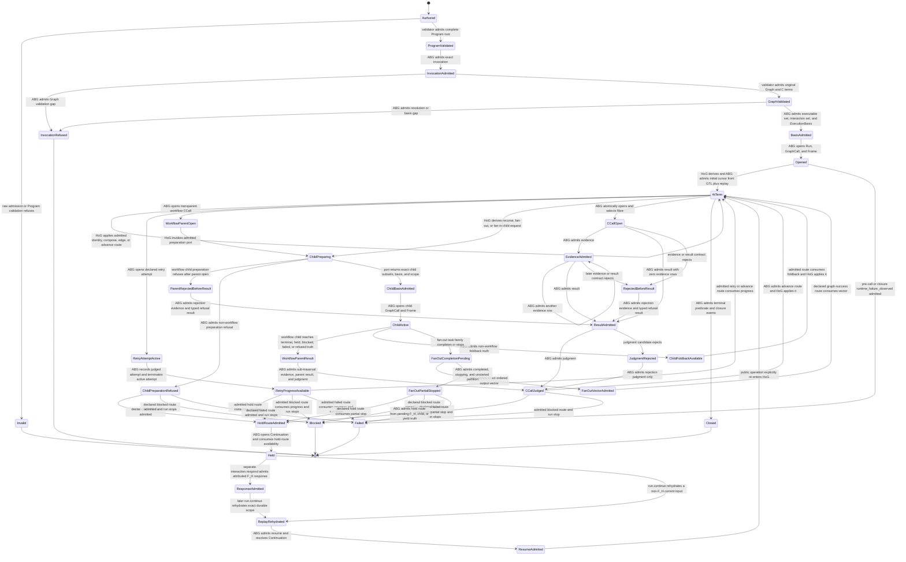
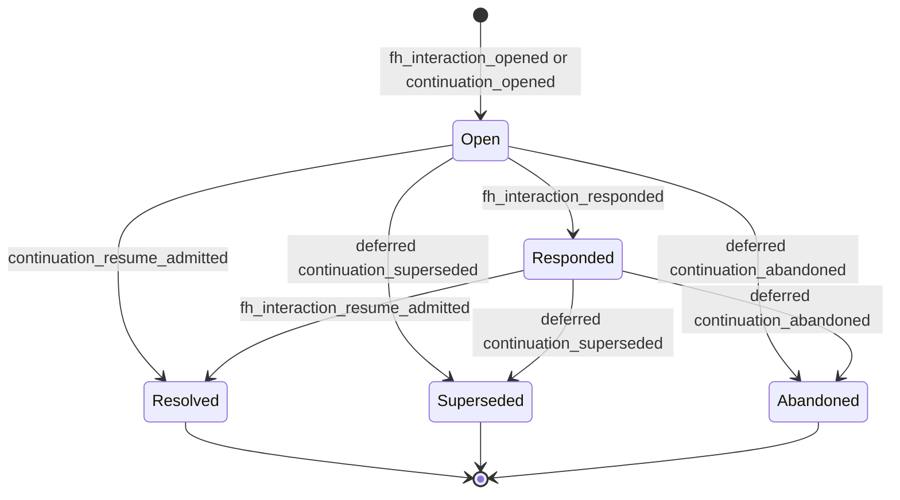
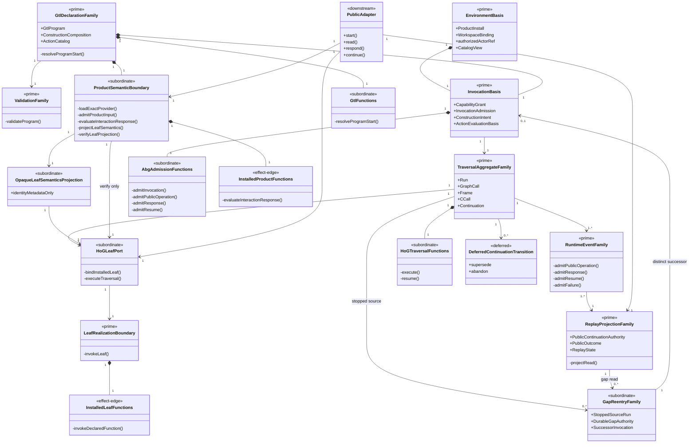
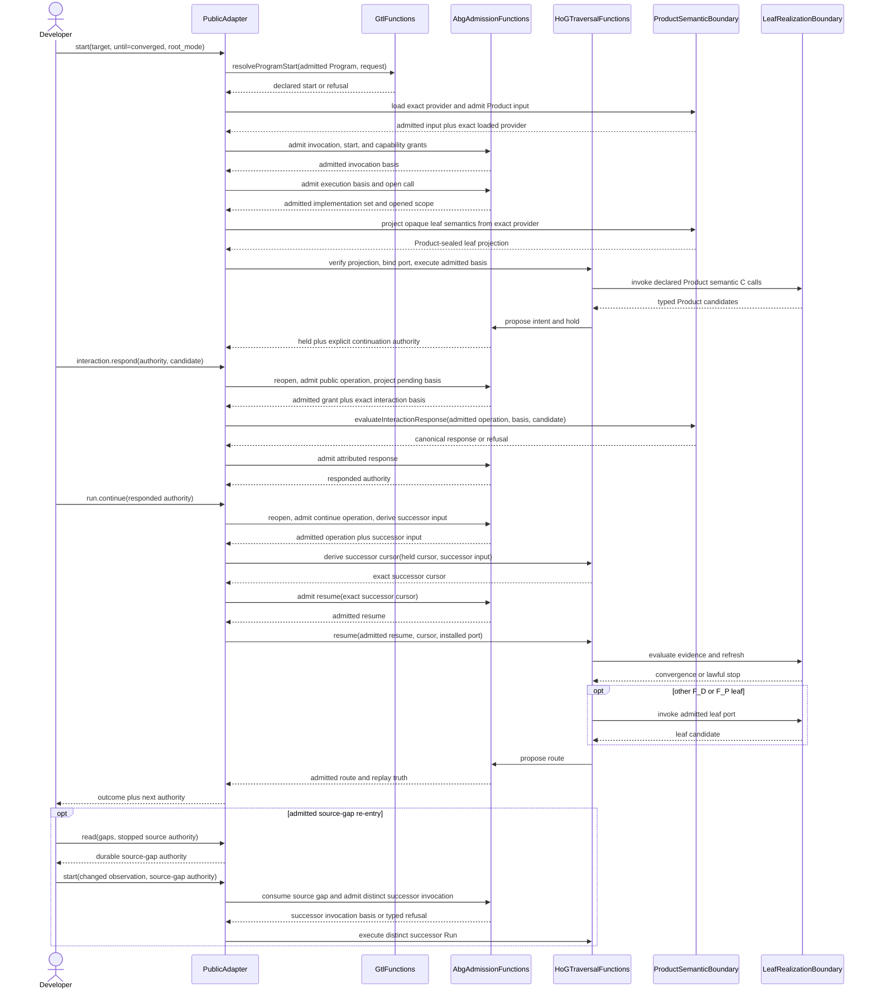
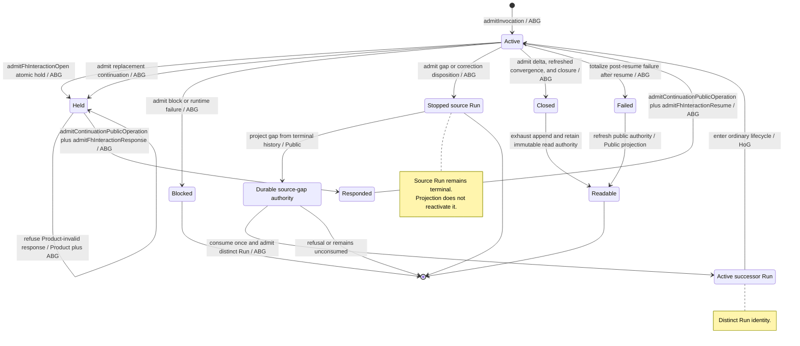

# M05 Direct GTL Traversal Expansion Design

**Status**: M5 base accepted at `d6da4269`; T-270 Section 12 is accepted at
exact candidate `8865ccff`; the replacement S05 design and realization are
accepted at `283325aa` and `1ddc802d`. Sections 14.1 and 14.2 are the selected
S06 boundary under T-281. Sections 14.3 through 14.7 are superseded S04
discovery material; the replacement S04 design is parked.
**Date**: 2026-07-22
**Section 12 updated**: 2026-07-26
**Historical accepted parent design**:
`M03_DIRECT_GTL_TRAVERSAL_BEHAVIOR_DESIGN.md`, accepted SHA-256
`9faeb41ddac839edc9cd2ccb83ae11b05bb54d32168fc35e74a1a9cfb97e92f0`
**Accepted S03 parent projection**: same direct-GTL architecture with STDO
`v2.2.0` qualification identity and the T-270 narrow Product leaf-verifier
dependency reconciled, SHA-256
`39b396c7d58b0e9e2a4c288baedb78462657210d1dac892bcf2a7045c63c1a85`
**Accepted S03 M05 semantic subject**: SHA-256
`b385ce64745cdb531d8002719d0a3a6f36995c6b8f2418e76eaecdaf46ef15a5`
at candidate `8865ccff`
**Product boundary**: accepted `A5-F02`, `A5-F03`, `A5-F04`, `A5-F07`,
`A5-F08`, `A5-F09`, `A5-F10`, and `A5-F14`; Sections 14.1 and 14.2 close the
S06 portability portion of `A5-F13` and `A5-F17`
**Scenario boundary**: accepted `ABG5-S02`, `ABG5-S03`, and `ABG5-S05`;
Sections 14.1 and 14.2 advance `ABG5-S06`
**Work owner**: T-281 under T-270
**Sequencing**: co-evolution inside the decisions fixed here; a newly exposed
material authority or lifecycle ambiguity returns to design before promotion

## 1. Decision

M5 extends the installed M4 root into a generic direct traversal without a
compiled execution carrier.

```text
admitted GTL Program and materialized Graph
  -> non-lowering validation of graph and C terms
  -> ABG-admitted invocation, executable-resolution set, and F_H contract set
  -> HoG cursor derived from the original GTL value plus replay
  -> direct traversal of graph relations and seven C constructors
  -> declared implementation port at each F_D/F_P leaf or admitted F_H interaction boundary
  -> ABG evidence, result, judgment, route, continuation, and closure admission
  -> replay-derived state and public outcome
```

The accepted M3 authority split remains unchanged:

- GTL owns graph topology, C terms, callable relations, contracts, and routes.
- The validator owns closed static judgments and never lowers GTL.
- Product projection proposes exact implementation matches from the admitted
  catalog.
- ABG admits invocation, executable matches, F_H contract rows, runtime facts,
  and closure.
- HoG traverses the original admitted GTL and applies only ABG-admitted routes.
- Implementations own F_D/F_P leaf interiors only.
- Public SDK and CLI transport public operations and project replay truth.

No generated program, compiled C plan, normalized executable declaration,
feature runner, implementation selector, scheduler, or controller is added.

## 2. Scope And Non-Scope

### In scope

1. The seven-constructor C declaration family:
   `C.of`, `C.id`, `C.compose`, `C.edge`, `workflow.C`, `C.batch`, and
   `C.retry`.
2. Graph traversal over declared nodes and vectors, including child
   GraphFunction traversal and declared GraphFunction applications.
3. A complete per-invocation executable-resolution set and a distinct complete
   F_H interaction-contract set admitted before HoG enters the graph.
4. General C-call locus identity across source path, task ordinal, attempt,
   retry path, and graph-call lineage. Compute fibre remains selected interior
   truth and never enters C-call identity.
5. Deterministic and probabilistic leaf ports plus a distinct typed external
   human-hold boundary that invokes no implementation.
6. Durable event-log reopening sufficient for same-run continuation.
7. Data-driven traversal and fibre-substitution proof rows.
8. Removal of the current GTL and validator dependency on Product utility
   modules.

### Boundary ownership beyond base traversal

| Boundary | Disposition and owner |
|---|---|
| One Surface semantic program and F_H interaction policy | accepted S03 basis under T-270; completed T-272 is retained evidence |
| Consensus declarations, execution, result, replay, and proof | selected S05 boundary under T-270; completed T-274, T-275, and T-276 are retained evidence |
| complete public projection and downstream flavored catalog | deferred to S06/T-281 |
| observer and tuner | deferred to S04/T-268 |
| qualification and release | deferred to T-247 and T-248 |

The generic carriers and lifecycle required by those slices are in scope.
Only the S05 Consensus domain program is active in this cut.

### Requirement trace for this delta

| Boundary | Governing requirement or accepted design |
|---|---|
| transparent workflow parent call | `REQ-L-GTL3-C-ALGEBRA-006`; `REQ-R-ABG3-CCALL-013` |
| executable versus F_H leaf identity | `REQ-L-GTL3-C-ALGEBRA-010`; `REQ-R-ABG3-CCALL-003` |
| authoritative durable continuation | `REQ-R-ABG3-CONTINUATION-001..014`; `REQ-P-POLICY-024`, `-031..033` |
| ordered batch and fan-out | `REQ-L-GTL3-C-ALGEBRA-007`; `REQ-L-GTL3-HOF-009..012` |
| durable append-context reopening | `REQ-R-ABG3-EVENTS-024`, `-027`, `-028` |
| fan-out completion and partial stop | `REQ-L-GTL3-HOF-010`; `REQ-R-ABG3-EVENTS-002`, `-011` |
| continuation ingress authority | `REQ-P-POLICY-024`; `REQ-R-ABG3-EVENTS-031` |
| child module topology | accepted M3 design Section 8 dependency law and Section 9.2 operation composition |
| event and replay closure | `REQ-R-ABG3-EVENTS-002`, `-004`, `-011`, `-018`, `-024`, `-029` |

## 3. Ontology Delta

This is an affected slice of the accepted M3 Ontology. The M3 Prime families
remain authoritative. M5 adds variants and relations inside those families; it
does not add a peer authority.

### 3.1 Entities And Relationships

| Identity | M3 family | Authority | Relationship |
|---|---|---|---|
| `CProgramTerm` | `GtlDeclarationFamily` | GTL | One closed discriminated term built from exactly seven constructors. |
| `CLeafTerm` | `GtlDeclarationFamily` | GTL | One `C.of` locus with role, fibre, arm, carriers, and judgment refs. An F_D/F_P leaf carries an executable requirement; an F_H leaf carries an interaction requirement. |
| `ExecutableLeafRequirement` | `GtlDeclarationFamily` | GTL | Stable F_D/F_P requirement key over the locus, binding, and executable seam contracts. |
| `InteractionLeafRequirement` | `GtlDeclarationFamily` | GTL | Stable F_H requirement key over the locus, interaction kind, actor-capability, request, response, and continuation contracts; it has no implementation binding. |
| `GraphTemplate` | `GtlDeclarationFamily` | GTL | Complete immutable graph with boundary nodes, nodes, vectors, contexts, rules, effects, tags, and one C term at each compute locus. |
| `GraphFunctionApplication` | `GtlDeclarationFamily` | GTL | One declared graph relation for composition, substitution, recursion, fan-out, fan-in, gate, promote, identity, or same-object identity. |
| `ValidatedTraversalDeclaration` | `ValidationFamily` | validator | Exact static judgment over Program, GraphFunction, materialized Graph, C terms, contracts, and implementation declarations. |
| `AdmittedImplementationSet` | `InvocationBasis` | ABG | Complete one-to-one admitted resolution for every statically reachable F_D/F_P leaf key under the validated root; child bases consume exact graph-local subsets. |
| `AdmittedInteractionSet` | `InvocationBasis` | ABG | Complete admitted F_H interaction-contract rows for every statically reachable F_H key; no row is executable. |
| `ChildTraversalPreparationPort` | `InvocationBasis` | stateless operation composition over GTL, validator, and ABG owner ports | Total preparation of one GTL-declared child into validated Graph, exact admitted child subsets, ExecutionBasis, and opened scope; it neither selects the child nor re-resolves Product catalog truth. |
| `TraversalCursor` | `TraversalAggregateFamily` | HoG under admitted scope | Subordinate position derived from original GTL plus replay; never authored or published as a program. |
| `TraversalStep` | `TraversalAggregateFamily` | HoG proposal | One derived structural step: pass identity, enter term, open leaf, enter child, start task, retry, advance graph, hold, or terminal. |
| `LeafExecutionPort` | `LeafRealizationBoundary` | admitted implementation seam | Exact `F_D` or `F_P` function addressed by one admitted resolution; no event or transition authority. |
| `HumanInteractionBoundary` | external actor, outside the IACS | direct or lawfully proxied F_H | Receives an attributed request and returns a response candidate; it is not an implementation binding or executable port. |
| `RouteCandidate` | `TraversalAggregateFamily` | declared implementation or HoG proposal | Candidate consequence constrained to GTL-declared routes. |
| `AdmittedRoute` | `RuntimeEventFamily` | ABG | Canonical event truth accepting one route on current replay and authority basis. |
| `FanOutCompletion` | `RuntimeEventFamily` | ABG | Frame-local authoritative completion truth with disjoint `complete_vector` and `partial_stop` variants; Vector is never an aggregate. |
| `Continuation` | `TraversalAggregateFamily` | ABG | Authoritative run-local open obligation. The complete target algebra names open, resolved, superseded, and abandoned; the selected S03 realization proves only open, responded, and resolved, with superseded and abandoned deferred. |
| `ContinuationBasis` | `ReplayProjectionFamily` | ABG replay | Downstream held cursor, response contract, authority, and event-log identity derived from admitted events. |
| `ReopenedEventStoreContext` | `RuntimeEventFamily` | ABG event-store boundary | One exclusive live append context seeded from a verified existing durable log without restamping historical events. |
| `ReplayState` | `ReplayProjectionFamily` | downstream | Complete state derived only from admitted events. |

### 3.2 Invariants And Cardinality

1. A `CProgramTerm` has exactly one constructor discriminant.
2. A `C.of` has one C-call spine. `C.id` has none. Structural constructors do
   not fabricate C calls.
3. `C.compose` is canonically flat: construction flattens nested composition
   syntax into one ordered non-empty term family while preserving each original
   leaf. `C.compose` and `C.edge` preserve exact carrier continuity.
4. `workflow.C` names one admitted child GraphFunction and is one transparent
   parent C call. ABG opens and selects that parent C call before child
   preparation. The child GraphCall and Frame remain under the same run. Child
   completion, block, failure, refusal, or hold becomes `sub_traversal`
   evidence followed by exactly one parent result and judgment for that
   attempt. Preparation rejection totalizes the already-open parent C call.
5. `C.batch` contains a non-empty ordered task family with equal outer carrier
   and per-task result cardinality. Each task retains its own C-call, result,
   and judgment. The batch ref groups ordered per-task rows; it is not a
   synthetic aggregate call or result.
6. `C.retry` has a positive budget and repeats the same declared term with a
   fresh positive attempt coordinate. Retry is not graph recursion.
7. Every reachable `F_D` or `F_P` effectful leaf has exactly one admitted
   implementation resolution before HoG entry. Zero or multiple matches
   refuse. An `F_H` leaf instead has one declared interaction and response
   contract and no implementation resolution.
8. An executable requirement key is the stable digest of Program,
   GraphFunction, GraphFunction digest, program locus, role, fibre, arm,
   binding, and executable seam contract refs. An interaction requirement key
   replaces binding and executable contracts with interaction kind,
   actor-capability, request, response, and continuation contract refs. The
   key families are disjoint and exhaustive.
9. The validated transitive root declares complete executable and interaction
   key sets. Child validation declares exact graph-local subsets of both.
   Child basis admission requires equality against matching rows already
   admitted in the corresponding root set. Missing, extra, cross-family,
   drifted, or ambiguous rows refuse before child HoG entry.
10. Fibre substitution changes only the leaf interior, evidence class, and the
    applicable executable or interaction requirement. Topology, source path,
    C-call spine order, and continuation law remain unchanged.
11. A HoG cursor is reproducible from `(admitted GTL, opened scope, replay)`.
   Ambient process memory cannot be required for continuation.
12. A route is applicable only when declared by the current GTL boundary and
    admitted by ABG against current replay.
13. Once a C call opens, every success, failure, malformed result, admission
    rejection, child outcome, or hold completes the inherited M3 spine for that
    attempt through one result-admitted row and one judged row. Only pre-call
    refusal may terminate without a C call. A resumed child or F_H obligation
    uses a fresh attempt coordinate and cannot append a second result to the
    completed pending attempt.
14. Public outcome is replay projection. A worker, test, CLI, or implementation
    cannot author result, continuation, or closure truth.
15. Durable reopening preserves every historical canonical envelope byte,
    `eventId`, payload digest, and admission ordinal. Historical ordinals are the
    unique gap-free sequence `1..n`; the reopened live context owns the same
    sink and stamps its first new event at `maxOrdinal + 1`. Reopening never
    truncates, rewrites, reorders, or re-admits historical truth.
16. Fan-out completion is exactly one discriminated ABG admission. A complete
    variant contains every task exactly once in input ordinal order and one
    contract-valid output vector. A partial-stop variant partitions the input
    tasks into completed rows, exactly one stopping task/ordinal, and exact
    unstarted rows, and contains no output vector.

### 3.3 Lifecycle Completeness

| Entity | Initial | Lawful next states | Terminal or refusal |
|---|---|---|---|
| authored GTL | authored | raw admitted, invalid | invalid |
| admitted GTL | admitted | validated, semantic gap | invalid or unresolved |
| invocation basis | raw input and Program validated | invocation admitted, Graph materialized and validated, executable and interaction sets admitted, exact basis admitted | `invocation_refused` after invocation admission; typed refusal before it |
| traversal | opened | at term, at leaf, child, retry, next node, held | blocked, failed, closed |
| C call | atomically opened and fibre selected | evidenced, result admitted, judged | judged success, failure, refusal, pending, blocked, or escalation; never stranded |
| child traversal | opened | traversing, folded back | blocked, held, failed, closed |
| fan-out completion | declared ordered tasks | task truth accumulating | complete vector admitted or partial stop admitted |
| continuation | opened from admitted hold | open, responded, resume admitted | resolved in the selected S03 realization; superseded and abandoned remain explicit target-only gaps |
| durable event store | absent or verified historical log | exclusive append context open | append context closed or reopen refused |
| run | active | active, held, blocked, failed | closed or stopped with an admitted terminal disposition |

The affected entity closure is explicit below. Immutable declaration and
judgment carriers retire by supersession or invocation completion, not mutation.

| Entity | Create / admit | Read / project | Transition / execute | Retire / terminal |
|---|---|---|---|---|
| `CProgramTerm` | GTL constructor or raw admission | validator and HoG read original term | HoG folds without rewriting | declaration version supersedes |
| `CLeafTerm` | `C.of` or raw admission | validator derives one executable or interaction key | exact admitted port or F_H hold | owning term supersedes |
| `ExecutableLeafRequirement` | GTL declaration and validation | Product resolves and ABG admits matching row | exact admitted implementation only | invocation terminal or declaration supersession |
| `InteractionLeafRequirement` | GTL declaration and validation | ABG admits exact non-executable contract row | F_H request and response admission only | continuation terminal or declaration supersession |
| `GraphTemplate` | GraphFunction publication | materialization and validation | pure materialization only | GraphFunction version supersedes |
| `GraphFunctionApplication` | GTL graph algebra | validator and HoG read relation | HoG proposes only declared child/route work | owning declaration supersedes |
| `ValidatedTraversalDeclaration` | validator closed judgment | Product, ABG, and audit read exact digest | never executes | invocation ends or subject digest changes |
| `AdmittedImplementationSet` | ABG admits exact validated root set | root and child basis admission read keyed rows | never selects or executes | invocation terminates |
| `AdmittedInteractionSet` | ABG admits exact validated root interaction set | root and child basis admission read keyed rows | never invokes a human or HoG | invocation terminates |
| `ChildTraversalPreparationPort` | operation application binds owner functions once | HoG calls it with a GTL-selected child and admitted parent sets | GTL materializes, validator judges, ABG admits; Product is not called | returns one prepared child or typed refusal |
| `TraversalCursor` | HoG derives from GTL, scope, and replay | HoG reads current derived position | replaced only after an admitted event/route | next cursor or terminal event supersedes |
| `TraversalStep` | HoG derives one total step | ABG evaluates candidate against scope | HoG executes only after required admission | accepted, refused, or superseded by newer replay |
| `LeafExecutionPort` | package plus implementation binding admission | HoG addresses exact admitted port | implementation realizes F_D/F_P interior | call or invocation terminates |
| `HumanInteractionBoundary` | GTL declares callout and ABG admits hold | public projection renders pending interaction | attributed external actor returns candidate | response admitted or rejected in this cut; abandonment and supersession remain target-only gaps |
| `RouteCandidate` | HoG or declared implementation proposes within GTL route set | ABG evaluates against replay | never applies itself | admitted, refused, or superseded |
| `AdmittedRoute` | ABG admits canonical route event | replay projects route truth | HoG deterministically applies exact admitted route | next admitted route or terminal event supersedes it |
| `FanOutCompletion` | ABG admits one closed completion variant | replay projects ordered vector or partial-stop facts | only a later declared route may consume it | owning frame or run terminal |
| `Continuation` | ABG admits an opening lifecycle event | replay projects exactly one run-local member | only separate response and continuation operations may advance it | resolved in this cut; superseded and abandoned are deferred with T-270 re-entry |
| `ContinuationBasis` | replay derives open obligation | public read and `run.continue` consume exact basis | never invokes HoG itself | resolved or run terminal in this cut; superseded and abandoned are deferred |
| `ReopenedEventStoreContext` | ABG validates an existing log and acquires exclusive append ownership | replay and event admission read the exact seeded prefix | new events append at the next ordinal only | context closes; historical log remains immutable truth |
| `ReplayState` | pure fold of admitted event log | HoG and public projections read | never writes events or executes work | superseded by a longer valid prefix |

### 3.4 Authority Matrix

| Function | Proposer | Evaluator | Verifier | Executor | Projector | Admitter / truth owner | Retirement |
|---|---|---|---|---|---|---|---|
| construct C or graph relation | GTL author | TypeScript and validator | validator | pure GTL constructor | validation report | raw admission and closed static judgment | declaration supersession |
| resolve leaf implementation | Product catalog projection | validator | ABG basis checks | none | invocation replay | ABG; F_D and F_P only | invocation terminal |
| admit F_H interaction contracts | GTL plus validator | validator | ABG basis checks | none | invocation replay | ABG; F_H only | invocation terminal |
| prepare child traversal | HoG supplies only GTL-declared child ref and input | fixed operation-bound port invokes GTL and validator owners | ABG checks parent scope and exact root-set subsets | stateless port composition | prepared-child result | ABG owns admitted child basis and scope | child terminal or parent invocation terminal |
| derive next structural cursor | HoG | GTL relation plus replay | ABG scope identity | HoG after required admission | replay cursor | no new truth until route admission | next admitted event |
| realize leaf interior | admitted F_D or F_P implementation | result contract | ABG result checks | exact implementation port | replayed C-call | ABG | judged C call or invocation terminal |
| request or answer human work | HoG proposes declared hold; attributed human answers | declared interaction and response contracts | F_H authority and replay basis | external human only | continuation and public interaction views | ABG | resolved or rejected in this cut; abandonment and supersession remain deferred |
| choose consequence candidate | declared implementation or HoG from declared relation | GTL route set | ABG current replay | none | route diagnostic | ABG | admission, refusal, or newer replay |
| apply transition | admitted route | GTL cursor relation | replay | HoG | replay cursor | ABG event is prior truth | next cursor or terminal event |
| admit fan-out completion | HoG submits task-result census | declared vector and task contracts | ABG checks exact ordinal partition and current replay | none | ordered vector or partial-stop projection | ABG | owning frame or run terminal |
| totalize post-open rejection | actual contract rejection | refusal and rejection contracts | current C-call spine | ABG appends only missing suffix | replayed rejected C-call | ABG | judged rejection |
| respond to hold | attributed F_H actor | declared response and capability contracts | ABG verifies open continuation and replay basis | `interaction.respond` only admits response truth | responded interaction view | ABG | response consumed, rejected, or continuation terminal |
| reopen durable truth | caller supplies existing sink and expected digest | canonical log grammar and event union | ABG validates immutable stamps, ordinal order, causation, scope, and exclusive append ownership | event store seeds one live context without emitting | replay prefix and next ordinal | ABG event-store boundary | context closes or reopen refuses |
| continue held run | admitted `run.continue` ingress names existing run/continuation, actor, capability, and input | declared continuation contract | ABG uses the reopened context to verify exact durable scope and public authority | `run.continue` explicitly re-enters HoG after resume admission | continuation and replay views | ABG | resolved or run terminal in this cut; superseded and abandoned remain deferred |
| close | HoG submits current judged terminal | closure predicate | replay and exact contracts | ABG appends closure transaction | replay and PublicOutcome | ABG | immutable terminal run |

## 4. Function And Composition Derivation

### 4.1 Atomic function families

| Family | Input -> output | Owner |
|---|---|---|
| `constructC` | typed constructor arguments -> canonical `CProgramTerm` | GTL |
| `rawAdmitProgram` | erased Program, GraphFunction, Graph, and C data -> admitted declarations or typed refusal | raw admission |
| `validateProgram` | admitted whole root -> Program validation or typed gap | validator |
| `materializeGraph` | admitted GraphFunction plus admitted input -> original GTL Graph candidate | GTL |
| `validateTraversal` | materialized Graph plus Program validation -> static Graph/C validation or typed gap | validator |
| `resolveImplementations` | catalog view plus reachable executable keys -> candidate set or typed gap | Product projection |
| `admitImplementationSet` | candidate set plus invocation basis -> admitted set or refusal | ABG |
| `admitInteractionSet` | validated reachable F_H contract rows plus invocation basis -> admitted non-executable set or refusal | ABG |
| `prepareChildTraversal` | GTL-declared child ref, admitted child input, parent scope, root executable set, and root interaction set -> prepared child with original Graph, validation, exact admitted subsets, ExecutionBasis, and opened scope, or typed refusal | stateless operation-bound port over GTL, validator, and ABG owner functions |
| `reopenEventStore` | existing durable log path, expected log digest, and immutable event-contract basis -> exclusive `ReopenedEventStoreContext` seeded with exact historical envelopes and next ordinal, or typed refusal | ABG |
| `deriveTraversalStep` | GTL plus scope plus replay -> structural step | HoG |
| `invokeLeafPort` | admitted F_D/F_P leaf input -> evidence and result candidates | implementation seam |
| `admitHumanHold` | declared F_H locus plus replay -> admitted hold event and continuation projection | ABG |
| `admitInteractionResponse` | public `interaction.respond` candidate plus open continuation -> actor-attributed response truth or refusal; never invokes HoG | ABG |
| `rehydrateContinuation` | reopened event-store context plus immutable Product/workspace/catalog/declaration basis and continuation identity -> owner-validated replay, ExecutionBasis, opened scope, cursor, and input, or typed basis-fork/refusal | ABG |
| `continueExecution` | admitted public `run.continue` operation, acting operator/capability, declared input, rehydrated scope, and admitted response when required -> resume admission and explicit HoG re-entry | public operation over ABG and HoG ports |
| `admitLeafTruth` | candidates plus contracts -> admitted C-call truth or rejection | ABG |
| `admitFanOutCompletion` | declared fan-out application, ordered task census, current replay, and candidate complete vector or partial stop -> authoritative discriminated completion event or typed refusal | ABG |
| `completeRejectedCCall` | opened C call plus current spine position plus actual admission rejection -> only the missing suffix: rejection evidence and typed refusal result before result admission, then rejection judgment; judgment only after result admission | ABG |
| `admitRoute` | route candidate plus current replay -> admitted route or refusal | ABG |
| `applyRoute` | admitted route plus GTL cursor -> next cursor | HoG |
| `rehydrateReplay` | reopened event-store context with verified historical prefix -> replay state | ABG |

### 4.2 Higher-order composition

`traverseC` is the direct fold over the original `CProgramTerm`. It composes
the atomic families above and is parameterized by admitted ports. It does not
produce or consume another program value.

`traverseGraph` composes `traverseC` with declared graph vectors and admitted
routes. `workflow.C`, recursion, fan-out, and fan-in reuse `traverseGraph` at a
child scope prepared through `ChildTraversalPreparationPort`. Batch and retry
reuse `traverseC` with task and attempt coordinates. None owns a parallel
runtime.

### 4.3 Whole-family Prime contraction

Candidate alternatives were:

1. one interpreter or runner per C constructor;
2. a lowered normalized execution plan;
3. one generic direct fold over the original GTL term;
4. feature-owned controllers for workflow, batch, retry, and recursion.

Only option 3 preserves one program identity and one traversal authority. The
M3 Prime set therefore remains eight families. This delta adds subordinate
variants to `GtlDeclarationFamily`, `InvocationBasis`, and
`TraversalAggregateFamily`; it adds no ninth authority family and no second
authoring surface.

## 5. Irreducible Architectural Carrier Set Delta

The accepted M3 IACS remains the complete eight-family carrier set. This table
classifies only M5 members and payloads inside those families; no row is a ninth
Prime family.

| Carrier | Parent M3 IACS family | Classification | Module | Purpose |
|---|---|---|---|---|
| `CProgramTerm` | `GtlDeclarationFamily` | `<<subordinate>> <<authoritative>>` | `src/gtl` | Original seven-constructor program data. |
| `GraphFunctionApplication` | `GtlDeclarationFamily` | `<<subordinate>> <<authoritative>>` | `src/gtl` | Original graph-algebra relation data. |
| `TraversalValidation` | `ValidationFamily` | `<<subordinate>> <<authoritative>>` | `src/validator` | Static closed judgment; never executable. |
| `AdmittedImplementationSet` | `InvocationBasis` | `<<authoritative>>` | `src/abg` | Invocation-bound complete executable-leaf realization basis. |
| `AdmittedInteractionSet` | `InvocationBasis` | `<<authoritative>>` | `src/abg` | Invocation-bound F_H request, response, capability, and continuation contract basis; never executable. |
| `ChildTraversalPreparationPort` | `InvocationBasis` | `<<effect-edge>>` | operation application over `src/gtl`, `src/validator`, and `src/abg` owner ports | Total child preparation without HoG-to-Product or HoG-to-validator dependency. |
| `TraversalCursor` | `TraversalAggregateFamily` | `<<subordinate>>` | `src/hog` | Derived, invocation-local position. |
| `TraversalStep` | `TraversalAggregateFamily` | `<<subordinate>>` | `src/hog` | Exhaustive direct-fold result. |
| `LeafExecutionPort` | `LeafRealizationBoundary` | `<<effect-edge>>` | `src/implementation` | Bound F_D or F_P leaf effect interior. |
| `HumanInteractionBoundary` | external actor, not IACS | `<<effect-edge>>` | external plus `src/abg` admission | F_H request and attributed response candidate; never an implementation port. |
| `AdmittedRoute` | `RuntimeEventFamily` | `<<authoritative>>` | `src/abg` | Accepted runtime transition event. |
| `FanOutCompletion` | `RuntimeEventFamily` | `<<subordinate>> <<authoritative>>` | `src/abg` | Frame-local complete-vector or partial-stop truth; never a Vector aggregate. |
| `Continuation` | `TraversalAggregateFamily` | `<<authoritative>>` | `src/abg` | Run-local open obligation and exact terminal lifecycle truth. |
| `ContinuationBasis` | `ReplayProjectionFamily` | `<<downstream>>` | `src/abg` | Events-only hold and resume projection. |
| `ReopenedEventStoreContext` | `RuntimeEventFamily` | `<<effect-edge>>` | `src/abg` | Exclusive append context over one verified durable event prefix; no new authority family. |
| `ReplayState` | `ReplayProjectionFamily` | `<<downstream>>` | `src/abg` | Events-only runtime projection. |

Canonical JSON, digest, immutable-value, and opaque-ref utilities move to
`src/shared`. They are pure implementation primitives, not Ontology carriers,
program meaning, or admission authority. `gtl` and `validator` may depend on
`shared`; `product` consumes them rather than owning them.

## 6. Direct Traversal Semantics

| Constructor | HoG relation | ABG truth |
|---|---|---|
| `C.of` | derive one leaf stop at exact term path and invoke exact admitted port | uniform C-call spine |
| `C.id` | pass admitted input unchanged | no C-call and no fabricated gate pass |
| `C.compose` | traverse the canonical flat term family in order, binding each admitted output into the next term | each child retains its own truth |
| `C.edge` | traverse transform, evaluate, consequence in declared order | ordinary child C calls; no edge runner |
| `workflow.C` | open one transparent parent C call, prepare/open/traverse the named child, then complete the parent attempt | child lineage plus `sub_traversal` evidence, one parent result and judgment, and admitted foldback; preparation rejection totalizes the parent spine |
| `C.batch` | traverse the declared non-empty task family in stable ordinal order; concurrency is optional realization | one C-call, result, and judgment per task plus a non-authoritative grouping ref and ordered per-task result projection; no synthetic aggregate result |
| `C.retry` | traverse wrapped term until success, non-retry disposition, or budget | fresh attempt identity, admitted retry route, retained prior evidence |

An `F_H` `C.of` follows the same C-call locus and selected-fibre event shape but
does not call `LeafExecutionPort`. Its request invocation completes the uniform
spine with a typed pending result and pending judgment, from which ABG event
truth opens the authoritative `Continuation` aggregate. A later
`interaction.respond` operation admits an attributed response against that
exact continuation and response contract but does not invoke HoG. A separate
`run.continue` operation rehydrates the durable scope, admits resume truth, and
then explicitly re-enters HoG. It does not append a second result or judgment
to the completed request C call. T-270 owns the current domain interaction
policy and exact continued GTL locus; completed T-272 records the retained
behavioral basis.

`workflow.C` follows the same parent-level law. It first opens a transparent
parent C call, then traverses its prepared child. A terminal child produces
`sub_traversal` evidence and the one parent result and judgment. A rejected
child preparation totalizes the parent call from the actual rejection. A held
child completes that parent attempt with pending evidence, result, and
judgment, and opens a continuation. Resumption uses a fresh positive parent
attempt coordinate, consumes the replay-derived child completion, and never
re-executes a closed child or appends to the prior pending C call.

The source path is a stable sequence of segments rooted at the graph node:

```text
node/<node-ref>/c
  /terms/<zero-based-ordinal>
  /transform | /evaluate | /consequence
  /tasks/<zero-based-ordinal>
  /term
```

The path is identity input, not a compiled node. HoG reads the term at that
path from the admitted materialized Graph each time it derives a step.

### 6.1 Graph algebra projection

The complete `GraphTemplate` preserves the constitutional Graph fields. Graph
algebra operations remain GTL constructors. Runtime traverses their resulting
declared relation; it does not infer or reconstruct the operation.

| Relation | GTL construction truth | Direct runtime meaning |
|---|---|---|
| `edge` | one explicit GraphVector between typed boundary nodes | traverse source locus, declared vector relation, then target locus |
| `identity` | graph or GraphFunction preserving one interface | pass admitted value with no fabricated check or effect |
| `compose` | one application relation and materialized composed graph with exact interface wiring | traverse declared left then right child relation |
| `substitute` | outer graph with one exact vector replaced by visible interface-compatible inner graph | traverse the resulting graph; provenance retains outer vector and inner graph refs |
| `recurse` | callable relation with termination, foldback, and positive bound | open child graph calls until admitted termination; foldback rebinds and re-evaluates parent |
| `fan_out` | element GraphFunction plus explicit ordered input/output vector relation | pure GTL materialization projects one `C.batch` task per admitted input member before child HoG entry; each task retains ordinal, member lineage, child GraphFunction, contracts, and enclosing C authority; ABG admits exactly one complete-vector or partial-stop event after task traversal |
| `fan_in` | reducer GraphFunction plus complete vector contract | invoke one child reducer only after complete vector admission |
| `gate` | target, rule, and evaluator refs | admit block or advance from evaluator truth; never select a candidate |
| `promote` | explicit representation-boundary relation | apply the declared typed relation without changing semantic identity |
| `same_object` | exact identity witness | no runtime work; validator proves identity |

Composition, substitution, promotion, identity, and same-object are normally
resolved by typed construction and validation into the materialized original
GTL value. Recursion, fan-out, fan-in, and gate retain explicit runtime-visible
application declarations because they govern child traversal or admission.
Every child GraphFunction reachable through those declarations is included in
whole-root validation and the transitive executable and interaction censuses
before root HoG entry. Dynamic selection may choose only among that statically admitted
reachable set. A selected child is materialized and its exact call/frame basis
is admitted before child HoG entry; the root set is not a substitute for that
child invocation-local admission.

The mapping is decidable:

```text
keys(rootExecutableSet.rows) == rootValidation.transitiveReachableExecutableLeafKeys
keys(rootInteractionSet.rows) == rootValidation.transitiveReachableInteractionLeafKeys
childExecutableKeys == childValidation.reachableExecutableLeafKeys
childInteractionKeys == childValidation.reachableInteractionLeafKeys
childExecutableRows == rootExecutableSet.rows filtered by childExecutableKeys
childInteractionRows == rootInteractionSet.rows filtered by childInteractionKeys
keys(childExecutableRows) == childExecutableKeys
keys(childInteractionRows) == childInteractionKeys
```

Every filtered row retains its owning root-set ref and digest plus its typed
key. The child `ExecutionBasis` binds both root-set refs/digests, both exact
child-set digests, the child GraphFunction and materialization digests, and the
child validation ref. F_H rows never enter an implementation set. This is
invocation-local admission of already resolved declarations, not ambient
selection or a second implementation-resolution authority.

Child preparation preserves the accepted M3 topology. The stateless operation
application binds `ChildTraversalPreparationPort` once from the GTL
materializer, validator judgment, and ABG admission functions and supplies the
total port to HoG. HoG sends only the GTL-declared child ref, admitted child
input, parent scope, and admitted root sets. It receives one
`PreparedChildTraversal` or typed refusal. HoG never imports or invokes Product
or validator, Product never re-resolves the admitted root set during traversal,
and the port cannot select a child or author topology.

For fan-out, the ordered task declarations are fixed before the first task
enters HoG. After traversal, `admitFanOutCompletion` compares the declared input
cardinality against the full replayed task census. The `complete_vector` variant
requires one judged task row and one contract-valid output member at every
ordinal and admits the canonical ordered output vector. The `partial_stop`
variant requires exact completed, stopping, and unstarted partitions and
forbids an output-vector field. Either admission precedes any fan-in or graph
success route; only `complete_vector` can make those routes applicable.

### 6.2 Preserved M3 admission staging

M5 widens cardinality without collapsing the accepted M3 stages:

```text
raw input and complete Program root admitted
  -> ProgramValidation
  -> InvocationAdmission
  -> GraphFunction materialization from admitted input
  -> GraphValidation over the original materialized Graph and C terms
  -> Product proposes the complete reachable F_D/F_P implementation set
  -> validator checks declaration, package, and contract relations
  -> validator emits the complete reachable F_H interaction-contract set
  -> ABG admits both disjoint sets and the exact ExecutionBasis
  -> ABG opens Run, GraphCall, and Frame
  -> HoG enters the original GTL
```

A refusal after `InvocationAdmission` is admitted as `invocation_refused` and
projects through replay. A refusal before it returns the typed pre-invocation
result. Neither path can enter HoG. After a C call opens, an actual contract or
candidate rejection is totalized by `completeRejectedCCall`; direct transition
to `Blocked` or `Failed` without `result_admitted -> judged` is prohibited.

### 6.3 Durable continuation reconstruction

Durability belongs to the admitted event log and immutable declaration basis,
not to process-local brands, closures, weak sets, or object identity. Reopening
first constructs the event append context; continuation carriers are rebuilt
only inside that context.

`reopenEventStore` consumes an existing durable path, the expected complete-log
digest projected by the current `ContinuationBasis`, and the immutable
event-contract basis. A caller may echo that digest but cannot select another
one. The function:

1. opens the existing sink without create or truncate and acquires exclusive
   append ownership for the context lifetime;
2. reads the complete canonical JSON-lines prefix, requiring a terminal newline
   and rejecting a partial or non-canonical record;
3. validates every preserved envelope against the selected event union,
   recomputes its payload digest and event id using its preserved ordinal, and
   requires unique event ids plus the exact gap-free ordinal sequence `1..n`;
4. validates every historical causation ref against an earlier event in the
   same prefix and re-applies the canonical scope and cross-run rules;
5. compares the canonical prefix digest and file identity/length with the
   requested basis, then seeds one `ReopenedEventStoreContext` with those exact
   frozen historical envelopes and the same durable path; and
6. sets the live admission cursor to `maxOrdinal` (`0` for an empty existing
   log). The next candidate is store-stamped at `maxOrdinal + 1`, appended with
   append-only semantics, durably synchronized, and only then made visible to
   replay. Each append rechecks the owned file identity and expected prior
   length so a second writer or replaced sink fails closed.

No historical event passes through live admission, receives another stamp, or
is written again. Reopening itself emits no runtime event. It changes no fluent;
it validates and resumes the one canonical emitter context required to append
new truth. The context is operation-scoped and closes after its atomic admission
batch; a later public operation lawfully reopens the same verified prefix rather
than sharing ambient process state.

Initial invocation and later reopening are disjoint operations. Initial
invocation may create one absent sink with exclusive-create semantics. A
response or continuation operation must call `reopenEventStore` on that existing
sink and is forbidden from invoking the create-empty path.

An admitted `run.continue` public operation then supplies that reopened context,
the public-operation admission ref, continuation identity, expected run, acting
operator and capability, selected immutable Product/install/workspace/catalog
basis, and any declared continuation input. `rehydrateContinuation`:

1. replays exactly one run-local open `Continuation` with no resolved,
   superseded, or abandoned terminal event;
2. verifies its Product, workspace binding, catalog view, Program,
   GraphFunction, materialization, validation, executable-set,
   interaction-set, ExecutionBasis, Run, GraphCall, Frame, C-call, cursor,
   input, request, and response-contract refs and digests against the selected
   immutable declarations;
3. requires exactly one matching admitted response when the continuation kind
   requires F_H input;
4. verifies the `run.continue` public-operation event, acting operator,
   capability, continuation identity, and declared input against the open
   member and policy;
5. reconstructs fresh owner-issued `ExecutionBasis`, `OpenedTraversalScope`,
   cursor, and input carriers only after canonical body and digest equality;
   process-local branding is renewed evidence, never durable authority; and
6. appends `fh_interaction_resume_admitted` for F_H or
   `continuation_resume_admitted` for another declared continuation kind before
   `run.continue` explicitly re-enters HoG.

Missing bodies, log replacement, ordinal or stamp drift, stale or multiple open
members, wrong public operation, actor, capability, response contract, cross-run
identity, changed workspace/product/catalog authority, or another basis fork
refuses before HoG and appends no resume event. The `interaction.respond`
operation may obtain its own reopened append context, but its semantic admission
only appends actor-attributed response truth; it cannot reconstruct execution
carriers or perform continuation steps 1-6.

## 7. Three-View Projection

### 7.1 Domain view


### 7.2 Sequence view

| Participant | Domain identity or boundary |
|---|---|
| Caller | explicitly external actor |
| Attributed F_H Actor | explicitly external actor |
| Public | stateless public operation transport; no semantic carrier or state |
| Child Preparation Port | stateless operation-bound composition of GTL, validator, and ABG owner functions; no selection or state |
| GTL | `GtlDeclarationFamily`; materializes the published GraphFunction template |
| Validator | `ValidationFamily` |
| Product | `EnvironmentBasis` catalog projection; proposes implementation matches |
| ABG | `InvocationBasis`, `TraversalAggregateFamily`, `RuntimeEventFamily`, and `ReplayProjectionFamily` |
| HoG | subordinate `TraversalCursor` and `TraversalStep` under `TraversalAggregateFamily` |
| LeafExecutionPort | effect edge under `LeafRealizationBoundary` |

```mermaid
sequenceDiagram
  participant Caller
  participant Human as Attributed F_H Actor
  participant Public
  participant Prep as Child Preparation Port
  participant GTL
  participant Validator
  participant Product
  participant ABG
  participant HoG
  participant Port as LeafExecutionPort
  Caller->>Public: invoke exact Product, workspace, catalog, Program, and GraphFunction
  Public->>Validator: raw-admit input and validate complete Program root
  Validator-->>Public: ProgramValidation or typed refusal
  Public->>ABG: admit input, Program, function, environment, policy, and authority
  ABG-->>Public: InvocationAdmission or typed refusal
  Public->>GTL: materialize original Graph from admitted input
  GTL-->>Public: original GTL Graph candidate
  Public->>Validator: validate Graph plus C terms against ProgramValidation
  Validator-->>Public: TraversalValidation or typed gap
  alt Graph validation gap after InvocationAdmission
    Public->>ABG: admitInvocationRefusal with exact gap and stage
    ABG-->>Public: replay-derived invocation refusal
    Public-->>Caller: typed refused outcome
  else Graph validation admitted
    Public->>Product: resolve complete transitive executable-key set
    Product-->>Public: exact implementation candidates or typed gap
    Public->>Validator: validate executable matches and exact F_H contract-key set
    Validator-->>Public: validated disjoint executable and interaction sets or typed gap
    alt Resolution or candidate-validation gap
      Public->>ABG: admitInvocationRefusal with exact rejected stage
      ABG-->>Public: replay-derived invocation refusal
      Public-->>Caller: typed refused outcome
    else Candidate set validated
      Public->>ABG: admit executable set, interaction set, and exact ExecutionBasis
      ABG-->>Public: ExecutionBasis or replay-derived invocation refusal
      alt ABG basis admission refused
        Public-->>Caller: typed refused outcome
      else Exact root basis admitted
        Public->>ABG: open Run, GraphCall, and Frame
        ABG-->>Public: OpenedTraversalScope
        Public->>HoG: traverse original GTL with admitted ports
        HoG->>ABG: admit initial traversal_cursor_entered from original GTL and scope
        ABG-->>HoG: replay-derived active initial locus
        loop direct fold over GTL and current replay
        HoG->>HoG: derive TraversalStep from term and cursor
        alt F_D or F_P C.of
          HoG->>ABG: open exact CCall
          HoG->>Port: invoke admitted leaf interior
          Port-->>HoG: evidence and result candidates
          HoG->>ABG: admit evidence, result, and judgment
          ABG-->>HoG: replay-derived CCall truth or totalized missing suffix
        else F_H C.of
          HoG->>ABG: open exact CCall and submit pending suffix, GTL hold route, and Continuation
          ABG->>ABG: atomically append judgment, hold route, then caused continuation opening
          ABG-->>HoG: replay-derived held truth
          HoG-->>Public: typed held traversal stop
          Public-->>Caller: typed held outcome, current operation stops
          Human->>Public: later interaction.respond with attributed response candidate
          Public->>ABG: reopen existing durable sink without restamping
          ABG-->>Public: ReopenedEventStoreContext or typed refusal
          Public->>ABG: admit interaction.respond ingress with actor and capability
          ABG-->>Public: public-operation admission event
          Public->>ABG: admit response against exact open Continuation
          ABG-->>Public: actor-attributed response truth only
          Public-->>Human: typed response-admitted outcome
          Caller->>Public: later run.continue naming run, Continuation, actor, capability, and input
          Public->>ABG: reopen existing durable sink and preserve exact historical prefix
          ABG-->>Public: ReopenedEventStoreContext or typed refusal
          Public->>ABG: admit run.continue ingress with actor, capability, and input
          ABG-->>Public: public-operation admission event
          Public->>ABG: rehydrate replay and exact immutable authority basis in reopened context
          ABG->>ABG: reconstruct owner-issued basis, scope, cursor, and input and admit resume
          ABG-->>Public: RehydratedContinuationScope or typed basis-fork refusal
          Public->>HoG: explicitly re-enter exact cursor with admitted continued input
        else workflow.C
          HoG->>ABG: open transparent parent CCall with declared parent fibre and arm
          HoG->>Prep: prepare GTL-declared child using parent scope and admitted root sets
          Prep->>GTL: materialize original child Graph
          GTL-->>Prep: original child GTL value
          Prep->>Validator: validate child Graph and both exact child key subsets
          Validator-->>Prep: child TraversalValidation or typed gap
          Prep->>ABG: admit child subsets, ExecutionBasis, GraphCall, and Frame
          ABG-->>Prep: PreparedChildTraversal or admitted child refusal
          Prep-->>HoG: prepared child or typed refusal
          alt child preparation refused
            HoG->>ABG: totalize parent CCall from actual preparation rejection
          else child prepared
            HoG->>HoG: traverse named child GTL
            HoG->>ABG: admit sub_traversal evidence, parent result, and parent judgment
            ABG-->>HoG: complete transparent parent CCall truth
          end
        else recurse, fan_out, or fan_in child relation
          HoG->>Prep: prepare exact GTL-declared child application
          Prep-->>HoG: PreparedChildTraversal or typed refusal
          alt child preparation refused
            Prep->>ABG: admit child_preparation_refused under parent frame
            ABG-->>HoG: replay-derived refusal available to declared route evaluation
          else child prepared
            HoG->>HoG: traverse named child GTL or projected fan-out C.batch
            HoG->>ABG: admit child foldback candidate
            opt fan_out application completed or stopped
              HoG->>ABG: submit exact ordered task census and completion variant
              ABG-->>HoG: fan_out_completion_admitted or typed refusal
            end
          end
        else batch or retry
          HoG->>HoG: derive task or attempt cursor from declared term
        end
        opt branch has not already consumed an admitted hold or terminal route
          HoG->>ABG: propose declared consequence route when current replay permits
          ABG-->>HoG: admitted route or typed refusal
          HoG->>HoG: apply admitted route
        end
        end
        alt terminal
          HoG->>ABG: submit current closure candidate
          ABG-->>Public: admitted closure and replay
        else F_H hold or gap
          ABG-->>Public: replay-derived ContinuationBasis
        end
        Public-->>Caller: typed replay-derived outcome
      end
    end
  end
```



### 7.3 Lifecycle view



The lifecycle view above projects the complete target continuation algebra.
Edges marked `deferred` are not part of the selected S03 realization or proof:



## 8. Cross-View Axiom Evaluation

| Axiom | Ontology evidence | Authority | Domain | Sequence | State | Native enforcement | Admission enforcement | Verdict | Gap owner |
|---|---|---|---|---|---|---|---|---|---|
| original GTL is sole program | C term and application relations | GTL | declaration family | direct fold | authored to validated | discriminated unions | validation digest and basis | pass | none |
| no compiled execution carrier | Prime contraction | GTL and HoG | no plan carrier | original term consumed | no plan state | import and type boundary | rival-authority mutation | pass | none |
| seven constructors exhaustive | C invariant | GTL | `CProgramTerm` | exhaustive fold | structural loop | `never` exhaustiveness | raw admission and validator | pass | none |
| C-call identity is fibre-free | C-call locus invariant | ABG | `CLeafTerm` plus traversal aggregate | fibre selected only after open | one locus through every fibre | identity tuple omits regime | C-call open/select admission | pass | none |
| executable selection and F_H contract admission precede traversal | disjoint requirement and set relations | Product proposes executable matches; validator declares F_H rows; ABG admits both | executable and interaction sets | both admitted before HoG | basis refused or opened | disjoint key unions | exact transitive equality for both sets | pass | none |
| child basis is exact and local without topology drift | preparation-port and child-set equality laws | stateless port invokes GTL, validator, and ABG owners | root sets plus child validation | HoG calls one admitted preparation port | ChildPreparing to ChildActive | typed total port | child ExecutionBasis binds both root and child set digests | pass | none |
| post-invocation gaps are runtime truth | preserved M3 staging | ABG | InvocationBasis and RuntimeEventFamily | public submits typed gap to ABG | InvocationAdmitted to InvocationRefused | no validator event writer | `admitInvocationRefusal` | pass | none |
| uniform C-call spine | lifecycle matrix | ABG | traversal aggregate | leaf admission | open to judged | shared CCall API | replay-order checks | pass | none |
| workflow.C has one transparent parent spine | workflow invariant and lifecycle | ABG | parent CCall plus child scope | parent opens before preparation and completes after child outcome | WorkflowParentOpen through CCallJudged | parent attempt identity | sub_traversal evidence and exactly one parent result/judgment | pass | none |
| post-open rejection adds only missing suffix | rejection lifecycle and authority row | ABG | rejection candidate under C call | stage-sensitive totalizer | rejected-before-result or judgment-rejected to judged | spine-position union | exactly one result and judgment | pass | none |
| batch and fan-out preserve task cardinality | C.batch and fan-out laws | GTL, HoG, ABG | ordered task declarations plus `FanOutCompletion` | GTL projects batch, HoG traverses tasks, ABG admits complete or partial census | one task spine each then one completion variant | stable ordinal task union | exact complete-vector or completed/stopping/unstarted partition; no vector on partial stop | pass | none |
| fibre substitution preserves shape | fibre invariant | GTL declaration | same term topology | same fold | same lifecycle | generic leaf variant | differential proof | pass | T-270 proof |
| worker cannot mint truth | authority matrix | ABG | effect-edge port | candidates returned | no direct closed edge | port lacks event methods | candidate admission | pass | none |
| F_H is not an implementation or ABG callback | disjoint key sets and authority matrices | human, separate public operations, and ABG | interaction requirement plus Continuation | invoke stops, interaction.respond admits only response, run.continue rehydrates and re-enters HoG | Held through Responded, ReplayRehydrated, and ResumeAdmitted | no F_H implementation port and no ABG-to-HoG call | attributed response and resume admissions | pass | retained T-272 evidence under T-270 |
| child traversal is transparent | relationship inventory | HoG plus ABG | child lineage | child scope and foldback | ChildActive | typed child relation | child basis and replay | pass | T-270 implementation |
| continuation is authoritative and replay-constructible | Continuation aggregate, reopened store, and basis relation | ABG | open obligation plus downstream basis and exact historical prefix | reopen without restamp, verify public ingress, reconstruct, then separate resume and HoG re-entry | open/responded/resolved proven; superseded/abandoned target-only | preserved ordinals and owner constructors renewed only after equality | existing sink, max-plus-one append, immutable authority basis, and basis-fork refusal | pass for selected S03 path; two target transitions deferred | T-270 re-entry if Product selects supersede or abandon |
| continuation resume is actor-authorized | public-operation and continuation relations | public ingress plus ABG | `run.continue` admission, actor, capability, and input | public admission precedes same-run resume event | reopened through ResumeAdmitted | typed operation and capability refs | exact ingress event is causal input to resume | pass | retained T-272 evidence under T-270 |
| every new runtime fact has one event/effect law | RuntimeEventFamily delta | ABG | fixed event kinds and closed payload variants | append precedes downstream effect | every initiated active fluent has an explicit terminal consumer | closed event union | declared Event Calculus effect table and mutation proof | pass | none |
| public layer is not controller | unchanged M3 law | Product/ABG/HoG | no public Prime | one invoke call | no public private state | stateless operation types | public-controller mutation | pass | T-281 breadth |

## 9. Runtime Event And Replay Delta

M5 retains the accepted opening and closure kinds. The table below is the
complete target event delta and repeats existing opening kinds where their
fluent effects participate in the expanded lifecycle. Rows explicitly marked
`deferred` are not members of the selected S03 realization or proof and do not
claim current `RUNTIME_EVENT_KIND_VALUES` membership. The realized rows add no
second envelope or event family. Every realized row carries
the canonical envelope, a store-assigned admission ordinal, `basisId`, `runId`,
`graphFunctionRef`, `materializationRef`, `graphCallId`, `frameId`,
`frameLineageId`, unique admitted `causationEventRefs`, and `correlationId`
where the aggregate exists. Event-sink acceptance durably appends the event
before the next effectful step observes it.

| Event kind | Aggregate and required closed payload | Required causal basis | Declared Event Calculus effects |
|---|---|---|---|
| `run_segment_opened` | existing `run` payload plus exact ExecutionBasis and opening public-operation refs | admitted basis and invocation | initiates `run_active(runId)` |
| `graph_call_opened` | existing `graph_call` payload plus child relation, parent frame, and parent cursor refs when this is a child | active run plus admitted GraphFunction/materialization basis | initiates `graph_call_active(graphCallId)`; the child variant also initiates `parent_waiting_on_child(childGraphCallId)` |
| `frame_opened` | existing `frame` payload plus exact GraphCall and frame-lineage refs | active GraphCall | initiates `frame_active(frameId)` |
| `traversal_cursor_entered` | `frame`; initial cursor ref/digest, original GTL declaration and materialization refs/digests, term path, input ref/digest, and opened scope refs | active frame plus validated original GTL | initiates `locus_active(cursorRef)` |
| `traversal_route_admitted` | `frame`; route ref/digest, route kind from `advance`, `retry`, `hold`, `blocked`, `failed`, or `terminal`, declaration ref/digest, source and optional target cursor refs/digests, applicable CCall/judgment and consumed-availability refs | current opened scope plus the judgment, child refusal/foldback, fan-out completion, gate result, retry progress, or structural declaration that permits the route | every variant terminates `locus_active(sourceCursorRef)` and any named consumed-availability fluent; `advance` and `retry` initiate `locus_active(targetCursorRef)`; `hold` terminates `frame_active` and initiates `hold_route_admitted(routeRef)`; `blocked` and `failed` terminate `frame_active` plus exact active retry/hold fluents and initiate `frame_blocked(frameId)` or `frame_failed(frameId)`; `terminal` initiates `terminal_route_available(routeRef)` |
| `child_preparation_refused` | parent `frame`; application and child GraphFunction refs/digests, admitted child input ref/digest, preparation stage, exact validation gap or ABG refusal, source cursor ref/digest, and parent workflow CCall ref when present | active parent frame plus the exact preparation candidate and owner-produced gap/refusal | the non-workflow variant initiates `child_preparation_refusal_available(applicationRef)` for a later declared route; the workflow-parent variant initiates no free availability and instead becomes the direct cause of rejection evidence that totalizes the already-open parent CCall |
| `child_foldback_admitted` | parent `frame`; parent and child basis/GraphCall/Frame refs, closed child lifecycle disposition, child result/judgment/closure-or-stop refs, parent workflow CCall ref when present, foldback contract, source and candidate target cursor refs/digests | child close or stop event plus `parent_waiting_on_child` or parent CCall-open truth | terminates `parent_waiting_on_child(childGraphCallId)`; the non-workflow variant initiates `child_foldback_available(childGraphCallId)` for a later route or fan-out completion, while the workflow-parent variant becomes the direct cause of `sub_traversal` CCall evidence and initiates no free availability; the `stopped` variant also terminates still-active child GraphCall/Frame fluents, while the `closed` variant requires canonical close events already terminated them |
| `retry_attempt_opened` | `frame`; term path, task ordinal, positive attempt, retry path, declared budget and allowlist, prior judgment/route refs when present | initial term entry or admitted retry route | initiates `retry_attempt_active(attemptRef)` |
| `retry_progress_recorded` | `frame`; attempt ref, admitted result/judgment refs, retryability class, completed-attempt set, remaining budget | judged CCall for the exact attempt | terminates `retry_attempt_active(attemptRef)` and initiates `retry_progress_available(attemptRef)`; the next declared route consumes that fluent |
| `fan_out_completion_admitted` | parent `frame`; application, batch, input vector, contract and task refs; closed `completionKind`; `complete_vector` carries every ordered task CCall/result/judgment/output row plus canonical output vector ref/digest/body; `partial_stop` carries exact completed rows, one stopping ordinal/task/disposition/event, exact unstarted rows, and no output vector | all cited task judgments/foldbacks under the exact declared fan-out application and current replay | terminates every cited task `child_foldback_available` fluent; `complete_vector` initiates `fan_out_vector_available(applicationRef)`; `partial_stop` initiates `fan_out_partial_stop_available(applicationRef)`; a later declared route consumes the exact completion fluent, and no partial variant initiates vector truth |
| `continuation_opened` | `continuation`; continuation id, closed kind of `child_traversal`, `yield`, `retry`, or `external_input`, caused-by event, admitted hold-route ref, optional workspace reentry-link ref, held cursor ref/digest, remaining schedule or child refs, continuation-input contract, and complete Section 6.3 reconstruction basis | admitted hold route plus pending child/retry/yield truth in the same run; a replacement-run opening also cites the admitted workspace link | terminates `hold_route_admitted(routeRef)` and the cited `continuation_reentry_link_available` fluent when present; initiates `continuation_open(continuationId,runId)` and `frame_held(frameId)` |
| `fh_interaction_opened` | `continuation`; continuation id, kind `fh_interaction`, caused-by event, admitted hold-route ref, request and response contract refs, actor-capability ref, held cursor ref/digest, input ref/digest/body, executable and interaction set refs/digests, ExecutionBasis, Run, GraphCall, Frame, CCall, Program, GraphFunction, materialization, validation, Product, install, workspace, and catalog refs/digests | pending CCall judgment plus admitted hold route in the same run | terminates `hold_route_admitted(routeRef)`; initiates `continuation_open(continuationId,runId)`, `interaction_pending(continuationId)`, and `frame_held(frameId)` |
| `fh_interaction_responded` | `continuation`; actor and capability refs, response contract, response ref/digest and canonical admitted value, `interaction.respond` public-operation admission ref | exact open interaction plus admitted `interaction.respond` ingress in the same reopened store | initiates `continuation_response_available(continuationId)`; changes no traversal or terminal fluent |
| `continuation_resume_admitted` | `continuation`; durable prefix/replay digests, opened-event ref, `run.continue` public-operation admission ref, acting operator and capability refs, declared input ref/digest/body, verified reconstructed scope refs/digests, successor cursor and input refs/digests | exact open non-F_H member, admitted same-run `run.continue` ingress, valid current basis, and declared current input | terminates `continuation_open` and `frame_held`; initiates `continuation_terminated(continuationId,resolved)`, `frame_active(frameId)`, and `locus_active(successorCursorRef)` |
| `fh_interaction_resume_admitted` | `continuation`; durable prefix/replay digests, opened/responded-event refs, `run.continue` public-operation admission ref, acting operator and capability refs, declared input ref/digest/body, verified reconstructed scope refs/digests, successor cursor and input refs/digests | exact open member, admitted same-run `run.continue` ingress, valid current basis, and required admitted response truth | terminates `continuation_open`, `interaction_pending`, `continuation_response_available`, and `frame_held`; initiates `continuation_terminated(continuationId,resolved)`, `frame_active(frameId)`, and `locus_active(successorCursorRef)` |
| `continuation_superseded` (deferred) | target-only `continuation`; old member, response-state discriminant, accepted correction or reprice ref, and reason ref | unselected; requires a Product-authorized supersession operation | target-only effect; no current realization claim |
| `continuation_abandoned` (deferred) | target-only `continuation`; member, response-state discriminant, abandoning actor when present, prior terminal-cause event ref, and reason ref | unselected; requires a Product-authorized abandonment operation | target-only effect; no current realization claim |
| `continuation_reentry_link_admitted` (deferred) | target-only workspace link between an admitted supersession and replacement basis | unselected; depends on the deferred supersession transition | target-only effect; no current realization claim |
| `run_stopped` | `run`; closed disposition of `blocked`, `failed`, `operator_abort`, or `campaign_close`, exact still-open aggregate, cursor, retry, hold, parent-wait, availability, continuation-terminal, frame-state, CCall/judgment/route refs, and reason ref | admitted blocked/failed route or attributed operator stop in the same run; `runtime_failure_observed` remains its own accepted terminal path | terminates `run_active`, `graph_call_active`, every listed `frame_active`, `frame_held`, `frame_blocked`, `frame_failed`, `locus_active`, `retry_attempt_active`, `retry_progress_available`, `hold_route_admitted`, `parent_waiting_on_child`, child-refusal/foldback, and fan-out availability fluent; initiates `run_terminal(runId,disposition)` |
| `terminal_reached` | existing `frame` payload plus terminal-route ref and exact terminal predicate evidence | admitted `terminal` route under current replay | terminates `terminal_route_available(routeRef)` and initiates `terminal_admitted(frameId)` |
| `frame_closed` | existing `frame` closure payload | `terminal_reached` | terminates `frame_active(frameId)` and initiates `frame_closed(frameId)` |
| `graph_call_closed` | existing `graph_call` closure payload | final frame close | terminates `graph_call_active(graphCallId)` and initiates `graph_call_closed(graphCallId)` |
| `run_closed` | existing `run` closure payload | final GraphCall close | terminates `run_active(runId)` and initiates `run_closed(runId)` |

The effect declaration is a total function of the event kind and its closed
payload variant. Payload values parameterize fluent identities; they do not
select an undeclared effect family. Unknown kinds, unknown route or stop
variants, missing scope, missing causal predecessors, or an effect row absent
from this table refuse at event admission.

The pending C-call judgment, hold `traversal_route_admitted`, and matching
continuation-open event are one ordered atomic admission batch. The hold route
is constructed first and is therefore a valid cause of the continuation event;
neither becomes replay-visible unless the full batch is durably accepted. The
same atomicity rule applies to an admitted blocked/failed route and the
following `run_stopped`. A future path that selects abandonment must re-enter
this design and add its required atomic transition before claiming that target
behavior. This removes intermediate unowned hold or terminal states without
pretending the deferred event exists.

Child preparation reuses `basis_admitted`, `graph_call_opened`, and
`frame_opened` with the child refs and both exact child-set digests. Parent and
child leaf work reuses the canonical C-call spine. Successful aggregate closure
reuses `terminal_reached`, `frame_closed`, `graph_call_closed`, and
`run_closed`; their accepted M4 effects terminate their matching active
fluents. A blocked or failed selected S03 path emits `run_stopped` only after
its active continuation has resolved or the path has otherwise totalized that
continuation under currently admitted truth. General open-continuation
abandonment remains deferred. No terminal state is inferred from missing close
events.

The target cross-run supersession relation is retained as design history, not
current realization authority. If selected later, it must use workspace-scoped
payload linkage rather than forbidden cross-run event causation and must
re-enter T-270's boundary before implementation.

Replay validates the complete event union, canonical envelope, admission
ordinal, scope, causation, and declared effect relation before folding. It then
derives cursor, retry frontier, child foldback, open continuation, response,
run status, and public outcome only from admitted events plus immutable GTL and
Product declarations. A projector, worker, HoG cursor, or public operation
cannot write or repair these facts.

## 10. Implementation Projection

Implementation proceeds as one current-line evolution, not a donor merge:

1. move canonical JSON, digest, immutable-value, and opaque-ref primitives to
   `src/shared`; preserve M4 behavior;
2. add the typed C and GraphFunction-application declarations and constructors
   to `src/gtl`;
3. add raw admission and whole-root validation for those declarations;
4. generalize implementation resolution and `ExecutionBasis` from one root
   leaf to the complete executable set plus the disjoint F_H interaction set;
5. generalize C-call identity, transparent workflow parent spines, evidence
   classes, ordered batch task truth, and stage-total rejection;
6. bind `ChildTraversalPreparationPort` and replace root-only traversal with
   the exhaustive direct fold while retaining the M4 root as an ordinary
   one-leaf case;
7. extend the canonical ABG event union, Event Calculus, replay, fan-out
   completion admission, and existing-log append context with the exact Section
   9 delta;
8. add data-driven installed traversal and fibre-substitution proofs;
9. add live F_P only after RC5 B-001 transport behavior is re-adopted; and
10. expose separate response, operation-scoped durable reopen, and continuation
    ports as retained T-272 evidence for T-270's accepted S03 reconciliation,
    without moving One Surface authority into traversal infrastructure.

Implementation may refine private function decomposition and TypeScript
generic spelling. It may not change the entities, authority, lifecycle,
cross-module topology, effect ownership, or absence rules above without design
re-entry.

## 11. Acceptance Conditions

This design delta is acceptable when review confirms:

1. all seven C constructors are direct GTL data and have one exhaustive HoG
   interpretation;
2. complete executable resolution and disjoint F_H contract admission precede
   HoG and no public or HoG selector exists;
3. retry, ordered batch tasks, transparent workflow parent spines, recursion,
   and graph transitions preserve exact lineage and ABG truth;
4. child preparation preserves M3 module topology and never re-resolves the
   admitted Product set during traversal;
5. an existing durable sink reopens without truncation or restamping, preserves
   historical ordinals, and stamps the next event at `maxOrdinal + 1`;
6. the authoritative Continuation lifecycle is replay-constructible,
   `interaction.respond` remains separate from `run.continue`, and every resume
   binds admitted public ingress, actor, capability, and declared input;
7. fan-out admits either one exact ordered output vector or one exact
   completed/stopping/unstarted partition and never projects partial success;
8. every added runtime fact has one canonical event, causal payload, and Event
   Calculus effect relation with no unconsumed active fluent;
9. shared primitives carry no semantic authority;
10. the three views project the same Ontology delta;
11. the M3 Prime family is contracted rather than expanded; and
12. no compiled plan, generated program, feature controller, or rival event
    path is constructible.

## 12. S03 One Surface Governed Evidence Fold

This accepted S03 delta retains T-272's completed evidence under T-270's S03
acceptance subject. It realizes the former deferred One Surface boundary
without changing the accepted authority split or adding a rival event family.

### 12.0 Boundary Reconciliation

This subsection is the design-reconciliation subject for T-270. Sections 1
through 11 remain the accepted traversal basis. The remaining Section 12
material is candidate evidence and is retained only where it agrees with this
derivation. Section 13 is selected independently under S05; Section 14 remains
outside the selected outcome.

The governing requirements are `REQ-P-POLICY-013`, `-023`, `-024`, and
`-029..033`; `REQ-R-ABG3-CONTINUATION-001..014`; and the construction,
event, replay, and closure requirements causally reached by the supported S03
path.

#### Ontology slice

Sections 12.1 through 12.10 are one selected S03 boundary. Their active
families are included here even where their detailed laws remain in the later
subsection. Earlier Sections 1 through 11 rows that name `superseded` or
`abandoned` continuation transitions describe the complete target algebra.
Neither transition is realized or claimed as proof in this S03 cut.

Subordinate payloads inherit the identity, lifecycle, and authority of the
family named below.

| Entity | Identity | Authority owner | Declare/create | Read/project | Update/transition | Delete/retire |
|---|---|---|---|---|---|---|
| Program semantic authority family: `GtlProgram`, `ConstructionComposition`, `ActionCatalog`, starts, public targets, and closure policy | Exact Program ref and canonical Program digest; one composition, one catalog, and a finite unique start/target set per Program version | Product owns semantic meaning; GTL carries it | Product publishes; validator admits static coherence | Program inspection and admitted `ExecutionBasis` | New immutable Program version only | Superseded by a separately admitted Program version; history retained |
| Environment basis: install, lock, ProductSet, WorkspaceBinding, catalog, and publication | Existing M3 immutable identities and digests; one exact ordered lock/ProductSet for one WorkspaceBinding | Product proposes; ABG admits runtime use | Existing verification, install, workspace, and catalog admissions | Public and replay project exact refs; Product and ABG consume exact values | New admitted basis, never in-place mutation | Existing release/install retirement law; not changed by S03 |
| Invocation policy and grant family | One policy binds trusted-developer authority, the workspace-selected actor, exact workspace authority basis, WorkspaceBinding, Program digest, compute fibres, and all validated F_H requirement rows; grants are the exact closed operation/capability projection | Workspace authority selects the actor; Product constructs policy and grants; ABG independently verifies and admits them | `constructRootInvocationPolicy`, `constructCapabilityGrant`, then root invocation admission | ABG resolves the exact admitted grant for each public operation | Immutable for one admitted root invocation | Exhausted with the invocation; no caller-minted actor or surplus grant is admissible |
| Observation and next-action family: snapshot, gap, basis, and projection | Immutable canonical values causally bound to one Program composition, workspace, obligations, catalog, frontier, and policy | Product functions own meaning; ABG owns runtime admission | Product `synthesizeModel`, `evalGap`, and `evaluateNext`; ordinary C-call admission | Product refresh and replay-derived public reads | Causally later admitted refresh value | Consumed by route, intent, stop, or terminal truth; historical values retained |
| Construction evaluation family: intent, evaluation basis, ledger, closure decision, and delta | One intent per admitted selected action and cursor; one fold/delta per intent | Product evaluates semantic candidates; ABG alone admits intent, fold, and delta truth | `construction_intent_selected`; ABG basis derivation; Product `evaluateAction`; ABG fold/delta admission | Replay, refresh, and public projection | Intent resolves only through matching delta or truthful stop | Retained as event history after run terminal |
| Traversal aggregate family: Run, GraphCall, Frame, C-call, and cursor | Existing M3/M5 aggregate identities; finite causal membership | HoG owns traversal; ABG owns aggregate and event truth | Existing open/admission functions | HoG consumes admitted scope; replay projects truth | Declared route and admitted transition only | Existing close/stop/failure law |
| Continuation and continuation-operation family | One run-local continuation plus unique public-operation invocation identities | ABG event truth | Atomic hold opens continuation; ABG admits each respond/continue operation before Product or traversal effects | Replay and explicit public carrier | This cut realizes open -> responded -> resolved and replacement authority after post-resume failure | Resolved exhausts append authority; `superseded` and `abandoned` are named deferred gaps owned by T-270 if a Product path selects them |
| `PublicContinuationAuthority` and public read family | Self-digested carrier over exact install, workspace, catalog, Program, graph, invocation, continuation, and event prefix; one closed read variant | Downstream Public projection only | Projected from ABG/replay truth on hold and after each append | `status`, `interaction`, `result`, `replay`, `lawful-actions`, and `gaps` | Replaced by the carrier for the longer admitted prefix | Append authority exhausts at resolution; immutable read authority remains |
| Product semantics provider and leaf projection | One publication binding and exact installed Product bytes; one operation-local provider; one opaque leaf-only projection sealed in Product's private registry from that exact loaded provider | Product module owns semantic invocation, the private mint, and projection provenance; published Product code owns domain meaning | `product.loadInstalledProductSemantics`, then Product's public `projectInstalledLeafSemantics` calls its unexported mint after exact install admission | Fixed Public composition consumes the provider; HoG uses one narrow Product verifier to inspect only an authentic opaque leaf projection through an internal port binder | Reloaded and reprojected from a newly admitted install only | Operation-local provider and projection are released after the call; publication binding retires with install/Product version |
| F_D/F_P leaf invocation port | One opaque install/publication/implementation-set bound port over one authentic Product leaf-semantics projection | HoG owns traversal use; implementation realizes declared leaf effect; ABG admits effect truth | Internal `bindInstalledLeafInvocationPort` from exact admitted basis and Product-minted projection | HoG invokes only the admitted resolved leaf | No mutation; a new basis creates a new projection and port | Operation-local port released after traversal |
| F_H response candidate | One attributed candidate for one open interaction and construction intent | F_H proposes; Product evaluates; ABG admits | Public transports candidate after operation admission | Product response evaluation and ABG continuation admission | Admitted response advances continuation once | Refusal creates no response truth; admitted value remains history |
| Route and disposition family: hold, gap, block, yield, re-entry, retry, correction, escalation, reprice, and terminal | Existing typed route identity bound to exact C-call judgment, cursor, and basis | Product selects semantic disposition where required; HoG proposes traversal route; ABG admits/applies runtime truth | Existing route constructors and admissions in Sections 1 through 11 plus 12.5 through 12.10 | Replay and public projections | One admitted route transition per consumed availability | Consumed by application or terminal run truth; event history retained |
| Gap/public re-entry family | Exact stopped gap authority plus one source-consumption basis | Product owns changed observation; ABG admits single successor invocation | `gap_stop` then a later `run.invoke(start)` with exact durable basis | `project.read(gaps)` and invocation rehydration | Source gap may be consumed exactly once | Consumed source remains historical and cannot authorize another successor |
| Runtime event and replay family | Existing canonical event refs, ordinals, causal refs, aggregate ids, and deterministic replay digest | ABG owns append truth; replay is downstream | Existing event admissions only; no S03 event family is added | Replay and public projection | Append-only longer prefix | Release/archive retention law; no in-place deletion |

Cardinality and authority invariants:

1. The trusted-developer `WorkspaceAuthorityBasis` selects exactly one
   `authorizedActorRef`. Policy, grants, root invocation, response, and
   continuation must repeat that actor. A locally supplied alternative label
   has attribution but no authority.
2. The admitted grant set is exactly one `run.invoke` grant plus one
   `interaction.respond` and one `run.continue` grant for each distinct
   Program-declared F_H capability. An all-F_D Program admits no F_H grant.
3. Actor identity, a capability string, a carrier digest, or possession of an
   old prefix is not authority. ABG independently verifies the exact policy,
   grant set, Program requirements, actor, operation, workspace, and durable
   event basis.
4. ABG admits a continuation public operation before Product response
   evaluation or resumed traversal. Refused authority therefore executes no
   installed Product or leaf code.
5. F_H response and Product contract semantics are not leaf realization.
   Their installed provider is loaded and invoked through `src/product`.
   Program-declared F_D/F_P semantic functions remain executable leaves and
   HoG reaches them only through a Product-minted opaque leaf-semantics
   projection, Product's narrow provenance verifier, and the internal
   `LeafInvocationPort` binder. The mint and authenticity registry remain
   private to Product. Structurally similar callbacks have no projection
   provenance and refuse.
6. A public read, response, continuation, or re-entry has one explicit durable
   authority carrier. Process state and caller knowledge do not change
   admissibility.
7. Both `root_mode = direct` and `root_mode = supervised` require
   `until = converged`. Public performs no repetition or semantic selection.

#### Functions, authority, and composition

The complete active S03 boundary-crossing authority model is:

| Function or transition | Proposer | Evaluator | Verifier | Admitter | Executor | Projector | Retirement owner |
|---|---|---|---|---|---|---|---|
| Publish and validate Program semantics | Product author | Product law | GTL validator | ABG admits exact Program basis for invocation | Product semantic functions | Program/catalog views | Product version authority |
| Construct root policy and grants | Fixed Public composition supplies admitted values | Product policy constructor | ABG compares with the workspace-selected actor, exact workspace, and ProgramValidation | ABG root invocation admission | not_applicable: authority construction has no external effect | Invocation/replay refs | Root invocation terminal |
| Admit public start/invocation | Public request | Product start relation | Validator and ABG basis checks | ABG | HoG after admission | Public outcome/replay | Run terminal |
| Load installed Product semantics and admit Product input | Fixed Public composition | Product publication binding and Product contract | Exact install admission, installed-byte verification, and selected input contract | Existing install/publication admission; input remains a candidate until invocation admission | Product semantic provider | not_applicable: provider is not public truth | Operation return or install retirement |
| Project and bind F_D/F_P leaf semantics | Product projects from the exact loaded provider; fixed Public composition passes the opaque value after invocation, implementation-basis, and open-call admission | Product-declared contract/judgment | Narrow Product-owned projection verifier plus exact install, publication, implementation set, and current bytes | ABG admits implementation basis before projection and port construction | HoG consumes the bound port; implementation leaf realizes the effect | ABG evidence/events/replay | Traversal return or install retirement |
| Synthesize observation and gap | Product Program | Product functions | Contract and exact basis checks | Ordinary ABG C-call admission | Installed Product leaf through HoG's admitted port | Replay/public read | Superseded by admitted refresh |
| Select next action or no-action stop | Product `evaluateNext` | Product policy | Exact basis, catalog, and Program checks | ABG result/judgment and route/intent admission | HoG applies admitted route | Replay/public lawful-actions or gaps | Consumed by intent/stop/terminal |
| Open F_H hold and continuation | HoG hold proposal | Declared route/interaction law | ABG cursor and intent checks | ABG atomic hold batch | not_applicable: hold is admitted state | Public continuation carrier | Resolution or named deferred transition |
| Admit respond/continue operation | Developer request | Product invocation policy | ABG exact grant and durable duplicate checks | ABG before Product or HoG effect | not_applicable: admission is event truth | Replay and refreshed carrier | Invocation terminal |
| Evaluate F_H response | Attributed F_H candidate | Installed Product semantic function | Product request/response contract and pending basis | ABG response admission after Product validity | Product semantic provider | Replay/public interaction | Continuation resolution |
| Resume held traversal | Developer request carrying admitted response | Declared continuation law | ABG verifies operation and derives successor input; HoG derives the successor cursor | ABG admits resume over that exact cursor | HoG resumes traversal | Replay/refreshed carrier | Run terminal |
| Evaluate evidence fold and refresh | Product Program | Product `evaluateAction`, then the same model/gap/next authorities | Exact intent, evidence, workspace, catalog, policy, and causal events | ABG action fold, delta, route, and closure admissions | Installed Product leaves through HoG's admitted port | Replay/public result and lawful actions | Run terminal |
| Admit gap stop and public re-entry | Product no-action projection or changed observation | Product `evaluateNext` and start relation | ABG exact stopped basis, ProductSet/lock, and single-consumption check | ABG | HoG only after successor invocation admission | Public gap/status/replay | Source gap exhausted after one successor |
| Apply retry or graph-span re-entry | Product-declared selector result | Product route meaning | HoG scope plus ABG C-call/judgment/bound checks | ABG | HoG | Replay route projection | Bound exhaustion or run terminal |
| Apply correction, escalation, yield, block, or reprice stop | Product semantic projection | Product policy | ABG exact evidence and route-basis checks | ABG | HoG applies admitted route where traversal continues | Replay/public stop projection | Run terminal or lawful successor |
| Project immutable reads | Public read request | Closed read variant | Exact carrier and event-prefix rehydration | not_applicable: reads append no truth | Public projector | Public outcome | Carrier supersession by longer prefix |
| Supersede or abandon continuation | Future Product operation | Unselected | Unselected | Unselected | Unselected | Replay if later selected | `Gap: T-270 re-entry when Product selects either transition` |

The complete discovered atomic-function family is dispositioned below.
Subordinate helpers inherit the row's owner.

| Discovered functionality | Entity | Atomic function or template | Higher-order composition | Effect class | Required authority | Disposition |
|---|---|---|---|---|---|---|
| Resolve public start | `GtlProgram` | `resolveProgramStart` | public-start validation | pure | admitted Program plus Product-declared target policy | derived; retain in `src/gtl` |
| Construct root policy | `InvocationPolicyBasis` | `constructRootInvocationPolicy(workspace, Program, validatedInteractionRows, fibres)` | root invocation construction | pure | admitted workspace and exact validated Program | derived; retain in `src/product` |
| Construct actor-operation authority | `CapabilityGrant` | `constructCapabilityGrant(policy, actor, operation, capability)` | closed grant-set construction | pure | exact Product policy and one Program requirement row for F_H operations | derived; retain in `src/product` |
| Verify and admit root invocation and grants | `InvocationAdmission` | `validateInvocationCapabilityBasis` then `admitInvocation` | invocation admission fold | event admission | exact Product, workspace, catalog, ProgramValidation, policy, start, and complete non-surplus grants | derived; retain in `src/abg` |
| Project or refresh public authority | `PublicContinuationAuthority` | `construct/updatePublicContinuationAuthority` | replay projection | downstream | exact continuation and event-prefix identities | derived; retain in `src/public` |
| Parse and reopen durable authority | `Continuation` | `parsePublicContinuationAuthority` plus `rehydrateFhContinuation` | reopen verification | read plus append-open effect | exact carrier, event prefix, Product basis, and continuation lineage | composed; Public parses, ABG rehydrates |
| Admit a public continuation operation once | `ContinuationPublicOperationAdmission` | `resolveContinuationPublicOperationGrant` then `admitContinuationPublicOperation` | durable idempotency fold | pure authority resolution then event admission | one admitted actor-operation capability grant, exact lifecycle state, and no prior event with the same invocation identity | derived; retain in `src/abg` |
| Project pending Product meaning | `FhInteractionSemanticBasis` | `projectFhInteractionSemanticBasis` | replay projection | downstream | open continuation and admitted construction lineage | derived; retain in `src/abg` |
| Bind installed Product semantics | Product semantics provider | `loadInstalledProductSemantics` | installed Product semantic application | effect edge, no runtime truth | exact admitted install, publication binding, and installed bytes | derived; retain in `src/product`; not a HoG or leaf authority |
| Admit installed Product input | invocation input candidate | `admitInstalledProductInput` | installed Product input-contract application | Product effect edge, no runtime truth | exact loaded provider and selected GraphFunction input contract | derived; retain in `src/product` |
| Project installed leaf semantics | opaque leaf-only projection | `projectInstalledLeafSemantics` using Product-private `mintInstalledLeafSemanticsProjection` | Product-to-HoG port projection | pure opaque capability construction | exact loaded provider, install identity, publication digest, and current Product bytes | derived; retain public projector, private mint, and authenticity registry in `src/product` |
| Evaluate an F_H response | `InteractionResponseCandidate` | `evaluateInstalledInteractionResponse` | installed Product semantic application | Product effect edge, no runtime truth | prior admitted public operation plus exact pending basis and Product contract | derived; retain in `src/product` |
| Admit response truth | `FhInteractionResponseAdmission` | `admitFhInteractionResponse` | continuation transition | event admission | admitted public operation, grant, Product-valid response, open continuation, and exact basis | derived; retain in `src/abg` |
| Derive resume input | `FhResumeSuccessorInput` | `deriveFhResumeSuccessorInput` | continuation transition | pure | responded continuation and admitted response | derived; retain in `src/abg` |
| Derive resume cursor | `TraversalCursor` | `deriveInteractionResumeCursor` | continuation transition | pure HoG derivation | rehydrated held cursor plus exact ABG-derived successor input | derived; retain in `src/hog`; carries no admission authority |
| Admit resume truth | `FhInteractionResumeAdmission` | `admitFhInteractionResume` | continuation transition | event admission | admitted `run.continue` operation and responded continuation | derived; retain in `src/abg` |
| Bind installed executable leaf | F_D/F_P leaf port | narrow Product `inspectProductLeafSemanticsProjection`, `leafInvocationBindingMatches`, then internal `bindInstalledLeafInvocationPort` | HoG leaf invocation | pure Product-owned provenance verification then implementation effect edge | authentic opaque Product leaf projection, exact ABG-admitted install and implementation set, publication, and current bytes | derived; retain binder in `src/hog`; one explicit Product verifier dependency; no public binder, F_H evaluation, install resolution, or full provider dependency |
| Traverse or resume | Run, GraphCall, Frame, C-call, Continuation | existing HoG direct traversal functions | GTL sequential/recursive composition | traversal effect through ABG ports | admitted execution basis and opened traversal scope | consume accepted Sections 1-11 |
| Totalize post-resume failure | Run and Continuation | existing runtime-failure admission plus authority refresh | failure composition | event admission and projection | reopened append context and resumed Run | composed; every post-append refusal returns the refreshed carrier |
| Construct observation and gap | `ObservationSnapshot`, gap | Product `synthesizeModel` and `evalGap` | One Surface composition | Product semantic C calls | admitted Program composition and input basis | consume retained Product functions |
| Select action or stop | `NextActionBasis`, `NextActionProjection` | Product `evaluateNext` | One Surface composition | Product semantic C call | admitted snapshot, obligations, catalog, priority, frontier, and policy | consume retained Product function |
| Admit intent and hold | `ConstructionIntent`, Continuation | existing intent, hold, and continuation admissions | atomic hold batch | event admission | admitted selected action and exact cursor | consume retained ABG family |
| Evaluate evidence fold | `ActionEvaluationBasis`, ledger, decision | Product `evaluateAction` | One Surface composition | Product semantic C call | admitted intent, complete evidence, workspace, catalog, and policy | consume retained Product function |
| Admit delta and convergence | construction fold plus refreshed projections | existing fold/delta admissions and same Product functions | evidence fold then refresh | event admission plus Product C calls | exact composition and run-causal intent lineage | consume retained ABG/Product families |
| Read status, result, replay, and lawful actions | replay projections | one typed read projection family parameterized by read variant | projection | downstream | valid immutable public authority and replay truth | contracted; no peer read authorities |
| Stop for gap or reprice | no-action projection | one typed no-action admission parameterized by disposition | Product selection then ABG route admission | Product semantic plus event admission | exact NextActionBasis and admitted judgment | derived; retain existing route/event family |
| Re-enter from a gap | source gap basis and successor invocation | one invocation admission variant carrying `reentryBasis` | public start composition | event admission | exact unconsumed source, unchanged lock/ProductSet/workspace/Program, and changed Product observation | derived; retain in root invocation family |
| Re-enter a graph span | route and cursor | one graph-span route variant | bounded HoG traversal | event admission plus traversal | Product selector judgment, exact target, and remaining bound | derived; retain existing route family |
| Apply correction or escalation | correction projection | one no-progress route family parameterized by disposition | governed evidence fold then stop | Product semantic plus event admission | exact action evaluation, archive/evidence basis, and Product policy | derived; retain existing route/event family |
| Supersede or abandon a continuation | Continuation | no selected atomic transition in this S03 path | none | deferred event transition | future Product operation and ABG admission law | deferred; re-enter Section 12 when a selected Product path requires either transition |
| Process-local duplicate or continuation registry | none | none | none | prohibited | none | excluded; process state cannot alter durable admissibility |
| Public semantic evaluator or controller | none | none | none | prohibited | none | excluded; Public composes ports only |
| New S03 event family | none | none | none | prohibited | none | excluded; existing ABG event family is complete for this slice |

The governing higher-order algebra is:

```text
unit(admitted start and execution basis)
  ; traverse(Program-declared C)
  ; admit(intent + hold + continuation)
  ; project(explicit durable authority)
  ; admit(public operation and exact grant)
  ; evaluate(Product response)
  ; admit(response)
  ; admit(public continue operation and resume)
  ; traverse(exact successor cursor)
  ; evaluate(Product evidence fold)
  ; admit(fold + delta)
  ; traverse(Product refresh)
  ; admit(convergence | gap | correction | re-entry | stop)
  ; project(replay-derived public outcome)
```

Composition laws:

- **Typed identity/unit**: the effectful S03 chain has no global algebraic
  identity. Within a pure carrier-preserving subalgebra, the identity is the
  typed pass-through for that exact carrier. The admitted start and
  `ExecutionBasis` are causal prerequisites and singular entry authority, not
  left or right identity elements. A helper, carrier, actor label, or
  capability string cannot create another entry authority.
- **Closure**: every composed result is either an admitted next basis, an
  admitted route/transition, a downstream projection, or a typed refusal.
- **Associativity**: not applicable to the ordered effectful S03 chain because
  no typed regrouping law is declared across Product evaluation, ABG
  admission, and HoG traversal. Pure total functions may associate only when
  their exact input/output carrier composition already proves that law.
  Non-commutativity is separately preserved by the mandatory causal order.
- **Cardinality**: one root policy, one exact grant set, one consumed operation
  identity, at most one response and resume per continuation, at most one
  successor per source gap, and one terminal disposition per Run.
- **Effects**: Product semantic invocation and leaf invocation are distinct
  effect edges; event append is ABG's sole truth-writing effect; Public
  projection is read-only.
- **Authority conservation**: composition carries the intersection of admitted
  input authorities. It never widens policy, grant, Program, install,
  workspace, route, or continuation authority.

Whole-family Prime contraction covers every changed row:

| Candidate family | Contraction relation | Retained meaning | Authority before -> after | Accepted loss | Falsification condition | M3 IACS disposition |
|---|---|---|---|---|---|---|
| start request, declared start, public target, and target resolution | closed target variant -> one typed GTL start relation | Product-declared entry meaning | Product + GTL -> unchanged | no independent endpoint selector | Public or HoG chooses a target absent from Program | retain in `GtlDeclarationFamily` |
| workspace actor, policy, operation grants, and root admission | caller labels and many capability strings -> one workspace-selected actor, policy, exact closed grant set, and admission | actor-operation authority under exact Program/workspace | caller + Product + ABG ambiguity -> workspace selection, Product proposal, ABG verification/admission | alternative actor labels and surplus or undeclared grants | all-F_D Program admits F_H grant, or a non-selected actor string authorizes | retain in `EnvironmentBasis` and `InvocationBasis` |
| carrier construction, update, parse, reopen, and read variants | carrier helpers -> one durable carrier plus parameterized projection family | exact-prefix continuation access | Public/process ambiguity -> ABG truth then downstream Public projection | process-local lookup authority | fresh and retained contexts differ, or read appends truth | contract into `ReplayProjectionFamily` |
| operation, response, resume, failure, and replacement transitions | endpoint helpers -> typed lifecycle transitions over one continuation | durable single-use continuation law | mixed endpoint state -> ABG singular admission | no private mutable current state | Product/HoG effect precedes operation admission or failure strands Run | retain in `TraversalAggregateFamily` and `RuntimeEventFamily` |
| Product input and F_H semantic evaluation | implementation/HoG ambiguity -> one Product-owned provider bound to publication/install | Product contract and F_H response meaning | HoG/implementation candidate -> Product module effect edge, ABG later admission | no HoG F_H semantic export | HoG exports/evaluates F_H semantics, a structural provider is accepted, or Product bytes are unbound | subordinate effect edge of `GtlDeclarationFamily`; no ninth Prime family |
| executable leaf semantics, binding, and invocation | structural callbacks and leaf helpers -> one Product-minted opaque projection plus one internal install-bound port | exact F_D/F_P contract/judgment and effect seam | caller/implementation candidate -> Product-private mint and verifier, HoG traversal through admitted port, ABG truth | no shared mint, public binder, or direct Public leaf invocation | structurally similar callbacks bind, the mint leaves Product, HoG gains Product evaluation/install resolution, or execution occurs outside admitted port | retain `LeafRealizationBoundary` |
| observation, gap, next action, intent, evaluation, and refresh | stage helpers -> four Program-declared semantic authorities plus subordinate values | One Surface Product meaning | role-string/controller ambiguity -> Product functions, ABG admission, HoG traversal | role labels carry no authority | renaming a role changes semantics or closure | retain `GtlDeclarationFamily`, `InvocationBasis`, and aggregate families |
| gap, graph-span, correction, escalation, reprice, yield, and terminal routes | route-specific helpers -> one typed route family with closed variants | distinct Product disposition and traversal consequence | mixed route handling -> Product semantic selection, HoG proposal, ABG admission | no generic success collapse | one disposition can masquerade as another or bypass basis | retain `TraversalAggregateFamily` and `RuntimeEventFamily` |
| status, interaction, result, replay, lawful-action, and gap reads | peer readers -> one parameterized read projection | immutable replay-derived public meaning | endpoint-owned summaries -> downstream replay projection | no mutable projection store | read changes events or invents semantic truth | contract into `ReplayProjectionFamily` |
| process registry, Public evaluator/controller, rival events, compiled carrier | remove candidate family | none | rival sources -> absent | all rival convenience | any becomes necessary for accepted path | reject; no IACS membership |
| supersede and abandon transitions | no contraction selected | requirement-level lifecycle alternatives | unselected -> unselected | no current realization claim | S03 Product selects either without design re-entry | defer under `TraversalAggregateFamily`, owner T-270 |

The accepted M3 eight-family IACS remains complete. S03 introduces no ninth
Prime family:

| S03 member | M3 IACS family | Classification | Module and visibility |
|---|---|---|---|
| `ConstructionComposition`, `ActionCatalog`, Product semantic contracts, and start relation | `GtlDeclarationFamily` | `<<prime>> <<authoritative>>` | `src/gtl`; declarations public, constructors module-local |
| whole-Program checks | `ValidationFamily` | `<<prime>> <<authoritative>>` | `src/validator`; diagnostics public, checks module-local |
| exact install, workspace-selected actor, catalog, and Program basis | `EnvironmentBasis` | `<<prime>> <<authoritative>>` | `src/product`; immutable values public |
| grants, invocation, start, intent, response, evaluation, and resume bases | `InvocationBasis` | `<<prime>> <<subordinate>> <<authoritative>>` | `src/product` and `src/abg`; refs public, bodies module-local |
| Run, Frame, C-call, and Continuation | `TraversalAggregateFamily` | `<<prime>> <<authoritative>>` | `src/abg`; replay-visible |
| installed Product semantic provider | subordinate realization of `GtlDeclarationFamily` | `<<subordinate>> <<effect-edge>>` | `src/product`; Product-owned provider loaded from exact admitted publication/install; no HoG export |
| opaque installed leaf-semantics projection | subordinate bridge into `LeafRealizationBoundary` | `<<subordinate>> <<effect-edge>>` | privately minted and branded by `src/product`; consumed by `src/hog` through one narrow Product verifier dependency; no shared mint or public HoG binder |
| installed F_D/F_P leaf function | `LeafRealizationBoundary` | `<<prime>> <<effect-edge>>` | `src/implementation`; reachable only through HoG's exact installed leaf port |
| construction, response, resume, route, failure, and closure events | `RuntimeEventFamily` | `<<prime>> <<authoritative>>` | `src/abg`; append-only and replay-readable |
| public authority plus status, interaction, result, and replay views | `ReplayProjectionFamily` | `<<prime>> <<downstream>>` | `src/public`; public carrier and reads |

The Product's declared contracts and GTL functions own semantic meaning.
`src/product/semantics.ts` owns loading and invoking the exact installed Product
contract and F_H response provider; ABIogenesis's own provider resides in
`src/product/builtin_semantics.ts`. The fixed Public composition may invoke its F_H response
function only after ABG admits the corresponding actor-operation grant. HoG
does not export or evaluate F_H Product semantics.
`src/product/semantics.ts` privately mints and registers one opaque leaf-only
projection from a provider that it loaded from exact admitted bytes. Its
narrow exported verifier exposes contract validation, judgment resolution,
and current-byte verification only for authentic registry members.
`src/hog/installed_product.ts` is an internal binder, depends on that verifier
but not Product evaluation or install resolution, and is absent from the
public HoG export. It binds only the F_D/F_P leaf invocation port consumed by
traversal. Matching structural callbacks are not authentic.
Those executable leaves realize the Product-declared GTL functions. Public
imports no implementation module, and neither adapter gains Product-selection
or runtime-truth authority.

#### Three views







#### Cross-view axioms and module proof

| Axiom | Ontology evidence | Authority | Domain evidence | Sequence evidence | State evidence | Native enforcement | Admission/compiler enforcement | Verdict | Gap owner |
|---|---|---|---|---|---|---|---|---|---|
| continuation authority is explicit and process-independent | one carrier and one ABG continuation aggregate | ABG event truth precedes projection | carrier is downstream of events | every reopen supplies the carrier | same and fresh contexts reach the same event-derived state | carrier parser and event-store reopen | ABG rehydration and durable operation-identity scan | pass, focused installed proof green | none |
| F_H capability is admitted provenance, not string equality | workspace-selected actor, policy, and exact closed grant set belong to `EnvironmentBasis` and `InvocationBasis` | Workspace authority selects actor; Product proposes from exact Program/workspace; ABG independently verifies and admits | no grant exists for another actor or without matching Program F_H requirement | response/continue admission precedes Product/HoG effect | no transition without exact actor and grant admission | Product constructors reject alternative actor and undeclared grant | ABG rejects missing, surplus, reordered, wrong-actor, wrong-policy, and wrong-capability sets | pass, module-owned and installed negatives green | none |
| Product meaning is not a Public, HoG, or implementation authority | contracts/functions remain in `GtlDeclarationFamily`; Product provider and opaque leaf projection are subordinate effect edges; leaf boundary is separate | Product declaration owns meaning; Product module owns the private mint and verifier; ABG admits truth | Product, opaque projection, and leaf boundaries are distinct | Public admits invocation and execution basis before Product projects leaf semantics; HoG uses only the narrow Product verifier and invokes leaves through the authentic projection | Product refusal leaves runtime state unchanged | `src/product/semantics.ts`; private Product registry; no shared mint, public HoG binder, HoG Product evaluator/install resolver, or Public implementation import | exact install/publication binding plus ABG admission; an admitted positive control binds while its identical-label forged twin refuses | pass, module-owned topology/provenance proof and installed zero-call negatives green | none |
| public operation identity is durable and context-independent | operation admission is one RuntimeEvent variant | ABG is singular admitter | no process-registry entity exists | duplicate check reads event truth | retained and fresh contexts refuse identically | no continuation operation uses `RootOperationState` admission | existing `public_operation_admitted` event identity | pass, focused installed proof green | none |
| post-resume failure is total and publicly reopenable | failure transition plus refreshed carrier | ABG admits failure; Public projects authority | failure remains runtime truth, carrier remains downstream | every post-append catch replays and returns next authority | Responded reaches Active, Failed, then Readable | public refusal outcome carries event and continuation metadata | runtime failure event and exact-prefix refresh | pass, focused installed-byte mutation green | none |
| direct and supervised start share one convergence law | one GTL start relation with closed root-mode variant | Product policy plus GTL relation | both variants remain in declaration family | both reject `first_traversal`; direct positive traverses six C calls | admitted start enters Active only with converged | `src/gtl/public_start.ts` | validator and invocation admission | pass, focused installed proof green | none |
| S03 closure is evidence-fold and replay governed | intent, evaluation, delta, refresh, and terminal entities are complete | Product evaluates; ABG admits; HoG traverses | no role-label authority exists | terminal route follows delta and refreshed convergence | Closed reachable only from admitted converged state | Product contracts and HoG traversal | ABG run-causal intent fold | pass, retained installed mutations and M5 127/127 green | none |
| gap/public re-entry is single-use and basis-preserving | source gap and successor basis are one lifecycle family over two distinct Run identities | Product supplies changed observation; ABG admits successor once | domain view binds terminal source, durable authority, and optional successor; no peer controller | read is side-effect-free; source consumption and successor admission precede the new Run | source remains terminal; durable gap authority admits at most one distinct successor Active Run or refuses | exact lock/ProductSet/workspace/Program restoration | durable source-consumption scan | pass, retained installed mutations green | none |
| graph-span, correction, escalation, reprice, yield, block, and non-admission remain distinct | one closed route/disposition family | Product owns semantic choice; HoG proposes; ABG admits | route variants share no generic success identity | each route follows its exact judgment/basis | each reaches its declared active, stopped, blocked, or failed state | typed route constructors | ABG basis and event admission | pass for realized S03 paths; qualification-wide conservation remains deferred | T-270 final M5 conservation gate |
| no rival controller, runtime, or event authority | whole-family contraction retains eight M3 families | existing four semantic authorities unchanged | Public and HoG helpers are subordinate | Public never selects Product action or calls implementation directly | lifecycle is event-derived | module import census and M4 rivals | M4 and M5 gates | pass, M4 26/26 and M5 127/127 green | none |
| superseded and abandoned continuation transitions are not falsely claimed | explicit deferred functionality row | no selected Product operation authorizes either transition | deferred class is outside realized associations | no message claims either transition | active state diagram omits both realized transitions | no implementation path | no admission event selected | not_applicable to selected S03 path; deferred | T-270 re-entry if Product selects replacement or abandonment |

The canonical module-owned proof is `test:m5:s03-unit`. It derives from the
`InvocationBasis`, Product semantic boundary, and leaf-boundary ownership
above. It proves workspace-selected actor authority, exact Program-derived
grant construction, independent ABG grant-set verification, all-F_D
surplus-F_H refusal, exact continuation lifecycle/grant resolution, successful
binding of one Product-sealed projection followed by rejection of its
metadata-identical forged callback twin against the same admitted
store/install/implementation set, Product ownership of the installed semantic
evaluator and private mint, and absence of the evaluator and leaf binder from
HoG's public port. The packed external Product scenario remains downstream integration
proof; it cannot replace the module lane. It proves admission-before-effect
with instrumented zero-evaluator-call wrong-actor and wrong-capability
negatives, durable duplicate admission across retained and fresh contexts,
fresh-context continuation, and the complete S03 route behavior.

Operational lifecycle confirmation:

| Phase | Surface and current posture | Owner and source truth |
|---|---|---|
| upstream authority | Product S03, applicable requirements, accepted M03, M05 Sections 1-11, and accepted Section 12 | Product/requirement authority; T-270 owned the accepted correction |
| realization | TypeScript `src/product` private projection registry and narrow verifier, `src/abg`, `src/hog`, `src/public`, and exact external Product fixture | module design and code under T-270 |
| assurance | `test:m5:s03-unit` is canonical module proof; external, M5, M4, Mermaid, and mutation lanes are downstream assurance | module owners; test results are evidence, not authority |
| package/release | two clean package builds must be byte-identical; no 5.0 release claim yet | Product packaging law; M7/T-248 owns release |
| deploy/install | clean consumer directory installs packed ABIogenesis and separately packed Product; exact installs are admitted | Product install/workspace/catalog law and ABG admission |
| live invocation | SDK/CLI uses exact public operations; Product semantics, HoG traversal, implementation leaves, and ABG truth retain distinct ownership | Product, HoG, implementation, and ABG boundaries above |
| telemetry/projection | append-only ABG events and deterministic replay feed immutable public reads | ABG event truth; Public downstream projection |
| retirement/decommission | operation-local providers/ports retire on return; grants and append authority exhaust at terminal state; immutable history remains; Product/install retirement stays with release/install law | ABG for runtime authority; Product/release authority for versions and installs |

The exact design and implementation cut remains pending full gate rerun,
package reproduction, freeze, independent review, and direct acceptance. It
cannot self-accept.

```text
Program-published ConstructionComposition
  (exact synthesizeModel + evalGap + evaluateNext + evaluateAction authorities
   + exact initial/refresh loci + interaction locus + closure policy)
  + Program-published ActionCatalog
  + ABG-admitted ObservationSnapshot
  -> Product-owned model synthesis
  -> Product-owned evalGap emits one typed NextActionBasis
       (snapshot + gap + obligations + ActionCatalog
        + priority + runtime frontier + policy)
  -> Product-owned evaluateNext emits one typed NextActionProjection
  -> ordinary C-call evidence, result, and judgment admission
  -> traversal_route_admitted advances to the declared F_H cursor
  -> construction_intent_selected binds the basis, selected row, and cursor
  -> F_H hold -> project.read -> interaction.respond -> run.continue
  -> ABG derives one ActionEvaluationBasis
       (intent + complete admitted evidence + workspace
        + ActionCatalog identity + closure policy + runtime event refs)
  -> Product-owned evaluateAction emits:
       ActionEvaluationProjection
       + EdgeFulfillmentLedger
       + EdgeClosureDecision(close_candidate)
  -> ordinary C-call evidence, result, and judgment admission
  -> ABG admits the candidate ledger and closure decision under the exact
       ConstructionComposition
  -> construction_delta_observed binds that admission and the complete
       runtime evidence fold
  -> Product-owned refreshed ObservationSnapshot
  -> Product-owned refreshed NextActionBasis with converged frontier
  -> Product-owned evaluateNext emits converged NextActionProjection
  -> ABG admits terminal route and ordinary run closure
```

### 12.1 Product And Static Authority

The admitted `GtlProgram` publishes one immutable `ActionCatalog`. Each row
owns the action identity, kind, Program, GraphFunction, target locus,
obligations, input and output assets, expected delta, progress condition, and
stop condition. Whole-Program validation checks canonical catalog identity,
unique action membership, and exact Program, callable, and locus membership.
The catalog is Product declaration truth; it is not a runtime selector.

The same Program publishes one immutable `ConstructionComposition` containing
exactly four semantic-authority bindings: `synthesizeModel`, `evalGap`,
`evaluateNext`, and `evaluateAction`. Each binding owns one stable authority
identity and its declared initial and, where applicable, refresh locus. The
composition also names the F_H interaction locus and the exact Product closure
policy. Whole-Program validation proves that every locus is a member of the
same callable graph and that the initial and refresh passes use the same
authority identities. The admitted `ExecutionBasis` preserves the exact
composition identity and body. `stageRole` remains descriptive metadata and
never selects a semantic authority.

`evaluateNext` owns the semantic selection. ABG admits its
`NextActionProjection` only when the selected action resolves to exactly one
row in the admitted Program catalog and every row field equals the projection.

The public start input is one Product-owned `ObservationSnapshot` bound to the
exact admitted WorkspaceBinding and Program `ActionCatalog`. Product model and
gap evaluation derives the unresolved pressure and one `NextActionBasis`
containing that snapshot, target-obligation references, admitted catalog,
priority scheme, factual runtime frontier, and declared policy. The basis is
ordinary typed GTL data, not an ABG selection algorithm. `evaluateNext`
constructs the target-obligation bindings, applies the declared priority
scheme, and emits the total selected-action or no-action projection. ABG
verifies the basis, projection, and admitted environment; Product owns their
semantic contents and the selection.

The resulting `ConstructionIntent` binds the `NextActionBasis`, selected row,
projection, `ConstructionComposition`, and `evaluateNext` authority to the
workspace, invocation, Program, GraphFunction, ExecutionBasis, Run, GraphCall,
Frame, source C-call/result/judgment, and successor cursor. Public and HoG
choose none of those values.

### 12.2 Canonical Intent And Continuation

`traversal_route_admitted` remains traversal truth only. The existing
construction-event family supplies `construction_intent_selected` as the
canonical intent boundary, causally after the admitted route. It initiates the
exact intent-availability fluent. `fh_interaction_opened` consumes that fluent,
and durable continuation truth preserves its identity. Replay joins the intent
to the route for `project.read`; Public performs no selection or recomputation.
Before runtime admission, ABG projects the exact pending request,
`NextActionBasis`, and `ConstructionIntent` from that lineage. After ABG admits
the exact actor-operation grant, the Product-owned installed semantics provider
evaluates the response candidate against that basis and returns either one
canonical Product-valid response or refusal. Public invokes the Product module
adapter but does not import or invoke an implementation module. HoG does not
participate in F_H response evaluation. A response naming another intent or a
choice outside the Product-owned pending choice therefore refuses before
`fh_interaction_responded`.

The root invocation admits actor-operation `CapabilityGrant` values for
`interaction.respond` and `run.continue`. Each later public-operation admission
must resolve one exact grant by actor, operation, capability, grant identity,
and grant digest from that admitted root invocation. A caller-supplied
capability string, actor label, or matching response contract is not authority.
The public-operation event records the admitted grant reference and becomes the
durable idempotency fact for its invocation identity. Process-local duplicate
state does not participate in continuation-operation admission.

The F_H response is evidence input only. It cannot directly close the Run.
For a continuation carrying an admitted construction intent, ABG derives one
`ActionEvaluationBasis` from replay-visible truth before `run.continue`
re-enters HoG. The basis contains the exact intent, preceding
`NextActionBasis`, actual semantic evidence assets admitted from the Product
response, WorkspaceBinding, selected ActionCatalog identity, the exact
Program-declared closure policy, and causal runtime event references. Expected
output assets remain obligations and cannot be copied into evidence. The
Product-owned `evaluateAction` function consumes this complete basis. A raw
F_H response, unobserved expected output, substituted workspace or policy, or
otherwise incomplete basis cannot enter or complete that C-call.
Ordinary F_H continuations without a construction intent continue to receive
their declared Product response value.

`fh_interaction_resume_admitted` consumes the prior continuation and
reactivates the held frame. Every later refusal or failure is therefore
totalized in ABG truth before the public operation returns: the Run either
advances, opens a replacement continuation, blocks, or admits
`runtime_failure_observed`. A consumed continuation cannot leave an active
unreachable Run. Every path that appended truth returns a carrier refreshed
against the resulting event prefix, including refusal. Once the continuation
is resolved, that carrier cannot append, respond, or continue, but it remains
valid for immutable status, result, replay, and lawful-action reads.

This selected S03 path realizes `open -> responded -> resolved`.
`superseded` and `abandoned` remain requirement-level lifecycle variants with
no selected Product operation or runtime transition in this cut. They are
explicitly deferred and are not included in the S03 proof claim.

### 12.3 Evidence Fold And Closure

The Product-owned `ActionEvaluationProjection` carries one canonical
`EdgeFulfillmentLedger` and one canonical
`EdgeClosureDecision(close_candidate)`. Those values remain candidates until
ABG admits one exact action-evaluation fold under the admitted
`ConstructionComposition`. `construction_delta_observed` records that
admission identity and is admitted only when:

1. the projection, ledger, and decision share the admitted intent, composition,
   action-evaluation basis, and target;
2. ledger obligations equal the selected `ActionCatalog` row while its
   evidence references and assets equal the actual complete admitted evidence;
3. the observation, workspace, catalog, obligation, policy, and intent chain
   equals the preceding `NextActionBasis` and admitted `ExecutionBasis`;
4. the intent selection, F_H open, response, and resume events exist in the
   same Run and Frame;
5. the `evaluateAction` C-call has admitted evidence, result, and judgment; and
6. the action-evaluation admission and delta bind all of those event and
   carrier identities to the exact successor refresh cursor.

`construction_delta_observed` is durable admitted truth with no independent
active fluent. Product-owned model, gap, and next-action refreshes then execute
as ordinary declared C-calls. They produce a refreshed `ObservationSnapshot`,
a refreshed `NextActionBasis` whose runtime frontier is `converged`, and a
final converged `NextActionProjection`.

Closure is state-governed, not label-governed. If an exact Run contains any
`construction_intent_selected`, no terminal route is admissible unless every
intent in every GraphCall and Frame has its matching later
`construction_delta_observed` with an admitted action-evaluation fold. The
terminal frame must also contain the post-delta refreshed basis and converged
projection citing its admitted intent, closure decision, and refreshed gap.
The refreshed calls must use the same three declared semantic-authority
identities as the initial model, gap, and next-action calls. A terminal route
immediately after `evaluateAction`, directly from F_H resume, or under any
renamed or omitted stage role cannot bypass that invariant.

Model, gap, basis, ledger, decision, and next-action values remain Product
semantics. ABG admits and replays them but does not calculate them.

### 12.4 Prohibitions And Evidence

- No F_H response, pending result, or individual evidence row is closure
  truth.
- No expected output asset is semantic evidence until Product output and ABG
  admission establish it.
- No scalar approval value substitutes for `ActionEvaluationBasis`.
- No action absent from the admitted Program catalog may open an intent or F_H
  interaction.
- No substituted policy, observation, workspace, catalog, obligation, or
  semantic-authority identity may enter the governed fold.
- No route event doubles as construction-intent authority.
- No Public, HoG, implementation, or projector selects an action or creates a
  ledger, decision, delta, or terminal truth.
- No model, gap, or projection-specific event family is introduced; ordinary
  C-call truth plus the published construction events remains sufficient.

The installed external Product proves the complete sequence through fresh
public contexts and the same durable Run. It also proves that a canonical
Program whose catalog omits the proposed action refuses before intent or F_H
admission, and that an otherwise Product-valid response naming another intent
refuses before response admission. Installed mutation negatives additionally
prove refusal of:

1. terminal closure immediately after `evaluateAction`;
2. terminal closure directly from the F_H resume;
3. the old scalar approval input in place of `ActionEvaluationBasis`;
4. a canonical ledger and decision that omit the admitted evidence;
5. a Product-valid substituted closure policy;
6. a Product-valid action absent from the admitted catalog;
7. expected but unobserved output assets;
8. a self-consistent substituted WorkspaceBinding;
9. an unresolved construction intent in another Frame; and
10. an installed-byte failure after continuation resume.

A complete converged path with every descriptive stage role renamed remains
green, proving that the admitted `ConstructionComposition` and replay-visible
lineage, not magic strings, own construction semantics and closure.

This delta repairs the selected-action, governed evidence-fold, and
post-evidence refresh boundary. It does not close S03 or disposition the
remaining consequence, runtime-disposition, and public-control obligations.

### 12.5 Typed Gap Stop And Public Re-entry

The next S03 vertical extends the same externally packed Product without
adding another operation, controller, continuation kind, or event family:

```text
Product-owned ObservationSnapshot reports one unavailable action basis
  -> Product-owned evalGap emits the typed unresolved pressure
  -> Product-owned evaluateNext emits one no-action gap_stop projection
  -> ordinary C-call evidence, result, and judgment admission
  -> ABG admits gap_stop against the exact evaluateNext authority and basis
  -> traversal_route_admitted(gap_stop) + run_stopped(gap_stop)
  -> project.read(gaps) replays the stopped frontier without appending truth
  -> an external Product observation changes
  -> repeated run.invoke(start) presents the exact stopped-run authority
  -> ABG admits public_start_reentry under the same immutable Product,
       WorkspaceBinding, CatalogView, Program, composition, and event history
  -> the ordinary One Surface path selects the now-lawful action
  -> governed evidence fold, refresh, and convergence
```

`NextActionProjection` is total. Its selected form names one admitted
`ActionCatalog` row. Its no-action form names `gap_stop`, the exact
`NextActionBasis`, gap, target obligations, missing assets, reason, rejected
action rows, Product Program, and lawful basis refs. The no-action form creates
no `ConstructionIntent`, target cursor, F_H interaction, retry, delta, or
closure truth.

ABG admits `gap_stop` only at the declared initial `evaluateNext` authority and
only when the Product result, admitted C-call judgment, observation,
WorkspaceBinding, ActionCatalog, construction policy, runtime frontier, and
gap identity agree. The admitted route consumes the judgment and current
locus, stops the Run with disposition `gap_stop`, and remains distinct from a
generic block or failure. The existing traversal-route and run-stop event
families are sufficient.

The public gap authority is a serialized, self-digested projection of existing
truth: durable event-log prefix, stopped Run and route, admitted no-action
projection, ProductInstall, exact ResolvedProductLock and ProductSet,
WorkspaceBinding, AdmittedCatalog, CatalogView, original public start identity,
and the original public setup references. It owns no new runtime state.
`project.read(gaps)` reopens that exact prefix, verifies all named admissions,
projects the stopped frontier, and closes the sink without appending an event.

Repeated `run.invoke(start)` may carry that authority and a fresh
Product-owned `ObservationSnapshot`. ABG admits re-entry only when:

1. the source route and `run_stopped` event are the exact admitted
   `gap_stop`;
2. the source gap has not already appeared as the consumed re-entry basis of
   another admitted invocation;
3. the new observation cites that gap and changes no ResolvedProductLock,
   ProductSet, workspace, catalog, Program, composition, or public start
   authority;
4. the same append-only event log is reopened at an exact prefix that contains
   the complete stopped source;
5. the new invocation admission records the source gap basis before a fresh
   Run opens; and
6. the Product, not Public, HoG, or ABG, determines whether the changed
   observation now permits a selected action.

Stale event-log prefixes refuse by append integrity, but prefix freshness is
not the single-transition authority. Even if a caller rebinds the historical
gap to the latest lawful reopen prefix, ABG rejects a second transition when
an existing `invocation_admitted.reentryBasis` has consumed the same source
invocation, Run, route, stop, projection, and gap. Re-entry does not cross-link
run-scoped event causation; the new workspace-scoped invocation admission
carries and validates that exact source basis.

Installed evidence shall prove:

- a no-action Product result becomes typed `gap_stop`, never generic success,
  retry, hold, or closure;
- the stopped trace contains no target cursor, `ConstructionIntent`, F_H
  interaction, construction delta, terminal route, or run closure;
- `project.read(gaps)` returns the replayed gap and lawful no-action basis
  without changing event count or digest;
- a fresh public context re-enters from the exact serialized gap authority and
  a changed Product observation, then converges through the ordinary four
  semantic authorities and evidence fold;
- missing, stale, wrong-workspace, wrong-Program, wrong-gap, non-gap,
  reduced-ProductSet, and already-consumed re-entry bases refuse before a new
  Run opens;
- Public and HoG neither select the post-gap action nor manufacture the changed
  observation.

### 12.6 Resolved Run Projection

The accepted F_H continuation authority remains a durable read basis after its
continuation resolves. `run.continue` returns the same self-digested authority
updated to the exact appended event-log prefix. It does not create a second
run identity, projection store, or mutable current-run pointer.

From a fresh public context, `project.read` may consume that exact authority to
render:

- `status`: the replay-derived runtime and construction status;
- `result`: the admitted result contract, value, closure eligibility, and
  replay basis;
- `replay`: the ordered admitted event rows and replay identity for the exact
  Run; and
- `lawful-actions`: the admitted `NextActionProjection` at the current
  frontier, including the selected F_H action while held and the converged
  projection after the governed evidence fold.

All four variants reopen and verify the same ProductInstall,
WorkspaceBinding, CatalogView, Program, GraphFunction, invocation admission,
Run, continuation, and event-log prefix. They append no event and invoke no
HoG traversal, implementation effect, or action-selection logic. The `result`
variant may call one pure result projector from the exact installed Product
semantics provider after those admissions are revalidated; other variants do
not execute Product semantics. That projector may bind already-admitted
Product meaning to actual replay truth, but it may not create a gap, action,
runtime result, closure, or continuation.

Installed evidence shall prove open, responded, and resolved status reads;
selected and converged lawful-action reads; resolved result and ordered replay
reads; fresh-context operation; no event-count or event-digest change; and
refusal of stale, substituted-Run, or unresolved-result authority.

### 12.7 Typed Reprice-Required Stop

The external Product may determine that its current observation admits no
construction action and requires constitutional reprice. The observation
carries the factual change-authority state, `evalGap` derives constitutional
pressure, and `evaluateNext` alone maps that pressure to the typed no-action
disposition `reprice_required`. The caller does not supply a desired
disposition. The decision uses the same admitted observation, gap, obligation,
action-catalog, priority, runtime, policy, and Program basis as every other
next-action projection.

This result proposes no reprice and changes no constitutional authority. ABG
admits the exact Product result and judgment, then uses the existing
`gap_stop` route to stop unresolved traversal. The route is the no-action stop
carrier; it does not erase the Product semantic disposition. The admitted
`run_stopped` event, replay state, and public outcome preserve
`reprice_required` exactly.

This slice does not claim the `escalation_or_reprice` consequence route or the
`reprice` runtime action. Applying a reprice remains subject to the existing
change-class and human-authority law and must establish a new lawful Product
basis.

`project.read(gaps)` may reopen the exact durable stop and render its gap,
basis, and `reprice_required` projection without appending truth. The existing
serialized gap authority remains a read authority because the Product still
stopped over unresolved gap pressure. It is not a transition authority:
public-start re-entry is admissible only when the source projection's exact
no-action disposition is `gap_stop`. A caller cannot relabel
`reprice_required` as `gap_stop` or use the reprice stop to open a successor
Run.

Installed evidence shall prove:

- the Product-owned reprice decision reaches ABG as a valid no-action
  projection under the exact admitted basis;
- replay and the public outcome preserve `reprice_required` rather than
  generic success, failure, block, or `gap_stop`;
- no target cursor, construction intent, F_H interaction, delta, terminal
  route, or run closure follows that stop;
- a fresh-context read is side-effect free and renders the exact disposition;
- an unsupported observation authority state refuses before a Run opens; and
- attempted ordinary gap re-entry refuses without changing the event log.

### 12.8 Product-Selected Graph-Span Re-entry

Graph-span re-entry remains ordinary direct GTL traversal. The Product owns a
bounded `re_enter` application between two exact loci of one admitted
GraphFunction and emits a `graph_span_selection` result when its domain
semantics require that application. The validator checks the application's
static structure. HoG traverses the admitted application. ABG alone admits the
runtime route and resulting truth.

The admitted `re_enter` application shall bind:

- one Product-owned selector GraphFunction;
- exact source and target `CProgramLocus` values in the same graph;
- an earlier target locus on the same declared node;
- exact selector input and output contracts; and
- a positive maximum application count.

The source locus may select either `re_enter` or ordinary continuation through
one stable `graph_span_selection` result family. A re-entry result names the
exact target locus, target input value and digest, application reference,
source judgment, and current traversal cursor. A continuation result names no
re-entry target. Product code owns that semantic choice; Public, HoG, and ABG
may not infer it from graph shape or current state.

ABG admits `re_enter` only when the Product result, admitted application,
current replay projection, source C-call result and judgment, exact loci,
contracts, target input, and remaining application budget agree. HoG derives
the target cursor from the admitted route. The existing cursor `attempt`
coordinate records the bounded visit ordinal; it does not create another
program, graph, execution plan, controller, or runtime.

The existing `traversal_route_admitted` event and replay projection preserve
the admitted re-entry. No new public operation or event family is required.
Ordinary traversal after the target preserves the visit ordinal until another
declared retry changes retry scope, so repeated selection cannot evade the
application bound.

Installed evidence shall prove:

- one separately packed external Product selects one backward graph-span
  re-entry and then converges through the ordinary installed SDK and CLI path;
- replay records exactly one `re_enter` route caused by the selector C-call
  judgment before the second target visit;
- the Product observes the second visit and selects ordinary continuation;
- a forward, cross-node, missing, or ambiguous target refuses during static
  admission; and
- a second Product selection beyond the admitted bound is refused as runtime
  failure without closure truth.

### 12.9 Product-Owned Public Next And Asset Targets

The public `start` variant preserves the request relation
`scope + target + until` without introducing a public traversal controller.
This slice admits two direct, bounded target forms:

```text
scope = program
target = next | asset:<Product handle>
until = converged
rootMode = direct
```

The Program owns the default start used by `next`. It may also publish an exact
asset-target registry whose rows bind one public handle and asset identity to
one of its declared starts. The selected start owns the callable
GraphFunction. The asset remains non-callable.

Target resolution is one total lookup over the admitted Program. Public
transports the request and resolved declaration into ordinary invocation
construction. ABG independently admits the raw request against that exact
Program start and GraphFunction. HoG then performs one ordinary direct
GraphFunction traversal to its declared convergence. Direct convergence does
not add the One Surface overlay, install an SDK loop, select an internal C
cursor, or imply traversal of another Program entry.

The supervised `until = converged` start and durable gap re-entry remain
unchanged. A direct request cannot carry gap re-entry authority, and the two
root modes cannot be exchanged without matching the admitted Program policy.

Installed evidence shall prove:

- `target = next` resolves the Program's declared default start and returns its
  replay-agreeing typed result;
- `target = asset:<handle>` resolves the Product-published asset row to the
  same owning start and GraphFunction without calling the asset;
- the admitted invocation event preserves the exact request and resolved
  callable identity; and
- `until = first_traversal` refuses for both root modes before a Run opens; and
- missing default, unknown asset, duplicate asset ownership, mismatched
  start, or unsupported mode/until combinations refuse before a Run opens.

### 12.10 Governed Correction And Escalation

The final S03 vertical extends the accepted One Surface path after admitted
F_H evidence. It does not add a correction controller, a second continuation
kind, or a new event family:

```text
Product observation identifies one correction pressure
  -> Product evaluateNext selects the existing declared F_H action
  -> ABG admits ConstructionIntent and opens the exact continuation
  -> interaction.respond(answer_escalation) admits one attributed choice
  -> run.continue reconstructs the exact ActionEvaluationBasis
  -> Product evaluateAction consumes the intent, evidence, workspace,
       policy, and runtime archive refs
  -> ABG admits the action evaluation and construction delta
  -> the same Product authorities refresh model, gap, and next action
  -> Product emits repair | inspect_runtime_archive | reprice | escalate
  -> ABG admits one non-progress route and stops the Run with that exact
       semantic disposition
  -> replay and fresh-context public read preserve the decision and basis
```

The correction choice is not a caller-selected runtime route. The initial
Product observation declares the factual pressure. The Product response
contract admits only a choice allowed for that pressure. `evaluateAction`
emits the candidate fulfillment ledger, decision, and runtime-archive
inspection projection. ABG verifies those values against the exact admitted
F_H response, action-catalog row, evidence set, workspace, policy, and causal
event refs before admitting the construction delta.

`evaluateAction` emits `close_candidate` only for the existing fulfilled
approval path. A governed correction emits `continue_candidate`; it cannot
authorize closure. The post-evidence `evaluateNext` authority then emits one
typed no-action projection carrying the selected correction disposition.
HoG proposes only the existing non-progress route. ABG records the route and
`run_stopped` atomically and preserves the Product disposition rather than
collapsing it into generic success, failure, or `gap_stop`.

The four dispositions have bounded meaning:

- `repair` admits a Product correction decision. Applying a source edit
  remains owned by the developer or a separately admitted Product action.
- `inspect_runtime_archive` exposes a typed projection over the exact causal
  runtime-event refs supplied by ABG. It does not create another truth store.
- `reprice` records an attributed proposal under F_H authority. It does not
  mutate Product, requirement, design, or ticket authority.
- `escalate` records an attributed unresolved-authority escalation. It does
  not grant the responding actor new authority.

`reprice` or `escalate` satisfies the retained
`escalation_or_reprice` consequence family because the action is declared by
the Product, selected under Product policy, attributed to F_H, admitted by
ABG, and replay-visible. Applying a reprice remains outside runtime and
requires the ordinary constitutional re-entry path.

Installed evidence shall prove:

- each correction pressure selects the same declared F_H action before the
  Product evaluates the human response;
- `answer_escalation` with the wrong choice, actor, capability, intent,
  workspace, evidence, policy, or archive basis refuses without a correction
  stop;
- the action evaluation and construction delta precede the refreshed
  no-action projection and stopped Run;
- `repair`, `inspect_runtime_archive`, `reprice`, and `escalate` remain
  distinct in Product result, route basis, `run_stopped`, replay, and
  fresh-context status/replay reads;
- no correction path emits terminal, frame-close, GraphCall-close, or
  Run-close truth; and
- no compiler, lowering carrier, Public loop, feature-specific HoG runner, or
  alternate runtime is introduced.

## 13. S05 Ordinary-Path Consensus

**Design status**: Candidate - exact implementation/design/proof cut pending
independent review and direct human acceptance under T-270.

S05 adds one ABIogenesis-owned standard-library publication to the accepted
Product-neutral path. It does not add a Consensus runtime, public command,
event family, controller, scheduler, result store, continuation, or ticket
writer.

```text
packed ABIogenesis Product
  -> SYSTEM-owned Consensus ModulePublication
  -> ordinary catalog admission and view
  -> admitted One Surface Program and canonical action selection
  -> exact ticket bytes and declared profile instructions in reviewer tasks
  -> canonical Consensus GraphFunction
  -> HoG fan-out / fan-in / bounded recursion over declared GTL
  -> ordinary F_P reviewer leaves and one complete admitted findings vector
  -> one attributed F_P submitter response over that exact vector
  -> ordinary response admission and Product-owned F_D reduction
  -> reviewer reconsideration of the admitted response on bounded recursion
  -> typed closed_done | recurse_next_round | escalate_fh state
  -> agreement | dissent | unresolved | contract_failure result
  -> ordinary F_H hold/respond/continue only for unresolved_disagreement + escalate_fh
  -> ABG result, events, replay, and public project.read
```

This section consumes accepted `A5-F07` and derives the selected S05 boundary
from `A5-F08`, `ABG5-S05`, `REQ-P-CONSENSUS-001` through `019`, accepted M03,
and accepted M05 Sections 1 through 12. It activates only the Consensus
boundary. SDK/CLI equivalence belongs to S06; observer/tuner, complete
conservation, qualification, and release remain deferred to their selected
Product outcomes.

### 13.1 Boundary Ontology

The parent Product Ontology remains singular. This is its bounded Consensus
slice.

| Entity or value family | Identity and relationship | Cardinality and invariant | Authority owner |
|---|---|---|---|
| `ConsensusDomainFamily` | SYSTEM-owned meaning for subject, panel, policy, reviewer findings, submitter profile/instruction/task/response, reviewer reconsideration, rulings, rounds, outcome, and result | exactly one family for the canonical callable; native and serialized values have identical meaning | Product |
| `ConsensusModulePublication` | publishes the canonical and subordinate GraphFunctions, including the attributed submitter F_P GraphFunction, contracts, bindings, starts, and One Surface action row | exactly one publication in the installed ABIogenesis Product; every `workflow.C` target is a published callable member | Product declaration through GTL |
| `ConsensusProgram` | one supervised One Surface Program publishes the canonical public handle and contains the canonical reviewer, submitter, reducer, recursion, and projection callables; one non-public support Program carries only replay-bound F_H escalation | the complete three-outcome by three-workspace S05 matrix enters through One Surface; the support Program cannot invoke the canonical Consensus root | GTL topology |
| `ConsensusSubjectMaterialization` | binds the selected subject ref and contract to exact UTF-8 bytes and their digest | exactly one non-empty materialization per invocation; its digest equals the subject and ticket digest carried by the invocation | Product |
| `ConsensusReviewerInstruction` | binds one reviewer role and instruction contract to exact instruction text, canonical response schema, and digest | exactly one instruction per admitted profile; role, instruction ref, instruction digest, and response schema agree before task construction | Product |
| `ConsensusInvocation` | composes one exact subject materialization, non-empty reviewer panel, matching reviewer instruction vector, one attributed submitter profile and instruction, policy, transport lane, and invocation identity | one subject; one non-empty duplicate-free panel; one reviewer instruction per profile; one submitter profile whose actor equals the submitting actor; one matching submitter instruction; one positive bounded policy; subject workspace equals admitted workspace identity | Product |
| `ConsensusOneSurfaceBasis` | admitted observation, action catalog, four-authority construction composition, selected ConstructionIntent, evidence fold, and refreshed no-action projection around the canonical Consensus GraphFunction | one exact action row selects the canonical GraphFunction; the selected intent and admitted evidence must converge through the same declared authorities before the outer Run closes | Product proposes meaning; ABG admits runtime truth |
| `ConsensusRoundState` | ordered recursive state containing subordinate reviewer tasks, findings, submitter responses, rulings, dissent, evidence, and lineage | round ordinals are contiguous and bounded; the complete findings vector has exactly the admitted panel cardinality and order; exactly one admitted submitter response binds each complete admitted round before reduction | Product |
| `ConsensusSubmitterTask` | binds the submitting actor's exact profile and instruction to one complete admitted findings vector, the exact panel carried by every reviewer task, subject materialization, policy, round, prior response refs, evidence, and invocation | exactly one task per complete vector, including a vector carrying a typed reviewer refusal; the canonical digest derived from that carried vector and every panel/round/subject/actor identity remain exact; no partial, reordered, or cross-panel vector can create the task | Product |
| `ConsensusSubmitterResponse` | attributed F_P response candidate and admitted response record over one exact submitter task and findings-vector digest | exactly one admitted response per complete round; disposition is `acknowledge`, `address_findings`, or `dispute_findings`; addressed and residual finding refs partition the exact finding refs; malformed or unattributed output cannot reach reduction | Product meaning; ABG admits ordinary C-call evidence, result, and judgment |
| reviewer reconsideration relation | the irreducible round relation carries one complete admitted reviewer findings vector into one attributed F_P submitter response, ordinary response admission, response-bound reduction, and, on recursion, next-round reviewer tasks carrying the ordered prior responses | zero prior responses in round one; exactly one prior response per prior round thereafter; only `recurse_next_round` creates the next task/vector relation | Product/GTL declares the relation; HoG traverses it; ABG admits runtime truth |
| `ProbabilisticWorkerContractProjection` | projects one admitted reviewer or submitter task to its profile-owned instruction contract and declared result contract | exactly one projection per F_P C call; the profile configuration digest is recomputed over every execution-affecting field before use; result contract equals the C-call output contract and the instruction contract remains attributable to the exact profile | Product semantics projected through the admitted leaf port |
| result-evidence lineage relation | compares semantic evidence refs in reviewer findings or a submitter response with the exact probabilistic-transport evidence ABG admitted for that C call | exactly one admitted probabilistic evidence row; its transport digest derives the sole semantic evidence ref; every nested finding uses that same ref; a structurally valid result with substituted lineage remains non-admitted | Product owns semantic relation; HoG supplies the compact admitted evidence basis; ABG owns the evidence and result admissions |
| `ConsensusResultCandidate` | Product semantic result proposed by the projector or F_H finalizer | exactly one terminal semantic candidate; agreement, dissent, unresolved disagreement, and typed contract failure are closed variants; only `unresolved_disagreement` with `escalate_fh` and no contract-failure ref is escalation-eligible; it cannot mint replay identity | Product |
| `ConsensusEscalationDecision` | attributed F_H response over one exact replay-bound escalation-eligible unresolved result | zero or one admitted decision per eligible unresolved escalation continuation; actor, request, result, disposition, and rationale remain exact; agreement, dissent, and contract failure cannot enter this path | Product evaluates; ABG admits |
| `ConsensusRuntimeEpisode` | admitted invocation, Run, GraphCalls, Frames, C calls, routes, continuation, result, and replay | one causal ABG episode per public invocation; only ABG events change runtime truth | ABG |
| `PublicRunProjectionAuthority` | read-only durable authority derived from one admitted Run, exact event-log prefix, logical workspace identity recorded by the source invocation admission, admitted ProductInstall, compact catalog/view admission identities, publication digest, and Product semantics binding | one current carrier per prefix; update changes only the reopen prefix; reopening requires its workspace identity to equal the source invocation event; it cannot append or execute; it never embeds the Catalog, CatalogView, ModulePublication, Program, or graph family | Public projection over ABG and admitted Product basis |
| `PublicResultProjection` | binds one requested admitted root or subordinate C-call result identity and actual replay identity through the exact installed pure Product projector | one read projection per exact result and durable prefix; the selected result must be judged `advance` in the closed source Run; Product owns result meaning and ABG remains runtime source truth | Product semantics then Public downstream envelope |
| `InvocationSourceResultBasis` | ABG-derived cross-episode basis over one admitted source invocation, its exact bound closed Run, selected GraphCall/C-call result, advancing judgment, exact result/value digests, replay, WorkspaceBinding, and public read authority | zero or one per new invocation; immutable and branded by the source event store; derivation appends no source event; a linked target invocation must use the exact same WorkspaceBinding identity and digest | ABG |
| `ConsensusSchemaSource` | one Product-owned TypeScript value defines the public schema, reviewer and submitter response schemas, closed value rosters, and required-key families used by native predicates | exactly one source per Product cut; native predicates and generated serialized schema consume this source without an independently authored duplicate | Product |
| `ConsensusSerializedContractAssets` | subordinate `GtlDeclarationFamily` projection containing one generated JSON Schema asset for the public Consensus definitions and two generated JSON vocabulary assets for ruling and round-outcome values; manifest rows bind exact paths, digests, media types, and definition refs | one generated schema asset and two generated vocabulary assets per Product cut; all consume the Product-owned TypeScript source and must project meaning identical to native `./gtl` predicates; none belongs to `ReplayProjectionFamily` | Product publication |
| `TicketConsensusProjection` | optional read-only ticket-shaped projection over the admitted result and actual replay | zero or one per ticket result; never mutates ticket state | Product downstream |

Every exported native type and named serialized record has one Promotion Test
disposition:

| Native or schema records | Disposition | Promotion criterion | Authority and lifecycle limit |
|---|---|---|---|
| `ConsensusSubject`, `ConsensusSubjectMaterialization`, `ConsensusReviewerInstruction`, `ConsensusReviewerProfile`, `ConsensusSubmitterInstruction`, `ConsensusSubmitterProfile`, `ConsensusPanel`, `ConsensusRoundPolicy`, `ConsensusInvocation`, `ConsensusObservationSnapshot` | promoted as public or admitted Product input contracts | authoritative source carrier plus public contract boundary | Product meaning; immutable members of one invocation or One Surface basis, never peer runtime authorities |
| `ConsensusReviewerCandidate`, `ConsensusReviewerTask`, `ReviewFindings`, `ConsensusFindingsVector`, `ConsensusSubmitterResponseCandidate`, `ConsensusSubmitterTask`, `ConsensusSubmitterResponse`, `ConsensusSubmitterResponseRecord` | promoted as the F_P, response-admission, and higher-order vector contract boundary | public effect-edge input/output reused across GTL, implementation, HoG, and ABG | subordinate to one invocation and round; no independent lifecycle or admission authority |
| `ReviewFinding`, `ReviewRuling`, `ReviewRulings`, `ReviewRulingKind`, `ConsensusRoundOutcome`, `ConsensusRoundOutcomeValue`, `ConsensusClassification` | promoted as closed public outcome variants | direct consumer pattern-match semantics | subordinate payloads of one finding set, round, or result; no peer truth writer |
| `ConsensusRoundState`, `ConsensusResultCandidate`, `ConsensusResult`, `ConsensusEscalationDecision`, `TicketConsensusProjection` | promoted as cross-function or public result/projection contracts | reused module boundary, public result, or persisted/replay-linked contract | Product meaning; ABG alone admits runtime truth; projection types append no truth |
| schema helpers `Ref`, `Digest`, and `RefArray` | remain subordinate schema payloads | no independent authority, lifecycle, or consumer outcome meaning | schema-local definitions; no catalog row or native peer carrier |
| `CONSENSUS_IDS`, `CONSENSUS_PUBLIC_SCHEMA`, `CONSENSUS_SCHEMA_REQUIRED_KEYS`, value rosters, `CONSENSUS_REVIEWER_RESPONSE_SCHEMA`, and `CONSENSUS_SUBMITTER_RESPONSE_SCHEMA` | remain Product declaration values, not promoted entity types | one closed source family carried by native predicates and the generated serialized contract projection | change only with a new Product cut; no independent lifecycle |
| implementation-private parsing and transport records | remain private or local payloads | no true interface boundary | implementation-local; cannot enter IACS or public schema authority |

Reviewer and submitter profiles, instructions, tasks, candidates, findings,
responses, rulings, round outcomes, evidence refs, and lineage refs therefore
inherit Product meaning and the lifecycle of the owning invocation, round, or
result. Public typing does not promote them to independent products, modules,
lifecycle owners, or admission authorities.

The Product-owned `src/gtl/consensus_schema.ts` value is the single source for
the native reviewer- and submitter-candidate predicates, both response schemas,
closed value rosters, required-key families, and public serialized schema.
Package preparation deterministically writes its `CONSENSUS_PUBLIC_SCHEMA`
projection to
`contracts/schemas/consensus.schema.json` and its ruling and round-outcome
rosters to the two `contracts/vocabularies/*.json` assets. The eleven
`abg.schema.consensus-*` / `abg.schema.review-*` contract identities resolve
through the generated schema; the two `abg.vocabulary.*` identities resolve
through the generated vocabularies. Manifest rows carry exact content digests
and definition refs. Native predicates remain the installed execution
projection through `./gtl`; the generated serialized assets make the same
contracts addressable across CLI and package boundaries. No independently
authored JSON meaning, schema runtime, or rival conformance engine is
introduced.

Ontology invariants:

1. The canonical handle, GraphFunction, and SYSTEM owner are singular.
2. Every reviewer task carries the exact admitted panel, and every reviewer
   result preserves the exact input task, profile, configuration, worker,
   instruction, result-contract, round, workspace, and invocation attribution.
   The task contains the exact subject bytes and exact declared instruction
   body/schema, not only their refs or digests.
   When a ticket identity is present, `ticketRef` equals `subjectRef` and
   `ticketDigest` equals `subjectDigest`; a cross-paired ref or digest refuses
   before execution.
   The profile configuration digest is recomputed over the exact profile
   fields before panel, invocation, Product, or worker admission.
   Product resolves the worker instruction and result contracts from the exact
   reviewer task before ABG admits actor/process truth; C-call input identity
   remains the reviewer-task contract. The complete findings vector contains
   exactly one member for each panel profile in panel order. Partial,
   reordered, duplicated, or cross-task findings cannot create a submitter
   task.
3. Each complete admitted findings vector, including a vector carrying a typed
   reviewer refusal, creates exactly one submitter task
   bound to the subject's submitting actor, exact submitter profile and
   instruction, round, policy, vector digest, and prior response lineage.
   The attributed F_P submitter response partitions the exact round findings
   into addressed and residual refs before ordinary ABG response admission.
   Before either reviewer findings or a submitter response is admitted as a
   successful result, Product reconciles its semantic evidence refs with the
   exact probabilistic-transport evidence already admitted by ABG for that
   C call. Product reduction consumes that admitted response and its bound
   vector. A
   refusal-bearing vector then deterministically projects typed
   `contract_failure`; it does not bypass the response gate.
   On `recurse_next_round`, the next reviewer tasks carry the ordered admitted
   response so reviewers reconsider the submitter's answer rather than merely
   repeating the original assessment. Missing, malformed, duplicate,
   wrong-actor/profile/configuration, wrong-prior-round, forged
   identity/digest/evidence, vector-unbound, or unadmitted submitter responses
   cannot reduce, recurse, or close.
4. Policy rule identities select the Product-owned reduction law; unknown rule
   identities refuse rather than becoming ignored labels.
5. One Surface alone selects the canonical Consensus action. Product
   construction and ABG invocation admission both refuse direct invocation of
   a supervised Program before a Run or reviewer actor can open. The exact
   `ActionCatalog`, `evaluateNext` projection, admitted ConstructionIntent,
   evidence fold, construction delta, and refreshed no-action projection
   surround every promoted S05 scenario. The support Program cannot bypass
   this entry relation.
6. `closed_done` follows complete admitted findings, one admitted attributed
   submitter response, and deterministic reduction; `recurse_next_round`
   preserves response-bearing reconsideration foldback and decrements the bound;
   `escalate_fh` closes one typed `unresolved_disagreement` result without
   deciding it. Agreement, dissent, and `contract_failure` cannot enter the F_H
   support Program.
   A successfully observed reviewer transport whose payload violates the
   declared response schema becomes typed refused `ReviewFindings`; after the
   complete vector passes through the exact submitter response gate, reduction
   emits one replay-visible `contract_failure` result instead of successful
   agreement. A schema-valid reviewer candidate observed before timeout,
   non-zero exit, crash, or equivalent transport failure is deterministically
   salvaged while ABG retains the failed process observation. A transport
   failure without a valid preserved candidate, or no observed output, remains
   an implementation failure candidate and enters ordinary ABG failure/stop
   truth; it cannot be reclassified as semantic `contract_failure`.
7. `project.read(result)` may select an exact admitted root or subordinate
   C-call result from the closed Run and bind it to the actual replay. Before
   an ordinary escalation GraphFunction can open, ABG derives one
   `InvocationSourceResultBasis` from that exact source result, advancing
   judgment, replay, source-invocation WorkspaceBinding, and public authority.
   The source `run_segment_opened` must bind the exact source invocation
   admission. Product validates the replay-bound unresolved input and exact
   source/target WorkspaceBinding equality against that basis; ABG records the
   basis on the new invocation admission. The source Run remains closed.
8. A semantic result candidate contains no fabricated future replay identity.
   `project.read(result)` binds its admitted result identity to the actual ABG
   replay identity.
9. Public reads append no event and cannot widen Product, catalog, invocation,
   or runtime authority. `result` alone may call the exact installed pure
   Product result projector after install, catalog/view event chain,
   publication/semantics basis, invocation, Run, GraphCall, result, and
   event-prefix revalidation; no Product effect or traversal follows.
10. A retained-context reopen cache may preserve the latest exact durable
   prefix between sequential operations. It is not admissibility authority:
   fresh and retained contexts accept or refuse from the same serialized
   carrier and ABG event truth.
11. A source-result basis is not caller-authored authority. Missing, stale,
   substituted, cross-invocation, cross-Run, cross-WorkspaceBinding,
   mismatched, or non-advancing source results refuse before the new invocation
   is admitted and do not append to either source or target event truth.

### 13.2 Entity lifecycle completeness

| Entity | Identity | Authority owner | Declare/create | Read/project | Update/transition | Delete/retire |
|---|---|---|---|---|---|---|
| Consensus domain family | canonical IDs and contract/vocabulary roster | Product | `constructConsensusModulePublication` | public contract catalog and module-owned projections | new Product version only | superseded by a later Product release; history retained |
| Module publication and Programs | module, public One Surface Program, support Program, start, GraphFunction, action, and construction-composition refs | Product/GTL | construct publication; raw admit; validate | catalog view and installed declarations | new admitted publication version only | catalog supersession under Product install law |
| Subject materialization and reviewer/submitter instructions | materialization ref/content digest; role-specific instruction contract/role/digest | Product | `constructConsensusSubjectMaterialization`; `constructConsensusReviewerInstruction`; `constructConsensusSubmitterInstruction` | invocation, role-specific task, F_P request, schema projection | not_applicable: changed bytes or either instruction body create a new immutable carrier | Product release supersession; admitted task/evidence history retained |
| Consensus invocation | invocation ref over exact materialization, reviewer panel/instruction vector, submitter profile/instruction, policy, lane, and workspace | Product meaning; ABG admission | Product constructors; raw admission; validator; `admitInvocation` | Product predicates and ABG replay | not_applicable: invocation is immutable; a retry or escalation is another invocation | admitted invocation remains immutable episode history |
| One Surface construction basis | observation, action-catalog, composition, intent, evaluation, delta, and refresh refs/digests | Product meaning; ABG runtime admission | Product constructors and declared F_D GraphFunction stages; ordinary result/route admission | ABG replay and public result projection | each stage creates the next immutable candidate or admitted runtime fact; refresh reuses the same four declared authorities | outer Run closes only after converged refreshed projection; history remains |
| Consensus round state | round and state refs over ordered reviewer tasks, findings, submitter response, rulings, evidence, dissent, and lineage | Product meaning; ABG admission of runtime effects | `initializeConsensus` and subordinate C-call admission | Product predicates and ABG replay | admitted submitter response plus reducer/foldback produces the next immutable state and reviewer reconsideration basis | not_applicable: immutable lineage is retained |
| Reviewer task, candidate, findings, and complete vector | task identity over exact subject/panel/profile/instruction/round and prior submitter responses; candidate/findings attribution and vector order with a canonical derived digest | Product meaning; ABG admission of F_P runtime effects and vector completion | declared reviewer task construction; reviewer F_P candidate; Product candidate/findings and result-evidence-lineage predicates; ordinary C-call and fan-out completion admission | submitter task construction, Product predicates, and ABG replay | exactly one full panel-ordered vector creates the exact submitter task; a partial, reordered, cross-task, or transport-failed vector without a preserved candidate remains existing non-close truth | immutable findings/evidence history remains |
| Submitter task and response | task identity over the exact carried findings vector and panel, submitter profile/instruction, subject, round, policy, prior response refs, and evidence; response ref/digest binds the vector's canonical digest to one attributed candidate | Product meaning; ABG admission of F_P runtime effects | task construction after complete findings admission; published submitter F_P child GraphFunction; Product response, exact-task, and result-evidence-lineage predicates; ordinary child and transparent-parent C-call admission | round state, next-round reviewer tasks, Product predicates, and ABG replay | one admitted semantic response identity may appear in child and transparent parent C-call truth, then enables one deterministic reduction; recurse carries it into the next reviewer tasks | immutable response history remains; malformed or failed candidates terminate through existing non-close truth |
| Probabilistic worker-contract projection | reviewer or submitter profile configuration digest plus instruction/result contract refs | Product semantics | resolve from one exact admitted F_P task/profile | leaf port and ABG actor/process evidence | not_applicable: changed profile/configuration creates another projection | Product release supersession; historical evidence retained |
| Result candidate | Product result ref, closed classification, terminal outcome, and optional contract-failure ref | Product proposes; ABG admits | `projectConsensusResult` or F_H finalizer | replay-bound public result projection | not_applicable: a different result is a new candidate; only unresolved/no-contract-failure/escalate is support-eligible | not_applicable: admitted result history remains |
| Escalation decision | decision over exact escalation-eligible unresolved result, actor, disposition, and rationale | Product evaluates; ABG admits | actor proposes through `interaction.respond`; Product evaluates exact response basis | continuation and replay projection | admitted once before continuation resume | resolved continuation exhausts append authority; admitted history remains |
| Runtime episode | invocation/Run/GraphCall/Frame/C-call identities | ABG | ordinary invocation/open-call/C-call admission | replay and `project.read` | admitted route, continuation, result, closure, or failure events; unresolved escalation is a second invocation causally bound to the first result and replay | closed/stopped episode remains immutable history |
| Public run projection authority | authority digest plus exact reopen prefix, Run basis, source-invocation workspace identity, ProductInstall, compact catalog/view admission refs and digests, publication digest, and Product semantics binding | Public projection over ABG and admitted Product basis | `constructPublicRunProjectionAuthority` after durable projection | parser plus ABG rehydration; workspace identity must equal the source `invocation_admitted` payload; catalog admission event binds the publication and Product-semantics basis digests, and the view event must be caused by that exact catalog admission | `updatePublicRunProjectionAuthority` after a read; only the reopen prefix changes | stale or substituted prefixes/Product bases refuse; retirement follows source log retention |
| Public result projection | requested result ref plus source Run and replay identity | Product meaning over ABG truth | `project.read(result)` after exact source rehydration | caller-owned immutable read value | a different result or prefix produces a new projection | not_applicable: no append or execution authority |
| Invocation source-result basis | basis ref/digest over source invocation, its exact bound Run, GraphCall/C-call, result admission, judgment, replay, WorkspaceBinding, and public authority | ABG | `deriveInvocationSourceResultBasis` from one exact source event store | Product invocation-basis validator and ABG admission | not_applicable: immutable evidence basis | target invocation retirement does not alter source history |
| Consensus schema source and serialized contract assets | Product source identity plus schema/vocabulary paths, exact content digests, and definition refs | Product meaning and publication within `GtlDeclarationFamily`; no replay authority | `src/gtl/consensus_schema.ts` declares the native source; package preparation generates the subordinate JSON Schema and both vocabulary projections; manifest generation binds those generated assets | native predicates, public contract catalog, and direct package reads | changed meaning creates a new Product source value, generated assets, and manifest identity | Product release supersession; prior release assets remain immutable |
| Ticket Consensus projection | projection ref and digest | Product downstream | `projectTicketConsensus` from result plus replay | caller-owned read model | new source result/replay creates a new projection | not_applicable: no ticket mutation authority |

### 13.3 Authority matrix

| Function or transition | Proposer | Evaluator | Verifier | Admitter | Executor | Projector | Retirement owner |
|---|---|---|---|---|---|---|---|
| publish Consensus family | Product | Product | raw admission and validator | catalog admission | not_applicable: declaration | catalog/public-contract projection | Product release |
| publish serialized Consensus contracts | Product schema source | Product | package preparation regenerates the schema and both vocabularies; manifest generation verifies exact bytes, media types, definitions, and native-value agreement | Product release cut | not_applicable: asset projection | public contract catalog | Product release |
| enforce supervised canonical entry | caller proposes a public start | Product Program policy | Product constructor and ABG compare invocation variant with the admitted Program root mode | ABG refuses direct entry before Run admission | not_applicable on refusal; HoG only receives an admitted supervised basis | Public refusal or ordinary outcome | ABG episode retention |
| select canonical callable through One Surface | Product observation/action catalog | Product `synthesizeModel`, `evalGap`, and `evaluateNext` semantics | exact workspace, action row, target obligation/assets, priority, and construction composition | ABG ConstructionIntent and route admission | HoG traverses the declared composition | ABG replay and Public outcome | ABG episode retention |
| invoke canonical callable | selected ConstructionIntent | Product action policy | validator plus exact workspace/catalog/action basis | ABG child invocation and C-call admission | HoG | Public | ABG episode retention |
| materialize exact subject and reviewer/submitter instructions | caller supplies selected ticket bytes and declared role-specific profile instructions | Product | content digest, subject/ticket equality, reviewer and submitter role/instruction/digest/schema equality | Product invocation validation; ABG admits the carrying invocation and role-specific C calls | not_applicable: pure construction | reviewer/submitter tasks and F_P requests | Product release and ABG episode retention |
| materialize reviewer tasks | Product GTL | Product | exact subject materialization, instruction vector, profile, complete panel, policy, and round invariants | ABG child/C-call admission | HoG composition | ABG replay | ABG episode retention |
| resolve F_P worker contracts | Product reviewer or submitter task/profile | Product semantics | install-bound Product projection and exact C-call output contract | not_applicable: pure projection | HoG consumes the projection; it does not select contract meaning | ABG actor/process evidence records the exact refs | Product release |
| invoke reviewer effect | Product task containing exact subject, panel, profile, and instruction | Product contract | install-bound port, Product worker-contract projection, declared response schema, exact output-task equality, transport contract, and Product reconciliation of semantic evidence refs with ABG-admitted transport evidence | ABG actor/process and evidence admission precedes result admission | declared F_P implementation | ABG replay | ABG episode retention |
| construct submitter task | complete admitted findings vector, including a typed reviewer refusal | Product | exact full-panel vector and digest, subject/submitting actor, submitter profile/instruction, round, policy, prior responses, and evidence | ABG transparent parent and child C-call admission | HoG declared composition | ABG replay | ABG episode retention |
| invoke and admit submitter response | exact submitter task | Product response contract | install-bound worker projection, submitter response schema, exact output-task equality, attribution, vector digest, addressed/residual partition, and Product reconciliation of semantic evidence refs with ABG-admitted transport evidence | ordinary ABG actor/process and evidence admission precedes child result/judgment/closure and transparent parent foldback admission | published F_P submitter implementation through `C.retry(workflow.C(submitter), 2)` | ABG replay | ABG episode retention |
| reduce findings and submitter response | Product round | Product | complete vector plus exact admitted submitter response, Product contract, and policy identities | ABG result admission | declared F_D implementation | ABG replay | ABG episode retention |
| bind reviewer reconsideration | admitted submitter response with `recurse_next_round` | Product/GTL | response lineage, round order, addressed/residual refs, and recursion bound | ABG child/foldback admission | HoG constructs the next declared reviewer tasks | ABG replay | ABG episode retention |
| project typed reviewer contract failure | successful attributed reviewer observation with a semantically malformed payload | Product closed refusal semantics | exact task attribution, refusal ref, residual evidence, complete vector, exact admitted submitter response, and result predicate | ordinary reviewer and submitter evidence/result/judgment admission | reviewer F_P leaf proposes refusal; submitter F_P answers the complete vector; declared F_D reducer/projector classifies it | ABG replay and public result projection | ABG episode retention |
| salvage valid reviewer output before failed process termination | schema-valid attributed reviewer candidate preserved before timeout, non-zero exit, crash, or equivalent transport failure | Product reviewer-candidate predicate | exact task attribution, native response-schema semantics, and preserved output bytes | ordinary ABG process evidence plus C-call evidence/result/judgment admission | declared F_P leaf returns the valid candidate without erasing failed process truth | ABG replay exposes both process failure and admitted semantic result | ABG episode retention |
| preserve reviewer transport failure | observed timeout, non-zero exit without a valid preserved candidate, or no-output process result | implementation failure contract | ABG-owned actor/process observation and failure candidate contract | ordinary ABG failure result, judgment, route, and stop admission | declared F_P leaf reports failure without fabricating findings | ABG replay and public failed outcome | ABG episode retention |
| recurse/fold back | Product GTL | Product reducer | validator and parent/child basis | ABG route/foldback admission | HoG | ABG replay | ABG episode retention |
| derive prior-result invocation basis | caller supplies read authority and result ref | not_applicable: no Product choice | ABG rehydrates the source invocation, proves its exact `run_segment_opened` relation, closed Run, exact selected C-call result, advancing judgment, replay, WorkspaceBinding, and Product-semantics basis | ABG derives and brands the immutable basis; no event append | not_applicable: evidence derivation | Product invocation validator consumes it; ABG invocation event records it | source event-log retention |
| open F_H escalation | Product replay-bound `unresolved_disagreement` result with `escalate_fh`, null contract-failure ref, and ABG-derived source-result basis | Product | exact eligible source result/value digests, advancing judgment, replay, source/target WorkspaceBinding identity and digest, public authority, and interaction requirement | ABG invocation plus atomic hold admission | HoG reaches F_H boundary in the ordinary escalation GraphFunction | Public hold projection | ABG continuation lifecycle |
| admit F_H response | actor | Product against exact request and actor | exact capability and response contract | ABG | not_applicable: response is admitted truth | Public response projection | ABG continuation lifecycle |
| finalize escalation | Product decision | Product | exact unresolved-result basis | ABG result admission | declared F_D implementation | ABG replay | ABG episode retention |
| read admitted result/replay | caller with run projection authority | Product pure result semantics for `result`; not_applicable for status/replay | durable prefix, admitted install, catalog-to-view event chain, publication and Product-semantics basis digests, rehydrated invocation/closed Run/requested root-or-child C-call result, advancing judgment, and exact Product semantics binding | not_applicable: read-only | Product pure projector then Public envelope for `result`; Public over ABG replay otherwise | Public projection with Product-owned result meaning | source log retention |
| project ticket result | caller | Product pure projection | result and replay identities | not_applicable: downstream read | not_applicable | Product | caller; no ticket authority |

Actor identity is not capability authority. Available reviewer or F_H
capability labels do not grant invocation. Composition carries only authority
already admitted for the exact Product, workspace, Program, action, actor, and
runtime basis.

### 13.4 Atomic functions and composition

| Discovered functionality | Entity | Atomic function or template | Higher-order composition | Effect class | Required authority | Disposition |
|---|---|---|---|---|---|---|
| materialize exact review subject | subject materialization | `constructConsensusSubjectMaterialization` plus `isConsensusSubjectMaterialization` | subject bytes -> digest -> invocation/task | pure | Product | derived |
| materialize exact reviewer instruction | reviewer instruction | `constructConsensusReviewerInstruction` plus `isConsensusReviewerInstruction` | instruction body/schema -> profile -> panel -> invocation/task | pure | Product | derived |
| materialize exact submitter instruction | submitter instruction | `constructConsensusSubmitterInstruction` plus `isConsensusSubmitterInstruction` | instruction body/schema -> submitter profile -> invocation/task | pure | Product | derived |
| construct and validate subject/panel/policy | domain family | parameterized Product constructors and predicates | exact materialization + reviewer instruction vector + submitter profile/instruction + `constructConsensusInvocation` | pure | Product | derived |
| validate reviewer configuration identity | reviewer profile and panel | recompute `configurationDigest` over every profile field, then verify panel digest | profile -> panel -> invocation validation | pure | Product | derived |
| validate one reviewer semantic candidate | `ConsensusReviewerCandidate` | `isConsensusReviewerCandidate` over the Product-owned response schema and recommendation/findings cardinality law | observed output -> admitted findings or typed refusal | pure | Product | derived |
| validate one submitter semantic candidate | `ConsensusSubmitterResponseCandidate` | `isConsensusSubmitterResponseCandidate` over the Product-owned response schema and addressed/residual partition law | observed output -> attributed submitter response or typed non-close refusal | pure | Product | derived |
| publish canonical and subordinate functions | module publication | `constructConsensusModulePublication`, including the canonical submitter F_P GraphFunction | Program + exact callable membership + GraphFunction + application composition | declaration | Product/GTL | derived |
| define public Consensus contract meaning | schema source | `CONSENSUS_PUBLIC_SCHEMA`, `CONSENSUS_SCHEMA_REQUIRED_KEYS`, reviewer and submitter response schemas, and closed value rosters | one Product-owned source consumed by native predicates and package generation | pure declaration | Product | derived |
| publish serialized contract projections | schema/vocabulary assets | deterministic generation of the schema and both vocabularies plus manifest asset locators | one generated schema definition family + two generated closed vocabularies + native predicate/value projection | package projection | Product publication | derived |
| enforce supervised canonical entry | Program and invocation | `constructInvocation` plus `admitInvocation` root-mode checks | public start -> Product refusal or ABG refusal before Run -> admitted supervised traversal | pure validation followed by ABG admission | Product policy and ABG | derived |
| construct admitted observation | One Surface observation | `constructConsensusObservationSnapshot` | workspace + action catalog + exact Consensus invocation | pure | Product | derived |
| select canonical Consensus action | One Surface basis | `synthesizeConsensusModel` -> `evaluateConsensusGap` -> `selectConsensusNextAction` | accepted four-authority construction composition | pure `F_D` followed by ABG intent/route effects | Product selection; ABG admission | derived |
| initialize round state | invocation | `initializeConsensus` | canonical root workflow | pure `F_D` | Product | derived |
| construct reviewer tasks | round state | parameterized task materialization carrying exact subject materialization, matched instruction, and ordered prior submitter responses | `C.batch` plus fan-out | pure topology | Product/GTL | derived |
| resolve F_P worker contracts | reviewer or submitter task/profile | `resolveProbabilisticWorkerContracts` | installed Product semantics projection consumed by the leaf port | pure | exact admitted Product install and profile | derived |
| execute attributed reviewer | reviewer task | `realizeConsensusReviewer` | applicative fan-out | `F_P` effect edge | admitted implementation plus ABG transport | derived |
| reconcile semantic result evidence | reviewer findings or submitter response plus exact admitted C-call evidence | Product `validateResultEvidenceLineage` relation | admitted probabilistic transport evidence -> Product semantic evidence-ref comparison -> ordinary ABG result admission or refusal | pure Product predicate inside the result-admission boundary | Product owns semantic relation; ABG owns admitted evidence and result truth | derived |
| admit findings | finding set | ordinary C-call evidence then result/judgment admission after exact Product evidence-lineage reconciliation | exact full panel-ordered vector collection | ABG event effect | ABG | derived |
| totalize malformed reviewer output | reviewer task and successful process observation | `realizeConsensusReviewer` typed refusal projection | successful attributed F_P observation -> refused `ReviewFindings` -> complete vector | F_P effect observation followed by pure candidate construction | admitted implementation observation; Product contract | derived |
| salvage valid reviewer output | reviewer task, valid preserved candidate, and failed process observation | `realizeConsensusReviewer` semantic candidate projection | valid attributed output observed before timeout, non-zero exit, crash, or equivalent transport failure -> admitted findings while failed process evidence remains exact | F_P effect observation followed by pure candidate construction and ABG event effects | Product reviewer contract; ABG process truth | derived |
| preserve reviewer transport failure | reviewer task and failed/missing process observation without a valid preserved candidate | `realizeConsensusReviewer` failure candidate projection | timeout, non-zero exit, or no-output -> ordinary ABG failure result/judgment/stop | F_P effect observation followed by ABG event effects | admitted implementation observation; ABG runtime truth | derived |
| construct submitter task | complete admitted findings vector, including a typed reviewer refusal | `constructConsensusSubmitterTask` carrying the exact vector, exact panel, subject/submitting actor, submitter profile/instruction, policy, round, prior responses, and evidence; the response binds its canonical digest | ordered findings vector -> local F_D preparation -> `C.retry(workflow.C(published submitter), 2)` | pure topology | Product/GTL | derived |
| execute attributed submitter response | submitter task | declared submitter F_P GraphFunction plus `isConsensusSubmitterResponseCandidate`, `isConsensusSubmitterResponse`, exact output-task equality, and Product result-evidence-lineage validation | exact findings vector -> attributed response candidate -> admitted child C-call -> child closure -> transparent parent foldback over the same response identity | `F_P` effect edge followed by Product validation and ABG event effects | admitted implementation, Product contract, and ABG transport | derived |
| reduce one round | admitted submitter response carrying its complete findings vector | `reduceConsensusRound` | response-bound fan-in fold | pure `F_D` | Product | derived |
| continue bounded rounds | round state plus admitted submitter response | round terminal evaluator | `recurse` plus workflow child foldback; next reviewer tasks carry ordered prior responses | traversal/event effects | Product topology, HoG traversal, ABG admission | derived |
| project semantic result | terminal state | `projectConsensusResult` | terminal workflow step over agreement, dissent, unresolved, or contract-failure variants | pure `F_D` | Product | derived |
| evaluate action and refresh after child result | admitted Consensus result and One Surface construction basis | `evaluateConsensusAction`, `refreshConsensusModel`, `refreshConsensusGap`, `refreshConsensusNextAction` | evidence fold -> construction delta -> same-authority refresh -> converged projection | pure `F_D` plus ordinary ABG result/route effects | Product meaning; ABG admission | derived |
| validate invocation Product basis | admitted input plus workspace and Program basis | `validateInstalledInvocationBasis` | Product invocation admission composition | pure Product validation | exact loaded Product semantics provider | derived |
| select admitted result for public read | durable run authority plus requested result ref | `projectCurrentOutcome` result selection | source rehydration -> replay -> exact C-call selection -> Product projection | durable read; no append | exact ABG source truth and installed Product projector | derived |
| derive cross-episode source basis | exact public read authority plus selected result ref | `deriveInvocationSourceResultBasis` | source invocation + exact bound closed Run + C-call result + judgment + replay + WorkspaceBinding | pure ABG derivation; no append | ABG | derived |
| validate escalation eligibility | replay-bound result candidate | `isConsensusEscalationRequest` | exact result classification + terminal outcome + null contract-failure ref | pure | Product | derived |
| validate replay-bound escalation input | eligible admitted input, target WorkspaceBinding, and source-result basis | `validateInstalledInvocationBasis` | Product pure comparison of input to source candidate, actual replay, and exact source/target WorkspaceBinding equality | pure Product validation | exact loaded Product semantics provider | derived |
| record source basis on target invocation | Product-validated input plus branded source basis | `admitInvocation` | ordinary invocation admission | ABG event effect | ABG | derived |
| read/open/respond/continue escalation | replay-bound unresolved result | `project.read`, source-basis derivation, ordinary escalation invocation, and accepted Section 12 continuation functions | result read -> exact prior-result admission -> ordinary F_H composition | durable read plus ABG event effects | Product choice, ABG source basis, admitted actor/capability | derived from accepted S03 family and bounded S05 composition |
| finalize escalation | admitted decision | `finalizeConsensusEscalation` | escalation finalizer GraphFunction | pure `F_D` | Product | derived |
| admit and replay result | result candidate | ordinary ABG result/judgment/closure functions | accepted traversal spine | ABG event effects | ABG | derived by accepted M05 family |
| project terminal run | runtime episode | `projectOutcome` | two replay folds | pure | ABG source truth, Public projection | derived |
| mint/update/read durable run projection | runtime episode plus admitted Product basis | one parameterized run-projection-authority family | reopen -> revalidate install/catalog/view/invocation -> replay -> close | durable read effect; no append | exact ABG reopen authority and exact admitted Product basis | derived |
| bind admitted result to replay | admitted Product result plus actual ABG replay | `projectInstalledPublicResult` | Product pure projection then Public result envelope | pure | exact loaded Product semantics provider after durable revalidation | derived |
| project ticket result | result plus replay | `projectTicketConsensus` | downstream projection | pure | Product | derived |
| SDK/CLI equivalence | public projection | existing public-operation family | package adapter projection | public I/O | Product public contract | deferred to S06 |
| generic alternate policy algebra | round policy | not selected | not selected | not selected | Product re-entry | excluded from 5.0 S05; canonical declared rules only |

The canonical round topology is one declared relation:

```text
ConsensusRoundState
  -> C.batch(workflow.C(reviewer F_P))
  -> complete panel-ordered attributed ConsensusFindingsVector
  -> workflow.C(round reducer)
       -> local F_D prepare exact ConsensusSubmitterTask
       -> C.retry(workflow.C(published submitter F_P), 2)
            -> admitted probabilistic transport evidence
            -> Product evidence-lineage validation
            -> admitted child result/judgment/closure
       -> transparent parent foldback over the same response identity
       -> local F_D reduce exact ConsensusSubmitterResponse
  -> closed_done | recurse_next_round | escalate_fh
  -> on recurse, fold the admitted response into every next-round reviewer task
```

The submitter leaf does not reduce findings or choose closure. The reducer
cannot run on reviewer findings alone. Reviewer reconsideration is the declared
recursive input relation over the admitted submitter response; it is not a
host loop, prompt convention, new event, continuation, or runtime family.

The governing algebra is:

| Law | S05 relation |
|---|---|
| identity/unit | accepted GTL `C.id` constructor (`cIdentity`) remains the left and right unit of pure `C.compose`; initializing one exact Consensus invocation lifts it into the initial non-terminal round state without inventing findings, submitter response, runtime truth, or authority |
| closure | every reviewer task with a schema-valid preserved candidate whose semantic evidence refs match the exact admitted transport evidence yields admitted findings even when the process later times out, crashes, or exits non-zero; a successfully observed malformed payload yields an attributed typed refusal inside the complete vector; a transport failure without a valid candidate, no-output failure, partial stop, or semantic evidence mismatch enters ABG refusal/failure/stop truth and never masquerades as a complete vector; every complete vector, including a refusal-bearing vector, produces one attributed submitter task and requires one evidence-reconciled admitted response before one reduction to one closed round outcome; a refusal-bearing response-bound reduction projects typed contract failure; only unresolved/no-contract-failure/escalate may enter F_H; the outer construction closes only after evidence fold and same-authority converged refresh |
| associativity | not_applicable to `reduceConsensusRound`: it is one total fold over one complete ordered vector plus its exact admitted submitter response and exposes no binary regrouping operator; accepted GTL `C.compose` associativity governs the surrounding pure stages, while effectful reviewer and submitter execution is never reassociated |
| cardinality | panel size is non-empty and duplicate-free; every reviewer task carries the same exact panel; one reviewer task/result position exists per profile in exact panel order per round; one submitter task and one semantic response identity exist per complete vector, although child and transparent parent C-call truth may both reference that response identity; one reducer consumes that exact response-bound vector |
| recursion | `recurse_next_round` alone creates the next bounded round, preserves prior lineage, and carries the admitted submitter response into every next-round reviewer task for reconsideration |
| effects | reviewer and submitter F_P worker effects and all runtime transitions cross existing ABG admission; Product response validation, reduction, and projection remain pure |
| authority conservation | fan-out, fold, recursion, continuation, and projection do not widen the admitted Product, actor, workspace, or runtime basis |

### 13.5 Whole-family Prime contraction

| Candidate family | Contraction relation | Retained meaning | Authority before -> after | Accepted loss | Falsification condition | M3 IACS disposition |
|---|---|---|---|---|---|---|
| subject reference, subject bytes, reviewer/submitter roles, instruction bodies, and response schemas | one exact materialization plus parameterized reviewer and submitter instruction carriers in the invocation and their tasks | reviewers and submitter receive the selected subject bytes and their declared profile instructions, not metadata-only refs | caller/file/profile label temptations -> one Product-owned digest-bound carrier chain | no ambient file read or hard-coded prompt/schema authority | either F_P role can execute without the exact subject bytes and matched instruction body/schema, or substituted content survives the digest checks | retain inside `GtlDeclarationFamily` |
| subject, profile, panel, policy, reviewer candidate/finding, submitter candidate/response, ruling, round, and result shapes | one Product-owned domain family with subordinate payload variants | closed values and public pattern-match outcomes | many possible schema authorities -> one Product family | no independent payload authorities | another decoder or schema registry can change meaning | retain inside `GtlDeclarationFamily`; runtime instances remain subordinate to `TraversalAggregateFamily` |
| native and serialized contract representations | one Product-owned TypeScript schema/value/key source projected into one generated schema asset and two generated vocabulary assets | installed execution meaning plus canonical serialized CLI/package contracts | independently authored native and JSON shapes -> one native source family with deterministic digest-bound serialized projections | no schema runtime, per-contract generator, rival decoder, or hand-maintained duplicate schema authority | native and serialized closed values disagree, generation does not reproduce all three serialized assets, a manifest row lacks an exact asset digest/definition ref, or asset bytes can change without Product identity changing | native meaning and serialized declaration assets remain subordinate members of `GtlDeclarationFamily`; no `ReplayProjectionFamily` classification |
| static Product and Program checks | parameterized raw, whole-Program, contract, and Product-basis predicates | refusal without lowering or runtime effect | ad hoc checks -> one staged static-judgment family | no executable validator or feature controller | invalid One Surface, materialization, instruction, panel, policy, or workspace basis reaches a Run | retain `ValidationFamily` |
| installed Product, workspace, catalog, action, and invocation basis | one exact environment plus staged invocation basis | exact install/workspace/catalog authority and Product-selected target | caller labels and repeated snapshots -> admitted environment and invocation identities | no ambient workspace or catalog authority | a changed install, workspace, catalog, action, or invocation basis survives admission | retain `EnvironmentBasis` and `InvocationBasis` |
| public entry and support entry | one supervised One Surface public handle plus one non-public replay-bound F_H support Program | canonical selection through ActionCatalog/evaluateNext across every promoted S05 scenario; unresolved-result escalation remains ordinary GTL | direct Consensus bypass plus separate One Surface demonstration -> one canonical One Surface selection path guarded by Product and ABG before Run, and one narrowly scoped support path | no public direct root start for canonical Consensus | any promoted agreement/dispute/unresolved workspace case invokes the root outside One Surface, Product or ABG admits a direct start of the supervised Program, or the support Program can select the canonical root | retain `GtlDeclarationFamily`, `InvocationBasis`, and `TraversalAggregateFamily` |
| reviewer and submitter commands and worker contracts | one parameterized reviewer GraphFunction, one attributed submitter GraphFunction, and one Product-owned task-to-worker-contract projection | arbitrary admitted reviewer panel cardinality, exact submitting actor, attribution, profile-owned instruction contracts, and digest-bound execution configuration | per-profile command or transport-label temptation -> two declared GTL roles and one Product semantic projection | no profile-specific operation identity or host-authored response turn | either role requires a new public command/runtime branch, a changed execution-affecting field survives a stale configuration digest, or ABG accepts a worker contract not derived from that profile | declarations remain in `GtlDeclarationFamily`; execution stays inside `LeafRealizationBoundary` |
| reviewer findings, submitter response, and reviewer reconsideration | one round-local typed relation from complete attributed findings vector through one attributed F_P submitter response and ordinary admission to response-bound reduction and next-round reviewer tasks | the submitting actor answers the exact findings before closure, and reviewers receive that admitted answer when reconsidering | reducer-only or host-mediated response temptation -> Product declarations + two F_P leaves + F_D reducer over admitted carriers | no ambient submitter prose, direct findings-only reduction, or implicit repeated review | reduction runs without one exact admitted response, a response is not bound to the vector/actor/round, or recursion omits it from next reviewer tasks | declarations remain subordinate in `GtlDeclarationFamily`; execution and admission remain in `LeafRealizationBoundary`, `TraversalAggregateFamily`, and `RuntimeEventFamily` |
| semantic evidence refs and admitted transport evidence | one Product-owned relation between reviewer/submitter semantic output and the exact probabilistic transport evidence ABG already admitted for that C call | a semantic result can cite only evidence actually observed and admitted for its own effect edge | implementation-authored or structurally valid evidence refs -> Product comparison over ABG-owned compact evidence basis at result admission | no caller/implementation-selected semantic provenance and no duplicate evidence authority | a structurally valid reviewer finding or submitter response with a substituted evidence ref is admitted, or Product can mint transport truth | Product relation remains subordinate in `GtlDeclarationFamily`; admitted evidence/result truth remains in `RuntimeEventFamily`; HoG carries but does not own the comparison basis |
| round orchestration and runtime truth | one GTL reviewer fan-out/fan-in -> submitter -> reducer -> recursion composition plus the existing C-call/event spine | ordered review, attributed response, reviewer reconsideration, dispute recursion, bound, foldback, and replay-visible truth | host loop or feature-event temptation -> GTL topology + HoG + ABG | no shell/service loop or Consensus event family | any round relation proceeds outside admitted GTL or another writer creates runtime truth | retain `TraversalAggregateFamily` and `RuntimeEventFamily` |
| terminal classifications | one closed round-outcome family and one result projector, with deterministic valid-output salvage and outputless transport failure remaining ordinary ABG stop truth | agreement, dissent, unresolved disagreement, and semantic contract failure only for successfully observed malformed reviewer payloads; a valid candidate observed before timeout, crash, or non-zero exit survives while failed process truth remains visible | branch-specific finalizers or semantic relabeling of process failure -> one Product projection family plus the existing ABG failure family | no independent result store, malformed-output side channel, loss of valid observed output, or conversion of outputless timeout/non-zero/no-output into Product disagreement truth | a successfully observed malformed reviewer payload cannot produce a typed replay-visible contract failure, a valid preserved candidate is lost after transport failure, a transport/no-output failure can produce semantic contract failure, or a terminal class needs another closure authority | Product meaning remains in `GtlDeclarationFamily`; admitted result/failure truth and reads remain in `RuntimeEventFamily` and `ReplayProjectionFamily` |
| F_H escalation | replay-bound `unresolved_disagreement` plus `escalate_fh` and null contract-failure ref, one ABG-derived source-result basis, accepted generic continuation family, and one Product response contract | exact unresolved-result decision while the source Run remains closed; agreement, dissent, and contract failure remain terminal readable results | feature continuation or caller-asserted provenance -> pure eligibility check + read + ABG prior-result derivation + ordinary invocation + Product choice + ABG continuation | no Consensus-specific continuation, ambient transfer, caller-minted source truth, or contract-failure escalation between episodes | escalation can open for any ineligible classification, without the exact source invocation-to-Run relation, selected result, advancing judgment, replay, exact source/target WorkspaceBinding, and public authority, or can respond/close outside the ordinary continuation spine | retain `InvocationBasis`, `TraversalAggregateFamily`, `RuntimeEventFamily`, and `ReplayProjectionFamily` |
| status/result/replay reads | one parameterized `project.read` family plus one compact run projection authority carrying the exact admitted Product-semantics basis by digest and event reference | fresh-process reads of exact ABG truth, including a requested admitted child C-call result, with Product-owned result meaning | direct outcome memory and feature branch -> durable ABG read plus one exact Product pure projection | no mutable caller authority, feature-specific Public/ABG branch, repeated catalog/program snapshot, or root-result-only read restriction | an admitted child result is not selectable, a terminal result is readable only from the invoking process, Public/ABG must name Consensus to project it, or the authority must embed the full catalog family | contract into `ReplayProjectionFamily` |

The accepted M3 eight-family IACS remains complete: every S05 carrier above is
disposed into `GtlDeclarationFamily`, `ValidationFamily`, `EnvironmentBasis`,
`InvocationBasis`, `TraversalAggregateFamily`, `LeafRealizationBoundary`,
`RuntimeEventFamily`, or `ReplayProjectionFamily`. Section 13 adds no ninth
Prime family. The contracted IACS is sufficient only if every row remains
singular. Fewer files is not the goal; one semantic authority per retained
relation is.

### 13.6 IACS and module ownership

| Carrier | Ontology law carried | Role | Authority | Visibility |
|---|---|---|---|---|
| Consensus domain/publication/schema-source family | domain identity, contracts, policies, outcomes, native schema/value/key source, and GTL publication | `<<prime>>` | Product authoritative | public through `./gtl` |
| subject materialization plus reviewer and submitter instructions | exact source bytes, profile instruction bodies, response schemas, and digests crossing both F_P effect boundaries | `<<prime>>` | Product authoritative | public typed values through `./gtl`; carried inside invocation/tasks |
| Consensus invocation, One Surface basis, round state, reviewer candidate/findings, submitter candidate/task/response, result candidate, and escalation decision | immutable Product semantic values and subordinate payloads carried through ordinary GTL and ABG admission | `<<prime>>` with payloads `<<subordinate>>` | Product meaning; ABG owns only admitted runtime truth | public typed values through `./gtl` |
| irreducible reviewer-findings-to-submitter-response-to-reviewer-reconsideration relation | one complete admitted findings vector -> attributed submitter F_P task/candidate/response -> ordinary response admission -> response-bound reduction -> ordered prior response in recursively created reviewer tasks | `<<subordinate>>` relation within the accepted eight families | Product/GTL owns semantic relation; HoG traverses; ABG admits effects and foldback truth | public typed carriers through `./gtl`; no peer operation, event, continuation, or runtime family |
| admitted Program/GraphFunction/application family | One Surface selection, support-only escalation topology, and callable membership | `<<prime>>` | GTL authoritative | public |
| Consensus generated schema and vocabulary assets | serialized declaration projection of the public Product contracts | `<<subordinate>>` member of `GtlDeclarationFamily` | Product authoritative meaning; assets carry no runtime admission or replay authority | public package assets and manifest locators |
| Product semantics provider | raw input, invocation-basis, contract, judgment, reviewer/submitter worker-contract, semantic result-evidence-lineage, F_H response, and public-result meaning | `<<effect-edge>>` | Product authoritative | module-local provider, loaded from admitted install |
| implementation binding and leaf effect port | declared F_D/F_P reviewer, submitter, reducer, and projector interiors | `<<effect-edge>>` | subordinate to admitted binding | module-local |
| ABG runtime episode and replay | admission, events, continuation, closure, replay | `<<prime>>` | ABG authoritative | public typed runtime surface |
| invocation source-result basis | exact prior invocation, closed Run, selected result/judgment, replay, workspace, and public authority | `<<prime>>` | ABG authoritative derivation; Product consumes but cannot mint | public typed ABG value only through ordinary invocation admission |
| Public run projection authority | exact durable read capability plus compact admitted install, catalog/view event chain, publication digest, and semantics binding basis | `<<prime>>` | derived from ABG and admitted Product basis; no Product meaning | public |
| Public result/replay and ticket projection | read model | `<<downstream>>` | Product owns result projection; Public owns no semantic or runtime authority | public |
| SDK equivalence, observer/tuner, qualification assets | later Product outcomes | `<<deferred>>` | owning later outcomes | absent from S05 cut |

Physical module mapping:

| Module | Semantic owner | Boundary |
|---|---|---|
| `src/gtl/consensus_schema.ts` | Product-owned Consensus contract source | owns the public schema value, reviewer and submitter response schemas and candidate predicates, closed value rosters, and required-key families consumed by native predicates and package generation |
| `src/gtl/consensus.ts` | Product-owned SYSTEM standard-library authoring module | owns exact subject/reviewer/submitter instruction carriers, Consensus domain constructors and predicates over the schema source, digest-complete profile validation, the findings-response-reconsideration relation, One Surface semantics, reduction/result semantics, and GTL publication; its `gtl` path is the installed authoring export, not generic GTL ownership of Product meaning |
| `src/product/builtin_semantics.ts` | Product | admits installed Consensus values, validates the invocation workspace, resolves exact reviewer and submitter worker contracts, reconciles semantic result evidence refs with the compact exact ABG-admitted transport evidence basis, evaluates exact F_H response basis, and binds admitted results to actual replay |
| `src/implementation/consensus.ts` | implementation | realizes declared reviewer, submitter, reducer, and projector leaf interiors; materializes exact task subject/instruction/schema into each F_P request; and may call Product-owned pure functions; owns no topology or runtime truth |
| `contracts/schemas/consensus.schema.json` and `contracts/vocabularies/*.json` | subordinate `GtlDeclarationFamily` publication assets | generated serialized schema and generated vocabulary declarations bound by manifest digest and definition/value checks; no executable schema, runtime, replay, or independent projection authority |
| `scripts/generate-product-manifest.mjs` | Product packaging projection | regenerates the schema and both vocabularies from the Product-owned source and binds them into the public contract catalog with exact path, media type, digest, and definition ref; does not originate contract meaning |
| `src/product/invocation.ts` and `src/abg/invocation_admission.ts` | Product policy and ABG admission | independently refuse direct invocation of any supervised Program before Run admission; contain no Consensus identity branch |
| `src/hog/leaf_invocation_port.ts` and `src/hog/execute.ts` | HoG boundary over Product projection | expose only the exact install-bound Product semantic projection needed for leaf traversal and carry compact admitted evidence into its result-lineage predicate before requesting ABG result admission; they do not author reviewer/submitter contracts, evidence meaning, or runtime truth |
| `src/abg/invocation_admission.ts` | ABG | rehydrates and derives the immutable source-result basis, verifies the exact source invocation-to-Run relation, source events, replay, and WorkspaceBinding, and records it on the ordinary target invocation admission |
| `src/public/run_projection_authority.ts` | Public projection | carries exact durable read authority and the compact install/catalog-view event and Product-semantics basis needed to re-establish Product provenance; it carries no catalog or Program snapshot |
| `src/public/operations.ts` | Public | transports ordinary invoke/respond/continue/read operations, requests ABG source-basis derivation, and delegates pure result meaning to the exact installed Product; contains no Consensus branch |
| validator, HoG, and ABG modules | accepted M03/M05 owners | unchanged generic validation, traversal, admission, event, replay, continuation, and closure behavior |

### 13.7 Three semantic views

The views project the Ontology above; they do not originate another model.

```mermaid
classDiagram
  class Developer {
    <<external>>
  }
  class Public {
    <<prime>>
    +runInvoke()
    +projectRead()
  }
  class Product {
    <<authoritative>>
    +declarePublication()
    +materializeSubject()
    +materializeReviewerInstruction()
    +materializeSubmitterInstruction()
    +evaluateConstruction()
  }
  class Validator {
    <<prime>>
    +validateProgram()
  }
  class ABG {
    <<authoritative>>
    +admitInvocation()
    +deriveSourceResultBasis()
    +replay()
  }
  class HoG {
    <<prime>>
    +traverse()
  }
  class ProductSemantics {
    <<effect-edge>>
    -validateInvocationBasis()
    -resolveProbabilisticWorkerContracts()
    -validateResultEvidenceLineage()
    -projectPublicResult()
  }
  class LeafPort {
    <<effect-edge>>
    -invoke()
  }
  class Replay {
    <<downstream>>
    +fold()
  }
  class ConsensusDomainFamily {
    <<authoritative>>
    +constructInvocation()
    +validateSubmitterResponse()
    +reduceRound()
    +projectResultCandidate()
  }
  class ConsensusSchemaSource {
    <<authoritative>>
    +publicSchema
    +reviewerResponseSchema
    +submitterResponseSchema
    +candidatePredicates
    +valueRosters
    +requiredKeyFamilies
  }
  class ConsensusModulePublication {
    <<prime>>
    +canonicalGraphFunction
    +subordinateGraphFunctions
  }
  class ConsensusProgram {
    <<prime>>
    +oneSurfaceStart
    +supportEscalationStart
  }
  class ConsensusSubjectMaterialization {
    <<prime>>
    +subjectRef
    +contentDigest
    +content
  }
  class ConsensusReviewerInstruction {
    <<prime>>
    +instructionContractRef
    +roleContractRef
    +instructionDigest
    +responseSchema
  }
  class ConsensusSubmitterInstruction {
    <<prime>>
    +instructionContractRef
    +roleContractRef
    +instructionDigest
    +responseSchema
  }
  class ConsensusSubmitterProfile {
    <<subordinate>>
    +profileRef
    +actorRef
    +configurationDigest
  }
  class ConsensusInvocation {
    <<prime>>
    +subject
    +subjectMaterialization
    +panel
    +instructions
    +submitterProfile
    +submitterInstruction
    +policy
    +workspaceRef
  }
  class ConsensusOneSurfaceBasis {
    <<prime>>
    +observation
    +actionCatalog
    +constructionComposition
    +constructionIntent
    +refreshedProjection
  }
  class ConsensusRoundState {
    <<prime>>
    +roundOrdinal
    +findings
    +submitterResponses
    +rulings
    +lineage
  }
  class ConsensusReviewerTask {
    <<subordinate>>
    +subjectMaterialization
    +panel
    +instruction
    +priorSubmitterResponses
  }
  class ConsensusReviewerCandidate {
    <<subordinate>>
    +recommendation
    +findings
    +residualRefs
  }
  class ReviewFindings {
    <<subordinate>>
    +recommendation
    +findings
    +refusalRef
  }
  class ConsensusFindingsVector {
    <<subordinate>>
    +applicationRef
    +exactPanelOrderedMembers
  }
  class ConsensusSubmitterTask {
    <<subordinate>>
    +findingsVector
    +panel
    +profile
    +instruction
    +priorSubmitterResponseRefs
  }
  class ConsensusSubmitterResponseCandidate {
    <<subordinate>>
    +disposition
    +responseText
    +addressedFindingRefs
    +residualFindingRefs
  }
  class ConsensusSubmitterResponse {
    <<subordinate>>
    +responseRef
    +findingsVectorDigest
    +submittingActorRef
  }
  class ProbabilisticWorkerContractProjection {
    <<effect-edge>>
    +configurationDigest
    +instructionContractRef
    +resultContractRef
  }
  class ResultEvidenceLineageRelation {
    <<subordinate>>
    +validateExactTransportEvidence()
  }
  class ConsensusResultCandidate {
    <<prime>>
    +classification
    +terminalOutcome
    +contractFailureRef
  }
  class ConsensusEscalationDecision {
    <<prime>>
    +unresolvedResultRef
    +humanActorRef
    +decision
  }
  class ConsensusRuntimeEpisode {
    <<authoritative>>
    +invocationAdmissionRef
    +runId
    +workspaceBindingId
  }
  class PublicRunProjectionAuthority {
    <<prime>>
    +runId
    +workspaceId
    +reopenAuthority
    +install
    +catalogAdmissionEventRef
    +catalogViewAdmissionEventRef
    +publicationDigest
    +productSemanticsBinding
  }
  class PublicResultProjection {
    <<downstream>>
  }
  class InvocationSourceResultBasis {
    <<prime>>
    +sourceInvocationAdmissionRef
    +sourceRunId
    +sourceResultRef
    +sourceReplayRef
    +workspaceBindingId
    +workspaceBindingDigest
  }
  class TicketConsensusProjection {
    <<downstream>>
  }
  class ConsensusSerializedContractAssets {
    <<subordinate>>
    +parentFamily GtlDeclarationFamily
    +schemaDigest
    +vocabularyDigests
  }
  class LaterOutcomeAssets {
    <<deferred>>
  }
  Developer "1" --> "1" Public : invokes and reads
  Product "1" *-- "1" ConsensusDomainFamily
  Product "1" *-- "1" ConsensusSchemaSource
  Product "1" *-- "1" ProductSemantics
  Product "1" *-- "1" ConsensusSerializedContractAssets
  ConsensusSchemaSource "1" --> "1" ConsensusDomainFamily : constrains native predicates
  ConsensusSchemaSource "1" --> "1" ConsensusSerializedContractAssets : generates schema and vocabularies
  ConsensusDomainFamily "1" *-- "1" ConsensusModulePublication
  ConsensusModulePublication "1" *-- "2" ConsensusProgram
  ConsensusDomainFamily "1" --> "0..*" ConsensusInvocation
  ConsensusInvocation "1" *-- "1" ConsensusSubjectMaterialization
  ConsensusInvocation "1" *-- "1..*" ConsensusReviewerInstruction
  ConsensusInvocation "1" *-- "1" ConsensusSubmitterInstruction
  ConsensusInvocation "1" *-- "1" ConsensusSubmitterProfile
  ConsensusProgram "1" --> "0..*" ConsensusOneSurfaceBasis
  ConsensusOneSurfaceBasis "1" --> "1" ConsensusInvocation : selects
  ConsensusInvocation "1" *-- "1..*" ConsensusRoundState
  ConsensusRoundState "1" *-- "1..*" ConsensusReviewerTask
  ConsensusReviewerTask "1" --> "1" ConsensusSubjectMaterialization
  ConsensusReviewerTask "1" --> "1" ConsensusReviewerInstruction
  ConsensusReviewerTask "1" --> "1" ProbabilisticWorkerContractProjection
  ConsensusReviewerTask "1" --> "1" ResultEvidenceLineageRelation
  ConsensusReviewerTask "1" --> "0..1" ConsensusReviewerCandidate : F_P proposes
  ConsensusReviewerCandidate "1" --> "0..1" ReviewFindings : validates into
  ReviewFindings "1..*" --> "1" ConsensusFindingsVector : ordered complete vector
  ConsensusFindingsVector "1" --> "1" ConsensusSubmitterTask
  ConsensusSubmitterTask "1" --> "1" ConsensusSubmitterInstruction
  ConsensusSubmitterTask "1" --> "1" ConsensusSubmitterProfile
  ConsensusSubmitterTask "1" --> "1" ProbabilisticWorkerContractProjection
  ConsensusSubmitterTask "1" --> "1" ResultEvidenceLineageRelation
  ConsensusSubmitterTask "1" --> "0..1" ConsensusSubmitterResponseCandidate : F_P proposes
  ConsensusSubmitterResponseCandidate "1" --> "0..1" ConsensusSubmitterResponse : validates into
  ConsensusSubmitterResponse "1" --> "1" ConsensusRoundState : admitted then reduced into
  ConsensusSubmitterResponse "0..*" --> "0..*" ConsensusReviewerTask : ordered prior response for reconsideration
  ProbabilisticWorkerContractProjection "1" --> "1" LeafPort
  ConsensusRoundState "1" --> "0..1" ConsensusResultCandidate
  ConsensusEscalationDecision "0..1" --> "1" ConsensusResultCandidate : decides eligible unresolved only
  ConsensusResultCandidate "1" --> "0..1" TicketConsensusProjection
  Public "1" --> "1" Product
  Public "1" --> "1" Validator
  Public "1" --> "1" ABG
  Public "1" --> "1" HoG
  HoG "1" --> "1" LeafPort
  LeafPort "1" --> "1" ProductSemantics
  ABG "1" *-- "0..*" ConsensusRuntimeEpisode
  ABG "1" --> "1" Replay
  ConsensusProgram "1" --> "0..*" ConsensusInvocation
  ConsensusSerializedContractAssets "1" ..> ConsensusDomainFamily : subordinate declaration projection
  ConsensusInvocation "1" --> "0..1" ConsensusRuntimeEpisode : admitted as
  ConsensusRuntimeEpisode "1" --> "0..1" PublicRunProjectionAuthority
  ConsensusRuntimeEpisode "1" --> "0..*" PublicResultProjection
  ConsensusResultCandidate "1" --> "0..*" PublicResultProjection
  ProductSemantics "1" --> "0..*" PublicResultProjection
  ProductSemantics "1" --> "0..*" ProbabilisticWorkerContractProjection
  ProductSemantics "1" --> "0..*" ResultEvidenceLineageRelation
  ResultEvidenceLineageRelation "1" --> "1" ConsensusRuntimeEpisode : compares admitted C-call evidence
  ProductSemantics "1" --> "0..*" ConsensusEscalationDecision
  ConsensusSubmitterResponse "1" --> "1" ConsensusRuntimeEpisode : admitted in
  ConsensusRuntimeEpisode "1" --> "0..*" InvocationSourceResultBasis : source
  InvocationSourceResultBasis "0..1" --> "0..1" ConsensusRuntimeEpisode : target
  PublicResultProjection "1" --> "0..1" InvocationSourceResultBasis
  Replay "1" --> "0..*" PublicResultProjection
  Public "1" --> "0..*" PublicRunProjectionAuthority
  Public "1" --> "0..*" PublicResultProjection
  LaterOutcomeAssets "0..*" ..> Product : deferred
```

```mermaid
sequenceDiagram
  actor Developer
  participant Public
  participant Product
  participant Validator
  participant ABG
  participant HoG
  participant ProductSemantics
  participant LeafPort
  participant Replay

  Developer->>Public: start canonical handle with Consensus observation
  Public->>Product: construct supervised invocation over exact workspace, subject bytes, reviewer/submitter instructions and profiles, panel, policy, and action catalog
  Product-->>Public: exact Product input, direct variant refuses before ABG
  Public->>ProductSemantics: recompute materialization, reviewer/submitter instruction, profile configuration, and panel digests
  ProductSemantics-->>Public: exact Product observation and invocation meaning
  Public->>Validator: validate original One Surface Program and Graph
  Public->>ABG: admit supervised invocation and execution basis, direct candidate refuses before Run
  ABG-->>Public: admitted basis
  Public->>HoG: traverse admitted One Surface GTL
  HoG->>LeafPort: invoke synthesizeModel, evalGap, and evaluateNext
  LeafPort->>ProductSemantics: evaluate exact observation, action catalog, obligations, priority, frontier, and policy
  ProductSemantics-->>LeafPort: canonical action candidate
  LeafPort-->>HoG: Product-selected next action
  HoG->>ABG: admit ConstructionIntent and canonical target route
  ABG-->>HoG: exact target GraphFunction admitted
  loop bounded Product-declared rounds
    HoG->>ABG: open child and reviewer C calls
    HoG->>LeafPort: resolve reviewer task with exact subject bytes, instruction body/schema, and ordered prior submitter responses
    LeafPort->>ProductSemantics: project exact task/profile worker contracts
    ProductSemantics-->>LeafPort: instruction and findings contract refs
    LeafPort-->>HoG: exact install-bound projection
    HoG->>LeafPort: invoke attributed F_P reviewer tasks
    LeafPort->>ABG: invoke through admitted F_P effect port
    ABG-->>LeafPort: observed actor/process result
    alt response satisfies declared reviewer schema
      LeafPort-->>HoG: attributed ReviewFindings candidate
      HoG->>ABG: admit exact probabilistic transport evidence
      HoG->>ProductSemantics: reconcile semantic evidence refs with that admitted evidence
      ProductSemantics-->>HoG: exact relation passes
      HoG->>ABG: admit result and judgment with exact timeout/non-zero/crash evidence
      ABG-->>HoG: admitted ordered findings position
    else successful transport with malformed attributed response
      LeafPort-->>HoG: attributed typed ReviewFindings refusal
      HoG->>ABG: admit exact process/transport evidence
      HoG->>ProductSemantics: reconcile refusal evidence refs with that admitted evidence
      ProductSemantics-->>HoG: exact relation passes
      HoG->>ABG: admit refused result and judgment
      ABG-->>HoG: admitted ordered refusal position
    else schema-valid response cites substituted semantic evidence
      HoG->>ABG: admit exact process/transport evidence
      HoG->>ProductSemantics: reconcile substituted refs with admitted evidence
      ProductSemantics-->>HoG: relation refuses
      HoG->>ABG: totalize result rejection and blocked route
    else timeout, non-zero exit without a valid preserved candidate, or no output
      LeafPort-->>HoG: implementation failure candidate, no ReviewFindings
      HoG->>ABG: admit process failure, failed judgment, route, and run stop
      ABG-->>Public: failed outcome and replay, no Consensus result
    end
    opt complete admitted findings vector
      HoG->>LeafPort: prepare exact submitter task over full panel-ordered vector, actor, profile, instruction, round, policy, and prior responses
      HoG->>ABG: open published submitter child GraphCall/Frame and C-call under transparent parent retry
      LeafPort->>ProductSemantics: project exact submitter task/profile worker contracts
      ProductSemantics-->>LeafPort: submitter instruction and response contract refs
      LeafPort-->>HoG: exact install-bound projection
      HoG->>LeafPort: invoke attributed F_P submitter response
      LeafPort->>ABG: invoke through admitted F_P effect port
      ABG-->>LeafPort: observed submitter actor/process result
      alt response satisfies declared submitter schema and exact findings partition
        LeafPort-->>HoG: attributed ConsensusSubmitterResponse candidate
        HoG->>ABG: admit exact probabilistic transport evidence
        HoG->>ProductSemantics: reconcile response evidence refs with that admitted evidence
        ProductSemantics-->>HoG: exact relation passes
        HoG->>ABG: admit child result, judgment, and GraphCall-scope closure
        HoG->>ABG: admit transparent parent foldback over the same response identity
        ABG-->>HoG: admitted response bound to exact vector, panel, actor, and round
        HoG->>LeafPort: invoke Product F_D reducer over findings plus admitted response
        LeafPort-->>ABG: candidate round state
        ABG-->>HoG: admitted closed_done, recurse_next_round, or escalate_fh state
        opt recurse_next_round
          HoG->>ABG: admit foldback carrying response lineage
          HoG->>LeafPort: materialize next reviewer tasks with admitted response for reconsideration
        end
      else missing, malformed, wrong-actor/profile/configuration, wrong-prior-round, forged, partial/reordered/cross-panel, vector-unbound, evidence-unbound, or failed submitter response
        LeafPort-->>HoG: typed non-close refusal or implementation failure candidate
        HoG->>ABG: admit ordinary failed result, judgment, route, and stop
        ABG-->>Public: failed outcome and replay, no reduction or Consensus closure
      end
    end
  end
  opt complete terminal Consensus state
    HoG->>ABG: admit terminal result classified as agreement, dissent, unresolved, or semantic contract_failure
    HoG->>LeafPort: evaluateAction over intent and complete admitted evidence
    LeafPort->>ProductSemantics: derive ledger, decision, and construction delta
    ProductSemantics-->>LeafPort: Product action evaluation
    LeafPort-->>HoG: exact action evaluation candidate
    HoG->>ABG: admit action evaluation and construction delta
    HoG->>LeafPort: refresh model, gap, and evaluateNext under the same four authorities
    LeafPort-->>HoG: converged no-action projection
    HoG->>ABG: admit refreshed projection and outer closure
  end
  ABG->>Replay: fold admitted events
  Replay-->>Public: exact run/result/replay
  Public-->>Developer: run outcome plus durable read authority
  Developer->>Public: project.read result or replay
  Public->>ABG: reopen and rehydrate exact prefix
  Public->>ABG: verify admitted install, compact catalog-to-view event chain, and invocation
  ABG->>Replay: pure fold
  Replay-->>ABG: typed Run and C-call projection
  alt result variant
    ABG-->>Public: exact requested root or child result, judgment, and replay
    Public->>ProductSemantics: project admitted result plus actual replay
    ProductSemantics-->>Public: Product-owned read value
  else status or replay variant
    ABG-->>Public: exact status or replay
  end
  Public-->>Developer: result or replay plus refreshed read authority
  opt replay-bound result is unresolved_disagreement + escalate_fh + null contractFailureRef
    Developer->>Public: run.invoke escalation with source authority and result ref
    Public->>ABG: reopen exact closed source Run
    ABG->>ABG: prove run_segment_opened binds exact source invocation
    ABG->>Replay: fold source events
    Replay-->>ABG: source result, judgment, replay, and exact WorkspaceBinding
    ABG-->>Public: branded InvocationSourceResultBasis
    Public->>Product: admit replay-bound unresolved result
    Public->>ProductSemantics: validate input and exact source/target WorkspaceBinding
    Public->>Validator: validate original escalation Program and Graph
    Public->>ABG: admit separate target invocation with source-result basis
    Public->>HoG: traverse admitted escalation GTL
    HoG->>ABG: atomic F_H hold
    ABG-->>Public: continuation authority
    Developer->>Public: interaction.respond exact result and actor
    Public->>ABG: admit actor-operation capability
    Public->>Product: evaluate exact ConsensusEscalationDecision basis
    Public->>ABG: admit response
    Developer->>Public: run.continue
    Public->>ABG: admit continuation operation
    Public->>HoG: resume declared cursor
    HoG->>ABG: final result and closure
    ABG->>Replay: fold linked escalation episode
    Replay-->>Public: exact final result
  end
```

```mermaid
stateDiagram-v2
  [*] --> SourceRefused: Product or validator refusal [Product/validator]
  [*] --> SourceAdmitted: source invocation_admitted [ABG]
  SourceAdmitted --> SourceActionSelected: evaluateNext plus ConstructionIntent admitted [Product/ABG]
  SourceActionSelected --> SourceRoundOpen: canonical Consensus child graph_call_opened [HoG/ABG]
  SourceRoundOpen --> SourceFindingsAdmitted: C.batch complete vector, including attributed typed refusal [ABG]
  SourceRoundOpen --> SourceFailed: no valid preserved output after transport failure, no output, or partial stop [ABG]
  SourceFindingsAdmitted --> SourceSubmitterResponseAdmitted: full panel-ordered vector -> published submitter child -> exact Product evidence-lineage check -> child closure and transparent parent foldback [Product/HoG/ABG]
  SourceFindingsAdmitted --> SourceFailed: missing, malformed, wrong-actor/profile/configuration, wrong-prior-round, forged, partial/reordered/cross-panel, vector-unbound, evidence-unbound, or failed submitter response, with no reduction or next-round fact [Product/ABG]
  SourceSubmitterResponseAdmitted --> SourceRoundOpen: recurse_next_round foldback carries response into next reviewer tasks for reconsideration [HoG/ABG]
  SourceSubmitterResponseAdmitted --> SourceUnresolvedClosed: response-bound reduction emits escalate_fh plus converged refresh and source closure [Product/HoG/ABG]
  SourceSubmitterResponseAdmitted --> SourceResolvedClosed: response-bound reduction emits closed_done plus converged refresh and source closure [Product/HoG/ABG]
  SourceSubmitterResponseAdmitted --> SourceContractFailureClosed: response-bound reduction over refusal-bearing findings emits typed contract_failure plus converged refresh and source closure [Product/HoG/ABG]
  SourceUnresolvedClosed --> SourceUnresolvedReadable: no-append unresolved result and replay projection; source remains closed [Product/Public/ABG]
  SourceResolvedClosed --> SourceFinalReadable: no-append result and replay projection [Product/Public/ABG]
  SourceContractFailureClosed --> SourceFinalReadable: no-append typed contract-failure result and replay projection [Product/Public/ABG]
  SourceFailed --> SourceFinalReadable: no-append status and replay projection [Public/ABG]
  SourceUnresolvedReadable --> SourceUnresolvedReadable: no-append project.read refresh [Product/Public/ABG]
  SourceFinalReadable --> SourceFinalReadable: no-append project.read refresh [Product/Public/ABG]
  SourceUnresolvedReadable --> SourceBasisDerived: unresolved-only derivation of exact source invocation, Run, result, replay, and WorkspaceBinding [ABG]
  SourceBasisDerived --> TargetRefused: source or target basis mismatch [Product/ABG]
  SourceBasisDerived --> TargetAdmitted: separate target invocation under exact WorkspaceBinding [Product/ABG]
  TargetAdmitted --> TargetHeld: atomic F_H hold [Product/ABG]
  TargetHeld --> TargetResponded: exact ConsensusEscalationDecision admitted [Product/ABG]
  TargetResponded --> TargetContinued: target continuation resume admitted [ABG]
  TargetContinued --> TargetResolvedClosed: target final result plus closure [HoG/ABG]
  TargetContinued --> TargetFailed: target runtime_failure_observed [ABG]
  TargetResolvedClosed --> TargetReadable: target run projection authority [Public/ABG]
  TargetFailed --> TargetReadable: target run projection authority [Public/ABG]
  TargetReadable --> TargetReadable: no-append project.read refresh [Product/Public/ABG]
  SourceRefused --> [*]
  SourceUnresolvedReadable --> [*]: source Run is immutable terminal history
  SourceFinalReadable --> [*]: source Run is immutable terminal history
  TargetRefused --> [*]
  TargetReadable --> [*]
```







### 13.8 Cross-view axioms

| Axiom | Ontology evidence | Authority | Domain evidence | Sequence evidence | State evidence | Native enforcement | Admission/static enforcement | Verdict | Gap owner |
|---|---|---|---|---|---|---|---|---|---|
| view participants and cardinalities are closed | Product, Public, validator, ABG, HoG, Product semantics, leaf port, replay, domain/schema-source/publication/Program, invocation, round, reviewer task/candidate/findings/vector, submitter task/candidate/response, worker-contract projection, result candidate, escalation decision, source-result basis, source/target runtime episode, and public/ticket projection entities | each named owner | every active Ontology entity is named and every association carries a cardinality | every sequence participant is a domain identity; payload entities remain subordinate to their named invocation/round/result owner | source and target episode states are distinct and every transition names Product, Public, HoG, or ABG authority | module exports and module-local Product provider | TypeScript boundaries plus admission checks | pass | none |
| one canonical Consensus callable | domain family, One Surface basis, and publication | Product/GTL | singular public handle plus non-public escalation support relation | ActionCatalog/evaluateNext selects the one canonical target; support Program exposes only replay-bound escalation | SourceAdmitted -> SourceActionSelected -> SourceRoundOpen | constants, closed constructors, and exact action/composition predicates | raw admission, whole-Program validation, catalog/action admission | pass | none |
| supervised canonical entry cannot be bypassed | supervised Consensus Program, invocation, and runtime episode | Product policy and ABG admission | one canonical public Program has supervised root mode; support Program cannot select its root | Product construction refuses direct variant; ABG independently refuses a direct candidate before Run | direct refusal terminates at SourceRefused; supervised admission alone reaches SourceAdmitted | generic invocation constructor root-mode check | generic ABG invocation-admission root-mode check plus installed no-event mutation | pass | none |
| exact subject and reviewer/submitter instructions reach each F_P task | subject materialization, both instruction/profile roles, invocation, reviewer task, and submitter task | Product | one materialization and matched instruction per profile/task; submitter actor equals the subject submitting actor; ticket identity, when present, equals subject ref and digest | exact bytes, instruction body, response schema, and prior response context cross each leaf effect edge | SourceRoundOpen cannot produce findings and SourceFindingsAdmitted cannot produce a response without exact tasks | content/instruction/configuration digests, exact ticket/subject/submitter equality, and closed predicates | Product invocation validation, cross-paired ticket/role mutations, C-call contracts, and ABG result admission | pass | none |
| serialized contracts are subordinate GTL declarations of native Product meaning | schema source, serialized contract assets, and domain family | Product publication within `GtlDeclarationFamily` | one TypeScript schema/value/key source generates one subordinate schema family and both subordinate vocabulary projections | deterministic package generation precedes manifest binding and installed catalog use; no replay fold creates them | not_applicable: immutable release declarations, not runtime state | native reviewer/submitter candidate predicates, required-key families, both response schemas, closed values, and `CONSENSUS_PUBLIC_SCHEMA` share one source | generated schema/vocabulary equality plus exact asset digest, media type, definition ref, and native-value proof | pass | none |
| no host-owned panel or response loop | round state and Program topology | GTL/HoG | reviewer tasks, submitter task, published submitter child, admitted response, reducer, and reconsideration remain subordinate to the Program | reviewer fan-out/fan-in -> local task preparation -> `C.retry(workflow.C(published submitter), 2)` -> child admission/closure -> transparent parent foldback -> local reducer is shown inside HoG traversal | round transitions derive from admitted routes and no new runtime state family | direct GTL constructors and exact Program callable membership | validator plus ordinary ABG C-call, child closure, and foldback admission | pass | none |
| reviewer and submitter attribution is ordinal and exact | invocation, exact-panel reviewer/submitter tasks, worker-contract projection, findings, and response | Product/ABG | profile/task/panel containment, submitting-actor equality, recomputed complete configuration digests, exact output-task equality, and exact Product projection | Product configuration and contract projection precede both effect edges; each effect binds profile, worker, task, and panel | findings and response are admitted before reduction | closed predicates recompute both profile digests and compare output task bytes with input task bytes; Product worker-contract resolver and transport contracts preserve them | invocation validation plus actor/process and C-call evidence/result admission; partial, reordered, cross-task, and cross-panel mutations | pass | none |
| semantic result evidence is causally exact | result-evidence lineage relation, reviewer findings, submitter response, worker-contract projection, and runtime episode | Product owns semantic relation; ABG owns admitted transport evidence and result truth | each successful reviewer or submitter result cites the sole semantic ref derived from its own admitted probabilistic transport digest; Product cannot create or alter the evidence event | ABG admits transport evidence -> HoG supplies compact immutable basis -> Product compares semantic refs -> ABG admits or rejects result | only an evidence-reconciled result can enter SourceFindingsAdmitted or SourceSubmitterResponseAdmitted; substitution reaches SourceFailed | `validateResultEvidenceLineage` plus exact findings/response predicates | structurally valid forged-ref Product mutation, module-owned HoG result-admission wiring assertion, generic real result-admission rejection, and installed positive path | pass | none |
| submitter response precedes reduction and governs reviewer reconsideration | findings vector, submitter task/candidate/response, round state, and next reviewer tasks | Product declares meaning; ABG admits runtime truth | every exact full panel-ordered vector, including a refusal-bearing vector, relates to exactly one semantic response identity; addressed and residual refs partition its findings; ordered prior responses enter each recursively created reviewer task | complete vector -> published submitter child F_P -> evidence reconciliation -> child closure -> transparent parent foldback -> local F_D reduction -> response-bearing recursion foldback | SourceFindingsAdmitted -> SourceSubmitterResponseAdmitted -> resolved, unresolved, contract failure, or next SourceRoundOpen; missing or unbound response reaches SourceFailed | `isConsensusFindingsVector`, `isConsensusSubmitterTask`, `isConsensusSubmitterResponseCandidate`, `isConsensusSubmitterResponse`, exact vector digest, response partition, and prior-response predicates | ordinary F_P C-call evidence/result/judgment, child closure, and parent foldback; no Consensus-specific event or continuation | pass | none |
| declared policy controls response-bound reduction | policy, submitter response, and round state | Product | policy composed into invocation and submitter task | reducer consumes the exact admitted response carrying its findings vector | only declared outcomes transition after SourceSubmitterResponseAdmitted | exact rule-ref and response predicates | Product input/result admission | pass | none |
| malformed successful reviewer output becomes typed Product truth but cannot escalate | reviewer task, ReviewFindings refusal, submitter task/response, round state, and result candidate | Product meaning; ABG runtime truth | refusal remains subordinate to the exact task, complete vector, exact admitted response, and terminal result; contract failure has no F_H eligibility | successful transport plus malformed payload -> attributed typed refusal -> complete vector -> attributed submitter F_P response -> ordinary response admission -> response-bound contract-failure reduction/projector -> ordinary ABG admission; support invocation refuses | SourceRoundOpen -> SourceFindingsAdmitted -> SourceSubmitterResponseAdmitted -> SourceContractFailureClosed -> SourceFinalReadable with no edge to SourceBasisDerived | exact reviewer and submitter response schemas, refusal/response/result predicates, deterministic contract-failure ref, and escalation-eligibility predicate | reviewer and submitter actor/process evidence plus ordinary C-call result, judgment, closure, replay, public read, and installed support-invocation refusal with no target or hold events | pass | none |
| reviewer transport truth preserves valid observed output without inventing semantic contract failure | reviewer task, reviewer candidate, implementation failure candidate, runtime episode, and replay | Product owns candidate meaning; ABG owns process and stop truth | a valid candidate observed before timeout, crash, or non-zero exit has ReviewFindings plus failed process truth; transport failure without a valid candidate and no-output have no ReviewFindings or Consensus result identity | valid preserved candidate -> ordinary findings admission with exact failed process evidence; failed/missing process observation without one -> implementation failure candidate -> ABG failure result/judgment/route/stop | valid preserved candidate reaches SourceFindingsAdmitted; outputless failure reaches SourceFailed -> SourceFinalReadable | Product reviewer-candidate predicate is shared by schema and parser; failure candidate contract contains no findings or terminal Consensus classification | installed valid-before-timeout and valid-before-nonzero proofs plus timeout/non-zero/no-output mutations prove the two disjoint outcomes | pass | none |
| eligible unresolved truth alone reaches F_H | outcome, requested result projection, ABG source-result basis, linked target invocation, and continuation | Product/ABG | one source episode relates to zero or more derived bases; each target episode has at most one; source and target are distinct; only unresolved/no-contract-failure/escalate is eligible | requested eligible result is selected from the exact source Run; ABG proves the source Run opened from that invocation and derives result/judgment/replay/WorkspaceBinding before Product validation and target admission | SourceUnresolvedClosed -> SourceUnresolvedReadable -> SourceBasisDerived -> TargetAdmitted -> TargetHeld; source Run remains immutable terminal history; contract failure remains SourceFinalReadable | closed outcome vocabulary, `isConsensusEscalationRequest`, exact result predicate, and Product basis validator | ABG source invocation-to-Run rehydration, advancing judgment, branded basis, exact source/target WorkspaceBinding equality, target invocation, atomic hold admission, and contract-failure negative | pass | none |
| F_H response binds request and actor | result candidate and Consensus escalation decision | Product/ABG | decision composes exact unresolved result and actor | actor admission precedes Product evaluation | TargetHeld -> TargetResponded only on exact basis | Product response predicate | capability and response admission | pass | none |
| semantic result cannot mint replay | result candidate, Product projector, runtime episode, and source-result basis | Product/ABG | candidate, public projection, and source basis are distinct identities | replay follows admitted closure; exact Product projector binds it only on read; only ABG derives later invocation provenance | Readable or SourceBasisDerived follows terminal source truth | candidate omits replay identity; Product projector requires exact result ref | ABG replay, selected result/judgment checks, and Product-basis rehydration | pass | none |
| source result cannot cross invocation-to-Run lineage | invocation source-result basis and runtime episode | ABG | each source basis binds one admitted invocation to its own opened Run and selected result | ABG rehydrates the exact invocation and proves `run_segment_opened` before deriving the basis | SourceUnresolvedReadable -> SourceBasisDerived only for the same source episode | not_applicable: global event relation | direct two-Run cross-pair mutation plus ABG rehydration and replay checks | pass | none |
| public reads are no-append, durable, Product-exact, and proportional | run projection authority and requested root-or-child result | Product meaning over ABG truth; Public transport only | runtime episode relates to zero or more result projections under one current authority | reopen, revalidate event-bound publication/semantics digests, invocation-to-Run relation, replay, select exact judged result, optional pure Product projection, close | SourceUnresolvedReadable, SourceFinalReadable, and TargetReadable self-transitions do not change either Run | exact carrier parser and Product projector | event prefix, ProductInstall, catalog-to-view causation, publication/Product-semantics basis digest, invocation-to-Run binding, closed Run, selected GraphCall/C-call result and judgment checks; full catalog snapshot is absent | pass | none |
| ticket projection cannot mutate ticket | Ticket Consensus projection | Product | result candidate relates to zero or one downstream ticket projection | pure projection only | no ticket lifecycle transition | immutable function | not_applicable: no admission or effect | pass | none |
| promoted payload types do not create peer authority | subject materialization, reviewer/submitter instructions and profiles, reviewer candidate/task/findings/vector, submitter candidate/task/response, rulings, and round outcome within the one domain/IACS family | Product | public/effect contracts and direct pattern-match variants remain subordinate to invocation/round/result lifecycle | no promoted payload originates selection, admission, execution, or closure | no independent payload lifecycle state; SourceSubmitterResponseAdmitted is a projection of ordinary C-call truth | one closed TypeScript/schema family | ordinary Product predicates and ABG owner admissions only | pass | none |
| SDK equivalence | deferred S06 asset | S06 owner | deferred | deferred | deferred | not selected | not selected | not_applicable: S06 owns | T-281 |

### 13.9 Operational lifecycle and proof

| Phase | S05 answer | Source truth and owner |
|---|---|---|
| intent | Consensus is ordinary free construction, not a special engine | Intent/Product; F_H |
| requirement | accepted `A5-F07` consumed by `A5-F08`, `ABG5-S05`, and `REQ-P-CONSENSUS-001..019` | specification |
| build | Product-owned exact subject/reviewer/submitter instruction/domain/publication assets plus the declared findings-response-reconsideration relation over the existing GTL/HoG/ABG/Public path | this design; T-270 |
| assurance | module-owned exact-materialization, schema/vocabulary generation, exact full-panel/order and output-task agreement, reviewer/submitter candidate agreement, Product semantic-evidence reconciliation at a real ABG result-admission boundary, published submitter child closure and transparent parent foldback, attributed response admission before reduction, response-bearing reviewer reconsideration, contract-failure non-escalation, valid-output salvage, generic ABG direct-entry refusal, source-Run, and authority proof; installed One Surface three-outcome/three-workspace proof; exact source-result and child-result projection mutations; S03/M5/M4 regressions; Mermaid; reproducible pack | test lanes and exact candidate |
| release | included in the future exact ABIogenesis 5.0 candidate; no independent Consensus release | T-248 / release design |
| deployment | installed from the packed ABIogenesis Product into an explicit consumer root with schema/vocabulary assets addressable through the manifest | Product/install law |
| live usage | ordinary catalog, canonical One Surface start, exact materialized ticket Consensus, attributed submitter response and reviewer reconsideration on recursion, F_H continuation when needed, and `project.read` | public Product contract |
| observed telemetry | ABG events and replay; no Consensus event or result store | ABG |
| retirement | superseded only by a later admitted ABIogenesis Product publication; historical event and result truth remains | Product release and ABG retention law |

Module-owned proof derives from this boundary rather than helper layout:

| Proof family | Owning law |
|---|---|
| domain/publication exactness, one Product-owned schema/value/key source, deterministic serialized schema and vocabulary generation, native parser/schema agreement, and public contract addressability | Ontology, IACS, `REQ-P-CONSENSUS-001..008A` |
| exact ticket bytes, exact ticket-ref/digest equality with the subject, declared reviewer and submitter instruction bodies/schemas, policy, exact WorkspaceBinding, recomputed profile configuration, attribution, Product-declared worker contracts, Product result projection, and F_H exact-basis mutations | authority matrix and `REQ-P-CONSENSUS-005..011` |
| `ConsensusReviewerCandidate` promotion plus exact full panel-ordered reviewer findings vector -> attributed F_P submitter task/candidate/response -> ordinary child closure and transparent parent foldback -> response-bound local F_D reduction -> next-round reviewer reconsideration, with partial/reordered/cross-task/cross-panel, missing response, wrong actor/profile/configuration, wrong prior round, forged identity/digest/evidence, and vector-unbound negatives | Ontology relation, atomic topology, Prime/IACS, three views, and `REQ-P-CONSENSUS-009..011A` |
| Product semantic evidence-lineage relation supplied with exact ABG-admitted probabilistic transport evidence, including a structurally valid forged-ref Product mutation, module-owned HoG result-admission wiring assertion, generic real result-admission rejection, and installed positive path | evidence-lineage Ontology/Prime row and authority/sequence axioms |
| generic Product and ABG refusal of direct invocation against the supervised canonical Program before Run or actor truth, including a direct ABG module mutation | public-entry Prime row and `REQ-P-CONSENSUS-010` |
| typed reviewer contract failure from a successfully observed malformed attributed payload through ordinary result admission, replay, public read, and refusal before support invocation/F_H truth | terminal-classification and F_H Prime rows plus `REQ-P-CONSENSUS-008A` |
| a valid reviewer candidate observed before timeout or non-zero exit is salvaged with exact failed process evidence; transport failure without a valid candidate and no-output remain ordinary failed/stopped ABG truth and never become semantic Consensus contract failure | terminal-classification Prime row and transport/runtime requirements |
| no special operation/event family and no alternate runtime | Prime/IACS and `REQ-P-CONSENSUS-010` |
| run projection authority positive, install/semantics/catalog-admission tamper, stale-prefix, no-feature-branch, no-full-catalog-carrier, and no-append cases | public-read lifecycle and `REQ-P-POLICY-026..028` |
| exact child-result read plus missing, wrong-replay, wrong-result, terminal-class, forged-source-authority, direct cross-paired source invocation/Run, changed WorkspaceBinding under the same logical workspace, and cross-workspace refusals before target admission | source-result lifecycle, Prime contraction, and cross-episode authority axiom |
| installed agreement, dispute recursion, and unresolved outcomes across all three workspaces, each selected through One Surface | `ABG5-S05` and `REQ-P-CONSENSUS-013..018` |

### 13.10 Promotion boundary

Promotion requires:

- one package-owned publication with the exact canonical identity;
- addressable native public contracts plus generated digest-bound serialized
  schema and vocabulary assets from the same Product source;
- raw admission and whole-Program validation of the original GTL;
- ordinary catalog, implementation resolution, HoG, ABG, and CLI paths;
- exact ticket bytes and declared reviewer instruction bodies/schemas reaching
  every attributed reviewer F_P task;
- exact submitter profile/instruction attribution and one
  `ConsensusSubmitterResponseCandidate` validated and admitted as one
  `ConsensusSubmitterResponse` for every complete findings vector, including a
  refusal-bearing vector;
- exact full-panel cardinality and order, exact reviewer/submitter output-task
  equality, and refusal of partial, reordered, cross-task, or cross-panel
  vectors;
- the published submitter F_P GraphFunction reached through ordinary
  `C.retry(workflow.C(...), 2)`, with child closure and transparent parent
  foldback over one semantic response identity;
- Product reconciliation of reviewer/submitter semantic evidence refs with the
  exact probabilistic transport evidence ABG already admitted for that C call;
  a structurally valid substituted ref refuses at result admission;
- ordinary ABG response evidence/result/judgment admission before local F_D
  reduction, with no findings-only reducer path;
- `recurse_next_round` carrying the ordered admitted submitter response into
  every next-round reviewer task for reconsideration;
- missing response, wrong submitter actor/profile/configuration, wrong prior
  round, forged response identity/digest/evidence, and vector-unbound response
  all refusing before any successor-round GraphCall, Frame, task, C-call, or
  event;
- exact ticket ref/digest equality with the selected subject identity;
- all three outcome families over all three workspace applications, each
  selected through One Surface;
- typed `contract_failure` from successfully observed malformed attributed
  reviewer output admitted, replayed, and read through the public Product, but
  refused before support invocation or F_H hold;
- generic Product and ABG refusal of direct invocation against the supervised
  canonical Program before Run admission;
- valid reviewer output observed before timeout or non-zero exit salvaged while
  exact failed process evidence remains visible;
- transport failure without a valid preserved candidate and no-output reviewer
  failures preserved as failed/stopped ABG truth rather than Product semantic
  outcomes;
- admitted root and subordinate result plus replay reads through fresh-process
  `project.read`;
- unresolved escalation admitted only when the replay-bound result is
  `unresolved_disagreement` with `escalate_fh` and a null contract-failure ref,
  from one ABG-derived exact source-result basis whose source Run opened from
  the exact source invocation, recorded on the target invocation while the
  source Run remains closed;
- exact WorkspaceBinding identity and digest across linked source and target
  episodes, policy, digest-complete profile, actor, replay-bound unresolved
  result, final result, and replay basis;
- module-owned proof derived from this section;
- no special runtime or public branch;
- accepted S03, external Product, `test:m4`, and complete `test:m5` remaining
  green; and
- deterministic package reproduction.

The exact implementation/design/proof subject requires independent review and
direct human acceptance. Earlier delegated stage authority is exhausted and
cannot accept this cut.

Micro-level contract and implementation details may co-evolve inside these
fixed identities and authority boundaries. A change to Product meaning,
runtime authority, event ownership, or public operation identity returns to
design before promotion.

At the S05 freeze, S06 remained held. Direct F_H acceptance at `1ddc802d`
subsequently selected T-281/S06 without adding a Product family, public
operation, event kind, continuation, or runtime.

## 14. S06 Native And Downstream Portability

**Supersession note (2026-07-28):** Sections 14.1 and 14.2 remain the
provisional S06 portability design. The observer/tuner material in Sections
14.3 through 14.7 is superseded for S04 by
`M05_S04_OBSERVER_TUNER_GLOBAL_TO_LOCAL_DESIGN.md` and remains design-discovery
evidence only. It carries no independent S04 realization or closure authority.

S06 closes one developer-visible portability path. It preserves the accepted
direct-GTL architecture:

```text
independently packed flavored Product
  -> installed ProductSet and non-empty lock
  -> caller-owned ModulePublication
  -> catalog.admit -> catalog.view -> catalog.apply
  -> run.invoke through native SDK and CLI
  -> the same invocation through a bounded Codex delegate
  -> direct HoG traversal
  -> ABG events and replay-derived result
```

No host or fixture may own traversal, invoke a worker directly, emit an event
directly, construct a continuation, or decide runtime closure. Observer and
tuner design is parked under the separate S04 subject and is not part of this
boundary.

### 14.0 Bounded Prime gate

The recurring mechanics exercised by S06 contract into four owner-local
functions before portability realization. They carry no admission or domain
authority:

| Complete recurring function | Prime atom | Authority and abstract module | Output | Falsified by |
|---|---|---|---|---|
| Resolve one coordinate from an admitted finite family without first-match or last-write behavior. | `ResolveExactMatch(values, predicate) -> absent | one(value) | many(values)` | Product mechanical relation in `src/product`; the caller still owns the meaning and disposition of zero, one, or many. | Any `.find`, map overwrite, prefix fallback, or implicit first row can select an ambiguous catalog, Program, GraphFunction, validation, binding, or lock coordinate. |
| Load one module only from exact installed Product bytes. | `LoadVerifiedInstalledModule(install, modulePath) -> loaded(namespace) | refused(content_mismatch | path_escape | load_failed)` | Product install boundary in `src/product`; semantics and implementation-resolution callers retain provider/descriptor validation and admission. | Either caller separately reconstructs content verification, path confinement, or dynamic import, or a loaded namespace becomes semantic authority without caller validation. |
| Decide whether one exact Product dependency graph is acyclic. | `HasProductDependencyCycle(productIds, dependencyEdges) -> boolean` | Product environment relation in `src/product`; lock construction and lock validation consume the same predicate. | Constructor and validator can disagree about the same edge set, or a cyclic digest-valid lock passes either path. |
| Construct repeated declaration carriers without owning their meaning. | `Contract`, `ImplementationBinding`, `ClosureContract`, `CatalogContribution`, and `ModulePublication` mechanical constructors | GTL declaration boundary in `src/gtl`; each Product still supplies every identity, contract meaning, Program topology, implementation, contribution, and complete publication. | A third GTL family rebuilds carrier mechanics locally, or a shared constructor selects Product identities, Program membership, policy, semantics, or catalog authority. |

The composition is ordered:

```text
Product-owned identities and meaning
  -> GTL mechanical declaration constructors
  -> Product-owned complete ModulePublication
  -> exact Product coordinate resolution
  -> verified installed-module loading
  -> existing validator and ABG admission
```

The constructors are identity over already-valid semantic input: constructing
an already constructed carrier preserves its canonical value. They do not
combine declarations, infer defaults, search URI parents, select a Product, or
admit runtime truth. Publication assembly remains Product-owned because
commonizing that semantic choice would erase the independent flavored Product
boundary. Module proof directly mutates zero/one/many cardinality, dependency
cycles, installed-content/path/load failures, closure event order, and
nonblank declaration references.

### 14.1 Independent flavored Product

One separately packed fixture represents the public contract class needed by
a graph-language consumer such as odd_glc without making odd_glc itself a 5.0
dependency. The fixture owns:

- a distinct Product, namespace, Module, and Program;
- one node-type declaration contribution;
- one overlay declaration contribution;
- one callable GraphFunction with its own input, output, judgment, and refusal
  contracts;
- one implementation binding; and
- its own product semantics provider.

The workspace binds ABIogenesis and this Product through a non-empty exact
dependency lock. The fixture is admitted from installed bytes and public
exports only. ABIogenesis core contains no fixture Product ID, contract switch,
validator, judgment relation, implementation import, or result branch.

Product authority closes before materialization:

```text
exact packed Product bytes
  -> verify descriptor and complete public-contract catalog
  -> verify exact publisher-authored contribution manifest
  -> resolve one complete dependency and compatibility lock
  -> materialize each selected Product under that exact lock
  -> bind the installed Product set under the same lock
  -> match ModulePublication rows exactly to contribution-manifest rows
  -> existing catalog admission
```

The contribution manifest is content, not a reference label. Each immutable
row identifies its Module, handle, contribution kind, declaration or contract,
owning Product, Program memberships, compatibility requirements, publisher
provenance, and readiness prerequisites. Its digest and exact rows enter the
verified Product and resolved lock. A publication contribution is ready and
compatible only when one exact manifest row matches every field, its declared
compatibility is resolved by the lock, and the publication preserves the
verified artifact and manifest provenance. Missing, surplus, or changed rows
refuse; catalog admission does not infer publisher truth.

A public contract can satisfy a dependency only after Product verification has
admitted its complete version, digest, kind, owning Product, requirement
authority, capability, and native or asset locator relation. Lock resolution
consumes verified artifacts and finishes before any install target is written.
Each selected installation consumes that exact lock, and workspace binding
refuses installs carrying another lock or an incomplete lock member set.

`catalog.apply` consumes one exact admitted CatalogView row. Only `node_type`
and `overlay` rows are applicable. The row-owning installed Product validates
the concrete value preimage and derives its reference and Program memberships.
A node-type application additionally binds one exact validated node or Program
target from the admitted publication; the node-type row itself remains
non-callable and carries no callable Program membership. The workspace actor or
the exact row-owning installed Product supplies contributor provenance; an
unrelated lock row cannot claim the value. Product seals the install,
publication, row, value, target, membership, and contributor basis in one
opaque validation receipt and constructs the branded application candidate.
ABG admits it only in the originating event-store operation context and emits
no runtime event; context close revokes the carrier. The result preserves row,
value, target, contributor, declaration or contract, owning Product, Program
membership, compatibility, and provenance identities. Applying a GraphFunction
refuses because callability remains owned by `run.invoke`.

The installed scenario applies both independent declarations, invokes the
fixture's GraphFunction, and derives the same typed result from the native SDK,
native CLI, and ABG replay.

### 14.2 Bounded Codex projection

The Codex projection is a transport adapter over the installed `abg.cli`
contract. It accepts only:

- the exact installed `abg.cli` executable path; and
- one explicit JSONL public-invocation transcript path.

It invokes `abg.cli --jsonl <transcript>`, forwards stdout, stderr, and exit
status, and adds no interpretation. It imports no GTL, validator, HoG, ABG,
Product, implementation, or Public runtime module. It carries no Program,
catalog, event, continuation, worker, retry, or closure type.

The delegate resolves the submitted CLI path and the installed sibling path,
requires identity, and spawns the resolved installed sibling. The submitted
path is not retained as the executable path after verification.

The prior Python Codex build tenant is an alternate implementation and runtime,
not this projection. It is retired transactionally when the bounded delegate
lands. The native SDK and CLI remain independently executable with no Codex or
marketplace dependency.

Projection proof compares one fixed-result invocation through native SDK,
native CLI, and the Codex delegate. Native and delegated CLI output must match
byte-for-byte for the deterministic fixture. A source scan proves the delegate
contains only process transport and no copied Product or runtime semantics.

### 14.3 Observer and tuner Product domain

ABIogenesis publishes one executive Module containing:

- `gtl://abg/observer/default`;
- `gtl://abg/tuner/default`;
- one observer GraphFunction;
- one tuner GraphFunction;
- exact replay-snapshot, observer-report, tuning-signal, declaration-draft,
  transition, and refusal contracts; and
- declared implementations behind those GraphFunctions.

The observer input is an ABG-derived replay snapshot, not a caller-authored
summary. It binds the exact workspace, invocation or qualification subject,
event-store digest, ordered event refs, terminal or halt state, evidence refs,
result refs, route refs, continuation refs, and applicable policy refs. The
observer emits attributed findings and a truthful halt classification. It may
not carry a write, event-emission, traversal, continuation, or closure field.

The tuner input binds the admitted observer report plus replay-derived signal
rows. The tuner emits one declaration-draft candidate preserving:

- draft and proposer identity;
- affected declaration refs;
- replay, observation, and signal bases;
- proposal kind;
- before and proposed-after digests;
- an equivalence-contract ref when the proposal anneals an `F_P` interior to
  an `F_D` interior; and
- a summary that is evidence, not authority.

The deterministic default fixture may emit a bounded draft from a declared
signal. Open semantic interpretation remains `F_P`. Neither form mutates live
declarations, specification, configuration, tickets, workspace assets, or
runtime state.

### 14.4 Public reads and tuning transition

`project.read(observer_report)` and `project.read(tuning_report)` are
side-effect-free replay projections. They reopen the exact durable event log,
derive their output from admitted events and Product results, and append
nothing.

`tuning.transition` owns exactly three variants:

- `propose` admits one authentic tuner output as
  `tuner_draft_admitted`;
- `ratify` admits `tuner_draft_ratified` under an exact actor or visible policy
  authority; and
- `reject` admits `tuner_draft_rejected` under the same authority class.

The events are workspace-scoped ABG truth and preserve draft ref and digest,
workspace binding, proposal kind, proposer, replay and signal bases, affected
declarations, before/after digests, decision actor or policy, and causation.
Ratify and reject require the exact open admitted draft and are mutually
exclusive. Repeated, cross-workspace, substituted, unattributed, or
non-tuner-authored transitions refuse.

Event Calculus initiates `tuner_draft_open(draftRef)` on admission and
terminates it on ratification or rejection. Replay projects the exact draft
state and decision event. Ratification records authority only; applying the
draft requires later ordinary intake, change classification, and work under
the affected Product owner.

### 14.5 Qualification readiness

M5 does not issue the S04 qualification verdict. It makes S04 runnable by
proving the installed behavior over a bounded candidate-like replay fixture:

1. a truthful halted replay produces an attributed observer report;
2. an injected contradictory replay produces the expected non-green finding;
3. the tuner emits a grounded declaration draft from admitted signal truth;
4. proposal, ratification, and rejection are replay-visible;
5. a draft lacking signal or replay basis refuses;
6. neither observer nor tuner mutates live authority or source; and
7. all reads are side-effect free.

M6 repeats this behavior over the exact frozen `pre_rc_candidate`, selected
STDO basis, complete inventory, and qualification subject.

### 14.6 Semantic views and authority

**Domain view**

```text
FlavoredCatalogProduct
  -> node_type + overlay + GraphFunction

ExecutiveDomain
  -> ReplaySnapshot
  -> ObserverReport
  -> TuningSignal
  -> DeclarationDraft
  -> DraftDisposition
```

**Interaction view**

```text
native SDK | native CLI | Codex delegate
  -> one Public contract
  -> catalog/apply/invoke
  -> HoG
  -> ABG
  -> replay projection

project.read(replay)
  -> observer GTL
  -> tuner GTL
  -> tuning.transition
  -> ABG replay
```

**Lifecycle view**

```text
declaration: admitted -> applied
draft: candidate -> admitted -> ratified | rejected
```

These states project existing Product and ABG truth. They do not create a
controller or independent workflow.

IACS remains singular:

| Authority | Owns | Does not own |
|---|---|---|
| flavored Product | declarations, contracts, Program, GraphFunction, judgment, implementation | ABIogenesis runtime or public semantics |
| Codex delegate | process transport to installed CLI | Product, traversal, event, continuation, closure |
| observer Product content | attributed diagnostics over replay | mutation or runtime truth |
| tuner Product content | signals and declaration-draft candidates | ratification or live mutation |
| human or declared policy | ratify or reject decision | retroactive draft authorship |
| GTL publication | observer/tuner topology and contracts | runtime admission |
| validator | static program and contract law | lowering or execution |
| HoG | direct traversal | Product semantics |
| ABG | declaration application, draft transition, events, replay | diagnosis or proposal meaning |
| Public | typed invocation and projection | fixture, observer, or tuner orchestration |

Prime contraction is:

```text
one public invocation family
  + one direct traversal runtime
  + Product-owned semantics
  + ABG-owned admitted truth
```

The old Codex runtime, observer runner, tuner state store, manifest-only
capability roster, host-owned Product switch, and source-tree fixture import
are prohibited rival authorities.

### 14.7 Promotion boundary

Promotion requires:

- native SDK, CLI, and bounded Codex projection agreement;
- one source-independent flavored Product applying node-type and overlay rows
  and invoking its GraphFunction through installed public contracts;
- observer and tuner execution as ordinary admitted GTL;
- side-effect-free observer and tuning reads;
- authentic proposal plus mutually exclusive ratification and rejection;
- injected-negative, cross-basis, duplicate-transition, and direct-mutation
  refusals;
- deletion of the alternate Python Codex runtime;
- no fixture-specific core branch, compiler, lowering carrier, controller,
  second runtime, or second truth store;
- `test:m4`, complete prior `test:m5`, and deterministic package reproduction
  remaining green.

Micro implementation details may co-evolve inside these fixed identities.
Changing Product meaning, public operation identity, event ownership, or the
GTL/HoG/ABG authority split requires renewed design review.
