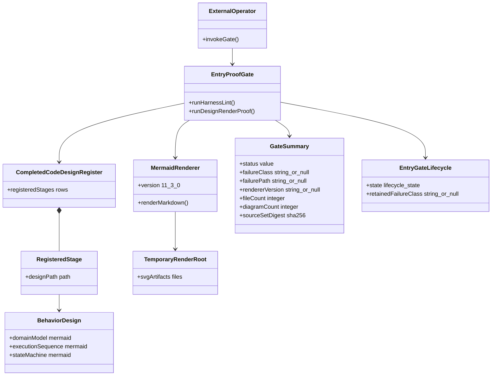
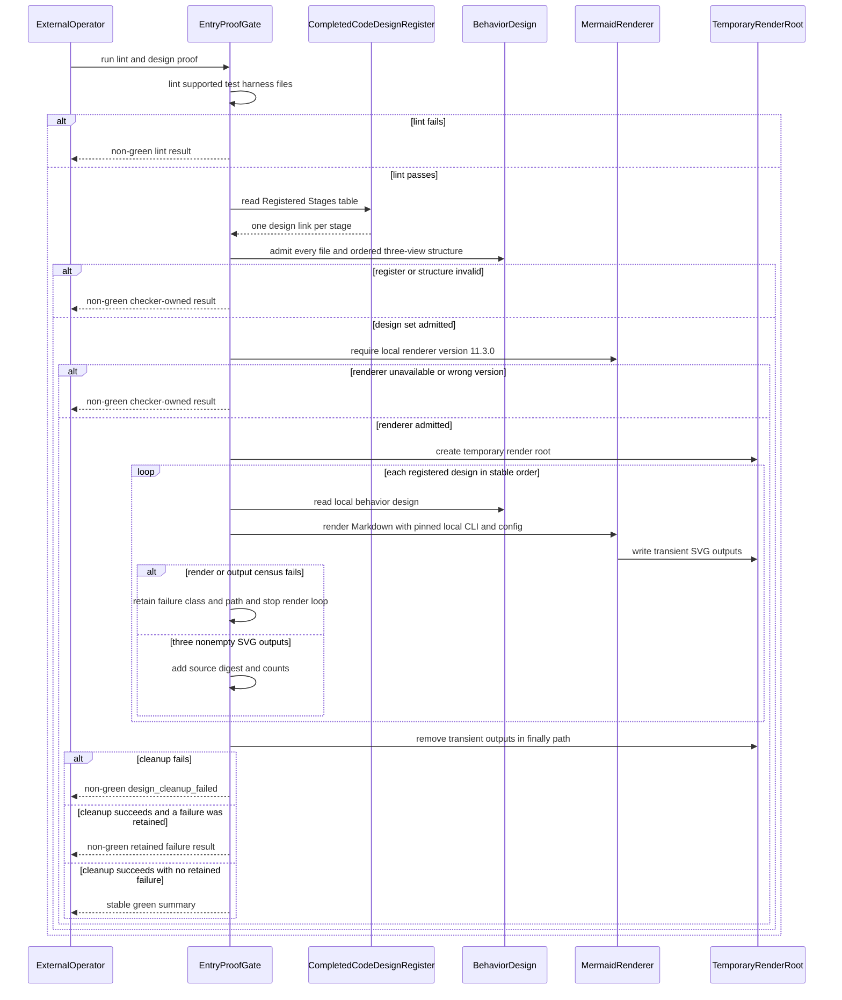
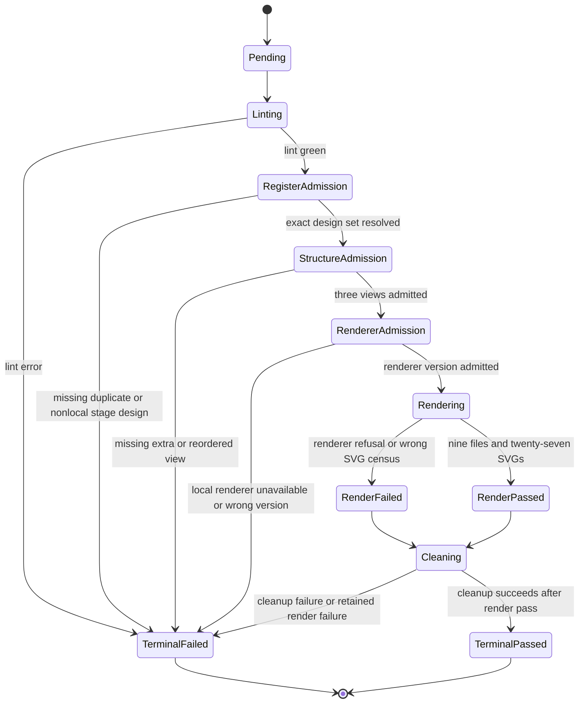

# M05 Entry Proof Gates Behavior Design

**Status**: Accepted by F_H for T-251 implementation
**Ticket**: T-251
**Authority**: T-242 amendments A1 and A6; TypeScript realization guardrails

## Purpose

Restore the existing test-harness lint gate and replace Mermaid render
attestation with one local, pinned, reproducible design proof. The gate checks
structure and renderer acceptance only; F_H and axiom review still judge design
meaning.

## Domain Model

## Execution Sequence

## Lifecycle State Machine

## Invariants And Axiom Check

| Invariant | Design consequence |
|---|---|
| The A5 register is the reviewed stage census, not product authority | Read only its `Registered Stages` design links; requirements still govern meaning. |
| Every stage has exactly three disambiguating views | Require `classDiagram`, `sequenceDiagram`, and `stateDiagram-v2` in order. |
| Reproducibility is project state | Use exact local dev dependencies and committed config; reject global-only `mmdc`. |
| Rendering is proof, not a new design artifact | Write SVGs only below an OS temporary root and delete them. |
| Syntax does not prove semantics | Emit structural/render truth only; retain independent axiom and F_H review. |
| Proportionality governs the gate | Do not add pixel comparison, screenshots, browser matrices, or broad historical scans. |
| Dead test residue does not carry behavior | Remove only symbols with zero live references after the engine-driven replacement. |

## Cross-View Axiom Matrix

| Axiom | Authority | Domain evidence | Sequence evidence | State evidence | Native enforcement | Admission/compiler enforcement | Verdict | Gap owner |
|---|---|---|---|---|---|---|---|---|
| Registered stages have one local behavior design | A5 register; realization guardrails | Register aggregates stage links to behavior designs | Gate admits the full register before rendering | Invalid register terminates before renderer admission | Local-path and uniqueness checks | `design_register_invalid` | pass | T-251 |
| Every active stage exposes three ordered views | F_H three-view mandate | BehaviorDesign owns domain, sequence, and state blocks | Structure admission precedes renderer invocation | Invalid shape terminates before rendering | Exact three-block root census | `design_three_view_invalid` | pass | T-251 |
| Renderer proof is reproducible project state | T-242 A6 | MermaidRenderer has exact local version | Version admission occurs before temporary output | Wrong/missing renderer is terminal | Exact dev dependencies and config | Renderer version check | pass | T-251 |
| Every render path cleans transient output | Proof hygiene | TemporaryRenderRoot is subordinate to the gate | Cleanup is a finally-path before either terminal render result | Render pass/fail both enter `Cleaning` | `try/finally` and recursive removal | `design_cleanup_failed` on cleanup refusal | pass | T-251 |
| Syntax proof does not claim semantic acceptance | SPEC_METHOD; design guardrails | GateSummary carries render facts, not axiom verdicts | Renderer returns counts/digest only | `TerminalPassed` means parse/render green only | Closed summary fields | Independent axiom/F_H review remains external | pass | T-251 |
| Lint cleanup removes no behavior | T-242 A1 | Dead residues have zero live references | Lint runs before design proof; no test path changes | Lint error is terminal without suppression | Deletion-only diff and ESLint | Focused T-188/T-180/parse tests | pass | T-251 |
| Proof tooling is excluded from the product package | Product package allowlist | Gate/config/fixtures/tests remain under `test_env` | Pack proof runs after gate proof | Package leakage is non-green closure truth | Existing `files` allowlist plus dev-only dependencies | `npm pack --dry-run` path census | pass | T-251 |
| GTL/GraphFunction calibration | ODD executable design gate | This is proof tooling, not an ODD constructive carrier | No graph, worker, prompt, traversal, or closure messages | No ABG runtime states exist | No product code or catalog row | Not admitted by GTL/ABG runtime | not_applicable | none |

**Design verdict**: `accepted`. Independent review and F_H accepted this proof
boundary for the bounded T-251 realization.

## Exact Proof Contract

- Default set: nine behavior-design files named by the A5 register and no glob.
- Default expected result: nine files, 27 diagrams, three SVGs per file.
- Renderer config: strict security, neutral theme, deterministic identifiers,
  and one fixed seed; output bytes remain transient and are not compared.
- Future input: `--file <path>` applies the same three-view proof to one
  pre-code design without changing the retrospective default set.
- Negative fixture: three structurally present views with invalid Mermaid in
  one view; the gate returns nonzero without asserting vendor stack text.
- Stable output: status, renderer version, counts, and digest of ordered source
  paths and contents. Digest input uses design-root-relative POSIX paths plus
  exact source bytes; absolute workspace paths never enter the digest. The
  renderer version remains null unless local version admission succeeds.
- The local renderer version must equal `11.3.0`; missing or different local
  tooling is non-green and ambient global `mmdc` is ignored.
- Checker-owned failure classes are `design_register_invalid`,
  `design_three_view_invalid`, `design_mermaid_render_failed`, and
  `design_render_output_invalid`, `design_renderer_unavailable`,
  `design_renderer_version_mismatch`, and `design_cleanup_failed`. Each result
  carries the implicated path when one exists. Vendor stack text is diagnostic
  detail, not the asserted contract.
- Gate and config live under `test_env/gates`; fixtures and tests remain under
  `test_env`. Only package scripts and dev-dependency metadata change outside
  that excluded proof tree, except the generator-owned
  `product-toolchain-manifest.json` content digest necessarily derived from
  those root `package.json` bytes. No other generated-publication output may
  change.
- Rendering is fail-fast after the first checker-owned render/output failure,
  but terminal reporting waits for the mandatory cleanup finally-path.

## Exact Lint Cleanup Set

The ten currently reported errors are removed together with six symbols whose
only references are inside that dead chain:

- `constructDerivedDependencyInstructionTruth`;
- `constructDerivedProofDepthInstructionTruth`;
- `foldRequirementEvidence`;
- `requirementAbgTruthRefFromRequirementProofCoverage`;
- `assuranceCloseTruthRef`; and
- `requirementAbgTruthRefFromAssuranceClosureDecision`.

This is one deletion-only semantic set. Removing the reported helpers without
their transitive-only imports would manufacture a new lint failure.

## Pre-Code Applicability

- Python derivation, GTL carrier, GraphFunction body, F_P/F_H behavior, and
  product runtime semantics: reasoned `not_applicable`; this is development
  proof tooling under the TypeScript tenant.
- Product package boundary: applicable. All gate/config/fixture/test files stay
  beneath excluded `test_env/**`, dev dependencies remain unbundled, and
  `npm pack --dry-run` proves no proof-tool payload enters the product. Because
  the published payload includes root `package.json`, the existing T-223
  generator refreshes only its manifest-level product-content digest.
- Irreducible carriers: register row, behavior design, renderer, temporary root,
  lifecycle, and gate summary.
- Strict lane: ESLint for dead residue plus the pinned real Mermaid renderer.
- Unit lane: checker-owned structural and malformed-render differentials, with
  existing T-188/T-180 tests proving deletion-only behavior preservation.
- Negative proof: malformed three-view fixture reaches
  `design_mermaid_render_failed` and produces no retained output.

## Non-Scope

No product runtime change, diagram semantic checker, automatic F_H approval,
committed render output, hostile path hardening, or inclusion in ordinary
`build:semantic`. T-250's semantic version-basis change remains separately
blocked for review.
