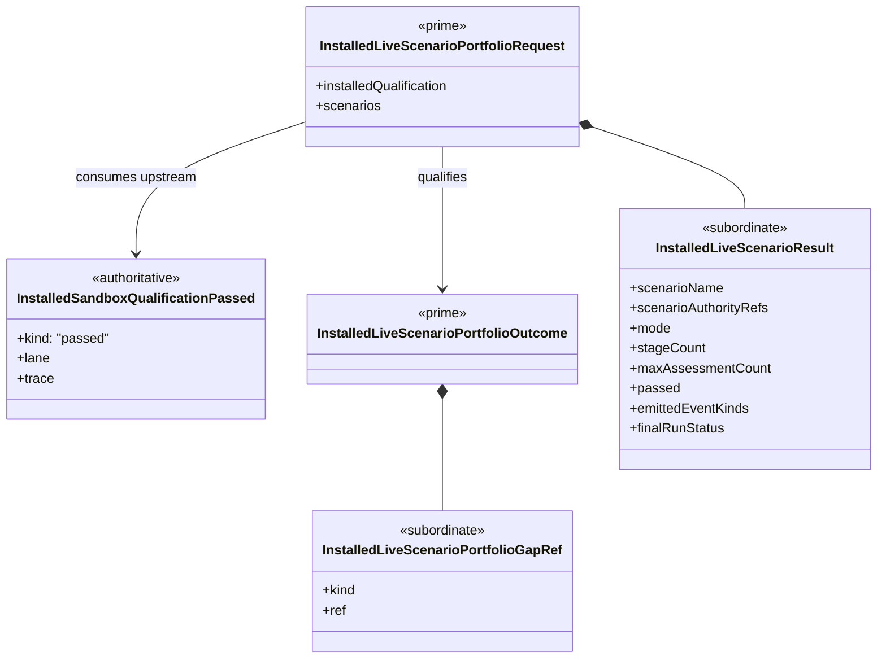

# M05 Installed Live Portfolio Structural Carrier Diagram

**Status**: Completed
**Date**: 2026-04-24
**Derived from**: [M05_INSTALLED_LIVE_PORTFOLIO_DERIVATION.md](./M05_INSTALLED_LIVE_PORTFOLIO_DERIVATION.md), [M05_INSTALLED_LIVE_PORTFOLIO_FIRST_SLICE_IACS.md](./M05_INSTALLED_LIVE_PORTFOLIO_FIRST_SLICE_IACS.md), [T-031](../../.ai-workspace/tickets/completed/T-031-realize-typescript-m05-installed-live-scenario-portfolio-parity-against-the-python-sandbox-live-reference-line.md)

