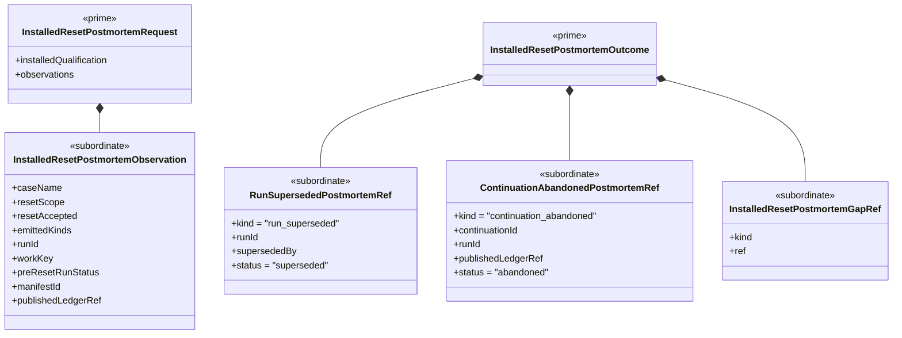

# M05 Installed Reset Postmortem Structural Carrier Diagram

**Status**: Completed
**Date**: 2026-04-24
**Derived from**: [M05_INSTALLED_RESET_POSTMORTEM_DERIVATION.md](./M05_INSTALLED_RESET_POSTMORTEM_DERIVATION.md), [M05_INSTALLED_RESET_POSTMORTEM_FIRST_SLICE_IACS.md](./M05_INSTALLED_RESET_POSTMORTEM_FIRST_SLICE_IACS.md), [T-032](../../.ai-workspace/tickets/completed/T-032-realize-typescript-m05-installed-reset-postmortem-parity-over-canonical-reset-and-continuation-law.md)

