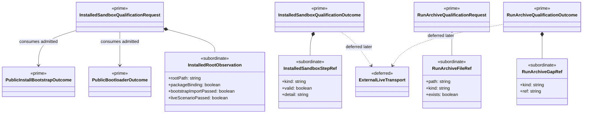

# M05 Installed Sandbox Structural Carrier Diagram

**Status**: Completed
**Date**: 2026-04-24
**Derived from**: [M05_INSTALLED_SANDBOX_DERIVATION.md](./M05_INSTALLED_SANDBOX_DERIVATION.md), [M05_INSTALLED_SANDBOX_FIRST_SLICE_IACS.md](./M05_INSTALLED_SANDBOX_FIRST_SLICE_IACS.md), [T-022](../../.ai-workspace/tickets/completed/T-022-realize-typescript-m05-installed-sandbox-live-lane-and-archive-proof-under-explicit-installed-runtime-qualification-law.md)

## Purpose

Render the installed-line `M05` slice as one module-bounded Mermaid UML
carrier topology so Prime Rule, visibility, and deferred-family discipline are
inspectable before implementation starts.

## Diagram

## Reading Rules

- `InstalledSandboxQualificationRequest` / `Outcome` and
  `RunArchiveQualificationRequest` / `Outcome` are the only prime outer
  carriers in this slice.
- completed `M04` delivery outcomes remain upstream authoritative truth.
- installed-root observations, installed step refs, archive file refs, and
  archive gap refs stay subordinate.
- external live-agent transport remains deferred so this slice does not
  silently absorb a later live qualification doctrine.

## Sign-Off Claim

This installed-line qualification diagram is lawful only if the future
TypeScript code:

- admits one closed installed proof request family,
- admits one closed archive proof request family,
- evaluates installed and archive proof over already observed delivery truth,
  and
- keeps external live-agent transport deferred until a successor ticket opens
  it.
